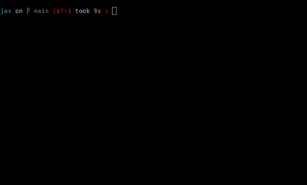

# 调试介绍

> 原文：[`jax.readthedocs.io/en/latest/debugging.html`](https://jax.readthedocs.io/en/latest/debugging.html)

本节介绍了一组内置的 JAX 调试方法 — `jax.debug.print()`、`jax.debug.breakpoint()` 和 `jax.debug.callback()` — 您可以将其与各种 JAX 转换一起使用。

让我们从 `jax.debug.print()` 开始。

## JAX 的 `debug.print` 用于高级别

**TL;DR** 这是一个经验法则：

+   对于使用 `jax.jit()`、`jax.vmap()` 和其他动态数组值的跟踪，使用 `jax.debug.print()`。

+   对于静态值（例如 dtypes 和数组形状），使用 Python [`print()`](https://docs.python.org/3/library/functions.html#print "(在 Python v3.12 中)")。

回顾即时编译时，使用 `jax.jit()` 转换函数时，Python 代码在数组的抽象跟踪器的位置执行。因此，Python [`print()`](https://docs.python.org/3/library/functions.html#print "(在 Python v3.12 中)") 函数只会打印此跟踪器值：

```py
import jax
import jax.numpy as jnp

@jax.jit
def f(x):
  print("print(x) ->", x)
  y = jnp.sin(x)
  print("print(y) ->", y)
  return y

result = f(2.) 
```

```py
print(x) -> Traced<ShapedArray(float32[], weak_type=True)>with<DynamicJaxprTrace(level=1/0)>
print(y) -> Traced<ShapedArray(float32[], weak_type=True)>with<DynamicJaxprTrace(level=1/0)> 
```

Python 的 `print` 在跟踪时间执行，即在运行时值存在之前。如果要打印实际的运行时值，可以使用 `jax.debug.print()`：

```py
@jax.jit
def f(x):
  jax.debug.print("jax.debug.print(x) -> {x}", x=x)
  y = jnp.sin(x)
  jax.debug.print("jax.debug.print(y) -> {y}", y=y)
  return y

result = f(2.) 
```

```py
jax.debug.print(x) -> 2.0
jax.debug.print(y) -> 0.9092974066734314 
```

类似地，在 `jax.vmap()` 内部，使用 Python 的 `print` 只会打印跟踪器；要打印正在映射的值，请使用 `jax.debug.print()`：

```py
def f(x):
  jax.debug.print("jax.debug.print(x) -> {}", x)
  y = jnp.sin(x)
  jax.debug.print("jax.debug.print(y) -> {}", y)
  return y

xs = jnp.arange(3.)

result = jax.vmap(f)(xs) 
```

```py
jax.debug.print(x) -> 0.0
jax.debug.print(x) -> 1.0
jax.debug.print(x) -> 2.0
jax.debug.print(y) -> 0.0
jax.debug.print(y) -> 0.8414709568023682
jax.debug.print(y) -> 0.9092974066734314 
```

这里是使用 `jax.lax.map()` 的结果，它是一个顺序映射而不是向量化：

```py
result = jax.lax.map(f, xs) 
```

```py
jax.debug.print(x) -> 0.0
jax.debug.print(y) -> 0.0
jax.debug.print(x) -> 1.0
jax.debug.print(y) -> 0.8414709568023682
jax.debug.print(x) -> 2.0
jax.debug.print(y) -> 0.9092974066734314 
```

注意顺序不同，如 `jax.vmap()` 和 `jax.lax.map()` 以不同方式计算相同结果。在调试时，评估顺序的细节正是您可能需要检查的。

下面是一个关于 `jax.grad()` 的示例，其中 `jax.debug.print()` 仅打印前向传递。在这种情况下，行为类似于 Python 的 [`print()`](https://docs.python.org/3/library/functions.html#print "(在 Python v3.12 中)")，但如果在调用期间应用 `jax.jit()`，它是一致的。

```py
def f(x):
  jax.debug.print("jax.debug.print(x) -> {}", x)
  return x ** 2

result = jax.grad(f)(1.) 
```

```py
jax.debug.print(x) -> 1.0 
```

有时，当参数彼此不依赖时，调用 `jax.debug.print()` 可能会以不同的顺序打印它们，当使用 JAX 转换进行分阶段时。如果需要原始顺序，例如首先是 `x: ...` 然后是 `y: ...`，请添加 `ordered=True` 参数。

例如：

```py
@jax.jit
def f(x, y):
  jax.debug.print("jax.debug.print(x) -> {}", x, ordered=True)
  jax.debug.print("jax.debug.print(y) -> {}", y, ordered=True)
  return x + y

f(1, 2) 
```

```py
jax.debug.print(x) -> 1
jax.debug.print(y) -> 2 
```

```py
Array(3, dtype=int32, weak_type=True) 
```

要了解更多关于 `jax.debug.print()` 及其详细信息，请参阅高级调试。

## JAX 的 `debug.breakpoint` 用于类似 `pdb` 的调试

**TL;DR** 使用 `jax.debug.breakpoint()` 暂停您的 JAX 程序执行以检查值。

要在调试期间暂停编译的 JAX 程序的某些点，您可以使用 `jax.debug.breakpoint()`。提示类似于 Python 的 `pdb`，允许您检查调用堆栈中的值。实际上，`jax.debug.breakpoint()` 是 `jax.debug.callback()` 的应用，用于捕获有关调用堆栈的信息。

要在 `breakpoint` 调试会话期间打印所有可用命令，请使用 `help` 命令。（完整的调试器命令、其强大之处及限制在高级调试中有详细介绍。）

这是调试器会话可能看起来的示例：

```py
@jax.jit
def f(x):
  y, z = jnp.sin(x), jnp.cos(x)
  jax.debug.breakpoint()
  return y * z
f(2.) # ==> Pauses during execution 
```



对于依赖值的断点，您可以使用像`jax.lax.cond()`这样的运行时条件：

```py
def breakpoint_if_nonfinite(x):
  is_finite = jnp.isfinite(x).all()
  def true_fn(x):
    pass
  def false_fn(x):
    jax.debug.breakpoint()
  jax.lax.cond(is_finite, true_fn, false_fn, x)

@jax.jit
def f(x, y):
  z = x / y
  breakpoint_if_nonfinite(z)
  return z

f(2., 1.) # ==> No breakpoint 
```

```py
Array(2., dtype=float32, weak_type=True) 
```

```py
f(2., 0.) # ==> Pauses during execution 
```

## JAX 调试回调以增强调试期间的控制

`jax.debug.print()`和`jax.debug.breakpoint()`都使用更灵活的`jax.debug.callback()`实现，它通过 Python 回调执行主机端逻辑，提供更大的控制。它与`jax.jit()`、`jax.vmap()`、`jax.grad()`和其他转换兼容（有关更多信息，请参阅外部回调的回调类型表）。

例如：

```py
import logging

def log_value(x):
  logging.warning(f'Logged value: {x}')

@jax.jit
def f(x):
  jax.debug.callback(log_value, x)
  return x

f(1.0); 
```

```py
WARNING:root:Logged value: 1.0 
```

此回调与其他转换兼容，包括`jax.vmap()`和`jax.grad()`：

```py
x = jnp.arange(5.0)
jax.vmap(f)(x); 
```

```py
WARNING:root:Logged value: 0.0
WARNING:root:Logged value: 1.0
WARNING:root:Logged value: 2.0
WARNING:root:Logged value: 3.0
WARNING:root:Logged value: 4.0 
```

```py
jax.grad(f)(1.0); 
```

```py
WARNING:root:Logged value: 1.0 
```

这使得`jax.debug.callback()`在通用调试中非常有用。

您可以在外部回调中了解更多关于`jax.debug.callback()`和其他类型 JAX 回调的信息。

## 下一步

查看高级调试以了解更多关于在 JAX 中调试的信息。
