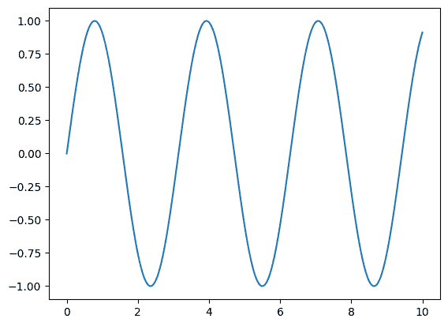

# 如何在 JAX 中思考

> 原文：[`jax.readthedocs.io/en/latest/notebooks/thinking_in_jax.html`](https://jax.readthedocs.io/en/latest/notebooks/thinking_in_jax.html)

 

JAX 提供了一个简单而强大的 API 用于编写加速数值代码，但在 JAX 中有效工作有时需要额外考虑。本文档旨在帮助建立对 JAX 如何运行的基础理解，以便您更有效地使用它。

## JAX vs. NumPy

**关键概念：**

+   JAX 提供了一个方便的类似于 NumPy 的接口。

+   通过鸭子类型，JAX 数组通常可以直接替换 NumPy 数组。

+   不像 NumPy 数组，JAX 数组总是不可变的。

NumPy 提供了一个众所周知且功能强大的 API 用于处理数值数据。为方便起见，JAX 提供了 `jax.numpy`，它紧密反映了 NumPy API，并为进入 JAX 提供了便捷的入口。几乎可以用 `jax.numpy` 完成 `numpy` 可以完成的任何事情：

```py
import matplotlib.pyplot as plt
import numpy as np

x_np = np.linspace(0, 10, 1000)
y_np = 2 * np.sin(x_np) * np.cos(x_np)
plt.plot(x_np, y_np); 
```



```py
import jax.numpy as jnp

x_jnp = jnp.linspace(0, 10, 1000)
y_jnp = 2 * jnp.sin(x_jnp) * jnp.cos(x_jnp)
plt.plot(x_jnp, y_jnp); 
```


代码块除了用 `jnp` 替换 `np` 外，其余完全相同。正如我们所见，JAX 数组通常可以直接替换 NumPy 数组，用于诸如绘图等任务。

这些数组本身是作为不同的 Python 类型实现的：

```py
type(x_np) 
```

```py
numpy.ndarray 
```

```py
type(x_jnp) 
```

```py
jaxlib.xla_extension.ArrayImpl 
```

Python 的 [鸭子类型](https://en.wikipedia.org/wiki/Duck_typing) 允许在许多地方可互换使用 JAX 数组和 NumPy 数组。

然而，JAX 和 NumPy 数组之间有一个重要的区别：JAX 数组是不可变的，一旦创建，其内容无法更改。

这里有一个在 NumPy 中突变数组的例子：

```py
# NumPy: mutable arrays
x = np.arange(10)
x[0] = 10
print(x) 
```

```py
[10  1  2  3  4  5  6  7  8  9] 
```

在 JAX 中，等效操作会导致错误，因为 JAX 数组是不可变的：

```py
%xmode minimal 
```

```py
Exception reporting mode: Minimal 
```

```py
# JAX: immutable arrays
x = jnp.arange(10)
x[0] = 10 
```

```py
TypeError: '<class 'jaxlib.xla_extension.ArrayImpl'>' object does not support item assignment. JAX arrays are immutable. Instead of ``x[idx] = y``, use ``x = x.at[idx].set(y)`` or another .at[] method: https://jax.readthedocs.io/en/latest/_autosummary/jax.numpy.ndarray.at.html 
```

对于更新单个元素，JAX 提供了一个 [索引更新语法](https://jax.readthedocs.io/en/latest/jax.ops.html#indexed-update-operators)，返回一个更新后的副本：

```py
y = x.at[0].set(10)
print(x)
print(y) 
```

```py
[0 1 2 3 4 5 6 7 8 9]
[10  1  2  3  4  5  6  7  8  9] 
```

## NumPy、lax 和 XLA：JAX API 层次结构

**关键概念：**

+   `jax.numpy` 是一个提供熟悉接口的高级包装器。

+   `jax.lax` 是一个更严格且通常更强大的低级 API。

+   所有 JAX 操作都是基于 [XLA](https://www.tensorflow.org/xla/) – 加速线性代数编译器中的操作实现的。

如果您查看 `jax.numpy` 的源代码，您会看到所有操作最终都是以 `jax.lax` 中定义的函数形式表达的。您可以将 `jax.lax` 视为更严格但通常更强大的 API，用于处理多维数组。

例如，虽然`jax.numpy`将隐式促进参数以允许不同数据类型之间的操作，但`jax.lax`不会：

```py
import jax.numpy as jnp
jnp.add(1, 1.0)  # jax.numpy API implicitly promotes mixed types. 
```

```py
Array(2., dtype=float32, weak_type=True) 
```

```py
from jax import lax
lax.add(1, 1.0)  # jax.lax API requires explicit type promotion. 
```

```py
MLIRError: Verification failed:
error: "jit(add)/jit(main)/add"(callsite("<module>"("/tmp/ipykernel_2814/3435837498.py":2:0) at callsite("run_code"("/home/docs/checkouts/readthedocs.org/user_builds/jax/envs/latest/lib/python3.10/site-packages/IPython/core/interactiveshell.py":3577:0) at callsite("run_ast_nodes"("/home/docs/checkouts/readthedocs.org/user_builds/jax/envs/latest/lib/python3.10/site-packages/IPython/core/interactiveshell.py":3517:0) at callsite("run_cell_async"("/home/docs/checkouts/readthedocs.org/user_builds/jax/envs/latest/lib/python3.10/site-packages/IPython/core/interactiveshell.py":3334:0) at callsite("_pseudo_sync_runner"("/home/docs/checkouts/readthedocs.org/user_builds/jax/envs/latest/lib/python3.10/site-packages/IPython/core/async_helpers.py":129:0) at callsite("_run_cell"("/home/docs/checkouts/readthedocs.org/user_builds/jax/envs/latest/lib/python3.10/site-packages/IPython/core/interactiveshell.py":3130:0) at callsite("run_cell"("/home/docs/checkouts/readthedocs.org/user_builds/jax/envs/latest/lib/python3.10/site-packages/IPython/core/interactiveshell.py":3075:0) at callsite("run_cell"("/home/docs/checkouts/readthedocs.org/user_builds/jax/envs/latest/lib/python3.10/site-packages/ipykernel/zmqshell.py":549:0) at callsite("do_execute"("/home/docs/checkouts/readthedocs.org/user_builds/jax/envs/latest/lib/python3.10/site-packages/ipykernel/ipkernel.py":449:0) at "execute_request"("/home/docs/checkouts/readthedocs.org/user_builds/jax/envs/latest/lib/python3.10/site-packages/ipykernel/kernelbase.py":778:0))))))))))): op requires the same element type for all operands and results

The above exception was the direct cause of the following exception:

ValueError: Cannot lower jaxpr with verifier errors:
	op requires the same element type for all operands and results
		at loc("jit(add)/jit(main)/add"(callsite("<module>"("/tmp/ipykernel_2814/3435837498.py":2:0) at callsite("run_code"("/home/docs/checkouts/readthedocs.org/user_builds/jax/envs/latest/lib/python3.10/site-packages/IPython/core/interactiveshell.py":3577:0) at callsite("run_ast_nodes"("/home/docs/checkouts/readthedocs.org/user_builds/jax/envs/latest/lib/python3.10/site-packages/IPython/core/interactiveshell.py":3517:0) at callsite("run_cell_async"("/home/docs/checkouts/readthedocs.org/user_builds/jax/envs/latest/lib/python3.10/site-packages/IPython/core/interactiveshell.py":3334:0) at callsite("_pseudo_sync_runner"("/home/docs/checkouts/readthedocs.org/user_builds/jax/envs/latest/lib/python3.10/site-packages/IPython/core/async_helpers.py":129:0) at callsite("_run_cell"("/home/docs/checkouts/readthedocs.org/user_builds/jax/envs/latest/lib/python3.10/site-packages/IPython/core/interactiveshell.py":3130:0) at callsite("run_cell"("/home/docs/checkouts/readthedocs.org/user_builds/jax/envs/latest/lib/python3.10/site-packages/IPython/core/interactiveshell.py":3075:0) at callsite("run_cell"("/home/docs/checkouts/readthedocs.org/user_builds/jax/envs/latest/lib/python3.10/site-packages/ipykernel/zmqshell.py":549:0) at callsite("do_execute"("/home/docs/checkouts/readthedocs.org/user_builds/jax/envs/latest/lib/python3.10/site-packages/ipykernel/ipkernel.py":449:0) at "execute_request"("/home/docs/checkouts/readthedocs.org/user_builds/jax/envs/latest/lib/python3.10/site-packages/ipykernel/kernelbase.py":778:0))))))))))))
Define JAX_DUMP_IR_TO to dump the module. 
```

如果直接使用`jax.lax`，在这种情况下你将需要显式地进行类型提升：

```py
lax.add(jnp.float32(1), 1.0) 
```

```py
Array(2., dtype=float32) 
```

除了这种严格性外，`jax.lax`还提供了一些比 NumPy 支持的更一般操作更高效的 API。

例如，考虑一个 1D 卷积，在 NumPy 中可以这样表达：

```py
x = jnp.array([1, 2, 1])
y = jnp.ones(10)
jnp.convolve(x, y) 
```

```py
Array([1., 3., 4., 4., 4., 4., 4., 4., 4., 4., 3., 1.], dtype=float32) 
```

在幕后，这个 NumPy 操作被转换为由[`lax.conv_general_dilated`](https://jax.readthedocs.io/en/latest/_autosummary/jax.lax.conv_general_dilated.html)实现的更通用的卷积：

```py
from jax import lax
result = lax.conv_general_dilated(
    x.reshape(1, 1, 3).astype(float),  # note: explicit promotion
    y.reshape(1, 1, 10),
    window_strides=(1,),
    padding=[(len(y) - 1, len(y) - 1)])  # equivalent of padding='full' in NumPy
result[0, 0] 
```

```py
Array([1., 3., 4., 4., 4., 4., 4., 4., 4., 4., 3., 1.], dtype=float32) 
```

这是一种批处理卷积操作，专为深度神经网络中经常使用的卷积类型设计，需要更多的样板代码，但比 NumPy 提供的卷积更灵活和可扩展（有关 JAX 卷积的更多细节，请参见[Convolutions in JAX](https://jax.readthedocs.io/en/latest/notebooks/convolutions.html)）。

从本质上讲，所有`jax.lax`操作都是 XLA 中操作的 Python 包装器；例如，在这里，卷积实现由[XLA:ConvWithGeneralPadding](https://www.tensorflow.org/xla/operation_semantics#convwithgeneralpadding_convolution)提供。每个 JAX 操作最终都是基于这些基本 XLA 操作表达的，这就是使得即时（JIT）编译成为可能的原因。

## 要 JIT 或不要 JIT

**关键概念：**

+   默认情况下，JAX 按顺序逐个执行操作。

+   使用即时（JIT）编译装饰器，可以优化操作序列并一次运行：

+   并非所有 JAX 代码都可以进行 JIT 编译，因为它要求数组形状在编译时是静态且已知的。

所有 JAX 操作都是基于 XLA 表达的事实，使得 JAX 能够使用 XLA 编译器非常高效地执行代码块。

例如，考虑此函数，它对二维矩阵的行进行标准化，表达为`jax.numpy`操作：

```py
import jax.numpy as jnp

def norm(X):
  X = X - X.mean(0)
  return X / X.std(0) 
```

可以使用`jax.jit`变换创建函数的即时编译版本：

```py
from jax import jit
norm_compiled = jit(norm) 
```

此函数返回与原始函数相同的结果，达到标准浮点精度：

```py
np.random.seed(1701)
X = jnp.array(np.random.rand(10000, 10))
np.allclose(norm(X), norm_compiled(X), atol=1E-6) 
```

```py
True 
```

但由于编译（其中包括操作的融合、避免分配临时数组以及其他许多技巧），在 JIT 编译的情况下，执行时间可以比非常数级别快得多（请注意使用`block_until_ready()`以考虑 JAX 的[异步调度](https://jax.readthedocs.io/en/latest/async_dispatch.html)）：

```py
%timeit norm(X).block_until_ready()
%timeit norm_compiled(X).block_until_ready() 
```

```py
319 μs ± 1.98 μs per loop (mean ± std. dev. of 7 runs, 1,000 loops each)
272 μs ± 849 ns per loop (mean ± std. dev. of 7 runs, 1,000 loops each) 
```

话虽如此，`jax.jit`确实存在一些限制：特别是，它要求所有数组具有静态形状。这意味着一些 JAX 操作与 JIT 编译不兼容。

例如，此操作可以在逐操作模式下执行：

```py
def get_negatives(x):
  return x[x < 0]

x = jnp.array(np.random.randn(10))
get_negatives(x) 
```

```py
Array([-0.10570311, -0.59403396, -0.8680282 , -0.23489487], dtype=float32) 
```

但如果您尝试在 jit 模式下执行它，则会返回错误：

```py
jit(get_negatives)(x) 
```

```py
NonConcreteBooleanIndexError: Array boolean indices must be concrete; got ShapedArray(bool[10])

See https://jax.readthedocs.io/en/latest/errors.html#jax.errors.NonConcreteBooleanIndexError 
```

这是因为该函数生成的数组形状在编译时未知：输出的大小取决于输入数组的值，因此与 JIT 不兼容。

## JIT 机制：跟踪和静态变量

**关键概念：**

+   JIT 和其他 JAX 转换通过跟踪函数来确定其对特定形状和类型输入的影响。

+   不希望被追踪的变量可以标记为*静态*

要有效使用 `jax.jit`，理解其工作原理是很有用的。让我们在一个 JIT 编译的函数中放几个 `print()` 语句，然后调用该函数：

```py
@jit
def f(x, y):
  print("Running f():")
  print(f"  x = {x}")
  print(f"  y = {y}")
  result = jnp.dot(x + 1, y + 1)
  print(f"  result = {result}")
  return result

x = np.random.randn(3, 4)
y = np.random.randn(4)
f(x, y) 
```

```py
Running f():
  x = Traced<ShapedArray(float32[3,4])>with<DynamicJaxprTrace(level=1/0)>
  y = Traced<ShapedArray(float32[4])>with<DynamicJaxprTrace(level=1/0)>
  result = Traced<ShapedArray(float32[3])>with<DynamicJaxprTrace(level=1/0)> 
```

```py
Array([0.25773212, 5.3623195 , 5.403243  ], dtype=float32) 
```

注意，打印语句执行，但打印的不是我们传递给函数的数据，而是打印*追踪器*对象，这些对象代替它们。

这些追踪器对象是 `jax.jit` 用来提取函数指定的操作序列的基本替代物，编码数组的**形状**和**dtype**，但对值是不可知的。然后可以有效地将这个记录的计算序列应用于具有相同形状和 dtype 的新输入，而无需重新执行 Python 代码。

当我们在匹配的输入上再次调用编译函数时，无需重新编译，也不打印任何内容，因为结果在编译的 XLA 中计算，而不是在 Python 中：

```py
x2 = np.random.randn(3, 4)
y2 = np.random.randn(4)
f(x2, y2) 
```

```py
Array([1.4344584, 4.3004413, 7.9897013], dtype=float32) 
```

提取的操作序列编码在 JAX 表达式中，简称为 *jaxpr*。您可以使用 `jax.make_jaxpr` 转换查看 jaxpr：

```py
from jax import make_jaxpr

def f(x, y):
  return jnp.dot(x + 1, y + 1)

make_jaxpr(f)(x, y) 
```

```py
{ lambda ; a:f32[3,4] b:f32[4]. let
    c:f32[3,4] = add a 1.0
    d:f32[4] = add b 1.0
    e:f32[3] = dot_general[
      dimension_numbers=(([1], [0]), ([], []))
      preferred_element_type=float32
    ] c d
  in (e,) } 
```

注意这一后果：因为 JIT 编译是在没有数组内容信息的情况下完成的，所以函数中的控制流语句不能依赖于追踪的值。例如，这将失败：

```py
@jit
def f(x, neg):
  return -x if neg else x

f(1, True) 
```

```py
TracerBoolConversionError: Attempted boolean conversion of traced array with shape bool[]..
The error occurred while tracing the function f at /tmp/ipykernel_2814/2422663986.py:1 for jit. This concrete value was not available in Python because it depends on the value of the argument neg.
See https://jax.readthedocs.io/en/latest/errors.html#jax.errors.TracerBoolConversionError 
```

如果有不希望被追踪的变量，可以将它们标记为静态以供 JIT 编译使用：

```py
from functools import partial

@partial(jit, static_argnums=(1,))
def f(x, neg):
  return -x if neg else x

f(1, True) 
```

```py
Array(-1, dtype=int32, weak_type=True) 
```

请注意，使用不同的静态参数调用 JIT 编译函数会导致重新编译，所以函数仍然如预期般工作：

```py
f(1, False) 
```

```py
Array(1, dtype=int32, weak_type=True) 
```

理解哪些值和操作将是静态的，哪些将被追踪，是有效使用 `jax.jit` 的关键部分。

## 静态与追踪操作

**关键概念：**

+   就像值可以是静态的或者被追踪的一样，操作也可以是静态的或者被追踪的。

+   静态操作在 Python 中在编译时评估；跟踪操作在 XLA 中在运行时编译并评估。

+   使用 `numpy` 进行您希望静态的操作；使用 `jax.numpy` 进行您希望被追踪的操作。

静态和追踪值的区别使得重要的是考虑如何保持静态值的静态。考虑这个函数：

```py
import jax.numpy as jnp
from jax import jit

@jit
def f(x):
  return x.reshape(jnp.array(x.shape).prod())

x = jnp.ones((2, 3))
f(x) 
```

```py
TypeError: Shapes must be 1D sequences of concrete values of integer type, got [Traced<ShapedArray(int32[])>with<DynamicJaxprTrace(level=1/0)>].
If using `jit`, try using `static_argnums` or applying `jit` to smaller subfunctions.
The error occurred while tracing the function f at /tmp/ipykernel_2814/1983583872.py:4 for jit. This value became a tracer due to JAX operations on these lines:

  operation a:i32[2] = convert_element_type[new_dtype=int32 weak_type=False] b
    from line /tmp/ipykernel_2814/1983583872.py:6 (f) 
```

这会因为找到追踪器而不是整数类型的具体值的 1D 序列而失败。让我们向函数中添加一些打印语句，以了解其原因：

```py
@jit
def f(x):
  print(f"x = {x}")
  print(f"x.shape = {x.shape}")
  print(f"jnp.array(x.shape).prod() = {jnp.array(x.shape).prod()}")
  # comment this out to avoid the error:
  # return x.reshape(jnp.array(x.shape).prod())

f(x) 
```

```py
x = Traced<ShapedArray(float32[2,3])>with<DynamicJaxprTrace(level=1/0)>
x.shape = (2, 3)
jnp.array(x.shape).prod() = Traced<ShapedArray(int32[])>with<DynamicJaxprTrace(level=1/0)> 
```

注意尽管`x`被追踪，`x.shape`是一个静态值。然而，当我们在这个静态值上使用`jnp.array`和`jnp.prod`时，它变成了一个被追踪的值，在这种情况下，它不能用于像`reshape()`这样需要静态输入的函数（回想：数组形状必须是静态的）。

一个有用的模式是使用`numpy`进行应该是静态的操作（即在编译时完成），并使用`jax.numpy`进行应该被追踪的操作（即在运行时编译和执行）。对于这个函数，可能会像这样：

```py
from jax import jit
import jax.numpy as jnp
import numpy as np

@jit
def f(x):
  return x.reshape((np.prod(x.shape),))

f(x) 
```

```py
Array([1., 1., 1., 1., 1., 1.], dtype=float32) 
```

因此，在 JAX 程序中的一个标准约定是`import numpy as np`和`import jax.numpy as jnp`，这样两个接口都可以用来更精细地控制操作是以静态方式（使用`numpy`，一次在编译时）还是以追踪方式（使用`jax.numpy`，在运行时优化）执行。
