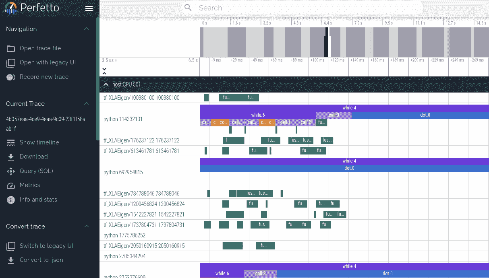
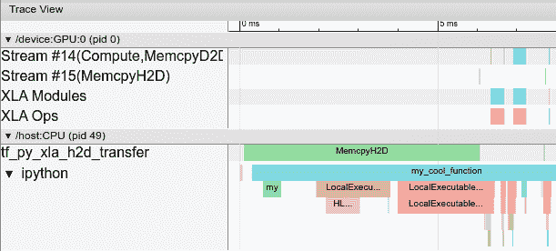

# 对 JAX 程序进行性能分析

> 原文：[`jax.readthedocs.io/en/latest/profiling.html`](https://jax.readthedocs.io/en/latest/profiling.html)

## 使用 Perfetto 查看程序跟踪

我们可以使用 JAX 分析器生成可以使用[Perfetto 可视化工具](https://ui.perfetto.dev)查看的 JAX 程序的跟踪。目前，此方法会阻塞程序，直到点击链接并加载 Perfetto UI 以打开跟踪为止。如果您希望获取性能分析信息而无需任何交互，请查看下面的 Tensorboard 分析器。

```py
with jax.profiler.trace("/tmp/jax-trace", create_perfetto_link=True):
  # Run the operations to be profiled
  key = jax.random.key(0)
  x = jax.random.normal(key, (5000, 5000))
  y = x @ x
  y.block_until_ready() 
```

计算完成后，程序会提示您打开链接到`ui.perfetto.dev`。打开链接后，Perfetto UI 将加载跟踪文件并打开可视化工具。



加载链接后，程序执行将继续。链接在打开一次后将不再有效，但将重定向到一个保持有效的新 URL。然后，您可以在 Perfetto UI 中单击“共享”按钮，创建可与他人共享的跟踪的永久链接。

### 远程分析

在对远程运行的代码进行性能分析（例如在托管的虚拟机上）时，您需要在端口 9001 上建立 SSH 隧道以使链接工作。您可以使用以下命令执行此操作：

```py
$  ssh  -L  9001:127.0.0.1:9001  <user>@<host> 
```

或者如果您正在使用 Google Cloud：

```py
$  gcloud  compute  ssh  <machine-name>  --  -L  9001:127.0.0.1:9001 
```

### 手动捕获

而不是使用`jax.profiler.trace`以编程方式捕获跟踪，您可以通过在感兴趣的脚本中调用`jax.profiler.start_server(<port>)`来启动分析服务器。如果您只需在脚本的某部分保持分析服务器活动，则可以通过调用`jax.profiler.stop_server()`来关闭它。

脚本运行后并且分析服务器已启动后，我们可以通过运行以下命令手动捕获和跟踪：

```py
$  python  -m  jax.collect_profile  <port>  <duration_in_ms> 
```

默认情况下，生成的跟踪信息会被转储到临时目录中，但可以通过传递`--log_dir=<自定义目录>`来覆盖此设置。另外，默认情况下，程序将提示您打开链接到`ui.perfetto.dev`。打开链接后，Perfetto UI 将加载跟踪文件并打开可视化工具。通过传递`--no_perfetto_link`命令可以禁用此功能。或者，您也可以将 Tensorboard 指向`log_dir`以分析跟踪（参见下面的“Tensorboard 分析”部分）。

## TensorBoard 性能分析

[TensorBoard 的分析器](https://www.tensorflow.org/tensorboard/tensorboard_profiling_keras)可用于分析 JAX 程序。Tensorboard 是获取和可视化程序性能跟踪和分析（包括 GPU 和 TPU 上的活动）的好方法。最终结果看起来类似于这样：



### 安装

TensorBoard 分析器仅与捆绑有 TensorFlow 的 TensorBoard 版本一起提供。

```py
pip  install  tensorflow  tensorboard-plugin-profile 
```

如果您已安装了 TensorFlow，则只需安装`tensorboard-plugin-profile` pip 包。请注意仅安装一个版本的 TensorFlow 或 TensorBoard，否则可能会遇到下面描述的“重复插件”错误。有关安装 TensorBoard 的更多信息，请参见[`www.tensorflow.org/guide/profiler`](https://www.tensorflow.org/guide/profiler)。

### 程序化捕获

您可以通过`jax.profiler.start_trace()`和`jax.profiler.stop_trace()`方法来配置您的代码以捕获性能分析器的追踪。调用`start_trace()`时需要指定写入追踪文件的目录。这个目录应该与启动 TensorBoard 时使用的`--logdir`目录相同。然后，您可以使用 TensorBoard 来查看这些追踪信息。

例如，要获取性能分析器的追踪：

```py
import jax

jax.profiler.start_trace("/tmp/tensorboard")

# Run the operations to be profiled
key = jax.random.key(0)
x = jax.random.normal(key, (5000, 5000))
y = x @ x
y.block_until_ready()

jax.profiler.stop_trace() 
```

注意`block_until_ready()`调用。我们使用这个函数来确保设备上的执行被追踪到。有关为什么需要这样做的详细信息，请参见异步调度部分。

您还可以使用`jax.profiler.trace()`上下文管理器作为`start_trace`和`stop_trace`的替代方法：

```py
import jax

with jax.profiler.trace("/tmp/tensorboard"):
  key = jax.random.key(0)
  x = jax.random.normal(key, (5000, 5000))
  y = x @ x
  y.block_until_ready() 
```

要查看追踪信息，请首先启动 TensorBoard（如果尚未启动）：

```py
$  tensorboard  --logdir=/tmp/tensorboard
[...]
Serving  TensorBoard  on  localhost;  to  expose  to  the  network,  use  a  proxy  or  pass  --bind_all
TensorBoard  2.5.0  at  http://localhost:6006/  (Press  CTRL+C  to  quit) 
```

在这个示例中，您应该能够在[`localhost:6006/`](http://localhost:6006/)加载 TensorBoard。您可以使用`--port`标志指定不同的端口。如果在远程服务器上运行 JAX，请参见下面的远程机器上的分析。

然后，要么在右上角的下拉菜单中选择“Profile”，要么直接访问[`localhost:6006/#profile`](http://localhost:6006/#profile)。可用的追踪信息会显示在左侧的“Runs”下拉菜单中。选择您感兴趣的运行，并在“Tools”下选择`trace_viewer`。现在您应该能看到执行时间轴。您可以使用 WASD 键来导航追踪信息，点击或拖动以选择事件并查看底部的更多详细信息。有关使用追踪查看器的更多详细信息，请参阅[这些 TensorFlow 文档](https://www.tensorflow.org/tensorboard/tensorboard_profiling_keras#use_the_tensorflow_profiler_to_profile_model_training_performance)。

您还可以使用`memory_viewer`、`op_profile`和`graph_viewer`工具。

### 通过 TensorBoard 手动捕获

以下是从运行中的程序中手动触发 N 秒追踪的捕获说明。

1.  启动 TensorBoard 服务器：

    ```py
    tensorboard  --logdir  /tmp/tensorboard/ 
    ```

    在[`localhost:6006/`](http://localhost:6006/)处应该能够加载 TensorBoard。您可以使用`--port`标志指定不同的端口。如果在远程服务器上运行 JAX，请参见下面的远程机器上的分析。

1.  在您希望进行分析的 Python 程序或进程中，将以下内容添加到开头的某个位置：

    ```py
    import jax.profiler
    jax.profiler.start_server(9999) 
    ```

    这将启动 TensorBoard 连接到的性能分析器服务器。在继续下一步之前，必须先运行性能分析器服务器。完成后，可以调用`jax.profiler.stop_server()`来关闭它。

    如果你想要分析一个长时间运行的程序片段（例如长时间的训练循环），你可以将此代码放在程序开头并像往常一样启动程序。如果你想要分析一个短程序（例如微基准测试），一种选择是在 IPython shell 中启动分析器服务器，并在下一步开始捕获后用 `%run` 运行短程序。另一种选择是在程序开头启动分析器服务器，并使用 `time.sleep()` 给你足够的时间启动捕获。

1.  打开[`localhost:6006/#profile`](http://localhost:6006/#profile)，并点击左上角的“CAPTURE PROFILE”按钮。将“localhost:9999”作为分析服务的 URL（这是你在上一步中启动的分析器服务器的地址）。输入你想要进行分析的毫秒数，然后点击“CAPTURE”。

1.  如果你想要分析的代码尚未运行（例如在 Python shell 中启动了分析器服务器），请在进行捕获时运行它。

1.  捕获完成后，TensorBoard 应会自动刷新。（并非所有 TensorBoard 分析功能都与 JAX 连接，所以初始时看起来可能没有捕获到任何内容。）在左侧的“工具”下，选择 `trace_viewer`。

    现在你应该可以看到执行的时间轴。你可以使用 WASD 键来导航跟踪，点击或拖动选择事件以在底部查看更多详细信息。参见[这些 TensorFlow 文档](https://www.tensorflow.org/tensorboard/tensorboard_profiling_keras#use_the_tensorflow_profiler_to_profile_model_training_performance)获取有关使用跟踪查看器的更多详细信息。

    你也可以使用 `memory_viewer`、`op_profile` 和 `graph_viewer` 工具。

### 添加自定义跟踪事件

默认情况下，跟踪查看器中的事件大多是低级内部 JAX 函数。你可以使用 `jax.profiler.TraceAnnotation` 和 `jax.profiler.annotate_function()` 在你的代码中添加自定义事件和函数。

### 故障排除

#### GPU 分析

运行在 GPU 上的程序应该在跟踪查看器顶部附近生成 GPU 流的跟踪。如果只看到主机跟踪，请检查程序日志和/或输出，查看以下错误消息。

**如果出现类似 `Could not load dynamic library 'libcupti.so.10.1'` 的错误**

完整错误：

```py
W external/org_tensorflow/tensorflow/stream_executor/platform/default/dso_loader.cc:55] Could not load dynamic library 'libcupti.so.10.1'; dlerror: libcupti.so.10.1: cannot open shared object file: No such file or directory
2020-06-12 13:19:59.822799: E external/org_tensorflow/tensorflow/core/profiler/internal/gpu/cupti_tracer.cc:1422] function cupti_interface_->Subscribe( &subscriber_, (CUpti_CallbackFunc)ApiCallback, this)failed with error CUPTI could not be loaded or symbol could not be found. 
```

将`libcupti.so`的路径添加到环境变量`LD_LIBRARY_PATH`中。（尝试使用`locate libcupti.so`来找到路径。）例如：

```py
export  LD_LIBRARY_PATH=/usr/local/cuda-10.1/extras/CUPTI/lib64/:$LD_LIBRARY_PATH 
```

即使在做了以上步骤后仍然收到 `Could not load dynamic library` 错误消息，请检查 GPU 跟踪是否仍然显示在跟踪查看器中。有时即使一切正常，它也会出现此消息，因为它在多个位置查找 `libcupti` 库。

**如果出现类似 `failed with error CUPTI_ERROR_INSUFFICIENT_PRIVILEGES` 的错误**

完整错误：

```py
E  external/org_tensorflow/tensorflow/core/profiler/internal/gpu/cupti_tracer.cc:1445]  function  cupti_interface_->EnableCallback(  0  ,  subscriber_,  CUPTI_CB_DOMAIN_DRIVER_API,  cbid)failed  with  error  CUPTI_ERROR_INSUFFICIENT_PRIVILEGES
2020-06-12  14:31:54.097791:  E  external/org_tensorflow/tensorflow/core/profiler/internal/gpu/cupti_tracer.cc:1487]  function  cupti_interface_->ActivityDisable(activity)failed  with  error  CUPTI_ERROR_NOT_INITIALIZED 
```

运行以下命令（注意这将需要重新启动）：

```py
echo  'options nvidia "NVreg_RestrictProfilingToAdminUsers=0"'  |  sudo  tee  -a  /etc/modprobe.d/nvidia-kernel-common.conf
sudo  update-initramfs  -u
sudo  reboot  now 
```

查看更多关于此错误的信息，请参阅[NVIDIA 的文档](https://developer.nvidia.com/nvidia-development-tools-solutions-err-nvgpuctrperm-cupti)。

#### 在远程机器上进行性能分析

如果要分析的 JAX 程序正在远程机器上运行，一种选择是在远程机器上执行上述所有说明（特别是在远程机器上启动 TensorBoard 服务器），然后使用 SSH 本地端口转发从本地访问 TensorBoard Web UI。使用以下 SSH 命令将默认的 TensorBoard 端口 6006 从本地转发到远程机器：

```py
ssh  -L  6006:localhost:6006  <remote  server  address> 
```

或者如果您正在使用 Google Cloud：

```py
$  gcloud  compute  ssh  <machine-name>  --  -L  6006:localhost:6006 
```  #### 多个 TensorBoard 安装

**如果启动 TensorBoard 失败，并出现类似于`ValueError: Duplicate plugins for name projector`的错误**

这通常是因为安装了两个版本的 TensorBoard 和/或 TensorFlow（例如，`tensorflow`、`tf-nightly`、`tensorboard`和`tb-nightly` pip 包都包含 TensorBoard）。卸载一个 pip 包可能会导致`tensorboard`可执行文件被移除，难以替换，因此可能需要卸载所有内容并重新安装单个版本：

```py
pip  uninstall  tensorflow  tf-nightly  tensorboard  tb-nightly
pip  install  tensorflow 
```

## Nsight

NVIDIA 的`Nsight`工具可用于跟踪和分析 GPU 上的 JAX 代码。有关详情，请参阅[`Nsight`文档](https://developer.nvidia.com/tools-overview)。
