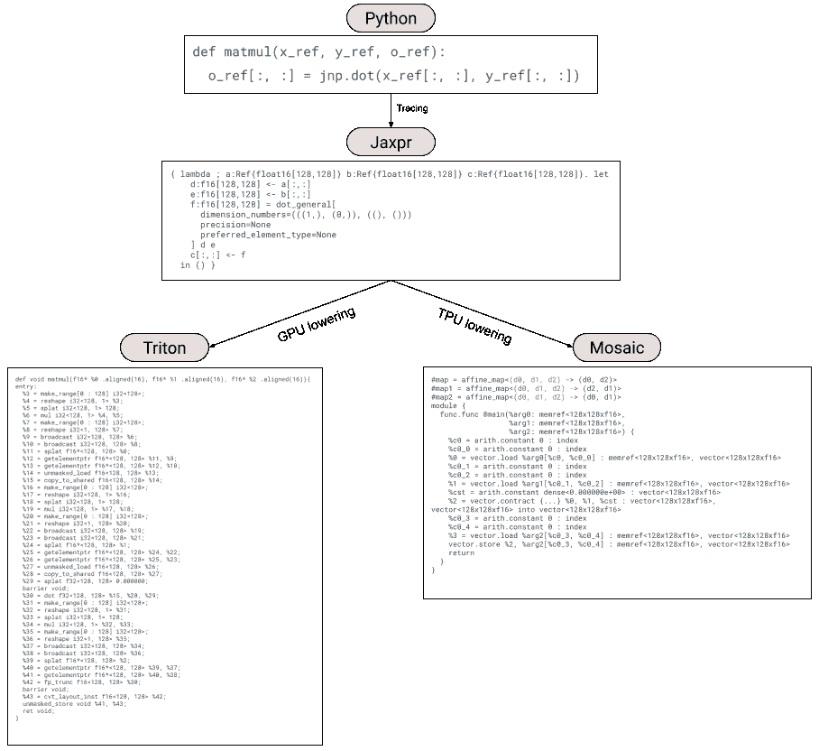

# Pallas 设计

> 原文：[`jax.readthedocs.io/en/latest/pallas/design.html`](https://jax.readthedocs.io/en/latest/pallas/design.html)

在这份文档中，我们解释了初始的 Pallas 设计。这是一些早期设计决策的快照，并且 Pallas 的特定 API 可能已经发生了变化。

## Introduction

JAX 被用于各种工作负载，从大规模机器学习到科学计算。JAX 的成功故事也是 XLA 的成功故事，XLA 是 JAX 的主要编译器目标——XLA 为加速器编译 JAX 程序，并使 JAX 能够扩展到最大的 ML 模型。JAX 描述了在 XLA 表示 HLO 中的逻辑计算。HLO 描述了逻辑上的计算过程，但不涉及物理执行。对于广泛的 ML 应用，XLA 在编译用户程序方面表现良好，但不可避免地，一些用户会遇到 XLA 的限制。在这些情况下，我们需要提供一个“逃生通道”，让专家编写手动调优的内核，以在那个时刻超越 XLA 的性能。此外，ML 系统研究的进展需要一些时间才能被整合到 XLA 中，而用户通常希望提前使用这些优化。随着时间的推移，编译器可以通过手动调优的内核整合已经通过实验验证的优化。

XLA 确实提供了`CustomCall`机制作为一种逃生口，但这需要用户编写 C++代码，在 GPU 上还需要用户了解 CUDA 编程模型。CUDA 编程模型对于许多机器学习 GPU 核心（如矩阵乘法或多头注意力）来说可能过于低级，即使是专家用户也会在使用 CUDA 来实现高效的矩阵乘法或多头注意力时遇到困难。此外，JAX 用户通常熟悉 Python 和类似 NumPy 的数组编程，不涉及编写任何 C++代码或考虑 GPU 并行性。所有流行的机器学习框架都共享这一思想：通过高级操作（如`matmul`或`convolution`）来操作（通常是）数组。不幸的是，这意味着通过`CustomCall`实现自定义操作是一项重大投资，可能需要学习 C++和/或 GPU 编程。

[Triton](https://triton-lang.org/main/index.html)，由 OpenAI 构建和维护的 GPU 编译器，在 ML 编译器领域引起了轰动。Triton 提供了最佳的双赢方案：用于 GPU 核心的基于数组的编程模型。Triton 是 PyTorch 2.0 中`torch.compile`的主要代码生成路径，通过 Torch Inductor 库。Triton 积极地在更高级的表示上隐藏了 GPU 编程的某些方面，以更易于访问的编程模型从 Python 中生成优化的代码。虽然 GPU 比 Triton 提供的更加灵活，但在 ML 领域，Triton 似乎对许多应用程序来说已经足够表达力。

在本文档中，我们描述了 Pallas，这是 JAX 的一个扩展，可以使用类似 Triton 的模型为 GPU 和 TPU 编写核心程序。基于 JAX 的核心语言具有几个优点：

+   虽然 Triton 向用户公开了类似 TPU 的编程模型，即在 L1-cache 的数组块上编写程序，但它足够专业以至于我们不能直接为 TPU 编译 Triton。例如，Triton 提供了专门用于处理并行写入的原子操作，这在 TPU 上并不一定有意义。一个更高级的前端可以将平台的细节抽象化，只显示基于瓦片的编程模型。这样，核心将在不同的硬件平台上可移植。

+   作为基于跟踪的数值计算的前端，JAX 既成熟又广泛使用。通过将核心编程语言嵌入到 JAX 本身中，我们可以重用 JAX 的跟踪基础设施，并提供一个类似 NumPy 的前端，这对用户来说已经很熟悉。

+   JAX 转换是其成功的关键，允许用户表达简单的程序，但通过转换实现复杂的功能。我们可以利用相同的转换（vmap、jvp 等）来转换用户编写的核心。

一个开放的问题是：JAX 真的适合作为核心语言吗？我们认为是的。Triton 表明，一个数组编程语言可以实际用于编写 GPU 核心，而 JAX 正是如此。JAX 还被证明是编译器和程序转换的灵活前端。

我们描述 Pallas 如下：首先描述我们如何扩展 JAX 以支持编写自定义核心。然后展示如何将 Pallas 降低到 Triton 和 Mosaic。最后描述通过 JAX 转换转换 Pallas 核心的现有和潜在方法。

 Pallas 降低路径的可视化

## Pallas：为核心扩展 JAX

我们想要强调的关键点是，Pallas 只是 JAX，附加了一些扩展：

1.  用户现在在他们的 JAX 代码中使用称为`Ref`的引用类型。这使得用户在 JAX 中更加精确地控制内存访问和布局，其物理布局将更加接近。

1.  用户使用 JAX 原语的子集以及一组特定于 Pallas 的原语编写他们的 JAX 程序。

1.  用户通过特殊的`pallas_call`高阶函数将他们的 Pallas 核心嵌入到外部 JAX 程序中，该函数在映射中执行核心。它类似于`pmap`或`shard_map`，但涉及共享内存的引用。

我们将逐个通过示例讨论这三个扩展。

请注意，这些 API 仍处于实验阶段，可能会发生变化。

### 引用类型

让我们看一个添加两个向量的示例 Pallas 程序：

```py
import jax
import jax.numpy as jnp
from jax.experimental import pallas as pl

def add_kernel(x_ref, y_ref, o_ref):
  # In this code, `x_ref`, `y_ref` and `o_ref` are (8,)-shaped `Ref`s
  x = x_ref[:]
  y = y_ref[:]
  o_ref[:] = x + y
x, y = jnp.arange(8), jnp.arange(8, 16)
add = pl.pallas_call(add_kernel, out_shape=jax.ShapeDtypeStruct((8,), jnp.int32))
add(x, y) 
```

与常规的 JAX 程序不同，`add_kernel`不接收不可变的数组参数。相反，它提供了可以使用类似 NumPy 的语法从中读取和原地更新的引用。`Ref`不是 Pallas 特定的概念 - 它们被引入 JAX 来表示有状态的计算。然而，我们在编写操作可变内存的核心时可以利用它们。

Pallas 核心不仅接收与核心输入对应的`Ref`，还接收作为输出的`Ref`（通过`pallas_call`中的`out_shape`指定）。`Ref`是一种特殊类型，不能直接传递给 JAX 常规的一组原语而不先读取。从`Ref`中读取后，您会得到一个 JAX `Array`类型，并且您必须将一个`Array`写入`Ref`。

#### 从/写入 Refs

从`Ref`中读取对应于将数组加载到内存层次结构的最低级别（在 GPU 上是 L1 缓存，在 TPU 上是向量寄存器）。写入`Ref`类似。

```py
def f(x_ref, o_ref):
  # Using vanilla Python indexing
  x = x_ref[0, 2:5, :]
  # Or via Numpy advanced int indexing
  o_ref[jnp.arange(3), :] = x

# Note that in order to use NumPy advanced int indexing, you need to broadcast the indices against each other into the desired multidimensional shape:
def f(x_ref):
  # Assume x_ref is (8, 4) and we want to read out a (2, 3) slice
  x = x_ref[jnp.arange(2)[..., None], jnp.arange(3)[None, ...]] 
```

可以通过类似的`__setitem__`样式索引来写入`Ref`。

其他形式的索引（例如动态切片）可以通过`pallas.load`和`pallas.store`来完成，这是设计用于更轻松地从/存储到内存的新 JAX 原语。稍后我们将讨论这些新原语。

### 用新的 Pallas 原语扩展 JAX

因为 JAX 是以 HLO 为目标设计的，其一组原语紧密地反映了 HLO 操作的一组。针对新的编译器（例如 Triton 或 Mosaic），意味着我们可能需要用新的特定于新编译器的原语补充 JAX 的原语。同时，我们可能无法将所有 JAX 原语降低到新编译器，因此我们需要将其限制为一个子集。

因为 Pallas 最初是以 Triton 为目标设计的，我们提供了一组新的原语，目标是 Triton 编程模型。正如我们稍后将展示的，我们也可以将这些原语降低到 Mosaic。

#### `pallas.load`和`pallas.store`

`pallas.load`和`pallas.store`是允许从内存加载和存储到内存的原语。与`__getitem__`和`__setitem__`不同，它们更灵活，但更冗长。具体来说，您可以使用`pallas.dynamic_slice`（简称`pallas.ds`）构造（可能应该上游到 JAX，以便与`Ref`的`__getitem__`和`__setitem__`一起使用）。

```py
def f(x_ref, o_ref):
  # Reading from memory via pallas.load
  x = pl.load(x_ref, (0, slice(2, 5), slice(None)))
  # Using integer indexing automatically broadcasts
  x = pl.load(x_ref, (0, 2 + jnp.arange(3), slice(None)))
  # You can also use `pl.dynamic_slice` (`pl.ds` for short) objects as well
  pl.store(o_ref, (0, pl.ds(start=2, size=3), slice(None)), x) 
```

`pallas.load`和`pallas.store`还支持通过掩码参数进行屏蔽。

```py
def f(x_ref, o_ref):
  # Reading from memory via pallas.load
  idx = jnp.arange(8)
  mask = idx < 5
  x = pl.load(x_ref, (idx,), mask=mask, other=float('-inf')) 
```

当进行越界加载/存储时，屏蔽是很重要的。屏蔽的操作语义可以由编译器决定（如果我们正确理解文档的话，Triton 在掩码时避免从内存读取/写入）。

#### `pallas.program_id`和`pallas.num_programs`

正如我们将很快看到的，我们将多次执行相同的 Pallas 核心（根据后端是并行还是管道）。这些新原语告诉我们“我们”在核心执行中的“位置”。

`pallas.program_id`接受一个轴参数，告诉我们在多维网格的轴上，此内核当前正在执行的索引（类似于 CUDA 编程中的`threadId`或`jax.pmap`中的`lax.axis_index`）。请注意，我们目前借用了 Triton 的“program”术语，将来可能会改为对 JAX 用户更为熟悉的术语。

```py
def f(x_ref, o_ref):
  i = pl.program_id(axis=0)  # execution index in the first axis of the grid
  o_ref[i] = jnp.exp(x_ref[i]) 
```

`pallas.num_programs`还接受一个轴参数，并返回该轴的网格大小。

注意，虽然`program_id`和`num_programs`是 Triton 特有的术语，但也很容易推广到 TPU 上。

#### 在 Pallas 中使用 JAX 原语的子集

因为我们正在编写内核，而不是高级的 HLO 程序，一些 JAX 原语可能无法高效地在我们的底层基础设施中表示。但是，我们知道我们可以支持大多数逐元素操作、简单的点积和 JAX 控制流。

虽然我们还没有完全列出我们可以在 Pallas 内核中支持的所有 JAX 原语，但我们当然可以确定一些不易降级或不太可能有用的原语：

+   `conv_general` - 卷积通常不作为底层硬件的原语提供。

+   `gather/scatter` - 底层编译器可能不支持非连续内存读写。

### 使用`pallas_call`执行 Pallas 内核

现在我们已经编写了我们的 Pallas 内核（也就是带有`Ref`和额外 Pallas 原语的 JAX），我们如何在 GPU 或 TPU 上执行它们呢？我们使用`pallas_call`，这是一个高阶函数（类似于`jax.jit`和`jax.pmap`），用于执行内核。

`pallas_call`的签名如下：

```py
def pallas_call(
    kernel: Callable,
    in_specs: Sequence[Spec],
    out_specs: Sequence[Spec],
    out_shapes: Sequence[jax.ShapeDtypeStruct],
    grid: Optional[Tuple[int, ...]] = None) -> Callable:
  ... 
```

当我们向`pallas_call`提供内核时，我们提供了额外的信息。首先是`out_shape`，它告诉内核输出的形状（`pallas_call`将传递一个对应的`Ref`给内核以进行写入）。其余信息（`in_specs`、`out_specs`和`grid`）是关于内核如何在加速器上调度的信息。

`pallas_call`的（粗略）语义如下：

```py
def pallas_call(kernel, in_specs, out_specs, out_shapes, grid):
  def execute(*args):
    outputs = map(empty_ref, out_shapes)
    grid_indices = map(range, grid)
    for indices in itertools.product(*grid_indices): # Could run in parallel!
      local_inputs = [in_spec.transform(arg, indices) for arg, in_spec in
                      zip(args, in_specs)]
      local_outputs = [out_spec.transform(arg, indices) for arg, out_spec  in
                       zip(outputs, out_specs)]
      kernel(*local_inputs, *local_outputs) # writes to outputs
  return execute 
```

具体来说，`pallas_call`将“循环”遍历网格迭代空间，对通过`in_specs`和`out_specs`指定的输入和输出应用变换。在每次迭代中，内核将在变换后的输入和输出上调用。请注意，“循环”遍历迭代空间可以并行执行（例如在 GPU 上）。`pallas_call`还不保证循环迭代空间的顺序，只保证会循环遍历迭代空间的每个成员。像 Triton 和 Mosaic 这样的编译器将具有与网格相关的更具体的操作语义。

#### 变换函数

`pallas_call`的`in_specs`和`out_specs`参数允许以某种方式转换输入和输出。Pallas 目前提供的两个选项是恒等变换（其中输入和输出保持不变）和`BlockSpec`，它通过循环索引确定`Ref`的固定大小切片。

`BlockSpec`接受一个`index_map`函数和一个`block_shape`。从逻辑上讲，它接受一个数组，并沿着每个轴将其切片成`block_shape`大小的块。`index_map`函数接受循环索引（从网格索引集）并将其映射到块索引。转换函数将`Ref`转换为对应块的`Ref`的逻辑视图。当我们在`block_shape`的条目中指定`None`时，这对应于在内核中从该维度中“映射”掉它。

```py
class BlockSpec:
  index_map: Callable[[Tuple[Int, ...]], Tuple[Int, ...]]
  block_shape: Tuple[Optional[int], ...]

  def transform(self, ref, *loop_indices):
    block_indices = self.transform_function(loop_indices)
    # Returns a view of `ref` starting at `block_indices` of shape self.block_shape
    ... 
```

我们还可以想象其他与`pallas_call`一起使用的`Spec`，例如对应于重叠窗口的`Spec`，以实现卷积等功能。

### Pallas 作为前端的直接好处

通过为内核编写提供 JAX 前端，我们可以立即获得一些好处。

#### 更灵活的前端

第一点是，JAX 用户已经习惯于使用 JAX 及其基于追踪的转换的好处（和局限性）。这意味着用户在编写 Pallas 内核时可以使用闭包和其他熟悉的 Python 构造。这与现有基于 AST 解析的 Triton 前端或 Mosaic 的 MLIR 构建器不同。例如，这使得 Pallas 比 Triton 更适合模板化。

请看这个示例，演示了我们如何在 Python 中使用高阶函数来为内核模板化。

```py
def make_kernel(eltwise_kernel):
  def add(x_ref, y_ref, o_ref):
    x = pl.load(x_ref, ())
    y = pl.load(y_ref, ())
    pl.store(o_ref, (), eltwise_kernel(x + y))
  return add

kernel1 = make_kernel(lambda x: x * 2)
kernel2 = make_kernel(jnp.exp)

pl.pallas_call(kernel1, out_shape=x, grid=1)(1., 1.)
pl.pallas_call(kernel2, out_shape=x, grid=1)(1., 1.) 
```

#### 模拟模式

通过将内核表示为具有 JAX 原语和一些新的 Pallas 原语的程序，我们还可以直接将 Pallas 程序降级为 StableHLO 并使用 XLA 进行编译/执行。具体来说，`pallas_call`可以实现为对网格的`lax.scan`。这使我们能够在任何 XLA 支持的平台上（甚至是 CPU！）开发 GPU 或 TPU 内核，并使用 JAX/XLA 调试工具（如`jax.debug.print`）调试它们。我们还可以使用更可靠和更好测试的 XLA 数值来验证 Triton 和 Mosaic 编译器的正确性。人们还可以想象通过扰动`scan`排序来模拟 GPU 上发生的并行读写。

### 例子

#### `add`

我们修改我们的`add_kernel`示例，使用`BlockSpec`操作(2,)-大小的块。

```py
def add_kernel(x_ref, y_ref, o_ref):
  # In this code, `x_ref`, `y_ref` and `o_ref` are (2,)-shaped `Ref`s
  x = x_ref[:]
  y = y_ref[:]
  o_ref[:] = x + y
x, y = jnp.arange(8), jnp.arange(8, 16)
add = pl.pallas_call(
    add_kernel,
    out_shape=jax.ShapeDtypeStruct((8,), jnp.int32),
    in_specs=[
      pl.BlockSpec(lambda i: i, (2,)),
      pl.BlockSpec(lambda i: i, (2,))
    ],
    out_specs=pl.BlockSpec(lambda i: i, (2,)),
    grid=(4,))
add(x, y) 
```

#### 模板化的矩阵乘法

在这个示例中，我们通过对输入数组的行和列的块进行展开累加来计算输出的瓦片。我们通过高阶函数将激活函数内联到内核体中，以便我们可以发出一个融合内核。

```py
def matmul_kernel(x_ref, y_ref, o_ref, *, activation, block_k):
  acc = jnp.zeros((x_ref.shape[0], y_ref.shape[1]), jnp.float32)
  for k in range(x_ref.shape[1] // block_k):
    x = x_ref[:, k*block_k:(k+1)*block_k]
    y = y_ref[k*block_k:(k+1)*block_k, :]
    acc += x @ y
  o_ref[:, :] = activation(acc).astype(o_ref.dtype)

x, y = jnp.ones((512, 256)), jnp.ones((256, 1024))
block_shape = 128, 256, 128

@partial(jax.jit, static_argnames=["block_shape", "activation"])
def matmul(x, y, *, block_shape, activation):
  block_m, block_n, block_k = block_shape
  fused_matmul = pl.pallas_call(
      partial(matmul_kernel, block_k=block_k, activation=activation),
      out_shape=jax.ShapeDtypeStruct((x.shape[0], y.shape[1],), jnp.float32),
      in_specs=[
        pl.BlockSpec(lambda i, j: (i, 0), (block_m, x.shape[1])),
        pl.BlockSpec(lambda i, j: (0, j), (y.shape[0], block_n))
      ],
      out_specs=pl.BlockSpec(lambda i, j: (i, j), (block_m, block_n)),
      grid=(4, 4),
  )
  return fused_matmul(x, y)

z = matmul(x, y, block_shape=block_shape, activation=jax.nn.gelu) 
```

### 将 Pallas 降级

用户表达其 Pallas 内核后，我们根据目标后端将其降级到不同的表示形式。在 GPU 上，我们将 Pallas 降级为 Triton IR，在 TPU 上，我们将 Pallas 降级为 Mosaic。

#### 将 Pallas 降级到 Triton 以适配 GPU

降低 Pallas 到 Triton 是容易的，因为 Pallas 设计时就以 Triton 为目标语言。Pallas 和 Triton 主要的区别在于 Triton 没有 `BlockSpec` 的概念，且在内存加载和存储时使用指针而不是索引。

Triton 支持指针作为其语言中的数组元素类型，在 Triton 中可以从数组中加载和存储指针。在 Pallas 中，给定一个 `(4, 5)` 形状的 `Ref`，`x_ref`，然后执行 `x_ref[3, 2]` 类似操作时，我们需要将其降级为计算 `x_ref` 中适当行主位置的 Triton 指针（即执行 5 * 3 + 2 * 1）。类似地，当我们将切片降级到 Triton 时，例如 `x_ref[4, :]`，我们需要生成一个指针数组 `5 * 4 + jnp.arange(3)`。

除此之外，将 Pallas 降级到 Triton 相当直接。JAX 的点积可以降级为 Triton 的点积，JAX 的一元原语则降级为它们的 Triton 等价物。Triton 的原子操作通过新的 Pallas 原子原语降级。

#### 将 Pallas 降级到 Mosaic 适用于 TPU

Mosaic 主要消耗标准的 MLIR 方言，并生成供 TPU 编译的 LLO。Pallas 可以通过将 JAX 原语翻译为 MLIR（主要是 `vector` 和 `arith` 方言）来降级到 Mosaic。`BlockSpec` 可以转换为流水线调度（即 Mosaic 中的 `transform_func`）。

### 转换 Pallas

一个自然的问题是 JAX 变换如何与 Pallas 内核交互？主要有两种方式：Pallas 内核内部的变换和 Pallas 内核外部的变换。

Pallas 内核内部的转换实际上“应该只是工作”，只要我们能够降低变换后的代码。例如，我们可以在 JAX 内核中使用 `jax.grad(jnp.sin)(...)`，因为我们可以将 `cos` 降低到 Triton 和 Mosaic。然而，我们可能无法将 `jax.vmap(lax.dynamic_slice)` 降低，因为它可能转变为我们无法降级的 gather 操作。

从外部 JAX 程序转换 Pallas 内核可能是更有趣的情况。我们如何处理像 `vmap(pallas_call)` 和 `grad(pallas_call)` 这样的事情？

#### `vmap-of-pallas_call`

`vmap` 自动将 JAX 程序向量化。虽然内核编写者可能希望精确控制批处理内核与非批处理变体之间的行为差异，但我们可以为 `pallas_call` 提供合理的默认 `vmap` 规则，同时提供 `jax.custom_vmap` 定制机制。当对 `pallas_call` 进行 `vmap` 操作时，我们会增加一个额外的网格维度，对应新的批处理维度，并转换 `BlockSpec` 以处理沿该维度的索引。

#### `grad-of-pallas_call`

`pallas_call`的`grad`使得内核的自动微分成为可能。`jax.grad`可以分解为三个不同变换的应用：`jvp`、`partial_eval`和`transpose`。原则上，在为`pallas_call`实现这些规则时，我们可以重用大部分 JAX 的基础设施（因为它的行为与现有的 JAX 高阶原语类似）。

然而，内核的自动微分可能会因内存访问的转置方式而导致性能下降。如果我们编写一个具有重叠和并行读取以及不相交但并行写入的 GPU 内核，则会自动将其转置为一个具有重叠但并行写入的内核（当以原子方式执行时速度较慢），并且具有不相交但并行读取。为了生成更好地利用共享内存并行性的内核，我们需要重新排序循环并更改内核的向量化方式。不幸的是，在`Pallas`中我们没有一个适合这种操作表示的程序。自动区分内核的一个潜在方向是有效地探索不同的表示形式，也许像`Dex`中的表示形式那样。我们还可以看看`Enzyme`如何解决这个问题。然而，对于能够有效进行转置的内核类别来说，`Pallas`内核的自动微分可能仍然是有用的（例如逐元素内核）。

总的来说，`jax.custom_vjp`是一种可行的逃生口，用来表达与`jax.grad`一起工作的`Pallas`内核。

#### 其他转换

我们可以想象其他适用于`Pallas`内核的 JAX 转换，这些转换我们尚未明确探索。例如，`checkify`是一种进行功能性错误处理的 JAX 转换。我们可以想象使用`checkify`与`pallas_call`结合使用，以便从 GPU 内核中传递出错误代码，指示是否产生了 OOB 访问或 NaN。

另一个与之集成的潜在转换是`custom_partitioning`，以便使可自动分区的内核可以与`pjit`一起使用。
