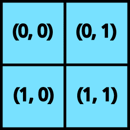

# Pallas 快速入门

> 原文：[`jax.readthedocs.io/en/latest/pallas/quickstart.html`](https://jax.readthedocs.io/en/latest/pallas/quickstart.html)

Pallas 是 JAX 的扩展，允许为 GPU 和 TPU 编写自定义核函数。Pallas 允许您使用相同的 JAX 函数和 API，但在抽象层面上操作更低。

具体来说，Pallas 要求用户考虑内存访问以及如何在硬件加速器的多个计算单元之间分割计算。在 GPU 上，Pallas 降级为 Triton，在 TPU 上，Pallas 降级为 Mosaic。

让我们深入一些例子。

> 注意：Pallas 仍然是一个实验性 API，可能会因更改而破坏代码！

## 在 Pallas 中的 hello world

```py
from functools import partial

import jax
from jax.experimental import pallas as pl
import jax.numpy as jnp
import numpy as np 
```

首先，我们在 Pallas 中编写“hello world”，这是一个将两个向量相加的核函数。

```py
def add_vectors_kernel(x_ref, y_ref, o_ref):
  x, y = x_ref[...], y_ref[...]
  o_ref[...] = x + y 
```

**`Ref` 类型**

让我们稍微解析一下这个函数。与您可能编写过的大多数 JAX 函数不同，它不以 `jax.Array` 作为输入，也不返回任何值。相反，它以 *`Ref`* 对象作为输入。请注意，我们也没有任何输出，但我们有一个 `o_ref`，它对应于所需的输出。

**从 `Ref` 读取**

在函数体中，我们首先从 `x_ref` 和 `y_ref` 中读取，用 `[...]` 表示（省略号表示我们正在读取整个 `Ref`；或者我们也可以使用 `x_ref[:]`）。像这样从 `Ref` 中读取返回一个 `jax.Array`。

**向 `Ref` 写入**

然后我们将 `x + y` 写入 `o_ref`。在 JAX 中历史上并不支持突变 - `jax.Array` 是不可变的！`Ref` 是新的（实验性）类型，在某些情况下允许突变。我们可以理解为向 `Ref` 写入是对其底层缓冲区的突变。

因此，我们编写了一个我们称之为“核函数”的程序，定义为在加速器上作为执行的原子单位运行，而不与主机进行任何交互。我们如何从 JAX 计算中调用它呢？我们使用 `pallas_call` 高阶函数。

```py
@jax.jit
def add_vectors(x: jax.Array, y: jax.Array) -> jax.Array:
  return pl.pallas_call(add_vectors_kernel,
                        out_shape=jax.ShapeDtypeStruct(x.shape, x.dtype)
                        )(x, y)
add_vectors(jnp.arange(8), jnp.arange(8)) 
```

```py
Array([ 0,  2,  4,  6,  8, 10, 12, 14], dtype=int32) 
```

`pallas_call` 将 Pallas 核函数提升为可以作为较大 JAX 程序的一部分调用的操作。但是，为了做到这一点，它需要一些额外的细节。在这里，我们指定 `out_shape`，一个具有 `.shape` 和 `.dtype`（或列表）的对象。`out_shape` 决定了我们在 `add_vector_kernel` 中的 `o_ref` 的形状/数据类型。

`pallas_call` 返回一个函数，该函数接受并返回 `jax.Array`。

**这里实际上发生了什么？**

到目前为止，我们已经描述了如何思考 Pallas 核函数，但我们实际上所做的是编写一个函数，该函数在计算单元附近执行。

在 GPU 上，`x_ref` 对应于高带宽内存（HBM）中的一个值，当我们执行 `x_ref[...]` 时，我们将该值从 HBM 复制到静态 RAM（SRAM）中（一般情况下这是一个昂贵的操作！）。然后，我们使用 GPU 向量计算来执行加法，然后将结果值从 SRAM 复制回 HBM。

在 TPU 上，我们做了略有不同的事情。在内核被执行之前，我们从 HBM 中获取值到 SRAM 中。因此，`x_ref`对应于 SRAM 中的一个值，当我们执行`x_ref[...]`时，我们将该值从 SRAM 复制到寄存器中。然后，我们使用 TPU 向量计算来执行加法，然后将结果值复制回 SRAM。在内核执行完毕后，将 SRAM 中的值复制回 HBM。

我们正在编写特定后端的 Pallas 指南。即将推出！

## Pallas 编程模型

在我们的“hello world”示例中，我们编写了一个非常简单的内核。它利用了我们的大小为 8 的数组可以轻松地放入硬件加速器的 SRAM 中这一事实。在大多数实际应用中，情况通常并非如此！

编写 Pallas 内核的一部分是考虑如何处理生活在高带宽内存（HBM，也称为 DRAM）中的大数组，并表达操作这些数组“块”的计算，这些块可以适应 SRAM 中。

### 网格

要自动“切分”输入和输出，您需要向`pallas_call`提供一个`grid`和`BlockSpec`。

一个`grid`是一组整数的元组（例如`()`，`(2, 3, 4)`或`(8,)`），指定了一个迭代空间。例如，网格`(4, 5)`将有 20 个元素：`(0, 0), (0, 1), ... , (0, 4), (1, 0), ... , (3, 4)`。我们为每个元素运行一次内核函数，这是单程序多数据（SPMD）编程风格。



一个二维网格

当我们向`pallas_call`提供一个`grid`时，内核将执行`prod(grid)`次。每次调用被称为“程序”，为了访问内核当前执行的程序（即`grid`的哪个元素），我们使用`program_id(axis=...)`。例如，对于调用`(1, 2)`，`program_id(axis=0)`返回`1`，`program_id(axis=1)`返回`2`。

这里是一个使用`grid`和`program_id`的内核示例。

```py
def iota_kernel(o_ref):
  i = pl.program_id(0)
  o_ref[i] = i 
```

现在，我们使用`pallas_call`来执行它，还提供了一个额外的`grid`参数。

```py
def iota(len: int):
  return pl.pallas_call(iota_kernel,
                        out_shape=jax.ShapeDtypeStruct((len,), jnp.int32),
                        grid=(len,))()
iota(8) 
```

```py
Array([0, 1, 2, 3, 4, 5, 6, 7], dtype=int32) 
```

在 GPU 上，每个程序在单独的线程上并行执行。因此，我们需要考虑写入 HBM 时的竞争条件。一个合理的方法是编写我们的内核，使不同的程序写入 HBM 中的不同位置，以避免这些并行写入。另一方面，通过并行化计算，我们可以快速执行诸如矩阵乘法之类的操作。

在 TPU 上，程序以并行和顺序（取决于架构）的组合方式执行，因此需要考虑略有不同。

### 块规格

考虑到`grid`和`program_id`，Pallas 提供了一种抽象，处理了许多内核中常见的索引模式。为了建立直觉，让我们尝试实现一个矩阵乘法。

在 Pallas 中实现矩阵乘法的一个简单策略是递归实现。我们知道我们的底层硬件支持小矩阵乘法（使用 GPU 和 TPU tensorcores），因此我们只需将大矩阵乘法表示为较小的矩阵乘法。

假设我们有输入矩阵 \(X\) 和 \(Y\) 并计算 \(Z = XY\)。我们首先将 \(X\) 和 \(Y\) 表达为块矩阵。\(X\) 将有“行”块，而 \(Y\) 将有“列”块。

\[\begin{split} \begin{align*} X = \begin{bmatrix} X_0 \\ X_1 \end{bmatrix} \end{align*} \end{split}\]\[ \begin{align*} Y = \begin{bmatrix} Y_0 & Y_1 \end{bmatrix} \end{align*} \]\[\begin{split} \begin{align*} Z &= \begin{bmatrix} X_0 Y_0 & X_0 Y_1 \\ X_1 Y_0 & X_1 Y_1 \end{bmatrix} \end{align*} \end{split}\]

我们的策略是，因为 \(Z\) 也是一个块矩阵，我们可以将我们 Pallas 内核中的每个程序分配给一个输出块。计算每个输出块相当于在 \(X\) 的“行”块和 \(Y\) 的“列”块之间进行较小的矩阵乘法。

要表达这种模式，我们使用 `BlockSpec`。`BlockSpec` 指定每个输入和输出的块形状，以及一个“索引映射”函数，将一组程序索引映射到一个块索引。


`BlockSpec` 的可视化

举个具体的例子，假设我们想要将两个 `(1024, 1024)` 矩阵 `x` 和 `y` 相乘得到 `z`，并且希望将计算并行化为 4 个部分。我们将 `z` 切分为 4 个 `(512, 512)` 块，其中每个块使用 `(512, 1024) x (1024, 512)` 的矩阵乘法计算。为了表达这一点，我们首先使用一个 `(2, 2)` 的网格（每个程序一个块）。

对于 `x`，我们使用 `BlockSpec(lambda i, j: (i, 0), (512, 1024))` – 这将 `x` 切分成“行”块。观察程序实例 `(1, 0)` 和 `(1, 1)` 如何选择 `x` 中的 `(1, 0)` 块。对于 `y`，我们使用其转置版本 `BlockSpec(lambda i, j: (0, j), (1024, 512))`。最后，对于 `z`，我们使用 `BlockSpec(lambda i, j: (i, j), (512, 512))`。

这些 `BlockSpec` 通过 `in_specs` 和 `out_specs` 被传递给 `pallas_call`。

在底层，`pallas_call` 将自动将您的输入和输出划分为每个将传递到内核的块的 `Ref`。

```py
def matmul_kernel(x_ref, y_ref, z_ref):
  z_ref[...] = x_ref[...] @ y_ref[...]

def matmul(x: jax.Array, y: jax.Array):
  return pl.pallas_call(
    matmul_kernel,
    out_shape=jax.ShapeDtypeStruct((x.shape[0], y.shape[1]), x.dtype),
    grid=(2, 2),
    in_specs=[
      pl.BlockSpec(lambda i, j: (i, 0), (x.shape[0] // 2, x.shape[1])),
      pl.BlockSpec(lambda i, j: (0, j), (y.shape[0], y.shape[1] // 2))
    ],
    out_specs=pl.BlockSpec(
      lambda i, j: (i, j), (x.shape[0] // 2, y.shape[1] // 2)
    )
  )(x, y)
k1, k2 = jax.random.split(jax.random.key(0))
x = jax.random.normal(k1, (1024, 1024))
y = jax.random.normal(k2, (1024, 1024))
z = matmul(x, y)
np.testing.assert_allclose(z, x @ y) 
```

注意，这是矩阵乘法的一个非常简单的实现，但可以作为各种优化类型的起点。让我们为我们的矩阵乘法添加一个额外的特性：融合激活。这实际上非常简单！只需将一个高阶激活函数传递到内核中即可。

```py
def matmul_kernel(x_ref, y_ref, z_ref, *, activation):
  z_ref[...] = activation(x_ref[...] @ y_ref[...])

def matmul(x: jax.Array, y: jax.Array, *, activation):
  return pl.pallas_call(
    partial(matmul_kernel, activation=activation),
    out_shape=jax.ShapeDtypeStruct((x.shape[0], y.shape[1]), x.dtype),
    grid=(2, 2),
    in_specs=[
      pl.BlockSpec(lambda i, j: (i, 0), (x.shape[0] // 2, x.shape[1])),
      pl.BlockSpec(lambda i, j: (0, j), (y.shape[0], y.shape[1] // 2))
    ],
    out_specs=pl.BlockSpec(
      lambda i, j: (i, j), (x.shape[0] // 2, y.shape[1] // 2)
    ),
  )(x, y)
k1, k2 = jax.random.split(jax.random.key(0))
x = jax.random.normal(k1, (1024, 1024))
y = jax.random.normal(k2, (1024, 1024))
z = matmul(x, y, activation=jax.nn.relu)
np.testing.assert_allclose(z, jax.nn.relu(x @ y)) 
```

最后，让我们强调 Pallas 的一个很酷的特性：它可以与 `jax.vmap` 组合使用！要将此矩阵乘法转换为批处理版本，我们只需将其 `vmap` 化。

```py
k1, k2 = jax.random.split(jax.random.key(0))
x = jax.random.normal(k1, (4, 1024, 1024))
y = jax.random.normal(k2, (4, 1024, 1024))
z = jax.vmap(partial(matmul, activation=jax.nn.relu))(x, y)
np.testing.assert_allclose(z, jax.nn.relu(jax.vmap(jnp.matmul)(x, y))) 
```
