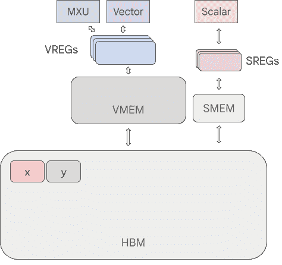
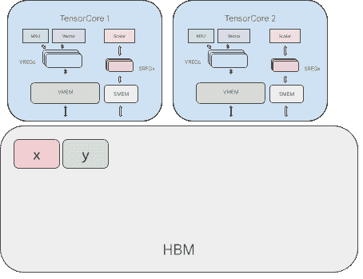

# 管道化和块规范

> 原文：[`jax.readthedocs.io/en/latest/pallas/tpu/pipelining.html`](https://jax.readthedocs.io/en/latest/pallas/tpu/pipelining.html)

在本指南中，我们将介绍 TPU 中的内存空间工作原理，并展示如何在 Pallas 中编写可以将内存 I/O 与计算重叠的流水线。

```py
#@title Imports

import jax
from jax.experimental import pallas as pl
import jax.numpy as jnp
import numpy as np 
```

## TPU 及其内存空间

TPU 和其 TensorCore 包括内存空间（用于存放数组的区域）、寄存器（临时存储标量和数组值的地方）和计算单元（用于处理寄存器中的值的计算单元）。下图显示了一个 TPU 的结构，其中 `x` 和 `y` 是存储在高带宽存储器（HBM）中的数组：



让我们更详细地讨论这个图表的组成部分：

+   **内存空间**：TPU 拥有高带宽内存（HBM），这通常被称为“设备内存”。还有向量内存（VMEM），一个用于存储向量和数组值的缓存，以及标量内存（SMEM），一个设计用于存储标量值的缓存。

+   **寄存器**：TensorCore 拥有两种主要类型的寄存器：向量寄存器（VREGs）存储数组值，标量寄存器（SREGs）存储标量值。值可以从相应的缓存（VREG 的 VMEM 和 SREG 的 SMEM）加载到内存中。

+   **计算单元**：TensorCore 包括标量单元、向量单元（VPU）和矩阵单元（MXU），用于进行数值计算。计算单元操作位于 SREG 和 VREG 中的值，并将输出值也存储在这些寄存器中。

为了在我们存储在 HBM 中的值 `x` 和 `y` 上执行矢量化计算，我们需要：

1.  将值 `x` 和 `y` 复制到 VMEM 中。

1.  从 VMEM 中加载值到 VREG 中。

1.  使用 VPU 或 MXU 执行计算，并将输出存储在 VREG 中。

1.  将输出 VREG 中的值存储到 VMEM 中。

1.  将 VMEM 中的输出值复制回 HBM。

让我们实现一个 Pallas 函数来完成这些操作！

```py
def add_matrices_kernel(x_vmem_ref, y_vmem_ref, z_vmem_ref):
  # Load x and y from VMEM into VREGs
  x_vregs = x_vmem_ref[:, :]
  y_vregs = y_vmem_ref[:, :]
  # Execute a vectorized add
  z_vregs = x_vregs + y_vregs
  # Store the output values in VREGs back into VMEM
  z_vmem_ref[:, :] = z_vregs

def add_matrices(x: jax.Array, y: jax.Array) -> jax.Array:
  # pallas_call will first allocate scratch buffers for `x` and `y` in VMEM.
  # It will then copy `x` and `y` from HBM into VMEM.
  z = pl.pallas_call(
      add_matrices_kernel, out_shape=jax.ShapeDtypeStruct(x.shape, x.dtype)
  )(x, y)
  # pallas_call will also copy the output from VMEM back into HBM.
  return z

x, y = jnp.ones((512, 512)), jnp.ones((512, 512))
add_matrices(x, y) 
```

```py
Array([[2., 2., 2., ..., 2., 2., 2.],
       [2., 2., 2., ..., 2., 2., 2.],
       [2., 2., 2., ..., 2., 2., 2.],
       ...,
       [2., 2., 2., ..., 2., 2., 2.],
       [2., 2., 2., ..., 2., 2., 2.],
       [2., 2., 2., ..., 2., 2., 2.]], dtype=float32) 
```

我们编写了两个函数：`add_matrices_kernel` 和 `add_matrices`。

`add_matrices_kernel` 操作使用在 VMEM 中存在的 `Ref`。从 VMEM 的 `Ref` 加载会产生一个存在于 VREG 中的值。VREG 中的值的行为类似于 `jax.Array`，我们可以在其上使用 `jnp` 和 `jax.lax` 操作来产生新的值，这些新值仍然存在于 VREG 中。当我们产生想要返回的值时，我们将它们存储在输出的 VMEM `Ref` 中。

`add_matrices` 函数作用于 `jax.Array`，并返回一个 `jax.Array`。在函数内部，我们将 `x` 和 `y` 传递给 `pallas_call`。`pallas_call` 负责将 `x` 和 `y` 复制到 VMEM 中，并分配内核操作的 VMEM 缓冲区（包括分配 `z_vmem_ref`，输出的 VMEM 缓冲区）。内核函数运行完成后，`pallas_call` 还将 `z_vmem_ref` 中的值复制到 HBM，最终输出一个 `jax.Array`。

## 使用 VMEM/SMEM 的限制

Pallas 公开了对低级内存空间（如 VMEM 和 SMEM）的访问，但编写利用它们的内核需要考虑一些因素。

1.  内存容量。VMEM 和 SMEM 都很*小*！v4 TPU 上的 VMEM 只有 16MiB，SMEM 的范围在几十到几百 KiB。如果我们的数组太大，甚至无法完全放入 VMEM 中。举个例子，一个 `f32[2048, 2048]` 数组就是 16MiB，因此我们上面的核心代码无法处理超过中等大小的数组。

1.  内存带宽。从 HBM 和 VMEM 复制数据需要很长时间，至少与大多数计算指令相比是如此。上面的 `add_matrices` 函数很可能在复制 HBM 和 VMEM 之间花费的时间比执行加法本身要多。

考虑到这两个约束条件，我们必须重新思考如何提高 TPU 的性能策略。

## 引言：流水线

在一个行动中处理内存容量和带宽约束的流水线计算提供了一种方法。我们所说的流水线是什么意思？

目标是：*并行*复制到/从 HBM 和 VMEM *同时*利用我们的计算单元。但在我们的程序中，这种方式相对困难，因为我们在开始进行计算之前先复制了所有的 `x` 和 `y`，从而在复制和计算之间创建了依赖关系。

然而，如果我们可以将计算分成几个子计算（例如，当我们将两个矩阵相加时，可以将原始矩阵的“块”相加在一起），我们现在可以将其中一个子计算的复制与另一个计算的执行重叠起来。让我们通过一个简单的例子来演示：

假设我们将数组 `x` 和 `y` 分成 `x1, x2` 和 `y1, y2`（例如，沿着主轴进行分割，每个输入结果为两个 `(256, 512)` 的数组）。现在我们可以执行以下流水线计算。

1.  复制 `x1` 和 `y1` 到 VMEM 中。

1.  开始将 `x2` 和 `y2` 复制到 VMEM。

1.  从 VMEM 加载 `x1, y1` 到 VREGs 中。

1.  使用计算单元执行 `z1 = x1 + y1`。

1.  将 `z1` 存储到 VMEM 中。

1.  开始将 `z1` 从 VMEM 复制回到 HBM。

1.  等待 `x2, y2` 被复制到 VMEM。

1.  从 VMEM 加载 `x2, y2` 到 VREGs 中。

1.  使用计算单元执行 `z2 = x2 + y2`。

1.  将 `z2` 存储到 VMEM 中。

1.  等待 `z1` 被复制到 HBM。

1.  开始将 `z2` 从 VMEM 复制回到 HBM。

1.  等待 `z2` 被复制到 HBM。

在这里进行计算时，我们总是异步复制某些内容。这意味着复制过程中的一些时间并不会浪费。

决定流水线计算效率的两个最重要的因素是 a) 我们需要执行多少浮点运算（FLOPs）和 b) 我们需要复制多少字节以执行该计算。这两者的比率（FLOPs/内存使用量）称为操作的*算术强度*，并确定我们的流水线是计算受限还是内存受限。

## Pallas 中的流水线

我们如何在 Pallas 中实现像上面那样的管道？这似乎是一系列复杂的异步数据操作和执行内核，手动实现可能会很麻烦。不要担心！Pallas 提供了一个 API 来表达管道，而不需要太多样板文件，即通过`grid`和`BlockSpec`。

### `grid`，又名循环中的内核

看看在上述流水线示例中，我们多次执行相同的逻辑：步骤 3-5 和 8-10 都执行相同的操作，只是在不同的输入上。这个泛化版本是在同一个内核上多次执行循环。`pallas_call`提供了一个选项来实现这一点。

循环中的迭代次数由`pallas_call`的`grid`参数指定。在概念上：

```py
pl.pallas_call(some_kernel, grid=n)(...) 
```

映射到

```py
for i in range(n):
  # do HBM -> VMEM copies
  some_kernel(...)
  # do VMEM -> HBM copies 
```

网格可以推广为多维，对应于嵌套循环。例如，

```py
pl.pallas_call(some_kernel, grid=(n, m))(...) 
```

等价于

```py
for i in range(n):
  for j in range(m):
    # do HBM -> VMEM copies
    some_kernel(...)
    # do VMEM -> HBM copies 
```

这可以推广到任意整数元组（长度为`d`的网格将对应于`d`个嵌套循环）。

### `BlockSpec`，又称如何分块输入

为了自动管道化我们的计算，我们需要向 Pallas 提供的下一部分信息是如何对其进行分块的信息。具体来说，我们需要提供一个映射，将*循环的迭代*映射到*操作哪些输入和输出块*。`BlockSpec`正是这两个信息。

首先，我们为我们的输入选择一个`block_shape`。在上面的流水线示例中，我们有`(512, 512)`形状的数组，并沿着主维度分成两个`(256, 512)`形状的数组。在这个管道中，我们的`block_shape`将是`(256, 512)`。

然后，我们提供一个`index_map`函数，将迭代空间映射到块。具体来说，在上述管道中，第 1 次迭代我们想选择`x1`，第 2 次迭代我们想使用`x2`。可以用以下`index_map`表达：

```py
def x_index_map(i):
  return (i, 0) 
```

然后，我们将构建`BlockSpec`：

```py
block_spec = pl.BlockSpec(x_index_map, (256, 512)) 
```

`BlockSpec`对于`y`和`z`与对`x`的`BlockSpec`将是相同的。

### 汇总

我们通过`grid`、`in_specs`和`out_specs`将这些参数提供给`pallas_call`（`in_specs`对应于位置参数的元组，`out_specs`对应于输出）。

```py
def add_matrices_pipelined(x: jax.Array, y: jax.Array) -> jax.Array:
  block_spec = pl.BlockSpec(lambda i: (i, 0), (256, 512))
  return pl.pallas_call(
      add_matrices_kernel,
      out_shape=x,
      in_specs=[block_spec, block_spec],
      out_specs=block_spec,
      grid=(2,))(x, y)

add_matrices_pipelined(x, y) 
```

```py
Array([[2., 2., 2., ..., 2., 2., 2.],
       [2., 2., 2., ..., 2., 2., 2.],
       [2., 2., 2., ..., 2., 2., 2.],
       ...,
       [2., 2., 2., ..., 2., 2., 2.],
       [2., 2., 2., ..., 2., 2., 2.],
       [2., 2., 2., ..., 2., 2., 2.]], dtype=float32) 
```

我们只需向原始函数添加了少量代码以添加自动管道，但`BlockSpec`和`grid`做了大量的重复工作！

它是如何工作的？好吧，`BlockSpec`提供足够的信息来开始从 HBM 到 VMEM 预取我们输入的块。例如，如果我们开始`grid`的第`i`次迭代，我们可以将`i + 1`传递给`index_map`函数，以获取下一次迭代所需的块。然后，我们可以开始这些块的异步复制。类似地，对于输出，我们可以在开始当前迭代的输出复制之前等待上一次迭代的输出复制完成。

### 参数化管道

在我们的内核中，参数化块形状是常见的。当优化 Pallas 内核的性能时，块大小可能是最重要的参数！它们允许我们控制管道流程（例如，选择较小的块会在我们的流水线循环中增加更多的迭代，每个迭代的工作量较小）。

此外，我们还可以沿第二维（目前仅沿第一维进行拆分）划分输入和输出。让我们编写一个更通用的内核，处理这两个特性。

```py
def add_matrices_pipelined_2d(
    x: jax.Array, y: jax.Array, *, bm: int = 256, bn: int = 256
) -> jax.Array:
  m, n = x.shape
  block_spec = pl.BlockSpec(lambda i, j: (i, j), (bm, bn))

  return pl.pallas_call(
      add_matrices_kernel,
      out_shape=x,
      in_specs=[block_spec, block_spec],
      out_specs=block_spec,
      grid=(m // bm, n // bn),
  )(x, y)

np.testing.assert_array_equal(
    add_matrices_pipelined_2d(x, y, bm=256, bn=256), x + y
)
np.testing.assert_array_equal(
    add_matrices_pipelined_2d(x, y, bm=128, bn=128), x + y
)
np.testing.assert_array_equal(
    add_matrices_pipelined_2d(x, y, bm=512, bn=512), x + y
) 
```

## 处理减少

如何使用`pallas_call`实现类似`jnp.sum`的功能？具体来说，我们希望在减少维度上进行流水线处理。

以将`(8, 512, 512)`形状的数组减少到`(512, 512)`形状为例。

```py
x = jnp.ones((8, 512, 512))
jnp.sum(x, axis=0) 
```

```py
Array([[8., 8., 8., ..., 8., 8., 8.],
       [8., 8., 8., ..., 8., 8., 8.],
       [8., 8., 8., ..., 8., 8., 8.],
       ...,
       [8., 8., 8., ..., 8., 8., 8.],
       [8., 8., 8., ..., 8., 8., 8.],
       [8., 8., 8., ..., 8., 8., 8.]], dtype=float32) 
```

要使用`pallas_call`实现这一点，我们可以使用大小为`(8,)`的网格，并在每次迭代`i`中将`x[i]`加载到 VMEM 中。然后我们可以将`x[i]`添加到输出 VMEM 缓冲区中。让我们先天真地实现这一点。

```py
# Warning: this implementation is incorrect!

def naive_sum_kernel(x_ref, o_ref):
  o_ref[...] += x_ref[...]

def naive_sum(x: jax.Array) -> jax.Array:
  grid, *out_shape = x.shape
  return pl.pallas_call(
      naive_sum_kernel,
      grid=grid,
      # None in `block_shape` means we pick a size of 1 and squeeze it away
      in_specs=[pl.BlockSpec(lambda i: (i, 0, 0), (None, *out_shape))],
      out_specs=pl.BlockSpec(lambda i: (0, 0), out_shape),
      out_shape=jax.ShapeDtypeStruct(out_shape, x.dtype)
      )(x)
naive_sum(x) 
```

```py
Array([[9., 9., 9., ..., 9., 9., 9.],
       [9., 9., 9., ..., 9., 9., 9.],
       [9., 9., 9., ..., 9., 9., 9.],
       ...,
       [9., 9., 9., ..., 9., 9., 9.],
       [9., 9., 9., ..., 9., 9., 9.],
       [9., 9., 9., ..., 9., 9., 9.]], dtype=float32) 
```

注意我们如何设置`BlockSpecs`：我们将`(512, 512)`维度完全加载到 VMEM 中（在这里没有流水线），但在块形状的`index_map`中每次迭代选择`x`的第`i`维度。在块形状中，我们对该维度使用`None`，这表示我们正在从`x`中选择一个单维度，我们希望在内核中将其挤压掉。因此，在 VMEM 中，`x_ref`也是`(512, 512)`形状。

`out_spec`使用`lambda i: (0, 0)`作为其`index_map`，指示在管道过程中`o_ref`保持不变。这意味着我们可以通过从中读取并向其写入来更新其值。或者可以吗？实际上有一个问题：*`o_ref`最初是垃圾*，这意味着我们将累积到垃圾中。这将导致整体函数输出不正确的值！

因此，**每当我们在内核中进行减少操作时，我们需要确保初始化存储减少值的`Ref`**。我们可以通过在迭代 0 时有条件地向`out_ref`写入值来实现这一点。我们可以利用辅助函数`pl.when`（一个方便的包装器，围绕`jax.lax.cond`和`pl.program_id`进行操作），查询我们在网格轴上的迭代。 

```py
def sum_kernel(x_ref, o_ref):
  @pl.when(pl.program_id(axis=0) == 0)
  def _():
    o_ref[...] = jnp.zeros_like(o_ref)

  o_ref[...] += x_ref[...]

def sum(x: jax.Array) -> jax.Array:
  grid, *out_shape = x.shape
  return pl.pallas_call(
      sum_kernel,
      grid=grid,
      # None in `block_shape` means we pick a size of 1 and squeeze it away
      in_specs=[pl.BlockSpec(lambda i: (i, 0, 0), (None, *out_shape))],
      out_specs=pl.BlockSpec(lambda i: (0, 0), out_shape),
      out_shape=jax.ShapeDtypeStruct(out_shape, x.dtype)
      )(x)
sum(x) 
```

```py
Array([[8., 8., 8., ..., 8., 8., 8.],
       [8., 8., 8., ..., 8., 8., 8.],
       [8., 8., 8., ..., 8., 8., 8.],
       ...,
       [8., 8., 8., ..., 8., 8., 8.],
       [8., 8., 8., ..., 8., 8., 8.],
       [8., 8., 8., ..., 8., 8., 8.]], dtype=float32) 
```

此`sum`函数现在输出正确的值！

关于 Pallas 中减少的最后一件事是**它们必须在我们网格的最小维度（最右边）中完成**（在上面的示例中，我们的网格是 1 维的，因此我们在其最小维度上进行减少）。这是因为 Pallas 生成的管道不会从 HBM 读取输出。一旦将输出值写回到 HBM，就不能重新访问它。因此，您不能在具有任何重新访问的网格维度上进行减少，因此所有减少操作都需要在最右维度上进行。

## Megacore 配置的 TPU

一些 TPU 芯片有两个 TensorCores，但对 JAX 用户来说，它们表现为一个设备。这被称为“megacore”。这两个独立的 TensorCores 分别拥有自己的 VMEM、VREGs、SMEM、SREGs 和计算单元，但*共享 HBM*。



从概念上讲，Megacore 中的 TPU 行为类似于非常简单的 GPU，即只有两个线程。我们如何修改我们的内核以同时利用两个 TensorCores？

基本思想是，如果我们在计算中有尴尬地并行的维度，我们可以将这些维度分配到 TensorCores 上。我们可以通过向 `pallas_call` 提供一个称为 `dimension_semantics` 的注释来指示哪些维度是可并行化的。

```py
def add_matrices_pipelined_megacore(x: jax.Array, y: jax.Array) -> jax.Array:
  block_spec = pl.BlockSpec(lambda i: (i, 0), (256, 512))
  return pl.pallas_call(
      add_matrices_kernel,
      out_shape=x,
      in_specs=[block_spec, block_spec],
      out_specs=block_spec,
      grid=(2,),
      compiler_params=dict(mosaic=dict(dimension_semantics=("parallel",))))(
        x, y)

x, y = jnp.ones((512, 512)), jnp.ones((512, 512))
add_matrices_pipelined_megacore(x, y) 
```

```py
Array([[2., 2., 2., ..., 2., 2., 2.],
       [2., 2., 2., ..., 2., 2., 2.],
       [2., 2., 2., ..., 2., 2., 2.],
       ...,
       [2., 2., 2., ..., 2., 2., 2.],
       [2., 2., 2., ..., 2., 2., 2.],
       [2., 2., 2., ..., 2., 2., 2.]], dtype=float32) 
```

`dimension_semantics` 应该是一个与 `grid` 长度相同的元组，其中每个条目都是`"parallel"`或`"arbitrary"`。`"parallel"` 表示对 Pallas 来说，与该维度对应的 for 循环的迭代可以独立执行，而不会影响程序的正确性。`"arbitrary"` 表示对 Pallas 来说，在这个网格维度上不能做任何假设，因此不能并行化。

通过指定 `dimension_semantics`，我们现在可以同时在每个 TensorCore 上执行内核。Pallas 将自动处理网格的分割。

> 请注意，Megacore 目前仅适用于 TPU `v4` 和 TPU `v5p`。在其他平台上提供 `dimension_semantics` 注释是一个空操作，但*不*指定它将导致只使用一个 TensorCore（即使有多个可用）。

## 结论

在本指南中，我们讨论了如何使用 `pallas_call`、`grid` 和 `BlockSpec` 表达 TPU 管道。我们讨论了如何通过多维网格表达嵌套循环，并在减少开始时初始化累加器的情况下处理归约。我们还学习了如何通过向内核添加注释来处理 Megacore。

读者留给的练习：

+   尝试实现一个 `sum` 内核，该内核也可以管道化其他维度

+   还要将 `add` 内核和 `sum` 内核添加到 Megacore 支持中。
