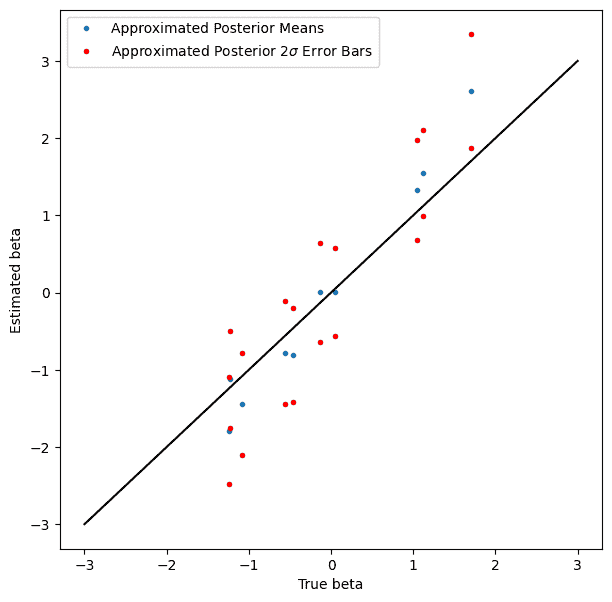

# 贝叶斯推断的自动批处理

> 原文：[`jax.readthedocs.io/en/latest/notebooks/vmapped_log_probs.html`](https://jax.readthedocs.io/en/latest/notebooks/vmapped_log_probs.html)

 

本笔记演示了一个简单的贝叶斯推断示例，其中自动批处理使用户代码更易于编写、更易于阅读，减少了错误的可能性。

灵感来自@davmre 的一个笔记本。

```py
import functools
import itertools
import re
import sys
import time

from matplotlib.pyplot import *

import jax

from jax import lax
import jax.numpy as jnp
import jax.scipy as jsp
from jax import random

import numpy as np
import scipy as sp 
```

## 生成一个虚拟的二分类数据集

```py
np.random.seed(10009)

num_features = 10
num_points = 100

true_beta = np.random.randn(num_features).astype(jnp.float32)
all_x = np.random.randn(num_points, num_features).astype(jnp.float32)
y = (np.random.rand(num_points) < sp.special.expit(all_x.dot(true_beta))).astype(jnp.int32) 
```

```py
y 
```

```py
array([0, 0, 0, 1, 1, 1, 0, 1, 1, 1, 1, 1, 0, 1, 0, 0, 0, 1, 1, 1, 1, 0,
       1, 0, 0, 0, 0, 0, 1, 0, 1, 0, 0, 0, 1, 0, 0, 0, 1, 0, 0, 0, 0, 0,
       1, 1, 0, 1, 0, 0, 0, 1, 1, 0, 0, 1, 0, 0, 0, 0, 0, 1, 1, 0, 0, 0,
       0, 1, 1, 0, 0, 0, 1, 1, 1, 1, 1, 1, 0, 0, 0, 1, 1, 0, 1, 0, 1, 1,
       1, 0, 1, 0, 0, 0, 0, 1, 0, 1, 0, 0], dtype=int32) 
```

## 编写模型的对数联合函数

我们将编写一个非批处理版本、一个手动批处理版本和一个自动批处理版本。

### 非批量化

```py
def log_joint(beta):
    result = 0.
    # Note that no `axis` parameter is provided to `jnp.sum`.
    result = result + jnp.sum(jsp.stats.norm.logpdf(beta, loc=0., scale=1.))
    result = result + jnp.sum(-jnp.log(1 + jnp.exp(-(2*y-1) * jnp.dot(all_x, beta))))
    return result 
```

```py
log_joint(np.random.randn(num_features)) 
```

```py
Array(-213.2356, dtype=float32) 
```

```py
# This doesn't work, because we didn't write `log_prob()` to handle batching.
try:
  batch_size = 10
  batched_test_beta = np.random.randn(batch_size, num_features)

  log_joint(np.random.randn(batch_size, num_features))
except ValueError as e:
  print("Caught expected exception " + str(e)) 
```

```py
Caught expected exception Incompatible shapes for broadcasting: shapes=[(100,), (100, 10)] 
```

### 手动批处理

```py
def batched_log_joint(beta):
    result = 0.
    # Here (and below) `sum` needs an `axis` parameter. At best, forgetting to set axis
    # or setting it incorrectly yields an error; at worst, it silently changes the
    # semantics of the model.
    result = result + jnp.sum(jsp.stats.norm.logpdf(beta, loc=0., scale=1.),
                           axis=-1)
    # Note the multiple transposes. Getting this right is not rocket science,
    # but it's also not totally mindless. (I didn't get it right on the first
    # try.)
    result = result + jnp.sum(-jnp.log(1 + jnp.exp(-(2*y-1) * jnp.dot(all_x, beta.T).T)),
                           axis=-1)
    return result 
```

```py
batch_size = 10
batched_test_beta = np.random.randn(batch_size, num_features)

batched_log_joint(batched_test_beta) 
```

```py
Array([-147.84033 , -207.02205 , -109.26075 , -243.80833 , -163.0291  ,
       -143.84848 , -160.28773 , -113.771706, -126.60544 , -190.81992 ],      dtype=float32) 
```

### 使用 vmap 进行自动批处理

它只是有效地工作。

```py
vmap_batched_log_joint = jax.vmap(log_joint)
vmap_batched_log_joint(batched_test_beta) 
```

```py
Array([-147.84033 , -207.02205 , -109.26075 , -243.80833 , -163.0291  ,
       -143.84848 , -160.28773 , -113.771706, -126.60544 , -190.81992 ],      dtype=float32) 
```

## 自包含的变分推断示例

从上面复制了一小段代码。

### 设置（批量化的）对数联合函数

```py
@jax.jit
def log_joint(beta):
    result = 0.
    # Note that no `axis` parameter is provided to `jnp.sum`.
    result = result + jnp.sum(jsp.stats.norm.logpdf(beta, loc=0., scale=10.))
    result = result + jnp.sum(-jnp.log(1 + jnp.exp(-(2*y-1) * jnp.dot(all_x, beta))))
    return result

batched_log_joint = jax.jit(jax.vmap(log_joint)) 
```

### 定义 ELBO 及其梯度

```py
def elbo(beta_loc, beta_log_scale, epsilon):
    beta_sample = beta_loc + jnp.exp(beta_log_scale) * epsilon
    return jnp.mean(batched_log_joint(beta_sample), 0) + jnp.sum(beta_log_scale - 0.5 * np.log(2*np.pi))

elbo = jax.jit(elbo)
elbo_val_and_grad = jax.jit(jax.value_and_grad(elbo, argnums=(0, 1))) 
```

### 使用 SGD 优化 ELBO

```py
def normal_sample(key, shape):
  """Convenience function for quasi-stateful RNG."""
    new_key, sub_key = random.split(key)
    return new_key, random.normal(sub_key, shape)

normal_sample = jax.jit(normal_sample, static_argnums=(1,))

key = random.key(10003)

beta_loc = jnp.zeros(num_features, jnp.float32)
beta_log_scale = jnp.zeros(num_features, jnp.float32)

step_size = 0.01
batch_size = 128
epsilon_shape = (batch_size, num_features)
for i in range(1000):
    key, epsilon = normal_sample(key, epsilon_shape)
    elbo_val, (beta_loc_grad, beta_log_scale_grad) = elbo_val_and_grad(
        beta_loc, beta_log_scale, epsilon)
    beta_loc += step_size * beta_loc_grad
    beta_log_scale += step_size * beta_log_scale_grad
    if i % 10 == 0:
        print('{}\t{}'.format(i, elbo_val)) 
```

```py
0	-180.8538818359375
10	-113.06045532226562
20	-102.73727416992188
30	-99.787353515625
40	-98.90898132324219
50	-98.29745483398438
60	-98.18632507324219
70	-97.57972717285156
80	-97.28599548339844
90	-97.46996307373047
100	-97.4771728515625
110	-97.5806655883789
120	-97.4943618774414
130	-97.50271606445312
140	-96.86396026611328
150	-97.44197845458984
160	-97.06941223144531
170	-96.84028625488281
180	-97.21336364746094
190	-97.56503295898438
200	-97.26397705078125
210	-97.11979675292969
220	-97.39595031738281
230	-97.16831970214844
240	-97.118408203125
250	-97.24345397949219
260	-97.29788970947266
270	-96.69286346435547
280	-96.96438598632812
290	-97.30055236816406
300	-96.63591766357422
310	-97.0351791381836
320	-97.52909088134766
330	-97.28811645507812
340	-97.07321166992188
350	-97.15619659423828
360	-97.25881958007812
370	-97.19515228271484
380	-97.13092041015625
390	-97.11726379394531
400	-96.938720703125
410	-97.26676940917969
420	-97.35322570800781
430	-97.21007537841797
440	-97.28434753417969
450	-97.1630859375
460	-97.2612533569336
470	-97.21343994140625
480	-97.23997497558594
490	-97.14913940429688
500	-97.23527526855469
510	-96.93419647216797
520	-97.21209716796875
530	-96.82575988769531
540	-97.01284790039062
550	-96.94175720214844
560	-97.16520690917969
570	-97.29165649414062
580	-97.42941284179688
590	-97.24370574951172
600	-97.15222930908203
610	-97.49844360351562
620	-96.9906997680664
630	-96.88956451416016
640	-96.89968872070312
650	-97.13793182373047
660	-97.43705749511719
670	-96.99235534667969
680	-97.15623474121094
690	-97.1869125366211
700	-97.11160278320312
710	-97.78105163574219
720	-97.23226165771484
730	-97.16206359863281
740	-96.99581909179688
750	-96.6672134399414
760	-97.16795349121094
770	-97.51435089111328
780	-97.28900146484375
790	-96.91226196289062
800	-97.17100524902344
810	-97.29047393798828
820	-97.16242980957031
830	-97.19107055664062
840	-97.56382751464844
850	-97.00194549560547
860	-96.86555480957031
870	-96.76338195800781
880	-96.83660888671875
890	-97.12178039550781
900	-97.09554290771484
910	-97.0682373046875
920	-97.11947631835938
930	-96.87930297851562
940	-97.45624542236328
950	-96.69279479980469
960	-97.29376220703125
970	-97.3353042602539
980	-97.34962463378906
990	-97.09675598144531 
```

### 显示结果

虽然覆盖率不及理想，但也不错，而且没有人说变分推断是精确的。

```py
figure(figsize=(7, 7))
plot(true_beta, beta_loc, '.', label='Approximated Posterior Means')
plot(true_beta, beta_loc + 2*jnp.exp(beta_log_scale), 'r.', label='Approximated Posterior $2\sigma$ Error Bars')
plot(true_beta, beta_loc - 2*jnp.exp(beta_log_scale), 'r.')
plot_scale = 3
plot([-plot_scale, plot_scale], [-plot_scale, plot_scale], 'k')
xlabel('True beta')
ylabel('Estimated beta')
legend(loc='best') 
```

```py
<matplotlib.legend.Legend at 0x7f6a2c3c86a0> 
```


