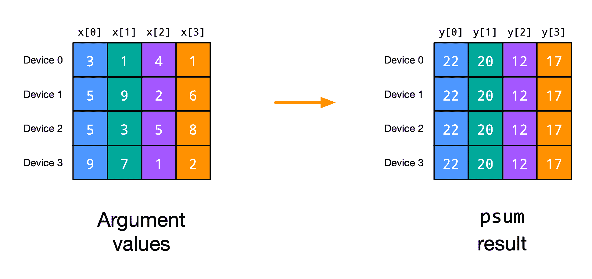
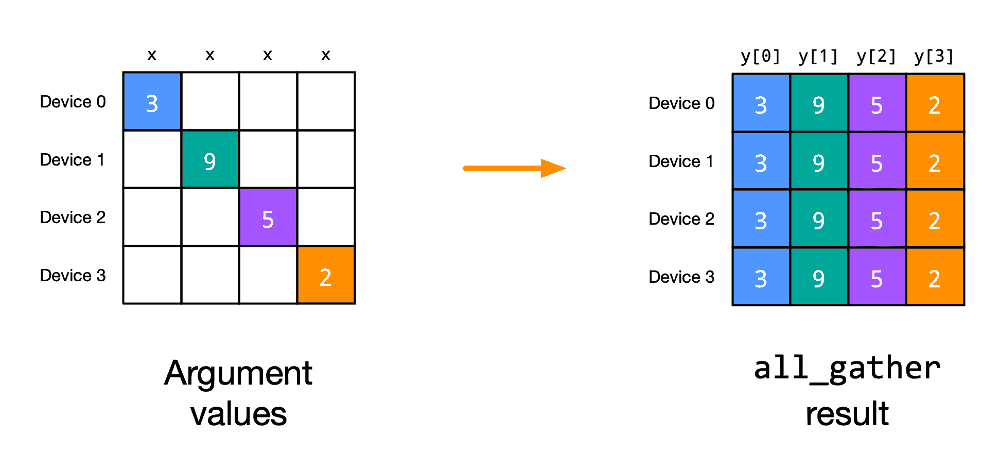
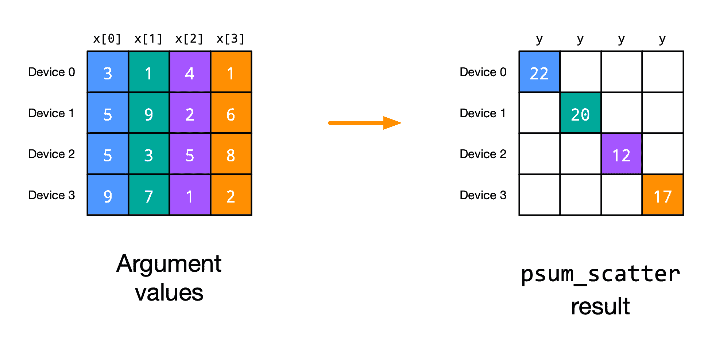
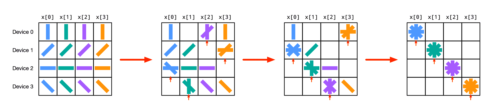
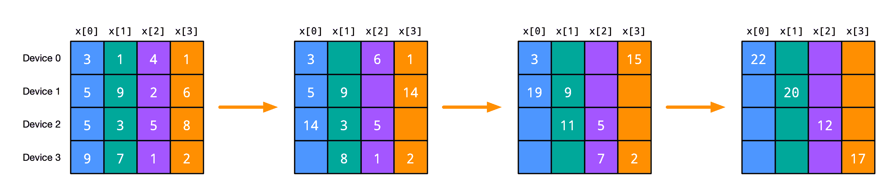
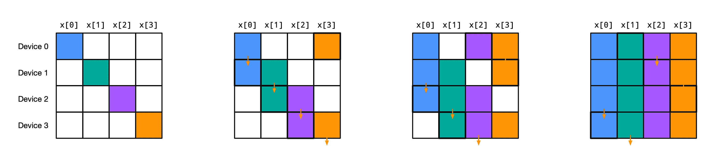
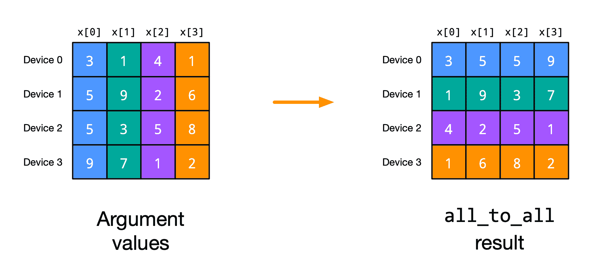
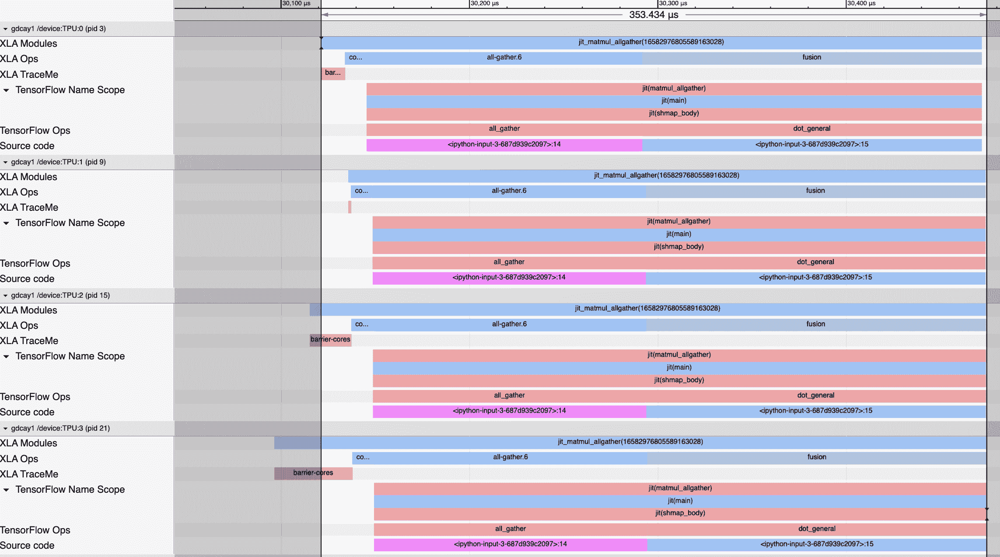
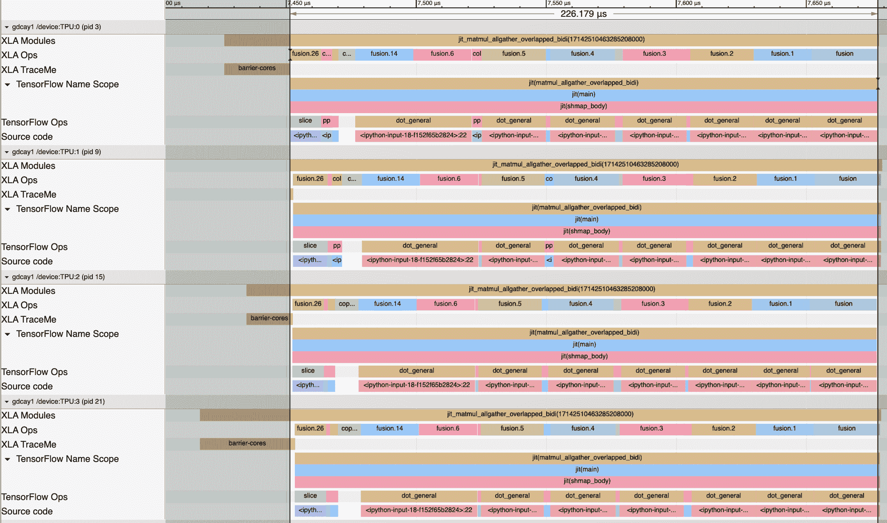

# 使用 `shard_map` 的 SPMD 多设备并行性

> 原文：[`jax.readthedocs.io/en/latest/notebooks/shard_map.html`](https://jax.readthedocs.io/en/latest/notebooks/shard_map.html)

`shard_map` 是一种单程序多数据（SPMD）多设备并行性 API，用于在数据分片上映射函数。映射的函数应用或*实例*通过显式的集合通信操作进行通信。

`shard_map` 是与 `jit` 内置的自动编译器并行化互补且可组合的。使用 `jit`，你编写的代码就像为单个设备编写的一样，并且[编译器可以自动将计算分区到多个设备上](https://jax.readthedocs.io/en/latest/notebooks/Distributed_arrays_and_automatic_parallelization.html)，在幕后生成每个设备的代码和通信集合。使用 `shard_map`，你可以控制自己的分区代码和显式集合。或者你可以同时进行一些操作：在组设备中手动控制同时保留组内设备分区给编译器。这两种方法可以根据需要混合、匹配和组合。

如果您熟悉 `pmap`，可以将 `shard_map` 视为其演进。它更具表现力、性能和与其他 JAX API 可组合。它甚至可以急切地工作，更易于调试！（更多信息，请参阅[与 `pmap` 的详细比较。](https://jax.readthedocs.io/en/latest/jep/14273-shard-map.html#why-don-t-pmap-or-xmap-already-solve-this)）

通过阅读本教程，您将学习如何使用 `shard_map` 来完全控制您的多设备代码。您将详细了解它如何与 `jax.jit` 的自动并行化和 `jax.grad` 的自动微分结合使用。我们还将给出一些神经网络并行化策略的基本示例。

我们假设本教程在具有八个设备的环境中运行：

```py
import os
os.environ["XLA_FLAGS"] = '--xla_force_host_platform_device_count=8' # Use 8 CPU devices 
```

## 所以，让我们来看一个 `shard_map` 吧！

不多说了，这里是一个玩具例子：

```py
from functools import partial

import jax
import jax.numpy as jnp

from jax.sharding import Mesh, PartitionSpec as P
from jax.experimental import mesh_utils
from jax.experimental.shard_map import shard_map 
```

```py
devices = mesh_utils.create_device_mesh((4, 2))
mesh = Mesh(devices, axis_names=('x', 'y'))

a = jnp.arange( 8 * 16.).reshape(8, 16)
b = jnp.arange(16 *  4.).reshape(16, 4)

@partial(shard_map, mesh=mesh, in_specs=(P('x', 'y'), P('y', None)),
         out_specs=P('x', None))
def matmul_basic(a_block, b_block):
  # a_block: f32[2, 8]
  # b_block: f32[8, 4]
  c_partialsum = jnp.dot(a_block, b_block)
  c_block = jax.lax.psum(c_partialsum, 'y')
  # c_block: f32[2, 4]
  return c_block

c = matmul_basic(a, b)   # c: f32[8, 4] 
```

这个函数通过执行本地块矩阵乘法，然后进行集合求和操作来并行计算矩阵乘积。我们可以检查结果是否正确：

```py
from jax.tree_util import tree_map, tree_all

def allclose(a, b):
  return tree_all(tree_map(partial(jnp.allclose, atol=1e-2, rtol=1e-2), a, b))

allclose(c, jnp.dot(a, b)) 
```

```py
True 
```

结果沿其行被分片：

```py
jax.debug.visualize_array_sharding(c) 
```

```py

 CPU 0,1 

 CPU 2,3 

 CPU 4,5 

 CPU 6,7 

```

在高层次上，`shard_map` 在某种程度上类似于 `vmap` 或 `pmap`，因为我们在数组数据的部分上映射函数，但请注意

+   `shard_map` 将输入切片成块（输出由连接结果块形成），保持秩不变，而 `vmap` 则通过映射掉一个轴来减少秩；

+   `mesh` 参数允许我们控制计算和结果的精确设备放置；

+   我们同时映射多个数据轴，并设置多个轴名称以进行集合操作（这里有 `'x'` 和 `'y'`）；

+   因为我们还没有使用 `jax.jit`，一切都是急切地评估的，我们甚至可以打印中间值以进行调试。

上述代码执行与此 `jax.jit` 自动并行化代码相同的计算：

```py
from jax.sharding import NamedSharding

a = jax.device_put(a, NamedSharding(mesh, P('x', 'y')))
b = jax.device_put(b, NamedSharding(mesh, P('y', None)))

@jax.jit
def matmul_reference(a, b):
  c = jnp.dot(a, b)
  return jax.lax.with_sharding_constraint(c, NamedSharding(mesh, P('x', None)))

c_ref = matmul_reference(a, b)
allclose(c_ref, jnp.dot(a, b)) 
```

```py
True 
```

我们可以将 `shard_map` 视为根据其 `mesh` 和 `in_specs` 参数在其输入上执行 `device_put` 或 `with_sharding_constraint`，因此 `matmul_basic` 操作的块与 `matmul_reference` 中的相同：

```py
print('a blocks:'); jax.debug.visualize_array_sharding(a)
print('b blocks:'); jax.debug.visualize_array_sharding(b)
print('c blocks:'); jax.debug.visualize_array_sharding(c) 
```

```py
a blocks:
b blocks:
c blocks: 
```

```py

 CPU 0CPU 1 

 CPU 2CPU 3 

 CPU 4CPU 5 

 CPU 6CPU 7 

```

```py

CPU 0,2,4,6

CPU 1,3,5,7

```

```py

 CPU 0,1 

 CPU 2,3 

 CPU 4,5 

 CPU 6,7 

```

## 放慢速度，从基础开始！

### 降维与保持秩的映射

我们可以将 `vmap` 和 `pmap` 看作是沿轴（例如将 2D 矩阵解包成其 1D 行）对每个数组输入应用其主体函数，然后将结果堆叠在一起，至少在不涉及集合操作时是这样的：

```py
def check_vmap(f, xs):
  ans = jax.vmap(f, in_axes=(0,), out_axes=0)(xs)
  expected = jnp.stack([f(x) for x in xs])  # vmap reference semantics
  print(allclose(ans, expected))

check_vmap(lambda x: x @ x, jnp.arange(12).reshape(4, 3)) 
```

```py
True 
```

例如，如果 `xs` 的形状为 `f32[8,5]`，那么每个 `x` 的形状将为 `f32[5]`，如果每个 `f(x)` 的形状为 `f32[3,7]`，那么最终堆叠的结果 `vmap(f)(xs)` 的形状将为 `f32[8,3,7]`。也就是说，函数 `f` 的每个应用都以比 `vmap(f)` 对应参数少一个轴的输入作为参数。我们可以说这些是*降维映射*，输入/输出的解包/堆叠。

函数 `f` 的逻辑应用数量，或称为 `f` 的*实例*，取决于被映射输入轴的大小：例如，如果我们映射一个大小为 8 的输入轴，语义上我们得到函数的 8 个逻辑应用。

相比之下，`shard_map` 并没有这种降维行为。相反，我们可以将其视为沿输入轴切片（或“取消连接”）成块，应用主体函数，然后将结果再次连接在一起（同样是在不涉及集合操作时）：

```py
import numpy as np
devices = np.array(jax.devices()[:4])
mesh = Mesh(devices, ('i',))  # mesh.shape['i'] = 4

def check_shmap(f, y):
  ans = shard_map(f, mesh, in_specs=P('i'), out_specs=P('i'))(y)
  expected = jnp.concatenate([f(y_blk) for y_blk in jnp.split(y, mesh.shape['i'])])
  print(allclose(ans, expected))

check_shmap(lambda x: x.T @ x, jnp.arange(32).reshape(8, 4)) 
```

```py
True 
```

回想一下，`jnp.split` 将其输入切片为相同大小的块，以便如果在上述示例中 `y` 的形状为 `f32[8,5]`，那么每个 `y_blk` 的形状将为 `f32[2,5]`，如果每个 `f(y_blk)` 的形状为 `f32[3,7]`，那么最终连接的结果 `shard_map(f, ...)(y)` 的形状将为 `f32[12,7]`。因此，`shard_map` 对其输入进行*保持秩的映射*，输入/输出的取消连接/连接。

函数 `f` 的逻辑应用数量由网格大小决定，而不是任何输入轴的大小：例如，如果我们有总大小为 4 的网格（即在 4 个设备上），那么语义上我们得到函数的 4 个逻辑应用，对应于物理计算这些函数的 4 个设备。

### 控制每个输入如何分割（取消连接）并与 `in_specs` 平铺

每个 `in_specs` 通过 `PartitionSpec` 标识某些对应输入数组轴的网格轴名称，表示如何将该输入分割（或解串联）为应用体函数的块。该标识确定了碎片大小；当输入轴与网格轴标识为同一时，输入沿该逻辑轴分割（解串联）为数目等于相应网格轴大小的片段。（如果相应的网格轴大小不能整除输入数组轴大小，则出错。）如果输入的 `pspec` 未提及网格轴名称，则在该网格轴上没有分割。例如：

```py
devices = mesh_utils.create_device_mesh((4, 2))
mesh = Mesh(devices, ('i', 'j'))

@partial(shard_map, mesh=mesh, in_specs=P('i', None), out_specs=P('i', 'j'))
def f1(x_block):
  print(x_block.shape)  # prints (3, 12)
  return x_block

x1 = jnp.arange(12 * 12).reshape(12, 12)
y = f1(x1) 
```

```py
(3, 12) 
```

在这里，因为输入 `pspec` 未提及网格轴名称 `'j'`，因此没有输入数组轴沿该网格轴进行分割；类似地，因为输入数组的第二轴没有标识（因此没有沿任何网格轴分割），`f1` 的应用获得了沿该轴的完整视图。

当输入 `pspec` 中未提及网格轴时，我们可以始终重写为一个效率较低的程序，其中所有网格轴都被提及，但调用者执行 `jnp.tile`，例如：

```py
@partial(shard_map, mesh=mesh, in_specs=P('i', 'j'), out_specs=P('i', 'j'))
def f2(x_block):
  print(x_block.shape)
  return x_block

x = jnp.arange(12 * 12).reshape(12, 12)
x_ = jnp.tile(x, (1, mesh.shape['j']))  # x_ has shape (12, 24)
y = f2(x_)  # prints (3,12), and f1(x) == f2(x_) 
```

```py
(3, 12) 
```

换句话说，因为每个输入 `pspec` 可以零次或一次提及每个网格轴名称，而不必精确一次提及每个名称，我们可以说除了其输入中内置的 `jnp.split` 外，`shard_map` 还有一个至少逻辑上内置的 `jnp.tile`（尽管根据参数的物理分片布局，可能不需要进行物理铺设）。要使用的铺设方式不唯一；我们也可以沿第一个轴进行铺设，并使用 `pspec P(('j', 'i'), None)`。

可以在输入上进行物理数据移动，因为每个设备都需要有适当数据的副本。

### 通过 `out_specs` 控制每个由连接、块转置和使用 `out_specs` 反铺设组装的输出。

类似于输入端，`out_specs` 中的每个标识符通过名称将输出数组的一些轴与网格轴相关联，表示应如何将输出块（每个体函数应用的一个，或等效地每个物理设备一个）重新组装以形成最终输出值。例如，在上述 `f1` 和 `f2` 的例子中，`out_specs` 表明我们应该沿两个轴连接在一起形成最终输出，结果在两种情况下都是形状为 `(12, 24)` 的数组 `y`。（如果体函数的输出形状，即输出块形状，对应的输出 `pspec` 描述的连接的秩过小，则出错。）

当一个网格轴名称在输出 pspec 中未被提及时，表示一个取消铺设：用户编写一个输出 pspec，其中未提及网格轴名称之一，他们保证输出块沿该网格轴是相等的，因此在输出中只使用一个沿该轴的块（而不是沿该网格轴连接所有块）。例如，使用与上述相同的网格：

```py
x = jnp.array([[3.]])

z = shard_map(lambda: x, mesh=mesh, in_specs=(), out_specs=P('i', 'j'))()
print(z)  # prints the same as jnp.tile(x, (4, 2))

z = shard_map(lambda: x, mesh=mesh, in_specs=(), out_specs=P('i', None))()
print(z)  # prints the same as jnp.tile(x, (4, 1)), or just jnp.tile(x, (4,))

z = shard_map(lambda: x, mesh=mesh, in_specs=(), out_specs=P(None, None))()
print(z)  # prints the same as jnp.tile(x, (1, 1)), or just x 
```

```py
[[3\. 3.]
 [3\. 3.]
 [3\. 3.]
 [3\. 3.]]
[[3.]
 [3.]
 [3.]
 [3.]]
[[3.]] 
```

闭合在数组值上的主体函数等效于将其作为具有相应输入 pspec 的增强传递。作为另一个示例，更接近于上述其他示例：

```py
@partial(shard_map, mesh=mesh, in_specs=P('i', 'j'), out_specs=P('i', None))
def f3(x_block):
  return jax.lax.psum(x_block, 'j')

x = jnp.arange(12 * 12).reshape(12, 12)
y3 = f3(x)
print(y3.shape) 
```

```py
(12, 6) 
```

结果的第二轴大小为 6，输入的第二轴大小的一半。在这种情况下，通过在输出 pspec 中未提及网格轴名称 `'j'` 来表达取消铺设是安全的，因为集体 `psum` 确保每个输出块沿相应的网格轴是相等的。以下是两个更改输出 pspec 中提及的网格轴的示例：

```py
@partial(shard_map, mesh=mesh, in_specs=P('i', 'j'), out_specs=P(None, 'j'))
def f4(x_block):
  return jax.lax.psum(x_block, 'i')

x = jnp.arange(12 * 12).reshape(12, 12)
y4 = f4(x)
print(y4.shape)  # (3,12)

@partial(shard_map, mesh=mesh, in_specs=P('i', 'j'), out_specs=P(None, None))
def f5(x_block):
  return jax.lax.psum(x_block, ('i', 'j'))

y5 = f5(x)
print(y5.shape)  # (3,6) 
```

```py
(3, 12)
(3, 6) 
```

在物理方面，在输出 pspec 中未提及网格轴名称将使用沿该网格轴复制布局从输出设备缓冲区组装 `Array`。

没有运行时检查，以确保输出块实际上沿网格轴是相等的，从而可以取消铺设，或者等效地说，相应的物理缓冲区具有相等的值，因此可以被解释为单个逻辑数组的复制布局。但是，我们可以提供一个静态检查机制，在所有潜在不正确的程序上引发错误。

因为 `out_specs` 可以零次或一次提及网格轴名称，并且可以以任何顺序提及，所以除了其输出中内置的 `jnp.concatenate` 外，`shard_map` 还包括 *取消铺设* 和 *块转置*。

输出上无论输出 pspec 如何，物理数据移动都是不可能的。相反，`out_specs` 只是编码如何将块输出组装成 `Array`，或者物理上如何解释跨设备的缓冲区作为单个逻辑 `Array` 的物理布局。

# API 规范

```py
from jax.sharding import Mesh
Specs = PyTree[PartitionSpec]

def shard_map(
    f: Callable, mesh: Mesh, in_specs: Specs, out_specs: Specs,
    auto: collections.abc.Set[AxisName] = frozenset([]),
    check_rep: bool = True,
) -> Callable:
  ... 
```

其中：

+   在 `f` 的主体中，像 `psum` 这样的通信集合可以提及 `mesh` 的轴名称；

+   `mesh` 编码排列成数组并带有关联轴名称的设备，就像 `sharding.NamedSharding` 一样；

+   `in_specs` 和 `out_specs` 是 `PartitionSpec`，可以用来从 `mesh` 中仿射地提及轴名称，以表达输入和输出的切片/未连接和连接，分别对应于未提及名称的复制和取消铺设（断言-复制-因此-给我-一个-副本）；

+   `auto` 是对应于 `mesh` 名称子集的可选轴名称，在主体中自动处理，如在调用者中，而不是手动处理；

+   `check_rep`是一个可选布尔值，指示静态检查`out_specs`中是否存在任何复制错误，并且是否启用相关的自动微分优化（参见[JEP](https://jax.readthedocs.io/en/latest/jep/17111-shmap-transpose.html)）。

传递给`f`的参数的形状与传递给`shard_map`-of-`f`的参数的形状具有相同的秩，`f`的参数的形状从相应的`shard_map`-of-`f`的形状`shape`和相应的`PartitionSpec` `spec`中粗略计算为`tuple(sz // (1 if n is None else mesh.shape[n]) for sz, n in zip(shape, spec))`。

# 集合教程

`shard_map`不必是纯映射：函数应用可以通过*集合*与彼此通信，使用在`mesh`参数中定义的轴名称。

请记住，`shard_map`将函数映射到输入数据的分片或块，因此这样：

```py
mesh = Mesh(jax.devices(), ('i',))
x = jnp.arange(16.)
f_shmapped = shard_map(f, mesh, in_specs=P('i'), out_specs=P('i'))
y = f_shmapped(x) 
```

计算相同的值，评估对相同参数值的`f`的应用，如此参考函数：

```py
def f_shmapped_ref(x):
  x_blocks = jnp.array_split(x, mesh.shape[0])
  y_blocks = [f(x_blk) for x_blk in x_blocks]
  return jnp.concatenate(y_blocks) 
```

我们将这些对不同参数分片的`f`的应用称为*函数实例*。每个函数实例在不同的设备（或设备子集）上执行。

这些引用语义在`f`中没有通信集合时有效。但是如果我们希望函数实例进行通信，即进行跨设备通信，该怎么办？也就是说，当`f`包含一个集合时，引用语义是什么？假设`f`只有一个集合，并且形式如下：

```py
def f(x_blk):
  z_blk = f_part1(x_blk)
  u_blk = collective(z_blk, axis_name)
  v_blk = f_part2(x_blk, z_blk, u_blk)
  return v_blk 
```

假设我们映射的唯一网格轴只有一个，并且`axis_name`是其对应的名称。然后引用语义看起来更像是：

```py
def f_shmapped_ref(x):
  x_blocks = jnp.array_split(x, mesh.shape[0])
  z_blocks = [f_part1(x_blk) for x_blk in x_blocks]
  u_blocks = [collective_ref(i, z_blocks) for i in range(len(z_blocks))]
  v_blocks = [f_part2(x_blk, z_blk, u_blk) for x_blk, z_blk, u_blk
              in zip(x_blocks, z_blocks, u_blocks)]
  return jnp.concatenate(v_blocks) 
```

注意，`collective_ref`可能依赖于所有的`z_blocks`。也就是说，虽然`f_part1`和`f_part2`独立地映射到块上，但是集合引入了跨块依赖。在物理上，这意味着跨设备的通信。确切地说，通信发生了什么，以及计算了什么值，取决于集合。

## `psum`

最简单的集合可能是`jax.lax.psum`，它沿着设备网格轴（或多个轴）计算全归约和。这里是一个玩具示例：



```py
import jax
import jax.numpy as jnp
from jax import lax

from jax.sharding import Mesh, NamedSharding, PartitionSpec as P
from jax.experimental.shard_map import shard_map 
```

```py
mesh1d = Mesh(jax.devices()[:4], ('i',))

@partial(shard_map, mesh=mesh1d, in_specs=P('i'), out_specs=P(None))
def f1(x_block):
  print('BEFORE:\n', x_block)
  y_block = jax.lax.psum(x_block, 'i')
  print('AFTER:\n', y_block)
  return y_block 
```

```py
x = jnp.array([3, 1, 4, 1, 5, 9, 2, 6, 5, 3, 5, 8, 9, 7, 1, 2])
y = f1(x)
print('FINAL RESULT:\n', y) 
```

```py
BEFORE:
 On TFRT_CPU_0 at mesh coordinates (i,) = (0,):
[3 1 4 1]

On TFRT_CPU_1 at mesh coordinates (i,) = (1,):
[5 9 2 6]

On TFRT_CPU_2 at mesh coordinates (i,) = (2,):
[5 3 5 8]

On TFRT_CPU_3 at mesh coordinates (i,) = (3,):
[9 7 1 2]

AFTER:
 On TFRT_CPU_0 at mesh coordinates (i,) = (0,):
[22 20 12 17]

On TFRT_CPU_1 at mesh coordinates (i,) = (1,):
[22 20 12 17]

On TFRT_CPU_2 at mesh coordinates (i,) = (2,):
[22 20 12 17]

On TFRT_CPU_3 at mesh coordinates (i,) = (3,):
[22 20 12 17]

FINAL RESULT:
 [22 20 12 17] 
```

打印显示，每个函数应用都从其自己的参数值块`x_block`开始。在`psum`之后，每个函数应用都有相同的`y_block`值，通过将应用的`x_block`值求和而得到。

在计算中存在单个轴名称的情况下，我们可以说`collective_ref`对于`psum`的引用实现是：

```py
def psum_ref(_, x_blocks):
  tot = sum(x_blocks)
  return [tot] * len(x_blocks) 
```

还要注意，因为`f1`返回`y_block`，对`'i'`进行`psum`的结果，我们可以使用`out_specs=P()`，这样调用者就可以得到单个逻辑副本的结果值，而不是平铺的结果。

当存在多个网格轴时，我们可以分别对每个轴执行`psum`，或者同时对多个轴执行：

```py
mesh2d = Mesh(np.array(jax.devices()[:4]).reshape(2, 2), ('i', 'j'))

@partial(shard_map, mesh=mesh2d, in_specs=P('i', 'j'), out_specs=P(None, 'j'))
def f2(x_block):
  print('BEFORE:\n', x_block)
  y_block = jax.lax.psum(x_block, 'i')
  print('AFTER:\n', y_block)
  return y_block

y = f2(jnp.arange(16).reshape(4, 4))
print('FINAL RESULT:\n', y) 
```

```py
BEFORE:
 On TFRT_CPU_0 at mesh coordinates (i, j,) = (0, 0):
[[0 1]
 [4 5]]

On TFRT_CPU_1 at mesh coordinates (i, j,) = (0, 1):
[[2 3]
 [6 7]]

On TFRT_CPU_2 at mesh coordinates (i, j,) = (1, 0):
[[ 8  9]
 [12 13]]

On TFRT_CPU_3 at mesh coordinates (i, j,) = (1, 1):
[[10 11]
 [14 15]]

AFTER:
 On TFRT_CPU_0 at mesh coordinates (i, j,) = (0, 0):
[[ 8 10]
 [16 18]]

On TFRT_CPU_1 at mesh coordinates (i, j,) = (0, 1):
[[12 14]
 [20 22]]

On TFRT_CPU_2 at mesh coordinates (i, j,) = (1, 0):
[[ 8 10]
 [16 18]]

On TFRT_CPU_3 at mesh coordinates (i, j,) = (1, 1):
[[12 14]
 [20 22]]

FINAL RESULT:
 [[ 8 10 12 14]
 [16 18 20 22]] 
```

通过在网格轴 `'i'` 上应用 `psum`，我们得到沿 `'i'` 轴相等的 `y_block` 值，但不沿 `'j'` 轴相等。（因此，我们可以使用 `out_specs=P(None, 'j')` 来获取沿该轴的单一逻辑结果。）

如果我们在两个轴上应用 `psum`，则 `y_block` 值沿两个轴相等：

```py
@partial(shard_map, mesh=mesh2d, in_specs=P('i', 'j'), out_specs=P(None, None))
def f3(x_block):
  print('BEFORE:\n', x_block)
  y_block = jax.lax.psum(x_block, ('i', 'j'))
  print('AFTER:\n', y_block)
  return y_block

y = f3(jnp.arange(16).reshape(4, 4))
print('FINAL RESULT:\n', y) 
```

```py
BEFORE:
 On TFRT_CPU_0 at mesh coordinates (i, j,) = (0, 0):
[[0 1]
 [4 5]]

On TFRT_CPU_1 at mesh coordinates (i, j,) = (0, 1):
[[2 3]
 [6 7]]

On TFRT_CPU_2 at mesh coordinates (i, j,) = (1, 0):
[[ 8  9]
 [12 13]]

On TFRT_CPU_3 at mesh coordinates (i, j,) = (1, 1):
[[10 11]
 [14 15]]

AFTER:
 On TFRT_CPU_0 at mesh coordinates (i, j,) = (0, 0):
[[20 24]
 [36 40]]

On TFRT_CPU_1 at mesh coordinates (i, j,) = (0, 1):
[[20 24]
 [36 40]]

On TFRT_CPU_2 at mesh coordinates (i, j,) = (1, 0):
[[20 24]
 [36 40]]

On TFRT_CPU_3 at mesh coordinates (i, j,) = (1, 1):
[[20 24]
 [36 40]]

FINAL RESULT:
 [[20 24]
 [36 40]] 
```

在机器学习中，我们经常使用 `psum` 来计算总损失，或者当我们在 `shard_map` 函数体内有一个 `grad` 时，计算总梯度。

接下来，我们将看到如何用其他基元实现 `psum`，这些基元能够对其通信成本提供一些直观的理解。

## `all_gather`

另一个基本操作是沿轴收集数组片段，以便每个函数应用程序在该轴上都有数据的完整副本：



```py
@partial(shard_map, mesh=mesh1d, in_specs=P('i'), out_specs=P('i'))
def f4(x_block):
  print('BEFORE:\n', x_block)
  y_block = jax.lax.all_gather(x_block, 'i', tiled=True)
  print('AFTER:\n', y_block)
  return y_block

x = jnp.array([3, 9, 5, 2])
y = f4(x)
print('FINAL RESULT:\n', y) 
```

```py
BEFORE:
 On TFRT_CPU_0 at mesh coordinates (i,) = (0,):
[3]

On TFRT_CPU_1 at mesh coordinates (i,) = (1,):
[9]

On TFRT_CPU_2 at mesh coordinates (i,) = (2,):
[5]

On TFRT_CPU_3 at mesh coordinates (i,) = (3,):
[2]

AFTER:
 On TFRT_CPU_0 at mesh coordinates (i,) = (0,):
[3 9 5 2]

On TFRT_CPU_1 at mesh coordinates (i,) = (1,):
[3 9 5 2]

On TFRT_CPU_2 at mesh coordinates (i,) = (2,):
[3 9 5 2]

On TFRT_CPU_3 at mesh coordinates (i,) = (3,):
[3 9 5 2]

FINAL RESULT:
 [3 9 5 2 3 9 5 2 3 9 5 2 3 9 5 2] 
```

打印显示，每个函数应用程序再次以其自己的 `x_block` 参数值块的一个片段开始。在 `all_gather` 后，它们具有一个通过连接 `x_block` 值计算得到的共同值。

（请注意，我们实际上不能在此处设置 `out_specs=P()`。由于与自动微分相关的技术原因，我们认为 `all_gather` 的输出不保证在不同设备上不变。如果我们希望它保证不变，我们可以使用 `jax.lax.all_gather_invariant`，或者在这种情况下，我们可以避免在函数体中执行 `all_gather`，而是只使用 `out_specs=P('i')` 来执行连接。）

当 `tiled=False`（默认情况下）时，结果沿新轴堆叠而不是连接：

```py
@partial(shard_map, mesh=mesh1d, in_specs=P('i'), out_specs=P('i'))
def f5(x_block):
  print('BEFORE:\n', x_block)
  y_block = jax.lax.all_gather(x_block, 'i', tiled=False)
  print('AFTER:\n', y_block)
  return y_block

y = f5(x)
print('FINAL RESULT:\n', y) 
```

```py
BEFORE:
 On TFRT_CPU_0 at mesh coordinates (i,) = (0,):
[3]

On TFRT_CPU_1 at mesh coordinates (i,) = (1,):
[9]

On TFRT_CPU_2 at mesh coordinates (i,) = (2,):
[5]

On TFRT_CPU_3 at mesh coordinates (i,) = (3,):
[2]

AFTER:
 On TFRT_CPU_0 at mesh coordinates (i,) = (0,):
[[3]
 [9]
 [5]
 [2]]

On TFRT_CPU_1 at mesh coordinates (i,) = (1,):
[[3]
 [9]
 [5]
 [2]]

On TFRT_CPU_2 at mesh coordinates (i,) = (2,):
[[3]
 [9]
 [5]
 [2]]

On TFRT_CPU_3 at mesh coordinates (i,) = (3,):
[[3]
 [9]
 [5]
 [2]]

FINAL RESULT:
 [[3]
 [9]
 [5]
 [2]
 [3]
 [9]
 [5]
 [2]
 [3]
 [9]
 [5]
 [2]
 [3]
 [9]
 [5]
 [2]] 
```

我们可以为 `all_gather` 编写 `collective_ref` 引用语义函数：

```py
def all_gather_ref(_, x_blocks, *, tiled=False):
  combine = jnp.concatenate if tiled else jnp.stack
  return [combine(x_blocks)] * len(x_blocks) 
```

在深度学习中，我们可以在完全分片数据并行性（FSDP）中对参数使用 `all_gather`。

## `psum_scatter`

`jax.lax.psum_scatter` 集合操作有点不那么直观。它类似于 `psum`，但每个函数实例只获得结果的一个分片：



```py
@partial(shard_map, mesh=mesh1d, in_specs=P('i'), out_specs=P('i'))
def f6(x_block):
  print('BEFORE:\n', x_block)
  y_block = jax.lax.psum_scatter(x_block, 'i', tiled=True)
  print('AFTER:\n', y_block)
  return y_block

x = jnp.array([3, 1, 4, 1, 5, 9, 2, 6, 5, 3, 5, 8, 9, 7, 1, 2])
y = f6(x)
print('FINAL RESULT:\n', y) 
```

```py
BEFORE:
 On TFRT_CPU_0 at mesh coordinates (i,) = (0,):
[3 1 4 1]

On TFRT_CPU_1 at mesh coordinates (i,) = (1,):
[5 9 2 6]

On TFRT_CPU_2 at mesh coordinates (i,) = (2,):
[5 3 5 8]

On TFRT_CPU_3 at mesh coordinates (i,) = (3,):
[9 7 1 2]

AFTER:
 On TFRT_CPU_0 at mesh coordinates (i,) = (0,):
[22]

On TFRT_CPU_1 at mesh coordinates (i,) = (1,):
[20]

On TFRT_CPU_2 at mesh coordinates (i,) = (2,):
[12]

On TFRT_CPU_3 at mesh coordinates (i,) = (3,):
[17]

FINAL RESULT:
 [22 20 12 17] 
```

如打印所示，每个结果的 `y_block` 比参数 `x_block` 的大小要小，与 `psum` 不同。此外，与 `psum` 相比，这里每个 `y_block` 只表示函数实例的 `x_block` 总和的一个片段。 （尽管每个函数实例只获得总和的一个分片，但最终输出 `y` 与 `psum` 示例中的相同，因为我们在这里使用 `out_specs=P('i')` 来连接每个函数实例的输出。）

在计算的值方面，`collective_ref` 参考实现可能如下所示：

```py
def psum_scatter_ref(i, x_blocks, *, tiled=False):
  axis_size = len(x_blocks)
  tot = sum(x_blocks)
  if tiled:
    tot = tot.reshape(axis_size, -1, *tot.shape[1:])  # split leading axis
  return [tot[i] for i in range(tot.shape[0])] 
```

语义参考实现中未捕获，但 `psum_scatter` 很有用，因为这些结果可以比完整的 `psum` 更高效地计算，通信量更少。事实上，可以将 `psum_scatter` 看作是 `psum` 的“前半部分，即 `all_gather`”的一种方式。也就是说，实现 `psum` 的一种方式是：

```py
def psum(x, axis_name):
  summed_chunk = jax.lax.psum_scatter(x, axis_name)
  return jax.lax.all_gather(summed_chunk, axis_name) 
```

实际上，这种实现经常在 TPU 和 GPU 上使用！

`psum_scatter`需要约一半通信量的原因在`ppermute`部分有所体现。

另一个直觉是，我们可以使用`psum_scatter`来实现分布式矩阵乘法，其中输入和输出在相同的轴上分片。在机器学习中，`psum_scatter`可以用于张量并行矩阵乘法或完全分片数据并行梯度累积，如下例所示。

## `ppermute`

`jax.lax.ppermute`集合提供了实例函数相互发送数据的最直接方式。给定一个网格轴和一个表示沿着该网格轴的索引的`(source_index, destination_index)`对列表，`ppermute`将其参数值从每个源函数实例发送到每个目标：

```py
@partial(shard_map, mesh=mesh1d, in_specs=P('i'), out_specs=P('i'))
def f7(x_block):
  sz = jax.lax.psum(1, 'i')
  print('BEFORE:\n', x_block)
  y_block = jax.lax.ppermute(x_block, 'i', [(i, (i + 1) % sz) for i in range(sz)])
  print('AFTER:\n', y_block)
  return y_block

y = f7(jnp.arange(8))
print('FINAL RESULT:\n', y) 
```

```py
BEFORE:
 On TFRT_CPU_0 at mesh coordinates (i,) = (0,):
[0 1]

On TFRT_CPU_1 at mesh coordinates (i,) = (1,):
[2 3]

On TFRT_CPU_2 at mesh coordinates (i,) = (2,):
[4 5]

On TFRT_CPU_3 at mesh coordinates (i,) = (3,):
[6 7]

AFTER:
 On TFRT_CPU_0 at mesh coordinates (i,) = (0,):
[6 7]

On TFRT_CPU_1 at mesh coordinates (i,) = (1,):
[0 1]

On TFRT_CPU_2 at mesh coordinates (i,) = (2,):
[2 3]

On TFRT_CPU_3 at mesh coordinates (i,) = (3,):
[4 5]

FINAL RESULT:
 [6 7 0 1 2 3 4 5] 
```

在这种情况下，仅有两个函数实例，每个实例的`y_block`值是另一个实例的`x_block`值。

源索引和目标索引不能重复。如果一个索引未出现为目标，则相应函数实例结果的值为零数组。

一个`collective_ref`的参考实现可能是这样的：

```py
def ppermute_ref(i, x_blocks, perm):
  results = [jnp.zeros_like(x_blocks[0])] * len(x_blocks)
  for src, dst in perm:
    results[dst] = x_blocks[src]
  return results 
```

其他集合操作可以通过使用`ppermute`来实现，其中每个函数只向其邻居传递数据，从而在总通信量方面实现高效。例如，我们可以用这种方式实现`psum_scatter`，通过一系列`ppermute`和本地加法：



或者，举个数值示例：



直观地说，每次迭代时，每个函数实例都将前一次迭代接收到的值“上送”，并在本次迭代中减少（添加）它接收到的值。在代码中，可能看起来像这样：

```py
def psum_scatter(x, axis_name, *, tiled=False):
  size = jax.lax.psum(1, axis_name)
  idx = jax.lax.axis_index(axis_name)  # function instance index along axis_name
  if tiled:
    x = x.reshape(size, -1, *x.shape[1:])  # split leading axis
  shift = partial(jax.lax.ppermute, axis_name=axis_name,
                  perm=[(i, (i - 1) % size) for i in range(size)])
  for i in range(1, size):
    update = shift(x[(idx + i) % size])
    x = x.at[(idx + i + 1) % size].add(update)
  return x[idx] 
```

```py
@partial(shard_map, mesh=mesh1d, in_specs=P('i'), out_specs=P('i'))
def f8(x_block):
  print('BEFORE:\n', x_block)
  y_block = psum_scatter(x_block, 'i', tiled=True)
  print('AFTER:\n', y_block)
  return y_block

x = jnp.array([3, 1, 4, 1, 5, 9, 2, 6, 5, 3, 5, 8, 9, 7, 1, 2])
y = f8(x)
print('FINAL RESULT:\n', y) 
```

```py
BEFORE:
 On TFRT_CPU_0 at mesh coordinates (i,) = (0,):
[3 1 4 1]

On TFRT_CPU_1 at mesh coordinates (i,) = (1,):
[5 9 2 6]

On TFRT_CPU_2 at mesh coordinates (i,) = (2,):
[5 3 5 8]

On TFRT_CPU_3 at mesh coordinates (i,) = (3,):
[9 7 1 2]

AFTER:
 On TFRT_CPU_0 at mesh coordinates (i,) = (0,):
[22]

On TFRT_CPU_1 at mesh coordinates (i,) = (1,):
[20]

On TFRT_CPU_2 at mesh coordinates (i,) = (2,):
[12]

On TFRT_CPU_3 at mesh coordinates (i,) = (3,):
[17]

FINAL RESULT:
 [22 20 12 17] 
```

在 TPU 上，有更高维度的算法变体来利用多向双向物理网格轴。

注意，`psum_scatter`是`all_gather`的转置。事实上，实现`all_gather`的一种方式是使用`ppermute`的逆过程：



在深度学习中，当实现 SPMD 管道并行时，我们可能会使用`ppermute`，其中我们沿着深度将网络分割成阶段并并行评估阶段的应用。或者，当并行化卷积层的评估时，我们可能会使用`ppermute`，其中我们在空间轴上分片，因此设备必须相互通信“halos”。或者在张量并行矩阵乘法的幕后使用它。

## `all_to_all`

最后一个集合操作是`all_to_all`，它本质上是沿一个位置轴和一个跨设备轴进行的块矩阵转置操作：



```py
@partial(shard_map, mesh=mesh1d, in_specs=P('i'), out_specs=P('i'))
def f9(x_block):
  print('BEFORE:\n', x_block)
  y_block = jax.lax.all_to_all(x_block, 'i', split_axis=0, concat_axis=0,
                               tiled=True)
  print('AFTER:\n', y_block)
  return y_block

x = jnp.array([3, 1, 4, 1, 5, 9, 2, 6, 5, 3, 5, 8, 9, 7, 1, 2])
y = f9(x)
print('FINAL RESULT:\n', y) 
```

```py
BEFORE:
 On TFRT_CPU_0 at mesh coordinates (i,) = (0,):
[3 1 4 1]

On TFRT_CPU_1 at mesh coordinates (i,) = (1,):
[5 9 2 6]

On TFRT_CPU_2 at mesh coordinates (i,) = (2,):
[5 3 5 8]

On TFRT_CPU_3 at mesh coordinates (i,) = (3,):
[9 7 1 2]

AFTER:
 On TFRT_CPU_0 at mesh coordinates (i,) = (0,):
[3 5 5 9]

On TFRT_CPU_1 at mesh coordinates (i,) = (1,):
[1 9 3 7]

On TFRT_CPU_2 at mesh coordinates (i,) = (2,):
[4 2 5 1]

On TFRT_CPU_3 at mesh coordinates (i,) = (3,):
[1 6 8 2]

FINAL RESULT:
 [3 5 5 9 1 9 3 7 4 2 5 1 1 6 8 2] 
```

`split_axis` 参数指示应该在网格轴上分片和分区的位置轴。`concat_axis` 参数指示应该在通信结果应该被连接或堆叠的轴。

当 `tiled=False`（默认情况下），`split_axis` 轴的大小必须等于命名为 `axis_name` 的网格轴的大小，并且在位置 `concat_axis` 创建一个新的该大小的轴用于堆叠结果。当 `tiled=True` 时，`split_axis` 轴的大小只需可以被网格轴的大小整除，结果沿现有轴 `concat_axis` 连接。

当 `split_axis=0` 和 `concat_axis=0` 时，`collective_ref` 引用语义可能如下：

```py
def all_to_all_ref(_, x_blocks, *, tiled=False):
  axis_size = len(x_blocks)
  if tiled:
    splits = [jnp.array_split(x, axis_size) for x in x_blocks]
    return [jnp.concatenate(s) for s in zip(*splits)]
  else:
    splits = [list(x) for x in x_blocks]
    return [jnp.stack(s) for s in zip(*splits)] 
```

在深度学习中，我们可能在专家混合路由中使用 `all_to_all`，我们首先根据它们应该去的专家对我们的本地批次的示例进行排序，然后应用 `all_to_all` 重新分发示例到专家。

# 玩具示例

我们如何在实践中使用 `shard_map` 和集体通信？这些例子虽然简单，但提供了一些思路。

## 矩阵乘法

并行化矩阵乘法对于扩展深度学习模型至关重要，无论是用于训练还是推断。当 `jax.jit` 自动并行化矩阵乘法时，它可以使用几种不同的策略，这取决于矩阵大小、硬件细节和其他因素。我们如何更明确地编写一些使用 `shard_map` 并行化的例程？如何优化它们以获得更好的计算/通信重叠，从而提高 FLOP 利用率？

```py
import jax
import jax.numpy as jnp

from jax.sharding import Mesh, NamedSharding, PartitionSpec as P
from jax.experimental.shard_map import shard_map 
```

```py
mesh = Mesh(jax.devices()[:4], ('i',))

def device_put(x, pspec):
  return jax.device_put(x, NamedSharding(mesh, pspec)) 
```

### 示例 1：`all-gather` 在一侧

考虑执行一个矩阵乘法，在这个过程中我们在其主（非收缩）维度上分片左侧参数（可以考虑：参数）：

```py
lhs_spec = P('i', None)
lhs = device_put(jax.random.normal(jax.random.key(0), (8, 8)), lhs_spec) 
```

并且我们在其收缩维度上分片右侧参数（可以考虑：激活），输出也类似分片：

```py
rhs_spec = P('i', None)
rhs = device_put(jax.random.normal(jax.random.key(1), (8, 4)), rhs_spec) 
```

为了执行这个矩阵乘法，我们可以首先全收集右侧，然后对分片左侧进行本地矩阵乘法：

```py
@jax.jit
@partial(shard_map, mesh=mesh, in_specs=(lhs_spec, rhs_spec),
         out_specs=rhs_spec)
def matmul_allgather(lhs_block, rhs_block):
  rhs = jax.lax.all_gather(rhs_block, 'i', tiled=True)
  return lhs_block @ rhs 
```

```py
out = matmul_allgather(lhs, rhs)
print(jnp.allclose(out, lhs @ rhs, atol=1e-3, rtol=1e-3)) 
```

```py
True 
```

这很棒，但我们这里没有计算/通信重叠：在我们可以开始矩阵乘法之前，我们需要 `all_gather` 完成。这里是使用相同代码的性能分析，但在更大的示例形状上 (`lhs` 为 `(8192, 8192)`，`rhs` 为 `(8192, 1024)`)：



如果我们不是调用 `all_gather`，而是基本上在我们的 `ppermute` 实现中内联我们上面的 `all_gather`，那么我们可以获得计算/通信重叠，然后交错进行收集排列步骤与本地矩阵乘法的步骤：

```py
@jax.jit
@partial(shard_map, mesh=mesh, in_specs=(lhs_spec, rhs_spec),
         out_specs=rhs_spec)
def matmul_allgather_overlapped(lhs_block, rhs_block):
  size = jax.lax.psum(1, 'i')
  idx = jax.lax.axis_index('i')
  shift = partial(jax.lax.ppermute, axis_name='i',
                  perm=[(i, (i + 1) % size) for i in range(size)])

  B = lhs_block.shape[1] // size
  lhs_blocks = lambda i: lax.dynamic_slice_in_dim(lhs_block, i * B, B, 1)

  out_block = lhs_blocks(idx) @ rhs_block
  for i in range(1, size):
    rhs_block = shift(rhs_block)
    out_block += lhs_blocks((idx - i) % size) @ rhs_block
  return out_block 
```

```py
out = matmul_allgather_overlapped(lhs, rhs)
print(jnp.allclose(out, lhs @ rhs, atol=1e-3, rtol=1e-3)) 
```

```py
True 
```

此实现允许在通信和计算之间重叠，并且还避免在每个设备上聚合大量中间数据。但在 TPU 上，通过沿环的一个方向仅置换，仅使用一半的互连带宽。要双向置换，我们只需将块分成两半，并将每半分别发送到每个方向：

```py
@jax.jit
@partial(shard_map, mesh=mesh, in_specs=(lhs_spec, rhs_spec),
         out_specs=rhs_spec)
def matmul_allgather_overlapped_bidi(lhs_block, rhs_block):
  size = jax.lax.psum(1, 'i')
  idx = jax.lax.axis_index('i')
  shift_up = partial(jax.lax.ppermute, axis_name='i',
                     perm=[(i, (i + 1) % size) for i in range(size)])
  shift_dn = partial(jax.lax.ppermute, axis_name='i',
                     perm=[(i, (i - 1) % size) for i in range(size)])

  B = lhs_block.shape[1] // size // 2  # half-size blocks
  lhs_blocks = lambda i, hi: lax.dynamic_slice_in_dim(lhs_block, (2*i+hi) * B, B, 1)

  rhs_block_lo, rhs_block_hi = jnp.split(rhs_block, 2, axis=0)
  out_block  = lhs_blocks(idx, 0) @ rhs_block_lo
  out_block += lhs_blocks(idx, 1) @ rhs_block_hi
  for i in range(1, size):
    rhs_block_lo = shift_up(rhs_block_lo)
    rhs_block_hi = shift_dn(rhs_block_hi)
    out_block += lhs_blocks((idx - i) % size, 0) @ rhs_block_lo
    out_block += lhs_blocks((idx + i) % size, 1) @ rhs_block_hi
  return out_block 
```

```py
out = matmul_allgather_overlapped_bidi(lhs, rhs)
print(jnp.allclose(out, lhs @ rhs, atol=1e-3, rtol=1e-3)) 
```

```py
True 
```



在实践中，为了减少编译时间，我们可能会将这些内容合并到`jax.lax.fori_loop`中。我们可能还涉及额外的轴并行化。

### 示例 2：`psum_scatter`结果

另一个我们可以开始的分片方法是，将`lhs`和`rhs`沿其收缩维度进行分片，输出再次像`rhs`一样进行分片：

```py
lhs_spec = P(None, 'i')
lhs = device_put(lhs, lhs_spec)

rhs_spec = P('i', None)
rhs = device_put(rhs, rhs_spec) 
```

在这里，我们可以使用`reduce_scatter`来执行分片上的收缩求和：

```py
@partial(shard_map, mesh=mesh, in_specs=(lhs_spec, rhs_spec),
         out_specs=rhs_spec)
def matmul_psumscatter(lhs_block, rhs_block):
  out_summand = lhs_block @ rhs_block
  return jax.lax.psum_scatter(out_summand, 'i', tiled=True)

out = matmul_psumscatter(lhs, rhs)
print(jnp.allclose(out, lhs @ rhs, atol=1e-3, rtol=1e-3)) 
```

```py
True 
```

但散射通信必须等待整个本地矩阵乘法完成后才能开始。为了实现通信/计算重叠，我们可以内联`psum_scatter`的`ppermute`实现，然后将通信步骤与本地矩阵乘法交错进行：

```py
@partial(shard_map, mesh=mesh, in_specs=(lhs_spec, rhs_spec),
         out_specs=rhs_spec)
def matmul_psumscatter_overlapped(lhs_block, rhs_block):
  size = jax.lax.psum(1, 'i')
  idx = jax.lax.axis_index('i')
  shift = partial(jax.lax.ppermute, axis_name='i',
                  perm=[(i, (i - 1) % size) for i in range(size)])
  lhs_block = lhs_block.reshape(size, -1, lhs_block.shape[1])  # split 1st axis

  out_summand = lhs_block[(idx + 1) % size] @ rhs_block
  for i in range(1, size):
    out_summand = shift(out_summand)
    out_summand += lhs_block[(idx + i + 1) % size] @ rhs_block
  return out_summand 
```

```py
out = matmul_psumscatter_overlapped(lhs, rhs)
print(jnp.allclose(out, lhs @ rhs, atol=1e-3, rtol=1e-3)) 
```

```py
True 
```

如前例所示，为了充分利用 TPU 上的互连，我们将运行一个双向版本：

```py
@partial(shard_map, mesh=mesh, in_specs=(lhs_spec, rhs_spec),
         out_specs=rhs_spec)
def matmul_psumscatter_overlapped_bidi(lhs_block, rhs_block):
  size = jax.lax.psum(1, 'i')
  idx = jax.lax.axis_index('i')
  shift_up = partial(jax.lax.ppermute, axis_name='i',
                     perm=[(i, (i + 1) % size) for i in range(size)])
  shift_dn = partial(jax.lax.ppermute, axis_name='i',
                     perm=[(i, (i - 1) % size) for i in range(size)])

  B = lhs_block.shape[0] // size // 2  # half-size blocks
  lhs_blocks = lambda i, hi: lax.dynamic_slice_in_dim(lhs_block, (2*i+hi) * B, B, 0)

  out_summand_lo = lhs_blocks((idx - 1) % size, 0) @ rhs_block
  out_summand_hi = lhs_blocks((idx + 1) % size, 1) @ rhs_block
  for i in range(1, size):
    out_summand_lo = shift_up(out_summand_lo)
    out_summand_hi = shift_dn(out_summand_hi)
    out_summand_lo += lhs_blocks((idx - i - 1) % size, 0) @ rhs_block
    out_summand_hi += lhs_blocks((idx + i + 1) % size, 1) @ rhs_block
  return jnp.concatenate([out_summand_lo, out_summand_hi]) 
```

```py
out = matmul_psumscatter_overlapped_bidi(lhs, rhs)
print(jnp.allclose(out, lhs @ rhs, atol=1e-3, rtol=1e-3)) 
```

```py
True 
```

## 神经网络

我们可以使用`shard_map`来并行计算神经网络中的计算，可以单独使用，也可以与`jax.jit`中的自动分区组合使用。本节基于此玩具神经网络和随机数据提供了一些示例：

```py
import jax
import jax.numpy as jnp

def predict(params, inputs):
  for W, b in params:
    outputs = jnp.dot(inputs, W) + b
    inputs = jax.nn.relu(outputs)
  return outputs

def loss(params, batch):
  inputs, targets = batch
  predictions = predict(params, inputs)
  return jnp.mean(jnp.sum((predictions - targets)**2, axis=-1)) 
```

```py
def init_layer(key, n_in, n_out):
    k1, k2 = jax.random.split(key)
    W = jax.random.normal(k1, (n_in, n_out)) / jnp.sqrt(n_in)
    b = jax.random.normal(k2, (n_out,))
    return W, b

def init(key, layer_sizes, batch_size):
    key, *keys = jax.random.split(key, len(layer_sizes))
    params = list(map(init_layer, keys, layer_sizes[:-1], layer_sizes[1:]))

    key, *keys = jax.random.split(key, 3)
    inputs = jax.random.normal(keys[0], (batch_size, layer_sizes[0]))
    targets = jax.random.normal(keys[1], (batch_size, layer_sizes[-1]))

    return params, (inputs, targets) 
```

```py
layer_sizes = [784, 128, 128, 128, 128, 128, 8]
batch_size = 32

params, batch = init(jax.random.PRNGKey(0), layer_sizes, batch_size) 
```

将这些示例与纯粹的[“分布式数组和自动分区”文档中的自动分区示例](https://jax.readthedocs.io/en/latest/notebooks/Distributed_arrays_and_automatic_parallelization.html)进行比较。在这些自动分区示例中，我们无需编辑模型函数即可使用不同的并行化策略，而在`shard_map`中，我们经常需要这样做。

### 8 路批次数据并行

最简单的多设备并行策略是将输入和目标的批次在多个设备上进行分片，将参数复制到这些设备上，并并行应用模型于数据的这些分片。为了评估总损失，设备只需在末尾进行标量大小的全约和求和。（为了评估损失的梯度，设备必须在后向传播中执行参数梯度的全约和求和。）

```py
from functools import partial

from jax.sharding import NamedSharding, Mesh, PartitionSpec as P
from jax.experimental.shard_map import shard_map
from jax.experimental import mesh_utils

devices = mesh_utils.create_device_mesh((8,))

# replicate initial params on all devices, shard data batch over devices
mesh = Mesh(devices, ('batch',))
batch = jax.device_put(batch, NamedSharding(mesh, P('batch')))
params = jax.device_put(params, NamedSharding(mesh, P()))

# adapt the loss function to sum the losses across devices
def loss_dp(params, batch):
  @partial(shard_map, mesh=mesh, in_specs=P('batch', None), out_specs=P())
  def loss_spmd(local_batch):
    inputs, targets = local_batch
    predictions = predict(params, inputs)  # use reference 'predict`
    local_loss = jnp.mean(jnp.sum((predictions - targets)**2, axis=-1))
    return jax.lax.pmean(local_loss, 'batch')
  return loss_spmd(batch) 
```

我们可以检查损失及其梯度是否与参考（基础）模型匹配：

```py
print(jax.jit(loss)(params, batch))
print(jax.jit(loss_dp)(params, batch)) 
```

```py
22.779888
22.779888 
```

```py
def allclose(a, b):
  return tree_all(tree_map(partial(jnp.allclose, atol=1e-2, rtol=1e-2), a, b))

print(allclose(jax.jit(jax.grad(loss))(params, batch),
               jax.jit(jax.grad(loss_dp))(params, batch))) 
```

```py
True 
```

我们可以打印编译器 IR 以检查梯度计算，并验证在预期位置进行的集体全约和求和操作：在前向传播的末尾计算损失值时，以及在后向传播中计算总参数梯度时。

### 8 路完全分片数据并行（FSDP）

另一种策略是在设备上额外对参数进行分片，在需要完整值进行`jnp.dot`或偏置添加时进行全部聚集。由于我们每次只在本地设备内存中保留一个完整的参数，而不像前面的 DP 示例中在所有设备内存中保留所有参数，这样我们可以释放出大量内存，用于更大的模型或更大的批处理大小。并且由于 XLA 会重叠计算和设备间通信，所以墙钟时间不会受影响。

因此，现在我们需要在两个地方进行集体操作：模型预测函数`predict`需要在使用参数之前对其进行全部聚集，而与 DP 情况一样，损失函数需要对本地损失进行求和以计算总损失。

还有一项我们需要的内容：我们不希望在反向传播中存储从前向传播中完全聚集的参数。相反，我们希望在反向传播时再次聚集它们。我们可以通过使用`jax.remat`与[自定义策略](https://jax.readthedocs.io/en/latest/notebooks/autodiff_remat.html#custom-policies-for-what-s-saveable)（或`custom_vjp`）来表达这一点，尽管 XLA 通常会自动进行该重现操作。

这种通用的[FSDP 方法](https://engineering.fb.com/2021/07/15/open-source/fsdp/)类似于[权重更新分片（WUS）](https://arxiv.org/abs/2004.13336)和[ZeRO-3](https://arxiv.org/abs/1910.02054)。

```py
# shard data batch *and params* over devices
mesh = Mesh(devices, ('batch',))
batch = jax.device_put(batch, NamedSharding(mesh, P('batch')))
params = jax.device_put(params, NamedSharding(mesh, P('batch')))

# adapt the prediction function to gather weights just before their use,
# and to re-gather them on the backward pass (rather than saving them)
@partial(jax.remat, policy=lambda op, *_, **__: str(op) != 'all_gather')
def predict_fsdp(params_frag, inputs):
  for W_frag, b_frag in params_frag:
    W = jax.lax.all_gather(W_frag, 'batch', tiled=True)
    b = jax.lax.all_gather(b_frag, 'batch', tiled=True)
    outputs = jnp.dot(inputs, W) + b
    inputs = jax.nn.relu(outputs)
  return outputs

def loss_fsdp(params, batch):
  @partial(shard_map, mesh=mesh, in_specs=P('batch'), out_specs=P())
  def loss_spmd(local_params, local_batch):
    inputs, targets = local_batch
    predictions = predict_fsdp(local_params, inputs)
    local_loss = jnp.mean(jnp.sum((predictions - targets)**2, axis=-1))
    return jax.lax.pmean(local_loss, 'batch')
  return loss_spmd(params, batch) 
```

再次，我们可以检查损失及其梯度是否与参考模型匹配：

```py
print(jax.jit(loss)(params, batch))
print(jax.jit(loss_fsdp)(params, batch))

print(allclose(jax.jit(jax.grad(loss))(params, batch),
               jax.jit(jax.grad(loss_fsdp))(params, batch))) 
```

```py
22.779888
22.779888
True 
```

### 8 路张量并行性（TP）

通常我们不单独使用张量模型并行性，但单独看它可以作为并行矩阵乘法的一个良好热身。这也是在库函数中使用`shard_map`的一个良好示例，被调用于基于`jit`的大型计算中。

并行化的理念是我们将保持数据/激活沿其特征轴分片（而不是批处理轴），并且我们将类似地在输入特征轴上分片权重矩阵（和在其特征轴上的偏置）。然后，为了执行并行矩阵乘法，我们将执行本地矩阵乘法，然后进行`psum_scatter`以对本地结果求和并高效地分散结果的分片。

```py
devices = mesh_utils.create_device_mesh((8,))
mesh = Mesh(devices, ('feats',))

batch = jax.device_put(batch, NamedSharding(mesh, P(None, 'feats')))
params = jax.device_put(params, NamedSharding(mesh, P('feats')))

def predict_tp(params, inputs):
  for W, b in params:
    outputs = gemm_tp(inputs, W, b)
    inputs = jax.nn.relu(outputs)
  return outputs

@partial(shard_map, mesh=mesh,
         in_specs=(P(None, 'feats'), P('feats', None), P('feats')),
         out_specs=P(None, 'feats'))
def gemm_tp(inputs, W, b):
  block_result = jnp.dot(inputs, W)
  return jax.lax.psum_scatter(block_result, 'feats',
                              scatter_dimension=1, tiled=True) + b

def loss_tp(params, batch):
  inputs, targets = batch
  predictions = predict_tp(params, inputs)
  return jnp.mean(jnp.sum((predictions - targets) ** 2, axis=-1))  # NOTE psum! 
```

### FSDP + TP，在顶层使用`shard_map`

我们可以将这些策略组合在一起，使用多轴并行性。

```py
devices = mesh_utils.create_device_mesh((4, 2))
mesh = Mesh(devices, ('batch', 'feats'))

batch_ = jax.device_put(batch, NamedSharding(mesh, P('batch', 'feats')))
params_ = jax.device_put(params, NamedSharding(mesh, P(('batch', 'feats'))))

# mostly same as previous predict_fsdp definition, except we call gemm_tp
@partial(jax.remat, policy=lambda op, *_, **__: str(op) != 'all_gather')
def predict_fsdp_tp(params_frag, inputs):
  for W_frag, b_frag in params_frag:
    W = jax.lax.all_gather(W_frag, 'batch', tiled=True)
    b = jax.lax.all_gather(b_frag, 'batch', tiled=True)
    block_result = jnp.dot(inputs, W)
    outputs = jax.lax.psum_scatter(block_result, 'feats',
                                   scatter_dimension=1, tiled=True) + b
    inputs = jax.nn.relu(outputs)
  return outputs

@partial(shard_map, mesh=mesh,
         in_specs=(P(('feats', 'batch')), P('batch', 'feats')),
         out_specs=P())
def loss_fsdp_tp(local_params, local_batch):
  inputs, targets = local_batch
  predictions = predict_fsdp_tp(local_params, inputs)
  sq_err = jax.lax.psum(jnp.sum((predictions - targets)**2, axis=-1), 'feats')
  return jax.lax.pmean(jnp.mean(sq_err), 'batch') 
```

注意我们必须进行*两次*集体归约的方式：一次是在`'feats'`上，另一次是在`'batch'`上。在纯 TP 示例中，我们没有显式写出`'feats'`归约，因为我们仅在`gemm_tp`内部使用了`shard_map`；在调用`loss_tp`时，编译器会自动将我们对`jnp.sum`的使用转换为根据`predict_tp`返回的分片结果执行所需的`psum`。

```py
print(jax.jit(loss)(params, batch))
print(jax.jit(loss_fsdp_tp)(params_, batch_))

print(allclose(jax.jit(jax.grad(loss))(params, batch),
               jax.jit(jax.grad(loss_fsdp_tp))(params, batch))) 
```

```py
22.779886
22.779886
True 
```

### SPMD 管道并行性（PP）

通过流水线并行，我们的目标是并行评估网络中不同深度层的层。例如，一个设备可能计算第一层的应用，而另一个设备计算第二层的应用；当它们完成时，第一个设备将其结果传递给第二个设备，而第二个设备将其结果传递给负责第三层的设备，这个过程重复进行。一般来说，流水线阶段的数量可能与层的数量不同，因为每个阶段可能负责多个层。

使用 SPMD 流水线，我们利用网络中大多数层应用计算的事实，只是参数值不同。特别是，我们可以堆叠除了第一层和最后一层之外的所有参数，然后使用`shard_map`将这些层参数块映射到管道阶段。然后我们使用`jax.lax.ppermute`集合来沿并行管道向下移动数据。

这种特定的流水线策略本质上是[GPipe 策略](https://arxiv.org/abs/1811.06965)。有几种变体以及相当不同的策略，哪一种适合取决于各阶段之间的网络速度和批量大小。但是在本教程中，我们将专注于只有一种策略。

首先，我们选择一些流水线参数：

```py
L = len(params) - 2        # num layers, excluding first and last
N = batch_size             # batch size
F = params[0][0].shape[1]  # num features

# choose some pipeline parameters
S = 2      # number of stages
B = 8      # size of each microbatch
assert L % S == 0, "S (number of stages) must divide L (number of inner layers)"

# compute some useful quantities
M, ragged = divmod(N, B)  # M is number of microbatches
assert not ragged, "B (size of each microbatch) must divide total batch size"
K, ragged = divmod(M, S)  # K is microbatches per stage
assert not ragged, "S (number of stages) must divide number of microbatches"
print(f'{S} stages, {L  //  S} layer(s) per stage, {L} pipelined layers total')
print(f'{B} examples per microbatch, {M} microbatches total') 
```

```py
2 stages, 2 layer(s) per stage, 4 pipelined layers total
8 examples per microbatch, 4 microbatches total 
```

```py
mesh = Mesh(jax.devices()[:S], ('stages',))

def predict_pp(params, inputs):
  (W_first, b_first), inner_params, (W_last, b_last) = params
  inputs = jax.nn.relu(jnp.dot(inputs, W_first) + b_first)
  inputs = spmd_pipeline(lambda Wb, x: jax.nn.relu(x @ Wb[0] + Wb[1]),
                        inner_params, inputs)
  outputs = jnp.dot(inputs, W_last) + b_last
  return outputs

@partial(shard_map, mesh=mesh, in_specs=((P(), P('stages'), P()), P('stages')),
         out_specs=P())
def loss_pp(params, batch):
  inputs, targets = batch
  predictions = predict_pp(params, inputs.reshape(K, B, -1)).reshape(K * B, -1)
  local_loss = jnp.mean(jnp.sum((predictions - targets)**2, axis=-1))
  return jax.lax.pmean(local_loss, 'stages') 
```

```py
def spmd_pipeline(fn, stage_params, inputs):
  stage = jax.lax.axis_index('stages')
  outputs = jnp.zeros_like(inputs) * jnp.nan
  state = jnp.zeros((L // S, B, F)) * jnp.nan
  for i in range(M+L-1):
    state = state.at[0].set(jnp.where(stage == 0, inputs[i % K], state[0]))
    state = jax.vmap(fn)(stage_params, state)
    outputs = outputs.at[(i-L+1) % K].set(jnp.where(stage == S-1, state[-1], outputs[(i-L+1) % K]))
    state, inputs, outputs = shift(i, state, inputs, outputs)
  outputs = jax.lax.ppermute(outputs, 'stages', [(i, (i+1) % S) for i in range(S)])
  return outputs

def shift(i, state, inputs, outputs):
  sh = lambda x, d: jax.lax.ppermute(x, 'stages', [(i, (i+d) % S) for i in range(S)])
  state = jnp.roll(state, +1, axis=0).at[0].set(sh(state[-1], +1))
  if (i % K) == (-1 % K):
    inputs = sh(inputs, +1)
  if ((i-L+1) % K) == (-1 % K):
    outputs = sh(outputs, +1)
  return state, inputs, outputs 
```

```py
first_params, *inner_params, last_params = params
Ws, bs = zip(*inner_params)
params_stacked = jnp.stack(Ws), jnp.stack(bs)
first_params = jax.device_put(first_params, NamedSharding(mesh, P()))
params_stacked = jax.device_put(params_stacked, NamedSharding(mesh, P('stages')))
last_params = jax.device_put(last_params, NamedSharding(mesh, P()))
params_ = first_params, params_stacked, last_params

batch_ = jax.device_put(batch, NamedSharding(mesh, P('stages'))) 
```

```py
print(jax.jit(loss)(params, batch))
print(jax.jit(loss_pp)(params_, batch_)) 
```

```py
22.779886
22.779884 
```

```py
_ = jax.jit(jax.grad(loss_pp))(params_, batch_)   # don't crash 
```
