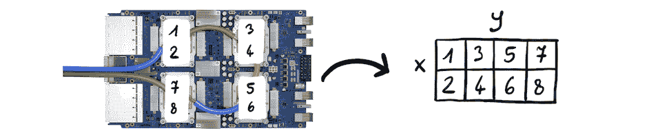
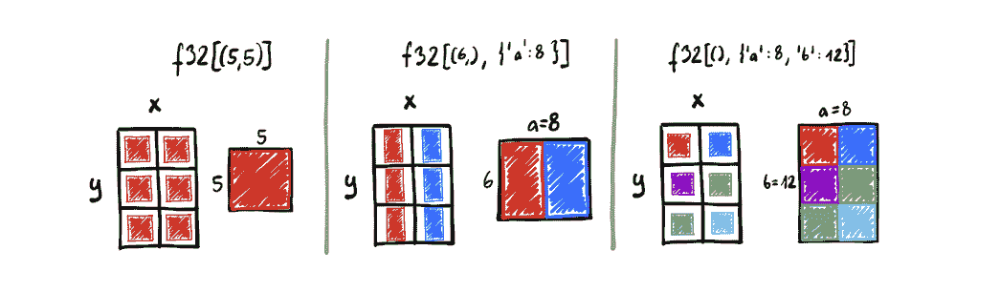

# 命名轴和 `xmap` 轻松修改并行处理策略

> 原文：[`jax.readthedocs.io/en/latest/notebooks/xmap_tutorial.html`](https://jax.readthedocs.io/en/latest/notebooks/xmap_tutorial.html)

***更新：*** `xmap` 已弃用，并将在未来版本中删除。在 JAX 中执行多设备编程的推荐方法是使用：1) [`jit`（计算自动分区和 `jax.Array` 分片）](https://jax.readthedocs.io/en/latest/notebooks/Distributed_arrays_and_automatic_parallelization.html); 和/或 2) [`shard_map`（手动数据分片）](https://jax.readthedocs.io/en/latest/jep/14273-shard-map.html)。详细了解请参阅[`shard_map` JEP 文档中的“为什么 `pmap` 或 `xmap` 不能解决此问题？”](https://jax.readthedocs.io/en/latest/jep/14273-shard-map.html#why-don-t-pmap-or-xmap-already-solve-this)。

本教程介绍了 JAX `xmap` (`jax.experimental.maps.xmap`) 和随附的命名轴编程模型。通过阅读本教程，您将学习如何使用命名轴编写避免错误、自描述的函数，然后控制它们在从笔记本电脑 CPU 到最大 TPU 超级计算机的任何规模的硬件上执行的方式。

我们从一个玩具神经网络的例子开始。

## 从玩具神经网络中的位置到名称

JAX 的演示通常从纯 NumPy 编写的简单神经网络预测函数和损失开始。这是一个具有一个隐藏层的简单网络：

```py
import os
os.environ["XLA_FLAGS"] = '--xla_force_host_platform_device_count=8' # Use 8 CPU devices 
```

```py
import jax.numpy as jnp
from jax import lax
from jax.nn import one_hot, relu
from jax.scipy.special import logsumexp

def predict(w1, w2, images):
  hiddens = relu(jnp.dot(images, w1))
  logits = jnp.dot(hiddens, w2)
  return logits - logsumexp(logits, axis=1, keepdims=True)

def loss(w1, w2, images, labels):
  predictions = predict(w1, w2, images)
  targets = one_hot(labels, predictions.shape[-1])
  losses = jnp.sum(targets * predictions, axis=1)
  return -jnp.mean(losses, axis=0) 
```

然后我们可以用正确的形状初始化输入并计算损失值：

```py
w1 = jnp.zeros((784, 512))
w2 = jnp.zeros((512, 10))
images = jnp.zeros((128, 784))
labels = jnp.zeros(128, dtype=jnp.int32)

print(loss(w1, w2, images, labels)) 
```

这是我们如何使用命名轴写相同函数的方式。如果您无法理解 API 的细节，请不要担心。现在这些不重要，我们将逐步解释一切。这只是为了展示在学习之前您可以使用 xmap 做些什么！

```py
def named_predict(w1, w2, image):
  hidden = relu(lax.pdot(image, w1, 'inputs'))
  logits = lax.pdot(hidden, w2, 'hidden')
  return logits - logsumexp(logits, 'classes')

def named_loss(w1, w2, images, labels):
  predictions = named_predict(w1, w2, images)
  num_classes = lax.psum(1, 'classes')
  targets = one_hot(labels, num_classes, axis='classes')
  losses = lax.psum(targets * predictions, 'classes')
  return -lax.pmean(losses, 'batch') 
```

这段代码更简单：我们在调用 `jnp.dot` 等函数时不需要担心轴的顺序，也不需要记住使用 `logsumexp`、`jnp.sum` 或 `jnp.mean` 时要减少哪个轴位置。

但真正的优势在于，名称使我们可以使用 `xmap` 控制函数的执行。最简单的情况下，`xmap` 将仅在所有命名轴上向量化，使函数的执行方式与其位置轴的对应方式相同：

```py
from jax.experimental.maps import xmap

in_axes = [['inputs', 'hidden', ...],
           ['hidden', 'classes', ...],
           ['batch', 'inputs', ...],
           ['batch', ...]]

loss = xmap(named_loss, in_axes=in_axes, out_axes=[...])
print(loss(w1, w2, images, labels)) 
```

但我们可以随心所欲地决定在批处理轴上进行并行处理：

```py
import jax
import numpy as np
from jax.sharding import Mesh

loss = xmap(named_loss, in_axes=in_axes, out_axes=[...],
            axis_resources={'batch': 'x'})

devices = np.array(jax.local_devices())
with Mesh(devices, ('x',)):
  print(loss(w1, w2, images, labels)) 
```

或者我们可能希望在隐藏轴上执行模型并行处理：

```py
loss = xmap(named_loss, in_axes=in_axes, out_axes=[...],
            axis_resources={'hidden': 'x'})

devices = np.array(jax.local_devices())
with Mesh(devices, ('x',)):
  print(loss(w1, w2, images, labels)) 
```

或者我们可能希望同时进行模型和批处理数据的并行处理：

```py
loss = xmap(named_loss, in_axes=in_axes, out_axes=[...],
            axis_resources={'batch': 'x', 'hidden': 'y'})

devices = np.array(jax.local_devices()).reshape((4, 2))
with Mesh(devices, ('x', 'y')):
  print(loss(w1, w2, images, labels)) 
```

使用 `xmap`，我们可以随时修改我们的并行处理策略，而无需重写我们的神经网络函数。

## 准备工作

```py
import jax.numpy as jnp
from jax import lax
from functools import partial
import jax
import numpy as np 
```

为了更好地说明新的编程模型，我们在本笔记本中广泛使用自定义类型注释。这些注释不会影响代码的评估方式，并且现在将不会进行检查。

```py
from typing import Any, Callable

class ArrayType:
  def __getitem__(self, idx):
    return Any
f32 = ArrayType()
i32 = ArrayType() 
```

## 具有命名轴的张量

NumPy 编程模型是围绕 nd-arrays 构建的。每个 nd-array 可以与两部分类型相关联：

+   元素类型（通过`.dtype` 属性访问）

+   形状（由`.shape`给出的整数元组）。

使用我们的小型类型注释语言，我们将这些类型写成`dtype[shape_tuple]`。

> 例如，一个由 32 位浮点数构成的 5x7x4 数组将被表示为`f32[(5, 7, 4)]`。

这里有一个小例子，展示了注释如何演示形状在简单 NumPy 程序中传播的方式：

```py
x: f32[(2, 3)] = np.ones((2, 3), dtype=np.float32)
y: f32[(3, 5)] = np.ones((3, 5), dtype=np.float32)
z: f32[(2, 5)] = x.dot(y)  # matrix multiplication
w: f32[(7, 1, 5)] = np.ones((7, 1, 5), dtype=np.float32)
q: f32[(7, 2, 5)] = z + w  # broadcasting 
```

我们建议的扩展是添加另一个数组类型的组成部分：一个`named_shape`，将轴名称（任意可散列对象，字符串是常见选择）映射到整数大小。最重要的是，因为每个轴都有一个名称，它们的顺序没有意义。也就是说，`{'a': 2, 'b': 5}`的命名形状与`{'b': 5, 'a': 2}`的命名形状是无法区分的。

> 这并不是一个全新的想法。过去提出使用命名轴的一些好例子包括：[Mesh TensorFlow](https://github.com/tensorflow/mesh)、[Tensor Considered Harmful](http://nlp.seas.harvard.edu/NamedTensor)宣言，以及[xarray](http://xarray.pydata.org/en/stable/)和[einops](http://einops.rocks/)包。请记住，这些中许多在于它们在 JAX 中无序，尽管它们会为命名轴分配顺序。

从现在开始，我们将允许类型注释具有两个组件，第一个仍然是值的`.shape`，而第二个将是`.named_shape`。

```py
e: f32[(5, 7), {'batch': 20, 'sequence': 30}]
# e.shape == (5, 7)
# e.named_shape == {'batch': 20, 'sequence': 30} == {'sequence': 30, 'batch': 20} 
```

虽然我们不修改`.ndim`的含义（始终等于`len(shape)`）和`.size`的含义（等于`shape`的乘积），但我们仅出于向后兼容性的原因而这样做。具有非空命名轴的数组的真实秩为`len(shape) + len(named_shape)`。存储在这种数组中的元素的真实数量等于所有维度的大小的乘积，包括位置和命名维度。

## 引入和消除命名轴

但是，如果所有顶级 JAX 操作都使用纯位置轴的 NumPy 模型，那么如何创建这样的数组呢？尽管在某些时候可以解除此约束，但目前引入命名轴的唯一方式是使用`xmap`。

`xmap`可以被视为一种适配器，接受具有位置轴的数组，将其中一些命名（由`in_axes`指定），并调用其包装的函数。一旦包装函数返回数组，所有出现在其中的命名轴都会转换回位置轴（由`out_axes`指定）。

`in_axes`的结构应该与`xmap`函数参数的签名匹配，但所有数组参数的位置都应被*轴映射*替换。有两种指定轴映射的方式：

+   作为将位置轴映射到轴名称的字典（例如`{0: 'x', 2: 'y'}`）；以及

+   作为以省略号对象结尾的轴名称列表（例如`['a', 'b', ...]`），指示要将一组位置维度映射到给定名称。

`out_axes`类似，但其结构必须与`xmap`函数的返回签名匹配（但再次，所有数组都用轴映射替换）。

对于每个数组参数，其各自的`in_axes`轴映射中提到的所有位置轴都会转换为命名轴。对于每个数组结果，所有命名轴都插入到其各自`out_axes`指示的位置中。

```py
from jax.experimental.maps import xmap

def my_func(x: f32[(5,), {'batch': 20}]) -> f32[(5,), {'batch': 20}]:
  assert x.shape == (5,)
  # assert x.named_shape == {'batch': 20}  # TODO: Implement named_shape
  return x

x: f32[(20, 5)] = jnp.zeros((20, 5), dtype=np.float32)
f = xmap(my_func,
         in_axes={0: 'batch'},   # Name the first axis of the only argument 'batch'
         out_axes={1: 'batch'})  # Place the 'batch' named axis of the output as the second positional axis
y: f32[(5, 20)] = f(x)
assert (y == x.T).all()  # The first dimension was removed from x and then re-inserted as the last dim 
```

虽然起初可能会有些困难，但如果您见过使用`jnp.einsum`的代码，您已经熟悉这种方法。 `einsum`函数解释表达式如`nk,km->nm`，为位置轴分配名称（每个字母被视为单独的名称），执行必要的广播和约简，最后根据`->`分隔符右侧给定的顺序将结果放回位置轴。虽然`einsum`从不让您直接与命名轴交互，但它们在其实现中自然出现。 `xmap`是*广义的 einsum*，因为现在命名轴是一流的，您可以实现可以操作它们的函数。

继续这个类比，上述示例中的`xmap(my_func, ...)`等同于`jnp.einsum('bx->xb')`。但当然，并非每个`xmap`的函数都有等效的`einsum`。

还有一个与`einsum`相似的地方是，每当一个名称被多个轴重用时，它们必须具有相同的大小：

```py
x = jnp.arange(5)
y = jnp.arange(7)
try:
  jnp.einsum('i,i->i', x, y)
except Exception as e:
  print('einsum:', e)
try:
  xmap(lambda x, y: x * y,
       in_axes=(['i', ...], ['i', ...]),
       out_axes=['i', ...])(x, y)
except Exception as e:
  print('xmap:', e) 
```

## 命名轴传播

我们现在知道了命名轴是如何引入和消除的，但它们有什么好处？它们如何在整个程序中传播？让我们来探讨几个例子。

### 与位置轴的交互

第一条规则：命名轴从不隐式与位置轴交互。任何未考虑命名轴的函数总是可以使用具有命名尺寸的输入调用。结果与应用`vmap`到每个命名轴基础上时的结果相同。

```py
from jax.scipy.linalg import expm_frechet

# Any other function that does not assume existence of any named axes would do too,
# at least as long as it matches this type signature:
expm_frechet: Callable[[f32[(3, 3)], f32[(3, 3)]], f32[(3, 3)]]
f = partial(expm_frechet, compute_expm=False)

# Each A with each E
batch_A = jnp.ones((5, 3, 3), dtype=np.float32)
batch_E = jnp.ones((5, 3, 3), dtype=np.float32)
batch_AE = xmap(f,
                in_axes=(['b', ...], ['b', ...]),      # Map first axes of both inputs to 'b'
                out_axes=['b', ...])(batch_A, batch_E) # Place 'b' as the first positional axis in the result
for i in range(5):
  np.testing.assert_allclose(batch_AE[i], f(batch_A[i], batch_E[i]))

# All-pairs of As and Es
batch_A = jnp.ones((7, 3, 3), dtype=np.float32)
batch_E = jnp.ones((5, 3, 3), dtype=np.float32)
batch_AE = xmap(f,
                in_axes=(['ba', ...], ['be', ...]),           # Map first axes of inputs to 'ba' and 'be' respectively
                out_axes=['ba', 'be', ...])(batch_A, batch_E) # Prefix all positional dimensions of output with 'ba' and 'be'
for i in range(7):
  for j in range(5):
    np.testing.assert_allclose(batch_AE[i,j], f(batch_A[i], batch_E[j])) 
```

### 广播

其次，命名轴通过*名称*进行广播，几乎每个现有的 NumPy（以及几乎每个 JAX）运算符都会隐式地广播命名维度。每当使用具有命名轴的数组调用标准 NumPy 函数时，NumPy 函数确定结果数组的位置形状，而命名形状成为其输入所有命名形状的并集。分析以下示例以了解轴如何传播：

```py
def named_broadcasting(
    x: f32[(2, 1, 1), {'a': 2}],
    y: f32[(1, 3, 1), {'b': 3}],
    z: f32[(1, 1, 5), {'c': 5}]) \
      -> f32[(2, 3, 5), {'a': 2, 'b': 3, 'c': 5}]:
  i: f32[(2, 3, 1), {'a': 2, 'b': 3}] = x + y
  j: f32[(1, 3, 5), {'b': 3, 'c': 5}] = y + z
  k: f32[(2, 3, 5), {'a': 2, 'b': 3, 'c': 5}] = i + j
  return k

x = jnp.ones((2, 2, 1, 1), dtype=np.float32)
y = jnp.ones((3, 1, 3, 1), dtype=np.float32)
z = jnp.ones((5, 1, 1, 5), dtype=np.float32)
k = xmap(named_broadcasting,
         in_axes=(['a', ...], ['b', ...], ['c', ...]),
         out_axes=['a', 'b', 'c', ...])(x, y, z)
assert k.shape == (2, 3, 5, 2, 3, 5) 
```

总结一下，例如表达式`i + j`的结果的命名形状，其中`i`的命名形状为`{'a': 2, 'b': 3}`，`j`为`{'b': 3, 'c': 5}`，则为`{'a': 2, 'b': 3, 'c': 5}`。 `'b'`轴存在于两个输入中，因此不需要广播，而`'a'`和`'c'`仅出现在两个输入中的一个中，导致另一个沿其命名形状中缺少的轴进行广播。

操作命名轴时不会出现形状错误，因为`xmap`强制其体内的单个名称与单个大小关联。

> 尽管广播命名轴的规则可能看起来像 NumPy 模型的任意扩展，但实际上与其一致。
> 
> 广播首先查找它认为在两个操作数中等效的维度对。对于所有匹配的维度对，它断言两个尺寸要么相等，要么其中一个为 1。所有未配对的维度都传递到结果中。
> 
> 现在，在位置世界中，NumPy 广播选择形成对的方式是通过右对齐形状。但是我们的轴是有名称的，因此找到等效轴的方法非常直接：只需检查它们的名称是否相等！

### 缩减

但是，命名轴不仅对批处理有益！实际上，我们的目标是，命名轴应等同于位置轴。特别是，每个将位置轴作为参数的 NumPy 函数也应接受命名轴。

> 上面的段落是雄心勃勃的，接受具有命名轴的 NumPy 函数的集合相对有限。目前，仅支持具有命名轴的：
> 
> +   `jnp.sum`、`jnp.max`、`jnp.min`

缩减是一个很好的例子：

```py
def named_broadcast_and_reduce(
    x: f32[(), {'x': 2}],
    y: f32[(5,), {'y': 4}]) \
      -> f32[()]:
  z: f32[(5,), {'x': 2, 'y': 4}] = x + y
  w: f32[()] = jnp.sum(z, axis=(0, 'x', 'y'))
  # We could also reduce in steps:
  # w0 : f32[(), {'x': 2, 'y': 4}] = jnp.sum(z, 0)      # eliminate the positional axis
  # w0x: f32[(), {'y': 4}]         = jnp.sum(w0, 'x')   # eliminate the `x` axis
  # w  : f32[()]                   = jnp.sum(w0x, 'y')  # eliminate the `y` axis
  return w

positional_broadcast_and_reduce: Callable[[f32[(2,)], f32[(5, 4)]], f32[()]]
positional_broadcast_and_reduce = \
  xmap(named_broadcast_and_reduce,
       in_axes=({0: 'x'}, {1: 'y'}),
       out_axes={})
positional_broadcast_and_reduce(jnp.arange(2, dtype=np.float32),
                                jnp.arange(20, dtype=np.float32).reshape((5, 4))) 
```

### `einsum`

类似于我们如何扩展支持命名轴的缩减，我们还使得可以使用`jnp.einsum`在命名轴上进行收缩成为可能。

操作数和结果仍然使用每个位置轴的一个字母的约定，但现在也可以在花括号中提到命名轴。例如，`n{b,k}`表示一个值将具有单个位置维度`n`和命名维度`b`和`k`（它们的顺序不重要）。按照通常的 einsum 语义，任何出现在输入中但不出现在输出中的命名轴都将被收缩（在执行所有乘法后求和）。

可以接受从*所有参数和结果*中省略一个命名维度，此时它将根据通常的广播语义处理。但是，在一个参数中提到具有命名形状的命名轴并跳过另一个参数中也具有它的命名形状是不可接受的。当然，在没有它的参数中跳过它是必需的。

> 注意：目前**未经检查**（仍在进行中）。这种跳过轴将导致未定义的行为。
> 
> 目前，`jnp.einsum`仅支持两个输入和单个结果的命名轴。

```py
def named_batch_matrix_single_matrix(
    x: f32[(5,), {'b': 20, 'k': 7}],
    y: f32[(), {'k': 7, 'm': 11}]) \
      -> f32[(5,), {'b': 20, 'm': 11}]:
  return jnp.einsum('n{b,k},{k,m}->n{b,m}', x, y)

x = jnp.ones((20, 5, 7))
y = jnp.ones((7, 11))
z = jnp.einsum('bnk,km->bnm', x, y)
zx = xmap(named_batch_matrix_single_matrix,
          in_axes=[{0: 'b', 2: 'k'}, ['k', 'm', ...]],
          out_axes={0: 'b', 2: 'm'})(x, y)
np.testing.assert_allclose(z, zx) 
```

上面的示例毫不意外地比直接使用`jnp.einsum`更清晰。但是，对命名轴的收缩是更大应用（如 Transformer 模型）的关键组成部分，这只是一个演示如何传播名称的练习。

### 集合

最后，所有可能用于`pmap`函数的集合在命名轴上也有效。正如我们稍后将展示的，`xmap`可以作为`pmap`的替代方案，使多维硬件网格的编程变得更加容易。

```py
x = jnp.arange(8)
xmap(lambda x: lax.pshuffle(x, 'i', list(reversed(range(8)))),
     in_axes=['i', ...], out_axes=['i', ...])(x) 
```

## 并行支持

尽管新的编程范式有时可能很好，但 `xmap` 的杀手级特性在于其能够在超级计算机规模的硬件网格上并行化代码！

> 命名轴是使所有这一切成为可能的秘密武器，多亏了精心调整的规则来描述它们的传播方式。在纯位置编程模型中支持分区通常非常困难。位置轴通常是一次性的，很难跟踪轴分区传播方式。正如您将在下文中看到的，命名轴使我们能够定义它们的名称与硬件资源之间直接的对应关系，从而使我们能够轻松推断不同值的分区方式。

在所有先前的示例中，我们还没有提到并行性，有其原因。默认情况下，`xmap` 不执行任何并行化，而是像 `vmap` 一样向量化计算（即仍然在单个设备上执行）。要在多个加速器上分区计算，我们必须引入一个概念：*资源轴*。

基本思想是逻辑轴（出现在命名形状中的轴）假设我们拥有充足的硬件和内存，但在程序执行之前，它们必须放置在某个位置。默认的（类似 `vmap` 的）评估风格在默认的 JAX 设备上付出了高昂的内存成本。通过通过 `axis_resources` 参数将逻辑轴映射到（一个或多个）资源轴，我们可以控制 `xmap` 如何评估计算。

```py
x = jnp.ones((2048, 2048))

local_matmul = xmap(jnp.vdot,
                    in_axes=({0: 'left'}, {1: 'right'}),
                    out_axes=['left', 'right', ...])
distr_matmul = xmap(jnp.vdot,
                    in_axes=({0: 'left'}, {1: 'right'}),
                    out_axes=['left', 'right', ...],
                    axis_resources={'left': 'x', 'right': 'y'}) 
```

`local_matmul` 和 `distr_matmul` 都实现了矩阵乘法，但 `distr_matmul` 会额外将 `left` 和 `right` 逻辑轴分割到 `x` 和 `y` 资源轴上。

### 但是... 这些资源名称是从哪里来的呢？

嗯，这取决于情况，但一个很好的选择是... 硬件网格！

对于我们的目的，网格是一个带有命名轴的设备 nd-数组。但由于 NumPy 不支持命名轴（这是我们的扩展！），网格由 JAX 设备对象的 nd-数组对（如从 `jax.devices()` 或 `jax.local_devices()` 获得的对象）和长度与数组秩匹配的资源轴名称元组表示。



```py
axis_names = ('x', 'y')
mesh_devices = np.array(jax.devices()).reshape((2, 4))
assert len(axis_names) == mesh_devices.ndim
mesh_def = (mesh_devices, axis_names)
mesh_def 
```

网格轴名称正是可以将命名轴映射到的资源名称。但仅创建网格定义并不会使资源名称对 `distr_matmul` 可见：

```py
try:
  distr_matmul(x, x)
except Exception as e:
  print(e) 
```

要在范围内引入资源，请使用 `with Mesh` 上下文管理器：

```py
from jax.sharding import Mesh

local = local_matmul(x, x)  # The local function doesn't require the mesh definition
with Mesh(*mesh_def):  # Makes the mesh axis names available as resources
  distr = distr_matmul(x, x)
np.testing.assert_allclose(local, distr) 
```

不过，最好的部分在于，指定`axis_resources`**从不改变程序语义**。您可以自由尝试不同的计算分区方式（只需更改资源分配到命名轴的分配！），甚至可以更改网格中物理设备的组织方式（通过更改设备的 NumPy 数组构造）。这些变化不应对您获得的结果产生重大影响（例如浮点精度不准确性），尽管当然其中一些方法的性能显著优于其他方法。

`xmap`目前不提供任何自动调度选项，因为最佳调度通常必须与您的程序相匹配。我们正在考虑在未来添加对此的支持，但这需要时间。

> 一旦您将逻辑轴映射到网格维度，该逻辑轴的大小必须可被网格维度大小整除。

### 我的数据是复制的吗？还是分区的？它在哪里？

命名轴还为我们提供了一种关于分区和复制的简洁方式。如果一个值在网格轴上分区，则该值的命名轴已在其形状中映射到该网格轴。否则，它将在该轴上的所有切片中复制。

例如，假设我们在具有`axis_resources={'a': 'x', 'b': 'y'}`的`xmap`中（即在具有分别大小为 2 和 3 的`x`和`y`轴上运行计算）。那么：

+   类型为`f32[(5, 5), {}]`的数组在整个网格上完全复制。所有设备存储该值的本地副本。

+   类型为`f32[(6,), {'a': 8}]`的数组在网格轴`x`上进行分区，因为其命名形状中含有`'a'`，且`'a'`被映射到`x`。它在网格轴`y`上复制。换句话说，网格切片中具有相同`x`坐标的所有设备将存储该数组的一块本地副本。而具有不同`x`坐标的网格切片将存储数据的不同块。

+   类型为`f32[(), {'a': 8, 'c': 7}]`的数组与前一情况完全相同：在`x`网格轴上分割，在`y`轴上复制。未指定资源的命名维度在考虑分区时与位置维度没有任何不同，因此`'c'`对其没有影响。

+   类型为`f32[(), {'a': 8, 'b': 12}]`的数组完全分区在整个网格上。每个设备持有数据的不同块。



这也突显了一个限制：如果您指定`axis_resources={'a': 'x', 'b': 'x'}`，`xmap`不会发出投诉，但请考虑`f32[(2, 8), {'a': 4, 'b': 12}]`类型的数组如何分区。如果`x`网格轴的大小为 2，则我们只有 2 个设备，但我们有 4 个要放置的块（2 个沿着`'a'`和 2 个沿着`'b'`）！现在我们可以完整陈述：**映射到相同资源的命名轴永远不能同时出现在单个数组的命名形状中**。但它们可以出现在两个不同数组的命名形状中，例如在这个程序中：

```py
def sum_two_args(x: f32[(), {'a': 4}], y: f32[(), {'b': 12}]) -> f32[()]:
  return jnp.sum(x, axis='a') + jnp.sum(y, axis='b')

q = jnp.ones((4,), dtype=np.float32)
u = jnp.ones((12,), dtype=np.float32)
with Mesh(np.array(jax.devices()[:4]), ('x',)):
  v = xmap(sum_two_args,
           in_axes=(['a', ...], ['b', ...]),
           out_axes=[...],
           axis_resources={'a': 'x', 'b': 'x'})(q, u)
  print(v) 
```

这个程序是有效的，因为`jnp.sum`在值相加之前消除了不能同时出现的轴。

> 尽管最终版本的`xmap`将确保您不会意外地这样做，但当前实现并*不验证它*。违反此限制将导致*未定义的行为*。

### 为什么选择`axis_resources`而不是更直接地映射到硬件？

此时您可能会想为什么要引入混合中的另一个资源轴的绕道。只要您对在硬件上分区您的计算感兴趣，就没有好的理由，但这种思维框架比那更灵活！

例如，我们都在处理一个额外的资源：时间！就像计算可以分区到多个硬件设备上，例如降低其内存使用，同样的事情可以通过一个单一的加速器实现，该加速器在多个步骤中评估计算的一个块。

因此，虽然硬件网格目前是 JAX 程序中资源轴的唯一来源，但我们计划扩展整个系统以涵盖其他来源。

## 将位置代码移植到命名代码

在本节中，我们将举几个实际例子，展示`xmap`如何帮助您实现和分发各种模型。

> **本节内容正在完善**
