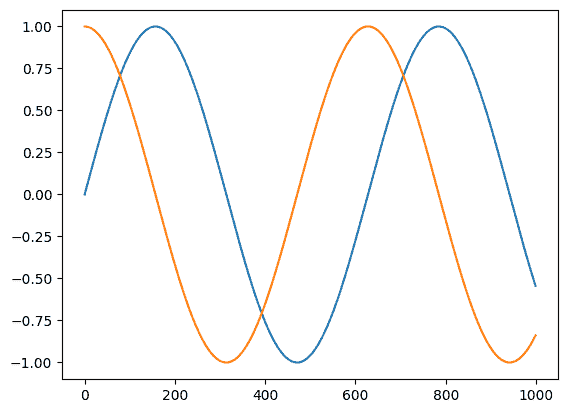

# JAX 可转换的 Python 函数的自定义导数规则

> 原文：[`jax.readthedocs.io/en/latest/notebooks/Custom_derivative_rules_for_Python_code.html`](https://jax.readthedocs.io/en/latest/notebooks/Custom_derivative_rules_for_Python_code.html)

 

*mattjj@ Mar 19 2020, last updated Oct 14 2020*

JAX 中定义微分规则的两种方式：

1.  使用 `jax.custom_jvp` 和 `jax.custom_vjp` 来为已经可转换为 JAX 的 Python 函数定义自定义微分规则；以及

1.  定义新的 `core.Primitive` 实例及其所有转换规则，例如调用来自其他系统（如求解器、模拟器或一般数值计算系统）的函数。

本笔记本讨论的是 #1\. 要了解关于 #2 的信息，请参阅[关于添加原语的笔记本](https://jax.readthedocs.io/en/latest/notebooks/How_JAX_primitives_work.html)。

关于 JAX 自动微分 API 的介绍，请参阅[自动微分手册](https://jax.readthedocs.io/en/latest/notebooks/autodiff_cookbook.html)。本笔记本假定读者已对[jax.jvp](https://jax.readthedocs.io/en/latest/jax.html#jax.jvp)和[jax.grad](https://jax.readthedocs.io/en/latest/jax.html#jax.grad)，以及 JVPs 和 VJPs 的数学含义有一定了解。

## TL;DR

### 使用 `jax.custom_jvp` 进行自定义 JVPs

```py
import jax.numpy as jnp
from jax import custom_jvp

@custom_jvp
def f(x, y):
  return jnp.sin(x) * y

@f.defjvp
def f_jvp(primals, tangents):
  x, y = primals
  x_dot, y_dot = tangents
  primal_out = f(x, y)
  tangent_out = jnp.cos(x) * x_dot * y + jnp.sin(x) * y_dot
  return primal_out, tangent_out 
```

```py
from jax import jvp, grad

print(f(2., 3.))
y, y_dot = jvp(f, (2., 3.), (1., 0.))
print(y)
print(y_dot)
print(grad(f)(2., 3.)) 
```

```py
2.7278922
2.7278922
-1.2484405
-1.2484405 
```

```py
# Equivalent alternative using the defjvps convenience wrapper

@custom_jvp
def f(x, y):
  return jnp.sin(x) * y

f.defjvps(lambda x_dot, primal_out, x, y: jnp.cos(x) * x_dot * y,
          lambda y_dot, primal_out, x, y: jnp.sin(x) * y_dot) 
```

```py
print(f(2., 3.))
y, y_dot = jvp(f, (2., 3.), (1., 0.))
print(y)
print(y_dot)
print(grad(f)(2., 3.)) 
```

```py
2.7278922
2.7278922
-1.2484405
-1.2484405 
```

### 使用 `jax.custom_vjp` 进行自定义 VJPs

```py
from jax import custom_vjp

@custom_vjp
def f(x, y):
  return jnp.sin(x) * y

def f_fwd(x, y):
# Returns primal output and residuals to be used in backward pass by f_bwd.
  return f(x, y), (jnp.cos(x), jnp.sin(x), y)

def f_bwd(res, g):
  cos_x, sin_x, y = res # Gets residuals computed in f_fwd
  return (cos_x * g * y, sin_x * g)

f.defvjp(f_fwd, f_bwd) 
```

```py
print(grad(f)(2., 3.)) 
```

```py
-1.2484405 
```

## 示例问题

要了解 `jax.custom_jvp` 和 `jax.custom_vjp` 所解决的问题，我们可以看几个例子。有关 `jax.custom_jvp` 和 `jax.custom_vjp` API 的更详细介绍在下一节中。

### 数值稳定性

`jax.custom_jvp` 的一个应用是提高微分的数值稳定性。

假设我们想编写一个名为 `log1pexp` 的函数，用于计算 \(x \mapsto \log ( 1 + e^x )\)。我们可以使用 `jax.numpy` 来写：

```py
import jax.numpy as jnp

def log1pexp(x):
  return jnp.log(1. + jnp.exp(x))

log1pexp(3.) 
```

```py
Array(3.0485873, dtype=float32, weak_type=True) 
```

因为它是用 `jax.numpy` 编写的，所以它是 JAX 可转换的：

```py
from jax import jit, grad, vmap

print(jit(log1pexp)(3.))
print(jit(grad(log1pexp))(3.))
print(vmap(jit(grad(log1pexp)))(jnp.arange(3.))) 
```

```py
3.0485873
0.95257413
[0.5       0.7310586 0.8807971] 
```

但这里存在一个数值稳定性问题：

```py
print(grad(log1pexp)(100.)) 
```

```py
nan 
```

那似乎不对！毕竟，\(x \mapsto \log (1 + e^x)\) 的导数是 \(x \mapsto \frac{e^x}{1 + e^x}\)，因此对于大的 \(x\) 值，我们期望值约为 1。

通过查看梯度计算的 jaxpr，我们可以更深入地了解发生了什么：

```py
from jax import make_jaxpr

make_jaxpr(grad(log1pexp))(100.) 
```

```py
{ lambda ; a:f32[]. let
    b:f32[] = exp a
    c:f32[] = add 1.0 b
    _:f32[] = log c
    d:f32[] = div 1.0 c
    e:f32[] = mul d b
  in (e,) } 
```

通过分析 jaxpr 如何评估，我们可以看到最后一行涉及的值相乘会导致浮点数计算四舍五入为 0 和 \(\infty\)，这从未是一个好主意。也就是说，我们实际上在评估大数值的情况下，计算的是 `lambda x: (1 / (1 + jnp.exp(x))) * jnp.exp(x)`，这实际上会变成 `0. * jnp.inf`。

而不是生成这样大和小的值，希望浮点数能够提供的取消，我们宁愿将导数函数表达为一个更稳定的数值程序。特别地，我们可以编写一个程序，更接近地评估相等的数学表达式 \(1 - \frac{1}{1 + e^x}\)，看不到取消。

这个问题很有趣，因为即使我们的`log1pexp`的定义已经可以进行 JAX 微分（并且可以使用`jit`、`vmap`等转换），我们对应用标准自动微分规则到组成`log1pexp`并组合结果的结果并不满意。相反，我们想要指定整个函数`log1pexp`如何作为一个单位进行微分，从而更好地安排这些指数。

这是关于 Python 函数的自定义导数规则的一个应用，这些函数已经可以使用 JAX 进行转换：指定如何对复合函数进行微分，同时仍然使用其原始的 Python 定义进行其他转换（如`jit`、`vmap`等）。

这里是使用`jax.custom_jvp`的解决方案：

```py
from jax import custom_jvp

@custom_jvp
def log1pexp(x):
  return jnp.log(1. + jnp.exp(x))

@log1pexp.defjvp
def log1pexp_jvp(primals, tangents):
  x, = primals
  x_dot, = tangents
  ans = log1pexp(x)
  ans_dot = (1 - 1/(1 + jnp.exp(x))) * x_dot
  return ans, ans_dot 
```

```py
print(grad(log1pexp)(100.)) 
```

```py
1.0 
```

```py
print(jit(log1pexp)(3.))
print(jit(grad(log1pexp))(3.))
print(vmap(jit(grad(log1pexp)))(jnp.arange(3.))) 
```

```py
3.0485873
0.95257413
[0.5       0.7310586 0.8807971] 
```

这里是一个`defjvps`方便包装，来表达同样的事情：

```py
@custom_jvp
def log1pexp(x):
  return jnp.log(1. + jnp.exp(x))

log1pexp.defjvps(lambda t, ans, x: (1 - 1/(1 + jnp.exp(x))) * t) 
```

```py
print(grad(log1pexp)(100.))
print(jit(log1pexp)(3.))
print(jit(grad(log1pexp))(3.))
print(vmap(jit(grad(log1pexp)))(jnp.arange(3.))) 
```

```py
1.0
3.0485873
0.95257413
[0.5       0.7310586 0.8807971] 
```

### 强制执行微分约定

一个相关的应用是强制执行微分约定，也许在边界处。

考虑函数 \(f : \mathbb{R}_+ \to \mathbb{R}_+\)，其中 \(f(x) = \frac{x}{1 + \sqrt{x}}\)，其中我们取 \(\mathbb{R}_+ = [0, \infty)\)。我们可以像这样实现 \(f\) 的程序：

```py
def f(x):
  return x / (1 + jnp.sqrt(x)) 
```

作为在\(\mathbb{R}\)上的数学函数（完整的实数线），\(f\) 在零点是不可微的（因为从左侧定义导数的极限不存在）。相应地，自动微分产生一个`nan`值：

```py
print(grad(f)(0.)) 
```

```py
nan 
```

但是数学上，如果我们将 \(f\) 视为 \(\mathbb{R}_+\) 上的函数，则它在 0 处是可微的 [Rudin 的《数学分析原理》定义 5.1，或 Tao 的《分析 I》第 3 版定义 10.1.1 和例子 10.1.6]。或者，我们可能会说，作为一个惯例，我们希望考虑从右边的方向导数。因此，对于 Python 函数`grad(f)`在`0.0`处返回 1.0 是有意义的值。默认情况下，JAX 对微分的机制假设所有函数在\(\mathbb{R}\)上定义，因此这里并不会产生`1.0`。

我们可以使用自定义的 JVP 规则！特别地，我们可以定义 JVP 规则，关于导数函数 \(x \mapsto \frac{\sqrt{x} + 2}{2(\sqrt{x} + 1)²}\) 在 \(\mathbb{R}_+\) 上，

```py
@custom_jvp
def f(x):
  return x / (1 + jnp.sqrt(x))

@f.defjvp
def f_jvp(primals, tangents):
  x, = primals
  x_dot, = tangents
  ans = f(x)
  ans_dot = ((jnp.sqrt(x) + 2) / (2 * (jnp.sqrt(x) + 1)**2)) * x_dot
  return ans, ans_dot 
```

```py
print(grad(f)(0.)) 
```

```py
1.0 
```

这里是方便包装版本：

```py
@custom_jvp
def f(x):
  return x / (1 + jnp.sqrt(x))

f.defjvps(lambda t, ans, x: ((jnp.sqrt(x) + 2) / (2 * (jnp.sqrt(x) + 1)**2)) * t) 
```

```py
print(grad(f)(0.)) 
```

```py
1.0 
```

### 梯度剪裁

虽然在某些情况下，我们想要表达一个数学微分计算，在其他情况下，我们甚至可能想要远离数学，来调整自动微分的计算。一个典型的例子是反向模式梯度剪裁。

对于梯度剪裁，我们可以使用`jnp.clip`和一个`jax.custom_vjp`仅逆模式规则：

```py
from functools import partial
from jax import custom_vjp

@custom_vjp
def clip_gradient(lo, hi, x):
  return x  # identity function

def clip_gradient_fwd(lo, hi, x):
  return x, (lo, hi)  # save bounds as residuals

def clip_gradient_bwd(res, g):
  lo, hi = res
  return (None, None, jnp.clip(g, lo, hi))  # use None to indicate zero cotangents for lo and hi

clip_gradient.defvjp(clip_gradient_fwd, clip_gradient_bwd) 
```

```py
import matplotlib.pyplot as plt
from jax import vmap

t = jnp.linspace(0, 10, 1000)

plt.plot(jnp.sin(t))
plt.plot(vmap(grad(jnp.sin))(t)) 
```

```py
[<matplotlib.lines.Line2D at 0x7f43dfc210f0>] 
```



```py
def clip_sin(x):
  x = clip_gradient(-0.75, 0.75, x)
  return jnp.sin(x)

plt.plot(clip_sin(t))
plt.plot(vmap(grad(clip_sin))(t)) 
```

```py
[<matplotlib.lines.Line2D at 0x7f43ddb15fc0>] 
```


### Python 调试

另一个应用，是受开发工作流程而非数值驱动的动机，是在反向模式自动微分的后向传递中设置`pdb`调试器跟踪。

在尝试追踪`nan`运行时错误的来源，或者仅仔细检查传播的余切（梯度）值时，可以在反向传递中的特定点插入调试器非常有用。您可以使用`jax.custom_vjp`来实现这一点。

我们将在下一节中推迟一个示例。

### 迭代实现的隐式函数微分

这个例子涉及到了数学中的深层问题！

另一个应用`jax.custom_vjp`是对可通过`jit`、`vmap`等转换为 JAX 但由于某些原因不易 JAX 可区分的函数进行反向模式微分，也许是因为涉及`lax.while_loop`。（无法生成 XLA HLO 程序有效计算 XLA HLO While 循环的反向模式导数，因为这将需要具有无界内存使用的程序，这在 XLA HLO 中是不可能表达的，至少不是通过通过 infeed/outfeed 的副作用交互。）

例如，考虑这个`fixed_point`例程，它通过在`while_loop`中迭代应用函数来计算一个不动点：

```py
from jax.lax import while_loop

def fixed_point(f, a, x_guess):
  def cond_fun(carry):
    x_prev, x = carry
    return jnp.abs(x_prev - x) > 1e-6

  def body_fun(carry):
    _, x = carry
    return x, f(a, x)

  _, x_star = while_loop(cond_fun, body_fun, (x_guess, f(a, x_guess)))
  return x_star 
```

这是一种通过迭代应用函数\(x_{t+1} = f(a, x_t)\)来数值解方程\(x = f(a, x)\)以计算\(x\)的迭代过程，直到\(x_{t+1}\)足够接近\(x_t\)。结果\(x^*\)取决于参数\(a\)，因此我们可以认为存在一个由方程\(x = f(a, x)\)隐式定义的函数\(a \mapsto x^*(a)\)。

我们可以使用`fixed_point`运行迭代过程以收敛，例如运行牛顿法来计算平方根，只执行加法、乘法和除法：

```py
def newton_sqrt(a):
  update = lambda a, x: 0.5 * (x + a / x)
  return fixed_point(update, a, a) 
```

```py
print(newton_sqrt(2.)) 
```

```py
1.4142135 
```

我们也可以对函数进行`vmap`或`jit`处理：

```py
print(jit(vmap(newton_sqrt))(jnp.array([1., 2., 3., 4.]))) 
```

```py
[1\.        1.4142135 1.7320509 2\.       ] 
```

由于`while_loop`，我们无法应用反向模式自动微分，但事实证明我们也不想这样做：我们可以利用数学结构做一些更节省内存（在这种情况下也更节省 FLOP）的事情！我们可以使用隐函数定理[Bertsekas 的《非线性规划，第二版》附录 A.25]，它保证（在某些条件下）我们即将使用的数学对象的存在。本质上，我们在线性化解决方案处进行线性化，并迭代解这些线性方程以计算我们想要的导数。

再次考虑方程\(x = f(a, x)\)和函数\(x^*\)。我们想要评估向量-Jacobian 乘积，如\(v^\mathsf{T} \mapsto v^\mathsf{T} \partial x^*(a_0)\)。

至少在我们想要求微分的点\(a_0\)周围的开放邻域内，让我们假设方程\(x^*(a) = f(a, x^*(a))\)对所有\(a\)都成立。由于两边作为\(a\)的函数相等，它们的导数也必须相等，所以让我们分别对两边进行微分：

\(\qquad \partial x^*(a) = \partial_0 f(a, x^*(a)) + \partial_1 f(a, x^*(a)) \partial x^*(a)\)。

设置\(A = \partial_1 f(a_0, x^*(a_0))\)和\(B = \partial_0 f(a_0, x^*(a_0))\)，我们可以更简单地写出我们想要的数量为

\(\qquad \partial x^*(a_0) = B + A \partial x^*(a_0)\)，

或者，通过重新排列，

\(\qquad \partial x^*(a_0) = (I - A)^{-1} B\)。

这意味着我们可以评估向量-Jacobian 乘积，如

\(\qquad v^\mathsf{T} \partial x^*(a_0) = v^\mathsf{T} (I - A)^{-1} B = w^\mathsf{T} B\)，

其中\(w^\mathsf{T} = v^\mathsf{T} (I - A)^{-1}\)，或者等效地\(w^\mathsf{T} = v^\mathsf{T} + w^\mathsf{T} A\)，或者等效地\(w^\mathsf{T}\)是映射\(u^\mathsf{T} \mapsto v^\mathsf{T} + u^\mathsf{T} A\)的不动点。最后一个描述使我们可以根据对`fixed_point`的调用来编写`fixed_point`的 VJP！此外，在展开\(A\)和\(B\)之后，我们可以看到我们只需要在\((a_0, x^*(a_0))\)处评估\(f\)的 VJP。

这里是要点：

```py
from jax import vjp

@partial(custom_vjp, nondiff_argnums=(0,))
def fixed_point(f, a, x_guess):
  def cond_fun(carry):
    x_prev, x = carry
    return jnp.abs(x_prev - x) > 1e-6

  def body_fun(carry):
    _, x = carry
    return x, f(a, x)

  _, x_star = while_loop(cond_fun, body_fun, (x_guess, f(a, x_guess)))
  return x_star

def fixed_point_fwd(f, a, x_init):
  x_star = fixed_point(f, a, x_init)
  return x_star, (a, x_star)

def fixed_point_rev(f, res, x_star_bar):
  a, x_star = res
  _, vjp_a = vjp(lambda a: f(a, x_star), a)
  a_bar, = vjp_a(fixed_point(partial(rev_iter, f),
                             (a, x_star, x_star_bar),
                             x_star_bar))
  return a_bar, jnp.zeros_like(x_star)

def rev_iter(f, packed, u):
  a, x_star, x_star_bar = packed
  _, vjp_x = vjp(lambda x: f(a, x), x_star)
  return x_star_bar + vjp_x(u)[0]

fixed_point.defvjp(fixed_point_fwd, fixed_point_rev) 
```

```py
print(newton_sqrt(2.)) 
```

```py
1.4142135 
```

```py
print(grad(newton_sqrt)(2.))
print(grad(grad(newton_sqrt))(2.)) 
```

```py
0.35355338
-0.088388346 
```

我们可以通过对 `jnp.sqrt` 进行微分来检查我们的答案，它使用了完全不同的实现：

```py
print(grad(jnp.sqrt)(2.))
print(grad(grad(jnp.sqrt))(2.)) 
```

```py
0.35355338
-0.08838835 
```

这种方法的一个限制是参数`f`不能涉及到任何参与微分的值。也就是说，你可能注意到我们在`fixed_point`的参数列表中明确保留了参数`a`。对于这种用例，考虑使用低级原语`lax.custom_root`，它允许在闭合变量中进行带有自定义根查找函数的导数。

## 使用 `jax.custom_jvp` 和 `jax.custom_vjp` API 的基本用法

### 使用 `jax.custom_jvp` 来定义前向模式（以及间接地，反向模式）规则

这里是使用 `jax.custom_jvp` 的典型基本示例，其中注释使用[Haskell-like type signatures](https://wiki.haskell.org/Type_signature)。

```py
from jax import custom_jvp
import jax.numpy as jnp

# f :: a -> b
@custom_jvp
def f(x):
  return jnp.sin(x)

# f_jvp :: (a, T a) -> (b, T b)
def f_jvp(primals, tangents):
  x, = primals
  t, = tangents
  return f(x), jnp.cos(x) * t

f.defjvp(f_jvp) 
```

```py
<function __main__.f_jvp(primals, tangents)> 
```

```py
from jax import jvp

print(f(3.))

y, y_dot = jvp(f, (3.,), (1.,))
print(y)
print(y_dot) 
```

```py
0.14112
0.14112
-0.9899925 
```

简言之，我们从一个原始函数`f`开始，它接受类型为`a`的输入并产生类型为`b`的输出。我们与之关联一个 JVP 规则函数`f_jvp`，它接受一对输入，表示类型为`a`的原始输入和类型为`T a`的相应切线输入，并产生一对输出，表示类型为`b`的原始输出和类型为`T b`的切线输出。切线输出应该是切线输入的线性函数。

你还可以使用 `f.defjvp` 作为装饰器，就像这样

```py
@custom_jvp
def f(x):
  ...

@f.defjvp
def f_jvp(primals, tangents):
  ... 
```

尽管我们只定义了一个 JVP 规则而没有 VJP 规则，但我们可以在`f`上同时使用正向和反向模式的微分。JAX 会自动将切线值上的线性计算从我们的自定义 JVP 规则转置，高效地计算出 VJP，就好像我们手工编写了规则一样。

```py
from jax import grad

print(grad(f)(3.))
print(grad(grad(f))(3.)) 
```

```py
-0.9899925
-0.14112 
```

为了使自动转置工作，JVP 规则的输出切线必须是输入切线的线性函数。否则将引发转置错误。

多个参数的工作方式如下：

```py
@custom_jvp
def f(x, y):
  return x ** 2 * y

@f.defjvp
def f_jvp(primals, tangents):
  x, y = primals
  x_dot, y_dot = tangents
  primal_out = f(x, y)
  tangent_out = 2 * x * y * x_dot + x ** 2 * y_dot
  return primal_out, tangent_out 
```

```py
print(grad(f)(2., 3.)) 
```

```py
12.0 
```

`defjvps`便捷包装器允许我们为每个参数单独定义一个 JVP，并分别计算结果后进行求和：

```py
@custom_jvp
def f(x):
  return jnp.sin(x)

f.defjvps(lambda t, ans, x: jnp.cos(x) * t) 
```

```py
print(grad(f)(3.)) 
```

```py
-0.9899925 
```

下面是一个带有多个参数的`defjvps`示例：

```py
@custom_jvp
def f(x, y):
  return x ** 2 * y

f.defjvps(lambda x_dot, primal_out, x, y: 2 * x * y * x_dot,
          lambda y_dot, primal_out, x, y: x ** 2 * y_dot) 
```

```py
print(grad(f)(2., 3.))
print(grad(f, 0)(2., 3.))  # same as above
print(grad(f, 1)(2., 3.)) 
```

```py
12.0
12.0
4.0 
```

简而言之，使用`defjvps`，您可以传递`None`值来指示特定参数的 JVP 为零：

```py
@custom_jvp
def f(x, y):
  return x ** 2 * y

f.defjvps(lambda x_dot, primal_out, x, y: 2 * x * y * x_dot,
          None) 
```

```py
print(grad(f)(2., 3.))
print(grad(f, 0)(2., 3.))  # same as above
print(grad(f, 1)(2., 3.)) 
```

```py
12.0
12.0
0.0 
```

使用关键字参数调用`jax.custom_jvp`函数，或者编写具有默认参数的`jax.custom_jvp`函数定义，只要能够根据通过标准库`inspect.signature`机制检索到的函数签名映射到位置参数即可。

当您不执行微分时，函数`f`的调用方式与未被`jax.custom_jvp`修饰时完全一样：

```py
@custom_jvp
def f(x):
  print('called f!')  # a harmless side-effect
  return jnp.sin(x)

@f.defjvp
def f_jvp(primals, tangents):
  print('called f_jvp!')  # a harmless side-effect
  x, = primals
  t, = tangents
  return f(x), jnp.cos(x) * t 
```

```py
from jax import vmap, jit

print(f(3.)) 
```

```py
called f!
0.14112 
```

```py
print(vmap(f)(jnp.arange(3.)))
print(jit(f)(3.)) 
```

```py
called f!
[0\.         0.84147096 0.9092974 ]
called f!
0.14112 
```

自定义的 JVP 规则在微分过程中被调用，无论是正向还是反向：

```py
y, y_dot = jvp(f, (3.,), (1.,))
print(y_dot) 
```

```py
called f_jvp!
called f!
-0.9899925 
```

```py
print(grad(f)(3.)) 
```

```py
called f_jvp!
called f!
-0.9899925 
```

注意，`f_jvp`调用`f`来计算原始输出。在高阶微分的上下文中，每个微分变换的应用将只在规则调用原始`f`来计算原始输出时使用自定义的 JVP 规则。（这代表一种基本的权衡，我们不能同时利用`f`的评估中间值来制定规则*并且*使规则在所有高阶微分顺序中应用。）

```py
grad(grad(f))(3.) 
```

```py
called f_jvp!
called f_jvp!
called f! 
```

```py
Array(-0.14112, dtype=float32, weak_type=True) 
```

您可以使用 Python 控制流来使用`jax.custom_jvp`：

```py
@custom_jvp
def f(x):
  if x > 0:
    return jnp.sin(x)
  else:
    return jnp.cos(x)

@f.defjvp
def f_jvp(primals, tangents):
  x, = primals
  x_dot, = tangents
  ans = f(x)
  if x > 0:
    return ans, 2 * x_dot
  else:
    return ans, 3 * x_dot 
```

```py
print(grad(f)(1.))
print(grad(f)(-1.)) 
```

```py
2.0
3.0 
```

### 使用`jax.custom_vjp`来定义自定义的仅反向模式规则

虽然`jax.custom_jvp`足以控制正向和通过 JAX 的自动转置控制反向模式微分行为，但在某些情况下，我们可能希望直接控制 VJP 规则，例如在上述后两个示例问题中。我们可以通过`jax.custom_vjp`来实现这一点。

```py
from jax import custom_vjp
import jax.numpy as jnp

# f :: a -> b
@custom_vjp
def f(x):
  return jnp.sin(x)

# f_fwd :: a -> (b, c)
def f_fwd(x):
  return f(x), jnp.cos(x)

# f_bwd :: (c, CT b) -> CT a
def f_bwd(cos_x, y_bar):
  return (cos_x * y_bar,)

f.defvjp(f_fwd, f_bwd) 
```

```py
from jax import grad

print(f(3.))
print(grad(f)(3.)) 
```

```py
0.14112
-0.9899925 
```

换句话说，我们再次从接受类型为`a`的输入并产生类型为`b`的输出的原始函数`f`开始。我们将与之关联两个函数`f_fwd`和`f_bwd`，它们描述了如何执行反向模式自动微分的正向和反向传递。

函数`f_fwd`描述了前向传播，不仅包括原始计算，还包括要保存以供后向传播使用的值。其输入签名与原始函数`f`完全相同，即它接受类型为`a`的原始输入。但作为输出，它产生一对值，其中第一个元素是原始输出`b`，第二个元素是类型为`c`的任何“残余”数据，用于后向传播时存储。（这第二个输出类似于[PyTorch 的 save_for_backward 机制](https://pytorch.org/tutorials/beginner/examples_autograd/two_layer_net_custom_function.html)。）

函数`f_bwd`描述了反向传播。它接受两个输入，第一个是由`f_fwd`生成的类型为`c`的残差数据，第二个是对应于原始函数输出的类型为`CT b`的输出共切线。它生成一个类型为`CT a`的输出，表示原始函数输入对应的共切线。特别地，`f_bwd`的输出必须是长度等于原始函数参数个数的序列（例如元组）。

多个参数的工作方式如下：

```py
from jax import custom_vjp

@custom_vjp
def f(x, y):
  return jnp.sin(x) * y

def f_fwd(x, y):
  return f(x, y), (jnp.cos(x), jnp.sin(x), y)

def f_bwd(res, g):
  cos_x, sin_x, y = res
  return (cos_x * g * y, sin_x * g)

f.defvjp(f_fwd, f_bwd) 
```

```py
print(grad(f)(2., 3.)) 
```

```py
-1.2484405 
```

调用带有关键字参数的`jax.custom_vjp`函数，或者编写带有默认参数的`jax.custom_vjp`函数定义，只要可以根据标准库`inspect.signature`机制清晰地映射到位置参数即可。

与`jax.custom_jvp`类似，如果没有应用微分，则不会调用由`f_fwd`和`f_bwd`组成的自定义 VJP 规则。如果对函数进行评估，或者使用`jit`、`vmap`或其他非微分变换进行转换，则只调用`f`。

```py
@custom_vjp
def f(x):
  print("called f!")
  return jnp.sin(x)

def f_fwd(x):
  print("called f_fwd!")
  return f(x), jnp.cos(x)

def f_bwd(cos_x, y_bar):
  print("called f_bwd!")
  return (cos_x * y_bar,)

f.defvjp(f_fwd, f_bwd) 
```

```py
print(f(3.)) 
```

```py
called f!
0.14112 
```

```py
print(grad(f)(3.)) 
```

```py
called f_fwd!
called f!
called f_bwd!
-0.9899925 
```

```py
from jax import vjp

y, f_vjp = vjp(f, 3.)
print(y) 
```

```py
called f_fwd!
called f!
0.14112 
```

```py
print(f_vjp(1.)) 
```

```py
called f_bwd!
(Array(-0.9899925, dtype=float32, weak_type=True),) 
```

**无法在** `jax.custom_vjp` **函数上使用前向模式自动微分**，否则会引发错误：

```py
from jax import jvp

try:
  jvp(f, (3.,), (1.,))
except TypeError as e:
  print('ERROR! {}'.format(e)) 
```

```py
called f_fwd!
called f!
ERROR! can't apply forward-mode autodiff (jvp) to a custom_vjp function. 
```

如果希望同时使用前向和反向模式，请使用`jax.custom_jvp`。

我们可以使用`jax.custom_vjp`与`pdb`一起在反向传播中插入调试器跟踪：

```py
import pdb

@custom_vjp
def debug(x):
  return x  # acts like identity

def debug_fwd(x):
  return x, x

def debug_bwd(x, g):
  import pdb; pdb.set_trace()
  return g

debug.defvjp(debug_fwd, debug_bwd) 
```

```py
def foo(x):
  y = x ** 2
  y = debug(y)  # insert pdb in corresponding backward pass step
  return jnp.sin(y) 
```

```py
jax.grad(foo)(3.)

> <ipython-input-113-b19a2dc1abf7>(12)debug_bwd()
-> return g
(Pdb) p x
Array(9., dtype=float32)
(Pdb) p g
Array(-0.91113025, dtype=float32)
(Pdb) q 
```

## 更多特性和细节

### 使用`list` / `tuple` / `dict`容器（和其他 pytree）

你应该期望标准的 Python 容器如列表、元组、命名元组和字典可以正常工作，以及这些容器的嵌套版本。总体而言，任何[pytrees](https://jax.readthedocs.io/en/latest/pytrees.html)都是允许的，只要它们的结构符合类型约束。

这里有一个使用`jax.custom_jvp`的构造示例：

```py
from collections import namedtuple
Point = namedtuple("Point", ["x", "y"])

@custom_jvp
def f(pt):
  x, y = pt.x, pt.y
  return {'a': x ** 2,
          'b': (jnp.sin(x), jnp.cos(y))}

@f.defjvp
def f_jvp(primals, tangents):
  pt, = primals
  pt_dot, =  tangents
  ans = f(pt)
  ans_dot = {'a': 2 * pt.x * pt_dot.x,
             'b': (jnp.cos(pt.x) * pt_dot.x, -jnp.sin(pt.y) * pt_dot.y)}
  return ans, ans_dot

def fun(pt):
  dct = f(pt)
  return dct['a'] + dct['b'][0] 
```

```py
pt = Point(1., 2.)

print(f(pt)) 
```

```py
{'a': 1.0, 'b': (Array(0.84147096, dtype=float32, weak_type=True), Array(-0.41614684, dtype=float32, weak_type=True))} 
```

```py
print(grad(fun)(pt)) 
```

```py
Point(x=Array(2.5403023, dtype=float32, weak_type=True), y=Array(0., dtype=float32, weak_type=True)) 
```

还有一个类似的使用`jax.custom_vjp`的构造示例：

```py
@custom_vjp
def f(pt):
  x, y = pt.x, pt.y
  return {'a': x ** 2,
          'b': (jnp.sin(x), jnp.cos(y))}

def f_fwd(pt):
  return f(pt), pt

def f_bwd(pt, g):
  a_bar, (b0_bar, b1_bar) = g['a'], g['b']
  x_bar = 2 * pt.x * a_bar + jnp.cos(pt.x) * b0_bar
  y_bar = -jnp.sin(pt.y) * b1_bar
  return (Point(x_bar, y_bar),)

f.defvjp(f_fwd, f_bwd)

def fun(pt):
  dct = f(pt)
  return dct['a'] + dct['b'][0] 
```

```py
pt = Point(1., 2.)

print(f(pt)) 
```

```py
{'a': 1.0, 'b': (Array(0.84147096, dtype=float32, weak_type=True), Array(-0.41614684, dtype=float32, weak_type=True))} 
```

```py
print(grad(fun)(pt)) 
```

```py
Point(x=Array(2.5403023, dtype=float32, weak_type=True), y=Array(-0., dtype=float32, weak_type=True)) 
```

### 处理非可微参数

一些用例，如最后的示例问题，需要将非可微参数（如函数值参数）传递给具有自定义微分规则的函数，并且这些参数也需要传递给规则本身。在`fixed_point`的情况下，函数参数`f`就是这样一个非可微参数。类似的情况在`jax.experimental.odeint`中也会出现。

#### `jax.custom_jvp`与`nondiff_argnums`

使用可选的 `nondiff_argnums` 参数来指示类似这些的参数给 `jax.custom_jvp`。以下是一个带有 `jax.custom_jvp` 的例子：

```py
from functools import partial

@partial(custom_jvp, nondiff_argnums=(0,))
def app(f, x):
  return f(x)

@app.defjvp
def app_jvp(f, primals, tangents):
  x, = primals
  x_dot, = tangents
  return f(x), 2. * x_dot 
```

```py
print(app(lambda x: x ** 3, 3.)) 
```

```py
27.0 
```

```py
print(grad(app, 1)(lambda x: x ** 3, 3.)) 
```

```py
2.0 
```

注意这里的陷阱：无论这些参数在参数列表的哪个位置出现，它们都放置在相应 JVP 规则签名的*起始*位置。这里有另一个例子：

```py
@partial(custom_jvp, nondiff_argnums=(0, 2))
def app2(f, x, g):
  return f(g((x)))

@app2.defjvp
def app2_jvp(f, g, primals, tangents):
  x, = primals
  x_dot, = tangents
  return f(g(x)), 3. * x_dot 
```

```py
print(app2(lambda x: x ** 3, 3., lambda y: 5 * y)) 
```

```py
3375.0 
```

```py
print(grad(app2, 1)(lambda x: x ** 3, 3., lambda y: 5 * y)) 
```

```py
3.0 
```

#### `nondiff_argnums` 与 `jax.custom_vjp`

对于 `jax.custom_vjp` 也有类似的选项，类似地，非可微参数的约定是它们作为 `_bwd` 规则的第一个参数传递，无论它们出现在原始函数签名的哪个位置。 `_fwd` 规则的签名保持不变 - 它与原始函数的签名相同。以下是一个例子：

```py
@partial(custom_vjp, nondiff_argnums=(0,))
def app(f, x):
  return f(x)

def app_fwd(f, x):
  return f(x), x

def app_bwd(f, x, g):
  return (5 * g,)

app.defvjp(app_fwd, app_bwd) 
```

```py
print(app(lambda x: x ** 2, 4.)) 
```

```py
16.0 
```

```py
print(grad(app, 1)(lambda x: x ** 2, 4.)) 
```

```py
5.0 
```

请参见上面的 `fixed_point` 以获取另一个用法示例。

**对于具有整数 dtype 的数组值参数，不需要使用** `nondiff_argnums` **。相反，`nondiff_argnums` 应仅用于不对应 JAX 类型（实质上不对应数组类型）的参数值，如 Python 可调用对象或字符串。如果 JAX 检测到由 `nondiff_argnums` 指示的参数包含 JAX Tracer，则会引发错误。上面的 `clip_gradient` 函数是不使用 `nondiff_argnums` 处理整数 dtype 数组参数的良好示例。
