# JAX 中的广义卷积

> 原文：[`jax.readthedocs.io/en/latest/notebooks/convolutions.html`](https://jax.readthedocs.io/en/latest/notebooks/convolutions.html)

 

JAX 提供了多种接口来跨数据计算卷积，包括：

+   `jax.numpy.convolve()`（也有`jax.numpy.correlate()`）

+   `jax.scipy.signal.convolve()`（也有`correlate()`）

+   `jax.scipy.signal.convolve2d()`（也有`correlate2d()`）

+   `jax.lax.conv_general_dilated()`

对于基本的卷积操作，`jax.numpy` 和 `jax.scipy` 的操作通常足够使用。如果要进行更一般的批量多维卷积，`jax.lax` 函数是你应该开始的地方。

## 基本的一维卷积

基本的一维卷积由`jax.numpy.convolve()`实现，它为[`numpy.convolve()`](https://numpy.org/doc/stable/reference/generated/numpy.convolve.html#numpy.convolve "(在 NumPy v2.0)")提供了一个 JAX 接口。这里是通过卷积实现的简单一维平滑的例子：

```py
import matplotlib.pyplot as plt

from jax import random
import jax.numpy as jnp
import numpy as np

key = random.key(1701)

x = jnp.linspace(0, 10, 500)
y = jnp.sin(x) + 0.2 * random.normal(key, shape=(500,))

window = jnp.ones(10) / 10
y_smooth = jnp.convolve(y, window, mode='same')

plt.plot(x, y, 'lightgray')
plt.plot(x, y_smooth, 'black'); 
```

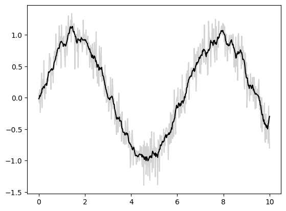

`mode`参数控制如何处理边界条件；这里我们使用`mode='same'`确保输出与输入大小相同。

欲了解更多信息，请参阅`jax.numpy.convolve()`文档，或与原始[`numpy.convolve()`](https://numpy.org/doc/stable/reference/generated/numpy.convolve.html#numpy.convolve "(在 NumPy v2.0)")函数相关的文档。

## 基本的*N*维卷积

对于*N*维卷积，`jax.scipy.signal.convolve()`提供了类似于`jax.numpy.convolve()`的界面，推广到*N*维。

例如，这里是一种使用高斯滤波器进行图像去噪的简单方法：

```py
from scipy import misc
import jax.scipy as jsp

fig, ax = plt.subplots(1, 3, figsize=(12, 5))

# Load a sample image; compute mean() to convert from RGB to grayscale.
image = jnp.array(misc.face().mean(-1))
ax[0].imshow(image, cmap='binary_r')
ax[0].set_title('original')

# Create a noisy version by adding random Gaussian noise
key = random.key(1701)
noisy_image = image + 50 * random.normal(key, image.shape)
ax[1].imshow(noisy_image, cmap='binary_r')
ax[1].set_title('noisy')

# Smooth the noisy image with a 2D Gaussian smoothing kernel.
x = jnp.linspace(-3, 3, 7)
window = jsp.stats.norm.pdf(x) * jsp.stats.norm.pdf(x[:, None])
smooth_image = jsp.signal.convolve(noisy_image, window, mode='same')
ax[2].imshow(smooth_image, cmap='binary_r')
ax[2].set_title('smoothed'); 
```

```py
/tmp/ipykernel_1464/4118182506.py:7: DeprecationWarning: scipy.misc.face has been deprecated in SciPy v1.10.0; and will be completely removed in SciPy v1.12.0\. Dataset methods have moved into the scipy.datasets module. Use scipy.datasets.face instead.
  image = jnp.array(misc.face().mean(-1)) 
```

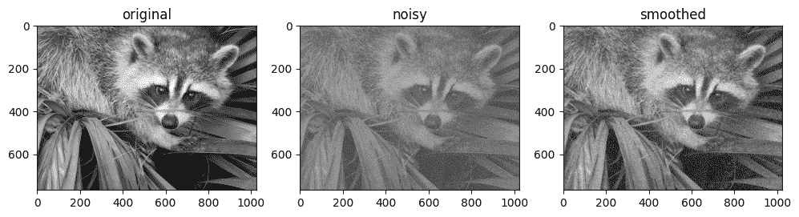

如同一维情况，我们使用`mode='same'`指定如何处理边缘。有关*N*维卷积中可用选项的更多信息，请参阅`jax.scipy.signal.convolve()`文档。

## 广义卷积

对于在构建深度神经网络中通常有用的更一般类型的批量卷积，JAX 和 XLA 提供了非常通用的 N 维**conv_general_dilated**函数，但如何使用它并不是很明显。我们将给出一些常见用例的示例。

一篇关于卷积算术的家族调查，[卷积算术指南](https://arxiv.org/abs/1603.07285)，强烈推荐阅读！

让我们定义一个简单的对角边缘核：

```py
# 2D kernel - HWIO layout
kernel = jnp.zeros((3, 3, 3, 3), dtype=jnp.float32)
kernel += jnp.array([[1, 1, 0],
                     [1, 0,-1],
                     [0,-1,-1]])[:, :, jnp.newaxis, jnp.newaxis]

print("Edge Conv kernel:")
plt.imshow(kernel[:, :, 0, 0]); 
```

```py
Edge Conv kernel: 
```

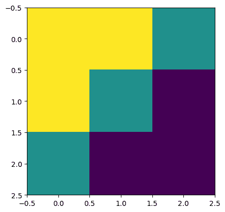

接下来我们将创建一个简单的合成图像：

```py
# NHWC layout
img = jnp.zeros((1, 200, 198, 3), dtype=jnp.float32)
for k in range(3):
  x = 30 + 60*k
  y = 20 + 60*k
  img = img.at[0, x:x+10, y:y+10, k].set(1.0)

print("Original Image:")
plt.imshow(img[0]); 
```

```py
Original Image: 
```

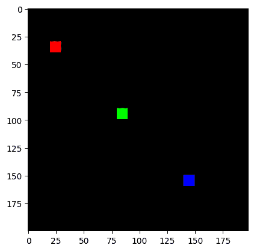

### `lax.conv` 和 `lax.conv_with_general_padding`

这些是卷积的简单便捷函数

️⚠️ 便捷函数 `lax.conv`，`lax.conv_with_general_padding` 假定 **NCHW** 图像和 **OIHW** 卷积核。

```py
from jax import lax
out = lax.conv(jnp.transpose(img,[0,3,1,2]),    # lhs = NCHW image tensor
               jnp.transpose(kernel,[3,2,0,1]), # rhs = OIHW conv kernel tensor
               (1, 1),  # window strides
               'SAME') # padding mode
print("out shape: ", out.shape)
print("First output channel:")
plt.figure(figsize=(10,10))
plt.imshow(np.array(out)[0,0,:,:]); 
```

```py
out shape:  (1, 3, 200, 198)
First output channel: 
```

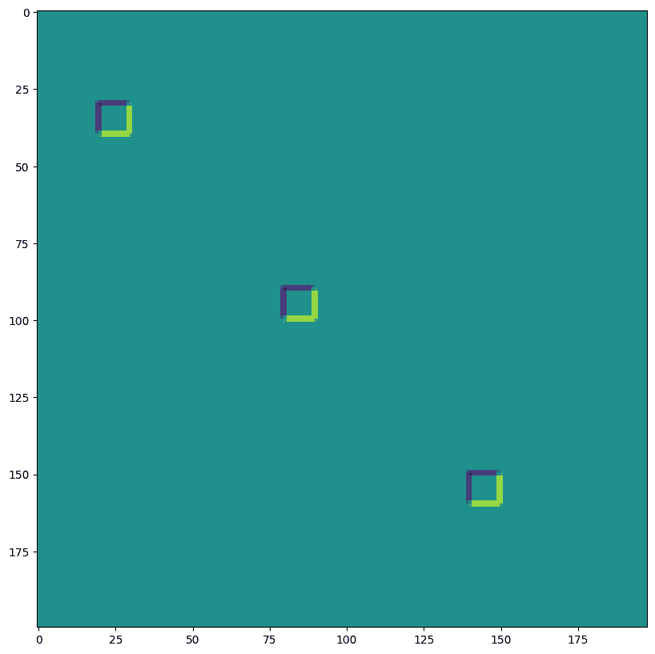

```py
out = lax.conv_with_general_padding(
  jnp.transpose(img,[0,3,1,2]),    # lhs = NCHW image tensor
  jnp.transpose(kernel,[2,3,0,1]), # rhs = IOHW conv kernel tensor
  (1, 1),  # window strides
  ((2,2),(2,2)), # general padding 2x2
  (1,1),  # lhs/image dilation
  (1,1))  # rhs/kernel dilation
print("out shape: ", out.shape)
print("First output channel:")
plt.figure(figsize=(10,10))
plt.imshow(np.array(out)[0,0,:,:]); 
```

```py
out shape:  (1, 3, 202, 200)
First output channel: 
```


### 维度编号定义了 `conv_general_dilated` 的维度布局

重要的参数是轴布局的三元组：（输入布局，卷积核布局，输出布局）

+   **N** - 批次维度

+   **H** - 空间高度

+   **W** - 空间宽度

+   **C** - 通道维度

+   **I** - 卷积核 *输入* 通道维度

+   **O** - 卷积核 *输出* 通道维度

⚠️ 为了展示维度编号的灵活性，我们选择了 **NHWC** 图像和 **HWIO** 卷积核约定，如下所示 `lax.conv_general_dilated`。

```py
dn = lax.conv_dimension_numbers(img.shape,     # only ndim matters, not shape
                                kernel.shape,  # only ndim matters, not shape 
                                ('NHWC', 'HWIO', 'NHWC'))  # the important bit
print(dn) 
```

```py
ConvDimensionNumbers(lhs_spec=(0, 3, 1, 2), rhs_spec=(3, 2, 0, 1), out_spec=(0, 3, 1, 2)) 
```

#### SAME 填充，无步长，无扩张

```py
out = lax.conv_general_dilated(img,    # lhs = image tensor
                               kernel, # rhs = conv kernel tensor
                               (1,1),  # window strides
                               'SAME', # padding mode
                               (1,1),  # lhs/image dilation
                               (1,1),  # rhs/kernel dilation
                               dn)     # dimension_numbers = lhs, rhs, out dimension permutation
print("out shape: ", out.shape)
print("First output channel:")
plt.figure(figsize=(10,10))
plt.imshow(np.array(out)[0,:,:,0]); 
```

```py
out shape:  (1, 200, 198, 3)
First output channel: 
```


#### VALID 填充，无步长，无扩张

```py
out = lax.conv_general_dilated(img,     # lhs = image tensor
                               kernel,  # rhs = conv kernel tensor
                               (1,1),   # window strides
                               'VALID', # padding mode
                               (1,1),   # lhs/image dilation
                               (1,1),   # rhs/kernel dilation
                               dn)      # dimension_numbers = lhs, rhs, out dimension permutation
print("out shape: ", out.shape, "DIFFERENT from above!")
print("First output channel:")
plt.figure(figsize=(10,10))
plt.imshow(np.array(out)[0,:,:,0]); 
```

```py
out shape:  (1, 198, 196, 3) DIFFERENT from above!
First output channel: 
```

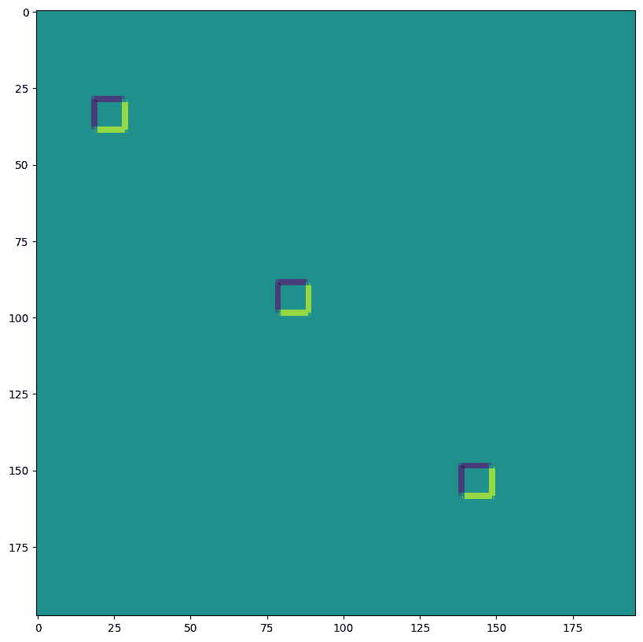

#### SAME 填充，2,2 步长，无扩张

```py
out = lax.conv_general_dilated(img,    # lhs = image tensor
                               kernel, # rhs = conv kernel tensor
                               (2,2),  # window strides
                               'SAME', # padding mode
                               (1,1),  # lhs/image dilation
                               (1,1),  # rhs/kernel dilation
                               dn)     # dimension_numbers = lhs, rhs, out dimension permutation
print("out shape: ", out.shape, " <-- half the size of above")
plt.figure(figsize=(10,10))
print("First output channel:")
plt.imshow(np.array(out)[0,:,:,0]); 
```

```py
out shape:  (1, 100, 99, 3)  <-- half the size of above
First output channel: 
```

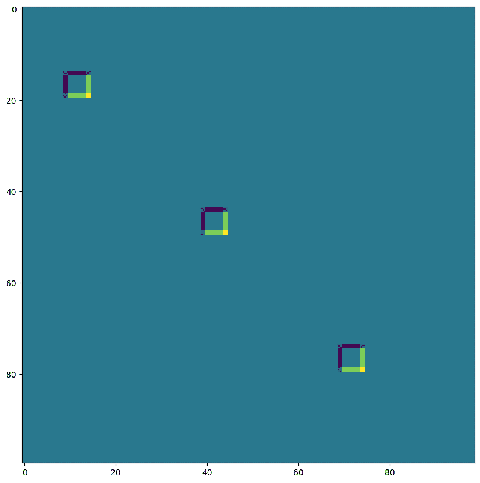

#### VALID 填充，无步长，rhs 卷积核扩张 ~ 膨胀卷积（用于演示）

```py
out = lax.conv_general_dilated(img,     # lhs = image tensor
                               kernel,  # rhs = conv kernel tensor
                               (1,1),   # window strides
                               'VALID', # padding mode
                               (1,1),   # lhs/image dilation
                               (12,12), # rhs/kernel dilation
                               dn)      # dimension_numbers = lhs, rhs, out dimension permutation
print("out shape: ", out.shape)
plt.figure(figsize=(10,10))
print("First output channel:")
plt.imshow(np.array(out)[0,:,:,0]); 
```

```py
out shape:  (1, 176, 174, 3)
First output channel: 
```

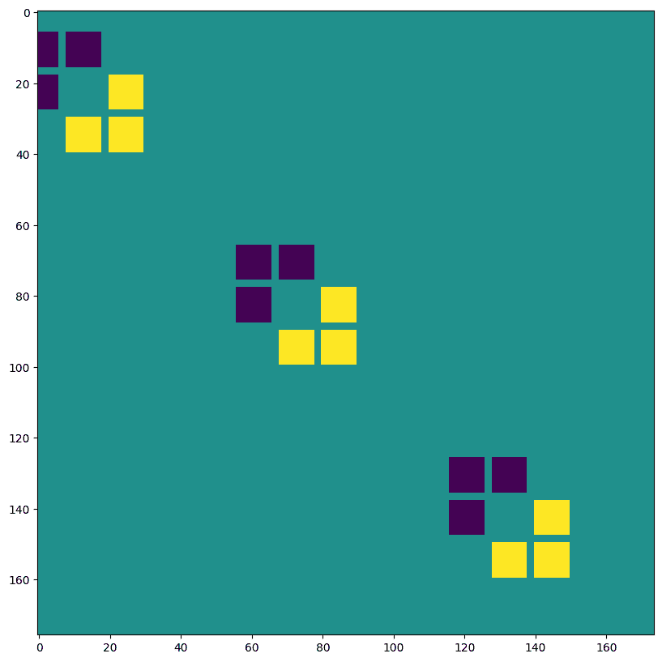

#### VALID 填充，无步长，lhs=input 扩张 ~ 转置卷积

```py
out = lax.conv_general_dilated(img,               # lhs = image tensor
                               kernel,            # rhs = conv kernel tensor
                               (1,1),             # window strides
                               ((0, 0), (0, 0)),  # padding mode
                               (2,2),             # lhs/image dilation
                               (1,1),             # rhs/kernel dilation
                               dn)                # dimension_numbers = lhs, rhs, out dimension permutation
print("out shape: ", out.shape, "<-- larger than original!")
plt.figure(figsize=(10,10))
print("First output channel:")
plt.imshow(np.array(out)[0,:,:,0]); 
```

```py
out shape:  (1, 397, 393, 3) <-- larger than original!
First output channel: 
```


我们可以用最后一个示例，比如实现 *转置卷积*：

```py
# The following is equivalent to tensorflow:
# N,H,W,C = img.shape
# out = tf.nn.conv2d_transpose(img, kernel, (N,2*H,2*W,C), (1,2,2,1))

# transposed conv = 180deg kernel rotation plus LHS dilation
# rotate kernel 180deg:
kernel_rot = jnp.rot90(jnp.rot90(kernel, axes=(0,1)), axes=(0,1))
# need a custom output padding:
padding = ((2, 1), (2, 1))
out = lax.conv_general_dilated(img,     # lhs = image tensor
                               kernel_rot,  # rhs = conv kernel tensor
                               (1,1),   # window strides
                               padding, # padding mode
                               (2,2),   # lhs/image dilation
                               (1,1),   # rhs/kernel dilation
                               dn)      # dimension_numbers = lhs, rhs, out dimension permutation
print("out shape: ", out.shape, "<-- transposed_conv")
plt.figure(figsize=(10,10))
print("First output channel:")
plt.imshow(np.array(out)[0,:,:,0]); 
```

```py
out shape:  (1, 400, 396, 3) <-- transposed_conv
First output channel: 
```

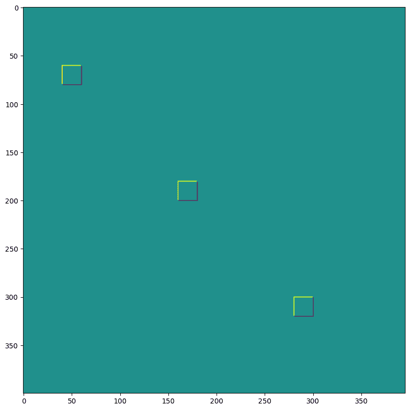

### 1D 卷积

你不仅限于 2D 卷积，下面是一个简单的 1D 演示：

```py
# 1D kernel - WIO layout
kernel = jnp.array([[[1, 0, -1], [-1,  0,  1]], 
                    [[1, 1,  1], [-1, -1, -1]]], 
                    dtype=jnp.float32).transpose([2,1,0])
# 1D data - NWC layout
data = np.zeros((1, 200, 2), dtype=jnp.float32)
for i in range(2):
  for k in range(2):
      x = 35*i + 30 + 60*k
      data[0, x:x+30, k] = 1.0

print("in shapes:", data.shape, kernel.shape)

plt.figure(figsize=(10,5))
plt.plot(data[0]);
dn = lax.conv_dimension_numbers(data.shape, kernel.shape,
                                ('NWC', 'WIO', 'NWC'))
print(dn)

out = lax.conv_general_dilated(data,   # lhs = image tensor
                               kernel, # rhs = conv kernel tensor
                               (1,),   # window strides
                               'SAME', # padding mode
                               (1,),   # lhs/image dilation
                               (1,),   # rhs/kernel dilation
                               dn)     # dimension_numbers = lhs, rhs, out dimension permutation
print("out shape: ", out.shape)
plt.figure(figsize=(10,5))
plt.plot(out[0]); 
```

```py
in shapes: (1, 200, 2) (3, 2, 2)
ConvDimensionNumbers(lhs_spec=(0, 2, 1), rhs_spec=(2, 1, 0), out_spec=(0, 2, 1))
out shape:  (1, 200, 2) 
```

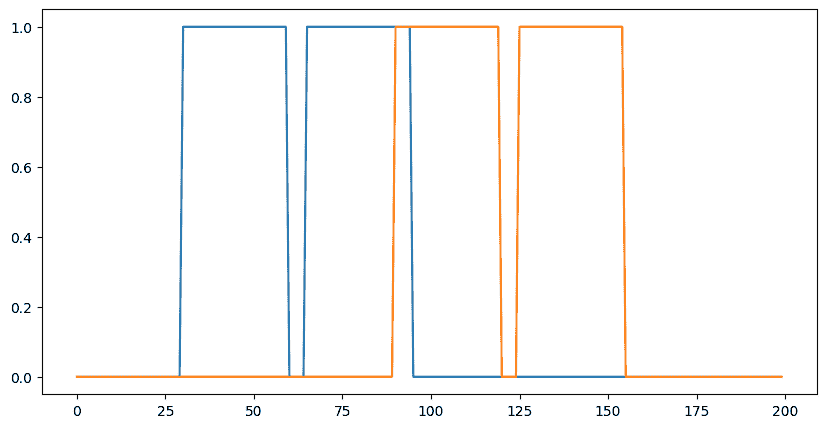 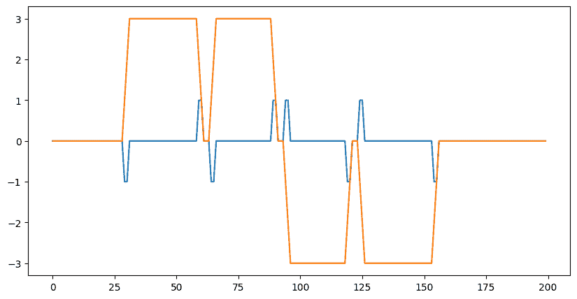

### 3D 卷积

```py
import matplotlib as mpl

# Random 3D kernel - HWDIO layout
kernel = jnp.array([
  [[0, 0,  0], [0,  1,  0], [0,  0,   0]],
  [[0, -1, 0], [-1, 0, -1], [0,  -1,  0]], 
  [[0, 0,  0], [0,  1,  0], [0,  0,   0]]], 
  dtype=jnp.float32)[:, :, :, jnp.newaxis, jnp.newaxis]

# 3D data - NHWDC layout
data = jnp.zeros((1, 30, 30, 30, 1), dtype=jnp.float32)
x, y, z = np.mgrid[0:1:30j, 0:1:30j, 0:1:30j]
data += (jnp.sin(2*x*jnp.pi)*jnp.cos(2*y*jnp.pi)*jnp.cos(2*z*jnp.pi))[None,:,:,:,None]

print("in shapes:", data.shape, kernel.shape)
dn = lax.conv_dimension_numbers(data.shape, kernel.shape,
                                ('NHWDC', 'HWDIO', 'NHWDC'))
print(dn)

out = lax.conv_general_dilated(data,    # lhs = image tensor
                               kernel,  # rhs = conv kernel tensor
                               (1,1,1), # window strides
                               'SAME',  # padding mode
                               (1,1,1), # lhs/image dilation
                               (1,1,1), # rhs/kernel dilation
                               dn)      # dimension_numbers
print("out shape: ", out.shape)

# Make some simple 3d density plots:
from mpl_toolkits.mplot3d import Axes3D
def make_alpha(cmap):
  my_cmap = cmap(jnp.arange(cmap.N))
  my_cmap[:,-1] = jnp.linspace(0, 1, cmap.N)**3
  return mpl.colors.ListedColormap(my_cmap)
my_cmap = make_alpha(plt.cm.viridis)
fig = plt.figure()
ax = fig.add_subplot(projection='3d')
ax.scatter(x.ravel(), y.ravel(), z.ravel(), c=data.ravel(), cmap=my_cmap)
ax.axis('off')
ax.set_title('input')
fig = plt.figure()
ax = fig.add_subplot(projection='3d')
ax.scatter(x.ravel(), y.ravel(), z.ravel(), c=out.ravel(), cmap=my_cmap)
ax.axis('off')
ax.set_title('3D conv output'); 
```

```py
in shapes: (1, 30, 30, 30, 1) (3, 3, 3, 1, 1)
ConvDimensionNumbers(lhs_spec=(0, 4, 1, 2, 3), rhs_spec=(4, 3, 0, 1, 2), out_spec=(0, 4, 1, 2, 3))
out shape:  (1, 30, 30, 30, 1) 
```

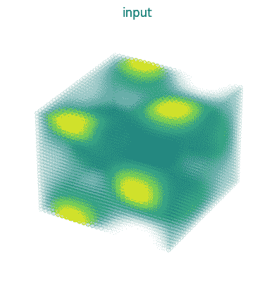 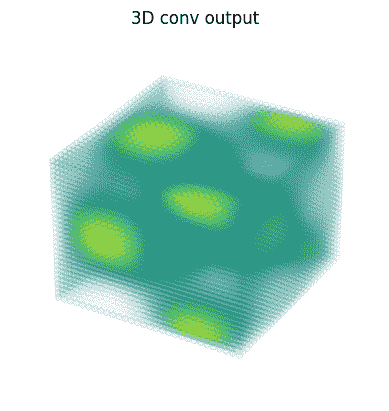
