# JAX 类型提升的设计

> 原文：[`jax.readthedocs.io/en/latest/jep/9407-type-promotion.html`](https://jax.readthedocs.io/en/latest/jep/9407-type-promotion.html)

 

*Jake VanderPlas, December 2021*

任何数值计算库设计中面临的挑战之一是如何处理不同类型值之间的操作选择。本文概述了 JAX 使用的提升语义背后的思维过程，总结在[JAX 类型提升语义](https://jax.readthedocs.io/en/latest/type_promotion.html)中。

## JAX 类型提升的目标

JAX 的数值计算 API 是模仿 NumPy 的，但增加了一些功能，包括能够针对 GPU 和 TPU 等加速器进行优化。这使得采用 NumPy 的类型提升系统对 JAX 用户不利：NumPy 的类型提升规则严重偏向于 64 位输出，这对于加速器上的计算是有问题的。像 GPU 和 TPU 这样的设备通常需要付出显著的性能代价来使用 64 位浮点类型，并且在某些情况下根本不支持本地 64 位浮点类型。

这种问题类型提升语义的简单例子可以在 32 位整数和浮点数之间的二进制操作中看到：

```py
import numpy as np
np.dtype(np.int32(1) + np.float32(1)) 
```

```py
dtype('float64') 
```

NumPy 倾向于生成 64 位值是使用 NumPy API 进行加速计算的一个[长期问题](https://github.com/numpy/numpy/issues/6860)，目前还没有一个很好的解决方案。因此，JAX 已经开始重新思考以加速器为目标的 NumPy 风格类型提升。

## 回顾：表格和格子

在我们深入细节之前，让我们花点时间退后一步，思考*如何*思考类型提升问题。考虑 Python 内置数值类型（即`int`、`float`和`complex`）之间的算术操作，我们可以用几行代码生成 Python 用于这些类型值加法的类型提升表：

```py
import pandas as pd
types = [int, float, complex]
name = lambda t: t.__name__
pd.DataFrame([[name(type(t1(1) + t2(1))) for t1 in types] for t2 in types],
             index=[name(t) for t in types], columns=[name(t) for t in types]) 
```

|  | int | float | complex |
| --- | --- | --- | --- |
| int | int | float | complex |
| float | float | float | complex |
| complex | complex | complex | complex |

这张表详细列出了 Python 的数值类型提升行为，但事实证明有一种更为简洁的补充表示：[格](https://en.wikipedia.org/wiki/Lattice_(order))表示法，其中任意两个节点之间的[上确界](https://en.wikipedia.org/wiki/Infimum_and_supremum)是它们提升到的类型。Python 提升表的格表示法要简单得多：

<details class="hide above-input"><summary aria-label="Toggle hidden content">显示代码单元格源代码 隐藏代码单元格源代码</summary>

```py
#@title
import networkx as nx
import matplotlib.pyplot as plt
lattice = {'int': ['float'], 'float': ['complex']}
graph = nx.from_dict_of_lists(lattice, create_using=nx.DiGraph)
pos = {'int': [0, 0], 'float': [1, 0], 'complex': [2, 0]}
fig, ax = plt.subplots(figsize=(8, 2))
nx.draw(graph, with_labels=True, node_size=4000, node_color='lightgray', pos=pos, ax=ax, arrowsize=20) 
```</details> 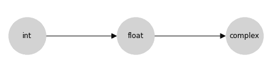

这个格是促进表中信息的紧凑编码。您可以通过跟踪到两个节点的第一个共同子节点（包括节点本身）找到两个输入的类型提升的结果；在数学上，这个共同子节点被称为对格上的*上确界*，或*最小上界*，或*结合*的操作；这里我们将这个操作称为**结合**。

概念上，箭头表示允许在源和目标之间进行*隐式类型提升*：例如，允许从整数到浮点数的隐式提升，但不允许从浮点数到整数的隐式提升。

请记住，通常并非每个有向无环图（DAG）都满足格的性质。格要求每对节点之间存在唯一的最小上界；例如，以下两个 DAG 不是格：

<details class="hide above-input"><summary aria-label="Toggle hidden content">显示代码单元格源码 隐藏代码单元格源码</summary>

```py
#@title
import networkx as nx
import matplotlib.pyplot as plt

fig, ax = plt.subplots(1, 2, figsize=(10, 2))

lattice = {'A': ['B', 'C']}
graph = nx.from_dict_of_lists(lattice, create_using=nx.DiGraph)
pos = {'A': [0, 0], 'B': [1, 0.5], 'C': [1, -0.5]}
nx.draw(graph, with_labels=True, node_size=2000, node_color='lightgray', pos=pos, ax=ax[0], arrowsize=20)
ax[0].set(xlim=[-0.5, 1.5], ylim=[-1, 1])

lattice = {'A': ['C', 'D'], 'B': ['C', 'D']}
graph = nx.from_dict_of_lists(lattice, create_using=nx.DiGraph)
pos = {'A': [0, 0.5], 'B': [0, -0.5], 'C': [1, 0.5], 'D': [1, -0.5]}
nx.draw(graph, with_labels=True, node_size=2000, node_color='lightgray', pos=pos, ax=ax[1], arrowsize=20)
ax[1].set(xlim=[-0.5, 1.5], ylim=[-1, 1]); 
```</details> 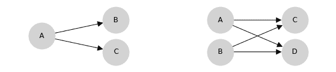

左边的 DAG 不是格，因为节点`B`和`C`没有上界；右边的 DAG 有两个问题：首先，节点`C`和`D`没有上界，其次，节点`A`和`B`的最小上界无法*唯一*确定：`C`和`D`都是候选项，但它们是不可排序的。

### 类型提升格的属性

在格中指定类型提升确保了许多有用的属性。用\(\vee\)运算符表示格中的结合，我们有：

**存在性：** 格的定义要求每对元素都存在唯一的格结合：\(\forall (a, b): \exists !(a \vee b)\)

**交换律：** 格的结合运算是交换的：\(\forall (a, b): a\vee b = b \vee a\).

**结合律：** 格的结合运算是结合的：\(\forall (a, b, c): a \vee (b \vee c) = (a \vee b) \vee c\).

另一方面，这些属性意味着它们对能够表示的类型提升系统有所限制；特别是**并非每个类型提升表都可以用格表示**。NumPy 的完整类型提升表就是一个快速反例：这里有三种标量类型，它们在 NumPy 中的提升行为是非结合的。

```py
import numpy as np
a, b, c = np.int8(1), np.uint8(1), np.float16(1)
print(np.dtype((a + b) + c))
print(np.dtype(a + (b + c))) 
```

```py
float32
float16 
```

这样的结果可能会让用户感到惊讶：我们通常期望数学表达式映射到数学概念，所以，例如，`a + b + c`应等同于`c + b + a`；`x * (y + z)`应等同于`x * y + x * z`。如果类型提升不是结合的或不是交换的，这些属性将不再适用。

此外，基于格子的类型提升系统与基于表的系统相比，在概念上更简单和更易理解。例如，JAX 识别 18 种不同的类型：一个包含 18 个节点和之间稀疏、有充分动机的连接的提升格子，比 324 个条目的表在脑中更容易维持。

因此，我们选择为 JAX 使用基于格子的类型提升系统。

## 类别内的类型提升

数值计算库通常提供不仅仅是`int`、`float`和`complex`，在每个类别中，都有各种可能的精度，由数值表示中使用的位数表示。我们在这里考虑的类别是：

+   *无符号整数*，包括`uint8`、`uint16`、`uint32`和`uint64`（我们简称为`u8`、`u16`、`u32`、`u64`）

+   *有符号整数*，包括`int8`、`int16`、`int32`和`int64`（我们简称为`i8`、`i16`、`i32`、`i64`）

+   *浮点数*，包括`float16`、`float32`和`float64`（我们简称为`f16`、`f32`、`f64`）

+   *复数浮点数*，包括`complex64`和`complex128`（我们简称为`c64`、`c128`）

Numpy 在每个这四个类别内的类型提升语义相对来说是相对简单的：类型的有序层次结构直接转换为四个分离的格子，表示类内类型提升规则：

<details class="hide above-input"><summary aria-label="Toggle hidden content">显示代码单元源代码 隐藏代码单元源代码</summary>

```py
#@title
import networkx as nx
import matplotlib.pyplot as plt
lattice = {
  'u8': ['u16'], 'u16': ['u32'], 'u32': ['u64'],
  'i8': ['i16'], 'i16': ['i32'], 'i32': ['i64'],
  'f16': ['f32'], 'f32': ['f64'],
  'c64': ['c128']
}
graph = nx.from_dict_of_lists(lattice, create_using=nx.DiGraph)
pos = {
  'u8': [0, 0], 'u16': [1, 0], 'u32': [2, 0], 'u64': [3, 0],
  'i8': [0, 1], 'i16': [1, 1], 'i32': [2, 1], 'i64': [3, 1],
  'f16': [1, 2], 'f32': [2, 2], 'f64': [3, 2],
  'c64': [2, 3], 'c128': [3, 3],
}
fig, ax = plt.subplots(figsize=(6, 4))
nx.draw(graph, with_labels=True, node_size=1500, node_color='lightgray', pos=pos, ax=ax) 
```</details> 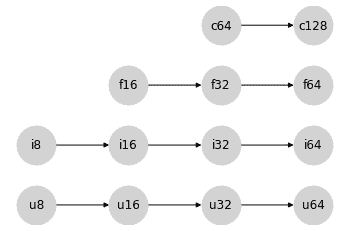

关于 JAX 避免的值提升为 64 位，这些同类别的提升语义在每种类型类别内部是没有问题的：产生 64 位输出的唯一方式是有一个 64 位输入。

## 输入 Python 标量

现在让我们考虑 Python 标量如何融入其中。

在 NumPy 中，提升行为取决于输入是数组还是标量。例如，在操作两个标量时，适用正常的提升规则：

```py
x = np.int8(0)  # int8 scalar
y = 1  # Python int = int64 scalar
(x + y).dtype 
```

```py
dtype('int64') 
```

在这里，Python 值`1`被视为`int64`，并且简单的类内规则导致`int64`结果。

然而，在 Python 标量和 NumPy 数组之间的操作中，标量会延续到数组的 dtype。例如：

```py
x = np.zeros(1, dtype='int8')  # int8 array
y = 1  # Python int = int64 scalar
(x + y).dtype 
```

```py
dtype('int8') 
```

忽略`int64`标量的位宽度，而是延续数组的位宽度。

这里还有一个细节：当 NumPy 类型提升涉及标量时，输出的 dtype 取决于值：如果 Python 标量过大，超出了给定 dtype 的范围，则被提升为兼容的类型：

```py
x = np.zeros(1, dtype='int8')  # int8 array
y = 1000  # int64 scalar
(x + y).dtype 
```

```py
dtype('int16') 
```

出于 JAX 的目的，**依赖值的提升是不可行的**，因为 JIT 编译和其他转换的性质使其作用于数据的抽象表示，而不参考其值。

忽略依赖值的影响，NumPy 类型提升的有符号整数分支可以在以下格点中表示，我们将使用 `*` 标记标量数据类型：

<details class="hide above-input"><summary aria-label="Toggle hidden content">显示代码单元格来源 隐藏代码单元格来源</summary>

```py
#@title
import networkx as nx
import matplotlib.pyplot as plt
lattice = {
  'i8*': ['i16*'], 'i16*': ['i32*'], 'i32*': ['i64*'], 'i64*': ['i8'],
  'i8': ['i16'], 'i16': ['i32'], 'i32': ['i64']
}
graph = nx.from_dict_of_lists(lattice, create_using=nx.DiGraph)
pos = {
  'i8*': [0, 1], 'i16*': [2, 1], 'i32*': [4, 1], 'i64*': [6, 1],
  'i8': [9, 1], 'i16': [11, 1], 'i32': [13, 1], 'i64': [15, 1],
}
fig, ax = plt.subplots(figsize=(12, 4))
nx.draw(graph, with_labels=True, node_size=1500, node_color='lightgray', pos=pos, ax=ax)
ax.text(3, 1.6, "Scalar Types", ha='center', fontsize=14)
ax.text(12, 1.6, "Array Types", ha='center', fontsize=14)
ax.set_ylim(-1, 3); 
```</details> 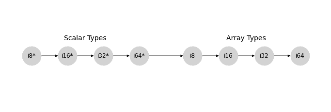

在 `uint`、`float` 和 `complex` 格点内，类似的模式也成立。

为了简单起见，让我们将每个标量类型的类别折叠为单个节点，分别表示为 `u*`、`i*`、`f*` 和 `c*`。我们的类别内格点集现在可以这样表示：

<details class="hide above-input"><summary aria-label="Toggle hidden content">显示代码单元格来源 隐藏代码单元格来源</summary>

```py
#@title
import networkx as nx
import matplotlib.pyplot as plt
lattice = {
  'u*': ['u8'], 'u8': ['u16'], 'u16': ['u32'], 'u32': ['u64'],
  'i*': ['i8'], 'i8': ['i16'], 'i16': ['i32'], 'i32': ['i64'],
  'f*': ['f16'], 'f16': ['f32'], 'f32': ['f64'],
  'c*': ['c64'], 'c64': ['c128']
}
graph = nx.from_dict_of_lists(lattice, create_using=nx.DiGraph)
pos = {
  'u*': [0, 0], 'u8': [3, 0], 'u16': [5, 0], 'u32': [7, 0], 'u64': [9, 0],
  'i*': [0, 1], 'i8': [3, 1], 'i16': [5, 1], 'i32': [7, 1], 'i64': [9, 1],
  'f*': [0, 2], 'f16': [5, 2], 'f32': [7, 2], 'f64': [9, 2],
  'c*': [0, 3], 'c64': [7, 3], 'c128': [9, 3],
}
fig, ax = plt.subplots(figsize=(6, 4))
nx.draw(graph, with_labels=True, node_size=1500, node_color='lightgray', pos=pos, ax=ax) 
```</details> 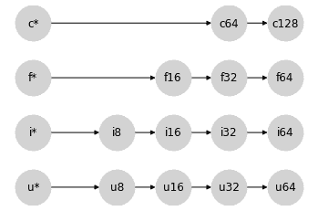

从某种意义上说，将标量放在左边是一个奇怪的选择：标量类型可能包含任何宽度的值，但与给定类型的数组交互时，提升的结果将延续到数组类型。这样做的好处在于，当您对数组 `x` 执行像 `x + 2` 这样的操作时，`x` 的类型将传递到结果中，无论其宽度如何：

```py
for dtype in [np.int8, np.int16, np.int32, np.int64]:
  x = np.arange(10, dtype=dtype)
  assert (x + 2).dtype == dtype 
```

这种行为为标量值的 `*` 符号赋予了动机：`*` 符号类似于一个通配符，可以取任意所需的值。

这种语义的好处在于，您可以用清晰的 Python 代码轻松表达操作序列，而无需显式地将标量强制转换为适当的类型。想象一下，如果不是写成这样：

```py
3 * (x + 1) ** 2 
```

您不得不写成这样：

```py
np.int32(3) * (x + np.int32(1)) ** np.int32(2) 
```

尽管它很明确，数值代码会变得阅读或编写起来非常繁琐。使用上述标量提升语义，给定类型为 `int32` 的数组 `x`，第二个语句中的类型在第一个语句中是隐含的。

## 合并格点

请回想，我们开始讨论 Python 内部类型提升的格点图：`int -> float -> complex`。让我们将其重写为 `i* -> f* -> c*`，并允许 `i*` 吸收 `u*`（毕竟，在 Python 中没有无符号整数标量类型）。

将所有内容整合在一起，我们得到以下部分格点图，表示 Python 标量和 numpy 数组之间的类型提升：

<details class="hide above-input"><summary aria-label="Toggle hidden content">显示代码单元格来源 隐藏代码单元格来源</summary>

```py
#@title
import networkx as nx
import matplotlib.pyplot as plt
lattice = {
  'i*': ['f*', 'u8', 'i8'], 'f*': ['c*', 'f16'], 'c*': ['c64'],
  'u8': ['u16'], 'u16': ['u32'], 'u32': ['u64'],
  'i8': ['i16'], 'i16': ['i32'], 'i32': ['i64'],
  'f16': ['f32'], 'f32': ['f64'],
  'c64': ['c128']
}
graph = nx.from_dict_of_lists(lattice, create_using=nx.DiGraph)
pos = {
  'i*': [-1.25, 0.5], 'f*': [-0.5, 2], 'c*': [0, 3],
  'u8': [0.5, 0], 'u16': [1.5, 0], 'u32': [2.5, 0], 'u64': [3.5, 0],
  'i8': [0, 1], 'i16': [1, 1], 'i32': [2, 1], 'i64': [3, 1],
  'f16': [0.5, 2], 'f32': [1.5, 2], 'f64': [2.5, 2],
  'c64': [2, 3], 'c128': [3, 3],
}
fig, ax = plt.subplots(figsize=(6, 5))
nx.draw(graph, with_labels=True, node_size=1500, node_color='lightgray', pos=pos, ax=ax) 
```</details> 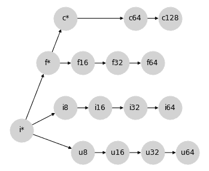

注意，这还不是一个真正的格：存在许多节点对，它们之间没有联接。然而，我们可以将其视为一个*部分*格，在这种格中，某些节点对没有定义的推广行为，而此部分格的定义部分确实正确描述了 NumPy 的数组推广行为（不考虑上述值依赖语义）。

这为我们提供了一个很好的框架，可以用来思考如何填补这些未定义的推广规则，方法是在这个图上添加连接。但是应该添加哪些连接呢？总体来说，我们希望任何额外的连接都满足几个属性：

1.  推广应满足交换和结合性质：换句话说，图应保持（部分）格的形式。

1.  推广不应允许丢弃数据的整个组成部分：例如，我们不应将`complex`推广为`float`，因为这会丢弃任何虚部。

1.  推广不应导致未处理的溢出。例如，最大可能的`uint32`是最大可能的`int32`的两倍，因此我们不应隐式地将`uint32`提升为`int32`。

1.  在可能的情况下，推广应避免精度损失。例如，一个`int64`值可能有 64 位的尾数，因此将`int64`提升为`float64`可能会导致精度损失。然而，最大可表示的 float64 大于最大可表示的 int64，因此在这种情况下仍满足标准 #3。

1.  在可能的情况下，二进制推广应避免导致比输入更宽的类型。这是为了确保 JAX 的隐式推广对加速器工作流友好，其中用户通常希望将类型限制为 32 位（或在某些情况下是 16 位）值。

格上的每一个新连接都为用户引入了一定程度的便利性（一组新的可以在没有显式转换的情况下相互作用的类型），但是如果以上任何标准被违反，这种便利性可能会变得代价高昂。发展一个完整的推广格涉及在便利性和成本之间达到平衡。

## 混合推广：浮点数和复数

让我们从可能是最简单的情况开始，即在浮点数和复数值之间的推广。

复数由一对浮点数组成，因此在它们之间存在一种自然的推广路径：将浮点数转换为复数，同时保持实部的宽度。在我们的部分格表示中，它看起来像这样：

<details class="hide above-input"><summary aria-label="Toggle hidden content">显示代码单元格源码 隐藏代码单元格源码</summary>

```py
#@title
import networkx as nx
import matplotlib.pyplot as plt
lattice = {
  'i*': ['f*', 'u8', 'i8'], 'f*': ['c*', 'f16'], 'c*': ['c64'],
  'u8': ['u16'], 'u16': ['u32'], 'u32': ['u64'],
  'i8': ['i16'], 'i16': ['i32'], 'i32': ['i64'],
  'f16': ['f32'], 'f32': ['f64', 'c64'], 'f64': ['c128'],
  'c64': ['c128']
}
graph = nx.from_dict_of_lists(lattice, create_using=nx.DiGraph)
pos = {
  'i*': [-1.25, 0.5], 'f*': [-0.5, 2], 'c*': [0, 3],
  'u8': [0.5, 0], 'u16': [1.5, 0], 'u32': [2.5, 0], 'u64': [3.5, 0],
  'i8': [0, 1], 'i16': [1, 1], 'i32': [2, 1], 'i64': [3, 1],
  'f16': [0.5, 2], 'f32': [1.5, 2], 'f64': [2.5, 2],
  'c64': [2, 3], 'c128': [3, 3],
}
fig, ax = plt.subplots(figsize=(6, 5))
nx.draw(graph, with_labels=True, node_size=1500, node_color='lightgray', pos=pos, ax=ax) 
```</details> 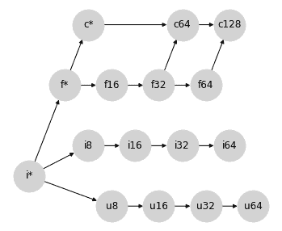

这恰好代表了 Numpy 在混合浮点/复数类型推广中使用的语义。

## 混合推广：有符号和无符号整数

接下来的情况，让我们考虑一些更困难的情况：有符号和无符号整数之间的提升。例如，当将`uint8`提升为有符号整数时，我们需要多少位？

乍一看，您可能会认为将`uint8`提升为`int8`是很自然的；但最大的`uint8`数字在`int8`中是不能表示的。因此，将无符号整数提升为比特数加倍的整数更有意义；这种提升行为可以通过将以下连接添加到提升格中来表示：

<details class="hide above-input"><summary aria-label="Toggle hidden content">显示代码单元格源代码 隐藏代码单元格源代码</summary>

```py
#@title
import networkx as nx
import matplotlib.pyplot as plt
lattice = {
  'i*': ['f*', 'u8', 'i8'], 'f*': ['c*', 'f16'], 'c*': ['c64'],
  'u8': ['u16', 'i16'], 'u16': ['u32', 'i32'], 'u32': ['u64', 'i64'],
  'i8': ['i16'], 'i16': ['i32'], 'i32': ['i64'],
  'f16': ['f32'], 'f32': ['f64', 'c64'], 'f64': ['c128'],
  'c64': ['c128']
}
graph = nx.from_dict_of_lists(lattice, create_using=nx.DiGraph)
pos = {
  'i*': [-1.25, 0.5], 'f*': [-0.5, 2], 'c*': [0, 3],
  'u8': [0.5, 0], 'u16': [1.5, 0], 'u32': [2.5, 0], 'u64': [3.5, 0],
  'i8': [0, 1], 'i16': [1, 1], 'i32': [2, 1], 'i64': [3, 1],
  'f16': [0.5, 2], 'f32': [1.5, 2], 'f64': [2.5, 2],
  'c64': [2, 3], 'c128': [3, 3],
}
fig, ax = plt.subplots(figsize=(6, 5))
nx.draw(graph, with_labels=True, node_size=1500, node_color='lightgray', pos=pos, ax=ax) 
```</details> 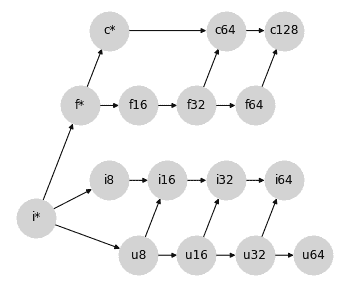

同样，这里添加的连接正是 NumPy 用于混合整数提升的提升语义实现。

### 如何处理`uint64`？

混合有符号/无符号整数提升的方法中缺少一种类型：`uint64`。按照上述模式，涉及`uint64`的混合整数操作的输出应该是`int128`，但这不是标准可用的数据类型。

NumPy 在这里的选择是提升为`float64`：

```py
(np.uint64(1) + np.int64(1)).dtype 
```

```py
dtype('float64') 
```

然而，这可能是一个令人惊讶的约定：这是唯一一种整数类型提升不会产生整数的情况。目前，我们将保持`uint64`提升的未定义状态，并稍后再回到这个问题。

## 整数和浮点混合提升

当将整数提升为浮点数时，我们可能会从与有符号和无符号整数之间的混合提升相同的思路开始。16 位有符号或无符号整数无法被只有 10 位尾数的 16 位浮点数以全精度表示。因此，将整数提升为比特数加倍的浮点数可能是有道理的：

<details class="hide above-input"><summary aria-label="Toggle hidden content">显示代码单元格源代码 隐藏代码单元格源代码</summary>

```py
#@title
import networkx as nx
import matplotlib.pyplot as plt
lattice = {
  'i*': ['f*', 'u8', 'i8'], 'f*': ['c*', 'f16'], 'c*': ['c64'],
  'u8': ['u16', 'i16', 'f16'], 'u16': ['u32', 'i32', 'f32'], 'u32': ['u64', 'i64', 'f64'],
  'i8': ['i16', 'f16'], 'i16': ['i32', 'f32'], 'i32': ['i64', 'f64'],
  'f16': ['f32'], 'f32': ['f64', 'c64'], 'f64': ['c128'],
  'c64': ['c128']
}
graph = nx.from_dict_of_lists(lattice, create_using=nx.DiGraph)
pos = {
  'i*': [-1.25, 0.5], 'f*': [-0.5, 2], 'c*': [0, 3],
  'u8': [0.5, 0], 'u16': [1.5, 0], 'u32': [2.5, 0], 'u64': [3.5, 0],
  'i8': [0, 1], 'i16': [1, 1], 'i32': [2, 1], 'i64': [3, 1],
  'f16': [0.5, 2], 'f32': [1.5, 2], 'f64': [2.5, 2],
  'c64': [2, 3], 'c128': [3, 3],
}
fig, ax = plt.subplots(figsize=(6, 5))
nx.draw(graph, with_labels=True, node_size=1500, node_color='lightgray', pos=pos, ax=ax) 
```</details> 

这实际上是 NumPy 类型提升所做的事情，但在这样做时它破坏了图的格性质：例如，对于*{i8, u8}*对，不再有唯一的最小上界：可能性有*i16*和*f16*，这在图上是不可排序的。这事实上是 NumPy 非可结合类型提升的根源。

我们能否提出 NumPy 提升规则的修改，以便满足格性质，并为混合类型提升提供明智的结果？我们在这里可以采取几种方法。

### 选项 0：将整数/浮点混合精度未定义

为了使行为完全可预测（虽然会损失用户方便性），一个可以辩护的选择是在 Python 标量之外将任何混合整数/浮点数提升保留为未定义状态，停留在前一节的部分格子结构。缺点是用户在操作整数和浮点数数量之间时需要显式类型转换。

### 选项 1：避免所有精度损失

如果我们的重点是以任何代价避免精度损失，我们可以通过其现有的有符号整数路径将无符号整数提升为浮点数来恢复格子属性：

<details class="hide above-input"><summary aria-label="Toggle hidden content">显示代码单元格源代码 隐藏代码单元格源代码</summary>

```py
#@title
import networkx as nx
import matplotlib.pyplot as plt
lattice = {
  'i*': ['f*', 'u8', 'i8'], 'f*': ['c*', 'f16'], 'c*': ['c64'],
  'u8': ['u16', 'i16'], 'u16': ['u32', 'i32'], 'u32': ['u64', 'i64'],
  'i8': ['i16', 'f16'], 'i16': ['i32', 'f32'], 'i32': ['i64', 'f64'],
  'f16': ['f32'], 'f32': ['f64', 'c64'], 'f64': ['c128'],
  'c64': ['c128']
}
graph = nx.from_dict_of_lists(lattice, create_using=nx.DiGraph)
pos = {
  'i*': [-1.25, 0.5], 'f*': [-0.5, 2], 'c*': [0, 3],
  'u8': [0.5, 0], 'u16': [1.5, 0], 'u32': [2.5, 0], 'u64': [3.5, 0],
  'i8': [0, 1], 'i16': [1, 1], 'i32': [2, 1], 'i64': [3, 1],
  'f16': [0.5, 2], 'f32': [1.5, 2], 'f64': [2.5, 2],
  'c64': [2, 3], 'c128': [3, 3],
}
fig, ax = plt.subplots(figsize=(6, 5))
nx.draw(graph, with_labels=True, node_size=1500, node_color='lightgray', pos=pos, ax=ax) 
```</details> 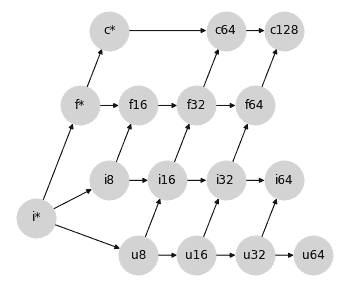

这种方法的一个缺点是它仍然使得`int64`和`uint64`的提升未定义，因为没有标准的浮点类型具有足够的尾数位来表示它们的完整值范围。我们可以放宽精度约束并通过从`i64->f64`和`u64->f64`的连接来完成格子，但这些连接会违反这种提升方案的动机。

第二个缺点是这种格子结构使得很难找到一个合理的位置来插入`bfloat16`（见下文），同时保持格子属性。

对于 JAX 加速器后端来说，这种方法的第三个缺点更为重要，即某些操作会导致比必要宽得多的类型；例如，`uint16` 和 `float16` 之间的混合操作会提升到`float64`，这并不理想。

### 选项 2：避免大部分比必要更宽的提升

为了解决更广泛类型的不必要提升，我们可以接受整数/浮点数提升可能会导致一些精度损失的可能性，将有符号整数提升为相同宽度的浮点数：

<details class="hide above-input"><summary aria-label="Toggle hidden content">显示代码单元格源代码 隐藏代码单元格源代码</summary>

```py
#@title
import networkx as nx
import matplotlib.pyplot as plt
lattice = {
  'i*': ['f*', 'u8', 'i8'], 'f*': ['c*', 'f16'], 'c*': ['c64'],
  'u8': ['u16', 'i16'], 'u16': ['u32', 'i32'], 'u32': ['u64', 'i64'],
  'i8': ['i16'], 'i16': ['f16', 'i32'], 'i32': ['f32', 'i64'], 'i64': ['f64'],
  'f16': ['f32'], 'f32': ['f64', 'c64'], 'f64': ['c128'],
  'c64': ['c128']
}
graph = nx.from_dict_of_lists(lattice, create_using=nx.DiGraph)
pos = {
  'i*': [-1.25, 0.5], 'f*': [-0.5, 2], 'c*': [0, 3],
  'u8': [0.5, 0], 'u16': [1.5, 0], 'u32': [2.5, 0], 'u64': [3.5, 0],
  'i8': [0, 1], 'i16': [1, 1], 'i32': [2, 1], 'i64': [3, 1],
  'f16': [1.5, 2], 'f32': [2.5, 2], 'f64': [3.5, 2],
  'c64': [3, 3], 'c128': [4, 3],
}
fig, ax = plt.subplots(figsize=(6, 5))
nx.draw(graph, with_labels=True, node_size=1500, node_color='lightgray', pos=pos, ax=ax) 
```</details> 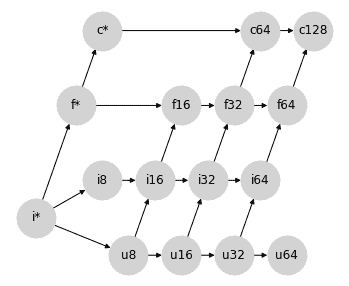

尽管这确实允许在整数和浮点数之间进行精度损失的提升，但这些提升不会误代表结果的*幅度*：虽然浮点数的尾数不足以表示所有值，但指数足以近似它们。

这种方法还允许从`int64`自然提升到`float64`，尽管在此方案中`uint64`仍然无法提升。也就是说，在这里更容易地可以通过其现有的有符号整数路径连接从`u64`到`f64`。

这种提升方案仍然会导致一些比必要更宽的提升路径；例如 `float32` 和 `uint32` 之间的操作将导致 `float64`。此外，这个格子使得很难找到一个合理的地方插入 `bfloat16`（见下文），同时保持格子属性。

### 选项 3：避免所有比必要更宽的提升

如果我们愿意从根本上改变我们对整数和浮点提升的思维方式，我们可以避免 *所有* 非理想的 64 位提升：就像标量总是遵循数组类型的宽度一样，我们可以使整数总是遵循浮点类型的宽度：

<details class="hide above-input"><summary aria-label="Toggle hidden content">显示代码单元源代码 隐藏代码单元源代码</summary>

```py
#@title
import networkx as nx
import matplotlib.pyplot as plt
lattice = {
  'i*': ['u8', 'i8'], 'f*': ['c*', 'f16'], 'c*': ['c64'],
  'u8': ['u16', 'i16'], 'u16': ['u32', 'i32'], 'u32': ['u64', 'i64'],
  'i8': ['i16'], 'i16': ['i32'], 'i32': ['i64'], 'i64': ['f*'],
  'f16': ['f32'], 'f32': ['f64', 'c64'], 'f64': ['c128'],
  'c64': ['c128']
}
graph = nx.from_dict_of_lists(lattice, create_using=nx.DiGraph)
pos = {
  'i*': [-1.25, 0.5], 'f*': [-0.5, 2], 'c*': [0, 3],
  'u8': [0.5, 0], 'u16': [1.5, 0], 'u32': [2.5, 0], 'u64': [3.5, 0],
  'i8': [0, 1], 'i16': [1, 1], 'i32': [2, 1], 'i64': [3, 1],
  'f16': [1.5, 2], 'f32': [2.5, 2], 'f64': [3.5, 2],
  'c64': [3, 3], 'c128': [4, 3],
}
fig, ax = plt.subplots(figsize=(6, 5))
nx.draw(graph, with_labels=True, node_size=1500, node_color='lightgray', pos=pos, ax=ax) 
```</details> 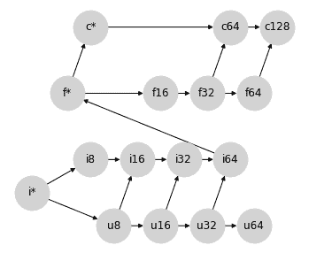

这涉及一种小的手法：之前我们使用 `f*` 表示标量类型。在这个格中，`f*` 可能被应用于混合计算的数组输出。我们不再将 `f*` 视为标量，而是可以将其视为一种具有不同提升规则的特殊类型 `float` 值：在 JAX 中我们称之为 *弱浮点数*；详见下文。

这种方法的优势在于，除了无符号整数外，它避免了 *所有* 比必要更宽的提升：你永远不会得到没有 64 位输入的 f64 输出，也永远不会得到没有 32 位输入的 f32 输出：这对于在加速器上工作时提供了方便的语义，同时避免了无意间生成 64 位值。

这种优先考虑浮点类型的特性类似于 PyTorch 的类型提升行为。这个格子也碰巧生成了一个非常接近 JAX 原始 *临时* 类型提升方案的提升表，该方案不是基于格子的，但具有优先考虑浮点类型的特性。

此外，这个格子还提供了一个自然的位置来插入 `bfloat16`，而无需在 `bf16` 和 `f16` 之间施加排序：

<details class="hide above-input"><summary aria-label="Toggle hidden content">显示代码单元源代码 隐藏代码单元源代码</summary>

```py
#@title
import networkx as nx
import matplotlib.pyplot as plt
lattice = {
  'i*': ['u8', 'i8'], 'f*': ['c*', 'f16', 'bf16'], 'c*': ['c64'],
  'u8': ['u16', 'i16'], 'u16': ['u32', 'i32'], 'u32': ['u64', 'i64'],
  'i8': ['i16'], 'i16': ['i32'], 'i32': ['i64'], 'i64': ['f*'],
  'f16': ['f32'], 'bf16': ['f32'], 'f32': ['f64', 'c64'], 'f64': ['c128'],
  'c64': ['c128']
}
graph = nx.from_dict_of_lists(lattice, create_using=nx.DiGraph)
pos = {
  'i*': [-1.25, 0.5], 'f*': [-0.5, 2], 'c*': [0, 3],
  'u8': [0.5, 0], 'u16': [1.5, 0], 'u32': [2.5, 0], 'u64': [3.5, 0],
  'i8': [0, 1], 'i16': [1, 1], 'i32': [2, 1], 'i64': [3, 1],
  'f16': [1.8, 1.7], 'bf16': [1.8, 2.3], 'f32': [3.0, 2], 'f64': [4.0, 2],
  'c64': [3.5, 3], 'c128': [4.5, 3],
}
fig, ax = plt.subplots(figsize=(6, 5))
nx.draw(graph, with_labels=True, node_size=1500, node_color='lightgray', pos=pos, ax=ax) 
```</details> 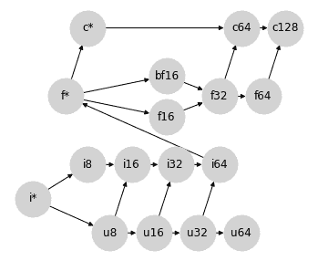

这一点很重要，因为 `f16` 和 `bf16` 不可比较，它们利用其位的方式不同：`bf16` 以较低精度表示更大的范围，而 `f16` 则以较高精度表示更小的范围。

然而，这些优势也伴随着一些权衡：

+   混合浮点数/整数提升非常容易产生精度损失：例如，`int64`（最大值为 \(9.2 \times 10^{18}\)）可以提升为 `float16`（最大值为 \(6.5 \times 10⁴\)），这意味着大多数可表示的值将变为 `inf`。

+   如上所述，`f*`不再被视为“标量类型”，而是被视为 float64 的不同风味。在 JAX 术语中，这被称为[*弱类型*](https://jax.readthedocs.io/en/latest/type_promotion.html#weakly-typed-values-in-jax)，即它表示为 64 位，但在与其他值推广时只弱化到此位宽度。

还请注意，这种方法仍然未解决`uint64`提升问题，尽管将`u64`连接到`f*`可能是合理的。

## JAX 中的类型提升

在设计 JAX 的类型提升语义时，我们牢记了许多这些想法，并且在几个方面倾向于：

1.  我们选择将 JAX 的类型提升语义约束为满足格属性的图形：这是为了确保结合律和交换律，但也为了允许语义被简洁地描述为 DAG，而不需要一个大表格。

1.  在计算加速器上获益时，我们倾向于避免意外推广到更宽的类型，特别是在涉及浮点值时。

1.  如果需要为了保持（1）和（2），我们可以接受在混合类型提升中潜在的精度损失（但不是幅度损失）。

考虑到这一点，JAX 采用了选项 3。或者更确切地说，选项 3 的一个稍微修改的版本，以建立`u64`与`f*`之间的连接，以创建真正的格。为了清晰起见重新排列节点，JAX 的类型提升格看起来像这样：

<details class="hide above-input"><summary aria-label="Toggle hidden content">显示代码单元格源码 隐藏代码单元格源码</summary>

```py
#@title
import networkx as nx
import matplotlib.pyplot as plt
lattice = {
  'i*': ['u8', 'i8'], 'f*': ['c*', 'f16', 'bf16'], 'c*': ['c64'],
  'u8': ['u16', 'i16'], 'u16': ['u32', 'i32'], 'u32': ['u64', 'i64'], 'u64': ['f*'],
  'i8': ['i16'], 'i16': ['i32'], 'i32': ['i64'], 'i64': ['f*'],
  'f16': ['f32'], 'bf16': ['f32'], 'f32': ['f64', 'c64'], 'f64': ['c128'],
  'c64': ['c128']
}
graph = nx.from_dict_of_lists(lattice, create_using=nx.DiGraph)
pos = {
  'i*': [-1.25, 0.5], 'f*': [4.5, 0.5], 'c*': [5, 1.5],
  'u8': [0.5, 0], 'u16': [1.5, 0], 'u32': [2.5, 0], 'u64': [3.5, 0],
  'i8': [0, 1], 'i16': [1, 1], 'i32': [2, 1], 'i64': [3, 1],
  'f16': [5.75, 0.8], 'bf16': [5.75, 0.2], 'f32': [7, 0.5], 'f64': [8, 0.5],
  'c64': [7.5, 1.5], 'c128': [8.5, 1.5],
}
fig, ax = plt.subplots(figsize=(10, 4))
ax.set_ylim(-0.5, 2)
nx.draw(graph, with_labels=True, node_size=1500, node_color='lightgray', pos=pos, ax=ax)
# ax.patches[12].set_linestyle((0, (2, 4))) 
```</details> 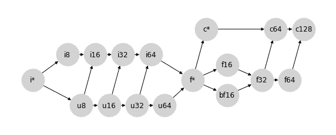

从这种选择产生的行为总结在[JAX 类型提升语义](https://jax.readthedocs.io/en/latest/type_promotion.html)中。特别地，除了包括更大的无符号类型（`u16`、`u32`、`u64`）和一些关于标量/弱类型（`i*`、`f*`、`c*`）行为的细节外，这种类型提升方案与 PyTorch 选择的非常接近。

对于有兴趣的人，附录下面打印了 NumPy、Tensorflow、PyTorch 和 JAX 使用的完整推广表。

## 附录：示例类型提升表

下面是各种 Python 数组计算库实现的隐式类型提升表的一些示例。

### NumPy 类型提升

请注意，NumPy 不包括`bfloat16` dtype，并且下表忽略了依赖值影响。

<details class="hide above-input"><summary aria-label="Toggle hidden content">显示代码单元格源码 隐藏代码单元格源码</summary>

```py
# @title

import numpy as np
import pandas as pd
from IPython import display

np_dtypes = {
  'b': np.bool_,
  'u8': np.uint8, 'u16': np.uint16, 'u32': np.uint32, 'u64': np.uint64,
  'i8': np.int8, 'i16': np.int16, 'i32': np.int32, 'i64': np.int64,
  'bf16': 'invalid', 'f16': np.float16, 'f32': np.float32, 'f64': np.float64,
  'c64': np.complex64, 'c128': np.complex128,
  'i*': int, 'f*': float, 'c*': complex}

np_dtype_to_code = {val: key for key, val in np_dtypes.items()}

def make_np_zero(dtype):
  if dtype in {int, float, complex}:
    return dtype(0)
  else:
    return np.zeros(1, dtype=dtype)

def np_result_code(dtype1, dtype2):
  try:
    out = np.add(make_np_zero(dtype1), make_np_zero(dtype2))
  except TypeError:
    return '-'
  else:
    if type(out) in {int, float, complex}:
      return np_dtype_to_code[type(out)]
    else:
      return np_dtype_to_code[out.dtype.type]

grid = [[np_result_code(dtype1, dtype2)
         for dtype2 in np_dtypes.values()]
        for dtype1 in np_dtypes.values()]
table = pd.DataFrame(grid, index=np_dtypes.keys(), columns=np_dtypes.keys())
display.HTML(table.to_html()) 
```</details>

|  | b | u8 | u16 | u32 | u64 | i8 | i16 | i32 | i64 | bf16 | f16 | f32 | f64 | c64 | c128 | i* | f* | c* |
| --- | --- | --- | --- | --- | --- | --- | --- | --- | --- | --- | --- | --- | --- | --- | --- | --- | --- | --- |
| b | b | u8 | u16 | u32 | u64 | i8 | i16 | i32 | i64 | - | f16 | f32 | f64 | c64 | c128 | i64 | f64 | c128 |
| u8 | u8 | u8 | u16 | u32 | u64 | i16 | i16 | i32 | i64 | - | f16 | f32 | f64 | c64 | c128 | u8 | f64 | c128 |
| u16 | u16 | u16 | u16 | u32 | u64 | i32 | i32 | i32 | i64 | - | f32 | f32 | f64 | c64 | c128 | u16 | f64 | c128 |
| u32 | u32 | u32 | u32 | u32 | u64 | i64 | i64 | i64 | i64 | - | f64 | f64 | f64 | c128 | c128 | u32 | f64 | c128 |
| u64 | u64 | u64 | u64 | u64 | u64 | f64 | f64 | f64 | f64 | - | f64 | f64 | f64 | c128 | c128 | u64 | f64 | c128 |
| i8 | i8 | i16 | i32 | i64 | f64 | i8 | i16 | i32 | i64 | - | f16 | f32 | f64 | c64 | c128 | i8 | f64 | c128 |
| i16 | i16 | i16 | i32 | i64 | f64 | i16 | i16 | i32 | i64 | - | f32 | f32 | f64 | c64 | c128 | i16 | f64 | c128 |
| i32 | i32 | i32 | i32 | i64 | f64 | i32 | i32 | i32 | i64 | - | f64 | f64 | f64 | c128 | c128 | i32 | f64 | c128 |
| i64 | i64 | i64 | i64 | i64 | f64 | i64 | i64 | i64 | i64 | - | f64 | f64 | f64 | c128 | c128 | i64 | f64 | c128 |
| bf16 | - | - | - | - | - | - | - | - | - | - | - | - | - | - | - | - | - | - |
| f16 | f16 | f16 | f32 | f64 | f64 | f16 | f32 | f64 | f64 | - | f16 | f32 | f64 | c64 | c128 | f16 | f16 | c64 |
| f32 | f32 | f32 | f32 | f64 | f64 | f32 | f32 | f64 | f64 | - | f32 | f32 | f64 | c64 | c128 | f32 | f32 | c64 |
| f64 | f64 | f64 | f64 | f64 | f64 | f64 | f64 | f64 | f64 | - | f64 | f64 | f64 | c128 | c128 | f64 | f64 | c128 |
| c64 | c64 | c64 | c64 | c128 | c128 | c64 | c64 | c128 | c128 | - | c64 | c64 | c128 | c64 | c128 | c64 | c64 | c64 |
| c128 | c128 | c128 | c128 | c128 | c128 | c128 | c128 | c128 | c128 | - | c128 | c128 | c128 | c128 | c128 | c128 | c128 | c128 |
| i* | i64 | u8 | u16 | u32 | u64 | i8 | i16 | i32 | i64 | - | f16 | f32 | f64 | c64 | c128 | i64 | f64 | c128 |
| f* | f64 | f64 | f64 | f64 | f64 | f64 | f64 | f64 | f64 | - | f16 | f32 | f64 | c64 | c128 | f64 | f64 | c128 |
| c* | c128 | c128 | c128 | c128 | c128 | c128 | c128 | c128 | c128 | - | c64 | c64 | c128 | c64 | c128 | c128 | c128 | c128 |

### TensorFlow 类型提升

TensorFlow 避免定义隐式类型提升，除了在有限的情况下，对 Python 标量进行操作。该表格是不对称的，因为在 `tf.add(x, y)` 中，`y` 的类型必须可以强制转换为 `x` 的类型。

<details class="hide above-input"><summary aria-label="Toggle hidden content">显示代码单元格来源 隐藏代码单元格来源</summary>

```py
# @title

import tensorflow as tf
import pandas as pd
from IPython import display

tf_dtypes = {
  'b': tf.bool,
  'u8': tf.uint8, 'u16': tf.uint16, 'u32': tf.uint32, 'u64': tf.uint64,
  'i8': tf.int8, 'i16': tf.int16, 'i32': tf.int32, 'i64': tf.int64,
  'bf16': tf.bfloat16, 'f16': tf.float16, 'f32': tf.float32, 'f64': tf.float64,
  'c64': tf.complex64, 'c128': tf.complex128,
  'i*': int, 'f*': float, 'c*': complex}

tf_dtype_to_code = {val: key for key, val in tf_dtypes.items()}

def make_tf_zero(dtype):
  if dtype in {int, float, complex}:
    return dtype(0)
  else:
    return tf.zeros(1, dtype=dtype)

def result_code(dtype1, dtype2):
  try:
    out = tf.add(make_tf_zero(dtype1), make_tf_zero(dtype2))
  except (TypeError, tf.errors.InvalidArgumentError):
    return '-'
  else:
    if type(out) in {int, float, complex}:
      return tf_dtype_to_code[type(out)]
    else:
      return tf_dtype_to_code[out.dtype]

grid = [[result_code(dtype1, dtype2)
         for dtype2 in tf_dtypes.values()]
        for dtype1 in tf_dtypes.values()]
table = pd.DataFrame(grid, index=tf_dtypes.keys(), columns=tf_dtypes.keys())
display.HTML(table.to_html()) 
```</details>

|  | b | u8 | u16 | u32 | u64 | i8 | i16 | i32 | i64 | bf16 | f16 | f32 | f64 | c64 | c128 | i* | f* | c* |
| --- | --- | --- | --- | --- | --- | --- | --- | --- | --- | --- | --- | --- | --- | --- | --- | --- | --- | --- |
| b | - | - | - | - | - | - | - | - | - | - | - | - | - | - | - | - | - | - |
| u8 | - | u8 | - | - | - | - | - | - | - | - | - | - | - | - | - | u8 | - | - |
| u16 | - | - | u16 | - | - | - | - | - | - | - | - | - | - | - | - | u16 | - | - |
| u32 | - | - | - | u32 | - | - | - | - | - | - | - | - | - | - | - | u32 | - | - |
| u64 | - | - | - | - | u64 | - | - | - | - | - | - | - | - | - | - | u64 | - | - |
| i8 | - | - | - | - | - | i8 | - | - | - | - | - | - | - | - | - | i8 | - | - |
| i16 | - | - | - | - | - | - | i16 | - | - | - | - | - | - | - | - | i16 | - | - |
| i32 | - | - | - | - | - | - | - | i32 | - | - | - | - | - | - | - | i32 | - | - |
| i64 | - | - | - | - | - | - | - | - | i64 | - | - | - | - | - | - | i64 | - | - |
| bf16 | - | - | - | - | - | - | - | - | - | bf16 | - | - | - | - | - | bf16 | bf16 | - |
| f16 | - | - | - | - | - | - | - | - | - | - | f16 | - | - | - | - | f16 | f16 | - |
| f32 | - | - | - | - | - | - | - | - | - | - | - | f32 | - | - | - | f32 | f32 | - |
| f64 | - | - | - | - | - | - | - | - | - | - | - | - | f64 | - | - | f64 | f64 | - |
| c64 | - | - | - | - | - | - | - | - | - | - | - | - | - | c64 | - | c64 | c64 | c64 |
| c128 | - | - | - | - | - | - | - | - | - | - | - | - | - | c128 | c128 | c128 | c128 |
| i* | - | - | - | - | - | - | - | i32 | - | - | - | - | - | - | - | i32 | - | - |
| f* | - | - | - | - | - | - | - | - | - | - | - | f32 | - | - | - | f32 | f32 | - |
| c* | - | - | - | - | - | - | - | - | - | - | - | - | - | - | c128 | c128 | c128 | c128 |

### PyTorch 类型提升

注意，torch 不包括大于 `uint8` 的无符号整数类型。除此之外，有关标量/弱类型提升的一些细节，表格接近于 `jax.numpy` 的用法。

<details class="hide above-input"><summary aria-label="Toggle hidden content">显示代码单元源代码 隐藏代码单元源代码</summary>

```py
# @title
import torch
import pandas as pd
from IPython import display

torch_dtypes = {
  'b': torch.bool,
  'u8': torch.uint8, 'u16': 'invalid', 'u32': 'invalid', 'u64': 'invalid',
  'i8': torch.int8, 'i16': torch.int16, 'i32': torch.int32, 'i64': torch.int64,
  'bf16': torch.bfloat16, 'f16': torch.float16, 'f32': torch.float32, 'f64': torch.float64,
  'c64': torch.complex64, 'c128': torch.complex128,
  'i*': int, 'f*': float, 'c*': complex}

torch_dtype_to_code = {val: key for key, val in torch_dtypes.items()}

def make_torch_zero(dtype):
  if dtype in {int, float, complex}:
    return dtype(0)
  else:
    return torch.zeros(1, dtype=dtype)

def torch_result_code(dtype1, dtype2):
  try:
    out = torch.add(make_torch_zero(dtype1), make_torch_zero(dtype2))
  except TypeError:
    return '-'
  else:
    if type(out) in {int, float, complex}:
      return torch_dtype_to_code[type(out)]
    else:
      return torch_dtype_to_code[out.dtype]

grid = [[torch_result_code(dtype1, dtype2)
         for dtype2 in torch_dtypes.values()]
        for dtype1 in torch_dtypes.values()]
table = pd.DataFrame(grid, index=torch_dtypes.keys(), columns=torch_dtypes.keys())
display.HTML(table.to_html()) 
```</details>

|  | b | u8 | u16 | u32 | u64 | i8 | i16 | i32 | i64 | bf16 | f16 | f32 | f64 | c64 | c128 | i* | f* | c* |
| --- | --- | --- | --- | --- | --- | --- | --- | --- | --- | --- | --- | --- | --- | --- | --- | --- | --- | --- |
| b | b | u8 | - | - | - | i8 | i16 | i32 | i64 | bf16 | f16 | f32 | f64 | c64 | c128 | i64 | f32 | c64 |
| u8 | u8 | u8 | - | - | - | i16 | i16 | i32 | i64 | bf16 | f16 | f32 | f64 | c64 | c128 | u8 | f32 | c64 |
| u16 | - | - | - | - | - | - | - | - | - | - | - | - | - | - | - | - | - | - |
| u32 | - | - | - | - | - | - | - | - | - | - | - | - | - | - | - | - | - | - |
| u64 | - | - | - | - | - | - | - | - | - | - | - | - | - | - | - | - | - | - |
| i8 | i8 | i16 | - | - | - | i8 | i16 | i32 | i64 | bf16 | f16 | f32 | f64 | c64 | c128 | i8 | f32 | c64 |
| i16 | i16 | i16 | - | - | - | i16 | i16 | i32 | i64 | bf16 | f16 | f32 | f64 | c64 | c128 | i16 | f32 | c64 |
| i32 | i32 | i32 | - | - | - | i32 | i32 | i32 | i64 | bf16 | f16 | f32 | f64 | c64 | c128 | i32 | f32 | c64 |
| i64 | i64 | i64 | - | - | - | i64 | i64 | i64 | i64 | bf16 | f16 | f32 | f64 | c64 | c128 | i64 | f32 | c64 |
| bf16 | bf16 | bf16 | - | - | - | bf16 | bf16 | bf16 | bf16 | bf16 | f32 | f32 | f64 | c64 | c128 | bf16 | bf16 | c64 |
| f16 | f16 | f16 | - | - | - | f16 | f16 | f16 | f16 | f32 | f16 | f32 | f64 | c64 | c128 | f16 | f16 | c64 |
| f32 | f32 | f32 | - | - | - | f32 | f32 | f32 | f32 | f32 | f32 | f32 | f64 | c64 | c128 | f32 | f32 | c64 |
| f64 | f64 | f64 | - | - | - | f64 | f64 | f64 | f64 | f64 | f64 | f64 | f64 | c128 | c128 | f64 | f64 | c128 |
| c64 | c64 | c64 | - | - | - | c64 | c64 | c64 | c64 | c64 | c64 | c64 | c128 | c64 | c128 | c64 | c64 | c64 |
| c128 | c128 | c128 | - | - | - | c128 | c128 | c128 | c128 | c128 | c128 | c128 | c128 | c128 | c128 | c128 | c128 | c128 |
| i* | i64 | u8 | - | - | - | i8 | i16 | i32 | i64 | bf16 | f16 | f32 | f64 | c64 | c128 | i64 | f32 | c64 |
| f* | f32 | f32 | - | - | - | f32 | f32 | f32 | f32 | bf16 | f16 | f32 | f64 | c64 | c128 | f32 | f64 | c64 |
| c* | c64 | c64 | - | - | - | c64 | c64 | c64 | c64 | c64 | c64 | c64 | c128 | c64 | c128 | c64 | c64 | c128 |

### JAX Type Promotion: `jax.numpy`

`jax.numpy` follows type promotion rules laid out at https://jax.readthedocs.io/en/latest/type_promotion.html. Here we use `i*`, `f*`, `c*` to indicate both Python scalars and weakly-typed arrays.

<details class="hide above-input"><summary aria-label="Toggle hidden content">显示代码单元格源码 隐藏代码单元格源码</summary>

```py
# @title
from jax import dtypes
import jax
import jax.numpy as jnp
import pandas as pd
from IPython import display
jax.config.update('jax_enable_x64', True)

jnp_dtypes = {
  'b': jnp.bool_.dtype,
  'u8': jnp.uint8.dtype, 'u16': jnp.uint16.dtype, 'u32': jnp.uint32.dtype, 'u64': jnp.uint64.dtype,
  'i8': jnp.int8.dtype, 'i16': jnp.int16.dtype, 'i32': jnp.int32.dtype, 'i64': jnp.int64.dtype,
  'bf16': jnp.bfloat16.dtype, 'f16': jnp.float16.dtype, 'f32': jnp.float32.dtype, 'f64': jnp.float64.dtype,
  'c64': jnp.complex64.dtype, 'c128': jnp.complex128.dtype,
  'i*': int, 'f*': float, 'c*': complex}

jnp_dtype_to_code = {val: key for key, val in jnp_dtypes.items()}

def make_jnp_zero(dtype):
  if dtype in {int, float, complex}:
    return dtype(0)
  else:
    return jnp.zeros((), dtype=dtype)

def jnp_result_code(dtype1, dtype2):
  try:
    out = jnp.add(make_jnp_zero(dtype1), make_jnp_zero(dtype2))
  except TypeError:
    return '-'
  else:
    if hasattr(out, 'aval') and out.aval.weak_type:
      return out.dtype.kind + '*'
    elif type(out) in {int, float, complex}:
      return jnp_dtype_to_code[type(out)]
    else:
      return jnp_dtype_to_code[out.dtype]

grid = [[jnp_result_code(dtype1, dtype2)
         for dtype2 in jnp_dtypes.values()]
        for dtype1 in jnp_dtypes.values()]
table = pd.DataFrame(grid, index=jnp_dtypes.keys(), columns=jnp_dtypes.keys())
display.HTML(table.to_html()) 
```</details>

|  | b | u8 | u16 | u32 | u64 | i8 | i16 | i32 | i64 | bf16 | f16 | f32 | f64 | c64 | c128 | i* | f* | c* |
| --- | --- | --- | --- | --- | --- | --- | --- | --- | --- | --- | --- | --- | --- | --- | --- | --- | --- | --- |
| b | b | u8 | u16 | u32 | u64 | i8 | i16 | i32 | i64 | bf16 | f16 | f32 | f64 | c64 | c128 | i* | f* | c* |
| u8 | u8 | u8 | u16 | u32 | u64 | i16 | i16 | i32 | i64 | bf16 | f16 | f32 | f64 | c64 | c128 | u8 | f* | c* |
| u16 | u16 | u16 | u16 | u32 | u64 | i32 | i32 | i32 | i64 | bf16 | f16 | f32 | f64 | c64 | c128 | u16 | f* | c* |
| u32 | u32 | u32 | u32 | u32 | u64 | i64 | i64 | i64 | i64 | bf16 | f16 | f32 | f64 | c64 | c128 | u32 | f* | c* |
| u64 | u64 | u64 | u64 | u64 | u64 | f* | f* | f* | f* | bf16 | f16 | f32 | f64 | c64 | c128 | u64 | f* | c* |
| i8 | i8 | i16 | i32 | i64 | f* | i8 | i16 | i32 | i64 | bf16 | f16 | f32 | f64 | c64 | c128 | i8 | f* | c* |
| i16 | i16 | i16 | i32 | i64 | f* | i16 | i16 | i32 | i64 | bf16 | f16 | f32 | f64 | c64 | c128 | i16 | f* | c* |
| i32 | i32 | i32 | i32 | i64 | f* | i32 | i32 | i32 | i64 | bf16 | f16 | f32 | f64 | c64 | c128 | i32 | f* | c* |
| i64 | i64 | i64 | i64 | i64 | f* | i64 | i64 | i64 | i64 | bf16 | f16 | f32 | f64 | c64 | c128 | i64 | f* | c* |
| bf16 | bf16 | bf16 | bf16 | bf16 | bf16 | bf16 | bf16 | bf16 | bf16 | bf16 | f32 | f32 | f64 | c64 | c128 | bf16 | bf16 | c64 |
| f16 | f16 | f16 | f16 | f16 | f16 | f16 | f16 | f16 | f16 | f32 | f16 | f32 | f64 | c64 | c128 | f16 | f16 | c64 |
| f32 | f32 | f32 | f32 | f32 | f32 | f32 | f32 | f32 | f32 | f32 | f32 | f32 | f64 | c64 | c128 | f32 | f32 | c64 |
| f64 | f64 | f64 | f64 | f64 | f64 | f64 | f64 | f64 | f64 | f64 | f64 | f64 | f64 | c128 | c128 | f64 | f64 | c128 |
| c64 | c64 | c64 | c64 | c64 | c64 | c64 | c64 | c64 | c64 | c64 | c64 | c64 | c128 | c64 | c128 | c64 | c64 | c64 |
| c128 | c128 | c128 | c128 | c128 | c128 | c128 | c128 | c128 | c128 | c128 | c128 | c128 | c128 | c128 | c128 | c128 | c128 | c128 |
| i* | i* | u8 | u16 | u32 | u64 | i8 | i16 | i32 | i64 | bf16 | f16 | f32 | f64 | c64 | c128 | i* | f* | c* |
| f* | f* | f* | f* | f* | f* | f* | f* | f* | f* | bf16 | f16 | f32 | f64 | c64 | c128 | f* | f* | c* |
| c* | c* | c* | c* | c* | c* | c* | c* | c* | c* | c64 | c64 | c64 | c128 | c64 | c128 | c* | c* | c* |

### JAX 类型提升：`jax.lax`

`jax.lax` 是较低级的库，不执行任何隐式类型提升。在这里，我们使用 `i*`、`f*`、`c*` 来表示 Python 标量和弱类型数组。

<details class="hide above-input"><summary aria-label="Toggle hidden content">显示代码单元格源代码 隐藏代码单元格源代码</summary>

```py
# @title
from jax import dtypes
import jax
import jax.numpy as jnp
import pandas as pd
from IPython import display
jax.config.update('jax_enable_x64', True)

jnp_dtypes = {
  'b': jnp.bool_.dtype,
  'u8': jnp.uint8.dtype, 'u16': jnp.uint16.dtype, 'u32': jnp.uint32.dtype, 'u64': jnp.uint64.dtype,
  'i8': jnp.int8.dtype, 'i16': jnp.int16.dtype, 'i32': jnp.int32.dtype, 'i64': jnp.int64.dtype,
  'bf16': jnp.bfloat16.dtype, 'f16': jnp.float16.dtype, 'f32': jnp.float32.dtype, 'f64': jnp.float64.dtype,
  'c64': jnp.complex64.dtype, 'c128': jnp.complex128.dtype,
  'i*': int, 'f*': float, 'c*': complex}

jnp_dtype_to_code = {val: key for key, val in jnp_dtypes.items()}

def make_jnp_zero(dtype):
  if dtype in {int, float, complex}:
    return dtype(0)
  else:
    return jnp.zeros((), dtype=dtype)

def jnp_result_code(dtype1, dtype2):
  try:
    out = jax.lax.add(make_jnp_zero(dtype1), make_jnp_zero(dtype2))
  except TypeError:
    return '-'
  else:
    if hasattr(out, 'aval') and out.aval.weak_type:
      return out.dtype.kind + '*'
    elif type(out) in {int, float, complex}:
      return jnp_dtype_to_code[type(out)]
    else:
      return jnp_dtype_to_code[out.dtype]

grid = [[jnp_result_code(dtype1, dtype2)
         for dtype2 in jnp_dtypes.values()]
        for dtype1 in jnp_dtypes.values()]
table = pd.DataFrame(grid, index=jnp_dtypes.keys(), columns=jnp_dtypes.keys())
display.HTML(table.to_html()) 
```</details>

|  | b | u8 | u16 | u32 | u64 | i8 | i16 | i32 | i64 | bf16 | f16 | f32 | f64 | c64 | c128 | i* | f* | c* |
| --- | --- | --- | --- | --- | --- | --- | --- | --- | --- | --- | --- | --- | --- | --- | --- | --- | --- | --- |
| b | - | - | - | - | - | - | - | - | - | - | - | - | - | - | - | - | - | - |
| u8 | - | u8 | - | - | - | - | - | - | - | - | - | - | - | - | - | - | - | - |
| u16 | - | - | u16 | - | - | - | - | - | - | - | - | - | - | - | - | - | - | - |
| u32 | - | - | - | u32 | - | - | - | - | - | - | - | - | - | - | - | - | - | - |
| u64 | - | - | - | - | u64 | - | - | - | - | - | - | - | - | - | - | - | - | - |
| i8 | - | - | - | - | - | i8 | - | - | - | - | - | - | - | - | - | - | - | - |
| i16 | - | - | - | - | - | - | i16 | - | - | - | - | - | - | - | - | - | - | - |
| i32 | - | - | - | - | - | - | - | i32 | - | - | - | - | - | - | - | - | - | - |
| i64 | - | - | - | - | - | - | - | - | i64 | - | - | - | - | - | - | i64 | - | - |
| bf16 | - | - | - | - | - | - | - | - | - | bf16 | - | - | - | - | - | - | - | - |
| f16 | - | - | - | - | - | - | - | - | - | - | f16 | - | - | - | - | - | - | - |
| f32 | - | - | - | - | - | - | - | - | - | - | - | f32 | - | - | - | - | - | - |
| f64 | - | - | - | - | - | - | - | - | - | - | - | - | f64 | - | - | - | f64 | - |
| c64 | - | - | - | - | - | - | - | - | - | - | - | - | - | c64 | - | - | - | - |
| c128 | - | - | - | - | - | - | - | - | - | - | - | - | - | - | c128 | - | - | c128 |
| i* | - | - | - | - | - | - | - | - | i64 | - | - | - | - | - | - | i* | - | - |
| f* | - | - | - | - | - | - | - | - | - | - | - | - | f64 | - | - | - | f* | - |
| c* | - | - | - | - | - | - | - | - | - | - | - | - | - | - | c128 | - | - | c* |
