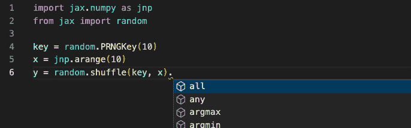

# JAX 的类型注释路线图

> 原文：[`jax.readthedocs.io/en/latest/jep/12049-type-annotations.html`](https://jax.readthedocs.io/en/latest/jep/12049-type-annotations.html)

+   *作者：jakevdp*

+   *日期：2022 年 8 月*

## 背景

Python 3.0 引入了可选的函数注释（[PEP 3107](https://peps.python.org/pep-3107/)），这些注释后来在 Python 3.5 发布时被规范为静态类型检查的一部分（[PEP 484](https://peps.python.org/pep-0484/)）。在很大程度上，类型注释和静态类型检查已经成为许多 Python 开发工作流程的一个重要组成部分，为此我们在 JAX API 的许多地方添加了注释。目前在 JAX 中的类型注释有些零散，增加更多注释的努力受到了更基本的设计问题的阻碍。本文试图总结这些问题，并为 JAX 中类型注释的目标和非目标制定路线图。

为什么我们需要这样的路线图？更好/更全面的类型注释是用户（包括内部和外部用户）经常提出的请求。此外，我们经常收到来自外部用户的拉取请求（例如，[PR＃9917](https://github.com/google/jax/pull/9917)，[PR＃10322](https://github.com/google/jax/pull/10322)），试图改进 JAX 的类型注释：对于 JAX 团队成员来说，审查此类贡献是否有益并不总是清楚，特别是当它们引入复杂的协议来解决 JAX 对 Python 的完全注释所固有的挑战时。本文详细介绍了 JAX 对包中类型注释的目标和建议。

## 为什么需要类型注释？

有许多原因使得 Python 项目希望对其代码库进行注释；我们将在本文档中总结为 Level 1、Level 2 和 Level 3。

### Level 1：作为文档的注释

最初在 [PEP 3107](https://peps.python.org/pep-3107/) 中引入时，类型注释部分是由于可以将其用作函数参数类型和返回类型的简洁内联文档。JAX 长期以来一直以这种方式使用注释；一个例子是常见的创建类型名称并将其别名为 `Any` 的模式。可以在 `lax/slicing.py` 中找到一个例子[[source](https://github.com/google/jax/blob/2bc3e39cd9104071ee39dacac22abd51b94eb27e/jax/_src/lax/slicing.py#L47-L58)]：

```py
Array = Any
Shape = core.Shape

def slice(operand: Array, start_indices: Sequence[int],
          limit_indices: Sequence[int],
          strides: Optional[Sequence[int]] = None) -> Array:
  ... 
```

出于静态类型检查的目的，这种使用 `Array = Any` 用于数组类型注释对参数值没有任何限制（`Any` 等同于没有注释），但它确实作为开发人员在代码中有用的形式化文档。

为了生成文档，别名的名称会丢失（`jax.lax.slice`的[HTML 文档](https://jax.readthedocs.io/en/latest/_autosummary/jax.lax.slice.html)将操作数报告为类型`Any`），因此文档的好处并未超出源代码（尽管我们可以启用一些`sphinx-autodoc`选项来改进此功能：参见[autodoc_type_aliases](https://www.sphinx-doc.org/en/master/usage/extensions/autodoc.html#confval-autodoc_type_aliases)）。

这种类型注解的一个好处是，用`Any`注释一个值永远不会错，因此它将以文档的形式为开发者和用户提供实际的好处，而无需满足任何特定静态类型检查器更严格的需求的复杂性。

### 第 2 级：智能自动完成的注解

许多现代 IDE 利用类型注解作为智能代码补全系统的输入。其中一个例子是 VSCode 的[Pylance](https://marketplace.visualstudio.com/items?itemName=ms-python.vscode-pylance)扩展，它使用微软的[pyright](https://github.com/microsoft/pyright)静态类型检查器作为 VSCode [IntelliSense](https://code.visualstudio.com/docs/editor/intellisense)完成的信息源。

这种类型检查的使用需要比上述简单的别名更深入的了解；例如，知道`slice`函数返回一个名为`Array`的`Any`别名并不会为代码完成引擎增添任何有用的信息。然而，如果我们用`DeviceArray`标注函数的返回类型，自动完成将了解如何填充结果的命名空间，因此在开发过程中能够提供更相关的自动完成建议。

JAX 已经在几个地方开始添加这种类型注解的级别；一个例子是`jax.random`包中的`jnp.ndarray`返回类型 [[来源](https://github.com/google/jax/blob/2bc3e39cd9104071ee39dacac22abd51b94eb27e/jax/_src/random.py#L359)]：

```py
def shuffle(key: KeyArray, x: Array, axis: int = 0) -> jnp.ndarray:
  ... 
```

在这种情况下，`jnp.ndarray`是一个抽象基类，用于预先声明 JAX 数组的属性和方法（[见源代码](https://github.com/google/jax/blob/2bc3e39cd9104071ee39dacac22abd51b94eb27e/jax/_src/numpy/ndarray.py#L41)），因此 VSCode 中的 Pylance 可以为该函数的结果提供完整的自动完成集合。这里是显示结果的屏幕截图：



在自动完成字段中列出了抽象`ndarray`类声明的所有方法和属性。我们将在下面进一步讨论为什么需要创建这个抽象类，而不是直接用`DeviceArray`进行注释。

### 第 3 级：静态类型检查的注解

当今，静态类型检查通常是人们在考虑 Python 代码中类型注解目的时首先考虑的事情。虽然 Python 不会对类型进行任何运行时检查，但存在几种成熟的静态类型检查工具，可以作为 CI 测试套件的一部分进行此类检查。对于 JAX 来说，最重要的工具如下：

+   [python/mypy](https://github.com/python/mypy) 在开放的 Python 社区中几乎成为了标准。JAX 目前在 Github Actions 的 CI 检查中对一部分源文件运行 mypy。

+   [google/pytype](https://github.com/google/pytype) 是 Google 的静态类型检查器，Google 内部依赖 JAX 的项目经常使用此工具。

+   [microsoft/pyright](https://github.com/microsoft/pyright) 是 VSCode 中用于之前提到的 Pylance 完成的静态类型检查器，具有重要意义。

完全的静态类型检查是所有类型注解应用中最严格的，因为它会在您的类型注解不精确时立即出现错误。一方面，这很好，因为您的静态类型分析可能会捕获到错误的类型注解（例如，`DeviceArray` 方法在 `jnp.ndarray` 抽象类中缺失的情况）。

另一方面，这种严格性可能会使得依赖鸭子类型而不是严格类型安全 API 的软件包在类型检查过程中变得非常脆弱。你会在 JAX 代码库中当前发现大量像 `#type: ignore`（对于 mypy）或 `#pytype: disable`（对于 pytype）这样的代码注释。这些通常代表了出现类型问题的情况；它们可能是 JAX 类型注解中的不准确之处，或者是静态类型检查器在正确跟踪代码控制流时的不准确之处。偶尔，它们可能是由于 pytype 或 mypy 行为中真正而微妙的错误造成的。在罕见的情况下，它们可能是由于 JAX 使用了在 Python 的静态类型注解语法中难以甚至不可能表达的 Python 模式。

## JAX 的类型注解挑战

JAX 目前的类型注解是不同风格的混合，并针对上述所有三个类型注解层级。部分原因是因为 JAX 的源代码对 Python 的类型注解系统提出了许多独特的挑战。我们将在这里概述它们。

### 挑战 1：pytype、mypy 和开发人员的摩擦

JAX 目前面临的一个挑战是，软件包开发必须满足两种不同静态类型检查系统的约束，即 `pytype`（用于内部 CI 和 Google 内部项目）和 `mypy`（用于外部 CI 和外部依赖）。尽管这两种类型检查器在行为上有广泛的重叠，但每种都展示了其独特的特例情况，这可以从 JAX 代码库中遍布的众多 `#type: ignore` 和 `#pytype: disable` 语句中看出。

这给开发带来了摩擦：内部贡献者可能会迭代直到测试通过，然后发现在导出时他们通过 pytype 验证的代码在 mypy 中不符合要求。对于外部贡献者来说，情况通常相反：一个最近的例子是[#9596](https://github.com/google/jax/issues/9596)，在未能通过 Google 内部的 pytype 检查后不得不回滚。每次我们将类型注释从第 1 级（到处都是`Any`）移动到第 2 或第 3 级（更严格的注释），都会增加这种令人沮丧的开发体验的可能性。

### 挑战 2：数组鸭子类型

注释 JAX 代码的一个特殊挑战是其广泛使用的鸭子类型。一般情况下标记为`Array`的函数的输入可能是许多不同类型之一：JAX 的`DeviceArray`、NumPy 的`np.ndarray`、NumPy 标量、Python 标量、Python 序列、带有`__array__`属性的对象、带有`__jax_array__`属性的对象或任何`jax.Tracer`的变体。因此，简单的注释如`def func(x: DeviceArray)`将不足以满足要求，并且会导致许多有效用法的误报。这意味着对于 JAX 函数的类型注释不会简短或琐碎，但我们必须有效地开发一组类似于[`numpy.typing`包](https://github.com/numpy/numpy/blob/main/numpy/_typing/_array_like.py)中的 JAX 特定类型扩展。

### 挑战 3：转换和装饰器

JAX 的 Python API 严重依赖于函数转换（`jit()`、`vmap()`、`grad()`等），这种类型的 API 对静态类型分析提出了特殊挑战。装饰器的灵活注释一直是 mypy 包的[长期问题](https://github.com/python/mypy/issues/1927)，最近才通过引入`ParamSpec`（详见[PEP 612](https://peps.python.org/pep-0612/)，并在 Python 3.10 中添加）解决。因为 JAX 遵循[NEP 29](https://numpy.org/neps/nep-0029-deprecation_policy.html)，在 2024 年中期之后才能依赖 Python 3.10 的功能。与此同时，Protocols 可作为部分解决方案使用（JAX 在[#9950](https://github.com/google/jax/issues/9950)中为 jit 和其他方法添加了此功能），而 ParamSpec 可以通过`typing_extensions`包使用（原型在[#9999](https://github.com/google/jax/issues/9999)中），尽管这目前揭示了 mypy 中的基本错误（见[python/mypy#12593](https://github.com/python/mypy/issues/12593)）。总之：目前尚不清楚 JAX 函数转换的 API 是否能在当前 Python 类型注释工具的限制下得到适当注释。

### 挑战 4：数组注释缺乏细粒度

另一个挑战是 Python 所有面向数组的 API 共同面临的问题，多年来一直是 JAX 讨论的一部分（见[#943](https://github.com/google/jax/issues/943)）。类型注解涉及对象的 Python 类或类型，而在基于数组的语言中，类的属性通常更为重要。在 NumPy、JAX 及类似包中，我们经常希望注释特定的数组形状和数据类型。

例如，`jnp.linspace`函数的参数必须是标量值，但在 JAX 中，标量由零维数组表示。因此，为了使注释不引发误报，我们必须允许这些参数是*任意*数组。另一个例子是`jax.random.choice`的第二个参数，在`shape=()`时必须具有`dtype=int`。Python 计划通过可变类型泛型（参见[PEP 646](https://peps.python.org/pep-0646/)，计划用于 Python 3.11）来实现类型注解的这种粒度，但像`ParamSpec`一样，支持这一功能还需要一段时间来稳定。

在此期间，有一些第三方项目可能会有所帮助，特别是[google/jaxtyping](https://github.com/google/jaxtyping)，但这些使用非标准注解，可能不适用于对核心 JAX 库本身进行注释。总的来说，数组类型粒度挑战的问题不如其他挑战那么严重，因为主要影响是数组类似的注释将不如其本应该的那样具体。

### 第五个挑战：从 NumPy 继承的不精确 API

JAX 用户界面 API 的大部分内容都继承自`jax.numpy`子模块中的 NumPy。NumPy 的 API 在 Python 语言静态类型检查成为一部分之前就已经开发多年，遵循 Python 的历史建议使用一种[鸭子类型](https://docs.python.org/3/glossary.html#term-duck-typing)/[EAFP](https://docs.python.org/3/glossary.html#term-eafp)编码风格，其中不鼓励在运行时进行严格的类型检查。作为具体例子，考虑[`numpy.tile()`](https://numpy.org/doc/stable/reference/generated/numpy.tile.html#numpy.tile "(在 NumPy v2.0 中)")函数，它的定义如下：

```py
def tile(A, reps):
  try:
    tup = tuple(reps)
  except TypeError:
    tup = (reps,)
  d = len(tup)
  ... 
```

这里的*意图*是`reps`应该包含一个`int`或者一个`int`值的序列，但*实现*允许`tup`是任何可迭代的对象。在对这种鸭子类型的代码添加注释时，我们可以采取两种路线之一：

1.  我们可以选择注释函数 API 的*意图*，在这里可能是类似`reps: Union[int, Sequence[int]]`的内容。

1.  相反，我们可以选择注释函数的*实现*，在这里可能看起来像是 `reps: Union[ConvertibleToInt, Iterable[ConvertibleToInt]]`，其中 `ConvertibleToInt` 是一个特殊的协议，涵盖了我们的函数将输入转换为整数的确切机制（即通过 `__int__`、通过 `__index__`、通过 `__array__` 等）。此外，请注意，从严格意义上讲，`Iterable` 在这里是不足够的，因为在 Python 中有些对象虽然通过 `__getitem__` 是可迭代的，但不能满足静态类型检查的 `Iterable` （比如，用于 `__iter__` 而不是 `__getitem__` 的对象）。

#1 的优势，在于注释意图，是注释在传达 API 合约时对用户更有用；而对于开发者来说，灵活性则为在必要时重构留下了余地。缺点（特别是对于像 JAX 这样的渐进式类型 API 来说）是，现有用户代码很可能是运行正确的，但在类型检查器中会被标记为不正确。现有鸭子类型 API 的渐进类型化意味着当前的注释隐式是 `Any`，因此将其更改为更严格的类型可能会对用户产生破坏性的改变。

总体而言，在 IDE 注释中，更好地服务于 Level 1 类型检查的是注释意图，而更好地服务于 Level 3 的是注释实现，而 Level 2 则是一种混合体（在 IDE 注释中，注释意图和实现都很重要）。

## JAX 类型注释路线图

在这种(Level 1/2/3)和 JAX 特定挑战的框架下，我们可以开始制定我们在 JAX 项目中实施一致类型注释的路线图。

### 指导原则

对于 JAX 类型注释，我们将遵循以下原则：

#### 类型注释的目的

尽可能地，我们希望支持完整的*Level 1、2 和 3*类型注释。特别是这意味着我们应该对公共 API 函数的输入和输出都进行严格的类型注释。

#### 注释以表达意图为目的

JAX 类型注释通常应该指示 API 的**意图**，而不是实现，以便注释在传达 API 合约时变得有用。这意味着有时在运行时有效的输入，在静态类型检查器中可能不被识别为有效（一个例子可能是将任意迭代器传递到标注为 `Shape = Sequence[int]` 的形状位置）。

#### 输入应该是宽松类型的

JAX 函数和方法的输入应尽可能宽松地进行类型标注：例如，虽然形状通常是元组，但接受形状的函数应接受任意序列。类似地，接受数据类型的函数不必要求是 `np.dtype` 的实例，而是任何可转换为数据类型的对象。这可能包括字符串、内置标量类型或标量对象构造函数，如 `np.float64` 和 `jnp.float64`。为了使整个包尽可能统一，我们将添加一个 `jax.typing` 模块，其中包含常见的类型规范，从广义类别开始，例如：

+   `ArrayLike` 将是可以隐式转换为数组的任何内容的联合：例如，jax 数组、numpy 数组、JAX 追踪器以及 Python 或 numpy 标量。

+   `DTypeLike` 将是可以隐式转换为数据类型的任何内容的联合：例如，numpy 数据类型、numpy 数据类型对象、jax 数据类型对象、字符串和内置类型。

+   `ShapeLike` 将是可以转换为形状的任何内容的联合：例如，整数或类整数对象的序列。

+   等等

注意，这些通常比 [`numpy.typing`](https://numpy.org/doc/stable/reference/typing.html#module-numpy.typing "(in NumPy v2.0)") 中使用的等效协议要简单。例如，在 `DTypeLike` 的情况下，JAX 不支持结构化数据类型，因此 JAX 可以使用更简单的实现。同样地，在 `ArrayLike` 中，JAX 通常不支持列表或元组输入来代替数组，因此类型定义将比 NumPy 的类似物简单。

#### 输出应该是严格类型化的

相反，函数和方法的输出应尽可能严格地进行类型标注：例如，对于返回数组的 JAX 函数，输出应该用类似 `jnp.ndarray` 的方式进行注释，而不是 `ArrayLike`。返回数据类型的函数应始终注释为 `np.dtype`，返回形状的函数应始终为 `Tuple[int]` 或严格类型的 NamedShape 等效物。为此，我们将在 `jax.typing` 中实现几个严格类型化的类似于上述宽松类型的模拟，即：

+   用于类型标注目的的 `Array` 或 `NDArray`（见下文）实际上等效于 `Union[Tracer, jnp.ndarray]`，应用于数组输出的标注。

+   `DType` 是 `np.dtype` 的别名，可能还具有表示 JAX 中使用的关键类型和其他泛化类型的能力。

+   `Shape` 本质上是 `Tuple[int, ...]`，可能具有一些额外的灵活性以适应动态形状的情况。

+   `NamedShape` 是 `Shape` 的扩展，允许在 JAX 内部使用的命名形状。

+   等等

我们还将探讨是否可以放弃当前的 `jax.numpy.ndarray` 实现，以支持将 `ndarray` 作为 `Array` 或类似物的别名。

#### 倾向于简单性

除了在`jax.typing`中收集的常见类型协议之外，我们应该偏向简单。在传递给 API 函数的参数的类型规范无法简洁指定的情况下，我们应避免构建过于复杂的联合，而是使用简单的联合，如`Union[simple_type, Any]`。这是一个妥协，旨在实现 Level 1 和 Level 2 的注解目标，同时避免不必要的复杂性，暂时放弃 Level 3。

#### 避免不稳定的类型机制

为了不给开发带来不必要的摩擦（由于内部/外部 CI 差异），我们希望在使用类型注解构造时保守一些：特别是在涉及最近引入的机制如`ParamSpec`（[PEP 612](https://peps.python.org/pep-0612/)）和可变类型泛型（[PEP 646](https://peps.python.org/pep-0646/)）时，我们希望在 mypy 和其他工具支持成熟且稳定之前等待。

其中一个影响是，目前在函数被 JAX 转换（如`jit`、`vmap`、`grad`等）装饰时，JAX 将有效地**剥离所有注解**。尽管这很不幸，但在撰写本文时，mypy 与`ParamSpec`提供的潜在解决方案存在一长串的不兼容性（见[`ParamSpec` mypy bug tracker](https://github.com/python/mypy/issues?q=is%3Aissue+is%3Aopen++label%3Atopic-paramspec+)），因此我们认为目前尚不适合在 JAX 中全面采用。在未来，一旦对此类特性的支持稳定下来，我们将重新审视这个问题。

同样地，目前我们将避免添加由[jaxtyping](http://github.com/google/jaxtyping)项目提供的更复杂和更精细的数组类型注解。这是我们可以在未来重新审视的决定。

### `Array`类型设计考虑因素

如上所述，对于 JAX 中数组的类型注解，由于 JAX 广泛使用鸭子类型，即在 jax 转换中传递和返回`Tracer`对象而不是实际的数组，这带来了独特的挑战。这变得越来越令人困惑，因为用于类型注解的对象通常与用于运行时实例检查的对象重叠，可能与所讨论对象的实际类型层次结构相对应也可能不相对应。对于 JAX，我们需要为两个上下文提供鸭子类型对象的解决方案：**静态类型注解**和**运行时实例检查**。

以下讨论将假设`jax.Array`是运行时设备上数组的类型，尽管目前尚未实现，但一旦在[#12016](https://github.com/google/jax/issues/12016)中完成工作，将会实现。

#### 静态类型注解

我们需要提供一个可以用于鸭子类型注解的对象。假设我们暂时称此对象为`ArrayAnnotation`，我们需要一个解决方案，能够满足像下面这样的案例在`mypy`和`pytype`中的要求：

```py
@jit
def f(x: ArrayAnnotation) -> ArrayAnnotation:
  assert isinstance(x, core.Tracer)
  return x 
```

这可以通过多种方法实现，例如：

+   使用类型联合：`ArrayAnnotation = Union[Array, Tracer]`

+   创建一个接口文件，声明`Tracer`和`Array`应被视为`ArrayAnnotation`的子类。

+   重构`Array`和`Tracer`，使`ArrayAnnotation`成为两者的真实基类。

#### 运行时实例检查

同时，我们必须提供一个可用于鸭子类型运行时`isinstance`检查的对象。假设我们暂时称之为`ArrayInstance`，我们需要一个能通过以下运行时检查的解决方案：

```py
def f(x):
  return isinstance(x, ArrayInstance)
x = jnp.array([1, 2, 3])
assert f(x)       # x will be an array
assert jit(f)(x)  # x will be a tracer 
```

再次强调，可以使用几种机制来实现这一点：

+   覆盖`type(ArrayInstance).__instancecheck__`以使得对`Array`和`Tracer`对象返回`True`；这就是`jnp.ndarray`当前实现的方式（[来源](https://github.com/google/jax/blob/jax-v0.3.17/jax/_src/numpy/ndarray.py#L24-L49)）。

+   将`ArrayInstance`定义为一个抽象基类，并动态注册到`Array`和`Tracer`。

+   重构`Array`和`Tracer`，使`ArrayInstance`成为两者的真实基类。

我们需要做出的决定是`ArrayAnnotation`和`ArrayInstance`应该是相同的还是不同的对象。这里有一些先例；例如，在核心 Python 语言规范中，`typing.Dict` 和 `typing.List` 存在于注解的缘故，而内置的 `dict` 和 `list` 用于实例检查的缘故。然而，在较新的 Python 版本中，`Dict` 和 `List`已被弃用，推荐使用`dict`和`list`用于注解和实例检查。

#### 沿用 NumPy 的做法

在 NumPy 的情况下，`np.typing.NDArray` 用于类型注解，而 `np.ndarray` 用于实例检查（以及数组类型识别）。基于此，遵循 NumPy 的先例并实现以下操作可能是合理的：

+   `jax.Array` 是在设备上数组的实际类型。

+   `jax.typing.NDArray` 是用于鸭子类型数组注解的对象。

+   `jax.numpy.ndarray` 是用于鸭子类型数组实例检查的对象。

对于 NumPy 的高级用户来说，这可能会感觉有些自然，然而这种三分法可能会导致混淆：在选择用于实例检查和注解的对象时并不明显。

#### 统一实例检查和注解

另一种方法是通过上述覆盖机制统一类型检查和注解。

##### 选项 1：部分统一

部分统一可能如下所示：

+   `jax.Array` 是在设备上数组的实际类型。

+   `jax.typing.Array` 是用于鸭子类型数组注解的对象（通过`.pyi`接口在`Array`和`Tracer`上）。

+   `jax.typing.Array` 同样用于鸭子类型实例检查（通过其元类中的`__isinstance__`覆盖）

在这种方法中，`jax.numpy.ndarray`将成为向后兼容的简单别名`jax.typing.Array`。

##### 选项 2：通过覆盖进行完全统一

或者，我们可以通过覆盖选择完全统一：

+   `jax.Array` 是设备上数组的实际类型。

+   `jax.Array` 也是用于鸭子类型数组注释的对象（通过 `Tracer` 上的 `.pyi` 接口）。

+   `jax.Array` 也是用于鸭子类型实例检查的对象（通过其元类中的 `__isinstance__` 覆盖）。

在这里，`jax.numpy.ndarray` 将成为向后兼容的简单别名 `jax.Array`。

##### 选项 3：通过类层次结构进行完全统一

最终，我们可以通过重组类层次结构并将鸭子类型替换为面向对象的对象层次结构来选择完全统一：

+   `jax.Array` 是设备上数组的实际类型。

+   `jax.Array` 也是用于数组类型注释的对象，通过确保 `Tracer` 继承自 `jax.Array` 来实现。

+   `jax.Array` 也是通过相同机制进行实例检查的对象。

在这里，`jnp.ndarray` 可以是 `jax.Array` 的一个别名。从面向对象设计的角度来看，这种最终方法在某些方面可能是最纯粹的，但从面向对象设计的角度来看，它有些强行（`Tracer` *是一个* `Array`？）。

##### 选项 4：通过类层次结构进行部分统一

我们可以通过使 `Tracer` 和设备上数组的类继承自一个共同的基类来使类层次结构更合理。因此，例如：

+   `jax.Array` 同时也是 `Tracer` 的基类以及设备上数组的实际类型，可能是 `jax._src.ArrayImpl` 或类似的。

+   `jax.Array` 也是用于数组类型注释的对象。

+   `jax.Array` 也是用于实例检查的对象。

在这里，`jnp.ndarray` 将是 `Array` 的一个别名。从面向对象编程的角度来看，这可能更加纯粹，但与选项 2 和 3 相比，它取消了 `type(x) is jax.Array` 为 True 的概念。

##### 评估

综合考虑每种潜在方法的优势和劣势：

+   从用户的角度来看，统一的方法（选项 2 和 3）可能是最佳的，因为它们消除了记住哪些对象用于实例检查或注释的认知负担：`jax.Array` 是你需要知道的全部。

+   然而，选项 2 和 3 都引入了一些奇怪和/或令人困惑的行为。选项 2 取决于可能令人困惑的实例检查覆盖，这对于在 pybind11 中定义的类并不 [受到良好支持](https://github.com/pybind/pybind11/issues/2696)。选项 3 要求 `Tracer` 成为数组的子类。这打破了继承模型，因为它要求 `Tracer` 对象承载 `Array` 对象的所有负担（数据缓冲区、分片、设备等）。

+   从面向对象编程的角度来看，选项 4 更为纯粹，并且避免了任何典型实例检查或类型注释行为的覆盖需求。权衡之处在于，设备上数组的实际类型变为某些分离的东西（这里是 `jax._src.ArrayImpl`）。但绝大多数用户永远不需要直接触及这个私有实现。

这里有不同的权衡，但经过讨论，我们决定采用 Option 4 作为我们的前进方式。

### 实施计划

为了推进类型注释，我们将执行以下操作：

1.  对此 JEP 文档进行迭代，直到开发者和利益相关者都认可。

1.  创建一个私有的`jax._src.typing`（目前不提供任何公共 API），并将上述简单类型的第一级放入其中：

    +   暂时将`Array = Any`作为别名，因为这需要更多的思考。

    +   `ArrayLike`：作为输入传递给常规`jax.numpy`函数的类型的联合。

    +   `DType` / `DTypeLike`（注意：numpy 使用驼峰式`DType`；我们应该遵循这个惯例以便使用）。

    +   `Shape` / `NamedShape` / `ShapeLike`

    这些工作的开端在[#12300](https://github.com/google/jax/issues/12300)已经完成。

1.  开始在一个新的`jax.Array`基类上进行工作，该类遵循前一节中的第 4 个选项。最初，这将在 Python 中定义，并使用目前在`jnp.ndarray`实现中找到的动态注册机制，以确保`isinstance`检查的正确行为。为每个 tracer 和类似数组的类创建一个`pyi`覆盖，以确保类型注释的正确行为。然后，`jnp.ndarray`可以成为`jax.Array`的别名。

1.  作为测试，根据以上指南，使用这些新的键入定义全面注释`jax.lax`中的函数。

1.  继续逐模块添加额外的注释，重点放在公共 API 函数上。

1.  同时，开始使用 pybind11 重新实现`jax.Array`基类，以便`ArrayImpl`和`Tracer`可以继承它。使用`pyi`定义确保静态类型检查器识别类的适当属性。

1.  一旦`jax.Array`和`jax._src.ArrayImpl`完全完成，就删除这些临时的 Python 实现。

1.  一切就绪后，创建一个公共的`jax.typing`模块，使上述类型对用户可用，并提供使用 JAX 的代码注释最佳实践的文档。

我们将在[#12049](https://github.com/google/jax/issues/12049)中跟踪这项工作，从中获取本 JEP 的编号。
