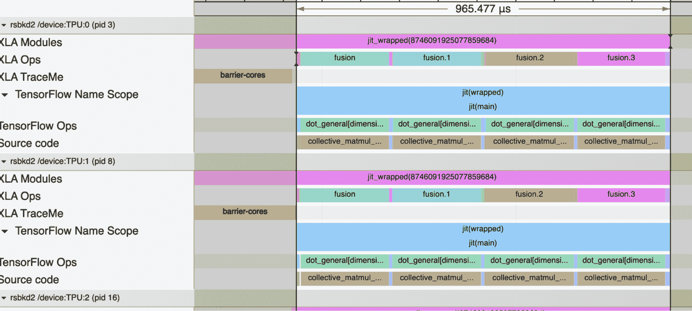
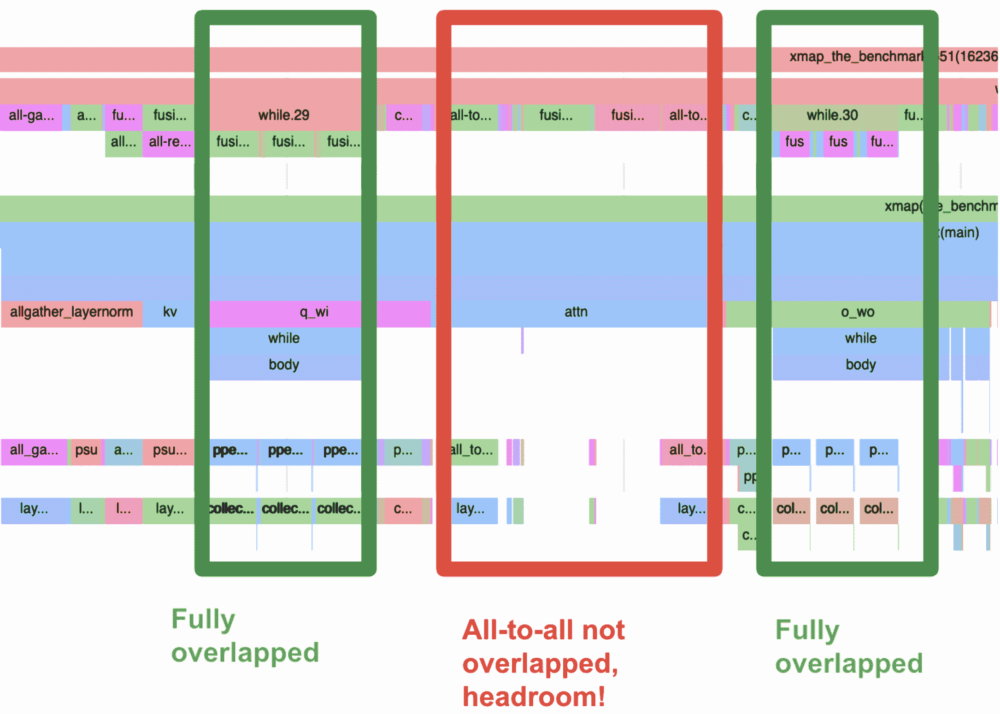

# `shmap`（shard_map）用于简单的每个设备代码

> 原文：[`jax.readthedocs.io/en/latest/jep/14273-shard-map.html`](https://jax.readthedocs.io/en/latest/jep/14273-shard-map.html)

*sholto@, sharadmv@, jekbradbury@, zhangqiaorjc@, mattjj@*

*2023 年 1 月*

## 动机

JAX 支持两种多设备编程的思路：

1.  **编译器，带我飞！** 让编译器自动在设备间分配大数组函数。

1.  **让我写我想表达的内容！** 给我每个设备的代码和显式的通信集合。

我们需要既出色的 API，而不是互斥的替代方案，它们需要相互组合。

通过`pjit`（现在是`jit`），我们拥有了[下一代 API](https://jax.readthedocs.io/en/latest/notebooks/Distributed_arrays_and_automatic_parallelization.html)来支持第一种思路。但是我们还没有完全升级第二种思路。`pmap`遵循第二种思路，但随着时间的推移，我们发现它存在致命缺陷。`xmap`解决了这些问题，但它并没有完全给我们提供每个设备的形状，并且还包含了其他几个重大的想法。同时，对于像在[高效扩展 Transformer 推理](https://arxiv.org/abs/2211.05102)中的每个设备显式集合编程的新需求也在不断涌现。

我们可以通过`shmap`升级第二种思路。`shmap`是：

+   一个简单的多设备并行 API，允许我们编写每个设备的代码，并且使用显式的集合操作，其中逻辑形状与每个设备的物理缓冲区形状匹配，并且集合操作正好对应于跨设备的通信；

+   一个`xmap`的特化，具有简化的功能和一些调整；

+   XLA SPMD 分区器的‘手动’模式的一个相当直接的表现；

+   一个好玩的 Seussian 名称，可以代表`shard_map`、`shpecialized_xmap`、`sholto_map`或`sharad_map`。

**对于`pjit`用户**，`shmap`是一个补充工具。它可以在`pjit`计算中使用，暂时切换到“手动集合”模式，就像是从编译器的自动分区中逃脱一样。这样，用户可以在大部分代码中享受到`pjit`的便利和熟悉的 NumPy 编程模型，同时在需要时使用`shmap`来手动优化集合通信。这是两全其美的解决方案！

**对于`pmap`用户**，`shmap`是一个严格的升级。它更加表达力强，性能更好，并且与其他 JAX API 可以良好组合，而不会使基本的批量数据并行化变得更加困难。

对于更多的实际使用情况，你可以跳转到[何时使用`shmap`和何时使用`pjit`](https://jax.readthedocs.io/en/latest/jep/14273-shard-map.html)？如果你想知道我们为什么需要一个全新的东西，或者`pmap`存在什么问题，可以跳到为什么`pmap`或`xmap`不能解决这个问题？或者继续阅读下一节，查看一些`shmap`示例和 API 规范。

## 所以，让我们看看`shmap`！

### TL;DR 示例（详细解释将在后续部分提供）

Sho shick：

```py
from functools import partial

import numpy as np

import jax
import jax.numpy as jnp
from jax.sharding import Mesh, PartitionSpec as P
from jax.experimental import mesh_utils
from jax.experimental.shard_map import shard_map

devices = mesh_utils.create_device_mesh((4, 2))
mesh = Mesh(devices, axis_names=('i', 'j'))

a = jnp.arange( 8 * 16.).reshape(8, 16)
b = jnp.arange(16 * 32.).reshape(16, 32)

@partial(shard_map, mesh=mesh, in_specs=(P('i', 'j'), P('j', None)),
         out_specs=P('i', None))
def matmul_basic(a_block, b_block):
  # a_block: f32[2, 8]
  # b_block: f32[8, 32]
  z_partialsum = jnp.dot(a_block, b_block)
  z_block = jax.lax.psum(z_partialsum, 'j')
  return z_block

c = matmul_basic(a, b)  # c: f32[8, 32] 
```

注意：

+   不需要嵌套（或`axis_index_groups`）来处理多个轴的并行性，不像`pmap`；

+   调用者中没有重塑，不像 `pmap` 和 hard-`xmap`，逻辑形状对应于每个设备的物理形状，不像（非硬）`xmap`；

+   通过使用 `mesh` 实现精确的设备放置控制，不像 `pmap`；

+   逻辑和物理轴名称只有一个集合，不像 `xmap`；

+   结果是一个可以有效传递给 `pjit` 的 `jax.Array`，不像 `pmap`；

+   此相同的代码在 `pjit`/`jit` 内部有效地工作，不像 `pmap`；

+   此代码以急切方式工作，因此我们可以在中间使用 `pdb` 并打印值，不像 `xmap` 的当前实现（尽管设计上 `xmap` 没有顺序安排也可以急切地工作）。

这里是另一种具有完全分片结果的矩阵乘法变体：

```py
@partial(shard_map, mesh=mesh, in_specs=(P('i', 'j'), P('j', None)),
         out_specs=P('i', 'j'))
def matmul_reduce_scatter(a_block, b_block):
  # c_partialsum: f32[8/X, 32]
  c_partialsum = jnp.matmul(a_block, b_block)
  # c_block: f32[8/X, 32/Y]
  c_block = jax.lax.psum_scatter(c_partialsum, 'j', scatter_dimension=1, tiled=True)
  return c_block

c = matmul_reduce_scatter(a, b) 
```

### 放慢速度，从基础知识开始！

#### 在数组轴上的降秩和保持秩的映射比较

我们可以将 `pmap`（和 `vmap` 和 `xmap`）视为沿轴解堆叠每个数组输入（例如，将 2D 矩阵解包成其 1D 行），对每个片段应用其体函数，并将结果堆叠在一起，至少在不涉及集合时是这样的：

```py
pmap(f, in_axes=[0], out_axes=0)(xs) == jnp.stack([f(x) for x in xs]) 
```

例如，如果 `xs` 的形状为 `f32[8,5]`，那么每个 `x` 的形状为 `f32[5]`，如果每个 `f(x)` 的形状为 `f32[3,7]`，那么最终堆叠的结果 `pmap(f)(xs)` 的形状为 `f32[8,3,7]`。也就是说，每次对体函数 `f` 的应用都比 `pmap(f)` 对应的参数少一个轴。我们可以说这些是*降秩映射*，输入/输出的解堆叠/堆叠。

`f` 的逻辑应用次数由被映射的输入轴的大小确定：例如，如果我们在大小为 8 的输入轴上进行映射，从语义上讲，我们得到函数的 8 次逻辑应用，这对于 `pmap` 总是对应于 8 个物理设备计算。

相反，`shmap` 没有这种降秩行为。相反，我们可以将其视为沿输入轴切片（或“非连接”）为块，应用体函数，并将结果再次连接在一起（在没有涉及集合时）：

```py
devices = np.array(jax.devices()[:4])
m = Mesh(devices, ('i',))  # mesh.shape['i'] = 4

shard_map(f, m, in_specs=P('i'), out_specs=P('i'))(y)
==
jnp.concatenate([f(y_blk) for y_blk in jnp.split(y, 4)]) 
```

请注意，`jnp.split` 将其输入切片成相同大小的块，因此如果在上述示例中 `y` 的形状为 `f32[8,5]`，那么每个 `y_blk` 的形状为 `f32[2,5]`，如果每个 `f(y_blk)` 的形状为 `f32[3,7]`，那么最终连接的结果 `shard_map(f, ...)(y)` 的形状为 `f32[12,7]`。因此 `shmap`（`shard_map`）映射其输入的分片或块。我们可以说它是一个*保持秩映射*，其输入/输出的解连接/连接。

`f` 的逻辑应用次数由网格大小确定，而不是任何输入轴大小：例如，如果我们有总大小为 4 的网格（即超过 4 个设备），那么从语义上讲，我们得到函数的 4 次逻辑应用，对应于 4 个物理设备计算它们。

#### 通过使用 `in_specs` 控制每个输入的切分（解连接）和平铺；

每个`in_specs`通过`PartitionSpec`标识了一些相应输入数组的轴，通过网格轴名称表示如何将该输入拆分（或取消连接）成应用主体函数的块。该标识确定了分片大小；当一个输入轴标识为一个网格轴时，输入沿该逻辑轴分割（取消连接）为与相应网格轴大小相等的多个部分。（如果相应网格轴大小不能整除输入数组轴大小，则会产生错误。）如果输入的`pspec`未提及网格轴名称，则在该网格轴上不会进行分割。例如:

```py
devices = np.array(jax.devices())
m = Mesh(devices.reshape(4, 2), ('i', 'j'))

@partial(shard_map, mesh=m, in_specs=P('i', None), out_specs=P('i', 'j'))
def f1(x_block):
  print(x_block.shape)
  return x_block

x1 = np.arange(12 * 12).reshape(12, 12)
y = f1(x1)  # prints (3,12) 
```

因为输入的`pspec`未提及网格轴名`'j'`，所以没有任何输入数组轴在该网格轴上进行分割；同样地，因为输入数组的第二轴未与任何网格轴标识（因此未在其上进行分割），`f1`的应用将完整查看该轴上的输入。

当输入的`pspec`中未提及网格轴时，我们总是可以重写为一个效率较低的程序，其中所有网格轴都被提及，但调用者执行`jnp.tile`，例如：

```py
@partial(shard_map, mesh=m, in_specs=P('i', 'j'), out_specs=P('i', 'j'))
def f2(x_block):
  print(x_block.shape)
  return x_block

x = np.arange(12 * 12).reshape(12, 12)
x_ = jnp.tile(x, (1, mesh.axis_size['j']))  # x_ has shape (12, 24)
y = f2(x_)  # prints (3,12), and f1(x) == f2(x_) 
```

换句话说，因为每个输入的`pspec`可以零次或一次提及每个网格轴名，而不必确切一次提及每个名字，所以我们可以说，除了其输入中内置的`jnp.split`，`shard_map`还具有一个内置的`jnp.tile`，至少在逻辑上是如此（尽管根据参数的物理分片布局，不一定需要在物理上执行平铺）。要使用的平铺方法不是唯一的；我们也可以沿着第一个轴平铺，并使用`P(('j', 'i'), None)`的`pspec`。

输入上的物理数据移动是可能的，因为每个设备都需要具有适当数据的副本。

#### 使用`out_specs`控制每个输出通过连接、块转置和使用`untiling`组装。

类似于输入端，每个`out_specs`通过名称将一些相应输出数组的轴标识为网格轴，表示如何将输出块（每个主体函数应用的一个或等效地每个物理设备的一个）组装回来以形成最终输出值。例如，在上述`f1`和`f2`示例中，`out_specs`表明我们应通过沿两个轴连接块结果来形成最终输出，从而在两种情况下得到形状为`(12,24)`的数组`y`。（如果主体函数的输出形状，即输出块形状，对应的输出`pspec`所描述的连接过程具有过小的秩，则会产生错误。）

当输出 pspec 中未提到网格轴名称时，它表示一个*未平铺*：当用户编写一个输出 pspec，其中未提到网格轴名称之一时，他们保证输出块在该网格轴上是相等的，因此在输出中仅使用该轴上的一个块（而不是沿该网格轴将所有块连接在一起）。例如，使用与上述相同的网格：

```py
x = jnp.array([[3.]])

z = shard_map(lambda: x, mesh=m, in_specs=(), out_specs=P('i', 'j'))()
print(z)  # prints the same as jnp.tile(x, (4, 2))

z = shard_map(lambda: x, mesh=m, in_specs=(), out_specs=P('i', None))()
print(z)  # prints the same as jnp.tile(x, (4, 1)), or just jnp.tile(x, (4,))

z = shard_map(lambda: x, mesh=m, in_specs=(), out_specs=P(None, None))()
print(z)  # prints the same as jnp.tile(x, (1, 1)), or just x 
```

注意，闭包在数组值上的主体函数等同于将其作为具有相应输入 pspec `P(None, None)` 的增广传递。作为另一个例子，更接近前面例子的另一个例子：

```py
@partial(shard_map, mesh=m, in_specs=P('i', 'j'), out_specs=P('i', None))
def f3(x_block):
  return jax.lax.psum(x_block, 'j')

x = np.arange(12 * 12).reshape(12, 12)
y3 = f3(x)
print(y3.shape)  # (12,6) 
```

注意，结果的第二个轴大小为 6，是输入第二个轴大小的一半。在这种情况下，通过在输出 pspec 中不提到网格轴名称 `'j'` 来表达的未平铺是安全的，因为集体 `psum` 确保每个输出块在相应的网格轴上是相等的。以下是另外两个例子，其中我们变化了在输出 pspec 中提到的网格轴：

```py
@partial(shard_map, mesh=m, in_specs=P('i', 'j'), out_specs=P(None, 'j'))
def f4(x_block):
  return jax.lax.psum(x_block, 'i')

x = np.arange(12 * 12).reshape(12, 12)
y4 = f4(x)
print(y4.shape)  # (3,12)

@partial(shard_map, mesh=m, in_specs=P('i', 'j'), out_specs=P(None, None))
def f5(x_block):
  return jax.lax.psum(x_block, ('i', 'j'))

y5 = f5(x)
print(y5.shape)  # (3,6) 
```

在物理方面，未在输出 pspec 中提到网格轴名称会从输出设备缓冲区组装一个 `Array`，在该网格轴上具有复制的布局。

没有运行时检查输出块实际上是否沿网格轴相等以进行未平铺，或者等效地说，相应的物理缓冲区是否具有相等的值，因此可以解释为单个逻辑数组的复制布局。但我们可以提供一个静态检查机制，在所有潜在不正确的程序上引发错误。

因为 `out_specs` 可以提到网格轴名称零次或一次，并且它们可以以任意顺序提到，所以我们可以说，除了其输出中内置的 `jnp.concatenate` 外，`shard_map` 还包含一个未平铺和一个块转置。

在输出上不可能进行物理数据移动，无论输出 pspec 如何。相反，`out_specs` 只是编码如何将块输出组装成 `Array`，或者物理上如何将缓冲区解释为单个逻辑 `Array` 的物理布局。

### API 规范

```py
from jax.sharding import Mesh
Specs = PyTree[PartitionSpec]

def shard_map(f: Callable, mesh: Mesh, in_specs: Specs, out_specs: Specs
          ) -> Callable:
  ... 
```

其中：

+   `mesh` 编码设备按照数组排列，并且具有相关联的轴名称，就像对 `xmap` 和 `sharding.NamedSharding` 也是如此；

+   `in_specs` 和 `out_specs` 是 `PartitionSpec`，它们可以[仿射地](https://en.wikipedia.org/wiki/Substructural_type_system)提到 `mesh` 中的轴名称（不像 `xmap` 中的分开的逻辑名称）来表示输入和输出的切片/非拼接和拼接，分别（不像 `pmap` 和 `xmap` 那样的解包和堆叠），未提到的名称对应于复制和未平铺（断言已复制，因此给我一个副本）；

+   传递给`f`的参数的形状与传递给`shard_map`-of-`f`的参数的形状相同（不像`pmap`和`xmap`，其中形状被降低），而且参数传递给`f`的形状是从对应于`shard_map`-of-`f`的形状`shape`和相应的`PartitionSpec` spec 计算得到的，大致为`tuple(sz // (1 if n is None else mesh.shape[n]) for sz, n in zip(shape, spec))`；

+   函数`f`的主体可以使用来自`mesh`的名称应用收集操作。

`shmap`默认是急切的，这意味着我们逐个原语地调度计算，使用户能够在完全复制的值上使用 Python 控制流和交互式`pdb`调试以打印任何值。要将`shmap`函数进行阶段输出并进行端到端编译，只需在其周围放置一个`jit`。一个结果是，`shmap`没有像当前的`xmap`和`pmap`那样有其自己的调度和编译路径；它只是`jit`路径的一部分。

当它被例如封闭的`jit`阶段输出时，将`shmap`降低到 StableHLO 是微不足道的：它仅涉及切换到输入的“手动 SPMD 模式”，并在输出上切换回来。（我们目前不计划支持部分手动部分自动模式。）

与效果的交互与`pmap`的交互相同。

与自动微分的交互也与`pmap`类似（而不是尝试`xmap`所做的新语义，对应于具有未映射中间变量的`grad`的`reduce_axes`以及使`psum`转置为`pbroadcast`而不是`psum`）。但是它因此继承了来自`pmap`的一个未解决的问题：在某些情况下，将后向传播的`psum`移动到后向传播的其他位置，利用线性特性，而不是将`psum`转置为`psum`，从而执行与前向传播`psum`对应的后向传播`psum`，这可能是有益的。许多高级的`pmap`用户通过使用`custom_vjp`来实现`psum_idrev`和`id_psumrev`函数来解决这一挑战，但由于很容易意外地使其失衡，这种技术是有风险的。我们对如何以更安全的方式提供此功能有一些想法。

## 何时应该使用`shmap`，何时应该使用`pjit`？

一种哲学是：在`jit==pjit`中编写程序通常更简单 —— 但是如果程序的某个部分的优化程度不如编译器可能的话，就使用`shmap`！

### 一个现实的变换器示例

实际上，我们可以使用 30 行 Python 实现简单版本的[“集体矩阵乘法”](https://dl.acm.org/doi/pdf/10.1145/3567955.3567959)算法，该算法最近在 XLA 中引入，以重叠通信和计算使用`shmap`。算法的基本思想可以通过一个简单的例子掌握。

假设我们想要计算`C = A @ B`，其中`A`由第 0 维的 1D 网格分片，而`B`和`C`是复制的。

```py
M, K, N = 4096, 2048, 1024
A = jnp.arange(np.prod((M, K))).reshape((M, K))
B = jnp.arange(np.prod((K, N))).reshape((K, N))

mesh = Mesh(np.array(jax.devices()), axis_names=('i'))
A_x = jax.device_put(A, NamedSharding(mesh, P('i', None)))

@jax.jit
def f(lhs, rhs):
  return lhs @ rhs

C = f(A_x, B) 
```

配置文件显示了在矩阵乘法开始之前，所有设备上的阻塞全收集。这是次优的，因为`A`在非收缩维上被分片，每个`A`的分片可以独立地与`B`进行矩阵乘法，并且这种分块计算可以与从另一设备获取下一个`A`分片重叠。


这种重叠可以通过`shmap`和显式集体来实现。

```py
def collective_matmul_allgather_lhs_non_contracting(lhs, rhs):
  # lhs is the looped operand; rhs is the local operand
  axis_size = jax.lax.psum(1, axis_name='i')
  axis_index = jax.lax.axis_index(axis_name='i')
  chunk_size = lhs.shape[0]

  def f(i, carrys):
    accum, lhs = carrys
    # matmul for a chunk
    update = lhs @ rhs
    # circular shift to the left
    lhs = jax.lax.ppermute(
        lhs,
        axis_name='i',
        perm=[(j, (j - 1) % axis_size) for j in range(axis_size)]
    )
    # device 0 computes chunks 0, 1, ...
    # device 1 computes chunks 1, 2, ...
    update_index = (((axis_index + i) % axis_size) * chunk_size, 0)
    accum = jax.lax.dynamic_update_slice(accum, update, update_index)
    return accum, lhs

  accum = jnp.zeros((lhs.shape[0] * axis_size, rhs.shape[1]), dtype=lhs.dtype)
  # fori_loop cause a crash: hlo_sharding.cc:817 Check failed: !IsManual()
  # accum, lhs = jax.lax.fori_loop(0, axis_size - 1, f, (accum, lhs))
  for i in range(0, axis_size - 1):
    accum, lhs = f(i, (accum, lhs))

  # compute the last chunk, without the ppermute
  update = lhs @ rhs
  i = axis_size - 1
  update_index = (((axis_index + i) % axis_size) * chunk_size, 0)
  accum = jax.lax.dynamic_update_slice(accum, update, update_index)

  return accum 
```

```py
jit_sharded_f = jax.jit(shard_map(
  collective_matmul_allgather_lhs_non_contracting, mesh,
  in_specs=(P('i', None), P()), out_specs=P()))
C = jit_sharded_f(A_x, B) 
```

一个配置文件显示，全收集消失了，并且用异步集体置换的重叠矩阵乘法替换。此配置文件与集体矩阵乘法论文结果非常接近。



这种集体矩阵乘法技术可以用于加速变压器层中的前馈块。这通常包括两个矩阵乘法，后跟一个`ReduceScatter`（用于解决并行矩阵乘法的部分和）和前导的`AllGather`（用于沿某些轴收集分片维度并允许部分和计算）。在一起，一层的`ReduceScatter`和下一层的`AllGather`相当于一个`AllReduce`。

在典型配置文件中，两个矩阵乘法后将跟随一个`AllReduce`，它们不会重叠。集体矩阵乘法可以用来实现重叠，但很难触发，具有最小切片大小，并且尚未涵盖所有拓扑结构、张量形状和集体矩阵乘法的变体（即延迟和吞吐量优化的变体）。[在最近的一篇论文中](https://arxiv.org/abs/2211.05102)，我们发现，在许多情况下，通过手动实现集体矩阵乘法变体，可以获得约 40%的增益，类似于`shmap`风格。

但这并不总是更复杂！我们预计这将是一种更自然的管道计算方式，计划很快进行一些演示！

### 另一个现实例子

这里展示了`shmap`在变换器层传递中的样子，采用了 2D 权重收集模式（[论文](https://arxiv.org/abs/2211.05102)，第 3.2.3 节，第 5 页）：

```py
def matmul_2D_wg_manual(xnorm, q_wi, layer):
  '''Calls a custom manual implementation of matmul_reducescatter'''
  # [batch, maxlen, embed.X] @ [heads.YZ, embed.X, q_wi_per_head]
  # -> (matmul)
  # -> [batch, maxlen, heads.YZ, q_wi_per_head]{x unreduced}
  # -> (reducescatter over x into X heads, B batches)
  # -> [batch, maxlen, heads.YZX, q_wi_per_head]
  with jax.named_scope('q_wi'):
    xnorm = intermediate_dtype(xnorm)
    q_wi = matmul_reducescatter(
        'bte,hed->bthd',
        xnorm,
        params.q_wi,
        scatter_dimension=(0, 2),
        axis_name='i',
        layer=layer)
   return q_wi

import partitioning.logical_to_physical as l2phys

def pjit_transformer_layer(
    hparams: HParams, layer: int, params: weights.Layer, sin: jnp.ndarray,
    cos: jnp.ndarray, kv_caches: Sequence[attention.KVCache],
    x: jnp.ndarray) -> Tuple[jnp.ndarray, jnp.ndarray, jnp.ndarray]:
  """Forward pass through a single layer, returning output, K, V."""

  def my_layer(t, axis=0):
  """Gets the parameters corresponding to a given layer."""
    return lax.dynamic_index_in_dim(t, layer, axis=axis, keepdims=False)

  # 2D: [batch.Z, time, embed.XY]
  x = _with_sharding_constraint(
      x, ('residual_batch', 'residual_time', 'residual_embed'))
  xnorm = _layernorm(x)
  # 2D: [batch, time, embed.X]
  xnorm = _with_sharding_constraint(
      xnorm, ('post_norm_batch', 'time', 'post_norm_embed'))
  # jump into manual mode where you want to optimise
  if manual:
    q_wi = shard_map(matmul_2D_wg_manual, mesh
                in_specs=(l2phys('post_norm_batch', 'time', 'post_norm_embed'),
                          l2phys('layers', 'heads', 'embed', 'q_wi_per_head')),
                out_specs=l2phys('post_norm_batch', 'time', 'heads', 'q_wi_per_head'))(xnorm, q_wi, layer)
  else:
    q_wi = jnp.einsum('bte,hed->bthd', xnorm, my_layer(params.q_wi))
    # 2D: [batch, time, heads.YZX, None]
    q_wi = _with_sharding_constraint(q_wi,
                                   ('post_norm_batch', 'time', 'heads', 'qkv'))
  q = q_wi[:, :, :, :hparams.qkv]
  q = _rope(sin, cos, q)
  # unlike in https://arxiv.org/pdf/2002.05202.pdf, PaLM implements
  # swiGLU with full d_ff dimension, rather than 2/3 scaled
  wi0 = q_wi[:, :, :, hparams.qkv:hparams.qkv + (hparams.ff // hparams.heads)]
  wi1 = q_wi[:, :, :, hparams.qkv + (hparams.ff // hparams.heads):]
  kv = jnp.einsum('bte,ezd->btzd', xnorm, my_layer(params.kv))
  k = kv[:, :, 0, :hparams.qkv]
  v = kv[:, :, 0, hparams.qkv:]
  k = _rope(sin, cos, k)

  y_att = jnp.bfloat16(attention.attend(q, k, v, kv_caches, layer))

  y_mlp = special2.swish2(wi0) * wi1
  # 2D: [batch, time, heads.YZX, None]
  y_mlp = _with_sharding_constraint(y_mlp,
                                    ('post_norm_batch', 'time', 'heads', None))

  y_fused = jnp.concatenate([y_att, y_mlp], axis=-1)
  # do the second half of the mlp and the self-attn projection in parallel
  y_out = jnp.einsum('bthd,hde->bte', y_fused, my_layer(params.o_wo))
  # 2D: [batch.Z, time, embed.XY]
  y_out = _with_sharding_constraint(
      y_out, ('residual_batch', 'residual_time', 'residual_embed'))
  z = y_out + x
  z = _with_sharding_constraint(
      z, ('residual_batch', 'residual_time', 'residual_embed'))
  return z, k, v 
```

在下面的配置文件中，第一和第二个矩阵乘法都被手动降低版本替换，计算（融合）完全与通信（ppermute）重叠！一个有趣的提示是，我们使用的是延迟优化变体，因此 ppmerute 像素是抖动的 — 因为同时使用两个重叠的 ppermute，使用相反的 ICI 轴！

全对全的重叠要困难得多，因此被搁置了。



## 为什么`pmap`或`xmap`还没有解决这个问题？

`pmap`是我们的第一个多设备并行性 API。它遵循每设备代码和显式集体的学派。但它存在重大缺陷，使其不适用于今天的程序：

+   **映射多个轴需要嵌套 `pmap`。** 不仅嵌套 `pmap` 写起来麻烦，而且很难控制（甚至预测）数据和计算的设备放置，也很难保留数据分片（参见接下来的两个子弹）。如今的程序需要多个轴的并行处理。

+   **无法控制设备放置。** 特别是在多轴并行处理时，程序员需要控制这些轴如何与硬件资源及其通信拓扑对齐。但（嵌套）`pmap` 不提供如何在硬件上放置映射程序实例的控制；用户只能使用自动设备顺序，无法控制它。([Gopher](https://arxiv.org/abs/2112.11446) 使用 `axis_index_groups` 和单个未嵌套的 `pmap` 基本上是一种通过将多个并行轴压缩为一个轴来绕过此问题的方法。)

+   **`jit`/`pjit` 可组合性。** `jit`-of-`pmap` 是一个性能陷阱，像是嵌套 `pmap`、例如 `scan`-of-`pmap` 一样，因为从内部 `pmap` 返回时未能保留分片。要保留分片，我们需要在 jaxprs 上进行模式匹配，以确保我们正在处理完全嵌套的 pmaps，或者在 `jit` 内部只有一个 pmap。此外，`pjit` 无助于此处，因为 `pmap` 面向 XLA 副本，而 `pjit` 则面向 XLA SPMD Partitioner，这两者的组合很困难。

+   **`jax.Array` 兼容性（因此 `pjit` 兼容性）。** 由于 `pmap` 输出的分片不能表示为 `Shardings` / `OpShardings`，因为 `pmap` 使用的是堆叠而不是连接语义，所以目前无法将 `pmap` 计算的输出直接传递给 `pjit` 计算，而需要经过主机反弹（或调度重塑计算）。

+   **多控制器语义（因此 `pjit` 兼容性）。** 多控制器 `pmap` 在控制器间连接值，这很有效，但与单控制器 `pmap` 的堆叠语义不同。更实际地说，它排除了与多控制器 `pjit` 一起使用的非完全可寻址 `jax.Array` 输入和输出的可能性。

+   **急切模式。** 我们没有将 `pmap` 设计为急切模式，尽管最终（四年多后！）通过 `disable_jit()` 添加了急切操作，但事实上 `pmap` 中融入了 `jit` 意味着它有自己的编译和调度路径（实际上有两个调度路径：Python 处理 `Tracer`，以及 C++ 处理原始 `Array` 输入！），这是一个沉重的实现负担。

+   **调用方需要重塑。** 在 8 个设备上使用 `pmap` 的典型用例可能看起来是从大小为 128 的批处理轴开始，将其重塑为大小为 (8, 16) 的两个轴，然后在第一个轴上进行 `pmap`。这些重塑是笨拙的，编译器通常将它们解释为复制而不是视图，增加了内存和时间的使用。

这些缺点在仅进行批量数据并行时并不算太糟糕。但是当涉及更多并行处理时，`pmap` 就显得力不从心！

`xmap`作为`pmap`的下一代演进铺平了道路并解决了（几乎）所有这些问题。`shmap`则沿着`xmap`的步伐前行，并以基本相同的方式解决了这些问题；实际上，`shmap`就像是`xmap`的一个专门子集（有些人称之为“硬`xmap`”子集），只是稍作调整。

对于初始原型，我们选择将`shmap`实现为与`xmap`分离的单独原语，因为限制它支持的功能集使得更容易专注于核心功能。例如，`shmap`不允许未映射的中间值，这样就更容易不用担心命名轴与自动微分之间的交互。此外，不需要考虑所有功能对之间的交互使得可以更容易地添加超出当前`xmap`实现的功能，比如支持急切模式。

`shmap`和`xmap`都共享降低代码的重要部分。未来我们可以考虑合并两者，或者甚至完全专注于`shmap`，这取决于使用方式的演变。
