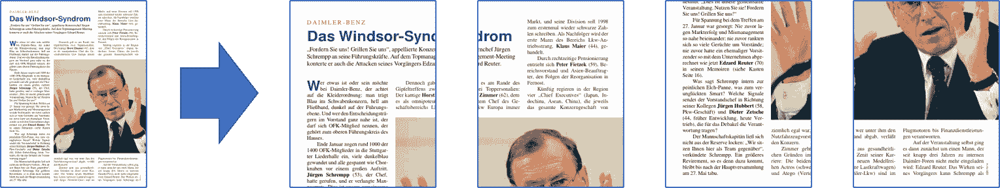
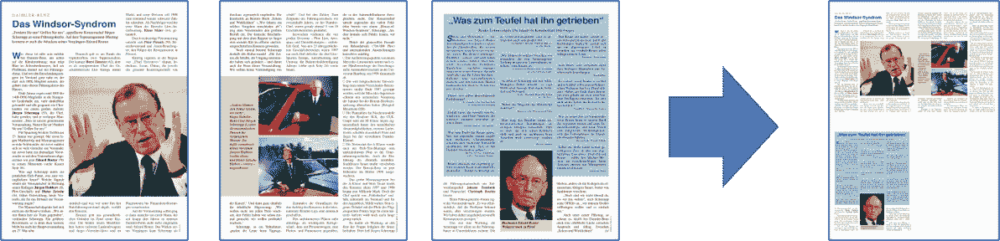
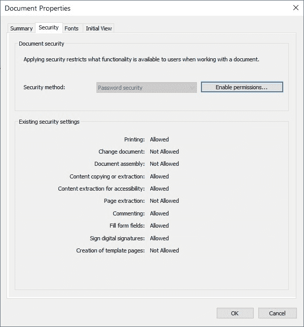

# 基础知识

> 原文：[`pymupdf.readthedocs.io/en/latest/the-basics.html`](https://pymupdf.readthedocs.io/en/latest/the-basics.html)

## 打开文件

要打开文件，请执行以下操作：

```py
import pymupdf

doc = pymupdf.open("a.pdf") # open a document 
```

注意

**深入了解**

请参阅 supported file types 和如何打开文件指南了解更多高级选项。

* * *  ## 从 PDF 中提取文本

要从 PDF 文件中提取所有文本，请执行以下操作：

```py
import pymupdf

doc = pymupdf.open("a.pdf") # open a document
out = open("output.txt", "wb") # create a text output
for page in doc: # iterate the document pages
    text = page.get_text().encode("utf8") # get plain text (is in UTF-8)
    out.write(text) # write text of page
    out.write(bytes((12,))) # write page delimiter (form feed 0x0C)
out.close() 
```

当然，不仅 PDF 可以提取文本 - 所有 supported document file formats 如 MOBI、EPUB、TXT 等都可以提取其文本。

注意

**深入了解**

如果您的文档包含基于图像的文本内容，则在页面上使用 OCR 进行后续文本提取：

```py
tp = page.get_textpage_ocr()
text = page.get_text(textpage=tp) 
```

有许多其他示例可以解释如何从特定区域提取文本或从文档中提取表格。请参阅文本操作指南。

现在您也可以以 Markdown 格式提取文本了提取文本。

**API 参考**

+   `Page.get_text()`

* * *  ## 从 PDF 中提取图像

要从 PDF 文件中提取所有图像，请执行以下操作：

```py
import pymupdf

doc = pymupdf.open("test.pdf") # open a document

for page_index in range(len(doc)): # iterate over pdf pages
    page = doc[page_index] # get the page
    image_list = page.get_images()

    # print the number of images found on the page
    if image_list:
        print(f"Found {len(image_list)} images on page {page_index}")
    else:
        print("No images found on page", page_index)

    for image_index, img in enumerate(image_list, start=1): # enumerate the image list
        xref = img[0] # get the XREF of the image
        pix = pymupdf.Pixmap(doc, xref) # create a Pixmap

        if pix.n - pix.alpha > 3: # CMYK: convert to RGB first
            pix = pymupdf.Pixmap(pymupdf.csRGB, pix)

        pix.save("page_%s-image_%s.png" % (page_index, image_index)) # save the image as png
        pix = None 
```

注意

**深入了解**

有许多其他示例可以解释如何从特定区域提取文本或从文档中提取表格。请参阅文本操作指南。

**API 参考**

+   `Page.get_images()`

+   Pixmap  ## 提取矢量图形

要从文档页面提取所有矢量图形，请执行以下操作：

```py
doc = pymupdf.open("some.file")
page = doc[0]
paths = page.get_drawings() 
```

这将返回在页面上找到的任何矢量图形的路径字典。

注意

**深入了解**

请参阅：如何提取绘图。

**API 参考**

+   `Page.get_drawings()`

* * *  ## 合并 PDF 文件

要合并 PDF 文件，请执行以下操作：

```py
import pymupdf

doc_a = pymupdf.open("a.pdf") # open the 1st document
doc_b = pymupdf.open("b.pdf") # open the 2nd document

doc_a.insert_pdf(doc_b) # merge the docs
doc_a.save("a+b.pdf") # save the merged document with a new filename 
```

### 使用其他类型文件合并 PDF 文件

使用`Document.insert_file()`方法来合并 supported files 与 PDF。例如：

```py
import pymupdf

doc_a = pymupdf.open("a.pdf") # open the 1st document
doc_b = pymupdf.open("b.svg") # open the 2nd document

doc_a.insert_file(doc_b) # merge the docs
doc_a.save("a+b.pdf") # save the merged document with a new filename 
```

注意

**深入了解**

使用`Document.insert_pdf()` & `Document.insert_file()`很容易合并 PDF。通过打开的 PDF 文档，您可以从一个文档复制页面范围到另一个文档。您可以选择复制页面的位置，可以恢复页面顺序，还可以更改页面旋转。这篇维基[文章](https://github.com/pymupdf/PyMuPDF/wiki/Inserting-Pages-from-other-PDFs)包含了详细说明。

GUI 脚本[join.py](https://github.com/pymupdf/PyMuPDF-Utilities/blob/master/examples/join-documents/join.py)使用此方法合并文件列表，同时还合并了相应的目录段。看起来像这样：


**API 参考**

+   `Document.insert_pdf()`

+   `Document.insert_file()`

* * *

## 使用坐标工作

使用**PyMuPDF**时，有一个*数学术语*您应该熟悉 - **“坐标”**。请快速查看坐标部分，了解坐标系统，以帮助您定位对象并了解文档空间。

* * *

## 给 PDF 添加水印

要向 PDF 文件添加水印，请执行以下操作：

```py
import pymupdf

doc = pymupdf.open("document.pdf") # open a document

for page_index in range(len(doc)): # iterate over pdf pages
    page = doc[page_index] # get the page

    # insert an image watermark from a file name to fit the page bounds
    page.insert_image(page.bound(),filename="watermark.png", overlay=False)

doc.save("watermarked-document.pdf") # save the document with a new filename 
```

注意

**深入了解**

添加水印本质上就是在每个 PDF 页面底部添加一个图像。您应确保图像具有所需的不透明度和纵横比，使其看起来符合您的需求。

在上述示例中，每个文件引用都创建了一个新图像，但为了更高效（节省内存和文件大小），应该仅引用此图像数据一次 - 有关实现，请参阅`Page.insert_image()`的代码示例和解释。

**API 参考**

+   `Page.bound()`

+   `Page.insert_image()`

* * *  ## 向 PDF 添加图像

要向 PDF 文件添加图像，例如标志，请执行以下操作：

```py
import pymupdf

doc = pymupdf.open("document.pdf") # open a document

for page_index in range(len(doc)): # iterate over pdf pages
    page = doc[page_index] # get the page

    # insert an image logo from a file name at the top left of the document
    page.insert_image(pymupdf.Rect(0,0,50,50),filename="my-logo.png")

doc.save("logo-document.pdf") # save the document with a new filename 
```

注意

**深入了解**

就像水印示例一样，如果可能，应确保通过仅引用一次图像来提高性能 - 有关实现，请参阅`Page.insert_image()`的代码示例和解释。

**API 参考**

+   矩形

+   `Page.insert_image()`

* * *  ## 旋转 PDF

要向页面添加旋转，请执行以下操作：

```py
import pymupdf

doc = pymupdf.open("test.pdf") # open document
page = doc[0] # get the 1st page of the document
page.set_rotation(90) # rotate the page
doc.save("rotated-page-1.pdf") 
```

注意

**API 参考**

+   `Page.set_rotation()`

* * *  ## 裁剪 PDF

要将页面裁剪为定义的矩形，请执行以下操作：

```py
import pymupdf

doc = pymupdf.open("test.pdf") # open document
page = doc[0] # get the 1st page of the document
page.set_cropbox(pymupdf.Rect(100, 100, 400, 400)) # set a cropbox for the page
doc.save("cropped-page-1.pdf") 
```

注意

**API 参考**

+   `Page.set_cropbox()`

* * *  ## 附加文件

要向页面附加另一个文件，请执行以下操作：

```py
import pymupdf

doc = pymupdf.open("test.pdf") # open main document
attachment = pymupdf.open("my-attachment.pdf") # open document you want to attach

page = doc[0] # get the 1st page of the document
point = pymupdf.Point(100, 100) # create the point where you want to add the attachment
attachment_data = attachment.tobytes() # get the document byte data as a buffer

# add the file annotation with the point, data and the file name
file_annotation = page.add_file_annot(point, attachment_data, "attachment.pdf")

doc.save("document-with-attachment.pdf") # save the document 
```

注意

**深入了解**

使用`Page.add_file_annot()`添加文件时，请注意`filename`的第三个参数应包括实际的文件扩展名。如果没有这个，附件可能无法被识别为可以打开的内容。例如，如果`filename`只是“附件”，则在查看生成的 PDF 并尝试打开附件时可能会出现错误。但是，使用“附件.pdf”则可以被 PDF 查看器识别并打开为有效的文件类型。

附件的默认图标默认是“推销钉”，但您可以通过设置`icon`参数来更改它。

**API 参考**

+   点

+   `Document.tobytes()`

+   `Page.add_file_annot()`

* * *  ## 嵌入文件

要将文件嵌入文档中，请执行以下操作：

```py
import pymupdf

doc = pymupdf.open("test.pdf") # open main document
embedded_doc = pymupdf.open("my-embed.pdf") # open document you want to embed

embedded_data = embedded_doc.tobytes() # get the document byte data as a buffer

# embed with the file name and the data
doc.embfile_add("my-embedded_file.pdf", embedded_data)

doc.save("document-with-embed.pdf") # save the document 
```

注意

**进一步进行**

就像附加文件时，使用`Document.embfile_add()`添加文件时，请注意`filename`的第一个参数应包括实际的文件扩展名。

**API 参考**

+   `Document.tobytes()`

+   `Document.embfile_add()`

* * *  ## 删除页面

要从文档中删除页面，请执行以下操作：

```py
import pymupdf

doc = pymupdf.open("test.pdf") # open a document
doc.delete_page(0) # delete the 1st page of the document
doc.save("test-deleted-page-one.pdf") # save the document 
```

要从文档中删除多个页面，请执行以下操作：

```py
import pymupdf

doc = pymupdf.open("test.pdf") # open a document
doc.delete_pages(from_page=9, to_page=14) # delete a page range from the document
doc.save("test-deleted-pages.pdf") # save the document 
```

### 如果删除书签或超链接引用的页面会发生什么？

+   书签（目录中的条目）将变为无效，并且将不再导航到任何页面。

+   超链接将从包含它的页面中删除。该页面上的可见内容不会以任何方式改变。

注意

**进一步进行**

页面索引是从零开始的，因此要删除文档的第 10 页，您应该执行以下操作 `doc.delete_page(9)`。

类似地，`doc.delete_pages(from_page=9, to_page=14)` 将删除第 10 页至第 15 页（包括第 10 页）。

**API 参考**

+   `Document.delete_page()`

+   `Document.delete_pages()`

* * *  ## 重新排列页面

要更改页面顺序，即重新排列页面，请执行以下操作：

```py
import pymupdf

doc = pymupdf.open("test.pdf") # open a document
doc.move_page(1,0) # move the 2nd page of the document to the start of the document
doc.save("test-page-moved.pdf") # save the document 
```

注意

**API 参考**

+   `Document.move_page()`

* * *  ## 复制页面

要复制页面，请执行以下操作：

```py
import pymupdf

doc = pymupdf.open("test.pdf") # open a document
doc.copy_page(0) # copy the 1st page and puts it at the end of the document
doc.save("test-page-copied.pdf") # save the document 
```

注意

**API 参考**

+   `Document.copy_page()`

* * *  ## 选择页面

要选择页面，请执行以下操作：

```py
import pymupdf

doc = pymupdf.open("test.pdf") # open a document
doc.select([0, 1]) # select the 1st & 2nd page of the document
doc.save("just-page-one-and-two.pdf") # save the document 
```

注意

**进一步进行**

使用 PyMuPDF，您可以复制、移动、删除或重新排列 PDF 页面的所有选项。存在直观的方法，允许您在页面级别上执行此操作，例如`Document.copy_page()`方法。

或者您可以准备一个完整的新页面布局，形式为 Python 序列，其中包含您想要的页码、您想要的顺序以及每个页面想要的次数。以下可能说明了可以使用`Document.select()`做什么。

```py
doc.select([1, 1, 1, 5, 4, 9, 9, 9, 0, 2, 2, 2]) 
```

现在让我们为双面打印准备一个 PDF（在不直接支持此功能的打印机上）：

页面数量由`len(doc)`给出（等同于`doc.page_count`）。以下列表分别表示偶数页和奇数页的页码：

```py
p_even = [p in range(doc.page_count) if p % 2 == 0]
p_odd  = [p in range(doc.page_count) if p % 2 == 1] 
```

此代码片段创建相应的子文档，然后可以用于打印文档：

```py
doc.select(p_even) # only the even pages left over
doc.save("even.pdf") # save the "even" PDF
doc.close() # recycle the file
doc = pymupdf.open(doc.name) # re-open
doc.select(p_odd) # and do the same with the odd pages
doc.save("odd.pdf") 
```

欲了解更多信息，请查看此 Wiki [文章](https://github.com/pymupdf/PyMuPDF/wiki/Rearranging-Pages-of-a-PDF)。

以下示例将颠倒所有页面的顺序（**极快：** Adobe PDF 参考手册的 756 页在几秒钟内完成）：

```py
lastPage = doc.page_count - 1
for i in range(lastPage):
    doc.move_page(lastPage, i) # move current last page to the front 
```

此代码片段将 PDF 与其自身复制，以便包含页面*0, 1, …, n, 0, 1, …, n* **（非常快且几乎不增加文件大小！）**：

```py
page_count = len(doc)
for i in range(page_count):
    doc.copy_page(i) # copy this page to after last page 
```

**API 参考**

+   `Document.select()`

* * *  ## 添加空白页

要添加空白页，请执行以下操作：

```py
import pymupdf

doc = pymupdf.open(...) # some new or existing PDF document
page = doc.new_page(-1, # insertion point: end of document
                    width = 595, # page dimension: A4 portrait
                    height = 842)
doc.save("doc-with-new-blank-page.pdf") # save the document 
```

注意

**进一步了解**

使用此方法创建具有预定义纸张格式的页面：

```py
w, h = pymupdf.paper_size("letter-l")  # 'Letter' landscape
page = doc.new_page(width = w, height = h) 
```

便捷函数`paper_size()`了解超过 40 种行业标准纸张格式供选择。要查看它们，请检查字典`paperSizes`。将所需的字典键传递给`paper_size()`以检索纸张尺寸。支持大小写。如果在格式名称后附加“-L”，则返回横向版本。

这里是一个三行代码，创建了一个带有一个空白页的 PDF。文件大小为 460 字节：

```py
doc = pymupdf.open()
doc.new_page()
doc.save("A4.pdf") 
```

**API 参考**

+   `Document.new_page()`

+   `paperSizes`

* * *  ## 插入带文本内容的页面

使用`Document.insert_page()`方法也会插入新页面，并接受相同的`width`和`height`参数。但它还允许您将任意文本插入新页面，并返回插入的行数。

```py
import pymupdf

doc = pymupdf.open(...)  # some new or existing PDF document
n = doc.insert_page(-1, # default insertion point
                    text = "The quick brown fox jumped over the lazy dog",
                    fontsize = 11,
                    width = 595,
                    height = 842,
                    fontname = "Helvetica", # default font
                    fontfile = None, # any font file name
                    color = (0, 0, 0)) # text color (RGB) 
```

注意

**进一步了解**

文本参数可以是（序列的）字符串（假定 UTF-8 编码）。插入将从 Point（50, 72）开始，这是距离页面顶部一英寸下方并距左侧 50 点。返回插入的文本行数。

**API 参考**

+   `Document.insert_page()`

* * *  ## 分割单页

这涉及将 PDF 页面分割成任意大小的片段。例如，您可能有一个以*Letter*格式的 PDF 页面，您希望以四倍放大率打印：每个页面分割成 4 个片段，每个片段再放到*Letter*格式的单独 PDF 页面中。

```py
import pymupdf

src = pymupdf.open("test.pdf")
doc = pymupdf.open()  # empty output PDF

for spage in src:  # for each page in input
    r = spage.rect  # input page rectangle
    d = pymupdf.Rect(spage.cropbox_position,  # CropBox displacement if not
                  spage.cropbox_position)  # starting at (0, 0)
    #--------------------------------------------------------------------------
    # example: cut input page into 2 x 2 parts
    #--------------------------------------------------------------------------
    r1 = r / 2  # top left rect
    r2 = r1 + (r1.width, 0, r1.width, 0)  # top right rect
    r3 = r1 + (0, r1.height, 0, r1.height)  # bottom left rect
    r4 = pymupdf.Rect(r1.br, r.br)  # bottom right rect
    rect_list = [r1, r2, r3, r4]  # put them in a list

    for rx in rect_list:  # run thru rect list
        rx += d  # add the CropBox displacement
        page = doc.new_page(-1,  # new output page with rx dimensions
                           width = rx.width,
                           height = rx.height)
        page.show_pdf_page(
                page.rect,  # fill all new page with the image
                src,  # input document
                spage.number,  # input page number
                clip = rx,  # which part to use of input page
            )

# that's it, save output file
doc.save("poster-" + src.name,
         garbage=3,  # eliminate duplicate objects
         deflate=True,  # compress stuff where possible
) 
```

示例：



注意

**API 参考**

+   `Page.cropbox_position()`

+   `Page.show_pdf_page()`

* * *  ## 合并单页

这涉及将 PDF 页面合并以形成一个新的 PDF，其中每个页面组合两个或四个原始页面（也称为“2-up”，“4-up”等）。这可以用来创建小册子或类似缩略图的概览。

```py
import pymupdf

src = pymupdf.open("test.pdf")
doc = pymupdf.open()  # empty output PDF

width, height = pymupdf.paper_size("a4")  # A4 portrait output page format
r = pymupdf.Rect(0, 0, width, height)

# define the 4 rectangles per page
r1 = r / 2  # top left rect
r2 = r1 + (r1.width, 0, r1.width, 0)  # top right
r3 = r1 + (0, r1.height, 0, r1.height)  # bottom left
r4 = pymupdf.Rect(r1.br, r.br)  # bottom right

# put them in a list
r_tab = [r1, r2, r3, r4]

# now copy input pages to output
for spage in src:
    if spage.number % 4 == 0:  # create new output page
        page = doc.new_page(-1,
                      width = width,
                      height = height)
    # insert input page into the correct rectangle
    page.show_pdf_page(r_tab[spage.number % 4],  # select output rect
                     src,  # input document
                     spage.number)  # input page number

# by all means, save new file using garbage collection and compression
doc.save("4up.pdf", garbage=3, deflate=True) 
```

示例：



注意

**API 参考**

+   `Page.cropbox_position()`

+   `Page.show_pdf_page()`

* * *  ## PDF 加密与解密

从版本 1.16.0 开始，完全支持 PDF 解密和加密（使用密码）。您可以执行以下操作：

+   检查文档是否受密码保护/（仍然）加密（`Document.needs_pass`，`Document.is_encrypted`）。

+   获得对文档的访问授权（`Document.authenticate()`）。

+   使用 `Document.save()` 或 `Document.write()` 设置 PDF 文件的加密详细信息，

    > +   解密或加密内容
    > +   
    > +   设置密码（们）
    > +   
    > +   设置加密方法
    > +   
    > +   设置权限详细信息

注意

PDF 文档可能有两个不同的密码：

+   **所有者密码** 提供完全的访问权限，包括更改密码、加密方法或权限详细信息。

+   **用户密码** 根据建立的权限详细信息提供对文档内容的访问。如果存在，则在查看器中打开 PDF 时需要提供此密码。

方法 `Document.authenticate()` 将根据使用的密码自动建立访问权限。

下面的片段创建一个新的 PDF，并使用单独的用户和所有者密码加密它。授权允许打印、复制和注释，但对于使用用户密码进行身份验证的用户不允许进行任何更改。

```py
import pymupdf

text = "some secret information" # keep this data secret
perm = int(
    pymupdf.PDF_PERM_ACCESSIBILITY # always use this
    | pymupdf.PDF_PERM_PRINT # permit printing
    | pymupdf.PDF_PERM_COPY # permit copying
    | pymupdf.PDF_PERM_ANNOTATE # permit annotations
)
owner_pass = "owner" # owner password
user_pass = "user" # user password
encrypt_meth = pymupdf.PDF_ENCRYPT_AES_256 # strongest algorithm
doc = pymupdf.open() # empty pdf
page = doc.new_page() # empty page
page.insert_text((50, 72), text) # insert the data
doc.save(
    "secret.pdf",
    encryption=encrypt_meth, # set the encryption method
    owner_pw=owner_pass, # set the owner password
    user_pw=user_pass, # set the user password
    permissions=perm, # set permissions
) 
```

注意

**进一步探索**

使用某些查看器（Nitro Reader 5）打开此文档会反映这些设置：



**解密** 将在未提供加密参数的情况下自动保存。

要**保留 PDF 的加密方法**，请使用 `encryption=pymupdf.PDF_ENCRYPT_KEEP` 进行保存。如果 `doc.can_save_incrementally() == True`，还可以进行增量保存。

要**更改加密方法**，请指定上述所有选项的完整范围（`encryption`、`owner_pw`、`user_pw`、`permissions`）。在这种情况下，**不可进行增量保存**。

**API 参考**

+   `Document.save()`

* * *  ## 从页面提取表格

可以从任何文档 Page 找到并提取表格。

```py
import pymupdf
from pprint import pprint

doc = pymupdf.open("test.pdf") # open document
page = doc[0] # get the 1st page of the document
tabs = page.find_tables() # locate and extract any tables on page
print(f"{len(tabs.tables)} found on {page}") # display number of found tables

if tabs.tables:  # at least one table found?
   pprint(tabs[0].extract())  # print content of first table 
```

注意

**API 参考**

+   `Page.find_tables()`

重要提示

还有 [pdf2docx 提取表格方法](https://pdf2docx.readthedocs.io/en/latest/quickstart.table.html)，如果您愿意，它可以进行表格提取。

* * *  ## 获取页面链接

可以从 Page 中提取链接以返回 Link 对象。

```py
import pymupdf

for page in doc: # iterate the document pages
    link = page.first_link  # a `Link` object or `None`

    while link: # iterate over the links on page
        # do something with the link, then:
        link = link.next # get next link, last one has `None` in its `next` 
```

注意

**API 参考**

+   `Page.first_link()`

* * *  ## 获取文档中的所有注释

页面上的注释（Annot）可以使用 `page.annots()` 方法检索。

```py
import pymupdf

for page in doc:
    for annot in page.annots():
        print(f'Annotation on page: {page.number} with type: {annot.type} and rect: {annot.rect}') 
```

注意

**API 参考**

+   `Page.annots()`

* * *  ## 从 **PDF** 中删除内容

**删除**是一种特殊类型的注释，可以标记在文档页面上，以表示应安全删除的页面上的区域。在用矩形标记区域后，此区域将被标记为*删除*，一旦*应用*删除，则内容将被安全地删除。

例如，如果我们想要从文档中删除所有“Jane Doe”名称的实例，我们可以执行以下操作：

```py
import pymupdf

# Open the PDF document
doc = pymupdf.open('test.pdf')

# Iterate over each page of the document
for page in doc:
    # Find all instances of "Jane Doe" on the current page
    instances = page.search_for("Jane Doe")

    # Redact each instance of "Jane Doe" on the current page
    for inst in instances:
        page.add_redact_annot(inst)

    # Apply the redactions to the current page
    page.apply_redactions()

# Save the modified document
doc.save('redacted_document.pdf')

# Close the document
doc.close() 
```

另一个例子可能是删除页面的一个区域，但不删除定义区域内的任何线条艺术（即矢量图形），方法是设置以下参数标志：

```py
import pymupdf

# Open the PDF document
doc = pymupdf.open('test.pdf')

# Get the first page
page = doc[0]

# Add an area to redact
rect = [0,0,200,200]

# Add a redacction annotation which will have a red fill color
page.add_redact_annot(rect, fill=(1,0,0))

# Apply the redactions to the current page, but ignore vector graphics
page.apply_redactions(graphics=0)

# Save the modified document
doc.save('redactied_document.pdf')

# Close the document
doc.close() 
```

警告

一旦保存了文档的删除版本，则 **PDF** 中的删除内容是*无法检索*的。因此，文档中的删除区域会完全删除文本和图形。

注意

**进一步深入**

有几种选项可用于创建和应用对页面的删除，要了解控制这些选项的参数的完整 API 详细信息，请参阅 API 参考。

**API 参考**

+   `Page.add_redact_annot()`

+   `Page.apply_redactions()`

* * *  ## 转换 PDF 文档

我们推荐使用 [pdf2docx](https://pdf2docx.readthedocs.io/en/latest/) 库，该库使用 **PyMuPDF** 和 **python-docx** 库提供了从 **PDF** 格式转换为 **DOCX** 格式的简单文档转换。

对此页面有任何反馈吗？

* * *

此软件按原样提供，不带任何明示或暗示的担保。此软件在许可下分发，并且除非根据该许可的条款得到明确授权，否则不得复制、修改或分发。有关详细信息，请参阅[artifex.com](https://www.artifex.com?utm_source=rtd-pymupdf&utm_medium=rtd&utm_content=footer-link)的许可信息或联系美国加利福尼亚州旧金山市 Mesa 街 39 号 108A 套房 Artifex Software Inc。94129，进一步了解。

此文档涵盖了所有版本直至 1.24.4。

 ## 打开一个文件

要打开文件，请执行以下操作：

```py
import pymupdf

doc = pymupdf.open("a.pdf") # open a document 
```

注意

**深入探讨**

查看支持的文件类型列表和打开文件的指南以获取更高级的选项。

* * *

## 从 PDF 中提取文本

要从 PDF 文件提取所有文本，请执行以下操作：

```py
import pymupdf

doc = pymupdf.open("a.pdf") # open a document
out = open("output.txt", "wb") # create a text output
for page in doc: # iterate the document pages
    text = page.get_text().encode("utf8") # get plain text (is in UTF-8)
    out.write(text) # write text of page
    out.write(bytes((12,))) # write page delimiter (form feed 0x0C)
out.close() 
```

当然，不仅 PDF 可以提取文本 - 所有支持的文档文件格式（例如 MOBI、EPUB、TXT）都可以提取其文本。

注意

**深入探讨**

如果您的文档包含基于图像的文本内容，则在页面上使用 OCR 进行后续文本提取：

```py
tp = page.get_textpage_ocr()
text = page.get_text(textpage=tp) 
```

还有许多示例，说明如何从特定区域提取文本或如何从文档中提取表格。请参阅文本指南。

现在您还可以将文本以 Markdown 格式提取出来 提取 Markdown 格式的文本。

**API 参考**

+   `Page.get_text()`

* * *

## 从 PDF 中提取图像

要从 PDF 文件提取所有图像，请执行以下操作：

```py
import pymupdf

doc = pymupdf.open("test.pdf") # open a document

for page_index in range(len(doc)): # iterate over pdf pages
    page = doc[page_index] # get the page
    image_list = page.get_images()

    # print the number of images found on the page
    if image_list:
        print(f"Found {len(image_list)} images on page {page_index}")
    else:
        print("No images found on page", page_index)

    for image_index, img in enumerate(image_list, start=1): # enumerate the image list
        xref = img[0] # get the XREF of the image
        pix = pymupdf.Pixmap(doc, xref) # create a Pixmap

        if pix.n - pix.alpha > 3: # CMYK: convert to RGB first
            pix = pymupdf.Pixmap(pymupdf.csRGB, pix)

        pix.save("page_%s-image_%s.png" % (page_index, image_index)) # save the image as png
        pix = None 
```

注意

**深入探讨**

还有许多示例，说明如何从特定区域提取文本或如何从文档中提取表格。请参阅文本指南。

**API 参考**

+   `Page.get_images()`

+   Pixmap

## 提取矢量图形

要从文档页面提取所有矢量图形，请执行以下操作：

```py
doc = pymupdf.open("some.file")
page = doc[0]
paths = page.get_drawings() 
```

这将返回一个包含页面上找到的所有矢量图形路径的字典。

注意

**深入探讨**

请参考：如何提取绘图。

**API 参考**

+   `Page.get_drawings()`

* * *

## 合并 PDF 文件

要合并 PDF 文件，请执行以下操作：

```py
import pymupdf

doc_a = pymupdf.open("a.pdf") # open the 1st document
doc_b = pymupdf.open("b.pdf") # open the 2nd document

doc_a.insert_pdf(doc_b) # merge the docs
doc_a.save("a+b.pdf") # save the merged document with a new filename 
```

### 将 PDF 文件与其他类型文件合并

使用 `Document.insert_file()` 您可以调用方法与 PDF 合并 支持的文件。例如：

```py
import pymupdf

doc_a = pymupdf.open("a.pdf") # open the 1st document
doc_b = pymupdf.open("b.svg") # open the 2nd document

doc_a.insert_file(doc_b) # merge the docs
doc_a.save("a+b.pdf") # save the merged document with a new filename 
```

注意

**深入探讨**

使用`Document.insert_pdf()`和`Document.insert_file()`轻松合并 PDF 文件。在打开的 PDF 文档中，您可以从一个文档复制页面范围到另一个文档中。您可以选择复制页面应放置的位置，可以反转页面顺序，还可以更改页面旋转。这篇维基[文章](https://github.com/pymupdf/PyMuPDF/wiki/Inserting-Pages-from-other-PDFs)包含了详细说明。

GUI 脚本[join.py](https://github.com/pymupdf/PyMuPDF-Utilities/blob/master/examples/join-documents/join.py)使用此方法来连接文件列表，同时连接相应的目录段。它看起来像这样：


**API 参考**

+   `Document.insert_pdf()`

+   `Document.insert_file()`

### 将 PDF 文件与其他类型的文件合并

使用`Document.insert_file()`您可以调用此方法与 PDF 合并支持的文件。例如：

```py
import pymupdf

doc_a = pymupdf.open("a.pdf") # open the 1st document
doc_b = pymupdf.open("b.svg") # open the 2nd document

doc_a.insert_file(doc_b) # merge the docs
doc_a.save("a+b.pdf") # save the merged document with a new filename 
```

注意

**进一步探索**

使用`Document.insert_pdf()`和`Document.insert_file()`轻松合并 PDF 文件。在打开的 PDF 文档中，您可以从一个文档复制页面范围到另一个文档中。您可以选择复制页面应放置的位置，可以反转页面顺序，还可以更改页面旋转。这篇维基[文章](https://github.com/pymupdf/PyMuPDF/wiki/Inserting-Pages-from-other-PDFs)包含了详细说明。

GUI 脚本[join.py](https://github.com/pymupdf/PyMuPDF-Utilities/blob/master/examples/join-documents/join.py)使用此方法来连接文件列表，同时连接相应的目录段。它看起来像这样：


**API 参考**

+   `Document.insert_pdf()`

+   `Document.insert_file()`

## 使用坐标

当使用**PyMuPDF**时，有一个*数学术语*你应该对其感到舒适 - **“coordinates（坐标）”**。请快速查看 Coordinates（坐标）部分，以理解坐标系统，帮助您定位对象并理解文档空间。

* * *

## 添加水印到 PDF

要向 PDF 文件添加水印，请执行以下操作：

```py
import pymupdf

doc = pymupdf.open("document.pdf") # open a document

for page_index in range(len(doc)): # iterate over pdf pages
    page = doc[page_index] # get the page

    # insert an image watermark from a file name to fit the page bounds
    page.insert_image(page.bound(),filename="watermark.png", overlay=False)

doc.save("watermarked-document.pdf") # save the document with a new filename 
```

注意

**进一步探索**

添加水印实质上就像在每个 PDF 页面的底部添加图像一样简单。确保图像具有所需的不透明度和长宽比以使其看起来符合您的需求。

在上面的示例中，从每个文件引用创建了一个新图像，但为了提高性能（节省内存和文件大小），应该只引用一次图像数据 - 请参阅代码示例和`Page.insert_image()`的实现说明。

**API 参考**

+   `Page.bound()`

+   `Page.insert_image()`

* * *

## 向 PDF 添加图像

要向 PDF 文件添加图像（例如徽标），请执行以下操作：

```py
import pymupdf

doc = pymupdf.open("document.pdf") # open a document

for page_index in range(len(doc)): # iterate over pdf pages
    page = doc[page_index] # get the page

    # insert an image logo from a file name at the top left of the document
    page.insert_image(pymupdf.Rect(0,0,50,50),filename="my-logo.png")

doc.save("logo-document.pdf") # save the document with a new filename 
```

注

**进一步探讨**

与水印示例类似，如果可能的话，确保只引用图像一次以提高性能 - 请参阅代码示例和`Page.insert_image()`上的说明。

**API 参考**

+   矩形

+   `Page.insert_image()`

* * *

## 旋转 PDF

要向页面添加旋转，请执行以下操作：

```py
import pymupdf

doc = pymupdf.open("test.pdf") # open document
page = doc[0] # get the 1st page of the document
page.set_rotation(90) # rotate the page
doc.save("rotated-page-1.pdf") 
```

注

**API 参考**

+   `Page.set_rotation()`

* * *

## 裁剪 PDF

要将页面裁剪到指定的矩形，请执行以下操作：

```py
import pymupdf

doc = pymupdf.open("test.pdf") # open document
page = doc[0] # get the 1st page of the document
page.set_cropbox(pymupdf.Rect(100, 100, 400, 400)) # set a cropbox for the page
doc.save("cropped-page-1.pdf") 
```

注

**API 参考**

+   `Page.set_cropbox()`

* * *

## 附加文件

要向页面附加另一个文件，请执行以下操作：

```py
import pymupdf

doc = pymupdf.open("test.pdf") # open main document
attachment = pymupdf.open("my-attachment.pdf") # open document you want to attach

page = doc[0] # get the 1st page of the document
point = pymupdf.Point(100, 100) # create the point where you want to add the attachment
attachment_data = attachment.tobytes() # get the document byte data as a buffer

# add the file annotation with the point, data and the file name
file_annotation = page.add_file_annot(point, attachment_data, "attachment.pdf")

doc.save("document-with-attachment.pdf") # save the document 
```

注

**进一步探讨**

使用`Page.add_file_annot()`添加文件时，请注意`filename`的第三个参数应包括实际的文件扩展名。如果没有这样做，附件可能无法被识别为可以打开的内容。例如，如果`filename`只是“attachment”，在查看生成的 PDF 并尝试打开附件时可能会出错。但是，使用“attachment.pdf”可以被 PDF 查看器识别并打开为有效的文件类型。

附件的默认图标默认是“图钉”，但是您可以通过设置`icon`参数进行更改。

**API 参考**

+   点

+   `Document.tobytes()`

+   `Page.add_file_annot()`

* * *

## 嵌入文件

要将文件嵌入文档中，请执行以下操作：

```py
import pymupdf

doc = pymupdf.open("test.pdf") # open main document
embedded_doc = pymupdf.open("my-embed.pdf") # open document you want to embed

embedded_data = embedded_doc.tobytes() # get the document byte data as a buffer

# embed with the file name and the data
doc.embfile_add("my-embedded_file.pdf", embedded_data)

doc.save("document-with-embed.pdf") # save the document 
```

注

**进一步探讨**

与附加文件类似，使用`Document.embfile_add()`添加文件时，请注意`filename`的第一个参数应包括实际的文件扩展名。

**API 参考**

+   `Document.tobytes()`

+   `Document.embfile_add()`

* * *

## 删除页面

要从文档中删除页面，请执行以下操作：

```py
import pymupdf

doc = pymupdf.open("test.pdf") # open a document
doc.delete_page(0) # delete the 1st page of the document
doc.save("test-deleted-page-one.pdf") # save the document 
```

要从文档中删除多个页面，请执行以下操作：

```py
import pymupdf

doc = pymupdf.open("test.pdf") # open a document
doc.delete_pages(from_page=9, to_page=14) # delete a page range from the document
doc.save("test-deleted-pages.pdf") # save the document 
```

### 如果删除书签或超链接引用的页面会发生什么？

+   目录中的书签（目录条目）将变为不活跃状态，并且将不再导航到任何页面。

+   页面上的超链接将被删除。该页面上的可见内容不会以任何方式改变。

注意

**深入了解**

页面索引从零开始，因此要删除文档的第 10 页，您需要执行以下操作：`doc.delete_page(9)`。

类似地，`doc.delete_pages(from_page=9, to_page=14)` 将删除第 10 至第 15 页（包括）。

**API 参考**

+   `Document.delete_page()`

+   `Document.delete_pages()`

* * *

### 如果删除书签或超链接引用的页面会发生什么？

+   目录中的书签（目录条目）将变为不活跃状态，并且将不再导航到任何页面。

+   页面上的超链接将被删除。该页面上的可见内容不会以任何方式改变。

注意

**深入了解**

页面索引从零开始，因此要删除文档的第 10 页，您需要执行以下操作：`doc.delete_page(9)`。

类似地，`doc.delete_pages(from_page=9, to_page=14)` 将删除第 10 至第 15 页（包括）。

**API 参考**

+   `Document.delete_page()`

+   `Document.delete_pages()`

* * *

## 重新排列页面

要更改页面顺序，即重新排列页面，请执行以下操作：

```py
import pymupdf

doc = pymupdf.open("test.pdf") # open a document
doc.move_page(1,0) # move the 2nd page of the document to the start of the document
doc.save("test-page-moved.pdf") # save the document 
```

注意

**API 参考**

+   `Document.move_page()`

* * *

## 复制页面

要复制页面，请执行以下操作：

```py
import pymupdf

doc = pymupdf.open("test.pdf") # open a document
doc.copy_page(0) # copy the 1st page and puts it at the end of the document
doc.save("test-page-copied.pdf") # save the document 
```

注意

**API 参考**

+   `Document.copy_page()`

* * *

## 选择页面

要选择页面，请执行以下操作：

```py
import pymupdf

doc = pymupdf.open("test.pdf") # open a document
doc.select([0, 1]) # select the 1st & 2nd page of the document
doc.save("just-page-one-and-two.pdf") # save the document 
```

注意

**深入了解**

使用 PyMuPDF，您可以选择复制、移动、删除或重新排列 PDF 页面的所有选项。存在直观的方法，允许您按页面进行此操作，例如 `Document.copy_page()` 方法。

或者您可以准备一个完整的新页面布局，以 Python 序列的形式包含您想要的页面编号，按您想要的顺序，并且每个页面可以包含多次。以下内容可能说明可以通过 `Document.select()` 完成的操作。

```py
doc.select([1, 1, 1, 5, 4, 9, 9, 9, 0, 2, 2, 2]) 
```

现在让我们为双面打印准备一个 PDF（在不直接支持此功能的打印机上）：

页面数由 `len(doc)`（等同于 `doc.page_count`）给出。以下列表分别表示偶数和奇数页码：

```py
p_even = [p in range(doc.page_count) if p % 2 == 0]
p_odd  = [p in range(doc.page_count) if p % 2 == 1] 
```

此代码段创建相应的子文档，然后可以用于打印文档：

```py
doc.select(p_even) # only the even pages left over
doc.save("even.pdf") # save the "even" PDF
doc.close() # recycle the file
doc = pymupdf.open(doc.name) # re-open
doc.select(p_odd) # and do the same with the odd pages
doc.save("odd.pdf") 
```

欲了解更多信息，请查看此 Wiki [文章](https://github.com/pymupdf/PyMuPDF/wiki/Rearranging-Pages-of-a-PDF)。

以下示例将反转所有页面的顺序（**极快：**在 Adobe PDF 参考手册的 756 页中仅需几秒钟）：

```py
lastPage = doc.page_count - 1
for i in range(lastPage):
    doc.move_page(lastPage, i) # move current last page to the front 
```

此代码段将 PDF 与其自身复制，以便其包含页面 *0, 1, …, n, 0, 1, …, n* **（非常快速且几乎不增加文件大小！）**：

```py
page_count = len(doc)
for i in range(page_count):
    doc.copy_page(i) # copy this page to after last page 
```

**API 参考**

+   `Document.select()`

* * *

## 添加空白页

要添加空白页面，请执行以下操作：

```py
import pymupdf

doc = pymupdf.open(...) # some new or existing PDF document
page = doc.new_page(-1, # insertion point: end of document
                    width = 595, # page dimension: A4 portrait
                    height = 842)
doc.save("doc-with-new-blank-page.pdf") # save the document 
```

注意

**进一步探索**

使用此方法创建带有另一预定义纸张格式的页面：

```py
w, h = pymupdf.paper_size("letter-l")  # 'Letter' landscape
page = doc.new_page(width = w, height = h) 
```

方便函数 `paper_size()` 知道超过 40 种行业标准纸张格式可供选择。要查看它们，请检查字典 `paperSizes`。将所需的字典键传递给 `paper_size()` 以检索纸张尺寸。支持大小写。如果将格式名称追加“-L”，则返回横向版本。

这里是一个三行代码，创建一个带有一个空白页面的 PDF，文件大小为 460 字节：

```py
doc = pymupdf.open()
doc.new_page()
doc.save("A4.pdf") 
```

**API 参考**

+   `Document.new_page()`

+   `paperSizes`

* * *

## 插入具有文本内容的页面

使用 `Document.insert_page()` 方法还可以插入新页面，并接受相同的 `width` 和 `height` 参数。但它还允许您在新页面中插入任意文本，并返回插入的行数。

```py
import pymupdf

doc = pymupdf.open(...)  # some new or existing PDF document
n = doc.insert_page(-1, # default insertion point
                    text = "The quick brown fox jumped over the lazy dog",
                    fontsize = 11,
                    width = 595,
                    height = 842,
                    fontname = "Helvetica", # default font
                    fontfile = None, # any font file name
                    color = (0, 0, 0)) # text color (RGB) 
```

注意

**进一步探索**

文本参数可以是字符串或字符串序列（假设使用 UTF-8 编码）。插入将从点（50, 72）开始，这是页面顶部下方一英寸处并距离左侧 50 点。返回插入的文本行数。

**API 参考**

+   `Document.insert_page()`

* * *

## 分割单页

这处理将 PDF 页面分割为任意片段。例如，您可能有一个带有 *Letter* 格式页面的 PDF，您希望将其以 4 倍放大比例打印：每个页面被分割成 4 个部分，每个部分分别成为 *Letter* 格式的单独 PDF 页面。

```py
import pymupdf

src = pymupdf.open("test.pdf")
doc = pymupdf.open()  # empty output PDF

for spage in src:  # for each page in input
    r = spage.rect  # input page rectangle
    d = pymupdf.Rect(spage.cropbox_position,  # CropBox displacement if not
                  spage.cropbox_position)  # starting at (0, 0)
    #--------------------------------------------------------------------------
    # example: cut input page into 2 x 2 parts
    #--------------------------------------------------------------------------
    r1 = r / 2  # top left rect
    r2 = r1 + (r1.width, 0, r1.width, 0)  # top right rect
    r3 = r1 + (0, r1.height, 0, r1.height)  # bottom left rect
    r4 = pymupdf.Rect(r1.br, r.br)  # bottom right rect
    rect_list = [r1, r2, r3, r4]  # put them in a list

    for rx in rect_list:  # run thru rect list
        rx += d  # add the CropBox displacement
        page = doc.new_page(-1,  # new output page with rx dimensions
                           width = rx.width,
                           height = rx.height)
        page.show_pdf_page(
                page.rect,  # fill all new page with the image
                src,  # input document
                spage.number,  # input page number
                clip = rx,  # which part to use of input page
            )

# that's it, save output file
doc.save("poster-" + src.name,
         garbage=3,  # eliminate duplicate objects
         deflate=True,  # compress stuff where possible
) 
```

示例：


注意

**API 参考**

+   `Page.cropbox_position()`

+   `Page.show_pdf_page()`

* * *

## 合并单页

这涉及将 PDF 页面连接起来形成一个新的 PDF，其中每个页面组合两个或四个原始页面（也称为“2-up”，“4-up”等）。这可以用于创建小册子或类似缩略图的概览。

```py
import pymupdf

src = pymupdf.open("test.pdf")
doc = pymupdf.open()  # empty output PDF

width, height = pymupdf.paper_size("a4")  # A4 portrait output page format
r = pymupdf.Rect(0, 0, width, height)

# define the 4 rectangles per page
r1 = r / 2  # top left rect
r2 = r1 + (r1.width, 0, r1.width, 0)  # top right
r3 = r1 + (0, r1.height, 0, r1.height)  # bottom left
r4 = pymupdf.Rect(r1.br, r.br)  # bottom right

# put them in a list
r_tab = [r1, r2, r3, r4]

# now copy input pages to output
for spage in src:
    if spage.number % 4 == 0:  # create new output page
        page = doc.new_page(-1,
                      width = width,
                      height = height)
    # insert input page into the correct rectangle
    page.show_pdf_page(r_tab[spage.number % 4],  # select output rect
                     src,  # input document
                     spage.number)  # input page number

# by all means, save new file using garbage collection and compression
doc.save("4up.pdf", garbage=3, deflate=True) 
```

示例：


注意

**API 参考**

+   `Page.cropbox_position()`

+   `Page.show_pdf_page()`

* * *

## PDF 加密与解密

从版本 1.16.0 开始，完全支持 PDF 解密和加密（使用密码）。您可以执行以下操作：

+   检查文档是否受密码保护/（仍然）加密（`Document.needs_pass`，`Document.is_encrypted`）。

+   获取对文档的访问授权（`Document.authenticate()`）。

+   使用`Document.save()`或`Document.write()`设置 PDF 文件的加密详细信息，以及

    > +   解密或加密内容
    > +   
    > +   设置密码
    > +   
    > +   设置加密方法
    > +   
    > +   设置权限详细信息

注意

一个 PDF 文档可能有两个不同的密码：

+   **所有者密码**提供完全的访问权限，包括更改密码、加密方法或权限详细信息。

+   **用户密码**根据已建立的权限详细信息提供对文档内容的访问。如果存在，使用查看器打开 PDF 将需要提供它。

方法`Document.authenticate()`将根据使用的密码自动建立访问权限。

以下代码片段创建了一个新的 PDF 并使用单独的用户密码和所有者密码加密它。授予打印、复制和注释的权限，但不允许对使用用户密码进行身份验证的人进行更改。

```py
import pymupdf

text = "some secret information" # keep this data secret
perm = int(
    pymupdf.PDF_PERM_ACCESSIBILITY # always use this
    | pymupdf.PDF_PERM_PRINT # permit printing
    | pymupdf.PDF_PERM_COPY # permit copying
    | pymupdf.PDF_PERM_ANNOTATE # permit annotations
)
owner_pass = "owner" # owner password
user_pass = "user" # user password
encrypt_meth = pymupdf.PDF_ENCRYPT_AES_256 # strongest algorithm
doc = pymupdf.open() # empty pdf
page = doc.new_page() # empty page
page.insert_text((50, 72), text) # insert the data
doc.save(
    "secret.pdf",
    encryption=encrypt_meth, # set the encryption method
    owner_pw=owner_pass, # set the owner password
    user_pw=user_pass, # set the user password
    permissions=perm, # set permissions
) 
```

注意

**进一步探索**

使用某些查看器（Nitro Reader 5）打开此文档会反映这些设置：


**解密**将像以前一样在保存时自动进行，当未提供加密参数时。

要**保持 PDF 的加密方法**，请使用`encryption=pymupdf.PDF_ENCRYPT_KEEP`进行保存。如果`doc.can_save_incrementally() == True`，也可以进行增量保存。

要**更改加密方法**，请指定上述所有选项的完整范围（`encryption`，`owner_pw`，`user_pw`，`permissions`）。在这种情况下不能进行增量保存。

**API 参考**

+   `Document.save()`

* * *

## 从页面提取表格

可以从任何文档中找到并提取表格 Page。

```py
import pymupdf
from pprint import pprint

doc = pymupdf.open("test.pdf") # open document
page = doc[0] # get the 1st page of the document
tabs = page.find_tables() # locate and extract any tables on page
print(f"{len(tabs.tables)} found on {page}") # display number of found tables

if tabs.tables:  # at least one table found?
   pprint(tabs[0].extract())  # print content of first table 
```

注意

**API 参考**

+   `Page.find_tables()`

重要

你也可以选择使用 [pdf2docx 提取表格方法](https://pdf2docx.readthedocs.io/en/latest/quickstart.table.html)。

* * *

## 获取页面链接

可以从 Page 中提取链接以返回 Link 对象。

```py
import pymupdf

for page in doc: # iterate the document pages
    link = page.first_link  # a `Link` object or `None`

    while link: # iterate over the links on page
        # do something with the link, then:
        link = link.next # get next link, last one has `None` in its `next` 
```

注意

**API 参考**

+   `Page.first_link()`

* * *

## 从文档获取所有注释

页面上的注释 (Annot) 可以使用 `page.annots()` 方法检索。

```py
import pymupdf

for page in doc:
    for annot in page.annots():
        print(f'Annotation on page: {page.number} with type: {annot.type} and rect: {annot.rect}') 
```

注意

**API 参考**

+   `Page.annots()`

* * *

## 从**PDF**中编辑内容

删除是一种特殊类型的注释，可以标记在文档页面上，以示应安全删除页面上的某个区域。标记了矩形区域后，此区域将被标记为*删除*，一旦*应用*删除，则内容将被安全地删除。

例如，如果我们想从文档中删除所有“Jane Doe”姓名的实例，可以按以下步骤操作：

```py
import pymupdf

# Open the PDF document
doc = pymupdf.open('test.pdf')

# Iterate over each page of the document
for page in doc:
    # Find all instances of "Jane Doe" on the current page
    instances = page.search_for("Jane Doe")

    # Redact each instance of "Jane Doe" on the current page
    for inst in instances:
        page.add_redact_annot(inst)

    # Apply the redactions to the current page
    page.apply_redactions()

# Save the modified document
doc.save('redacted_document.pdf')

# Close the document
doc.close() 
```

另一个例子是编辑页面的一个区域，但不编辑定义区域内的任何线条艺术（即矢量图形），方法是设置参数标志如下：

```py
import pymupdf

# Open the PDF document
doc = pymupdf.open('test.pdf')

# Get the first page
page = doc[0]

# Add an area to redact
rect = [0,0,200,200]

# Add a redacction annotation which will have a red fill color
page.add_redact_annot(rect, fill=(1,0,0))

# Apply the redactions to the current page, but ignore vector graphics
page.apply_redactions(graphics=0)

# Save the modified document
doc.save('redactied_document.pdf')

# Close the document
doc.close() 
```

警告

一旦保存了文档的已编辑版本，则 **PDF** 中的已编辑内容是无法检索的。因此，文档中的删除区域会彻底删除文本和图形内容。

注意

**进一步操作**

有几种选项可用于创建和应用页面的删除操作，有关这些选项的详细 API 信息，请参阅 API 参考。

**API 参考**

+   `Page.add_redact_annot()`

+   `Page.apply_redactions()`

* * *

## 转换 PDF 文档

我们推荐使用 [pdf2docx](https://pdf2docx.readthedocs.io/en/latest/) 库，该库使用 **PyMuPDF** 和 **python-docx** 库提供从 **PDF** 到 **DOCX** 格式的简单文档转换。

对本页有任何反馈吗？

* * *

此软件按原样提供，不附带任何明示或暗示的保证。此软件根据许可证分发，未经授权不得复制、修改或分发。请参阅 [artifex.com](https://www.artifex.com?utm_source=rtd-pymupdf&utm_medium=rtd&utm_content=footer-link) 上的许可信息或联系位于美国加利福尼亚州旧金山 Mesa 街 39 号 108A 室的 Artifex Software Inc. 获取更多信息。

此文档涵盖所有版本直至 1.24.4。


