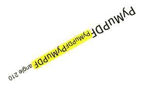
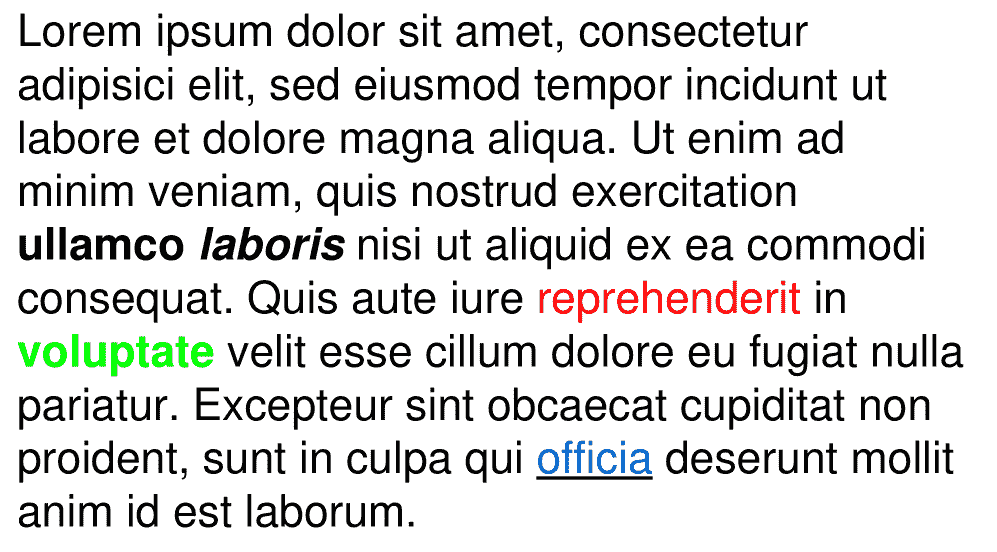
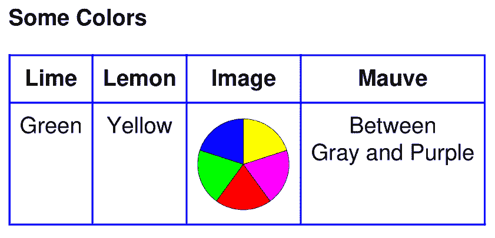
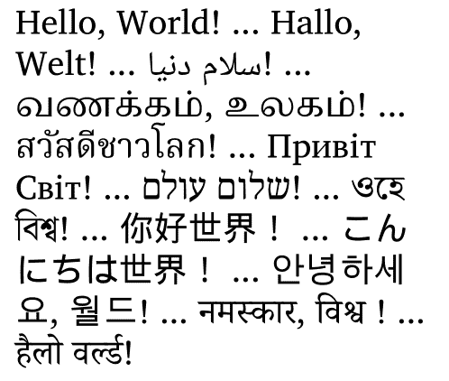
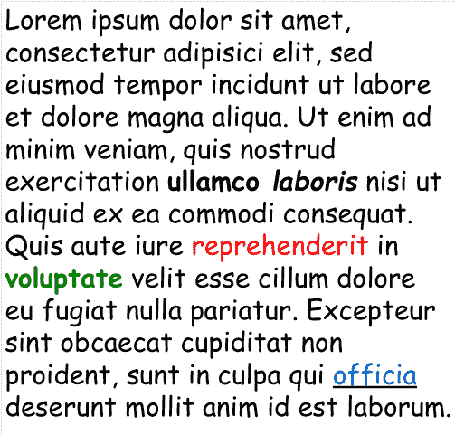
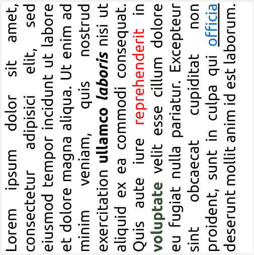

# 文本

> 原文：[`pymupdf.readthedocs.io/en/latest/recipes-text.html`](https://pymupdf.readthedocs.io/en/latest/recipes-text.html)

## 如何提取所有文档文本

此脚本将接受文档文件名并生成其所有文本的文本文件。

文档可以是任何 支持的类型。

脚本作为一个命令行工具运行，期望以文档文件名作为参数提供。它在脚本目录中生成一个名为“filename.txt”的文本文件。页面的文本由一个表单馈送字符分隔：

```py
import sys, pathlib, pymupdf
fname = sys.argv[1]  # get document filename
with pymupdf.open(fname) as doc:  # open document
    text = chr(12).join([page.get_text() for page in doc])
# write as a binary file to support non-ASCII characters
pathlib.Path(fname + ".txt").write_bytes(text.encode()) 
```

输出将是文档中编码的纯文本。没有任何美化的努力。特别是对于 PDF，这可能意味着输出不按照通常的阅读顺序，出现意外的换行等。

你有很多选项来纠正这一点 - 参见附录 2：关于嵌入文件的考虑章节。其中包括：

1.  以 HTML 格式提取文本并将其存储为 HTML 文档，以便在任何浏览器中查看。

1.  通过 *Page.get_text(“blocks”)* 提取文本作为文本块列表。列表中的每个条目包含其文本的位置信息，可用于建立方便的阅读顺序。

1.  通过 *Page.get_text(“words”)* 提取单词列表。其条目是带有位置信息的单词。用它来确定给定矩形中包含的文本 - 请参见下一节。

请参见以下两个部分的示例和进一步解释。  ## 如何将文本提取为 Markdown

这对于 RAG/LLM 环境特别有用 - 请参见输出为 Markdown。  ## 如何从页面中提取键-值对

如果页面的布局在某种意义上是 *“可预测的”*，那么有一种简单的方法可以快速轻松地找到给定关键字集的值 - 而不使用正则表达式。请参见[此示例脚本](https://github.com/pymupdf/PyMuPDF-Utilities/tree/master/text-extraction/lookup-keywords.py)。

在此上下文中，“可预测的”意味着：

+   每个关键字后跟其值 - 没有其他文本出现在它们之间。

+   值的边界框底部 **不在** 关键字的底部上方。

+   没有 **其他限制**：页面布局可以固定也可以不固定，文本也可能已存储为一个字符串。键和值之间可能具有任何距离。

例如，以下五个键-值对将被正确识别：

```py
key1               value1
key2
value2
key3
       value3 blah, blah, blah key4 value4 some other text key5 value5 ... 
```  ## 如何从矩形中提取文本

现在（v1.18.0）有超过一种方法可以实现这一点。因此，我们在 PyMuPDF-Utilities 仓库中创建了一个专门处理此主题的 [文件夹](https://github.com/pymupdf/PyMuPDF-Utilities/tree/master/textbox-extraction)。

* * *  ## 如何提取自然阅读顺序中的文本

PDF 文本提取的一个常见问题是，文本可能不会按照任何特定的阅读顺序出现。

这是 PDF 创建者（软件或人类）的责任。例如，页面标题可能是在文档生成之后的单独步骤中插入的。在这种情况下，页眉文本将出现在页面文本提取的末尾（尽管它将由 PDF 查看器软件正确显示）。例如，以下代码段将向现有的 PDF 添加一些页眉和页脚行：

```py
doc = pymupdf.open("some.pdf")
header = "Header"  # text in header
footer = "Page %i of %i"  # text in footer
for page in doc:
    page.insert_text((50, 50), header)  # insert header
    page.insert_text(  # insert footer 50 points above page bottom
        (50, page.rect.height - 50),
        footer % (page.number + 1, doc.page_count),
    ) 
```

以这种方式修改的页面提取的文本序列如下所示：

1.  原始文本

1.  标题行

1.  页脚行

PyMuPDF 有几种方法来重新建立一些阅读顺序，甚至重新生成接近原始的布局：

1.  使用`Page.get_text()`的`sort`参数。它将输出从左上到右下排序的输出（对 XHTML、HTML 和 XML 输出不起作用）。

1.  在 CLI 中使用`pymupdf`模块：`python -m pymupdf gettext ...`，它会产生一个文本文件，其中的文本已经重新排列成保留布局的模式。有许多选项可用于控制输出。

您也可以使用上述提到的[脚本](https://github.com/pymupdf/PyMuPDF/wiki/How-to-extract-text-from-a-rectangle)进行修改。

* * *  ## 如何从文档中提取表格内容

如果你在文档中看到一个表格，通常不会看到像嵌入式 Excel 或其他可识别对象一样的东西。它通常只是普通的标准文本，格式化为看起来像表格数据。

因此，从这样一个页面区域提取表格数据意味着你必须找到一种方法来**识别**表格区域（即其边界框），然后**（1）**图形地指示表格和列边界，然后**（2）**根据此信息提取文本。

这可能是一个非常复杂的任务，具体取决于细节，如线条的存在或不存在，矩形或其他支持矢量图形的存在。

方法`Page.find_tables()`会为您完成所有这些工作，并具有高精度的表检测。它的巨大优势是没有外部库依赖，也不需要使用人工智能或机器学习技术。它还提供了与著名的 Python 数据分析包[pandas](https://pypi.org/project/pandas/)的集成接口。

请查看示例[Jupyter notebooks](https://github.com/pymupdf/PyMuPDF-Utilities/tree/master/table-analysis)，其中涵盖了标准情况，比如一页上有多个表格或跨多个页面连接表格片段。

* * *  ## 如何标记提取的文本

有一个标准搜索功能，可以在页面上搜索任意文本：`Page.search_for()`。它返回一个围绕找到的出现的 Rect 对象列表。这些矩形可以用来自动插入可见标记找到的文本的注释。

这种方法有利有弊。优点是：

+   搜索字符串可以包含空格，并且可以跨行换行

+   大写或小写字符都被视为相等

+   在行末的单词连字符会被检测和解决

+   返回也可能是 Quad 对象的列表，以精确定位**不与任何轴平行**的文本-当页面旋转不为零时，也建议使用 Quad 输出。

但您也有其他选择：

```py
import sys
import pymupdf

def mark_word(page, text):
  """Underline each word that contains 'text'.
 """
    found = 0
    wlist = page.get_text("words", delimiters=None)  # make the word list
    for w in wlist:  # scan through all words on page
        if text in w[4]:  # w[4] is the word's string
            found += 1  # count
            r = pymupdf.Rect(w[:4])  # make rect from word bbox
            page.add_underline_annot(r)  # underline
    return found

fname = sys.argv[1]  # filename
text = sys.argv[2]  # search string
doc = pymupdf.open(fname)

print("underlining words containing '%s' in document '%s'" % (word, doc.name))

new_doc = False  # indicator if anything found at all

for page in doc:  # scan through the pages
    found = mark_word(page, text)  # mark the page's words
    if found:  # if anything found ...
        new_doc = True
        print("found '%s' %i times on page %i" % (text, found, page.number + 1))

if new_doc:
    doc.save("marked-" + doc.name) 
```

此脚本使用 `Page.get_text("words")` 来查找通过 cli 参数传递的字符串。该方法使用空格作为分隔符将页面文本分割为“单词”。进一步说明：

+   如果找到，则**包含字符串的完整单词**将被标记（下划线）-不仅仅是搜索字符串。

+   搜索字符串可能**不包含单词分隔符**。默认情况下，单词分隔符是空格和不间断空格 `chr(0xA0)`。如果您使用额外的分隔字符（例如 `page.get_text("words", delimiters="./,")`）则搜索字符串中也不应包含其中任何字符。

+   如图所示，大小写是**保留的**。但是这可以通过使用字符串方法*lower()*（甚至正则表达式）在函数*mark_word*中进行更改。

+   没有**上限**：所有出现都将被检测到。

+   您可以使用**任何东西**来标记单词：‘下划线’、‘高亮’、‘删除线’或‘方框’注释等。

+   这是本手册页面的示例片段，其中“MuPDF”已用作搜索字符串。请注意，所有包含“MuPDF”的字符串**都已完全下划线标记**（不仅仅是搜索字符串）。


* * *  ## 如何标记搜索到的文本

此脚本搜索文本并标记它：

```py
# -*- coding: utf-8 -*-
import pymupdf

# the document to annotate
doc = pymupdf.open("tilted-text.pdf")

# the text to be marked
needle = "¡La práctica hace el campeón!"

# work with first page only
page = doc[0]

# get list of text locations
# we use "quads", not rectangles because text may be tilted!
rl = page.search_for(needle, quads=True)

# mark all found quads with one annotation
page.add_squiggly_annot(rl)

# save to a new PDF
doc.save("a-squiggly.pdf") 
```

结果如下：


* * *  ## 如何标记非水平文本

上一节已经展示了一个示例，用于标记非水平文本，该文本是通过文本**搜索**检测到的。

但使用`Page.get_text()`的“dict”/“rawdict”选项进行文本**提取**也可能返回具有非零角度到 x 轴的文本。这由线字典的`"dir"`键的值指示：它是该角度的元组 `(cosine, sine)`。如果 `line["dir"] != (1, 0)`，则所有跨度的文本都将被（相同的）非零角度旋转。

但是，该方法返回的“bboxes”仅为矩形-不是四边形。因此，为了正确标记跨度文本，必须从包含在线和跨度字典中的数据中恢复其四边形。使用以下实用程序函数执行此操作（v1.18.9 中的新功能）：

```py
span_quad = pymupdf.recover_quad(line["dir"], span)
annot = page.add_highlight_annot(span_quad)  # this will mark the complete span text 
```

如果您想要**一次性标记完整行**或其子集的跨度，请使用以下片段（适用于 v1.18.10 或更高版本）：

```py
line_quad = pymupdf.recover_line_quad(line, spans=line["spans"][1:-1])
page.add_highlight_annot(line_quad) 
```



上面的`spans`参数可以指定`line["spans"]`的任何子列表。在上面的示例中，从第二个到倒数第二个 span 被标记了。如果省略，将取整个行。

* * *  ## 如何分析字体特性

要分析 PDF 中文本的特性，请使用这个基本脚本作为起点：

```py
import sys

import pymupdf

def flags_decomposer(flags):
  """Make font flags human readable."""
    l = []
    if flags & 2 ** 0:
        l.append("superscript")
    if flags & 2 ** 1:
        l.append("italic")
    if flags & 2 ** 2:
        l.append("serifed")
    else:
        l.append("sans")
    if flags & 2 ** 3:
        l.append("monospaced")
    else:
        l.append("proportional")
    if flags & 2 ** 4:
        l.append("bold")
    return ", ".join(l)

doc = pymupdf.open(sys.argv[1])
page = doc[0]

# read page text as a dictionary, suppressing extra spaces in CJK fonts
blocks = page.get_text("dict", flags=11)["blocks"]
for b in blocks:  # iterate through the text blocks
    for l in b["lines"]:  # iterate through the text lines
        for s in l["spans"]:  # iterate through the text spans
            print("")
            font_properties = "Font: '%s' (%s), size %g, color #%06x" % (
                s["font"],  # font name
                flags_decomposer(s["flags"]),  # readable font flags
                s["size"],  # font size
                s["color"],  # font color
            )
            print("Text: '%s'" % s["text"])  # simple print of text
            print(font_properties) 
```

这是 PDF 页面和脚本输出：


* * *  ## 如何插入文本

PyMuPDF 提供了在新的或现有 PDF 页面上插入文本的方法，具有以下特性：

+   选择字体，包括内置字体和作为文件可用的字体

+   选择文本特性，如粗体、斜体、字体大小、字体颜色等。

+   将文本以多种方式定位：

    > +   作为从特定点开始的简单线路定向输出，
    > +   
    > +   或将文本适应于作为矩形提供的框中，在这种情况下，还可以选择文本对齐方式，
    > +   
    > +   选择文本是否应放在前景（覆盖现有内容）中，
    > +   
    > +   所有文本可以任意“变形”，即其外观可以通过矩阵改变，以实现缩放、倾斜或镜像等效果，
    > +   
    > +   独立于变形以及此外，文本可以被整数倍数的 90 度旋转。

所有上述内容由三种基本的页面，分别是形状方法提供：

+   `Page.insert_font()` – 为页面安装字体以供以后参考。结果反映在`Document.get_page_fonts()`的输出中。该字体可以是：

    > +   作为文件提供，
    > +   
    > +   通过字体（然后使用`Font.buffer`）
    > +   
    > +   已经在**这个或另一个**PDF 中某处存在，或者
    > +   
    > +   是一个**内置**字体。

+   `Page.insert_text()` – 写入一些文本行。在内部，这使用了`Shape.insert_text()`。

+   `Page.insert_textbox()` – 将文本适应于给定矩形。在这里，您可以选择文本对齐特性（左对齐、右对齐、居中、两端对齐），并且您可以控制文本是否实际适合。在内部，这使用了`Shape.insert_textbox()`。

注意

两种文本插入方法会根据需要自动安装字体。

### 如何写文本行

在页面上输出一些文本行：

```py
import pymupdf
doc = pymupdf.open(...)  # new or existing PDF
page = doc.new_page()  # new or existing page via doc[n]
p = pymupdf.Point(50, 72)  # start point of 1st line

text = "Some text,\nspread across\nseveral lines."
# the same result is achievable by
# text = ["Some text", "spread across", "several lines."]

rc = page.insert_text(p,  # bottom-left of 1st char
                     text,  # the text (honors '\n')
                     fontname = "helv",  # the default font
                     fontsize = 11,  # the default font size
                     rotate = 0,  # also available: 90, 180, 270
                     )
print("%i lines printed on page %i." % (rc, page.number))

doc.save("text.pdf") 
```

使用这种方法，仅控制**行数**以确保不超过页面高度。多余的行将不会被写入，并返回实际行数。计算使用从`fontsize`和 36 点（0.5 英寸）底部边距计算的行高。

忽略线**宽度**。线的多余部分将简单地不可见。

然而，对于内置字体，有方法可以预先计算行宽度 - 请参阅`get_text_length()`。

这是另一个例子。它使用四种不同的旋转选项插入了 4 个文本字符串，并因此解释了必须选择的文本插入点，以实现所需的结果：

```py
import pymupdf
doc = pymupdf.open()
page = doc.new_page()
# the text strings, each having 3 lines
text1 = "rotate=0\nLine 2\nLine 3"
text2 = "rotate=90\nLine 2\nLine 3"
text3 = "rotate=-90\nLine 2\nLine 3"
text4 = "rotate=180\nLine 2\nLine 3"
red = (1, 0, 0) # the color for the red dots
# the insertion points, each with a 25 pix distance from the corners
p1 = pymupdf.Point(25, 25)
p2 = pymupdf.Point(page.rect.width - 25, 25)
p3 = pymupdf.Point(25, page.rect.height - 25)
p4 = pymupdf.Point(page.rect.width - 25, page.rect.height - 25)
# create a Shape to draw on
shape = page.new_shape()

# draw the insertion points as red, filled dots
shape.draw_circle(p1,1)
shape.draw_circle(p2,1)
shape.draw_circle(p3,1)
shape.draw_circle(p4,1)
shape.finish(width=0.3, color=red, fill=red)

# insert the text strings
shape.insert_text(p1, text1)
shape.insert_text(p3, text2, rotate=90)
shape.insert_text(p2, text3, rotate=-90)
shape.insert_text(p4, text4, rotate=180)

# store our work to the page
shape.commit()
doc.save(...) 
```

这是结果：


* * *  ### 如何填充文本框

此脚本用文本填充了 4 个不同的矩形，每次选择一个不同的旋转值：

```py
import pymupdf

doc = pymupdf.open()  # new or existing PDF
page = doc.new_page()  # new page, or choose doc[n]

# write in this overall area
rect = pymupdf.Rect(100, 100, 300, 150)

# partition the area in 4 equal sub-rectangles
CELLS = pymupdf.make_table(rect, cols=4, rows=1)

t1 = "text with rotate = 0."  # these texts we will written
t2 = "text with rotate = 90."
t3 = "text with rotate = 180."
t4 = "text with rotate = 270."
text = [t1, t2, t3, t4]
red = pymupdf.pdfcolor["red"]  # some colors
gold = pymupdf.pdfcolor["gold"]
blue = pymupdf.pdfcolor["blue"]
"""
We use a Shape object (something like a canvas) to output the text and
the rectangles surrounding it for demonstration.
"""
shape = page.new_shape()  # create Shape
for i in range(len(CELLS[0])):
    shape.draw_rect(CELLS[0][i])  # draw rectangle
    shape.insert_textbox(
        CELLS[0][i], text[i], fontname="hebo", color=blue, rotate=90 * i
    )

shape.finish(width=0.3, color=red, fill=gold)

shape.commit()  # write all stuff to the page
doc.ez_save(__file__.replace(".py", ".pdf")) 
```

以上使用了一些默认值：字体大小 11 和文本对齐“left”。结果将会如下所示：


* * *  ### 如何用 HTML 文本填充方框

方法`Page.insert_htmlbox()`提供了一种**更加强大**的方式来在矩形中插入文本。

与简单的纯文本不同，此方法接受 HTML 源码，该源码不仅可以包含 HTML 标签，还可以包含样式指令，以影响诸如字体、字重（加粗）和样式（斜体）、颜色等。

也可以混合多种字体和语言，输出 HTML 表格，并插入图片和 URI 链接。

为了更灵活地进行样式设置，还可以提供额外的 CSS 源码。

该方法基于 Story 类。因此，复杂的脚本系统，如天城文、尼泊尔文、泰米尔文等，得以支持并由于使用了 HarfBuzz 库（提供了所谓的**“文本整形”**功能），而被正确书写。

从 Google NOTO 字体库自动获取所需的字体以输出字符 - 作为备用（当可选择提供的用户字体不包含某些字形时）。

作为对此处提供的功能的小瞥见，我们将输出以下 HTML 富文本：

```py
import pymupdf

rect = pymupdf.Rect(100, 100, 400, 300)

text = """Lorem ipsum dolor sit amet, consectetur adipisici elit, sed
 eiusmod tempor incidunt ut labore et dolore magna aliqua. Ut enim ad
 minim veniam, quis nostrud exercitation <b>ullamco <i>laboris</i></b>
 nisi ut aliquid ex ea commodi consequat. Quis aute iure
 <span style="color: #f00;">reprehenderit</span>
 in <span style="color: #0f0;font-weight:bold;">voluptate</span> velit
 esse cillum dolore eu fugiat nulla pariatur. Excepteur sint obcaecat
 cupiditat non proident, sunt in culpa qui
 <a href="https://www.artifex.com">officia</a> deserunt mollit anim id
 est laborum."""

doc = pymupdf.Document()

page = doc.new_page()
page.insert_htmlbox(rect, text, css="* {font-family: sans-serif;font-size:14px;}")

doc.ez_save(__file__.replace(".py", ".pdf")) 
```

请注意“css”参数是如何被用来全局选择默认的“无衬线”字体和字体大小 14 的。

结果将会如下所示：



#### 如何输出 HTML 表格和图片

这是另一个例子，演示了使用此方法输出表格。这次，我们在 HTML 源代码中包含了所有的样式。还请注意，如何在表格单元格中包含图片：

```py
import pymupdf
import os

filedir = os.path.dirname(__file__)

text = """
<style>
body {
 font-family: sans-serif;
}

td,
th {
 border: 1px solid blue;
 border-right: none;
 border-bottom: none;
 padding: 5px;
 text-align: center;
}

table {
 border-right: 1px solid blue;
 border-bottom: 1px solid blue;
 border-spacing: 0;
}
</style>

<body>
<p><b>Some Colors</b></p>
<table>
 <tr>
 <th>Lime</th>
 <th>Lemon</th>
 <th>Image</th>
 <th>Mauve</th>
 </tr>
 <tr>
 <td>Green</td>
 <td>Yellow</td>
 <td></td>
 <td>Between<br>Gray and Purple</td>
 </tr>
</table>
</body>
"""

doc = pymupdf.Document()

page = doc.new_page()
rect = page.rect + (36, 36, -36, -36)

# we must specify an Archive because of the image
page.insert_htmlbox(rect, text, archive=pymupdf.Archive("."))

doc.ez_save(__file__.replace(".py", ".pdf")) 
```

结果将会如下所示：



#### 如何输出世界各国的语言

我们的第三个示例将演示自动多语言支持。它包括用于复杂脚本系统（如天城文和从右到左的语言）的自动**文本整形**：

```py
import pymupdf

greetings = (
    "Hello, World!",  # english
    "Hallo, Welt!",  # german
    "سلام دنیا!",  # persian
    "வணக்கம், உலகம்!",  # tamil
    "สวัสดีชาวโลก!",  # thai
    "Привіт Світ!",  # ucranian
    "שלום עולם!",  # hebrew
    "ওহে বিশ্ব!",  # bengali
    "你好世界！",  # chinese
    "こんにちは世界！",  # japanese
    "안녕하세요, 월드!",  # korean
    "नमस्कार, विश्व !",  # sanskrit
    "हैलो वर्ल्ड!",  # hindi
)
doc = pymupdf.open()
page = doc.new_page()
rect = (50, 50, 200, 500)

# join greetings into one text string
text = " ... ".join([t for t in greetings])

# the output of the above is simple:
page.insert_htmlbox(rect, text)
doc.save(__file__.replace(".py", ".pdf")) 
```

这是输出结果：



#### 如何指定自己的字体

使用`@font-face`语句以 CSS 语法定义您的字体文件。您需要为希望支持的每种字体粗细和字体样式（例如粗体或斜体）单独使用一个`@font-face`。以下示例使用了著名的 MS Comic Sans 字体及其四个变体：常规、粗体、斜体和粗斜体。

由于这四个字体文件位于系统文件夹`C:/Windows/Fonts`中，该方法需要一个存档定义，指向该文件夹：

```py
"""
How to use your own fonts with method Page.insert_htmlbox().
"""
import pymupdf

# Example text
text = """Lorem ipsum dolor sit amet, consectetur adipisici elit, sed
 eiusmod tempor incidunt ut labore et dolore magna aliqua. Ut enim ad
 minim veniam, quis nostrud exercitation <b>ullamco <i>laboris</i></b>
 nisi ut aliquid ex ea commodi consequat. Quis aute iure
 <span style="color: red;">reprehenderit</span>
 in <span style="color: green;font-weight:bold;">voluptate</span> velit
 esse cillum dolore eu fugiat nulla pariatur. Excepteur sint obcaecat
 cupiditat non proident, sunt in culpa qui
 <a href="https://www.artifex.com">officia</a> deserunt mollit anim id
 est laborum."""

"""
We need an Archive object to show where font files are located.
We intend to use the font family "MS Comic Sans".
"""
arch = pymupdf.Archive("C:/Windows/Fonts")

# These statements define which font file to use for regular, bold,
# italic and bold-italic text.
# We assign an arbitary common font-family for all 4 font files.
# The Story algorithm will select the right file as required.
# We request to use "comic" throughout the text.
css = """
@font-face {font-family: comic; src: url(comic.ttf);}
@font-face {font-family: comic; src: url(comicbd.ttf);font-weight: bold;}
@font-face {font-family: comic; src: url(comicz.ttf);font-weight: bold;font-style: italic;}
@font-face {font-family: comic; src: url(comici.ttf);font-style: italic;}
* {font-family: comic;}
"""

doc = pymupdf.Document()
page = doc.new_page(width=150, height=150)  # make small page

page.insert_htmlbox(page.rect, text, css=css, archive=arch)

doc.subset_fonts(verbose=True)  # build subset fonts to reduce file size
doc.ez_save(__file__.replace(".py", ".pdf")) 
```



#### 如何请求文本对齐

本示例结合了多个要求：

+   将文本逆时针旋转 90 度。

+   使用[pymupdf-fonts](https://pypi.org/project/pymupdf-fonts/)软件包中的字体。在这种情况下，您会发现相应的 CSS 定义更加简单。

+   使用“justify”选项对齐文本。

```py
"""
How to use a pymupdf font with method Page.insert_htmlbox().
"""
import pymupdf

# Example text
text = """Lorem ipsum dolor sit amet, consectetur adipisici elit, sed
 eiusmod tempor incidunt ut labore et dolore magna aliqua. Ut enim ad
 minim veniam, quis nostrud exercitation <b>ullamco <i>laboris</i></b>
 nisi ut aliquid ex ea commodi consequat. Quis aute iure
 <span style="color: red;">reprehenderit</span>
 in <span style="color: green;font-weight:bold;">voluptate</span> velit
 esse cillum dolore eu fugiat nulla pariatur. Excepteur sint obcaecat
 cupiditat non proident, sunt in culpa qui
 <a href="https://www.artifex.com">officia</a> deserunt mollit anim id
 est laborum."""

"""
This is similar to font file support. However, we can use a convenience
function for creating required CSS definitions.
We still need an Archive for finding the font binaries.
"""
arch = pymupdf.Archive()

# We request to use "myfont" throughout the text.
css = pymupdf.css_for_pymupdf_font("ubuntu", archive=arch, name="myfont")
css += "* {font-family: myfont;text-align: justify;}"

doc = pymupdf.Document()

page = doc.new_page(width=150, height=150)

page.insert_htmlbox(page.rect, text, css=css, archive=arch, rotate=90)

doc.subset_fonts(verbose=True)
doc.ez_save(__file__.replace(".py", ".pdf")) 
```

 ## 如何提取带颜色的文本

迭代您的文本块并找到所需信息的文本跨度。

```py
for page in doc:
    text_blocks = page.get_text("dict", flags=pymupdf.TEXTFLAGS_TEXT)["blocks"]
    for block in text_blocks:
        for line in block["lines"]:
            for span in line["spans"]:
                text = span["text"]
                color = pymupdf.sRGB_to_rgb(span["color"])
                print(f"Text: {text}, Color: {color}") 
```

您对本页有任何反馈吗？

* * *

此软件按原样提供，没有任何明示或暗示的保证。此软件在许可下分发，除非在许可条款明确授权的情况下，否则不得复制、修改或分发。有关更多信息，请参阅[artifex.com](https://www.artifex.com?utm_source=rtd-pymupdf&utm_medium=rtd&utm_content=footer-link)的许可信息或联系 Artifex Software Inc.，美国加利福尼亚州旧金山 Mesa 街 39 号 108A 套房。

此文档涵盖了所有版本直至 1.24.4。

 ## 如何提取所有文档文本

此脚本将使用文档文件名生成一个包含其所有文本的文本文件。

文档可以是任何支持的类型。

此脚本作为一个命令行工具运行，需要将文档文件名作为参数提供。它将在脚本目录中生成一个名为“filename.txt”的文本文件。页面文本由分页符分隔：

```py
import sys, pathlib, pymupdf
fname = sys.argv[1]  # get document filename
with pymupdf.open(fname) as doc:  # open document
    text = chr(12).join([page.get_text() for page in doc])
# write as a binary file to support non-ASCII characters
pathlib.Path(fname + ".txt").write_bytes(text.encode()) 
```

由于文档中的编码，输出将是纯文本。不会进行任何美化。具体来说，对于 PDF 文件，这可能意味着输出不符合通常的阅读顺序，出现意外的换行等。

您有多种选项来纠正此问题 - 请参阅附录 2：关于嵌入文件的考虑（app2.html#appendix2）章节。其中包括：

1.  提取以 HTML 格式存储的文本，并将其存储为 HTML 文档，以便在任何浏览器中查看。

1.  通过*Page.get_text(“blocks”)*将文本提取为文本块列表。此列表的每个项目包含其文本的位置信息，可以用于建立方便的阅读顺序。

1.  通过*Page.get_text(“words”)*提取一个单词列表。它的项是带有位置信息的单词。用它来确定包含在给定矩形内的文本 - 请参见下一节。

查看以下两个部分以获取示例和进一步的解释。

## 如何将文本提取为 Markdown

这对于 RAG/LLM 环境特别有用 - 请参见以 Markdown 格式输出。

## 如何从页面中提取键值对

如果页面的布局在某种意义上是*“可预测的”*，那么有一种简单的方法可以快速且轻松地查找给定关键字的值 - 而无需使用正则表达式。请参见[此示例脚本](https://github.com/pymupdf/PyMuPDF-Utilities/tree/master/text-extraction/lookup-keywords.py)。

在这种情况下，“可预测”意味着：

+   每个关键词后面都跟着它的值 - 中间没有其他文本。

+   值的边界框底部**不在**关键字的上方。

+   **没有其他限制**：页面布局可以是固定的，也可以不固定，文本也可能被存储为一个字符串。关键字和值可以相隔任意距离。

例如，以下五对键值将被正确识别：

```py
key1               value1
key2
value2
key3
       value3 blah, blah, blah key4 value4 some other text key5 value5 ... 
```

## 如何从矩形内提取文本

现在（v1.18.0）有多种方法可以实现这一点。因此，我们在 PyMuPDF-Utilities 存储库中专门创建了一个[文件夹](https://github.com/pymupdf/PyMuPDF-Utilities/tree/master/textbox-extraction)，专门处理这个主题。

* * *

## 如何按自然阅读顺序提取文本

PDF 文本提取的常见问题之一是，文本可能不按任何特定的阅读顺序出现。

这是 PDF 创建者（软件或人）的责任。例如，页眉可能在文档生成后另外插入 - 在这种情况下，页眉文本将会出现在页面文本提取的末尾（尽管 PDF 查看器软件会正确显示它）。例如，以下代码片段将向现有 PDF 添加一些页眉和页脚行：

```py
doc = pymupdf.open("some.pdf")
header = "Header"  # text in header
footer = "Page %i of %i"  # text in footer
for page in doc:
    page.insert_text((50, 50), header)  # insert header
    page.insert_text(  # insert footer 50 points above page bottom
        (50, page.rect.height - 50),
        footer % (page.number + 1, doc.page_count),
    ) 
```

以这种方式修改的页面提取的文本序列将如下所示：

1.  原始文本

1.  头部行

1.  底部行

PyMuPDF 具有多种方法可以重新建立某种阅读顺序，甚至重新生成接近原始布局：

1.  使用`Page.get_text()`的`sort`参数。它将从左上到右下排序输出（对于 XHTML、HTML 和 XML 输出不起作用）。

1.  在 CLI 中使用`pymupdf`模块：`python -m pymupdf gettext ...`，它会产生一个重新排列布局的文本文件。有许多选项可用于控制输出。

您还可以使用上述提到的[脚本](https://github.com/pymupdf/PyMuPDF/wiki/How-to-extract-text-from-a-rectangle)进行修改。

* * *

## 如何从文档中提取表格内容

如果您在文档中看到一个表格，通常不会看到类似嵌入式 Excel 或其他可识别对象。它通常只是正常的标准文本，格式化为看起来像表格数据。

因此，从这样一个页面区域中提取表格数据意味着您必须找到一种方法来**识别**表格区域（即其边界框），然后**（1）**图形化地指示表格和列边界，并**（2）**基于此信息提取文本。

这可能是一个非常复杂的任务，具体取决于线条、矩形或其他支持向量图形的存在与否。

方法`Page.find_tables()`会为您完成所有这些工作，并具有高表检测精度。它的巨大优势在于没有外部库依赖，也不需要使用人工智能或机器学习技术。它还为数据分析的著名 Python 包[pandas](https://pypi.org/project/pandas/)提供了集成接口。

请查看示例[Jupyter 笔记本](https://github.com/pymupdf/PyMuPDF-Utilities/tree/master/table-analysis)，这些示例涵盖了标准情况，如一页上的多个表格或跨多个页面的表格片段的连接。

* * *

## 如何标记提取的文本

页面上有一个标准的搜索功能来搜索任意文本：`Page.search_for()`。它返回一个围绕找到的出现的 Rect 对象列表。例如，这些矩形可以用于自动插入可视化标记找到的文本。

此方法有优缺点。优点是：

+   搜索字符串可以包含空格并跨行换行

+   大小写字符被视为相同。

+   检测并解决了单词在行尾的连字符化

+   返回值也可以是一组 Quad 对象，以精确定位**不与任一轴平行**的文本 - 当页面旋转不为零时，建议也使用 Quad 输出。

但您也有其他选择：

```py
import sys
import pymupdf

def mark_word(page, text):
  """Underline each word that contains 'text'.
 """
    found = 0
    wlist = page.get_text("words", delimiters=None)  # make the word list
    for w in wlist:  # scan through all words on page
        if text in w[4]:  # w[4] is the word's string
            found += 1  # count
            r = pymupdf.Rect(w[:4])  # make rect from word bbox
            page.add_underline_annot(r)  # underline
    return found

fname = sys.argv[1]  # filename
text = sys.argv[2]  # search string
doc = pymupdf.open(fname)

print("underlining words containing '%s' in document '%s'" % (word, doc.name))

new_doc = False  # indicator if anything found at all

for page in doc:  # scan through the pages
    found = mark_word(page, text)  # mark the page's words
    if found:  # if anything found ...
        new_doc = True
        print("found '%s' %i times on page %i" % (text, found, page.number + 1))

if new_doc:
    doc.save("marked-" + doc.name) 
```

此脚本使用`Page.get_text("words")`来查找通过 cli 参数传递的字符串。该方法使用空格作为分隔符将页面的文本分隔为“单词”。进一步的说明：

+   如果找到，将会标记（下划线）**包含该字符串的完整单词** - 而不仅仅是搜索字符串。

+   搜索字符串**不能包含单词分隔符**。默认情况下，单词分隔符是空格和不间断空格 `chr(0xA0)`。如果您使用额外的分隔符字符，比如 `page.get_text("words", delimiters="./,")`，那么搜索字符串中也不应包含这些字符。

+   如此所示，大写/小写是**被尊重**的。但可以通过使用字符串方法*lower()*（或甚至正则表达式）在*mark_word*函数中进行更改。

+   **没有上限**：所有出现都将被检测到。

+   您可以使用**任何方式**标记单词：“下划线”、“突出显示”、“删除线”或“方形”注释等。

+   这是本手册一页的一个示例片段，其中“MuPDF”已用作搜索字符串。请注意，所有包含“MuPDF”的字符串均已完全下划线标记（不仅仅是搜索字符串）。


* * *

## 如何标记搜索到的文本

此脚本搜索文本并标记它：

```py
# -*- coding: utf-8 -*-
import pymupdf

# the document to annotate
doc = pymupdf.open("tilted-text.pdf")

# the text to be marked
needle = "¡La práctica hace el campeón!"

# work with first page only
page = doc[0]

# get list of text locations
# we use "quads", not rectangles because text may be tilted!
rl = page.search_for(needle, quads=True)

# mark all found quads with one annotation
page.add_squiggly_annot(rl)

# save to a new PDF
doc.save("a-squiggly.pdf") 
```

结果看起来像这样：


* * *

## 如何标记非水平文本

前面的部分已经展示了一个搜索到非水平文本并进行标记的示例。

但是，使用`Page.get_text()`的“dict”/“rawdict”选项提取文本时，也可能返回带有非零 x 轴角度的文本。这通过行字典的`"dir"`键的值来指示：它是该角度的余弦、正弦元组。“如果`line["dir"] != (1, 0)`，则其所有跨度的文本均被（相同的）非零角度旋转。

方法返回的“bboxes”只是矩形 - 不是四边形。因此，为了正确标记跨度文本，必须从包含在行和跨度字典中的数据中恢复其四边形。使用以下实用函数执行此操作（在 v1.18.9 中新增）：

```py
span_quad = pymupdf.recover_quad(line["dir"], span)
annot = page.add_highlight_annot(span_quad)  # this will mark the complete span text 
```

如果您想一次性标记完整行或其子集的跨度，请使用以下代码片段（适用于 v1.18.10 或更高版本）：

```py
line_quad = pymupdf.recover_line_quad(line, spans=line["spans"][1:-1])
page.add_highlight_annot(line_quad) 
```


上述的`spans`参数可以指定`line["spans"]`的任何子列表。在上面的例子中，从第二个到倒数第二个跨度都被标记了。如果省略，则取整行。

* * *

## 如何分析字体特性

要分析 PDF 中文本的特征，请使用这个基本脚本作为起点：

```py
import sys

import pymupdf

def flags_decomposer(flags):
  """Make font flags human readable."""
    l = []
    if flags & 2 ** 0:
        l.append("superscript")
    if flags & 2 ** 1:
        l.append("italic")
    if flags & 2 ** 2:
        l.append("serifed")
    else:
        l.append("sans")
    if flags & 2 ** 3:
        l.append("monospaced")
    else:
        l.append("proportional")
    if flags & 2 ** 4:
        l.append("bold")
    return ", ".join(l)

doc = pymupdf.open(sys.argv[1])
page = doc[0]

# read page text as a dictionary, suppressing extra spaces in CJK fonts
blocks = page.get_text("dict", flags=11)["blocks"]
for b in blocks:  # iterate through the text blocks
    for l in b["lines"]:  # iterate through the text lines
        for s in l["spans"]:  # iterate through the text spans
            print("")
            font_properties = "Font: '%s' (%s), size %g, color #%06x" % (
                s["font"],  # font name
                flags_decomposer(s["flags"]),  # readable font flags
                s["size"],  # font size
                s["color"],  # font color
            )
            print("Text: '%s'" % s["text"])  # simple print of text
            print(font_properties) 
```

这是 PDF 页面和脚本输出的示例：


* * *

## 如何插入文本

PyMuPDF 提供了以下功能，可在新的或现有的 PDF 页面上插入文本：

+   选择字体，包括内置字体和作为文件可用的字体

+   选择文本的特征，如粗体、斜体、字体大小、字体颜色等。

+   以多种方式定位文本：

    > +   无论是作为从某一点开始的简单的行定向输出，
    > +   
    > +   还是适应提供的作为矩形的框中的文本，此时也可选择文本对齐方式，
    > +   
    > +   选择文本是放在前景（覆盖现有内容）还是背景的。
    > +   
    > +   所有文本都可以任意“变形”，即其外观可以通过 Matrix 进行更改，以实现缩放、倾斜或镜像等效果，
    > +   
    > +   独立于变形并额外增加的，文本可以以 90 度的整数倍旋转。

所有上述内容由三个基本的 Page 或 Shape 方法提供：

+   `Page.insert_font()` – 为页面安装字体以便以后引用。结果反映在 `Document.get_page_fonts()` 的输出中。字体可以是：

    > +   由文件提供，
    > +   
    > +   通过 字体（然后使用 `Font.buffer`）
    > +   
    > +   已经在**此或其他** PDF 中某处存在，或者
    > +   
    > +   是一个**内置**字体。

+   `Page.insert_text()` – 编写几行文本。在内部，这使用了 `Shape.insert_text()`。

+   `Page.insert_textbox()` – 将文本适配到给定的矩形中。在这里，您可以选择文本对齐特性（左、右、居中、两端对齐），并且您可以控制文本实际适配情况。在内部，这使用了 `Shape.insert_textbox()`。

注

两种文本插入方法会根据需要自动安装字体。

### 如何写文本行

在页面上输出一些文本行：

```py
import pymupdf
doc = pymupdf.open(...)  # new or existing PDF
page = doc.new_page()  # new or existing page via doc[n]
p = pymupdf.Point(50, 72)  # start point of 1st line

text = "Some text,\nspread across\nseveral lines."
# the same result is achievable by
# text = ["Some text", "spread across", "several lines."]

rc = page.insert_text(p,  # bottom-left of 1st char
                     text,  # the text (honors '\n')
                     fontname = "helv",  # the default font
                     fontsize = 11,  # the default font size
                     rotate = 0,  # also available: 90, 180, 270
                     )
print("%i lines printed on page %i." % (rc, page.number))

doc.save("text.pdf") 
```

使用此方法，仅控制**行数**以确保不超出页面高度。多余的行将不会被写入，并且会返回实际行数。计算使用从 `fontsize` 和 36 点（0.5 英寸）作为底部边距计算得出的行高。

**线宽被忽略**。行的多余部分将会被简单地隐藏。

然而，对于内置字体，有一些方法可以预先计算线宽 - 见 `get_text_length()`。

这是另一个例子。它使用四种不同的旋转选项插入 4 个文本字符串，从而解释了必须选择文本插入点以实现所需结果的方式：

```py
import pymupdf
doc = pymupdf.open()
page = doc.new_page()
# the text strings, each having 3 lines
text1 = "rotate=0\nLine 2\nLine 3"
text2 = "rotate=90\nLine 2\nLine 3"
text3 = "rotate=-90\nLine 2\nLine 3"
text4 = "rotate=180\nLine 2\nLine 3"
red = (1, 0, 0) # the color for the red dots
# the insertion points, each with a 25 pix distance from the corners
p1 = pymupdf.Point(25, 25)
p2 = pymupdf.Point(page.rect.width - 25, 25)
p3 = pymupdf.Point(25, page.rect.height - 25)
p4 = pymupdf.Point(page.rect.width - 25, page.rect.height - 25)
# create a Shape to draw on
shape = page.new_shape()

# draw the insertion points as red, filled dots
shape.draw_circle(p1,1)
shape.draw_circle(p2,1)
shape.draw_circle(p3,1)
shape.draw_circle(p4,1)
shape.finish(width=0.3, color=red, fill=red)

# insert the text strings
shape.insert_text(p1, text1)
shape.insert_text(p3, text2, rotate=90)
shape.insert_text(p2, text3, rotate=-90)
shape.insert_text(p4, text4, rotate=180)

# store our work to the page
shape.commit()
doc.save(...) 
```

这是结果：


* * *  ### 如何填充文本框

此脚本使用不同的旋转值填充了 4 个不同的矩形文本，每次选择一个不同的旋转值：

```py
import pymupdf

doc = pymupdf.open()  # new or existing PDF
page = doc.new_page()  # new page, or choose doc[n]

# write in this overall area
rect = pymupdf.Rect(100, 100, 300, 150)

# partition the area in 4 equal sub-rectangles
CELLS = pymupdf.make_table(rect, cols=4, rows=1)

t1 = "text with rotate = 0."  # these texts we will written
t2 = "text with rotate = 90."
t3 = "text with rotate = 180."
t4 = "text with rotate = 270."
text = [t1, t2, t3, t4]
red = pymupdf.pdfcolor["red"]  # some colors
gold = pymupdf.pdfcolor["gold"]
blue = pymupdf.pdfcolor["blue"]
"""
We use a Shape object (something like a canvas) to output the text and
the rectangles surrounding it for demonstration.
"""
shape = page.new_shape()  # create Shape
for i in range(len(CELLS[0])):
    shape.draw_rect(CELLS[0][i])  # draw rectangle
    shape.insert_textbox(
        CELLS[0][i], text[i], fontname="hebo", color=blue, rotate=90 * i
    )

shape.finish(width=0.3, color=red, fill=gold)

shape.commit()  # write all stuff to the page
doc.ez_save(__file__.replace(".py", ".pdf")) 
```

上面使用了一些默认值：字体大小 11 和文本对齐“左”。结果如下所示：


* * *  ### 如何用 HTML 文本填充框

方法 `Page.insert_htmlbox()` 提供了一种**更强大**的在矩形中插入文本的方法。

而不是简单的纯文本，此方法接受 HTML 源，其中不仅可以包含 HTML 标签，还可以包含样式指令以影响诸如字体、字体粗细（粗体）和风格（斜体）、颜色等的事物。

还可以混合多种字体和语言，输出 HTML 表格以及插入图像和 URI 链接。

为了更加灵活地进行样式设置，还可以提供额外的 CSS 源。

该方法基于 Story 类。因此，它支持复杂脚本系统（如天城文、尼泊尔文、泰米尔文等）并且由于使用 HarfBuzz 库而能够正确编写 - 该库提供了这种所谓的**“文本整形”**功能。

自动从谷歌 NOTO 字体库中提取所需字体以输出字符 - 作为备选（当选择性提供的用户字体不包含某些字符时）。

作为此处提供的功能的一小部分，我们将输出以下 HTML 富文本：

```py
import pymupdf

rect = pymupdf.Rect(100, 100, 400, 300)

text = """Lorem ipsum dolor sit amet, consectetur adipisici elit, sed
 eiusmod tempor incidunt ut labore et dolore magna aliqua. Ut enim ad
 minim veniam, quis nostrud exercitation <b>ullamco <i>laboris</i></b>
 nisi ut aliquid ex ea commodi consequat. Quis aute iure
 <span style="color: #f00;">reprehenderit</span>
 in <span style="color: #0f0;font-weight:bold;">voluptate</span> velit
 esse cillum dolore eu fugiat nulla pariatur. Excepteur sint obcaecat
 cupiditat non proident, sunt in culpa qui
 <a href="https://www.artifex.com">officia</a> deserunt mollit anim id
 est laborum."""

doc = pymupdf.Document()

page = doc.new_page()
page.insert_htmlbox(rect, text, css="* {font-family: sans-serif;font-size:14px;}")

doc.ez_save(__file__.replace(".py", ".pdf")) 
```

请注意“css”参数的使用方式，全局选择默认的“sans-serif”字体和字号为 14。

结果将如下所示：


#### 如何输出 HTML 表格和图像

这里是另一个使用此方法输出表格的示例。这次，我们将所有样式包含在 HTML 源码中。请注意，如何在表格单元格中包含图像也是可行的：

```py
import pymupdf
import os

filedir = os.path.dirname(__file__)

text = """
<style>
body {
 font-family: sans-serif;
}

td,
th {
 border: 1px solid blue;
 border-right: none;
 border-bottom: none;
 padding: 5px;
 text-align: center;
}

table {
 border-right: 1px solid blue;
 border-bottom: 1px solid blue;
 border-spacing: 0;
}
</style>

<body>
<p><b>Some Colors</b></p>
<table>
 <tr>
 <th>Lime</th>
 <th>Lemon</th>
 <th>Image</th>
 <th>Mauve</th>
 </tr>
 <tr>
 <td>Green</td>
 <td>Yellow</td>
 <td></td>
 <td>Between<br>Gray and Purple</td>
 </tr>
</table>
</body>
"""

doc = pymupdf.Document()

page = doc.new_page()
rect = page.rect + (36, 36, -36, -36)

# we must specify an Archive because of the image
page.insert_htmlbox(rect, text, archive=pymupdf.Archive("."))

doc.ez_save(__file__.replace(".py", ".pdf")) 
```

结果将如下所示：


#### 如何输出世界各国的语言

我们的第三个示例将演示自动多语言支持。它包括了复杂脚本系统（如天城文和从右到左的语言）的自动**文本整形**：

```py
import pymupdf

greetings = (
    "Hello, World!",  # english
    "Hallo, Welt!",  # german
    "سلام دنیا!",  # persian
    "வணக்கம், உலகம்!",  # tamil
    "สวัสดีชาวโลก!",  # thai
    "Привіт Світ!",  # ucranian
    "שלום עולם!",  # hebrew
    "ওহে বিশ্ব!",  # bengali
    "你好世界！",  # chinese
    "こんにちは世界！",  # japanese
    "안녕하세요, 월드!",  # korean
    "नमस्कार, विश्व !",  # sanskrit
    "हैलो वर्ल्ड!",  # hindi
)
doc = pymupdf.open()
page = doc.new_page()
rect = (50, 50, 200, 500)

# join greetings into one text string
text = " ... ".join([t for t in greetings])

# the output of the above is simple:
page.insert_htmlbox(rect, text)
doc.save(__file__.replace(".py", ".pdf")) 
```

这是输出结果：


#### 如何指定自己的字体

使用`@font-face`语句在 CSS 语法中定义字体文件。对于希望支持的每种字体粗细和字体风格组合（例如粗体或斜体），都需要一个单独的`@font-face`。以下示例使用著名的 MS Comic Sans 字体及其四个变体：正常、粗体、斜体和粗斜体。

由于这四个字体文件位于系统文件夹`C:/Windows/Fonts`中，因此该方法需要一个指向该文件夹的 Archive 定义：

```py
"""
How to use your own fonts with method Page.insert_htmlbox().
"""
import pymupdf

# Example text
text = """Lorem ipsum dolor sit amet, consectetur adipisici elit, sed
 eiusmod tempor incidunt ut labore et dolore magna aliqua. Ut enim ad
 minim veniam, quis nostrud exercitation <b>ullamco <i>laboris</i></b>
 nisi ut aliquid ex ea commodi consequat. Quis aute iure
 <span style="color: red;">reprehenderit</span>
 in <span style="color: green;font-weight:bold;">voluptate</span> velit
 esse cillum dolore eu fugiat nulla pariatur. Excepteur sint obcaecat
 cupiditat non proident, sunt in culpa qui
 <a href="https://www.artifex.com">officia</a> deserunt mollit anim id
 est laborum."""

"""
We need an Archive object to show where font files are located.
We intend to use the font family "MS Comic Sans".
"""
arch = pymupdf.Archive("C:/Windows/Fonts")

# These statements define which font file to use for regular, bold,
# italic and bold-italic text.
# We assign an arbitary common font-family for all 4 font files.
# The Story algorithm will select the right file as required.
# We request to use "comic" throughout the text.
css = """
@font-face {font-family: comic; src: url(comic.ttf);}
@font-face {font-family: comic; src: url(comicbd.ttf);font-weight: bold;}
@font-face {font-family: comic; src: url(comicz.ttf);font-weight: bold;font-style: italic;}
@font-face {font-family: comic; src: url(comici.ttf);font-style: italic;}
* {font-family: comic;}
"""

doc = pymupdf.Document()
page = doc.new_page(width=150, height=150)  # make small page

page.insert_htmlbox(page.rect, text, css=css, archive=arch)

doc.subset_fonts(verbose=True)  # build subset fonts to reduce file size
doc.ez_save(__file__.replace(".py", ".pdf")) 
```


#### 如何请求文本对齐

此示例结合了多个需求：

+   逆时针旋转文本 90 度。

+   使用[pymupdf-fonts](https://pypi.org/project/pymupdf-fonts/)包中的字体。您会发现在这种情况下，相应的 CSS 定义要简单得多。

+   使用“justify”选项使文本对齐。

```py
"""
How to use a pymupdf font with method Page.insert_htmlbox().
"""
import pymupdf

# Example text
text = """Lorem ipsum dolor sit amet, consectetur adipisici elit, sed
 eiusmod tempor incidunt ut labore et dolore magna aliqua. Ut enim ad
 minim veniam, quis nostrud exercitation <b>ullamco <i>laboris</i></b>
 nisi ut aliquid ex ea commodi consequat. Quis aute iure
 <span style="color: red;">reprehenderit</span>
 in <span style="color: green;font-weight:bold;">voluptate</span> velit
 esse cillum dolore eu fugiat nulla pariatur. Excepteur sint obcaecat
 cupiditat non proident, sunt in culpa qui
 <a href="https://www.artifex.com">officia</a> deserunt mollit anim id
 est laborum."""

"""
This is similar to font file support. However, we can use a convenience
function for creating required CSS definitions.
We still need an Archive for finding the font binaries.
"""
arch = pymupdf.Archive()

# We request to use "myfont" throughout the text.
css = pymupdf.css_for_pymupdf_font("ubuntu", archive=arch, name="myfont")
css += "* {font-family: myfont;text-align: justify;}"

doc = pymupdf.Document()

page = doc.new_page(width=150, height=150)

page.insert_htmlbox(page.rect, text, css=css, archive=arch, rotate=90)

doc.subset_fonts(verbose=True)
doc.ez_save(__file__.replace(".py", ".pdf")) 
```

 ### 如何编写文本行

在页面上输出一些文本行：

```py
import pymupdf
doc = pymupdf.open(...)  # new or existing PDF
page = doc.new_page()  # new or existing page via doc[n]
p = pymupdf.Point(50, 72)  # start point of 1st line

text = "Some text,\nspread across\nseveral lines."
# the same result is achievable by
# text = ["Some text", "spread across", "several lines."]

rc = page.insert_text(p,  # bottom-left of 1st char
                     text,  # the text (honors '\n')
                     fontname = "helv",  # the default font
                     fontsize = 11,  # the default font size
                     rotate = 0,  # also available: 90, 180, 270
                     )
print("%i lines printed on page %i." % (rc, page.number))

doc.save("text.pdf") 
```

使用此方法，只控制**行数**以确保不超过页面高度。多余的行将不会被写入，并返回实际行数。计算使用从`fontsize`和 36 点（0.5 英寸）底部边距计算的行高。

忽略**宽度**。一行的多余部分将简单地不可见。

但是，对于内置字体，有办法预先计算行宽 - 参见`get_text_length()`。

这里是另一个例子。它使用四种不同的旋转选项插入了 4 个文本字符串，并因此解释了如何选择文本插入点以实现所需的结果：

```py
import pymupdf
doc = pymupdf.open()
page = doc.new_page()
# the text strings, each having 3 lines
text1 = "rotate=0\nLine 2\nLine 3"
text2 = "rotate=90\nLine 2\nLine 3"
text3 = "rotate=-90\nLine 2\nLine 3"
text4 = "rotate=180\nLine 2\nLine 3"
red = (1, 0, 0) # the color for the red dots
# the insertion points, each with a 25 pix distance from the corners
p1 = pymupdf.Point(25, 25)
p2 = pymupdf.Point(page.rect.width - 25, 25)
p3 = pymupdf.Point(25, page.rect.height - 25)
p4 = pymupdf.Point(page.rect.width - 25, page.rect.height - 25)
# create a Shape to draw on
shape = page.new_shape()

# draw the insertion points as red, filled dots
shape.draw_circle(p1,1)
shape.draw_circle(p2,1)
shape.draw_circle(p3,1)
shape.draw_circle(p4,1)
shape.finish(width=0.3, color=red, fill=red)

# insert the text strings
shape.insert_text(p1, text1)
shape.insert_text(p3, text2, rotate=90)
shape.insert_text(p2, text3, rotate=-90)
shape.insert_text(p4, text4, rotate=180)

# store our work to the page
shape.commit()
doc.save(...) 
```

这是结果：


* * *

### 如何填充文本框

此脚本使用 4 种不同的旋转值填充 4 个不同的矩形框内的文本：

```py
import pymupdf

doc = pymupdf.open()  # new or existing PDF
page = doc.new_page()  # new page, or choose doc[n]

# write in this overall area
rect = pymupdf.Rect(100, 100, 300, 150)

# partition the area in 4 equal sub-rectangles
CELLS = pymupdf.make_table(rect, cols=4, rows=1)

t1 = "text with rotate = 0."  # these texts we will written
t2 = "text with rotate = 90."
t3 = "text with rotate = 180."
t4 = "text with rotate = 270."
text = [t1, t2, t3, t4]
red = pymupdf.pdfcolor["red"]  # some colors
gold = pymupdf.pdfcolor["gold"]
blue = pymupdf.pdfcolor["blue"]
"""
We use a Shape object (something like a canvas) to output the text and
the rectangles surrounding it for demonstration.
"""
shape = page.new_shape()  # create Shape
for i in range(len(CELLS[0])):
    shape.draw_rect(CELLS[0][i])  # draw rectangle
    shape.insert_textbox(
        CELLS[0][i], text[i], fontname="hebo", color=blue, rotate=90 * i
    )

shape.finish(width=0.3, color=red, fill=gold)

shape.commit()  # write all stuff to the page
doc.ez_save(__file__.replace(".py", ".pdf")) 
```

上面使用了一些默认值：字体大小 11 和文本对齐“左”。结果如下所示：


* * *

### 如何使用 HTML 文本填充框

方法`Page.insert_htmlbox()`提供了一种**更强大**的方式来在矩形框中插入文本。

这种方法不仅接受 HTML 标签，还可以包含样式指令来影响字体、字体粗细（加粗）和样式（斜体）、颜色等等。

也可以混合多种字体和语言，输出 HTML 表格并插入图像和 URI 链接。

为了更大的样式灵活性，还可以提供额外的 CSS 源。

该方法基于 Story 类。因此，支持复杂的脚本系统如 Devanagari，Nepali，Tamil 等，且使用 HarfBuzz 库正确地编写 - 提供这种所谓的**“文本整形”**功能。

自动从 Google NOTO 字体库中获取输出字符所需的字体作为后备（当选择性提供的用户字体不包含某些字形时）。

作为这里提供功能的小窥视，我们将输出以下 HTML 丰富的文本：

```py
import pymupdf

rect = pymupdf.Rect(100, 100, 400, 300)

text = """Lorem ipsum dolor sit amet, consectetur adipisici elit, sed
 eiusmod tempor incidunt ut labore et dolore magna aliqua. Ut enim ad
 minim veniam, quis nostrud exercitation <b>ullamco <i>laboris</i></b>
 nisi ut aliquid ex ea commodi consequat. Quis aute iure
 <span style="color: #f00;">reprehenderit</span>
 in <span style="color: #0f0;font-weight:bold;">voluptate</span> velit
 esse cillum dolore eu fugiat nulla pariatur. Excepteur sint obcaecat
 cupiditat non proident, sunt in culpa qui
 <a href="https://www.artifex.com">officia</a> deserunt mollit anim id
 est laborum."""

doc = pymupdf.Document()

page = doc.new_page()
page.insert_htmlbox(rect, text, css="* {font-family: sans-serif;font-size:14px;}")

doc.ez_save(__file__.replace(".py", ".pdf")) 
```

请注意“css”参数如何用于全局选择默认的“sans-serif”字体和字体大小为 14。

结果如下所示：


#### 如何输出 HTML 表格和图像

这里是另一个例子，使用此方法输出一个包含表格的文本。这次，我们将所有样式都包含在 HTML 源码中。还请注意，如何在表格单元格内包含图像的工作方式：

```py
import pymupdf
import os

filedir = os.path.dirname(__file__)

text = """
<style>
body {
 font-family: sans-serif;
}

td,
th {
 border: 1px solid blue;
 border-right: none;
 border-bottom: none;
 padding: 5px;
 text-align: center;
}

table {
 border-right: 1px solid blue;
 border-bottom: 1px solid blue;
 border-spacing: 0;
}
</style>

<body>
<p><b>Some Colors</b></p>
<table>
 <tr>
 <th>Lime</th>
 <th>Lemon</th>
 <th>Image</th>
 <th>Mauve</th>
 </tr>
 <tr>
 <td>Green</td>
 <td>Yellow</td>
 <td></td>
 <td>Between<br>Gray and Purple</td>
 </tr>
</table>
</body>
"""

doc = pymupdf.Document()

page = doc.new_page()
rect = page.rect + (36, 36, -36, -36)

# we must specify an Archive because of the image
page.insert_htmlbox(rect, text, archive=pymupdf.Archive("."))

doc.ez_save(__file__.replace(".py", ".pdf")) 
```

结果如下所示：


#### 如何输出世界各地的语言

我们的第三个示例将演示自动多语言支持。它包括对复杂脚本系统（如天城文）和从右到左语言的自动**文本成形**：

```py
import pymupdf

greetings = (
    "Hello, World!",  # english
    "Hallo, Welt!",  # german
    "سلام دنیا!",  # persian
    "வணக்கம், உலகம்!",  # tamil
    "สวัสดีชาวโลก!",  # thai
    "Привіт Світ!",  # ucranian
    "שלום עולם!",  # hebrew
    "ওহে বিশ্ব!",  # bengali
    "你好世界！",  # chinese
    "こんにちは世界！",  # japanese
    "안녕하세요, 월드!",  # korean
    "नमस्कार, विश्व !",  # sanskrit
    "हैलो वर्ल्ड!",  # hindi
)
doc = pymupdf.open()
page = doc.new_page()
rect = (50, 50, 200, 500)

# join greetings into one text string
text = " ... ".join([t for t in greetings])

# the output of the above is simple:
page.insert_htmlbox(rect, text)
doc.save(__file__.replace(".py", ".pdf")) 
```

这就是输出结果：


#### 如何指定自己的字体

使用 `@font-face` 语句在 CSS 语法中定义您的字体文件。您需要为每种字体重量和字体样式的组合（例如粗体或斜体）创建一个单独的 `@font-face`。以下示例使用著名的 MS Comic Sans 字体的四个变体：正常、粗体、斜体和粗斜体。

由于这四个字体文件位于系统文件夹 `C:/Windows/Fonts` 中，该方法需要一个指向该文件夹的 Archive 定义：

```py
"""
How to use your own fonts with method Page.insert_htmlbox().
"""
import pymupdf

# Example text
text = """Lorem ipsum dolor sit amet, consectetur adipisici elit, sed
 eiusmod tempor incidunt ut labore et dolore magna aliqua. Ut enim ad
 minim veniam, quis nostrud exercitation <b>ullamco <i>laboris</i></b>
 nisi ut aliquid ex ea commodi consequat. Quis aute iure
 <span style="color: red;">reprehenderit</span>
 in <span style="color: green;font-weight:bold;">voluptate</span> velit
 esse cillum dolore eu fugiat nulla pariatur. Excepteur sint obcaecat
 cupiditat non proident, sunt in culpa qui
 <a href="https://www.artifex.com">officia</a> deserunt mollit anim id
 est laborum."""

"""
We need an Archive object to show where font files are located.
We intend to use the font family "MS Comic Sans".
"""
arch = pymupdf.Archive("C:/Windows/Fonts")

# These statements define which font file to use for regular, bold,
# italic and bold-italic text.
# We assign an arbitary common font-family for all 4 font files.
# The Story algorithm will select the right file as required.
# We request to use "comic" throughout the text.
css = """
@font-face {font-family: comic; src: url(comic.ttf);}
@font-face {font-family: comic; src: url(comicbd.ttf);font-weight: bold;}
@font-face {font-family: comic; src: url(comicz.ttf);font-weight: bold;font-style: italic;}
@font-face {font-family: comic; src: url(comici.ttf);font-style: italic;}
* {font-family: comic;}
"""

doc = pymupdf.Document()
page = doc.new_page(width=150, height=150)  # make small page

page.insert_htmlbox(page.rect, text, css=css, archive=arch)

doc.subset_fonts(verbose=True)  # build subset fonts to reduce file size
doc.ez_save(__file__.replace(".py", ".pdf")) 
```


#### 如何请求文本对齐

这个示例结合了多个要求：

+   将文本逆时针旋转 90 度。

+   使用来自 [pymupdf-fonts](https://pypi.org/project/pymupdf-fonts/) 包的字体。你会发现在这种情况下，相关的 CSS 定义要简单得多。

+   使用“对齐”选项对齐文本。

```py
"""
How to use a pymupdf font with method Page.insert_htmlbox().
"""
import pymupdf

# Example text
text = """Lorem ipsum dolor sit amet, consectetur adipisici elit, sed
 eiusmod tempor incidunt ut labore et dolore magna aliqua. Ut enim ad
 minim veniam, quis nostrud exercitation <b>ullamco <i>laboris</i></b>
 nisi ut aliquid ex ea commodi consequat. Quis aute iure
 <span style="color: red;">reprehenderit</span>
 in <span style="color: green;font-weight:bold;">voluptate</span> velit
 esse cillum dolore eu fugiat nulla pariatur. Excepteur sint obcaecat
 cupiditat non proident, sunt in culpa qui
 <a href="https://www.artifex.com">officia</a> deserunt mollit anim id
 est laborum."""

"""
This is similar to font file support. However, we can use a convenience
function for creating required CSS definitions.
We still need an Archive for finding the font binaries.
"""
arch = pymupdf.Archive()

# We request to use "myfont" throughout the text.
css = pymupdf.css_for_pymupdf_font("ubuntu", archive=arch, name="myfont")
css += "* {font-family: myfont;text-align: justify;}"

doc = pymupdf.Document()

page = doc.new_page(width=150, height=150)

page.insert_htmlbox(page.rect, text, css=css, archive=arch, rotate=90)

doc.subset_fonts(verbose=True)
doc.ez_save(__file__.replace(".py", ".pdf")) 
```


#### 如何输出 HTML 表格和图片

这是另一个示例，使用此方法输出表格。这次，我们在 HTML 源码中包含了所有的样式。请注意，如何在表格单元格中包含图片的工作原理：

```py
import pymupdf
import os

filedir = os.path.dirname(__file__)

text = """
<style>
body {
 font-family: sans-serif;
}

td,
th {
 border: 1px solid blue;
 border-right: none;
 border-bottom: none;
 padding: 5px;
 text-align: center;
}

table {
 border-right: 1px solid blue;
 border-bottom: 1px solid blue;
 border-spacing: 0;
}
</style>

<body>
<p><b>Some Colors</b></p>
<table>
 <tr>
 <th>Lime</th>
 <th>Lemon</th>
 <th>Image</th>
 <th>Mauve</th>
 </tr>
 <tr>
 <td>Green</td>
 <td>Yellow</td>
 <td></td>
 <td>Between<br>Gray and Purple</td>
 </tr>
</table>
</body>
"""

doc = pymupdf.Document()

page = doc.new_page()
rect = page.rect + (36, 36, -36, -36)

# we must specify an Archive because of the image
page.insert_htmlbox(rect, text, archive=pymupdf.Archive("."))

doc.ez_save(__file__.replace(".py", ".pdf")) 
```

结果将如下所示：


#### 如何输出世界各地的语言

我们的第三个示例将演示自动多语言支持。它包括对复杂脚本系统（如天城文）和从右到左语言的自动**文本成形**：

```py
import pymupdf

greetings = (
    "Hello, World!",  # english
    "Hallo, Welt!",  # german
    "سلام دنیا!",  # persian
    "வணக்கம், உலகம்!",  # tamil
    "สวัสดีชาวโลก!",  # thai
    "Привіт Світ!",  # ucranian
    "שלום עולם!",  # hebrew
    "ওহে বিশ্ব!",  # bengali
    "你好世界！",  # chinese
    "こんにちは世界！",  # japanese
    "안녕하세요, 월드!",  # korean
    "नमस्कार, विश्व !",  # sanskrit
    "हैलो वर्ल्ड!",  # hindi
)
doc = pymupdf.open()
page = doc.new_page()
rect = (50, 50, 200, 500)

# join greetings into one text string
text = " ... ".join([t for t in greetings])

# the output of the above is simple:
page.insert_htmlbox(rect, text)
doc.save(__file__.replace(".py", ".pdf")) 
```

这就是输出结果：


#### 如何指定自己的字体

使用 `@font-face` 语句在 CSS 语法中定义您的字体文件。您需要为每种字体重量和字体样式的组合（例如粗体或斜体）创建一个单独的 `@font-face`。以下示例使用著名的 MS Comic Sans 字体的四个变体：正常、粗体、斜体和粗斜体。

由于这四个字体文件位于系统文件夹 `C:/Windows/Fonts` 中，该方法需要一个指向该文件夹的 Archive 定义：

```py
"""
How to use your own fonts with method Page.insert_htmlbox().
"""
import pymupdf

# Example text
text = """Lorem ipsum dolor sit amet, consectetur adipisici elit, sed
 eiusmod tempor incidunt ut labore et dolore magna aliqua. Ut enim ad
 minim veniam, quis nostrud exercitation <b>ullamco <i>laboris</i></b>
 nisi ut aliquid ex ea commodi consequat. Quis aute iure
 <span style="color: red;">reprehenderit</span>
 in <span style="color: green;font-weight:bold;">voluptate</span> velit
 esse cillum dolore eu fugiat nulla pariatur. Excepteur sint obcaecat
 cupiditat non proident, sunt in culpa qui
 <a href="https://www.artifex.com">officia</a> deserunt mollit anim id
 est laborum."""

"""
We need an Archive object to show where font files are located.
We intend to use the font family "MS Comic Sans".
"""
arch = pymupdf.Archive("C:/Windows/Fonts")

# These statements define which font file to use for regular, bold,
# italic and bold-italic text.
# We assign an arbitary common font-family for all 4 font files.
# The Story algorithm will select the right file as required.
# We request to use "comic" throughout the text.
css = """
@font-face {font-family: comic; src: url(comic.ttf);}
@font-face {font-family: comic; src: url(comicbd.ttf);font-weight: bold;}
@font-face {font-family: comic; src: url(comicz.ttf);font-weight: bold;font-style: italic;}
@font-face {font-family: comic; src: url(comici.ttf);font-style: italic;}
* {font-family: comic;}
"""

doc = pymupdf.Document()
page = doc.new_page(width=150, height=150)  # make small page

page.insert_htmlbox(page.rect, text, css=css, archive=arch)

doc.subset_fonts(verbose=True)  # build subset fonts to reduce file size
doc.ez_save(__file__.replace(".py", ".pdf")) 
```


#### 如何请求文本对齐

这个示例结合了多个要求：

+   将文本逆时针旋转 90 度。

+   使用来自 [pymupdf-fonts](https://pypi.org/project/pymupdf-fonts/) 包的字体。你会发现在这种情况下，相关的 CSS 定义要简单得多。

+   使用“对齐”选项对齐文本。

```py
"""
How to use a pymupdf font with method Page.insert_htmlbox().
"""
import pymupdf

# Example text
text = """Lorem ipsum dolor sit amet, consectetur adipisici elit, sed
 eiusmod tempor incidunt ut labore et dolore magna aliqua. Ut enim ad
 minim veniam, quis nostrud exercitation <b>ullamco <i>laboris</i></b>
 nisi ut aliquid ex ea commodi consequat. Quis aute iure
 <span style="color: red;">reprehenderit</span>
 in <span style="color: green;font-weight:bold;">voluptate</span> velit
 esse cillum dolore eu fugiat nulla pariatur. Excepteur sint obcaecat
 cupiditat non proident, sunt in culpa qui
 <a href="https://www.artifex.com">officia</a> deserunt mollit anim id
 est laborum."""

"""
This is similar to font file support. However, we can use a convenience
function for creating required CSS definitions.
We still need an Archive for finding the font binaries.
"""
arch = pymupdf.Archive()

# We request to use "myfont" throughout the text.
css = pymupdf.css_for_pymupdf_font("ubuntu", archive=arch, name="myfont")
css += "* {font-family: myfont;text-align: justify;}"

doc = pymupdf.Document()

page = doc.new_page(width=150, height=150)

page.insert_htmlbox(page.rect, text, css=css, archive=arch, rotate=90)

doc.subset_fonts(verbose=True)
doc.ez_save(__file__.replace(".py", ".pdf")) 
```

 ## 如何提取带颜色的文本

通过迭代你的文本块，找到你需要的信息的文本范围。

```py
for page in doc:
    text_blocks = page.get_text("dict", flags=pymupdf.TEXTFLAGS_TEXT)["blocks"]
    for block in text_blocks:
        for line in block["lines"]:
            for span in line["spans"]:
                text = span["text"]
                color = pymupdf.sRGB_to_rgb(span["color"])
                print(f"Text: {text}, Color: {color}") 
```

对这个页面有任何反馈吗？

* * *

本软件按原样提供，没有明示或暗示的任何保证。本软件根据许可协议分发，除非在该许可协议的条款下明确授权，否则不得复制、修改或分发本软件。请参阅 [artifex.com](https://www.artifex.com?utm_source=rtd-pymupdf&utm_medium=rtd&utm_content=footer-link) 上的许可信息或联系 Artifex Software Inc.，39 Mesa Street, Suite 108A, San Francisco CA 94129, United States 以获取更多信息。

本文档覆盖了所有版本直到 1.24.4。


