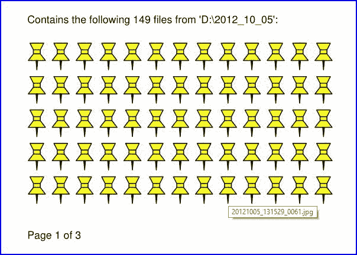

# 图像

> 原文：[`pymupdf.readthedocs.io/en/latest/recipes-images.html`](https://pymupdf.readthedocs.io/en/latest/recipes-images.html)

## 如何从文档页面创建图像

这个小脚本将获取一个文档文件名并生成每页的 PNG 文件。

文档可以是任何 支持的类型。

脚本作为一个命令行工具运行，需要将文件名作为参数提供。生成的图像文件（每页一个）存储在脚本所在的目录中：

```py
import sys, pymupdf  # import the bindings
fname = sys.argv[1]  # get filename from command line
doc = pymupdf.open(fname)  # open document
for page in doc:  # iterate through the pages
    pix = page.get_pixmap()  # render page to an image
    pix.save("page-%i.png" % page.number)  # store image as a PNG 
```

脚本目录现在将包含名为 *page-0.png*、*page-1.png* 等的 PNG 图像文件。图片的尺寸是其页面的宽度和高度取整，例如 A4 纵向页面的尺寸为 595 x 842 像素。它们的 x 和 y 维度分辨率为 96 dpi，并且没有透明度。您可以更改所有这些内容 - 要了解如何执行此操作，请阅读以下各节。

* * *  ## 如何增加图像分辨率

文档页面的图像由一个 Pixmap 表示，创建 Pixmap 的最简单方法是通过方法 `Page.get_pixmap()`。

此方法有许多选项可以影响结果。其中最重要的是 Matrix，它允许您缩放、旋转、扭曲或镜像结果。

`Page.get_pixmap()` 默认将使用 Identity 矩阵，不起任何作用。

在以下示例中，我们对每个维度应用了 2 倍的缩放因子，这将为我们生成一个四倍更好分辨率的图像（并且大约增加了 4 倍的大小）：

```py
zoom_x = 2.0  # horizontal zoom
zoom_y = 2.0  # vertical zoom
mat = pymupdf.Matrix(zoom_x, zoom_y)  # zoom factor 2 in each dimension
pix = page.get_pixmap(matrix=mat)  # use 'mat' instead of the identity matrix 
```

自从版本 1.19.2 开始，有一种更直接的设置分辨率的方法：可以使用参数 `"dpi"`（每英寸点数）代替 `"matrix"`。要创建一个 300 dpi 分辨率的页面图像，请指定 `pix = page.get_pixmap(dpi=300)`。除了简洁的标记法之外，这种方法的额外优势在于 **dpi 值保存在图像文件中**，而在使用矩阵标记时不会自动发生这种情况。

* * *  ## 如何创建部分图像（剪辑）

并不总是需要或希望获取页面的完整图像。例如，在您将图像显示在 GUI 中并希望填充页面的缩放部分时，就是这种情况。

假设您的 GUI 窗口可以显示完整的文档页面，但现在您希望将页面的右下角四分之一填充到这个区域，从而使用四倍更好的分辨率。

要实现这一点，请定义一个与 GUI 中要显示的区域相等的矩形并称其为“clip”。在 PyMuPDF 中构造矩形的一种方法是提供两个对角相对的角，这就是我们在这里做的。


```py
mat = pymupdf.Matrix(2, 2)  # zoom factor 2 in each direction
rect = page.rect  # the page rectangle
mp = (rect.tl + rect.br) / 2  # its middle point, becomes top-left of clip
clip = pymupdf.Rect(mp, rect.br)  # the area we want
pix = page.get_pixmap(matrix=mat, clip=clip) 
```

在上述过程中，我们通过指定两个对角点构造*clip*：页面矩形的中点*mp*和其右下角*rect.br*。

* * *  ## 如何将剪辑缩放到 GUI 窗口

请还要阅读前面的部分。这次我们想要计算一个剪辑的缩放因子，使其图像最适合给定的 GUI 窗口。这意味着图像的宽度或高度（或两者）将等于窗口尺寸。对于下面的代码段，您需要提供 GUI 窗口的 WIDTH 和 HEIGHT，以接收页面的剪辑矩形。

```py
# WIDTH: width of the GUI window
# HEIGHT: height of the GUI window
# clip: a subrectangle of the document page
# compare width/height ratios of image and window

if clip.width / clip.height < WIDTH / HEIGHT:
    # clip is narrower: zoom to window HEIGHT
    zoom = HEIGHT / clip.height
else:  # clip is broader: zoom to window WIDTH
    zoom = WIDTH / clip.width
mat = pymupdf.Matrix(zoom, zoom)
pix = page.get_pixmap(matrix=mat, clip=clip) 
```

对于另一种方式，现在假设你**有**缩放因子，并且需要**计算适合的剪辑**。

在这种情况下，我们有`zoom = HEIGHT/clip.height = WIDTH/clip.width`，因此我们必须设置`clip.height = HEIGHT/zoom`和`clip.width = WIDTH/zoom`。选择页面上剪辑的左上点`tl`来计算正确的像素图：

```py
width = WIDTH / zoom
height = HEIGHT / zoom
clip = pymupdf.Rect(tl, tl.x + width, tl.y + height)
# ensure we still are inside the page
clip &= page.rect
mat = pymupdf.Matrix(zoom, zoom)
pix = pymupdf.Pixmap(matrix=mat, clip=clip) 
```

* * *  ## 如何创建或禁止注释图像

通常，页面的像素图还显示页面的注释。偶尔，这可能不是理想的。

要在渲染页面上禁止注释图像，只需在`Page.get_pixmap()`中指定`annots=False`。

你也可以单独渲染注释：它们有自己的`Annot.get_pixmap()`方法。生成的像素图的尺寸与注释矩形相同。

* * *  ## 如何提取图像：非 PDF 文档

与前面的部分相比，本节处理从文档中**提取**包含的图像，以便它们可以作为一个或多个页面的一部分显示。

如果你想要将原始图像重新创建为文件形式或内存区域，基本上有两个选择：

1.  将文档转换为 PDF，然后使用 PDF-only 提取方法之一。此片段将文档转换为 PDF：

    ```py
    >>> pdfbytes = doc.convert_to_pdf()  # this a bytes object
    >>> pdf = pymupdf.open("pdf", pdfbytes)  # open it as a PDF document
    >>> # now use 'pdf' like any PDF document 
    ```

1.  使用带有“dict”参数的`Page.get_text()`。这适用于所有文档类型。它将提取页面上显示的所有文本和图像，格式化为 Python 字典。每个图像将出现在一个图像块中，包含元信息和**二进制图像数据**。有关字典结构的详细信息，请参阅 TextPage。该方法同样适用于 PDF 文件。这将创建一个显示在页面上所有图像的列表：

    ```py
    >>> d = page.get_text("dict")
    >>> blocks = d["blocks"]  # the list of block dictionaries
    >>> imgblocks = [b for b in blocks if b["type"] == 1]
    >>> pprint(imgblocks[0])
    {'bbox': (100.0, 135.8769989013672, 300.0, 364.1230163574219),
     'bpc': 8,
     'colorspace': 3,
     'ext': 'jpeg',
     'height': 501,
     'image': b'\xff\xd8\xff\xe0\x00\x10JFIF\...',  # CAUTION: LARGE!
     'size': 80518,
     'transform': (200.0, 0.0, -0.0, 228.2460174560547, 100.0, 135.8769989013672),
     'type': 1,
     'width': 439,
     'xres': 96,
     'yres': 96} 
    ```

* * *  ## 如何提取图像：PDF 文档

就像 PDF 中的任何其他“对象”一样，图像由交叉引用号（`xref`，一个整数）标识。如果你知道这个号码，你有两种方式访问图像的数据：

1.  使用指令*pix = pymupdf.Pixmap(doc, xref)*创建 Pixmap 图像。此方法**非常**快（单个数字微秒）。像素图的属性（宽度、高度等）将反映图像的属性。在这种情况下，无法确定嵌入原始图像的格式。

1.  **提取**图像使用*img = doc.extract_image(xref)*。 这是一个包含二进制图像数据的字典，如*img[“image”]*所示。还提供了许多元数据，大多数与图像的像素图中的内容相同。主要区别在于字符串*img[“ext”]*，它指定图像格式：除了“png”外，还可能出现像“jpeg”、“bmp”、“tiff”等。如果要存储到磁盘，请使用此字符串作为文件扩展名。与*pix = pymupdf.Pixmap(doc, xref);pix.tobytes()*语句的组合速度相比，此方法的执行速度应该要快。如果嵌入的图像是 PNG 格式，则`Document.extract_image()`的速度大致相同（且二进制图像数据相同）。否则，此方法**快几千倍**，而且**图像数据要小得多**。

问题是：“**我怎么知道这些‘xref’图像的编号呢？**” 这有两个答案：

1.  **“检查页面对象：”** 遍历`Page.get_images()`的项目。它是一个列表的列表，其项目看起来像*[xref, smask, …]*，包含一个图像的 xref。然后可以使用其中一种以上的方法。对于**有效（未损坏）**的文档，请使用此方法。但请注意，同一图像可能被多个页面引用，因此可能需要提供一个机制以避免多次提取。

1.  **“不需要知道：”** 遍历文档的所有 xrefs 列表，并对每个执行`Document.extract_image()`。如果返回的字典为空，则继续 – 此 xref 不是图像。如果 PDF 文件损坏（不可用页面），请使用此方法。请注意，PDF 文件通常包含“伪图像”（“模板掩码”），用于定义其他图像的透明度。您可能希望提供逻辑以排除这些内容的提取。还可以查看下一节。

对于这两种提取方法，都存在可用的通用脚本：

[extract-from-pages.py](https://github.com/pymupdf/PyMuPDF-Utilities/blob/master/examples/extract-images/extract-from-pages.py) 逐页提取图像：


而[extract-from-xref.py](https://github.com/pymupdf/PyMuPDF-Utilities/blob/master/examples/extract-images/extract-from-xref.py)通过 xref 表提取图像：


* * *  ## 如何处理图像蒙版

PDF 中的一些图像附带**图像蒙版**。在最简单的形式中，蒙版表示为单独存储的 alpha（透明度）字节图像。为了重建具有蒙版的图像的原始图像，必须使用蒙版中的透明度字节对其进行“丰富”。

在 PyMuPDF 中，判断图像是否具有蒙版可以通过以下两种方式之一进行识别：

1.  `Document.get_page_images()`的一项具有一般格式`(xref, smask, ...)`, 其中*xref*是图像的`xref`，如果*smask*为正，则是蒙版的`xref`。

1.  `Document.extract_image()`的结果（字典）具有一个键*“smask”*，该键还包含任何蒙版的`xref`（如果为正）。

如果*smask == 0*，那么通过`xref`遇到的图像可以按原样处理。

使用 PyMuPDF 恢复原始图像，必须执行以下所示的过程：


```py
>>> pix1 = pymupdf.Pixmap(doc.extract_image(xref)["image"])    # (1) pixmap of image w/o alpha
>>> mask = pymupdf.Pixmap(doc.extract_image(smask)["image"])   # (2) mask pixmap
>>> pix = pymupdf.Pixmap(pix1, mask)                           # (3) copy of pix1, image mask added 
```

第一步创建基本图像的位图。第二步对图像蒙版执行相同操作。第三步添加一个 alpha 通道并填充透明度信息。

上面的脚本[extract-from-pages.py](https://github.com/pymupdf/PyMuPDF-Utilities/blob/master/examples/extract-images/extract-from-pages.py)和[extract-from-xref.py](https://github.com/pymupdf/PyMuPDF-Utilities/blob/master/examples/extract-images/extract-from-xref.py)也包含此逻辑。

* * *  ## 如何制作所有图片（或文件）的一个 PDF

我们在这里展示**三个脚本**，它们接受一个（图像和其他）文件列表，并将它们全部放入一个 PDF 中。

**方法 1: 将图像插入为页面**

第一个方法将每个图像转换为具有相同尺寸的 PDF 页面。结果将是一个 PDF，每个图像占一页。它仅适用于支持的图像文件格式：

```py
import os, pymupdf
import PySimpleGUI as psg  # for showing a progress bar
doc = pymupdf.open()  # PDF with the pictures
imgdir = "D:/2012_10_05"  # where the pics are
imglist = os.listdir(imgdir)  # list of them
imgcount = len(imglist)  # pic count

for i, f in enumerate(imglist):
    img = pymupdf.open(os.path.join(imgdir, f))  # open pic as document
    rect = img[0].rect  # pic dimension
    pdfbytes = img.convert_to_pdf()  # make a PDF stream
    img.close()  # no longer needed
    imgPDF = pymupdf.open("pdf", pdfbytes)  # open stream as PDF
    page = doc.new_page(width = rect.width,  # new page with ...
                       height = rect.height)  # pic dimension
    page.show_pdf_page(rect, imgPDF, 0)  # image fills the page
    psg.EasyProgressMeter("Import Images",  # show our progress
        i+1, imgcount)

doc.save("all-my-pics.pdf") 
```

这将生成一个 PDF，大小仅比合并的图片总大小略大。一些性能数据：

上述脚本在我的机器上对 149 张总大小为 514 MB 的图片需要大约 1 分钟时间（生成的 PDF 大小大致相同）。


查看[这里](https://github.com/pymupdf/PyMuPDF-Utilities/blob/master/examples/insert-images/insert.py)获取更完整的源代码：它提供了一个目录选择对话框，并跳过不支持的文件和非文件条目。

注意

我们本可以使用`Page.insert_image()`而不是`Page.show_pdf_page()`来创建一个外观类似的文件。然而，根据图像类型的不同，可能会存储**未压缩的图像**。因此，必须使用保存选项*deflate = True*以获得合理的文件大小，这会大大增加处理大量图像的运行时间。因此，在此**不推荐使用**这种替代方法。

**方法 2：嵌入文件**

第二个脚本**嵌入**任意文件 - 不仅仅是图片。由于技术原因，生成的 PDF 将只有一页（空白页）。要稍后再次访问嵌入的文件，您需要一个能够显示和/或提取嵌入文件的合适 PDF 查看器：

```py
import os, pymupdf
import PySimpleGUI as psg  # for showing progress bar
doc = pymupdf.open()  # PDF with the pictures
imgdir = "D:/2012_10_05"  # where my files are

imglist = os.listdir(imgdir)  # list of pictures
imgcount = len(imglist)  # pic count
imglist.sort()  # nicely sort them

for i, f in enumerate(imglist):
    img = open(os.path.join(imgdir,f), "rb").read()  # make pic stream
    doc.embfile_add(img, f, filename=f,  # and embed it
                        ufilename=f, desc=f)
    psg.EasyProgressMeter("Embedding Files",  # show our progress
        i+1, imgcount)

page = doc.new_page()  # at least 1 page is needed

doc.save("all-my-pics-embedded.pdf") 
```


这绝对是最快的方法，同时也能生成最小可能的输出文件大小。上述图片在我的设备上花了 20 秒，并生成了一个大小为 510 MB 的 PDF 文件。查看[这里](https://github.com/pymupdf/PyMuPDF-Utilities/tree/master/examples/embed-images/embed.py)获取更完整的源代码：它提供了一个目录选择对话框，并跳过非文件条目。

**方法 3：附加文件**

第三种完成此任务的方法是通过页面注释**附加文件**，请参见[此处](https://github.com/pymupdf/PyMuPDF-Utilities/blob/master/examples/attach-images/attach.py)获取完整的源代码。

这与前一个脚本具有类似的性能，并且还会产生类似的文件大小。它将为每个附加文件生成显示“文件附件”图标的 PDF 页面。



注意

**嵌入**和**附加**方法都可以用于**任意文件** - 不只是图片。

注意

我们强烈推荐使用令人惊叹的包[PySimpleGUI](https://pypi.org/project/PySimpleGUI/)来显示任务可能运行时间较长的进度条。它纯粹使用 Python，使用 Tkinter（无需额外的 GUI 包），并且只需要增加一行代码！

* * *  ## 如何创建矢量图像

创建文档页面图像的常规方法是`Page.get_pixmap()`。像素图表示栅格图像，因此您必须在创建时决定其质量（即分辨率）。以后不能更改。

PyMuPDF 还提供了一种方法来创建页面的**矢量图像**，以 SVG 格式（可伸缩矢量图形，以 XML 语法定义）。SVG 图像在缩放级别上保持精确（当然，其中嵌入的任何栅格图形元素除外）。

指令 *svg = page.get_svg_image(matrix=pymupdf.Identity)* 提供了一个 UTF-8 字符串 *svg*，可以使用扩展名“.svg”存储。

* * *  ## 如何转换图像

作为一个特性，PyMuPDF 的图像转换很简单。在许多情况下，可以避免使用其他图形包如 PIL/Pillow。

尽管与 Pillow 的交互几乎是微不足道的。

| **输入格式** | **输出格式** | **描述** |
| --- | --- | --- |
| BMP | . | Windows 位图 |
| JPEG | JPEG | 联合图像专家组 |
| JXR | . | JPEG 扩展范围 |
| JPX/JP2 | . | JPEG 2000 |
| GIF | . | 图形互换格式 |
| TIFF | . | 标记图像文件格式 |
| PNG | PNG | 便携网络图形 |
| PNM | PNM | 便携任意映射 |
| PGM | PGM | 便携灰度图 |
| PBM | PBM | 便携位图 |
| PPM | PPM | 便携像素图 |
| PAM | PAM | 便携任意映射 |
| . | PSD | Adobe Photoshop 文档 |
| . | PS | Adobe Postscript |

一般方案仅为以下两行：

```py
pix = pymupdf.Pixmap("input.xxx")  # any supported input format
pix.save("output.yyy")  # any supported output format 
```

**备注**

1.  *pymupdf.Pixmap(arg)* 的 **input** 参数可以是包含图像的文件或 bytes / io.BytesIO 对象。

1.  不仅仅可以创建输出 **文件**，还可以通过 *pix.tobytes(“yyy”)* 创建一个 bytes 对象并传递它。

1.  当然，输入和输出格式在颜色空间和透明度方面必须兼容。如果需要调整，*Pixmap* 类已经内置了电池。

注意

**将 JPEG 转换为 Photoshop**：

```py
pix = pymupdf.Pixmap("myfamily.jpg")
pix.save("myfamily.psd") 
```

注意

将 **JPEG 转换为 Tkinter 的 PhotoImage**。任何 **RGB / 无 alpha** 图像效果相同。将其转换为一个 **便携任意映射** 格式（如 PPM、PGM 等）即可，因为所有的 Tkinter 版本都支持它们：

```py
import tkinter as tk
pix = pymupdf.Pixmap("input.jpg")  # or any RGB / no-alpha image
tkimg = tk.PhotoImage(data=pix.tobytes("ppm")) 
```

注意

将 **带 alpha 通道的 PNG** 转换为 Tkinter 的 PhotoImage，这需要在进行 PPM 转换之前 **移除 alpha 字节**：

```py
import tkinter as tk
pix = pymupdf.Pixmap("input.png")  # may have an alpha channel
if pix.alpha:  # we have an alpha channel!
    pix = pymupdf.Pixmap(pix, 0)  # remove it
tkimg = tk.PhotoImage(data=pix.tobytes("ppm")) 
```

* * *  ## 如何使用 Pixmaps: 粘贴图像

这显示了如何仅用于图形、非文档目的的 pixmap。脚本读取一个图像文件并创建一个新图像，该图像由原始图像的 3 * 4 个瓦片组成：

```py
import pymupdf
src = pymupdf.Pixmap("img-7edges.png")      # create pixmap from a picture
col = 3                                  # tiles per row
lin = 4                                  # tiles per column
tar_w = src.width * col                  # width of target
tar_h = src.height * lin                 # height of target

# create target pixmap
tar_pix = pymupdf.Pixmap(src.colorspace, (0, 0, tar_w, tar_h), src.alpha)

# now fill target with the tiles
for i in range(col):
    for j in range(lin):
        src.set_origin(src.width * i, src.height * j)
        tar_pix.copy(src, src.irect) # copy input to new loc

tar_pix.save("tar.png") 
```

这是输入图片：


这是输出：


* * *  ## 如何使用 Pixmaps: 制作分形

这是另一个 Pixmap 的示例，创建了 **谢尔宾斯基地毯** —— 一种将 **康托集** 广义化到二维的分形。给定一个正方形地毯，标记其 9 个子方块（3 * 3），并切掉中心的一个。以相同方式处理每个剩余的八个子方块，并继续 *ad infinitum*。最终结果是一个面积为零且分形维度为 1.8928... 的集合。

此脚本以 PNG 的形式创建其近似图像，通过一像素粒度下降。要增加图像精度，改变 n 的值（精度）：

```py
import pymupdf, time
if not list(map(int, pymupdf.VersionBind.split("."))) >= [1, 14, 8]:
    raise SystemExit("need PyMuPDF v1.14.8 for this script")
n = 6                             # depth (precision)
d = 3**n                          # edge length

t0 = time.perf_counter()
ir = (0, 0, d, d)                 # the pixmap rectangle

pm = pymupdf.Pixmap(pymupdf.csRGB, ir, False)
pm.set_rect(pm.irect, (255,255,0)) # fill it with some background color

color = (0, 0, 255)               # color to fill the punch holes

# alternatively, define a 'fill' pixmap for the punch holes
# this could be anything, e.g. some photo image ...
fill = pymupdf.Pixmap(pymupdf.csRGB, ir, False) # same size as 'pm'
fill.set_rect(fill.irect, (0, 255, 255))   # put some color in

def punch(x, y, step):
  """Recursively "punch a hole" in the central square of a pixmap.

 Arguments are top-left coords and the step width.

 Some alternative punching methods are commented out.
 """
    s = step // 3                 # the new step
    # iterate through the 9 sub-squares
    # the central one will be filled with the color
    for i in range(3):
        for j in range(3):
            if i != j or i != 1:  # this is not the central cube
                if s >= 3:        # recursing needed?
                    punch(x+i*s, y+j*s, s)       # recurse
            else:                 # punching alternatives are:
                pm.set_rect((x+s, y+s, x+2*s, y+2*s), color)     # fill with a color
                #pm.copy(fill, (x+s, y+s, x+2*s, y+2*s))  # copy from fill
                #pm.invert_irect((x+s, y+s, x+2*s, y+2*s))       # invert colors

    return

#==============================================================================
# main program
#==============================================================================
# now start punching holes into the pixmap
punch(0, 0, d)
t1 = time.perf_counter()
pm.save("sierpinski-punch.png")
t2 = time.perf_counter()
print ("%g sec to create / fill the pixmap" % round(t1-t0,3))
print ("%g sec to save the image" % round(t2-t1,3)) 
```

结果应该看起来像这样：


* * *  ## 如何与 NumPy 接口

这显示了如何从 NumPy 数组创建 PNG 文件（比大多数其他方法快几倍）：

```py
import numpy as np
import pymupdf
#==============================================================================
# create a fun-colored width * height PNG with pymupdf and numpy
#==============================================================================
height = 150
width  = 100
bild = np.ndarray((height, width, 3), dtype=np.uint8)

for i in range(height):
    for j in range(width):
        # one pixel (some fun coloring)
        bild[i, j] = [(i+j)%256, i%256, j%256]

samples = bytearray(bild.tostring())    # get plain pixel data from numpy array
pix = pymupdf.Pixmap(pymupdf.csRGB, width, height, samples, alpha=False)
pix.save("test.png") 
```

* * *  ## 如何向 PDF 页面添加图像

向 PDF 页面添加图像有两种方法：`Page.insert_image()` 和 `Page.show_pdf_page()`。这两种方法有共同之处，但也有不同之处。

| **标准** | `Page.insert_image()` | `Page.show_pdf_page()` |
| --- | --- | --- |
| 可显示内容 | 图像文件，内存中的图像，像素图 | PDF 页面 |
| 显示分辨率 | 图像分辨率 | 矢量化（除了位图页面内容） |
| 旋转 | 0、90、180 或 270 度 | 任意角度 |
| 裁剪 | 否（仅完整图像） | 是 |
| 保持长宽比 | 是（默认选项） | 是（默认选项） |
| 透明度（水印） | 取决于图像 | 取决于页面 |
| 位置 / 放置 | 缩放以适应目标矩形 | 缩放以适应目标矩形 |
| 性能 | 自动防止重复； | 自动防止重复； |
| 多页图像支持 | 否 | 是 |
| 使用简便性 | 简单，直观； | 简单，直观； **转换为 PDF 后适用于所有文档类型**（包括图像！）通过 `Document.convert_to_pdf()` |

`Page.insert_image()` 的基本代码模式。如果不是重新插入现有图像，则必须给出 **文件名 / 流 / 像素图** 参数中的**一个**：

```py
page.insert_image(
    rect,                  # where to place the image (rect-like)
    filename=None,         # image in a file
    stream=None,           # image in memory (bytes)
    pixmap=None,           # image from pixmap
    mask=None,             # specify alpha channel separately
    rotate=0,              # rotate (int, multiple of 90)
    xref=0,                # re-use existing image
    oc=0,                  # control visibility via OCG / OCMD
    keep_proportion=True,  # keep aspect ratio
    overlay=True,          # put in foreground
) 
```

`Page.show_pdf_page()` 的基本代码模式。源 PDF 和目标 PDF 必须是不同的 Document 对象（但可以从同一文件打开）：

```py
page.show_pdf_page(
    rect,                  # where to place the image (rect-like)
    src,                   # source PDF
    pno=0,                 # page number in source PDF
    clip=None,             # only display this area (rect-like)
    rotate=0,              # rotate (float, any value)
    oc=0,                  # control visibility via OCG / OCMD
    keep_proportion=True,  # keep aspect ratio
    overlay=True,          # put in foreground
) 
```  ## 如何使用像素图：检查文本可见性

文本是否实际可见取决于多个因素：

1.  文本没有被其他对象覆盖，但可能与背景色相同，例如白色字体在白色背景上等。

1.  文本可能被图像或矢量图覆盖。检测这一点是一项重要的功能，例如用于揭示不当匿名化的法律文件。

1.  文本是隐藏创建的。这种技术通常由 OCR 工具使用，将识别的文本存储在页面上的不可见层中。

下面展示了如何检测情况 1\. 或者情况 2\. 如果遮盖物是单色的话：

```py
pix = page.get_pixmap(dpi=150)  # make page image with a decent resolution

# the following matrix transforms page to pixmap coordinates
mat = page.rect.torect(pix.irect)

# search for some string "needle"
rlist = page.search_for("needle")
# check the visibility for each hit rectangle
for rect in rlist:
    if pix.color_topusage(clip=rect * mat)[0] > 0.95:
        print("'needle' is invisible here:", rect) 
```

方法 `Pixmap.color_topusage()` 返回一个元组 `(ratio, pixel)`，其中 0 < ratio <= 1，*pixel* 是颜色的像素值。请注意，我们仅创建一次**像素图**。如果有多个命中矩形，这可以节省大量处理时间。

上述代码的逻辑是：如果针的矩形是“几乎”单色的（> 95%），则文本不可见。对于可见文本的典型结果返回背景色（通常是白色）和约为 0.7 到 0.8 的比率，例如 `(0.685, b'xffxffxff')`。

你对这个页面有什么反馈吗？

* * *

本软件按原样提供，不提供任何明示或暗示的担保。本软件在许可下分发，并且除非在该许可条款明确授权下，否则不得复制、修改或分发。请参考 [artifex.com](https://www.artifex.com?utm_source=rtd-pymupdf&utm_medium=rtd&utm_content=footer-link) 获取许可信息或联系 Artifex Software Inc.，39 Mesa Street，Suite 108A，San Francisco CA 94129，美国，以获取进一步的信息。

本文档覆盖所有版本，直至 1.24.4。

 ## 如何从文档页面创建图像

这个小脚本将接受文档文件名，并为每一页生成一个 PNG 文件。

文档可以是任何 支持的类型。

该脚本作为一个命令行工具运行，需要将文件名作为参数提供。生成的图像文件（每页一个）存储在脚本的目录中：

```py
import sys, pymupdf  # import the bindings
fname = sys.argv[1]  # get filename from command line
doc = pymupdf.open(fname)  # open document
for page in doc:  # iterate through the pages
    pix = page.get_pixmap()  # render page to an image
    pix.save("page-%i.png" % page.number)  # store image as a PNG 
```

现在脚本目录下将包含命名为 *page-0.png*、*page-1.png* 等的 PNG 图像文件。图片的尺寸与其页面的宽度和高度四舍五入为整数，例如 A4 纵向页面的尺寸为 595 x 842 像素。它们在 x 和 y 维度上具有 96 dpi 的分辨率，并且没有透明度。您可以更改所有这些内容-有关如何操作，请阅读下面的部分。

* * *

## 如何增加图像分辨率

文档页面的图像由 Pixmap 表示，创建像素图的最简单方法是通过方法 `Page.get_pixmap()`。

此方法有许多选项可以影响结果。其中最重要的是 Matrix，它允许您缩放、旋转、扭曲或镜像结果。

`Page.get_pixmap()` 默认将使用 Identity 矩阵，即不进行任何操作。

在以下示例中，我们对每个维度应用了 2 倍的缩放因子，这将为我们生成具有四倍更好分辨率的图像（大约也是四倍的大小）：

```py
zoom_x = 2.0  # horizontal zoom
zoom_y = 2.0  # vertical zoom
mat = pymupdf.Matrix(zoom_x, zoom_y)  # zoom factor 2 in each dimension
pix = page.get_pixmap(matrix=mat)  # use 'mat' instead of the identity matrix 
```

自 1.19.2 版本起，有一种更直接的设置分辨率的方法：参数 `"dpi"`（每英寸点数）可以用于替换 `"matrix"`。要创建页面的 300 dpi 图像，请指定 `pix = page.get_pixmap(dpi=300)`。除了表示简洁外，这种方法的另一个优点是 **dpi 值将与图像文件一起保存** —— 使用矩阵表示时不会自动发生这种情况。

* * *

## 如何创建部分位图（剪辑）

并非总是需要或想要完整的页面图像。例如，当您在 GUI 中显示图像并希望用页面的放大部分填充相应的窗口时，就是这种情况。

假设你的 GUI 窗口有足够的空间来显示完整的文档页面，但现在你想要用页面的右下角的四分之一来填充这个空间，从而使用四倍更好的分辨率。

为了实现这一点，请定义一个等于您希望显示在 GUI 中的区域的矩形，并将其命名为“剪辑”。在 PyMuPDF 中构建矩形的一种方式是提供两个对角线相对的角，这就是我们在这里做的事情。


```py
mat = pymupdf.Matrix(2, 2)  # zoom factor 2 in each direction
rect = page.rect  # the page rectangle
mp = (rect.tl + rect.br) / 2  # its middle point, becomes top-left of clip
clip = pymupdf.Rect(mp, rect.br)  # the area we want
pix = page.get_pixmap(matrix=mat, clip=clip) 
```

在上面的例子中，我们通过指定两个对角线相对的点来构造*剪辑*：页面矩形的中点*mp*和它的右下角*rect.br*。

* * *

## 如何将剪辑缩放到 GUI 窗口

请还请阅读前一节。这次我们想要**计算剪辑的缩放因子**，以便其图像最适合给定的 GUI 窗口。这意味着图像的宽度或高度（或两者）将等于窗口尺寸。对于以下代码片段，您需要提供 GUI 窗口的 WIDTH 和 HEIGHT，该窗口应接收页面的剪辑矩形。

```py
# WIDTH: width of the GUI window
# HEIGHT: height of the GUI window
# clip: a subrectangle of the document page
# compare width/height ratios of image and window

if clip.width / clip.height < WIDTH / HEIGHT:
    # clip is narrower: zoom to window HEIGHT
    zoom = HEIGHT / clip.height
else:  # clip is broader: zoom to window WIDTH
    zoom = WIDTH / clip.width
mat = pymupdf.Matrix(zoom, zoom)
pix = page.get_pixmap(matrix=mat, clip=clip) 
```

对于另一种情况，现在假设您**已有**缩放因子并且需要**计算适合的剪辑**。

在这种情况下，我们有 `zoom = HEIGHT/clip.height = WIDTH/clip.width`，因此我们必须设置 `clip.height = HEIGHT/zoom` 和 `clip.width = WIDTH/zoom`。选择页面上剪辑的左上角点`tl`来计算正确的位图：

```py
width = WIDTH / zoom
height = HEIGHT / zoom
clip = pymupdf.Rect(tl, tl.x + width, tl.y + height)
# ensure we still are inside the page
clip &= page.rect
mat = pymupdf.Matrix(zoom, zoom)
pix = pymupdf.Pixmap(matrix=mat, clip=clip) 
```

* * *

## 如何创建或抑制注释图片

通常，页面的位图还显示页面的注释。偶尔，这可能是不可取的。

要在渲染页面上抑制注释图片，只需在`Page.get_pixmap()`中指定`annots=False`。

您还可以单独呈现注释：它们有自己的`Annot.get_pixmap()`方法。结果位图的尺寸与注释矩形相同。

* * *

## 如何提取图片：非 PDF 文档

与前几节相反，这一节涉及**提取**文档中**包含的**图像，以便它们可以作为一个或多个页面的一部分显示。

如果您想要以文件形式或作为内存区域重新创建原始图像，您基本上有两个选项：

1.  将您的文档转换为 PDF，然后使用其中一个仅适用于 PDF 的提取方法。此代码片段将文档转换为 PDF：

    ```py
    >>> pdfbytes = doc.convert_to_pdf()  # this a bytes object
    >>> pdf = pymupdf.open("pdf", pdfbytes)  # open it as a PDF document
    >>> # now use 'pdf' like any PDF document 
    ```

1.  使用 `Page.get_text()` 方法和 “dict” 参数。适用于所有文档类型。将提取页面上显示的所有文本和图像，格式化为 Python 字典。每个图像将出现在图像块中，包含元信息和**二进制图像数据**。有关字典结构的详细信息，请参阅 TextPage。该方法同样适用于 PDF 文件。这将创建页面上显示的所有图像的列表：

    ```py
    >>> d = page.get_text("dict")
    >>> blocks = d["blocks"]  # the list of block dictionaries
    >>> imgblocks = [b for b in blocks if b["type"] == 1]
    >>> pprint(imgblocks[0])
    {'bbox': (100.0, 135.8769989013672, 300.0, 364.1230163574219),
     'bpc': 8,
     'colorspace': 3,
     'ext': 'jpeg',
     'height': 501,
     'image': b'\xff\xd8\xff\xe0\x00\x10JFIF\...',  # CAUTION: LARGE!
     'size': 80518,
     'transform': (200.0, 0.0, -0.0, 228.2460174560547, 100.0, 135.8769989013672),
     'type': 1,
     'width': 439,
     'xres': 96,
     'yres': 96} 
    ```

* * *

## 如何提取图像：PDF 文档

就像 PDF 中的任何其他“对象”一样，图像由交叉引用编号（`xref`，整数）标识。如果您知道这个编号，您有两种方法可以访问图像的数据：

1.  **创建**一个 Pixmap 图像，使用指令 *pix = pymupdf.Pixmap(doc, xref)*。该方法**非常**快速（单个数字微秒）。Pixmap 的属性（宽度、高度等）将反映图像的属性。在这种情况下，无法确定嵌入原始图像的图像格式。

1.  **提取**图像，使用 *img = doc.extract_image(xref)*。这是一个包含二进制图像数据的字典，如 *img[“image”]* 所示。还提供了许多元数据 – 大多数与图像的 Pixmap 中相同。主要区别在于字符串 *img[“ext”]*，它指定图像格式：除了“png”外，还可以出现像“jpeg”、“bmp”、“tiff”等的字符串。如果要将其存储到磁盘，请使用此字符串作为文件扩展名。此方法的执行速度应与语句 *pix = pymupdf.Pixmap(doc, xref); pix.tobytes()* 的组合速度进行比较。如果嵌入的图像是 PNG 格式，则 `Document.extract_image()` 的速度大约相同（并且二进制图像数据相同）。否则，此方法**快几千倍**，并且**图像数据更小**。

问题仍然是：“**如何知道这些‘xref’图像的编号？**”。对此有两个答案：

1.  **“检查页面对象：”** 遍历 `Page.get_images()` 的项。这是一个列表的列表，其项看起来像 *[xref, smask, …]*，包含图像的 `xref`。然后可以使用其中一个上述方法使用此 `xref`。对于**有效（未损坏）**文档使用此方法要小心。然而，请注意，同一图像可能被多个页面引用，因此可能需要提供机制以避免多次提取。

1.  **“不需要知道：”** 遍历文档的所有 xref 列表，并对每个执行 `Document.extract_image()`。如果返回的字典为空，则继续 - 此`xref`不是图像。如果 PDF 文件损坏（无法使用的页面），请使用此方法。注意，PDF 文件通常包含具有特殊目的（定义其他图像的透明度）的“伪图像”（“模版掩码”）。您可能希望提供逻辑来排除这些内容的提取。也请查看下一节。

对于这两种提取方法，都有现成的通用脚本可供使用：

[extract-from-pages.py](https://github.com/pymupdf/PyMuPDF-Utilities/blob/master/examples/extract-images/extract-from-pages.py) 按页提取图像：


和 [extract-from-xref.py](https://github.com/pymupdf/PyMuPDF-Utilities/blob/master/examples/extract-images/extract-from-xref.py) 通过 xref 表提取图像：


* * *

## 如何处理图像掩码

PDF 中的某些图像伴随着**图像掩码**。在最简单的形式下，掩码表示作为单独图像存储的 alpha（透明度）字节。为了重建具有掩码的图像的原始图像，必须从其掩码中提取透明度字节来“丰富”它。

在 PyMuPDF 中可以通过以下两种方式之一识别图像是否有掩码：

1.  `Document.get_page_images()` 的项具有一般格式 `(xref, smask, ...)`，其中 *xref* 是图像的`xref`，如果 *smask* 为正，则为掩码的`xref`。

1.  `Document.extract_image()` 的（字典）结果具有一个 *“smask”* 键，如果为正，则包含任何掩码的`xref`。

如果 *smask == 0*，那么通过`xref`遇到的图像可以直接处理。

使用 PyMuPDF 恢复原始图像，需执行以下过程：


```py
>>> pix1 = pymupdf.Pixmap(doc.extract_image(xref)["image"])    # (1) pixmap of image w/o alpha
>>> mask = pymupdf.Pixmap(doc.extract_image(smask)["image"])   # (2) mask pixmap
>>> pix = pymupdf.Pixmap(pix1, mask)                           # (3) copy of pix1, image mask added 
```

步骤（1）创建基本图像的像素图。步骤（2）使用图像掩码完成相同操作。步骤（3）添加 alpha 通道并填充透明信息。

脚本 [extract-from-pages.py](https://github.com/pymupdf/PyMuPDF-Utilities/blob/master/examples/extract-images/extract-from-pages.py) 和 [extract-from-xref.py](https://github.com/pymupdf/PyMuPDF-Utilities/blob/master/examples/extract-images/extract-from-xref.py) 也包含此逻辑。

* * *

## 如何制作所有图片（或文件）的一个 PDF 文件

我们在这里展示了**三个脚本**，它们接受一个（图像和其他）文件列表，并将它们全部放入一个 PDF 中。

**方法 1：将图像插入为页面**

第一个脚本将每个图像转换为具有相同尺寸的 PDF 页面。结果将是一个每个图像一个页面的 PDF。它只适用于支持的图像文件格式：

```py
import os, pymupdf
import PySimpleGUI as psg  # for showing a progress bar
doc = pymupdf.open()  # PDF with the pictures
imgdir = "D:/2012_10_05"  # where the pics are
imglist = os.listdir(imgdir)  # list of them
imgcount = len(imglist)  # pic count

for i, f in enumerate(imglist):
    img = pymupdf.open(os.path.join(imgdir, f))  # open pic as document
    rect = img[0].rect  # pic dimension
    pdfbytes = img.convert_to_pdf()  # make a PDF stream
    img.close()  # no longer needed
    imgPDF = pymupdf.open("pdf", pdfbytes)  # open stream as PDF
    page = doc.new_page(width = rect.width,  # new page with ...
                       height = rect.height)  # pic dimension
    page.show_pdf_page(rect, imgPDF, 0)  # image fills the page
    psg.EasyProgressMeter("Import Images",  # show our progress
        i+1, imgcount)

doc.save("all-my-pics.pdf") 
```

这将生成一个 PDF 文件，大小仅比合并图片的大小稍大一点。一些关于性能的数字：

上述脚本在我的机器上用于 149 张图片大约需要 1 分钟，总共大小为 514 MB（生成的 PDF 文件大小大约相同）。


查看[这里](https://github.com/pymupdf/PyMuPDF-Utilities/blob/master/examples/insert-images/insert.py)获取更完整的源代码：它提供了一个目录选择对话框并跳过了不支持的文件和非文件条目。

注意

我们可以使用 `Page.insert_image()` 而不是 `Page.show_pdf_page()`，结果会是一个外观相似的文件。但是，根据图像类型，它可能以**未压缩的图像**存储。因此，必须使用保存选项 *deflate = True* 来获得合理的文件大小，这会极大地增加大量图像的运行时间。因此，在这里**不能推荐**这种替代方案。

**方法 2：嵌入文件**

第二个脚本**嵌入**了任意文件 - 不仅仅是图像。由于技术原因，生成的 PDF 将只有一页（空白）。要稍后再次访问嵌入的文件，您需要一个能够显示和/或提取嵌入文件的合适的 PDF 查看器：

```py
import os, pymupdf
import PySimpleGUI as psg  # for showing progress bar
doc = pymupdf.open()  # PDF with the pictures
imgdir = "D:/2012_10_05"  # where my files are

imglist = os.listdir(imgdir)  # list of pictures
imgcount = len(imglist)  # pic count
imglist.sort()  # nicely sort them

for i, f in enumerate(imglist):
    img = open(os.path.join(imgdir,f), "rb").read()  # make pic stream
    doc.embfile_add(img, f, filename=f,  # and embed it
                        ufilename=f, desc=f)
    psg.EasyProgressMeter("Embedding Files",  # show our progress
        i+1, imgcount)

page = doc.new_page()  # at least 1 page is needed

doc.save("all-my-pics-embedded.pdf") 
```


这绝对是最快的方法，同时也产生了可能的最小输出文件大小。上述图片在我的机器上需要 20 秒，并生成了一个大小为 510 MB 的 PDF 文件。查看[这里](https://github.com/pymupdf/PyMuPDF-Utilities/tree/master/examples/embed-images/embed.py)获取更完整的源代码：它提供了一个目录选择对话框并跳过了非文件条目。

**方法 3：附加文件**

实现此任务的第三种方法是通过页面注释**附加文件**，请查看[这里](https://github.com/pymupdf/PyMuPDF-Utilities/blob/master/examples/attach-images/attach.py)获取完整的源代码。

这与前一个脚本具有类似的性能，并且也产生了类似的文件大小。它将为每个附加文件显示一个‘FileAttachment’图标的 PDF 页面。


注意

**嵌入**和**附加**方法都可用于**任意文件** - 不仅仅是图像。

注意

我们强烈建议使用出色的包[PySimpleGUI](https://pypi.org/project/PySimpleGUI/)来为可能运行较长时间的任务显示进度条。它纯粹使用 Tkinter（无需额外的 GUI 包），只需再加一行代码！

* * *

## 如何创建矢量图像

从文档页面创建图像的常规方法是`Page.get_pixmap()`。像素图表示一幅光栅图像，因此必须在创建时决定其质量（即分辨率）。后期无法更改。

PyMuPDF 还提供了一种方式来创建 SVG 格式（可缩放矢量图形，以 XML 语法定义）的**矢量图像**。SVG 图像在各种缩放级别下保持精确（当然除了其中嵌入的任何栅格图形元素）。

指令*svg = page.get_svg_image(matrix=pymupdf.Identity)*提供了一个 UTF-8 字符串*svg*，可以用扩展名“.svg”存储。

* * *

## 如何转换图像

就像 PyMuPDF 的一个特性一样，图像转换非常简单。在许多情况下，它可以避免使用其他图形包（如 PIL/Pillow）。

尽管与 Pillow 接口几乎是微不足道的。

| **输入格式** | **输出格式** | **描述** |
| --- | --- | --- |
| BMP | . | Windows 位图 |
| JPEG | JPEG | 联合图像专家组 |
| JXR | . | JPEG 扩展范围 |
| JPX/JP2 | . | JPEG 2000 |
| GIF | . | 图形交换格式 |
| TIFF | . | 标记图像文件格式 |
| PNG | PNG | 可移植网络图形 |
| PNM | PNM | 可移植任意图形 |
| PGM | PGM | 可移植灰度图 |
| PBM | PBM | 可移植位图 |
| PPM | PPM | 可移植像素图 |
| PAM | PAM | 可移植任意地图 |
| . | PSD | Adobe Photoshop 文档 |
| . | PS | Adobe Postscript |

基本方案仅包括以下两行：

```py
pix = pymupdf.Pixmap("input.xxx")  # any supported input format
pix.save("output.yyy")  # any supported output format 
```

**备注**

1.  *pymupdf.Pixmap(arg)*的**输入**参数可以是包含图像的文件或字节/io.BytesIO 对象。

1.  而不是一个输出**文件**，你也可以通过*pix.tobytes(“yyy”)*创建一个字节对象并传递它。

1.  当然，输入和输出格式在颜色空间和透明度方面必须兼容。如果需要调整，*Pixmap*类已经包括了相关功能。

注意

**将 JPEG 转换为 Photoshop**：

```py
pix = pymupdf.Pixmap("myfamily.jpg")
pix.save("myfamily.psd") 
```

注意

将**JPEG 转换为 Tkinter PhotoImage**。任何**RGB / 无 Alpha**图像的工作原理都是相同的。转换为**可移植任意图形**格式（PPM、PGM 等）是解决问题的方法，因为它们被所有 Tkinter 版本支持：

```py
import tkinter as tk
pix = pymupdf.Pixmap("input.jpg")  # or any RGB / no-alpha image
tkimg = tk.PhotoImage(data=pix.tobytes("ppm")) 
```

注意

将**带 Alpha 通道的 PNG 转换为 Tkinter PhotoImage**。这需要**移除 Alpha 字节**，然后进行 PPM 转换：

```py
import tkinter as tk
pix = pymupdf.Pixmap("input.png")  # may have an alpha channel
if pix.alpha:  # we have an alpha channel!
    pix = pymupdf.Pixmap(pix, 0)  # remove it
tkimg = tk.PhotoImage(data=pix.tobytes("ppm")) 
```

* * *

## 如何使用像素图：粘合图像

这展示了像素图如何用于纯粹的图形非文档目的。脚本读取图像文件并创建一个新图像，由原始图像的 3 * 4 个瓷砖组成：

```py
import pymupdf
src = pymupdf.Pixmap("img-7edges.png")      # create pixmap from a picture
col = 3                                  # tiles per row
lin = 4                                  # tiles per column
tar_w = src.width * col                  # width of target
tar_h = src.height * lin                 # height of target

# create target pixmap
tar_pix = pymupdf.Pixmap(src.colorspace, (0, 0, tar_w, tar_h), src.alpha)

# now fill target with the tiles
for i in range(col):
    for j in range(lin):
        src.set_origin(src.width * i, src.height * j)
        tar_pix.copy(src, src.irect) # copy input to new loc

tar_pix.save("tar.png") 
```

这是输入图片：


这是输出结果：


* * *

## 如何使用 Pixmaps：制作分形

这是另一个 Pixmap 示例，创建了**谢尔宾斯基地毯** - 将**康托集**推广到二维的分形。给定一个正方形地毯，标记其 9 个子正方形（3×3）并切除中心的一个。以相同方式处理剩下的八个子正方形，并*无限继续*。最终结果是一个面积为零、分形维度为 1.8928… 的集合。

此脚本通过一像素的粒度制作其近似图像，将其制作为 PNG。要增加图像的精度，请更改 n 的值（精度）：

```py
import pymupdf, time
if not list(map(int, pymupdf.VersionBind.split("."))) >= [1, 14, 8]:
    raise SystemExit("need PyMuPDF v1.14.8 for this script")
n = 6                             # depth (precision)
d = 3**n                          # edge length

t0 = time.perf_counter()
ir = (0, 0, d, d)                 # the pixmap rectangle

pm = pymupdf.Pixmap(pymupdf.csRGB, ir, False)
pm.set_rect(pm.irect, (255,255,0)) # fill it with some background color

color = (0, 0, 255)               # color to fill the punch holes

# alternatively, define a 'fill' pixmap for the punch holes
# this could be anything, e.g. some photo image ...
fill = pymupdf.Pixmap(pymupdf.csRGB, ir, False) # same size as 'pm'
fill.set_rect(fill.irect, (0, 255, 255))   # put some color in

def punch(x, y, step):
  """Recursively "punch a hole" in the central square of a pixmap.

 Arguments are top-left coords and the step width.

 Some alternative punching methods are commented out.
 """
    s = step // 3                 # the new step
    # iterate through the 9 sub-squares
    # the central one will be filled with the color
    for i in range(3):
        for j in range(3):
            if i != j or i != 1:  # this is not the central cube
                if s >= 3:        # recursing needed?
                    punch(x+i*s, y+j*s, s)       # recurse
            else:                 # punching alternatives are:
                pm.set_rect((x+s, y+s, x+2*s, y+2*s), color)     # fill with a color
                #pm.copy(fill, (x+s, y+s, x+2*s, y+2*s))  # copy from fill
                #pm.invert_irect((x+s, y+s, x+2*s, y+2*s))       # invert colors

    return

#==============================================================================
# main program
#==============================================================================
# now start punching holes into the pixmap
punch(0, 0, d)
t1 = time.perf_counter()
pm.save("sierpinski-punch.png")
t2 = time.perf_counter()
print ("%g sec to create / fill the pixmap" % round(t1-t0,3))
print ("%g sec to save the image" % round(t2-t1,3)) 
```

结果应该看起来像这样：


* * *

## 如何与 NumPy 交互

这显示了如何从一个 numpy 数组创建 PNG 文件（比大多数其他方法快几倍）：

```py
import numpy as np
import pymupdf
#==============================================================================
# create a fun-colored width * height PNG with pymupdf and numpy
#==============================================================================
height = 150
width  = 100
bild = np.ndarray((height, width, 3), dtype=np.uint8)

for i in range(height):
    for j in range(width):
        # one pixel (some fun coloring)
        bild[i, j] = [(i+j)%256, i%256, j%256]

samples = bytearray(bild.tostring())    # get plain pixel data from numpy array
pix = pymupdf.Pixmap(pymupdf.csRGB, width, height, samples, alpha=False)
pix.save("test.png") 
```

* * *

## 如何向 PDF 页面添加图像

有两种方法向 PDF 页面添加图像：`Page.insert_image()` 和 `Page.show_pdf_page()`。这两种方法有共同之处，但也有区别。

| **准则** | `Page.insert_image()` | `Page.show_pdf_page()` |
| --- | --- | --- |
| 可显示内容 | 图像文件、内存中的图像、Pixmap | PDF 页面 |
| 显示分辨率 | 图像分辨率 | 矢量化（除了光栅页面内容） |
| 旋转 | 0、90、180 或 270 度 | 任意角度 |
| 裁剪 | 否（仅完整图像） | 是 |
| 保持长宽比 | 是（默认选项） | 是（默认选项） |
| 透明度（水印） | 取决于图像 | 取决于页面 |
| 位置 / 放置 | 缩放以适应目标矩形 | 缩放以适应目标矩形 |
| 性能 | 自动防止重复； | 自动防止重复； |
| 多页面图像支持 | 否 | 是 |
| 使用便捷性 | 简单、直观； | 简单、直观；**转换为 PDF 后适用于所有文档类型（包括图像！）**通过 `Document.convert_to_pdf()` |

`Page.insert_image()` 的基本代码模式。如果不重新插入现有图像，则必须**恰好给出一个**参数**文件名 / 流 / Pixmap**：

```py
page.insert_image(
    rect,                  # where to place the image (rect-like)
    filename=None,         # image in a file
    stream=None,           # image in memory (bytes)
    pixmap=None,           # image from pixmap
    mask=None,             # specify alpha channel separately
    rotate=0,              # rotate (int, multiple of 90)
    xref=0,                # re-use existing image
    oc=0,                  # control visibility via OCG / OCMD
    keep_proportion=True,  # keep aspect ratio
    overlay=True,          # put in foreground
) 
```

`Page.show_pdf_page()` 的基本代码模式。源 PDF 和目标 PDF 必须是不同的 Document 对象（但可以从同一文件打开）：

```py
page.show_pdf_page(
    rect,                  # where to place the image (rect-like)
    src,                   # source PDF
    pno=0,                 # page number in source PDF
    clip=None,             # only display this area (rect-like)
    rotate=0,              # rotate (float, any value)
    oc=0,                  # control visibility via OCG / OCMD
    keep_proportion=True,  # keep aspect ratio
    overlay=True,          # put in foreground
) 
```

## 如何使用 Pixmaps：检查文本可见性

给定文本是否实际上在页面上可见取决于多个因素：

1.  文本未被其他对象覆盖，但可能与背景颜色相同，例如白色背景等。

1.  文本可能被图像或矢量图形覆盖。检测这一点是一个重要的能力，例如揭示糟糕匿名化的法律文件。

1.  文本被创建为隐藏状态。这种技术通常被 OCR 工具使用，将识别的文本存储在页面的一个不可见层中。

以下显示如何检测上述情况 1，或者如果遮盖对象是单色的，则检测情况 2。

```py
pix = page.get_pixmap(dpi=150)  # make page image with a decent resolution

# the following matrix transforms page to pixmap coordinates
mat = page.rect.torect(pix.irect)

# search for some string "needle"
rlist = page.search_for("needle")
# check the visibility for each hit rectangle
for rect in rlist:
    if pix.color_topusage(clip=rect * mat)[0] > 0.95:
        print("'needle' is invisible here:", rect) 
```

方法 `Pixmap.color_topusage()` 返回一个元组 `(ratio, pixel)`，其中 0 < ratio <= 1，*pixel* 是颜色的像素值。请注意，我们只创建一次**pixmap**。如果有多个命中矩形，这可以节省大量处理时间。

上述代码的逻辑是：如果针的矩形是（“几乎”: > 95%）单色的，则文本不可见。对于可见文本的典型结果返回背景的颜色（主要是白色）和约 0.7 到 0.8 的比率，例如 `(0.685, b'xffxffxff')`。

对本页面有任何反馈吗？

* * *

本软件按原样提供，不附带任何明示或暗示的保证。本软件在许可下分发，除非在该许可的条款下明确授权，否则不得复制、修改或分发。请参阅 [artifex.com](https://www.artifex.com?utm_source=rtd-pymupdf&utm_medium=rtd&utm_content=footer-link) 的许可信息或联系位于美国旧金山 CA 94129 Mesa Street, Suite 108A 的 Artifex Software Inc. 了解更多信息。

本文档涵盖所有版本直至 1.24.4。


