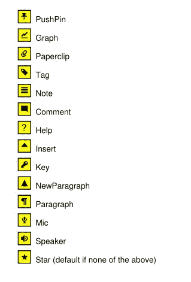

# Annot

> 原文：[`pymupdf.readthedocs.io/en/latest/annot.html`](https://pymupdf.readthedocs.io/en/latest/annot.html)

**此类仅适用于 PDF 文档。**

引用自 Adobe PDF 参考手册：“注释将诸如注释、声音或电影等对象与 PDF 文档页面上的位置相关联，或者通过鼠标和键盘与用户进行交互的方式。”

每一个注释对象都与其页面存在父子关系。如果页面对象变得不可用（关闭文档、任何文档结构更改等），则其所有现有的注释对象也将不可用——每当访问注释属性或方法时，都会引发异常，指示对象“被遗弃”。

| **属性** | **简短描述** |
| --- | --- |
| `Annot.delete_responses()` | 删除所有响应注释 |
| `Annot.get_file()` | 获取附加文件内容 |
| `Annot.get_oc()` | 获取`OCG` / `OCMD`的`xref` |
| `Annot.get_pixmap()` | 注释的图像作为位图 |
| `Annot.get_sound()` | 获取音频注释的声音 |
| `Annot.get_text()` | 提取注释文本 |
| `Annot.get_textbox()` | 提取注释文本 |
| `Annot.set_border()` | 设置注释的边框属性 |
| `Annot.set_blendmode()` | 设置注释的混合模式 |
| `Annot.set_colors()` | 设置注释的颜色 |
| `Annot.set_flags()` | 设置注释的标志字段 |
| `Annot.set_irt_xref()` | 定义注释为“响应于” |
| `Annot.set_name()` | 设置注释的名称字段 |
| `Annot.set_oc()` | 设置`OCG` / `OCMD`的`xref` |
| `Annot.set_opacity()` | 更改透明度 |
| `Annot.set_open()` | 打开/关闭注释或其弹出窗口 |
| `Annot.set_popup()` | 为注释创建弹出窗口 |
| `Annot.set_rect()` | 更改注释矩形 |
| `Annot.set_rotation()` | 更改旋转角度 |
| `Annot.update_file()` | 更新附加文件内容 |
| `Annot.update()` | 应用累积的注释更改 |
| `Annot.blendmode` | 注释的混合模式 |
| `Annot.border` | 边框详细信息 |
| `Annot.colors` | 边框 / 背景和填充颜色 |
| `Annot.file_info` | 获取附加文件信息 |
| `Annot.flags` | 注释标志 |
| `Annot.has_popup` | 注释是否有弹出窗口 |
| `Annot.irt_xref` | 此注释所回应的注释 |
| `Annot.info` | 各种信息 |
| `Annot.is_open` | 注释或其弹出窗口是否已打开 |
| `Annot.line_ends` | 线型注释的起始 / 终止外观 |
| `Annot.next` | 指向下一个注释的链接 |
| `Annot.opacity` | 注释的透明度 |
| `Annot.parent` | 注释的页面对象 |
| `Annot.popup_rect` | 注释弹出窗口的矩形 |
| `Annot.popup_xref` | 注释的弹出窗口的 PDF `xref` 号码 |
| `Annot.rect` | 包含注释的矩形 |
| `Annot.type` | 注释的类型 |
| `Annot.vertices` | 多边形、折线等的点坐标。 |
| `Annot.xref` | PDF `xref` 号码 |

**类 API**

```py
class Annot
```

```py
get_pixmap(matrix=pymupdf.Identity, dpi=None, colorspace=pymupdf.csRGB, alpha=False)
```

+   v1.19.2 中的变更：增加了对 dpi 参数的支持。

从页面中未经转换的坐标创建注释的像素图像。像素图像的 IRect 等于*Annot.rect.irect*（见下文）。**所有参数都是关键字参数。**

参数：

+   **matrix** (*matrix_like*) – 用于图像创建的矩阵。默认值为 Identity。

+   **dpi** (*int*) –（v1.19.2 中新增）每英寸的点数。如果不是`None`，则忽略矩阵参数。

+   **colorspace** (Colorspace) – 用于图像创建的颜色空间。默认值为*pymupdf.csRGB*。

+   **alpha** (*bool*) – 是否包含透明信息。默认值为*False*。

返回类型：

Pixmap

注意

+   如果刚刚创建或修改了注释，则应该先通过`page = doc.reload_page(page)`重新加载页面。

+   当`alpha=True`时，像素图像的像素将具有*“预乘”*的特性。要了解一些背景知识，例如查看“预乘阿尔法”[这里](https://en.wikipedia.org/wiki/Glossary_of_computer_graphics#P)。

```py
get_text(opt, clip=None, flags=None)
```

+   1.18.0 新增

检索以各种格式提取注释的内容 - 类似于 Page 的相同方法。目前仅对注释类型 'FreeText' 和 'Stamp' 提供相关数据。其他类型返回空字符串（或等效对象）。

参数：

+   **opt** (*str*) –

    (仅限位置) 所需格式 - 下列值之一。请注意，此方法的工作方式与 Page 的同名方法完全相同。

    +   ”text” – `TextPage.extractTEXT()`，默认值

    +   ”blocks” – `TextPage.extractBLOCKS()`

    +   ”words” – `TextPage.extractWORDS()`

    +   ”html” – `TextPage.extractHTML()`

    +   ”xhtml” – `TextPage.extractXHTML()`

    +   ”xml” – `TextPage.extractXML()`

    +   ”dict” – `TextPage.extractDICT()`

    +   ”json” – `TextPage.extractJSON()`

    +   ”rawdict” – `TextPage.extractRAWDICT()`

+   **clip** (*rect-like*) – (仅限关键字) 限制提取到此区域。几乎不应该需要，默认为`Annot.rect`。

+   **flags** (*int*) – (仅限关键字) 控制返回的数据量。默认为简单文本提取。

```py
get_textbox(rect)
```

+   新功能 1.18.0

返回注释文本。与`Annot.get_text()`的“text”选项基本相同（除了换行符）。

参数：

**rect** (*rect-like*) – 要考虑的区域，默认为`Annot.rect`。

```py
set_info(info=None, content=None, title=None, creationDate=None, modDate=None, subject=None)
```

+   1.16.10 版更改

更改注释属性。这些属性包括日期、内容、主题和作者 (标题)。对于 *name* 和 *id* 的更改将被忽略。更新是有选择性的：要保持属性不变，将其设置为 *None*。要删除现有数据，使用空字符串。

参数：

+   **info** (*dict*) – 与 *info* 属性兼容的字典（参见下文）。所有条目都必须是字符串。如果此参数不是字典，则使用其他参数 - 否则将忽略它们。

+   **content** (*str*) – *(v1.16.10 新增)* 参见`info`中的描述。

+   **title** (*str*) – *(v1.16.10 新增)* 参见`info`中的描述。

+   **creationDate** (*str*) – *(v1.16.10 新增)* 注释创建日期。如果提供，应该符合 PDF 日期时间格式。

+   **modDate** (*str*) – *(v1.16.10 新增)* 最后修改日期。如果提供，应该符合 PDF 日期时间格式。

+   **subject** (*str*) – *(v1.16.10 新增)* 参见`info`中的描述。

```py
set_line_ends(start, end)
```

设置注释的线端样式。每种注释类型由一系列点定义，这些点由线连接。被标识为 *start* 的符号附加在第一个点上，*end* 附加在此列表的最后一个点上。对于不支持的注释类型，将产生一个带有警告消息的无操作。

注意

+   虽然“自由文本”、“线条”、“折线”和“多边形”注释可以具有这些属性，但是（Py-）MuPDF 不支持“自由文本”的线端，因为不支持其呼出变体。

+   （在 v1.16.16 中更改）某些符号具有内部区域（如菱形、圆圈、正方形等）。默认情况下，这些区域用注释的填充颜色填充。如果为 *None*，则选择白色。现在可以使用 `Annot.update()` 的 *fill_color* 参数来覆盖此设置，并为线端符号指定自己的填充颜色。

参数：

+   **start**（*int*） - 第一个点的符号编号。

+   **end**（*int*） - 最后一个点的符号编号。

```py
set_oc(xref)
```

使用 PDF 可选内容机制设置注释的可见性。此可见性由支持 PDF 查看器的用户界面控制。它独立于其他属性（如 `Annot.flags`）。

参数：

**xref**（*int*） - 可选内容组（OCG 或 OCMD）的 `xref`。任何先前的 xref 将被覆盖。如果为零，则将删除先前的条目。如果 xref 不为零且不指向有效的 PDF 对象，则会发生异常。

注意

这不需要执行 `Annot.update()` 就能生效。

```py
get_oc()
```

返回一个可选内容对象的 `xref`，如果没有则返回零。

返回：

零或 OCG（或 OCMD）的 `xref`。

```py
set_irt_xref(xref)
```

+   新功能在 v1.19.3 版本中引入

设置注释以“响应于”另一个注释。

参数：

**xref**（*int*） -

另一个注释的 `xref`。

注意

必须引用此页面上的现有注释。设置此属性不需要后续的 `update()`。

```py
set_open(value)
```

+   新功能在 v1.18.4 版本中引入

设置注释的弹出注释打开或关闭 - **或** 注释本身，如果其类型是“文本”（“便笺”）。

参数：

**value**（*bool*） - 所需的打开状态。

```py
set_popup(rect)
```

+   新功能在 v1.18.4 版本中引入

为注释创建一个弹出注释，并指定其矩形。如果弹出窗口已存在，则仅更新其矩形。

参数：

**rect**（*rect_like*） - 所需的矩形。

```py
set_opacity(value)
```

设置注释的透明度。不透明度也可以在 `Annot.update()` 中设置。

参数：

**value**（*float*） - 范围为 *[0, 1]* 的浮点数。假设值超出范围则假定为 1。例如，值为 0.5 将透明度设置为 50%。

三个重叠的“圆”注释，每个透明度设置为 0.5：


```py
blendmode
```

+   新功能在 v1.18.4 版本中引入

注释的混合模式。参见 Adobe PDF 参考手册，第 324 页有详细说明。

返回类型：

字符串

返回：

混合模式或*None*。

```py
set_blendmode(blendmode)
```

+   新版本 v1.16.14 中新增功能

设置注释的混合模式。参见 Adobe PDF 参考手册，第 324 页有详细说明。混合模式也可以在`Annot.update()`中设置。

参数：

**blendmode**（*str*） – 设置混合模式。使用`Annot.update()`来在视觉外观中反映这一点。有关预定义值，请参见 PDF 标准混合模式。使用`PDF_BM_Normal`可以**删除**混合模式。

```py
set_name(name)
```

+   新版本 1.16.0 中新增功能

更改任何注释类型的名称字段。对于‘FileAttachment’和‘Text’注释，这是图标名称；对于‘Stamp’注释，这是印章中的文本。视觉结果（如果有的话）取决于您的 PDF 查看器。另请参见 MuPDF 中的注释图标。

参数：

**name**（*str*） – 新名称。

注意

如果您设置了“Stamp”注释的名称，则**不会更改**矩形，也不会对文本进行布局。如果您从 Stamp Annotation Icons 选择了标准文本（在`"STAMP_"`后的**确切**名称部分），则应收到原始布局。**任意文本**不会变成大写，而是按照字体“Times-Bold”水平居中显示在**一行**中，并缩短以适应。为了完全显示您的文本，其使用`fontsize` 20 计算的长度不得超过 190 点。因此，请确保以下不等式成立：`pymupdf.get_text_length(text, fontname="tibo", fontsize=20) <= 190`。

```py
set_rect(rect)
```

更改注释的矩形。注释可以移动，并且矩形的两侧可以分别进行缩放。但是，注释外观永远不会旋转、翻转或倾斜。此方法仅影响特定的注释类型[[2]](#f2)，并将在其他情况下导致 Python 的`sys.stderr`上的消息。不会引发异常，但将返回`False`。

参数：

**rect**（*rect_like*） – 注释的新矩形（有限且非空）。例如，使用值 *annot.rect + (5, 5, 5, 5)* 将使 annot 位置向右和向下移动 5 个像素。

注意

为了激活效果，您**不需要**调用`Annot.update()`。

```py
set_rotation(angle)
```

设置注释的旋转。这会使注释矩形围绕其中心点旋转。然后根据生成的四边形计算一个**新的注释矩形**。

参数：

**angle**（*int*） – 角度旋转角度。可能存在任意值，但将被限制在区间`0, 360)`内。

注意

+   您**必须调用**[`Annot.update()`来激活效果。

+   对于 PDF_ANNOT_FREE_TEXT，只有 0、90、180 和 270 中的一个值是可能的，并且会**旋转**当前矩形内的文本（保持不变）。其他值将被静默忽略并替换为 0。

+   否则，只能旋转以下注释类型之一：‘Square’、‘Circle’、‘Caret’、‘Text’、‘FileAttachment’、‘Ink’、‘Line’、‘Polyline’、‘Polygon’和‘Stamp’。对于所有其他类型，该方法是一个无操作。

```py
set_border(border=None, width=None, style=None, dashes=None, clouds=None)
```

+   自 1.16.9 版更改：允许不使用字典来指定。如果*border*不是字典，则使用直接参数。

+   从 1.22.5 版更改：支持“多云”边框效果。

仅适用于 PDF：更改边框宽度、虚线、样式和云效果。有关更多详细信息，请参见`Annot.border`属性。

参数：

+   **border**（*dict*）– 由`border`属性返回的字典，其键为*“width”*（*float*）、*“style”*（*str*）、*“dashes”*（*sequence*）和*clouds*（*int*）。省略的键将保持相应的属性不变。将 border 参数设置为`None`（默认值）以使用其他参数。

+   **width**（*float*）– 非负值将更改边框线宽度。

+   **style**（*str*）– 除`None`之外的值将更改此边框属性。

+   **dashes**（*sequence*）– 序列的所有项必须是整数，否则参数将被忽略。要移除虚线，请使用：`dashes=[]`。如果虚线是非空序列，则“style”将自动设置为“D”（虚线）。

+   **clouds**（*int*）– 大于等于 0 的值将更改此属性。使用`clouds=0`完全删除云状外观。仅支持“Square”、“Circle”和“Polygon”注释类型。

```py
set_flags(flags)
```

更改注释标志。使用`|`运算符来组合几个。

参数：

**flags**（*int*）– 一个指定所需标志的整数。

```py
set_colors(colors=None, stroke=None, fill=None)
```

+   自 1.16.9 版更改：允许直接设置颜色。如果*colors*不是字典，则使用这些参数。

更改支持的注释类型的“描边”和“填充”颜色-并非所有注释都接受两者。

参数：

+   **colors**（*dict*）– 包含颜色规范的字典。有关接受的字典键和值，请参见下文。最实用的方法应该是首先复制*colors*属性，然后根据需要修改此字典。

+   **stroke**（*sequence*）– 见上文。

+   **fill**（*sequence*）– 见上文。

*v1.18.5 中更改：*要完全删除颜色规范，请使用空序列，如`[]`。如果指定`None`，则不会更改现有规范。

```py
delete_responses()
```

+   1.16.12 版新功能

删除引用此注释的注释。这包括任何“Popup”注释和所有响应它的注释。

```py
update(opacity=None, blend_mode=None, fontsize=0, text_color=None, border_color=None, fill_color=None, cross_out=True, rotate=-1)
```

在相关更改后同步注释的外观与其属性。

仅对以下更改可以安全地**省略**此方法：

> +   `Annot.set_rect()`
> +   
> +   `Annot.set_flags()`
> +   
> +   `Annot.set_oc()`
> +   
> +   `Annot.update_file()`
> +   
> +   `Annot.set_info()`（除了对*“content”*的任何更改）

所有参数均为可选。*(从 v1.16.14 起更改)* 混合模式和不透明度适用于 **所有注释类型**。其他参数大多数是特殊用途，如下所述。

可以使用 PuMuPDF 中通常格式的颜色规范，作为从 0.0 到 1.0 的浮点数序列（包括两者）。序列长度必须为 1、3 或 4（支持 GRAY、RGB 和 CMYK 颜色空间）。对于 GRAY，只需一个浮点数也可以接受。

参数：

+   **不透明度** (*float*) – *(自 v1.16.14 新增)* **适用于所有注释类型：** 更改或设置注释的透明度。有效值为 *0 <= opacity < 1*。

+   **混合模式** (*str*) – *(自 v1.16.14 新增)* **适用于所有注释类型：** 更改或设置注释的混合模式。有效值参见 PDF 标准混合模式。

+   **字体大小** (*float*) – 更改`字体大小`。仅适用于“自由文本”注释。

+   **文本颜色** (*sequence**,**float*) – 更改文本颜色。仅适用于“自由文本”注释。

+   **边框颜色** (*sequence**,**float*) – 更改边框颜色。仅适用于“自由文本”注释。

+   **填充颜色** (*sequence**,**float*) –

    填充颜色。

    +   ’直线‘，’折线‘，’多边形‘ 注释：用于给适用的线条末端符号填充不同于注释的颜色 *(从 v1.16.16 起变更)*。

+   **划掉** (*bool*) – *(自 v1.17.2 新增)* 向注释矩形添加两条对角线。仅适用于“遮挡”注释。如果不需要，则必须指定 *False*，即使注释创建时为 *False*。

+   **旋转** (*int*) – 新的旋转值。默认值 (-1) 表示无变化。支持“自由文本”和其他几种注释类型（参见`Annot.set_rotation()`)，[[1]](#f1)。对于“自由文本”，只能选择 0、90、180 或 270 度。其他整数均可接受。

返回类型：

布尔

注意

在`Page.annots()`循环内使用此方法 **不推荐！** 这是因为大多数注释更新需要重新加载拥有页面 - 这不能在此循环内完成。请使用文档中提供的示例编码模式。

```py
file_info
```

附件注释类型的基本信息。

返回类型：

字典

返回：

一个字典，具有键 *“filename”*、*“ufilename”*、*“desc”*（描述）、*“size”*（未压缩文件大小）、*“length”*（压缩长度），适用于 FileAttachment 注释类型，否则为 *None*。

```py
get_file()
```

返回附加文件内容。

返回类型：

字节

返回：

附加文件的内容。

```py
update_file(buffer=None, filename=None, ufilename=None, desc=None)
```

更新附加文件的内容。所有参数均为可选。如果没有参数，则无操作。

参数：

+   **缓冲区** (*bytes**|**bytearray**|**BytesIO*) –

    新文件内容。省略以仅更改元信息。

    *(在 1.14.13 版中更改)* *io.BytesIO* 现在也受支持。

+   **文件名** (*str*) – 关联文件的新文件名。

+   **ufilename** (*str*) – 关联文件的新 Unicode 文件名。

+   **描述** (*str*) – 文件内容的新描述。

```py
get_sound()
```

返回嵌入音频注释的音频内容。

返回类型：

字典

返回：

声音音频文件和相关属性。这些是可能的字典键，其中“rate”和“stream”始终存在。

| 键 | 描述 |
| --- | --- |
| 率 | (float, 必需) 每秒样本数 |
| 通道 | (int, 可选) 声音通道数 |
| bps | (int, 可选) 每个通道的每样本位数值 |
| 编码 | (str, 可选) 编码格式：原始，有符号，muLaw，ALaw |
| 压缩 | (str, 可选) 压缩过滤器的名称 |
| 流 | (bytes, 必需) 音频文件内容 |

```py
opacity
```

注释的透明度。如果设置，则其值范围为 *[0, 1]*。PDF 的默认值为 1。然而，为了区别，如果未设置，我们返回 *-1.0*。

返回类型：

浮点数

```py
parent
```

注释的拥有页面对象。

返回类型：

页面

```py
rotation
```

注释旋转。

返回类型：

整数

返回：

值范围为 [-1, 359]。如果根本没有旋转，则返回 -1（并暗示旋转角度为 0）。其他可能的值被规范化为某个值 0 <= 角度 < 360。

```py
rect
```

包含注释的矩形。

返回类型：

矩形

```py
next
```

此页面上的下一个注释或无。

返回类型：

*Annot*

```py
type
```

一个数字和一到两个描述注释类型的字符串，如 **[2, 'FreeText', 'FreeTextCallout']**。第二个字符串条目是可选的，可能为空。请参见附录 注释类型 查看可能值及其含义列表。

返回类型：

列表

```py
info
```

包含各种信息的字典。所有字段都是可选字符串。对于未提供的信息项，返回空字符串。

+   *名称* – 例如，“Stamp”注释将包含如“售出”或“实验性”的印章文本，对于其他注释类型，您将在此处看到注释图标的名称（例如“PushPin”适用于文件附件）。

+   *内容* – 包含 *Text* 和 *FreeText* 注释类型文本的字符串。常用于填充注释弹出窗口的文本字段。

+   *标题* – 包含注释弹出窗口标题的字符串。按照惯例，这用于**注释作者**。

+   *creationDate* – 创建时间戳。

+   *modDate* – 最后修改时间戳。

+   *主题* – 主题。

+   *id* – *(自 1.16.10 版起新增)* 注释的唯一标识。这是从 PDF 键 */NM* 获取的。PyMuPDF 添加的注释将有一个唯一的名称，显示在此处。

返回类型：

字典

```py
flags
```

一个整数，其低位包含注释应如何呈现的标志。

返回类型：

整数

```py
line_ends
```

指定注释类型‘FreeText’、‘Line’、‘PolyLine’和‘Polygon’的起始和结束符号的一对整数。如果不适用，则为 *None*。有关此列表中可能值和描述，请参见 Adobe PDF 参考手册，第 400 页的表 1.76。

返回类型：

元组

```py
vertices
```

包含各种类型注释的变量数量的点（“顶点”）坐标的列表（每个由一对浮点数给出）：

+   ‘Line’ – 起始和结束坐标（2 个浮点对）。

+   ‘FreeText’ – 指定起始、（可选的）膝点和结束坐标的 2 或 3 个浮点对。

+   ‘PolyLine’ / ‘Polygon’ – 由线段连接的边的坐标（n 个点的 n 个浮点对）。

+   文本标记注释 – 指定标记文本跨度的 *QuadPoints* 的 4 个浮点对（请参见 Adobe PDF 参考手册，第 403 页）。

+   ‘Ink’ – 一到多个子列表的顶点坐标。每个这样的子列表代表绘图中的一条分开的线。

返回类型：

列表

```py
colors
```

两个浮点数列表的字典，范围为 *0 <= float <= 1*，指定“描边”和内部（“填充”）颜色。“描边”颜色用于边框和所有活动绘制或书写的内容（“描边”）。“填充”颜色用于对象的内部，如线段端点、圆形和正方形的内部。这些列表的长度隐式确定了所使用的颜色空间：1 = GRAY，3 = RGB，4 = CMYK。因此，“[1.0, 0.0, 0.0]”代表 RGB 颜色红色。如果未指定颜色，则这两个列表都可以为空。

返回类型：

字典

```py
xref
```

PDF `xref`。

返回类型：

整数

```py
irt_xref
```

PDF `xref`，这个注释所回应的注释。如果没有回应注释，则返回零。

返回类型：

整数

```py
popup_xref
```

关联弹出式注释的 PDF `xref`。如果不存在则为零。

返回类型：

整数

```py
has_popup
```

注释是否具有弹出式注释。

返回类型：

布尔值

```py
is_open
```

注释的弹出式是否已打开 – **或** 注释本身（仅适用于‘Text’注释）。

返回类型：

布尔值

```py
popup_rect
```

关联弹出式注释的矩形。如果不存在，则为无限矩形。

返回类型：

矩形

```py
rect_delta
```

代表注释的`/RD`条目的四个浮点数的元组。这四个数字描述了两个矩形之间的数值差异（左、上、-右、-底）：注释的`rect`和包含在该矩形内的矩形。如果缺少条目，则此属性为`(0, 0, 0, 0)`。如果注释边框是一条普通的直线，则这些数字通常是边框宽度除以 2。如果注释具有“多云”边框，则您将在此处看到云半圆的宽度。一般来说，这些数字不一定相同。要计算内部矩形，请执行 `a.rect + a.rect_delta`。

```py
border
```

包含边框特征的字典。如果没有边框信息，则为空。可能存在以下键：

+   *width* – 指定的边框粗细，单位为点。如果未指定宽度，则值为 -1.0。

+   *dashes* – 一系列整数，指定了线条虚线图案。*[]* 表示无虚线，*[n]* 表示等长的*n*点的开关长度，更长的列表将被解释为指定交替的开关长度值。详见 Adobe PDF References 第 126 页获取更多详细信息。

+   *style* – 1 字节边框样式：**“S”**（实线）= 环绕注释的实线，**“D”**（虚线）= 环绕注释的虚线，虚线图案由 *dashes* 条目指定，**“B”**（斜角）= 模拟凸起的矩形，看起来高于页面表面，**“I”**（内凹）= 模拟凹陷的矩形，看起来低于页面表面，**“U”**（下划线）= 注释矩形底部的单线。

+   *clouds* – 表示“多云”边框的整数，其中`n`是一个整数，满足 `-1 <= n <= 2`。当 `n = 0` 时表示直线（无云），1 表示小半圆，2 表示大半圆，模拟云朵外观。如果是 -1，则没有指定。

返回类型：

字典

## MuPDF 中的注释图标

这是可通过名称引用的图标列表，用于注释类型“文本”和“文件附件”。您可以在添加注释时使用*icon*参数，或在`Annot.set_name()`中使用 as 参数。在选择项目时，您可以自行决定是否使用例如“演讲者”图标作为“文件附件”的图标。



## 示例

更改注释的图形图像。同时更新“作者”和在弹出窗口中显示的文本：

```py
doc = pymupdf.open("circle-in.pdf")
page = doc[0]                          # page 0
annot = page.first_annot                # get the annotation
annot.set_border(dashes=[3])           # set dashes to "3 on, 3 off ..."

# set stroke and fill color to some blue
annot.set_colors({"stroke":(0, 0, 1), "fill":(0.75, 0.8, 0.95)})
info = annot.info                      # get info dict
info["title"] = "Jorj X. McKie"        # set author

# text in popup window ...
info["content"] = "I changed border and colors and enlarged the image by 20%."
info["subject"] = "Demonstration of PyMuPDF"     # some PDF viewers also show this
annot.set_info(info)                   # update info dict
r = annot.rect                         # take annot rect
r.x1 = r.x0 + r.width  * 1.2           # new location has same top-left
r.y1 = r.y0 + r.height * 1.2           # but 20% longer sides
annot.set_rect(r)                      # update rectangle
annot.update()                         # update the annot's appearance
doc.save("circle-out.pdf")             # save 
```

这是修改前后圆形注释的外观（使用 Nitro PDF 查看器显示的弹出窗口）：


脚注

您对本页面有任何反馈吗？

* * *

本软件按原样提供，不提供任何明示或暗示的保证。此软件受许可证约束，未经许可不得复制、修改或分发。请参阅许可信息，请访问[artifex.com](https://www.artifex.com?utm_source=rtd-pymupdf&utm_medium=rtd&utm_content=footer-link)，或联系美国旧金山 CA 94129 Mesa Street 39 号 108A 套房的 Artifex Software Inc.了解更多信息。

本文档涵盖了所有版本直至 1.24.4。

 ## MuPDF 中的注释图标

这是可通过名称引用的图标列表，用于“文本”和“文件附件”注释类型。您可以通过*icon*参数在添加注释时使用它们，或在`Annot.set_name()`中作为参数使用。您可以自行决定在何时选择哪个项目 - 没有任何机制会阻止您例如将“扬声器”图标用于“文件附件”。


## 示例

更改注释的图形图像。还要更新“作者”和在弹出窗口中显示的文本：

```py
doc = pymupdf.open("circle-in.pdf")
page = doc[0]                          # page 0
annot = page.first_annot                # get the annotation
annot.set_border(dashes=[3])           # set dashes to "3 on, 3 off ..."

# set stroke and fill color to some blue
annot.set_colors({"stroke":(0, 0, 1), "fill":(0.75, 0.8, 0.95)})
info = annot.info                      # get info dict
info["title"] = "Jorj X. McKie"        # set author

# text in popup window ...
info["content"] = "I changed border and colors and enlarged the image by 20%."
info["subject"] = "Demonstration of PyMuPDF"     # some PDF viewers also show this
annot.set_info(info)                   # update info dict
r = annot.rect                         # take annot rect
r.x1 = r.x0 + r.width  * 1.2           # new location has same top-left
r.y1 = r.y0 + r.height * 1.2           # but 20% longer sides
annot.set_rect(r)                      # update rectangle
annot.update()                         # update the annot's appearance
doc.save("circle-out.pdf")             # save 
```

这是更改前后圆形注释的外观（使用 Nitro PDF 查看器显示弹出窗口）：


脚注

您对此页面有何反馈？

* * *

此软件按“原样”提供，不附带任何明示或暗示的担保。此软件在许可下分发，未经明确授权，不得复制、修改或分发。有关详细信息，请参阅[artifex.com](https://www.artifex.com?utm_source=rtd-pymupdf&utm_medium=rtd&utm_content=footer-link)，或联系 Artifex Software Inc.，39 Mesa Street，Suite 108A，San Francisco CA 94129，美国。

此文档覆盖所有 1.24.4 版本及更早版本。


