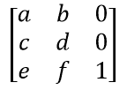

# 矩阵

> 原文：[`pymupdf.readthedocs.io/en/latest/matrix.html`](https://pymupdf.readthedocs.io/en/latest/matrix.html)

Matrix 是 MuPDF 中用于图像变换的行优先 3x3 矩阵（与 Adobe PDF References 中规定的相应概念一致）。使用矩阵，你可以以多种方式操作页面的渲染图像：（部分）页面可以通过设置仅六个浮点值中的一些或全部来旋转、缩放、翻转、剪切和移动。

由于所有点或像素都存在于二维空间中，该矩阵的一个列向量是一个恒定的单位向量，仅剩下的六个元素用于操作。这六个元素通常用 *[a, b, c, d, e, f]* 表示。以下是它们在矩阵中的位置：



请注意：

> +   下面的方法仅是便利函数 – 它们所做的一切也可以通过直接操作这六个数值来实现。
> +   
> +   所有操作可以组合在一起 – 你可以构造一个矩阵，同时进行旋转 **和** 剪切 **和** 缩放 **和** 平移等操作。然而，如果你选择这样做，请务必查看下面的 **备注** 或者参考 Adobe PDF References。

| **方法 / 属性** | **描述** |
| --- | --- |
| `Matrix.prerotate()` | 执行旋转操作 |
| `Matrix.prescale()` | 执行缩放操作 |
| `Matrix.preshear()` | 执行剪切（倾斜）操作 |
| `Matrix.pretranslate()` | 执行平移（移动）操作 |
| `Matrix.concat()` | 执行矩阵乘法 |
| `Matrix.invert()` | 计算逆矩阵 |
| `Matrix.norm()` | 欧几里得范数 |
| `Matrix.a` | X 方向的缩放因子 |
| `Matrix.b` | Y 方向的剪切效果 |
| `Matrix.c` | X 方向的剪切效果 |
| `Matrix.d` | Y 方向的缩放因子 |
| `Matrix.e` | 水平移动 |
| `Matrix.f` | 垂直移动 |
| `Matrix.is_rectilinear` | 如果矩形角点保持不变则为真 |

**类 API**

```py
class Matrix
```

```py
__init__(self)
```

```py
__init__(self, zoom-x, zoom-y)
```

```py
__init__(self, shear-x, shear-y, 1)
```

```py
__init__(self, a, b, c, d, e, f)
```

```py
__init__(self, matrix)
```

```py
__init__(self, degree)
```

```py
__init__(self, sequence)
```

重载的构造函数。

如果没有参数，将创建零矩阵 *Matrix(0.0, 0.0, 0.0, 0.0, 0.0, 0.0)*。

*zoom-* 和 *shear-* 分别指定缩放或剪切值（浮点数），并创建缩放或剪切矩阵。

对于“矩阵”，将制作一个 **新副本** 的另一个矩阵。

浮点数“degree”指定了一个逆时针旋转的旋转矩阵的创建。

“序列”必须是任何 Python 序列对象，具有确切的 6 个浮点数条目（参见在 PyMuPDF 中将 Python 序列作为参数使用）。

*pymupdf.Matrix(1, 1)* 和 *pymupdf.Matrix(pymupdf.Identity)* 创建可修改版本的 Identity 矩阵，其外观类似 *[1, 0, 0, 1, 0, 0]*。

```py
norm()
```

+   版本 1.16.0 中的新功能

返回作为向量的矩阵的欧几里德范数。

```py
prerotate(deg)
```

将矩阵修改以执行逆时针旋转正*deg*度，否则顺时针旋转。单位矩阵的元素将按以下方式更改：

*[1, 0, 0, 1, 0, 0] -> [cos(deg), sin(deg), -sin(deg), cos(deg), 0, 0]*。

参数：

**deg** (*浮点数*) – 以度为单位的旋转角度（使用基于π = 180 度的传统表示法）。

```py
prescale(sx, sy)
```

修改矩阵以按缩放因子 sx 和 sy 进行缩放。仅对属性*a*至*d*有影响：*[a, b, c, d, e, f] -> [a*sx, b*sx, c*sy, d*sy, e, f]*。

参数：

+   **sx** (*浮点数*) – X 方向的缩放因子。有关影响，请参阅属性*a*的描述。

+   **sy** (*浮点数*) – Y 方向的缩放因子。有关影响，请参阅属性*d*的描述。

```py
preshear(sx, sy)
```

修改矩阵以执行剪切操作，即将矩形转换为平行四边形（菱形）。仅对属性*a*至*d*有影响：*[a, b, c, d, e, f] -> [c*sy, d*sy, a*sx, b*sx, e, f]*。

参数：

+   **sx** (*浮点数*) – X 方向的剪切效果。参见属性*c*。

+   **sy** (*浮点数*) – Y 方向的剪切效果。参见属性*b*。

```py
pretranslate(tx, ty)
```

修改矩阵以执行沿 x 轴和/或 y 轴的移动/平移操作。仅对属性*e*和*f*有影响：*[a, b, c, d, e, f] -> [a, b, c, d, tx*a + ty*c, tx*b + ty*d]*。

参数：

+   **tx** (*浮点数*) – X 方向的平移效果。参见属性*e*。

+   **ty** (*浮点数*) – Y 方向的平移效果。参见属性*f*。

```py
concat(m1, m2)
```

计算矩阵乘积 *m1 * m2* 并将结果存储在当前矩阵中。*m1*或*m2*中的任何一个可以是当前矩阵。请注意，矩阵乘法不可交换。因此，*m1*，*m2*的顺序很重要。

参数：

+   **m1** (矩阵) – 第一个（左）矩阵。

+   **m2** (矩阵) – 第二个（右）矩阵。

```py
invert(m=None)
```

计算*m*的逆矩阵并将结果存储在当前矩阵中。如果*m*不可逆（“退化”），返回*1*。在这种情况下，当前矩阵**不会更改**。如果*m*可逆，则返回*0*，并且当前矩阵将替换为*m*的逆矩阵。

参数：

**m** (矩阵) – 要求取逆的矩阵。如果未提供，则将使用当前矩阵。

返回类型：

整数

```py
a
```

在 X 方向的缩放**(宽度)**。例如，值为 0.5 会使**宽度**缩小一半。如果 a < 0，还将进行左右翻转。

类型：

浮点数

```py
b
```

导致剪切效果：每个`Point(x, y)`将变为`Point(x, y - b*x)`。因此，水平线将会“倾斜”。

类型：

浮点数

```py
c
```

导致剪切效果：每个`Point(x, y)`将变为`Point(x - c*y, y)`。因此，垂直线将会“倾斜”。

类型：

浮点数

```py
d
```

在 Y 方向的缩放 **（高度）**。例如，值为 1.5 会将**高度**拉伸 50%。如果 d < 0，还会发生上下翻转。

类型：

浮点数

```py
e
```

导致水平移位效果：每个*Point(x, y)*将变为*Point(x + e, y)*。正（负）的*e*值将使其向右（向左）移动。

类型：

浮点数

```py
f
```

导致垂直移位效果：每个*Point(x, y)*将变为*Point(x, y - f)*。正（负）的*f*值将使其向下（向上）移动。

类型：

浮点数

```py
is_rectilinear
```

直角坐标意味着不存在错切，并且任何旋转都是 90 度的整数倍。通常用于确认变换前后（轴对齐的）矩形仍然是轴对齐的矩形。

类型：

布尔

注意

+   该类遵循 Python 序列协议，因此也可以通过它们的索引访问组件。还请参阅在 PyMuPDF 中使用 Python 序列作为参数。

+   矩阵可以像普通数字一样使用算术运算符：它们可以相加、相减、相乘或相除 – 见章节几何对象的运算代数。

+   矩阵乘法是**不可交换**的 – 改变乘法顺序通常会改变结果。因此很快会不清楚转换会产生哪个结果。

## 例子

下面是一些说明一些可实现效果的例子。所有图片显示一些文本，根据某些矩阵的控制插入到固定参考点（红点）下。

1.  身份矩阵不执行任何操作。


1.  缩放矩阵`Matrix(2, 0.5)`在水平方向拉伸 2 倍，在垂直方向收缩 0.5 倍。


1.  属性`Matrix.e`和`Matrix.f`分别水平和垂直移动。在接下来的 10 个单位向右和 20 个单位向下。


1.  负的`Matrix.a`会导致左右翻转。


1.  负的`Matrix.d`会导致上下翻转。


1.  属性`Matrix.b`沿着 x 轴向上或向下倾斜。


1.  属性`Matrix.c`沿着 y 轴左倾或右倾。


1.  矩阵 `Matrix(beta)` 对正角度 `beta` 进行逆时针旋转。

您对此页面有任何反馈吗？

* * *

本软件按原样提供，不提供任何形式的明示或暗示担保。本软件在许可下分发，并且未经许可明确授权，不得复制、修改或分发。请参阅[artifex.com](https://www.artifex.com?utm_source=rtd-pymupdf&utm_medium=rtd&utm_content=footer-link)获取许可信息或联系美国旧金山 CA 94129 Mesa Street 39 号的 Artifex Software Inc. 以获取更多信息。

此文档涵盖了所有版本，包括 1.24.4。


## 示例

这里有些例子，说明了一些可实现的效果。所有图片显示了一些文本，由某个矩阵控制并相对于固定参考点（红点）插入。

1.  Identity 矩阵执行无操作。


1.  缩放矩阵 `Matrix(2, 0.5)` 在水平方向拉伸 2 倍，在垂直方向收缩 0.5 倍。


1.  属性`Matrix.e` 和 `Matrix.f` 水平和垂直移动。接下来向右移动 10，向下移动 20。


1.  负 `Matrix.a` 会导致左右翻转。


1.  负 `Matrix.d` 会导致上下翻转。


1.  属性`Matrix.b`沿 x 轴向上/向下倾斜。


1.  属性`Matrix.c`沿 y 轴向左/向右倾斜。


1.  矩阵 `Matrix(beta)` 对正角度 `beta` 进行逆时针旋转。

您对此页面有任何反馈吗？

* * *

此软件按原样提供，不提供任何形式的保证，明示或暗示。此软件按许可分发，未经许可明确授权的情况下不得复制、修改或分发。有关许可信息，请参阅[artifex.com](https://www.artifex.com?utm_source=rtd-pymupdf&utm_medium=rtd&utm_content=footer-link)，或联系美国旧金山 CA 94129 Mesa 街 39 号 108A 套房的 Artifex Software Inc. 以获取更多信息。

本文档涵盖了所有版本直至 1.24.4。


