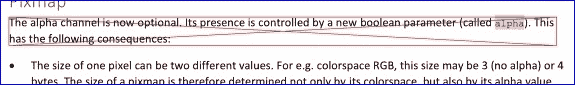
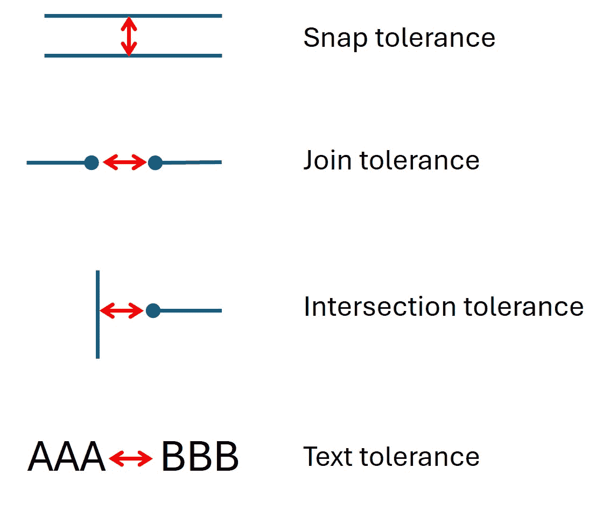
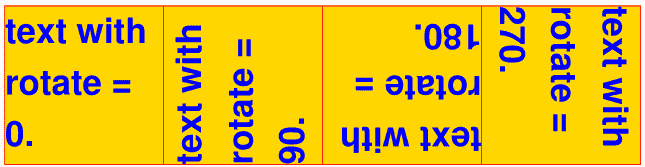
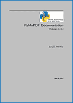
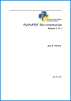

# 页面

> 原文：[`pymupdf.readthedocs.io/en/latest/page.html`](https://pymupdf.readthedocs.io/en/latest/page.html)

代表文档页面的类。页面对象通过`Document.load_page()`或通过像`doc[n]`这样的文档索引创建 - 它没有独立的构造函数。

文档和其页面之间存在父子关系。如果文档关闭或删除，所有现存的页面对象（及其各自的子对象）将变得不可用（“孤立”）：如果正在使用页面的属性或方法，则会引发异常。

几个页面方法具有方便使用的文档对应项。本章末尾将找到一个简介。

注意

在本章中，我们多次使用术语**坐标**。理解其基本概念并确保对坐标系部分感到自在至关重要。

## 修改页面

只有对 PDF 文档才能进行更改页面属性、添加或更改页面内容。

简而言之，这是您可以使用 PyMuPDF 所做的事情：

+   修改页面旋转和页面的可见部分（“裁剪框”）。

+   插入图像、其他 PDF 页面、文本和简单的几何对象。

+   添加注释和表单字段。

注意

方法需要坐标（点、矩形）以将内容放置在所需位置。请注意，这些坐标**必须始终**相对于**未旋转**的页面提供（自 v1.17.0 起）。反之亦然：除了`Page.rect`和`Page.bound()`（两者在页面旋转时*反映*）外，方法和属性返回的所有坐标均与未旋转的页面相关。

因此，例如`Page.get_image_bbox()`返回的值，如果执行`Page.set_rotation()`不会改变。同样适用于`Page.get_text()`返回的坐标，注释矩形等等。如果要查找对象在**旋转坐标**中的位置，可以将坐标乘以`Page.rotation_matrix`。同样还有其逆，`Page.derotation_matrix`，在与可能在此方面行为不同的其他阅读器接口时可以使用。

注意

如果添加或更新注释、链接或表单字段，并且需要立即使用它们（即**不离开页面**），则应在引用这些新添加或更新的项目之前使用`Document.reload_page()`重新加载页面。

重新加载页面通常是建议的，尽管并非在所有情况下都严格需要。然而，与 MuPDF 相比，PyMuPDF 中的一些注释和小部件类型具有扩展功能。今后可能还会添加更多这些扩展。

重新加载页面确保所有更改已完全应用于 PDF 结构，因此您可以安全地创建像素图或成功迭代注释、链接和表单字段。

| **方法 / 属性** | **简要描述** |
| --- | --- |
| `Page.add_caret_annot()` | 仅适用于 PDF：添加插入符注释 |
| `Page.add_circle_annot()` | 仅适用于 PDF：添加圆形注释 |
| `Page.add_file_annot()` | 仅适用于 PDF：添加文件附件注释 |
| `Page.add_freetext_annot()` | 仅适用于 PDF：添加文本注释 |
| `Page.add_highlight_annot()` | 仅适用于 PDF：添加“高亮”注释 |
| `Page.add_ink_annot()` | 仅适用于 PDF：添加墨迹注释 |
| `Page.add_line_annot()` | 仅适用于 PDF：添加线条注释 |
| `Page.add_polygon_annot()` | 仅适用于 PDF：添加多边形注释 |
| `Page.add_polyline_annot()` | 仅适用于 PDF：添加多行注释 |
| `Page.add_rect_annot()` | 仅适用于 PDF：添加矩形注释 |
| `Page.add_redact_annot()` | 仅适用于 PDF：添加遮盖注释 |
| `Page.add_squiggly_annot()` | 仅适用于 PDF：添加“波浪线”注释 |
| `Page.add_stamp_annot()` | 仅适用于 PDF：添加“图章”注释 |
| `Page.add_strikeout_annot()` | 仅适用于 PDF：添加“删除线”注释 |
| `Page.add_text_annot()` | 仅适用于 PDF：添加评论 |
| `Page.add_underline_annot()` | 仅适用于 PDF：添加“下划线”注释 |
| `Page.add_widget()` | 仅适用于 PDF：添加 PDF 表单字段 |
| `Page.annot_names()` | 仅适用于 PDF：注释（和小部件）名称列表 |
| `Page.annot_xrefs()` | 仅适用于 PDF：注释（和小部件）交叉引用列表 |
| `Page.annots()` | 返回页面上注释的生成器 |
| `Page.apply_redactions()` | 仅适用于 PDF：处理页面的遮盖 |
| `Page.bound()` | 页面的矩形边界 |
| `Page.cluster_drawings()` | 仅限 PDF：矢量图形的边界框 |
| `Page.delete_annot()` | 仅限 PDF：删除一个注释 |
| `Page.delete_image()` | 仅限 PDF：删除一个图像 |
| `Page.delete_link()` | 仅限 PDF：删除一个链接 |
| `Page.delete_widget()` | 仅限 PDF：删除一个小部件 / 字段 |
| `Page.draw_bezier()` | 仅限 PDF：绘制一个三次贝塞尔曲线 |
| `Page.draw_circle()` | 仅限 PDF：绘制一个圆 |
| `Page.draw_curve()` | 仅限 PDF：绘制一个特殊的贝塞尔曲线 |
| `Page.draw_line()` | 仅限 PDF：绘制一条直线 |
| `Page.draw_oval()` | 仅限 PDF：绘制一个椭圆 / 椭圆形 |
| `Page.draw_polyline()` | 仅限 PDF：连接一个点序列 |
| `Page.draw_quad()` | 仅限 PDF：绘制一个四边形 |
| `Page.draw_rect()` | 仅限 PDF：绘制一个矩形 |
| `Page.draw_sector()` | 仅限 PDF：绘制一个圆形扇区 |
| `Page.draw_squiggle()` | 仅限 PDF：绘制一个波浪线 |
| `Page.draw_zigzag()` | 仅限 PDF：绘制一条锯齿状线 |
| `Page.find_tables()` | 定位页面上的表格 |
| `Page.get_drawings()` | 获取页面上的矢量图形 |
| `Page.get_fonts()` | 仅限 PDF：获取引用字体的列表 |
| `Page.get_image_bbox()` | 仅限 PDF：获取嵌入图像的边界框和矩阵 |
| `Page.get_image_info()` | 获取所有使用图像的元信息列表 |
| `Page.get_image_rects()` | 仅限 PDF：`Page.get_image_bbox()` 的改进版本 |
| `Page.get_images()` | 仅限 PDF：获取引用图像的列表 |
| `Page.get_label()` | 仅限 PDF：返回页面的标签 |
| `Page.get_links()` | 获取所有链接 |
| `Page.get_pixmap()` | 创建一个以光栅格式的页面图像 |
| `Page.get_svg_image()` | 创建一个以 SVG 格式的页面图像 |
| `Page.get_text()` | 提取页面的文本 |
| `Page.get_textbox()` | 提取矩形框中包含的文本 |
| `Page.get_textpage_ocr()` | 创建带有 OCR 的 TextPage |
| `Page.get_textpage()` | 创建页面的 TextPage |
| `Page.get_xobjects()` | PDF only: 获取引用的 xobjects 列表 |
| `Page.insert_font()` | PDF only: 插入页面使用的字体 |
| `Page.insert_image()` | PDF only: 插入图像 |
| `Page.insert_link()` | PDF only: 插入链接 |
| `Page.insert_text()` | PDF only: 插入文本 |
| `Page.insert_htmlbox()` | PDF only: 在矩形框中插入 HTML 文本 |
| `Page.insert_textbox()` | PDF only: 插入文本框 |
| `Page.links()` | 返回页面上链接的生成器 |
| `Page.load_annot()` | PDF only: 加载特定注释 |
| `Page.load_widget()` | PDF only: 加载特定字段 |
| `Page.load_links()` | 返回页面上的第一个链接 |
| `Page.new_shape()` | PDF only: 创建新的 Shape |
| `Page.remove_rotation()` | PDF only: 将页面旋转设置为 0 |
| `Page.replace_image()` | PDF only: 替换图像 |
| `Page.search_for()` | 搜索字符串 |
| `Page.set_artbox()` | PDF only: 修改 `/ArtBox` |
| `Page.set_bleedbox()` | PDF only: 修改 `/BleedBox` |
| `Page.set_cropbox()` | PDF only: 修改 `cropbox`（可见页面） |
| `Page.set_mediabox()` | PDF only: 修改 `/MediaBox` |
| `Page.set_rotation()` | PDF only: 设置页面旋转 |
| `Page.set_trimbox()` | PDF only: 修改 `/TrimBox` |
| `Page.show_pdf_page()` | PDF only: 显示 PDF 页面图像 |
| `Page.update_link()` | PDF only: 修改链接 |
| `Page.widgets()` | 返回页面字段的生成器 |
| `Page.write_text()` | 写入一个或多个 TextWriter 对象 |
| `Page.cropbox_position` | `cropbox` 的位置偏移 |
| `Page.cropbox` | 页面的`cropbox` |
| `Page.artbox` | 页面的`/ArtBox` |
| `Page.bleedbox` | 页面的`/BleedBox` |
| `Page.trimbox` | 页面的`/TrimBox` |
| `Page.derotation_matrix` | 仅适用于 PDF：获取未旋转页面空间中的坐标 |
| `Page.first_annot` | 页面上的第一个 Annot |
| `Page.first_link` | 页面上的第一个 Link |
| `Page.first_widget` | 页面上的第一个小部件（表单字段） |
| `Page.mediabox_size` | `mediabox`的右下角点 |
| `Page.mediabox` | 页面的`mediabox` |
| `Page.number` | 页码 |
| `Page.parent` | 拥有文档对象 |
| `Page.rect` | 页面的矩形 |
| `Page.rotation_matrix` | 仅适用于 PDF：获取旋转页面空间中的坐标 |
| `Page.rotation` | 仅适用于 PDF：页面旋转 |
| `Page.transformation_matrix` | 仅适用于 PDF：在 PDF 和 MuPDF 空间之间进行转换 |
| `Page.xref` | 仅适用于 PDF：页面的`xref` |

**类 API**

```py
class Page
```

```py
bound()
```

确定页面的矩形。与属性`Page.rect`相同。对于 PDF 文档，这通常也与`mediabox`和`cropbox`相符，但并非总是如此。例如，如果页面被旋转，则此方法会反映这一点，但`Page.cropbox`不会改变。

返回类型：

Rect

```py
add_caret_annot(point)
```

仅适用于 PDF：添加一个插入符号图标。插入符号注释是一个视觉符号，通常用于指示页面上的文本编辑。

参数：

**point** (*point_like*) – 包含 MuPDF 提供的图标的 20 x 20 矩形的左上角点。

返回类型：

Annot

返回：

创建的注释。描边颜色蓝色 = (0, 0, 1)，不支持填充颜色。

<details><summary>显示/隐藏历史记录</summary></details> *   v1.16.0 中的新功能

```py
add_text_annot(point, text, icon='Note')
```

仅适用于 PDF：添加一个评论图标（“便笺”）及其附带文本。仅图标可见，附带文本则被隐藏，可以通过许多 PDF 查看器将鼠标悬停在符号上来可视化。

参数：

+   **point** (*point_like*) – 包含 MuPDF 提供的“注释”图标的 20 x 20 矩形的左上角点。

+   **text** (*str*) – 注释文本。双击或悬停图标时将显示。可以包含任何拉丁字符。

+   **icon** (*str*) – 选择“Note”（默认）、“Comment”、“Help”、“Insert”、“Key”、“NewParagraph”、“Paragraph”中的一个作为体现文本的视觉符号[[4]](#f4)。（自 v1.16.0 起新功能）

返回类型：

注释

返回：

创建的注释。描边颜色为黄色 = (1, 1, 0)，不支持填充颜色。

```py
add_freetext_annot(rect, text, fontsize=12, fontname='helv', border_color=None, text_color=0, fill_color=1, rotate=0, align=TEXT_ALIGN_LEFT)
```

仅限 PDF：在给定矩形中添加文本。

参数：

+   **rect** (*rect_like*) – 要插入文本的矩形。文本会自动换行到盒子宽度的新行。不适合盒子的行将不可见。

+   **text** (*str*) – 文本。可以包含拉丁文、希腊文、西里尔文、中文、日文和韩文字符的任意混合。自动确定所需的字体。（自 v1.17.0 起新功能）

+   **fontsize** (*float*) – `fontsize`。默认为 12。

+   **fontname** (*str*) – 字体名称。默认为“Helv”。可接受的备选项包括“Cour”、“TiRo”、“ZaDb”和“Symb”。名称可以缩写为前两个字符，如“Co”代表“Cour”。也接受小写。字体的粗体或斜体变体**不被接受**（自 v1.16.0 起更改）。用户贡献的脚本提供了对此限制的绕过方法——参见章节*使用按钮和 JavaScript*中的 FAQ。现在根据每个字符的需要确定实际使用的字体（或子字体），所有必需的字体（或子字体）都会自动包含。因此，除非您坚持为非 CJK 文本部分使用衬线字体，否则您几乎不需要关心此参数，可以让其默认。（自 v1.17.0 起新功能）

+   **text_color** (*sequence**,**float*) – 文本颜色。默认为黑色。（自 v1.16.0 起新功能）

+   **fill_color** (*sequence**,**float*) – 填充颜色。默认为白色。（自 v1.16.0 起新功能）

+   **text_color** – 文本颜色。默认为黑色。

+   **border_color** (*sequence**,**float*) – 边框颜色。默认为`None`。（自 v1.19.6 起新功能）

+   **align** (*int*) – 文本对齐方式，TEXT_ALIGN_LEFT、TEXT_ALIGN_CENTER、TEXT_ALIGN_RIGHT 之一——不支持右对齐。（自 v1.17.0 起新功能）

+   **rotate** (*int*) – 文本方向。可接受的值为 0、90、270，无效条目将被设为零。

返回类型：

注释

返回：

创建的注释。颜色属性只能使用`Annot.update()`的特殊参数进行更改。在那里，您还可以设置与文本颜色不同的边框颜色。

<details><summary>显示/隐藏历史记录</summary></details>

```py
add_file_annot(pos, buffer, filename, ufilename=None, desc=None, icon='PushPin')
```

仅限 PDF：在指定位置添加带有“PushPin”图标的文件附件注释。

参数：

+   **pos** (*point_like*) – 包含 MuPDF 提供的“PushPin”图标的 18x18 矩形的左上角点。

+   **buffer** (*bytes**,**bytearray**,**BytesIO*) –

    要存储的数据（实际文件内容，任何数据等）。

    v1.14.13 中的更改：现在还支持 *io.BytesIO*。

+   **filename**（*str*）- 与数据关联的文件名。

+   **ufilename**（*str*）- 可选的 PDF Unicode 文件名版本。默认为文件名。

+   **desc**（*str*）- 文件的可选描述。默认为文件名。

+   **icon**（*str*）- 选择“PushPin”（默认）、“Graph”、“Paperclip”、“Tag”之一作为附加数据的视觉符号 [[4]](#f4)。（在 v1.16.0 中新增）

返回类型：

注释

返回：

创建的注释。描边颜色为黄色 = (1, 1, 0)，不支持填充颜色。

```py
add_ink_annot(list)
```

仅限 PDF：添加“自由手绘”涂鸦注释。

参数：

**list**（*sequence*）- 包含一个或多个列表的列表，每个子列表都包含`point_like`项。这些子列表中的每个项被解释为通过它连接的 Point。因此，单独的子列表表示单独的绘制线条。

返回类型：

注释

返回：

创建的注释的默认外观为黑色 =(0, 0, 0)，线宽为 1。不支持填充颜色。

```py
add_line_annot(p1, p2)
```

仅限 PDF：添加线条注释。

参数：

+   **p1**（*point_like*）- 线条的起点。

+   **p2**（*point_like*）- 线条的终点。

返回类型：

注释

返回：

创建的注释。它用红色线条（描边）绘制，颜色为红色 = (1, 0, 0)，线宽为 1。不支持填充颜色。**注释矩形**会自动创建，以包含两个点，每个点周围都有半径为 3 * 线宽的圆圈，以容纳任何线条结束符号。

```py
add_rect_annot(rect)
```

```py
add_circle_annot(rect)
```

仅限 PDF：添加矩形或圆形注释。

参数：

**rect**（*rect_like*）- 矩形，用于绘制圆形或矩形，必须是有限且非空的。如果矩形不是等边的，则绘制椭圆。

返回类型：

注释

返回：

创建的注释。它用红色线条（描边）绘制，颜色为红色 = (1, 0, 0)，线宽为 1，支持填充颜色。

* * *

### 删除内容

```py
add_redact_annot(quad, text=None, fontname=None, fontsize=11, align=TEXT_ALIGN_LEFT, fill=(1, 1, 1), text_color=(0, 0, 0), cross_out=True)
```

仅限 PDF：添加红线注释。红线注释标识要从文档中删除的内容。添加这样的注释是两个步骤中的第一步。它使后续步骤中的`Page.apply_redactions()`可见将要移除的内容。

参数：

+   **quad**（*quad_like**,**rect_like*）- 指定要移除的（矩形）区域，始终等于注释矩形。这可以是一个`rect_like`或`quad_like`对象。如果指定了四边形，则采用包围矩形。

+   **text**（*str*）- 应用编辑后，要放置在矩形中的文本（从而删除旧内容）。 （在 v1.16.12 中新增）

+   **fontname**（*str*）-

    当给出*text*时使用的字体，否则将被忽略。与`Page.insert_textbox()`相同的规则适用于此方法内部调用的`Page.apply_redactions()` - 替换文本将是**垂直居中**的，如果这是 CJK 或 PDF Base 14 Fonts 之一。（在 v1.16.12 中新增）

    注意

    +   对于页面上的**现有**字体，请使用其引用名称作为*fontname*（这是其在`Page.get_fonts()`中条目的*item[4]*）。

    +   对于**新的、非内置**字体，请按以下步骤进行：

        ```py
        page.insert_text(point,  # anywhere, but outside all redaction rectangles
            "something",  # some non-empty string
            fontname="newname",  # new, unused reference name
            fontfile="...",  # desired font file
            render_mode=3,  # makes the text invisible
        )
        page.add_redact_annot(..., fontname="newname") 
        ```

+   **fontsize**（*float*） - 用于替换文本的`fontsize`。如果文本太大而无法容纳，则将尝试进行多次插入，逐渐减小`fontsize`至不低于 4。如果文本仍然无法容纳，则根本不会进行文本插入。（在 v1.16.12 中新增）

+   **align**（*int*） - 替换文本的水平对齐方式。查看`insert_textbox()`获取可用值。如果使用 PDF 内置字体（CJK 或 PDF Base 14 Fonts）则垂直对齐方式（大约）居中。（在 v1.16.12 中新增）

+   **fill**（*sequence*） - 应用遮挡后矩形的填充颜色。默认为*white = (1, 1, 1)*，如果指定*None*也是如此。要完全取消填充颜色，请指定*False*。在这种情况下，矩形保持透明。（在 v1.16.12 中新增）

+   **text_color**（*sequence*） - 替换文本的颜色。默认为*black = (0, 0, 0)*。（在 v1.16.12 中新增）

+   **cross_out**（*bool*） - 向注释矩形添加两条对角线。（在 v1.17.2 中新增）

返回类型：

Annot

返回：

创建的注释。其标准外观类似于一个红色矩形（无填充颜色），可选择显示两条对角线。现在可以通过`Annot.update()`设置和应用颜色、线宽、虚线、不透明度和混合模式，就像其他注释一样。（在 v1.17.2 中更改）

<details><summary>显示/隐藏历史记录</summary></details> * 新增于 v1.16.11

```py
apply_redactions(images=PDF_REDACT_IMAGE_PIXELS | 2, graphics=PDF_REDACT_LINE_ART_IF_TOUCHED | 2, text=PDF_REDACT_TEXT_REMOVE | 0)
```

**仅适用于 PDF**：删除页面上任何遮挡矩形中包含的所有**内容**。

**此方法应用然后从页面中删除所有遮挡。**

参数：

+   **images**（*int*） - 如何编辑重叠的图像。默认值（2）会消除重叠的像素。`PDF_REDACT_IMAGE_NONE | 0`表示忽略，`PDF_REDACT_IMAGE_REMOVE | 1`完全删除任何与任何遮挡注释重叠的图像。选项`PDF_REDACT_IMAGE_REMOVE_UNLESS_INVISIBLE | 3`仅删除实际可见的图像。（在 v1.16.12 中新增）

+   **图形** (*int*) – 如何对重叠的矢量图形（也称为“线条艺术”或“绘图”）进行删除。默认值（2）会删除任何重叠的矢量图形。`PDF_REDACT_LINE_ART_NONE | 0` 会忽略，而 `PDF_REDACT_LINE_ART_IF_COVERED | 1` 则会移除完全包含在隐私保护注释中的图形。在删除线条艺术时，请注意**描边**矢量图形（即类型“s”或“sf”）的**包裹矩形较大**，这可能超出您的预期：首先，每个方向至少必须添加路径线宽的 50%以确实包括所有绘图。如果提供了所谓的“斜角极限”（参见 PDF 规范的第 121 页），则扩展值为 `miter * width / 2`。因此，当所有内容保持默认值（宽度=1，斜角=10）时，隐私保护矩形在每个方向至少应大出 5 个点。

+   **文本** (*int*) – 是否删除重叠的文本。默认值 `PDF_REDACT_TEXT_REMOVE | 0` 会删除任何边界框与任何隐私保护矩形重叠的字符。这符合隐私保护注释的原始法律/数据保护意图。然而，其他用例可能需要在删除矢量图形或图像时**保留文本**。可以通过设置 `text=True|PDF_REDACT_TEXT_NONE | 1` 来实现。这**不符合**隐私保护注释的数据保护意图。请**自行承担风险**。

返回：

如果至少处理了一个隐私保护注释，则返回 `True`，否则返回 `False`。

注意

+   包含在隐私保护矩形中的文本将从页面中**物理删除**（假设使用适当的垃圾选项进行 `Document.save()` ），在文本提取或其他地方将不再显示。所有隐私保护注释也将被删除。其他注释不受影响。

+   所有重叠的链接将被移除。如果链接的矩形覆盖了文本，则只会删除文本的重叠部分。相似的情况适用于被链接矩形覆盖的图像。

+   默认选项 `PDF_REDACT_IMAGE_PIXELS` 下，重叠的部分**图像**将被清空（自 v1.18.0 起更改）。选项 0 不会触及任何图像，选项 1 会删除任何重叠的图像。

+   对于选项 `images=PDF_REDACT_IMAGE_REMOVE`，仅删除此页面对图像的**引用** - 不一定删除图像本身。只有当不再引用图片（假设适当的垃圾回收选项）时，图像才会完全从文件中删除。

+   对于选项 `images=PDF_REDACT_IMAGE_PIXELS`，将创建一个新的 PNG 格式的图像，页面将使用该图像代替原始图像。原始图像不会在此过程中被删除或替换，因此其他页面仍然可能显示原始图像。此外，当前的新修改的 PNG 图像是**未压缩存储**的。在选择正确的垃圾回收方法和保存期间的压缩选项时，请牢记这些方面。

+   **文本移除**按字符进行：如果其 bbox 与遮挡矩形有**非空重叠**（在 MuPDF v1.17 中更改），则删除字符。根据字体属性和/或所选行高，可能会删除不需要的文本部分。在文本搜索之前使用`Tools.set_small_glyph_heights()`并传入*True*参数可以帮助防止这种情况。

+   遮罩是在 PDF 中替换单个单词或仅物理删除它们的简单方法。使用某些文本提取或搜索方法定位单词“secret”，并为每个出现插入遮罩，使用“xxxxxx”作为替换文本。

    +   如果替换文本比原始文本更长，请谨慎 – 这可能导致外观尴尬，换行或根本没有新文本。

    +   由于多种原因，新文本可能不会像旧文本一样精确地位于同一行上 – 尤其是如果替换字体不是 CJK 或 PDF 基础 14 字体之一。

<details><summary>显示/隐藏历史记录</summary></details> *   v1.16.11 中新推出

+   自 v1.16.12 更改：以前的*mark*参数已被移除。取而代之的是，各自的遮挡注释会用个别的*fill*颜色填充。如果注释中提供了*text*，则会调用`insert_textbox()`插入，使用与遮挡提供的参数。

+   自 v1.18.0 更改：添加了处理图像与遮挡区域重叠的选项。

+   自 v1.23.27 更改：添加了删除图形的选项。

+   自 v1.24.2 更改：添加了选项`keep_text`以保留文本不变。

* * *

```py
add_polyline_annot(points)
```

```py
add_polygon_annot(points)
```

仅适用于 PDF：添加由连接给定点的线条组成的注释。**多边形**的第一个和最后一个点会自动连接，而这在**折线**上是不会发生的。**矩形**会自动创建为包含点的最小矩形，每个点周围都有半径为 3 的圆圈（= 3 * 线宽）。以下显示了一个已用颜色和线端修改过的“折线”。

参数：

**points**（*列表*） – 一个`point_like`对象列表。

返回类型：

注释

返回：

创建的注释。它用黑线绘制，线宽 1，无填充色但支持填充色。使用注释的方法进行任何更改以实现如下所示的效果：


```py
add_underline_annot(quads=None, start=None, stop=None, clip=None)
```

```py
add_strikeout_annot(quads=None, start=None, stop=None, clip=None)
```

```py
add_squiggly_annot(quads=None, start=None, stop=None, clip=None)
```

```py
add_highlight_annot(quads=None, start=None, stop=None, clip=None)
```

仅适用于 PDF：这些注释通常用于标记以前某种方式定位的文本（例如通过`Page.search_for()`）。但这不是必须的：您可以自由地“标记”任何内容。

标准（仅边框 – 不支持填充颜色）的颜色根据注释类型选择：**黄色**用于高亮显示，**红色**用于删除线，**绿色**用于下划线，**洋红色**用于波浪下划线。

所有这四种方法都将参数转换为四边形对象的列表。然后计算**注释**矩形以包围所有这些四边形。

注意

`search_for()` 返回一个矩形或四边形对象的列表。这样的列表可以直接用作这些注释类型的参数，并将为搜索字符串的所有出现提供**一个共同的注释**：

```py
>>> # prefer quads=True in text searching for annotations!
>>> quads = page.search_for("pymupdf", quads=True)
>>> page.add_highlight_annot(quads) 
```

注意

显然，文本标记注释需要知道要标记的区域的顶部、底部、左侧和右侧是什么。如果参数是四边形，这些信息通过四边形点序列给出。相比之下，矩形提供的信息要少得多 – 这一点可以通过以下事实来说明：一个矩形的四个角可以构造出 24 个不同的四边形。

因此，我们**强烈建议**使用`quads`选项进行文本搜索，以确保正确的注释。类似的考虑也适用于使用`Page.get_text()`的“dict”/“rawdict”选项提取的**文本跨度**的标记。有关如何在这种情况下计算四边形的详细信息，请参见 FAQ 部分的“如何标记非水平文本”。

参数：

+   **quads** (*rect_like**,**quad_like**,**list**,**tuple*) – 要标记的位置 – 矩形或四边形 – （自 v1.14.20 更改）列表或元组必须包含`rect_like`或`quad_like`项目（或两者混合）。每个项目必须是有限、凸面且非空的（如适用）。如果希望使用以下参数，请将此参数设置为*None*（自 v1.16.14 更改）。反之亦然：如果不是*None*，则其余参数必须为*None*。

+   **start** (*point_like*) – 从此点开始标记文本。默认为*clip*的左上角点。如果`quads`为*None*，必须提供此选项。（自 v1.16.14 新增）

+   **stop** (*point_like*) – 停止在此点标记文本。默认为*clip*的右下角点。如果`quads`为*None*，必须使用此选项。（自 v1.16.14 新增）

+   **clip** (*rect_like*) – 仅考虑与此区域相交的文本行。默认为页面矩形。仅在提供了`start`和`stop`时使用。（自 v1.16.14 新增）

返回类型：

注释 或 *None* （自 v1.16.14 更改）。

返回：

创建的注释。如果*quads*为空列表，则**不创建注释**（自 v1.16.14 更改）。

注意

您可以使用参数*start*，*stop*和*clip*来突出显示两个红点之间的连续行（从 v1.16.14 开始）。利用*clip*进一步减少所选行的边界框，从而处理例如多列页面。以下是在具有三个文本列的页面上创建的多行高亮显示示例，通过相应设置*clip*来实现。


```py
cluster_drawings(clip=None, drawings=None, x_tolerance=3, y_tolerance=3)
```

基于它们的几何接近性对矢量图形集群（同义词为线条艺术或绘图）进行聚类。该方法遍历`Page.get_drawings()`的输出，并结合其`path["rect"]`与某些容差值接近的路径（在参数中给出）。结果是一个列表，每个都包含类似表格（具有网格线）、饼图、柱状图等的矩形。

参数：

+   **clip** (*rect_like*) – 只考虑该区域内的路径。默认为整个页面。

+   **drawings** (*list*) – （可选）提供先前生成的`Page.get_drawings()`的输出。如果为`None`，方法将执行该方法。

+   **x_tolerance** (*float*) –

```py
find_tables(clip=None, strategy=None, vertical_strategy=None, horizontal_strategy=None, vertical_lines=None, horizontal_lines=None, snap_tolerance=None, snap_x_tolerance=None, snap_y_tolerance=None, join_tolerance=None, join_x_tolerance=None, join_y_tolerance=None, edge_min_length=3, min_words_vertical=3, min_words_horizontal=1, intersection_tolerance=None, intersection_x_tolerance=None, intersection_y_tolerance=None, text_tolerance=None, text_x_tolerance=None, text_y_tolerance=None, add_lines=None)
```

查找页面上的表格并返回相关信息对象。通常情况下，许多参数的默认值就足够了。只有在极端情况下才需要调整。

参数：

+   **clip** (*rect_like*) – 指定要考虑的页面矩形内的区域，忽略其余部分。默认为整个页面。

+   **strategy** (*str*) –

    请求一个**表格检测**策略。有效值为“lines”，“lines_strict”和“text”。

    默认为**“lines”**，它使用页面上的所有矢量图形来检测网格线。

    策略**“lines_strict”**会忽略没有边框的矩形矢量图形。有时单个文本片段具有背景颜色，这可能导致错误的列或行。此策略会忽略它们，从而增加检测精度。

    如果指定了**“text”**，则使用文本位置生成“虚拟”列和/或行边界。使用`min_words_*`来请求考虑其坐标的单词数量。

    使用参数`vertical_strategy`和`horizontal_strategy` **代替**以更精细地处理尺寸。

+   **horizontal_lines** (*sequence**[**floats**]*) – 行的 y 坐标。如果提供，将不会尝试识别额外的表格行。这会影响表格检测。

+   **vertical_lines** (*sequence**[**floats**]*) – 列的 x 坐标。如果提供，将不会尝试识别额外的表格列。这会影响表格检测。

+   **min_words_vertical** (*int*) – 对于垂直策略选项“text”很重要：至少必须有这么多单词重合才能建立**虚拟列**边界。

+   **min_words_horizontal** (*int*) – 仅对水平策略选项“text”有效：至少有这么多单词重合才能确定一个**虚拟行**的边界。

+   **snap_tolerance** (*float*) – 如果两条水平线的 y 值之差不超过此值，则将它们**捕捉**到一起。垂直线同理。默认值为 3。可以使用`snap_x_tolerance`和`snap_y_tolerance`分别指定各个维度的值。

+   **join_tolerance** (*float*) – 如果两条线的终点和起点之差不超过此值（点），则将它们**连接**成一条线。默认值为 3。可以使用`join_x_tolerance`和`join_y_tolerance`分别指定各个维度的值。

+   **edge_min_length** (*float*) – 如果线段长度不超过此值（点），则忽略该线段。默认值为 3。

+   **intersection_tolerance** (*float*) – 将线段组合成单元格边框时，正交线段必须在此值（点）以内才被视为相交。默认值为 3。可以使用`intersection_x_tolerance`和`intersection_y_tolerance`分别指定各个维度的值。

+   **text_tolerance** (*float*) – 如果字符之间的距离不大于此值（点），则将它们组合成单词。默认值为 3。可以使用`text_x_tolerance`和`text_y_tolerance`分别指定各个维度的值。

+   **add_lines** (*tuple**,**list*) – 指定一组“线条”（即`point_like`对象的对）作为**额外的**“虚拟”矢量图形。这些线条可能有助于表格和/或单元格的检测，并且不会影响检测策略的其他方面。与`horizontal_lines`和`vertical_lines`参数不同，这些线条不会阻止以其他方式检测行或列。这些线条在连接、捕捉、相交、最小长度和包含在`clip`矩形内等方面将被像“真实”矢量图形一样处理。同样，与任何坐标轴不平行的线条将被忽略。



返回：

一个具有以下重要属性的`TableFinder`对象：

+   `cells`: 页面上所有被识别为表格单元格的边界框列表（跨所有表格）。每个单元格是一个`rect_like`元组`(x0, y0, x1, y1)`或`None`。

+   `tables`: `Table`对象的列表。如果页面没有表格，则为空列表`[]`。可以通过`tabs.tables[n]`或更简洁的方式`tabs[n]`来访问单个表格。但是`TableFinder`对象本身也是其表格的序列。这意味着如果`tabs`是一个`TableFinder`对象，则表格“n”可以通过`tabs.tables[n]`和`tabs[n]`两种方式获取。

+   `Table`对象具有以下属性：

    +   `bbox`: 表的边界框，表示为元组`(x0, y0, x1, y1)`。

    +   `cells`: 表格单元格的边界框（元组列表）。一个单元格也可以是`None`。

    +   `extract()`: 此方法返回每个表格单元格的文本内容，作为字符串列表的列表。

    +   `to_markdown()`: 此方法返回一个以**Markdown 格式**（与 Github 兼容）的字符串作为表。支持的查看器可以将字符串呈现为表格。此输出对于 LLM/RAG feeds 的小令牌大小特别有益。Pandas 数据框（见下面的`to_pandas()`方法）提供了一个等效的 Markdown 表输出，但对于人眼更易读。

    +   `to_pandas()`: 此方法将表格作为[pandas](https://pypi.org/project/pandas/) [DataFrame](https://pandas.pydata.org/docs/reference/frame.html)返回。DataFrame 是非常多才多艺的对象，允许大量的表操作方法和输出到几乎 20 种众所周知的格式，其中包括 Excel 文件、CSV、JSON、Markdown 格式化的表格等等。`DataFrame.to_markdown()`生成一个适用于 Github 的 Markdown 格式，优化了人类的可读性。但是，该方法还需要安装包 tablutate)，除了 pandas 本身之外。

    +   `header`: 包含表头信息的`TableHeader`对象。

    +   `col_count`: 包含表格列数的整数。

    +   `row_count`: 包含表格行数的整数。

    +   `rows`: 一个包含两个属性的`TableRow`对象列表，`bbox`是行的边界框，`cells`是包含在此行中的表格单元格的列表。

+   `TableHeader`对象具有以下属性：

    +   `bbox`: 标题的边界框。

    +   `cells`: 包含各列名称的边界框列表。

    +   `names`: 包含每个单元框文本的字符串列表。它们代表列名 - 在将表导出为 pandas 数据框、Markdown 等时使用。

    +   `external`: 一个布尔值，指示标题边界框是否位于表格主体之外（`True`）或不是。表头从不由`TableFinder`逻辑识别。因此，如果`external`为真，则标题单元格不是由`TableFinder`识别的任何单元格的一部分。如果`external == False`，则第一行是表头。

请查看这些[Jupyter 笔记本](https://github.com/pymupdf/PyMuPDF-Utilities/tree/master/table-analysis)，其中涵盖了标准情况，如一页上的多个表格或跨多页连接表片段。

<details><summary>显示/隐藏历史记录</summary></details> *   版本 1.23.0 中的新功能

+   版本 1.23.19 中的更改：新增参数`add_lines`。

重要提示

还有[PDF2DOCX 提取表格方法](https://pdf2docx.readthedocs.io/en/latest/quickstart.table.html)，如果您更喜欢，也可以进行表格提取。

```py
add_stamp_annot(rect, stamp=0)
```

仅适用于 PDF：例如，向文档添加“橡皮图章”注释，以指示文档的预期用途（“草稿”，“机密”等）。

参数：

+   **rect** (*rect_like*) – 放置注释的矩形区域。

+   **stamp** (*int*) – 印章文本的标识号。有关可用印章，请参阅印章注释图标。

注意

+   印章的文本和其边界线将自动调整大小，并水平和垂直居中在给定的矩形中。`Annot.rect`会自动计算以适应给定的**宽度**，通常会比此参数小。

+   选择的字体是“Times Bold”，文本将是大写。

+   可以使用`Annot.set_opacity()`更改外观，并通过设置“stroke”颜色（不支持“fill”颜色）。

+   可用于创建水印图像：在临时 PDF 页面上创建一个透明度较低的印章注释，然后使用*alpha=True*从中创建一个像素图（可能还要旋转它），丢弃临时 PDF 页面，并使用`insert_image()`将像素图插入到目标 PDF 中。


```py
add_widget(widget)
```

仅适用于 PDF：向页面添加 PDF 表单字段（“小部件”）。这也**将 PDF 转换为表单 PDF**。由于小部件有大量不同的选项可用，我们开发了一个新类 Widget，其中包含可能的 PDF 字段属性。它必须用于表单字段的创建和更新。

Parameters:

**widget** (Widget) – 必须事先创建的 Widget 对象。

Returns:

一个小部件注释。

```py
delete_annot(annot)
```

+   现在移除还包括任何绑定的‘弹出’或响应注释以及相关对象（自 v1.16.6 起更改）。

仅适用于 PDF：从页面中删除注释并返回下一个注释。

Parameters:

**annot** (Annot) – 要删除的注释。

Return type:

Annot

Returns:

被删除的注释后面的注释。请记住，物理删除需要保存到带有垃圾> 0 的新文件中。

```py
delete_widget(widget)
```

仅适用于 PDF：从页面中删除字段并返回下一个字段。

Parameters:

**widget** (Widget) – 要删除的小部件。

Return type:

Widget

Returns:

被删除的注释后面的小部件。请记住，物理删除需要保存到带有垃圾> 0 的新文件中。

<details><summary>显示/隐藏历史记录</summary></details>（自 v1.18.4 起新增）

```py
delete_link(linkdict)
```

仅适用于 PDF：从页面中删除指定的链接。参数必须是`get_links()`的原始项，参见 get_links()条目的描述。这是因为字典的“xref”键标识要删除的 PDF 对象。

Parameters:

**linkdict** (*dict*) – 要删除的链接。

```py
insert_link(linkdict)
```

仅适用于 PDF：在此页面上插入新链接。参数必须是由`get_links()`提供的格式的字典，参见 get_links()条目描述。

参数：

**linkdict** (*dict*) – 待插入的链接。

```py
update_link(linkdict)
```

仅适用于 PDF：修改指定的链接。参数必须是`get_links()`的（修改后的）原始条目，参见 get_links()条目描述。这是因为字典的“xref”键，该键标识要更改的 PDF 对象的原因。

参数：

**linkdict** (*dict*) – 待修改的链接。

警告

如果更新/插入 URI 链接（`"kind": LINK_URI`），请确保以诸如`"http://"`，`"https://"`，`"file://"`, `"ftp://"`，`"mailto:"`等消除歧义的字符串开始`"uri"`键的值。否则，根据您的浏览器或其他“消费者”软件的不同假设，可能会导致意外的默认行为。

```py
get_label()
```

仅适用于 PDF：返回页面的标签。

返回类型：

str

返回：

类似“vii”的标签字符串，用于罗马编号，如果未定义则为空。

<details><summary>显示/隐藏历史</summary></details> *   v1.18.6 中新增

```py
get_links()
```

检索页面的**所有**链接。

返回类型：

列表

返回：

一组字典。有关字典条目的描述，请参阅 get_links()条目描述。如果打算更改页面的链接，请始终使用此方法或`Page.links()`方法。

```py
links(kinds=None)
```

返回页面链接的生成器。结果等同于`Page.get_links()`的条目。

参数：

**kinds** (*sequence*) – 一个整数序列，用于按下选择一个或多个链接种类。默认为所有链接。示例：*kinds=(pymupdf.LINK_GOTO,)*将仅返回内部链接。

返回类型：

生成器

返回：

每次迭代的`Page.get_links()`的条目。

<details><summary>显示/隐藏历史</summary></details> *   v1.16.4 中新增

```py
annots(types=None)
```

返回页面注释的生成器。

参数：

**types** (*sequence*) – 一个整数序列，用于按下选择一个或多个注释类型。默认为所有注释。示例：`types=(pymupdf.PDF_ANNOT_FREETEXT, pymupdf.PDF_ANNOT_TEXT)`将仅返回“FreeText”和“Text”注释。

返回类型：

生成器

返回：

每次迭代的注释。

警告

你**不能安全地更新注释**在这个生成器内部。这是因为大多数注释更新需要通过`page = doc.reload_page(page)`重新加载页面。为了避免此限制，请首先制作注释的交叉引用号列表，然后再对这些号码进行迭代：

```py
In [4]: xrefs = [annot.xref for annot in page.annots(types=[...])]
In [5]: for xref in xrefs:
   ...:     annot = page.load_annot(xref)
   ...:     annot.update()
   ...:     page = doc.reload_page(page)
In [6]: 
```

<details><summary>显示/隐藏历史</summary></details> *   v1.16.4 中新增

```py
widgets(types=None)
```

返回页面表单字段的生成器。

参数：

**types** (*sequence*) – 一个整数序列，用于选择一个或多个小部件类型。默认为所有表单字段。例如：`types=(pymupdf.PDF_WIDGET_TYPE_TEXT,)` 将仅返回文本字段。

返回类型:

generator

返回:

为每次迭代生成一个 Widget。

<details><summary>显示/隐藏历史记录</summary></details> *   从 v1.16.4 版新增

```py
write_text(rect=None, writers=None, overlay=True, color=None, opacity=None, keep_proportion=True, rotate=0, oc=0)
```

仅适用于 PDF：将一个或多个 TextWriter 对象的文本写入页面。

参数:

+   **rect** (*rect_like*) – 文本放置的位置。如果省略，则使用文本编写器的矩形联合。

+   **writers** (*sequence*) – 一个非空元组/列表，包含一个或多个 TextWriter 对象。

+   **opacity** (*float*) – 设置透明度，覆盖文本编写器中的值。

+   **color** (*sequ*) – 设置文本颜色，覆盖文本编写器中的值。

+   **overlay** (*bool*) – 将文本放置在前景或背景。

+   **keep_proportion** (*bool*) – 保持纵横比。

+   **rotate** (*float*) – 以任意角度旋转文本。

+   **oc** (*int*) – `xref` 的一个`OCG`或`OCMD`。（从 v1.18.4 版开始新增）

注意

参数 *overlay, keep_proportion, rotate* 和 *oc* 的含义与`Page.show_pdf_page()`中的含义相同。

<details><summary>显示/隐藏历史记录</summary></details> *   从 v1.16.18 版新增

```py
insert_text(point, text, fontsize=11, fontname='helv', fontfile=None, idx=0, color=None, fill=None, render_mode=0, border_width=1, encoding=TEXT_ENCODING_LATIN, rotate=0, morph=None, stroke_opacity=1, fill_opacity=1, overlay=True, oc=0)
```

仅适用于 PDF：从`point_like` *point* 开始插入文本。参见`Shape.insert_text()`。

<details><summary>显示/隐藏历史记录</summary></details> *   从 v1.18.4 版更改

```py
insert_textbox(rect, buffer, fontsize=11, fontname='helv', fontfile=None, idx=0, color=None, fill=None, render_mode=0, border_width=1, encoding=TEXT_ENCODING_LATIN, expandtabs=8, align=TEXT_ALIGN_LEFT, charwidths=None, rotate=0, morph=None, stroke_opacity=1, fill_opacity=1, oc=0, overlay=True)
```

仅适用于 PDF：将文本插入到指定的`rect_like` *rect* 中。参见`Shape.insert_textbox()`。

<details><summary>显示/隐藏历史记录</summary></details> *   从 v1.18.4 版更改

```py
insert_htmlbox(rect, text, *, css=None, scale_low=0, archive=None, rotate=0, oc=0, opacity=1, overlay=True)
```

**仅适用于 PDF：** 将文本插入到指定的矩形中。此方法与`Page.insert_textbox()`和`TextWriter.fill_textbox()`方法相似，但**功能更强大**。通过让 Story 对象执行所有必要的处理来实现这一点。

+   参数`text`可以像其他方法中一样是一个字符串。但它将被**解释为 HTML 源码**，因此也可能包含 HTML 语言元素，包括样式。`css`参数可用于传递额外的样式指令。

+   自动换行在单词边界生成。软连字符 `"&#173;"`（或 `&shy;`）可用于引起连字和因此可能导致换行。但是，只有通过 HTML 标签 `<br>` 才能实现**强制**换行 - `"\n"`会被忽略并被视为空格。

+   通过此方法可以实现以下内容：

    +   样式效果如粗体、斜体、文本颜色、文本对齐、字体大小或字体切换。

    +   文本可以包含任意语言 – **包括从右到左** 的语言。

    +   印度文字（[Devanagari](https://en.wikipedia.org/wiki/Devanagari)）及亚洲的其他几种文字都有高度复杂的连字系统，其中两个或更多 Unicode 字符共同生成一个字形。本文使用软件包[HarfBuzz](https://harfbuzz.github.io/) 处理这些情况，并产生正确的输出。

    +   可以通过 HTML 标签 `` **包含图像** – Story 会处理适当的布局。这是插入图像的替代选项，与`Page.insert_image()`相比。

    +   HTML 表格（标签 `<table>`）可以包含在文本中，并将得到适当处理。

    +   当存在时，链接会自动生成。

+   如果内容不适合矩形框，则开发人员有两个选择：

    +   **或者**只是关于此的通知（并接受无操作，就像其他文本框插入方法一样），

    +   **或**（`scale_low=0` - 默认值）缩小内容直至适合。

参数：

+   **rect**（*rect_like*） – 页面上接收文本的矩形。

+   **text**（*str**,**Story*) – 要写入的文本。可以包含混合的纯文本和带有样式指令的 HTML 标签。或者，可以指定一个 Story 对象（在这种情况下，将省略内部 Story 生成步骤）。Story 必须具备所有所需的样式和存档信息。

+   **css**（*str*） – 可选的包含额外 CSS 指令的字符串。如果`text`是一个 Story，则此参数将被忽略。

+   **scale_low**（*float*） – 如果需要，将内容缩小以适应目标矩形。这设置了缩小限制。默认为 0，无限制。值为 1 表示不允许缩小。例如，0.2 的值意味着最多缩小 80%。

+   **archive**（*Archive*） – 指向可以找到图像或非标准字体的位置的 Archive 对象。如果`text`引用图像或非标准字体，则需要此参数。如果`text`是一个 Story，则此参数将被忽略。

+   **rotate**（*int*） –

    值为 0、90、180、270 之一。根据此值，文本将被填充：

    +   0: 从左上到右下。

    +   90: 从左下到右上。

    +   180: 从右下到左上。

    +   270: 从右上到左下。

        

+   **oc**（*int*）– `OCG` / `OCMD` 的交叉引用或 0。有关详细信息，请参阅 `Page.show_pdf_page()`。

+   **opacity**（*float*）– 设置内容的填充和描边不透明度。只考虑 `0 <= opacity < 1` 的值。

+   **overlay**（*bool*）– 将文本放在其他内容前面。有关详细信息，请参阅 `Page.show_pdf_page()`。

返回：

一对浮点数 `(spare_height, scale)`。

+   `spare_height`：如果内容未适合，则为 -1，否则为 >= 0。这是未使用的（仍可用）矩形条的高度。仅在 scale = 1（未进行缩放）时为正。

+   `scale`：缩放因子，0 < scale <= 1。

请参阅此部分的示例中的菜谱：如何使用 HTML 文本填充框。

<details><summary>显示/隐藏历史记录</summary></details> *   v1.23.8 中新增；仅限基准再次。

+   新增于 v1.23.9：`opacity` 参数。

**绘图方法**

```py
draw_line(p1, p2, color=(0,), width=1, dashes=None, lineCap=0, lineJoin=0, overlay=True, morph=None, stroke_opacity=1, fill_opacity=1, oc=0)
```

仅限 PDF：从 *p1* 到 *p2* 绘制一条直线（`point_like` s）。参见 `Shape.draw_line()`。

<details><summary>显示/隐藏历史记录</summary></details> *   v1.18.4 中的更改

```py
draw_zigzag(p1, p2, breadth=2, color=(0,), width=1, dashes=None, lineCap=0, lineJoin=0, overlay=True, morph=None, stroke_opacity=1, fill_opacity=1, oc=0)
```

仅限 PDF：从 *p1* 到 *p2* 绘制一条锯齿线（`point_like` s）。参见 `Shape.draw_zigzag()`。

<details><summary>显示/隐藏历史记录</summary></details> *   v1.18.4 中的更改

```py
draw_squiggle(p1, p2, breadth=2, color=(0,), width=1, dashes=None, lineCap=0, lineJoin=0, overlay=True, morph=None, stroke_opacity=1, fill_opacity=1, oc=0)
```

仅限 PDF：从 *p1* 到 *p2* 绘制一条波浪线（`point_like` s）。参见 `Shape.draw_squiggle()`。

<details><summary>显示/隐藏历史记录</summary></details> *   v1.18.4 中的更改

```py
draw_circle(center, radius, color=(0,), fill=None, width=1, dashes=None, lineCap=0, lineJoin=0, overlay=True, morph=None, stroke_opacity=1, fill_opacity=1, oc=0)
```

仅限 PDF：在 *中心*（`point_like`）周围绘制一个半径为 *radius* 的圆。参见 `Shape.draw_circle()`。

<details><summary>显示/隐藏历史记录</summary></details> *   v1.18.4 中的更改

```py
draw_oval(quad, color=(0,), fill=None, width=1, dashes=None, lineCap=0, lineJoin=0, overlay=True, morph=None, stroke_opacity=1, fill_opacity=1, oc=0)
```

仅限 PDF：在给定的 `rect_like` 或 `quad_like` 内绘制椭圆（椭圆）。参见 `Shape.draw_oval()`。

<details><summary>显示/隐藏历史记录</summary></details> *   v1.18.4 中的更改

```py
draw_sector(center, point, angle, color=(0,), fill=None, width=1, dashes=None, lineCap=0, lineJoin=0, fullSector=True, overlay=True, closePath=False, morph=None, stroke_opacity=1, fill_opacity=1, oc=0)
```

仅限 PDF：绘制一个圆形扇形，可选择将弧连接到圆心（如馅饼片）。参见 `Shape.draw_sector()`。

<details><summary>显示/隐藏历史记录</summary></details> *   v1.18.4 中的更改

```py
draw_polyline(points, color=(0,), fill=None, width=1, dashes=None, lineCap=0, lineJoin=0, overlay=True, closePath=False, morph=None, stroke_opacity=1, fill_opacity=1, oc=0)
```

仅适用于 PDF：绘制由一系列`point_like` s 定义的多条连接线。参见`Shape.draw_polyline()`。

<details><summary>显示/隐藏历史记录</summary></details> *   在 v1.18.4 版本中更改

```py
draw_bezier(p1, p2, p3, p4, color=(0,), fill=None, width=1, dashes=None, lineCap=0, lineJoin=0, overlay=True, closePath=False, morph=None, stroke_opacity=1, fill_opacity=1, oc=0)
```

仅适用于 PDF：从*p1*到*p4*绘制一个立方贝塞尔曲线，控制点为*p2*和*p3*（均为`point_like` s）。参见`Shape.draw_bezier()`。

<details><summary>显示/隐藏历史记录</summary></details> *   在 v1.18.4 版本中更改

```py
draw_curve(p1, p2, p3, color=(0,), fill=None, width=1, dashes=None, lineCap=0, lineJoin=0, overlay=True, closePath=False, morph=None, stroke_opacity=1, fill_opacity=1, oc=0)
```

仅适用于 PDF：这是*draw_bezier()*的特例。参见`Shape.draw_curve()`。

<details><summary>显示/隐藏历史记录</summary></details> *   在 v1.18.4 版本中更改

```py
draw_rect(rect, color=(0,), fill=None, width=1, dashes=None, lineCap=0, lineJoin=0, overlay=True, morph=None, stroke_opacity=1, fill_opacity=1, radius=None, oc=0)
```

仅适用于 PDF：绘制矩形。参见`Shape.draw_rect()`。

<details><summary>显示/隐藏历史记录</summary></details> *   在 v1.18.4 版本中更改

+   在 v1.22.0 版本中更改：添加了*radius*参数。

```py
draw_quad(quad, color=(0,), fill=None, width=1, dashes=None, lineCap=0, lineJoin=0, overlay=True, morph=None, stroke_opacity=1, fill_opacity=1, oc=0)
```

仅适用于 PDF：绘制四边形。参见`Shape.draw_quad()`。

<details><summary>显示/隐藏历史记录</summary></details> *   在 v1.18.4 版本中更改

```py
insert_font(fontname='helv', fontfile=None, fontbuffer=None, set_simple=False, encoding=TEXT_ENCODING_LATIN)
```

仅适用于 PDF：添加新字体以供文本输出方法使用，并返回其`xref`。如果文件中尚未存在，将添加字体定义。支持内置`Base14_Fonts`和 CJK 字体。字体也可以提供为文件路径或包含字体文件图像的内存区域。

参数：

+   **fontname**（*str*） –

    输出文本时用于引用此字体的名称。一般来说，您在这里有“自由”选择（但请参考 Adobe PDF 参考手册，第 16 页，第 7.3.5 节，了解构建合法 PDF 名称的正式描述）。然而，如果它与`Base14_Fonts`或 CJK 字体之一匹配，*fontfile* 和 *fontbuffer* **将被忽略**。

    换句话说，您不能通过*fontfile* / *fontbuffer* 插入字体并给它一个保留的*fontname*。

    注意

    可以在任意大小写混合的情况下指定保留字体名称，并匹配正确的内置字体定义：字体名称“helv”，“Helv”，“HELV”，“Helvetica”等均导致相同的字体定义“Helvetica”。但从页面的角度来看，这些是**不同的引用**。在页面上使用不同的*编码*变体（拉丁文、希腊文、西里尔文）时，可以利用这一事实。

+   **fontfile**（*str*） – 字体文件的路径。如果使用，*fontname* 必须**与所有保留名称不同**。

+   **fontbuffer** (*bytes/bytearray*) – 字体文件的内存映像。如果使用，*fontname* 必须与所有保留名称**不同**。此参数通常与`Font.buffer`结合使用，用于支持/可用于 Font 的字体。

+   **set_simple** (*int*) – 仅适用于*fontfile* / *fontbuffer*的情况：强制将其视为“简单”字体，即仅使用字符代码至 255。

+   **encoding** (*int*) – 仅适用于“Helvetica”、“Courier”和“Times”系列的`Base14_Fonts`。选择可用编码之一：Latin（0）、Cyrillic（2）或 Greek（1）。对于“Symbol”和“ZapfDingBats”，只使用默认值（0 = Latin）。

Rytpe：

int

返回：

安装字体的`xref`。

注

内置字体不会导致字体文件的包含。因此生成的 PDF 文件将保持较小。但是，您的 PDF 查看器软件负责生成适当的外观 - 并且关于每个软件如何处理这些外观可能存在差异。对于 CJK 字体尤其如此。但是在某些情况下，Symbol 和 ZapfDingbats 处理不正确。以下是**字体名称**及其对应的安装**基本字体**名称：

**Base-14 字体** [[1]](#f1)

| **字体名称** | **已安装基本字体** | **备注** |
| --- | --- | --- |
| helv | Helvetica | 普通 |
| heit | Helvetica-Oblique | 斜体 |
| hebo | Helvetica-Bold | 粗体 |
| hebi | Helvetica-BoldOblique | 粗斜体 |
| cour | Courier | 普通 |
| coit | Courier-Oblique | 斜体 |
| cobo | Courier-Bold | 粗体 |
| cobi | Courier-BoldOblique | 粗斜体 |
| tiro | Times-Roman | 普通 |
| tiit | Times-Italic | 斜体 |
| tibo | Times-Bold | 粗体 |
| tibi | Times-BoldItalic | 粗斜体 |
| symb | Symbol | [[3]](#f3) |
| zadb | ZapfDingbats | [[3]](#f3) |

**CJK 字体** [[2]](#f2)（中国、日本、韩国）

| **字体名称** | **已安装基本字体** | **备注** |
| --- | --- | --- |
| china-s | Heiti | 简体中文 |
| china-ss | Song | 简体中文（Serif） |
| china-t | Fangti | 繁体中文 |
| china-ts | Ming | 繁体中文（Serif） |
| japan | Gothic | 日本 |
| japan-s | Mincho | 日本（Serif） |
| korea | Dotum | 韩文 |
| korea-s | Batang | 韩文（Serif） |

```py
insert_image(rect, *, alpha=-1, filename=None, height=0, keep_proportion=True, mask=None, oc=0, overlay=True, pixmap=None, rotate=0, stream=None, width=0, xref=0)
```

仅限 PDF：将图像放置在给定的矩形内。该图像可能已存在于 PDF 中，也可能来自于位图、文件或内存区域。

参数：

+   **rect** (*rect_like*) – 图像放置位置。必须是有限且非空的。

+   **alpha** (*int*) – 已废弃且被忽略。

+   **filename** (*str*) – 图像文件的名称（MuPDF 支持的所有格式 - 请参见支持的输入图像格式）。

+   **height** (*int*) –

+   **keep_proportion** (*bool*) – 保持图像的长宽比。

+   **mask**（*bytes*、*bytearray*、*io.BytesIO*）— 内存中的图像——用作基础图像的图像蒙版（alpha 值）。当指定时，必须以文件名或流的形式提供基础图像——并且基础图像不能是已经具有蒙版的图像。

+   **oc**（*int*）—（`xref`）使图像的可见性取决于此`OCG`或`OCMD`。在多次插入的第一次之后被忽略。该属性存储在生成的 PDF 图像对象中，因此控制整个 PDF 中图像的可见性。

+   **overlay**— 请参阅公共参数。

+   **pixmap**（Pixmap）— 包含图像的 pixmap。

+   **rotate**（*int*）— 旋转图像。必须是 90 度的整数倍。正值逆时针旋转。如果需要按任意角度旋转，请先将图像转换为 PDF（`Document.convert_to_pdf()`），然后使用 `Page.show_pdf_page()`。

+   **stream**（*bytes*、*bytearray*、*io.BytesIO*）— 内存中的图像（所有 MuPDF 支持的格式——请参阅支持的输入图像格式）。

+   **width**（*int*）—

+   **xref**（*int*）— PDF 中已存在的图像的`xref`。如果提供，则参数`filename`、Pixmap、`stream`、`alpha` 和 `mask`将被忽略。页面将简单地接收对现有图像的引用。

返回：

嵌入图像的`xref`。如果再次插入图像，则可以将其用作`xref`参数，以获得非常显著的性能提升。

此示例在文档的每一页上放置相同的图像：

```py
>>> doc = pymupdf.open(...)
>>> rect = pymupdf.Rect(0, 0, 50, 50)       # put thumbnail in upper left corner
>>> img = open("some.jpg", "rb").read()  # an image file
>>> img_xref = 0                         # first execution embeds the image
>>> for page in doc:
 img_xref = page.insert_image(rect, stream=img,
 xref=img_xref,  2nd time reuses existing image
 )
>>> doc.save(...) 
```

注意

1.  该方法检测到同一图像的多次插入（如上例所示），并且仅在第一次执行时存储其数据。即使使用默认的`xref=0`，这也是正确的（尽管性能较差）。

1.  该方法无法检测到在打开文件之前是否已将相同的图像作为文件的一部分。

1.  您可以使用此方法为页面提供背景或前景图像，例如版权或水印。请记住，如果将水印放在前景中，则需要透明图像……

1.  图像可能以未压缩的形式插入，例如，如果使用了 Pixmap，或者图像具有 alpha 通道。因此，在保存文件时考虑使用`deflate=True`。此外，有多种方法可以控制图像的大小——即使透明度起作用。查看如何将图像添加到 PDF 页面。

1.  图像以其原始质量级别存储在 PDF 中。这可能比您的显示所需的要好得多。在插入之前考虑**减小图像大小** – 例如，通过使用 pixmap 选项然后缩小或缩放它（参见 Pixmap 章节）。也可以使用 PIL 方法`Image.thumbnail()`来实现此目的。文件大小的节省可能非常显著。

1.  另一种有效的方法在多个页面上显示相同的图像是另一种方法：`show_pdf_page()`。请参阅`Document.convert_to_pdf()`获取可用于该方法的中间 PDF。

<details><summary>显示/隐藏历史记录</summary></details> *   从 v1.14.1 版本开始更改：默认情况下，图像保持其宽高比。

+   从 v1.14.11 版本开始更改：增加`keep_proportion`，`rotate`参数。

+   从 v1.14.13 版本开始更改：

    +   图像现在总是位于矩形的**中心**，即图像和矩形的中心点相等。

    +   增加对`stream`作为`io.BytesIO`的支持。

+   从 v1.17.6 版本开始更改：插入矩形不再需要与页面的`Page.cropbox`有非空交集 [[5]](#f5)。

+   从 v1.18.1 版本开始更改：增加`mask`参数。

+   从 v1.18.3 版本开始更改：增加`oc`参数。

+   从 v1.18.13 版本开始更改：

    +   允许将图像作为现有图像的 xref 提供。

    +   增加`xref`参数。

    +   返回存储图像的`xref`。

+   从 v1.19.3 版本开始更改：弃用并忽略`alpha`参数。

```py
replace_image(xref, filename=None, pixmap=None, stream=None)
```

用另一张图像替换 xref 处的图像。

参数：

+   **xref** (*整数*) – 图像的`xref`。

+   **filename** – 新图像的文件名。

+   **pixmap** – 新图像的 Pixmap。

+   **stream** – 包含新图像的内存区域。

参数 `filename`，Pixmap，`stream` 的含义与`Page.insert_image()` 中相同，特别是这些参数中必须恰好提供一个。

这是一个**全局替换：** 新图像也将显示在文件中原来显示过的所有位置。

此方法主要用于技术目的。典型用途包括用较小的版本替换大图像，例如低分辨率、灰阶代替彩色等，或更改透明度。

<details><summary>显示/隐藏历史记录</summary></details> *   在 v1.21.0 版本中新增

```py
delete_image(xref)
```

删除 xref 处的图像。这有点误导：实际上，图像被用一个小的透明 Pixmap 替换，使用上述`Page.replace_image()`。但可见效果是等效的。

参数：

**xref** (*整数*) – 图像的`xref`。

This is a **global replacement:** the image will disappear wherever the old one has been displayed throughout the file.

If you inspect / extract a page’s images by methods like `Page.get_images()`, `Page.get_image_info()` or `Page.get_text()`, the replacing “dummy” image will be detected like so `(45, 47, 1, 1, 8, 'DeviceGray', '', 'Im1', 'FlateDecode')` and also seem to “cover” the same boundary box on the page.

<details><summary>Show/hide history</summary></details> *   New in v1.21.0

```py
get_text(option, *, clip=None, flags=None, textpage=None, sort=False, delimiters=None)
```

Retrieves the content of a page in a variety of formats. This is a wrapper for multiple TextPage methods by choosing the output option `opt` as follows:

+   “text” – `TextPage.extractTEXT()`, default

+   “blocks” – `TextPage.extractBLOCKS()`

+   “words” – `TextPage.extractWORDS()`

+   “html” – `TextPage.extractHTML()`

+   “xhtml” – `TextPage.extractXHTML()`

+   “xml” – `TextPage.extractXML()`

+   “dict” – `TextPage.extractDICT()`

+   “json” – `TextPage.extractJSON()`

+   “rawdict” – `TextPage.extractRAWDICT()`

+   “rawjson” – `TextPage.extractRAWJSON()`

Parameters:

+   **opt** (*str*) –

    A string indicating the requested format, one of the above. A mixture of upper and lower case is supported.

    Values “words” and “blocks” are also accepted (changed in v1.16.3).

+   **clip** (*rect-like*) – restrict extracted text to this rectangle. If None, the full page is taken. Has **no effect** for options “html”, “xhtml” and “xml”. (New in v1.17.7)

+   **flags** (*int*) – indicator bits to control whether to include images or how text should be handled with respect to white spaces and `ligatures`. See Text Extraction Flags for available indicators and Text Extraction Flags Defaults for default settings. (New in v1.16.2)

+   **textpage** – use a previously created TextPage. This reduces execution time **very significantly:** by more than 50% and up to 95%, depending on the extraction option. If specified, the ‘flags’ and ‘clip’ arguments are ignored, because they are textpage-only properties. If omitted, a new, temporary textpage will be created. (New in v1.19.0)

+   **sort**（*bool*）– 按垂直、然后水平坐标对输出进行排序。在许多情况下，这应该足以生成“自然”的阅读顺序。对于(X)HTML 和 XML 没有影响。“words”输出选项按单词的 bbox 的`(y1, x0)`排序。类似的情况适用于“blocks”、“dict”、“json”、“rawdict”、“rawjson”：它们都按相应块 bbox 的`(y1, x0)`排序。如果指定为“text”，则内部使用“blocks”。（从 v1.19.1 版本开始）

+   **delimiters**（*str*）– 使用这些字符作为*额外*的单词分隔符，配合“words”输出选项使用（否则被忽略）。默认情况下，所有空格（包括不间断空格`0xA0`）表示单词的起始和结束。现在你可以指定更多的字符来引起这种情况。例如，默认设置将把`"john.doe@outlook.com"`视为**一个**单词。如果你指定`delimiters="@."`，那么**四个**单词`"john"`、`"doe"`、`"outlook"`、`"com"`将被返回。其他可能的用途包括忽略标点符号字符`delimiters=string.punctuation`。（从 v1.23.5 版本开始）

返回类型：

*str、list、dict*

返回：

页面内容作为字符串、列表或字典。有关详细信息，请参阅相应的 TextPage 方法。

注意

1.  你可以将此方法用作从任何支持的文档类型到 TEXT、HTML、XHTML 或 XML 文档的**文档转换工具**。

1.  通过*clip*参数包含文本的决定是基于字符级别的：如果字符的边界框（bbox）包含在*clip*中，则该字符成为输出的一部分（在 v1.18.2 版本中更改）。这与用于编辑注释的算法**有所偏差**：如果字符的边界框与任何编辑注释相交，则该字符将被**移除**。

<details><summary>显示/隐藏历史记录</summary></details> *   从 v1.19.0 版本开始：增加了 TextPage 参数

+   从 v1.19.1 版本开始：添加了`sort`参数

+   从 v1.19.6 版本开始：为每个方法定义默认标志的新常量。

+   从 v1.23.5 版本开始：增加了`delimiters`参数

```py
get_textbox(rect, textpage=None)
```

检索包含在矩形中的文本。

参数：

+   **rect**（*rect-like*）– 类似矩形。

+   **textpage** – 要使用的 TextPage。如果省略，将创建一个新的临时文本页。

返回：

一个包含必要时插入换行符的字符串。它基于专用代码（从 v1.19.0 版本开始更改）。一个典型的用法是检查`Page.search_for()`的结果：

```py
>>> rl = page.search_for("currency:")
>>> page.get_textbox(rl[0])
'Currency:'
>>> 
```

<details><summary>显示/隐藏历史记录</summary></details> *   从 v1.17.7 版本开始

+   从 v1.19.0 版本开始：添加了 TextPage 参数

```py
get_textpage(clip=None, flags=3)
```

创建一个用于该页面的 TextPage。

参数：

+   **flags**（*int*）– 控制接下来的文本提取和搜索可用内容的指示位 – 参见`Page.get_text()`的参数。

+   **clip**（*rect-like*）– 限制提取的文本到这个区域。（从 v1.17.7 版本开始）

返回：

TextPage

<details><summary>显示/隐藏历史记录</summary></details> *   新增于 v1.16.5

+   改动 v1.17.7：引入了 `clip` 参数。

```py
get_textpage_ocr(flags=3, language='eng', dpi=72, full=False, tessdata=None)
```

**光学字符识别** (**OCR**) 技术可用于从页面始终以光栅图像格式包含文本数据的文档中提取文本数据。使用此方法进行页面的 **OCR** 以进行文本提取。

如果使用此方法，MuPDF 将为包含 OCRed 文本的页面调用 Tesseract-OCR。否则，这是一个普通的 TextPage 对象。

参数：

+   **flags** (*int*) – 控制可用于后续文本提取和搜索的内容的指示位 – 请参阅 `Page.get_text()` 的参数。

+   **language** (*str*) – 期望的语言。如果期望多种语言，则使用 “+” 分隔的值，例如 “eng+spa” 表示英语和西班牙语。

+   **dpi** (*int*) – 所需分辨率，以每英寸点数为单位。影响识别质量（和执行时间）。

+   **full** (*bool*) – 是否对整个页面进行 OCR 处理，还是仅对显示的图像进行处理。

+   **tessdata** (*str*) – Tesseract 的语言支持文件夹 `tessdata` 的名称。如果省略，必须通过环境变量 `TESSDATA_PREFIX` 提供此信息。可以通过函数 `get_tessdata()` 确定。

注意

此方法不支持 clip 参数 – OCR 将始终对完整页面矩形进行处理。

返回：

一个 TextPage。执行时间可能比 `Page.get_textpage()` 长得多。

对于完整页面的 OCR，所有文本将使用来自 Tesseract 的 “GlyphlessFont”。对于部分 OCR，普通文本将保留其属性，只有来自图像的文本才会使用 GlyphlessFont。

注意

仅当 `Page.get_text()` 的参数指定此方法的输出时，OCRed 文本才可供 PyMuPDF 的文本提取和搜索使用。

[这个](https://github.com/pymupdf/PyMuPDF-Utilities/blob/master/jupyter-notebooks/partial-ocr.ipynb) Jupyter 笔记本演示了如何使用 OCR 提取文本页的示例。

<details><summary>显示/隐藏历史记录</summary></details> *   新增于 v.1.19.0

+   改动 v1.19.1：支持对页面进行完整和部分 OCR 处理。

```py
get_drawings(extended=False)
```

返回页面的矢量图形。这些是绘制线条、矩形、四边形或曲线的指令，包括颜色、透明度、线宽和虚线等属性。替代术语包括“线稿”和“图纸”。

返回：

一个字典列表。每个字典条目包含一个或多个彼此相关的单个绘制命令：它们具有相同的属性（颜色、虚线等）。在 PDF 中称为“路径”，因此我们在这里采用了这个名称，但该方法适用于所有文档类型。

用于填充、描边和填充-描边路径的路径字典已设计为与类 形状 兼容。以下是关键字：

| 键 | 值 |
| --- | --- |
| closePath | 与 形状 参数相同。 |
| color | 描边颜色（参见 形状）。 |
| dashes | 虚线规格（参见 形状）。 |
| even_odd | 区域重叠的填充颜色 - 与 形状 参数相同。 |
| 填充 | 填充颜色（参见 形状）。 |
| items | 绘制命令列表：线条、矩形、四边形或曲线。 |
| lineCap | 数字 3 元组，在输出中使用其最大值与 形状 一起。 |
| lineJoin | 与 形状 参数相同。 |
| fill_opacity | 填充颜色的透明度（参见 形状）。 (v1.18.17 中新增) |
| stroke_opacity | 描边颜色的透明度（参见 形状）。 (v1.18.17 中新增) |
| rect | 由此路径覆盖的页面区域。 仅供信息使用。 |
| layer | 适用的可选内容组的名称。 (v1.22.0 中新增) |
| level | 如果 `extended=True`，则为层次级别。 (v1.22.0 中新增) |
| seqno | 构建页面外观时的命令号码。 (v1.19.0 中新增) |
| type | 此路径的类型。 (v1.18.17 中新增) |
| width | 描边线宽度。 (参见 形状)。 |

键 `"opacity"` 已被新键 `"fill_opacity"` 和 `"stroke_opacity"` 替换。现在与 `Shape.finish()` 的相应参数兼容。 (v1.18.17 中更改)

对于除组或剪辑之外的路径，键 `"type"` 取以下值之一：

+   **“f”** – 这是一个*仅填充*的路径。仅适用于此操作的键值有意义，不适用的键具有 *None* 值：`"color"`、`"lineCap"`、`"lineJoin"`、`"width"`、`"closePath"`、`"dashes"`，应被忽略。

+   **“s”** – 这是一个*仅描边*的路径。类似于前面的，键 `"fill"` 存在，值为 *None*。

+   **“fs”** – 这是一个执行合并*填充*和*描边*操作的路径。

`path["items"]` 中的每个项目是以下之一：

+   `("l", p1, p2)` - 从 p1 到 p2 的线条（点 对象）。

+   `("c", p1, p2, p3, p4)` - 由 p1 到 p4 的三次贝塞尔曲线（p2 和 p3 是控制点）。所有对象均为 点 类型。

+   `("re", rect, orientation)` - 一个 矩形。现在检测到同一路径中的多个矩形（在 v1.18.17 中更改）。整数 `orientation` 是 1 或 -1，指示封闭区域是否向左旋转（1 = 逆时针），或向右 [[7]](#f7)（在 v1.19.2 中更改）。

+   `("qu", quad)` - 一个 四边形。检测到 3 或 4 行连续表示一个 四边形（在 v1.19.2 中更改）。（v1.18.17 中新增）

使用类 Shape，您应该能够在普通情况下以高保真度重新创建原始图纸在单独的（PDF）页面上。请参阅对限制的以下评论。编码草案可在章节 FAQ 的 “Extractings Drawings” 中找到。

指定 `extended=True` 显著改变了输出。最重要的是，新增了字典类型：“clip” 和 “group”。现在所有路径将按照层级结构组织，这由新的整数键“level”编码，即层级水平。每个组或剪辑都建立了一个新的层次结构，适用于所有后续具有**更高**级别值的路径。（新增于 v1.22.0）

任何具有比其前任更小的级别值的路径将终止（至少）前一个层次结构级别的范围。与前一个剪辑级别相同的 “clip” 路径将终止该剪辑的范围。组也是如此。这可以通过以下示例最好解释：

```py
+------+------+--------+------+--------+
| line | lvl0 | lvl1   | lvl2 |  lvl3  |
+------+------+--------+------+--------+
|  0   | clip |        |      |        |
|  1   |      | fill   |      |        |
|  2   |      | group  |      |        |
|  3   |      |        | clip |        |
|  4   |      |        |      | stroke |
|  5   |      |        | fill |        |  ends scope of clip in line 3
|  6   |      | stroke |      |        |  ends scope of group in line 2
|  7   |      | clip   |      |        |
|  8   | fill |        |      |        |  ends scope of line 0
+------+------+--------+------+--------+ 
```

第 0 行的剪辑适用于包括第 7 行在内的行。第 2 行的组适用于第 3 到第 5 行，第 3 行的剪辑仅适用于第 4 行。

“stroke” 在第 4 行受第 2 行的 “group” 和第 3 行的 “clip” 控制（而第 3 行的 “clip” 又是第 0 行的子集）。

+   **“clip”** 字典。其值（最重要的是 “scissor”）在后续具有**更高**级别值的字典中仍然有效 / 适用。

    | Key | Value |
    | --- | --- |
    | closePath | 与 “stroke” 或 “fill” 字典中相同 |
    | even_odd | 与 “stroke” 或 “fill” 字典中相同 |
    | items | 与 “stroke” 或 “fill” 字典中相同 |
    | rect | 与 “stroke” 或 “fill” 字典中相同 |
    | layer | 与 “stroke” 或 “fill” 字典中相同 |
    | level | 与 “stroke” 或 “fill” 字典中相同 |
    | scissor | 剪切矩形 |
    | type | “clip” |

+   “group” 字典。其值在后续具有**更高**级别值的字典有效（适用）。任何级别相等或更低的字典将终止该组。

    | Key | Value |
    | --- | --- |
    | rect | 与 “stroke” 或 “fill” 字典中相同 |
    | layer | 与 “stroke” 或 “fill” 字典中相同 |
    | level | 与 “stroke” 或 “fill” 字典中相同 |
    | isolated | (bool) 是否为孤立组 |
    | knockout | (bool) 是否为 “Knockout Group” |
    | blendmode | 混合模式的名称，默认为 “Normal” |
    | opacity | 取值范围为 [0, 1] 的浮点数。 |
    | type | “group” |

注

该方法基于 `Page.get_cdrawings()` 的输出 – 更快速，但需要更多处理注意力。

<details><summary>显示/隐藏历史记录</summary></details> *   新增于 v1.18.0

+   在 v1.18.17 中更改

+   在 v1.19.0 中更改：添加 “seqno” 键，删除 “clippings” 键

+   在 v1.19.1 中更改：“color” / “fill” 键现在总是 RGB 元组或 `None`。这解决了由于奇异颜色空间引起的问题。

+   Changed in v1.19.2: 添加了一个关于 “orientation” 的指示器的 **“re” 项**。

+   Changed in v1.22.0: 添加新键 `"layer"`，其包含路径的可选内容组的名称（或者 `None`）。

+   Changed in v1.22.0: 添加参数 `extended`，以便返回剪切和组路径。

```py
get_cdrawings(extended=False)
```

提取页面上的矢量图形。除了遵循技术上的差异外，在功能上等效于 `Page.get_drawings()`，但速度更快：

+   每种路径类型仅包含相关的键，例如：笔画路径没有 `"fill"` 颜色键。参见方法 `Page.get_drawings()` 的注释。

+   坐标以 `point_like`、`rect_like` 和 `quad_like` 的 **元组** 形式给出 — 而不是作为 Point、Rect、Quad 对象。

如果性能是一个问题，请考虑使用这种方法：与 1.18.17 之前的版本相比，你应该看到更短的响应时间。我们已经看到以前需要 2 秒的页面，现在只需 200 毫秒就可以用这种方法。

<details><summary>显示/隐藏历史记录</summary></details> *   新增于 v1.18.17

+   Changed in v1.19.0: 删除了 “clippings” 键，添加了 “seqno” 键。

+   Changed in v1.19.1: 总是生成 RGB 颜色元组。

+   Changed in v1.22.0: 添加了新键 `"layer"`，其包含路径的可选内容组的名称（或者 `None`）。

+   Changed in v1.22.0: 添加参数 `extended`，以便返回剪切路径。

```py
get_fonts(full=False)
```

仅适用于 PDF：返回页面引用的字体列表。是 `Document.get_page_fonts()` 的包装器。

```py
get_images(full=False)
```

仅适用于 PDF：返回页面引用的图像列表。是 `Document.get_page_images()` 的包装器。

```py
get_image_info(hashes=False, xrefs=False)
```

返回页面上显示的所有图像的元信息字典列表。这对于所有文档类型都适用。从技术上讲，这是 `Page.get_text()` 的字典输出的子集：图像二进制内容和页面上的任何文本都被忽略。

参数：

+   **hashes** (*bool*) – 对每个遇到的图像计算 MD5 哈希码，从而允许识别图像重复。这会将键 `"digest"` 添加到输出中，其值是一个 16 字节的 `bytes` 对象。 (新增于 v1.18.13)

+   **xrefs** (*bool*) – **仅适用于 PDF。** 尝试查找每个图像的 `xref`。意味着 `hashes=True`。向字典添加 `"xref"` 键。如果未找到，则值为 0，这意味着图像是“内联”的或无法检测到的。请注意，此选项由于至少为每个具有 xref 的图像计算两次 MD5 哈希码，因此具有扩展的响应时间。 (新增于 v1.18.13)

返回类型：

list[dict]

返回：

一个字典列表。这包括仅显示在页面上的图像的信息 - 包括 *“内联图像”*。与 `Page.get_text()` 中包含的图像不同，不会加载图像的二进制内容，这大大减少了内存使用量。字典布局类似于 `page.get_text("dict")` 中的图像块的布局。

| **Key** | **Value** |
| --- | --- |
| number | 块编号 *(int)* |
| bbox | 页面上的图像边界框，`rect_like` |
| width | 原始图像宽度 *(int)* |
| height | 原始图像高度 *(int)* |
| cs-name | 颜色空间名称 *(str)* |
| colorspace | 颜色空间的颜色数量 *(int)* |
| xres | x 方向上的分辨率 *(int)* |
| yres | y 方向上的分辨率 *(int)* |
| bpc | 每组分量的位数 *(int)* |
| size | 图像占用的存储空间 *(int)* |
| digest | 如果 *hashes* 为 true，则为 MD5 哈希码 *(bytes)* |
| xref | 图像的`xref` 或 0，如果 *xrefs* 为 true |
| transform | 将图像矩形转换为边界框的矩阵，`matrix_like` |

同一图像的多个出现始终会被报告。您可以通过比较它们的 `digest` 值来检测重复项。

<details><summary>显示/隐藏历史记录</summary></details> *   v1.18.11 中的新功能

+   在 v1.18.13 中更改：添加了图像 MD5 哈希码计算和 `xref` 搜索。

```py
get_xobjects()
```

PDF only: 返回页面引用的 Form XObjects 的列表。`Document.get_page_xobjects()` 的包装器。

```py
get_image_rects(item, transform=False)
```

PDF only: 返回嵌入图像的边界框和变换矩阵。这是一个改进版本的 `Page.get_image_bbox()`，具有以下区别：

+   对于图像被调用的方式（由页面或其 Form XObjects 之一），没有限制。结果始终是完整且正确的。

+   结果是 Rect 或 (Rect, Matrix) 对象的列表 - 取决于 *transform*。每个列表项代表页面上图像的一个位置。多个出现可能无法通过 `Page.get_image_bbox()` 检测到。

+   该方法调用 `Page.get_image_info()` 并且 `xrefs=True`，因此响应时间比 `Page.get_image_bbox()` 明显更长。

参数：

+   **item** (*list**,**str**,**int*) – 列表 `Page.get_images()` 的一个项目，或者这样一个项目的引用 **name** 条目 (item[7])，或者图像的 `xref`。

+   **transform** (*bool*) – 还返回用于将图像矩形转换为页面上的边界框的矩阵。如果为 true，则返回元组 `(bbox, matrix)`。

返回类型：

列表

返回：

页面上每个图像出现的边界框及相应的转换矩阵。如果项目不在页面上，则返回空列表`[]`。

<details><summary>显示/隐藏历史</summary></details> v1.18.13 中的新功能

```py
get_image_bbox(item, transform=False)
```

仅 PDF：返回嵌入图像的边界框和转换矩阵。

参数：

+   **item**（*list**,**str*）- `Page.get_images()` 列表的项，指定 *full=True*，或此类项的引用 **name** 条目，即 item[-3]（或 item[7]）。

+   **transform**（*bool*）- 返回用于将图像矩形转换为页面上的边界框的矩阵（v1.18.11 中的新功能）。默认为仅使用边界框。如果为 true，则返回一个元组`(bbox, matrix)`。

返回类型：

矩形 或 (矩形, 矩阵)

返回：

图像的边界框- 可选地也包括其转换矩阵。

<details><summary>显示/隐藏历史</summary></details> *   (在 v1.16.7 中更改)：如果页面实际上不显示此图像，则现在返回一个无限矩形。在以前的版本中，会引发异常。形式上无效的参数仍会引发异常。

+   (在 v1.17.0 中更改)：仅考虑页面直接引用的图像。这意味着会忽略嵌入的 PDF 页面中出现的图像，并引发异常。

+   (在 v1.18.5 中更改)：移除了 v1.17.0 中引入的限制：可以指定页面图像列表的任何项。

+   (在 v1.18.11 中更改)：部分重新实施限制：仅考虑那些直接由页面引用或由页面直接引用的 Form XObject 引用的图像。

+   (在 v1.18.11 中更改)：可选地将转换矩阵与边界框一起作为元组`(bbox, transform)`返回。

注意

1.  请注意，`Page.get_images()` 可能包含“无效”条目，即页面**未显示**的图像。这不是错误，而是由 PDF 创建者意图。在这种情况下不会引发异常，而是返回一个无限矩形。您可以通过在此方法之前执行`Page.clean_contents()` 来避免发生这种情况。

1.  图像的“转换矩阵”定义为矩阵，满足表达式 `bbox / transform == pymupdf.Rect(0, 0, 1, 1)` 为真，详情请参阅：图像转换矩阵。

<details><summary>显示/隐藏历史</summary></details> *   在 v1.18.11 中更改：返回图像转换矩阵

```py
get_svg_image(matrix=pymupdf.Identity, text_as_path=True)
```

从页面创建一个 SVG 图像。当前仅支持全页图像。

参数：

+   **matrix**（*matrix_like*）- 一个矩阵，默认为 Identity。

+   **text_as_path** (*bool*) – 控制文本的表示方式。*True* 将每个字符输出为一系列基本绘制命令，这会导致在浏览器中显示更精确的文本，但对于面向文本的页面输出非常**大**。对于 *False*，显示质量取决于当前系统上是否存在引用的字体。对于缺失字体，互联网浏览器将退回到一些默认值 – 导致不愉快的外观。如果您希望解析 SVG 文本，请选择 *False*。（新于 v1.17.5）

返回：

包含图像的 UTF-8 编码字符串。由于 SVG 具有 XML 语法，它可以保存在文本文件中，标准扩展名为 `.svg`。

注意

对于 PDF 文件，您可以通过修改页面的 CropBox 在使用该方法之前绕过“仅全页图像”限制。

```py
get_pixmap(*, matrix=pymupdf.Identity, dpi=None, colorspace=pymupdf.csRGB, clip=None, alpha=False, annots=True)
```

从页面创建一个像素图。这可能是创建 Pixmap 最常用的方法。

所有参数均为 *仅限关键字*。

参数：

+   **matrix** (*matrix_like*) – 默认为 Identity。

+   **dpi** (*int*) – x 和 y 方向的期望分辨率。如果不为 `None`，则忽略 `"matrix"` 参数。（新于 v1.19.2）

+   **colorspace** (str 或 Colorspace) – 所需的颜色空间，为“GRAY”、“RGB”或“CMYK”之一（大小写不敏感）。或指定一个预定义的颜色空间：`csGRAY`、`csRGB` 或 `csCMYK`。

+   **clip** (*irect_like*) – 限制渲染到页面矩形的交集。

+   **alpha** (*bool*) –

    是否添加 alpha 通道。如果您不真正需要透明度，请始终接受默认值 *False*。这将节省大量内存（在 RGB 情况下为 25% … 且像素图通常非常**大**！），并减少处理时间。还要注意图像渲染的**重要差异**：使用 *True* 时，像素图的样本区域将预先清除为 *0x00*，这将导致页面空白处为**透明**。使用 *False* 时，像素图的样本将预先清除为 *0xff*，导致页面空白处为**白色**。

    <details><summary>显示/隐藏历史记录</summary></details> 自 v1.14.17 版本更改

    默认 alpha 值现在为 *False*。

    +   生成时使用 *alpha=True*

    

    +   生成时使用 *alpha=False*

    

+   **annots** (*bool*) – *(自版本 1.16.0 起新增)* 是否渲染注释或者抑制它们的显示。您可以单独为注释创建像素图。

返回类型：

Pixmap

返回：

页面的像素图。用于精细控制生成的图像，到目前为止最重要的参数是**matrix**。例如，您可以使用**Matrix(xzoom, yzoom)**来增加或减少图像分辨率。如果缩放> 1，则在该方向上会获得更高的分辨率：zoom=2 将使该方向上的像素数量加倍，从而生成 2 倍大的图像。非正值将水平翻转，垂直翻转。类似地，矩阵还允许您旋转或剪切，并且您可以通过例如矩阵乘法组合效果。请参阅矩阵部分以了解更多信息。 注意

+   如果`alpha=True`，像素图将具有*“预乘”*像素。要了解一些背景知识，例如，请查找“预乘 alpha” [这里](https://en.wikipedia.org/wiki/Glossary_of_computer_graphics#P)。

+   该方法将尊重任何页面旋转，并且不会超出`clip`和`Page.cropbox`的交集。如果您需要页面的媒介框（如果这是一个不同的矩形），您可以使用以下类似的片段来实现这一点：

    ```py
    In [1]: import pymupdf
    In [2]: doc=pymupdf.open("demo1.pdf")
    In [3]: page=doc[0]
    In [4]: rotation = page.rotation
    In [5]: cropbox = page.cropbox
    In [6]: page.set_cropbox(page.mediabox)
    In [7]: page.set_rotation(0)
    In [8]: pix = page.get_pixmap()
    In [9]: page.set_cropbox(cropbox)
    In [10]: if rotation != 0:
       ...:     page.set_rotation(rotation)
       ...:
    In [11]: 
    ```

<details><summary>显示/隐藏历史记录</summary></details> * 在 v1.19.2 中更改：添加了参数 dpi 的支持。

```py
annot_names()
```

仅 PDF：返回注释，小部件和链接名称列表。从技术上讲，这些是页面*/Annots*数组中找到的每个 PDF 对象的*/NM*值。

返回类型：

列表

<details><summary>显示/隐藏历史记录</summary></details> * 新增于 v1.16.10

```py
annot_xrefs()
```

仅 PDF：返回注释，小部件和链接的:data`xref`编号列表 - 从技术上讲，是在页面的*/Annots*数组中找到的所有条目。

返回类型：

列表

返回：

一个项目的列表*(xref, type)*其中 type 是注释类型。使用类型来区分链接，字段和注释，请参见注释类型。

<details><summary>显示/隐藏历史记录</summary></details> * 新增于 v1.17.1

```py
load_annot(ident)
```

仅 PDF：返回由*ident*标识的注释。这可以是其唯一名称（PDF `/NM`键），或其`xref`。

参数：

**ident**（*str**,**int*） - 注释名称或 xref。

返回类型：

注释

返回：

注释或*None*。

注意

方法`Page.annot_names()`，`Page.annot_xrefs()`分别提供名称或 xrefs 列表，可以从中选择一个项目，并通过此方法加载。

<details><summary>显示/隐藏历史记录</summary></details> * 新增于 v1.17.1

```py
load_widget(xref)
```

仅 PDF：返回由*xref*标识的字段。

参数：

**xref**（*int*） - 字段的 xref。

返回类型：

小部件

返回：

字段或*None*。

注意

这类似于类似方法`Page.load_annot()` - 只是这里仅支持 xref 作为标识符。

<details><summary>显示/隐藏历史记录</summary></details> * 新增于 v1.19.6

```py
load_links()
```

返回页面上的第一个链接。与属性`first_link`的同义词。

返回类型：

链接

返回：

页面上的第一个链接（或*None*）。

```py
set_rotation(rotate)
```

仅限 PDF：设置页面的旋转。

参数：

**rotate** (*int*) – 指定所需旋转的角度的整数。必须是 90 的整数倍。值将被转换为 0、90、180、270 中的一个。

```py
remove_rotation()
```

仅限 PDF：将页面旋转设置为 0，同时保持外观和页面内容。

返回：

用于实现此变更所使用的反转矩阵。如果页面未旋转（旋转为 0），将返回 Identity。该方法会自动重新计算页面上存在的任何注释、链接和小部件的矩形。

当与例如`Page.show_pdf_page()`一起使用时，此方法可能非常有用。

```py
show_pdf_page(rect, docsrc, pno=0, keep_proportion=True, overlay=True, oc=0, rotate=0, clip=None)
```

仅限 PDF：显示另一个 PDF 的页面作为**矢量图像**（否则类似于`Page.insert_image()`）。这是一个多功能的方法。例如，您可以使用它

+   创建现有 PDF 文件的“n-up”版本，将多个输入页面组合成**一个输出页面**（参见示例[combine.py](https://github.com/pymupdf/PyMuPDF-Utilities/blob/master/examples/combine-pages/combine.py)），

+   创建“分色”PDF 文件，即每个输入页面分割成部分，每部分创建一个单独的输出页面（参见[posterize.py](https://github.com/pymupdf/PyMuPDF-Utilities/blob/master/examples/posterize-document/posterize.py)），

+   包括基于 PDF 的矢量图像，如公司标志、水印等，参见[svg-logo.py](https://github.com/pymupdf/PyMuPDF-Utilities/tree/master/examples/svg-logo.py)，它在每一页上放置一个基于 SVG 的标志（需要额外的软件包处理 SVG 到 PDF 的转换）。

参数：

+   **rect** (*rect_like*) – 在当前页面上放置图像的位置。必须是有限的，并且其与页面的交集不能为空。

+   **docsrc** (文档) – 包含页面的源 PDF 文档。必须是不同的文档对象，但可以是同一文件。

+   **pno** (*int*) – 要显示的页码（从 0 开始，在`-∞ < pno < docsrc.page_count`范围内）。

+   **keep_proportion** (*bool*) – 是否保持宽高比（默认）。如果为 false，则所有 4 个角都始终定位在目标矩形的边界上 - 无论旋转值如何。一般来说，这将提供扭曲和/或非矩形的图像。

+   **overlay** (*bool*) – 将图像放在前景（默认）或背景中。

+   **oc** (*int*) – （`xref`）使得可见性依赖于此`OCG` / `OCMD` （必须在目标 PDF 中定义）[[9]](#f9)。 （v1.18.3 中的新功能）

+   **rotate** (*float*) – 显示经某个角度旋转的源矩形。支持任意角度（在 v1.14.11 中更改）。 （v1.14.10 中的新功能）

+   **clip** (*rect_like*) – 选择要显示的源页面的部分。默认为整个页面，否则必须是有限的，并且其与源页面的交集不能为空。

注意

与方法`Document.insert_pdf()`相比，此方法不复制注释、小部件或链接，因此这些内容不包含在目标中[[6]](#f6)。但是所有其它资源（文本、图像、字体等）将被导入到当前的 PDF 中。因此，它们将出现在文本提取和`get_fonts()`以及`get_images()`列表中，即使它们不在由 *clip* 给出的可见区域内。

示例：显示相同源页面，旋转 90 度和 -90 度：

```py
>>> doc = pymupdf.open()  # new empty PDF
>>> page=doc.new_page()  # new page in A4 format
>>>
>>> # upper half page
>>> r1 = pymupdf.Rect(0, 0, page.rect.width, page.rect.height/2)
>>>
>>> # lower half page
>>> r2 = r1 + (0, page.rect.height/2, 0, page.rect.height/2)
>>>
>>> src = pymupdf.open("PyMuPDF.pdf")  # show page 0 of this
>>>
>>> page.show_pdf_page(r1, src, 0, rotate=90)
>>> page.show_pdf_page(r2, src, 0, rotate=-90)
>>> doc.save("show.pdf") 
```

<details><summary>显示/隐藏历史记录</summary></details>*在 v1.14.11 中更改：参数 *reuse_xref* 已被弃用。将源矩形定位于目标矩形的中心。现在支持任何旋转角度。

+   在 v1.18.3 中更改：新增参数 `oc`。

```py
new_shape()
```

仅限 PDF：为页面创建一个新的形状对象。

返回类型：

Shape

返回：

一个新的 Shape，用于复合绘图。详见那里的描述。

```py
search_for(needle, *, clip=None, quads=False, flags=TEXT_DEHYPHENATE | TEXT_PRESERVE_WHITESPACE | TEXT_PRESERVE_LIGATURES | TEXT_MEDIABOX_CLIP, textpage=None)
```

在页面上搜索 *needle*。是`TextPage.search()`的包装器。

参数：

+   **needle**（*str*） – 要搜索的文本。可能包含空格。忽略大小写，但仅适用于 ASCII 字符：例如，如果 needle 是 “compétences”，则 “COMPÉTENCES” 将不会被找到，但是 “compÉtences” 将会被找到。德语重音符号等也是如此。

+   **clip**（*rect_like*） – 仅在此区域内搜索。（在 v1.18.2 中新增）

+   **quads**（*bool*） – 返回 Quad 对象而不是 Rect。

+   **flags**（*int*） – 控制底层 TextPage 提取的数据。默认情况下保留连字和空白，并检测连字[[8]](#f8)。

+   **textpage** – 使用之前创建的 TextPage。这将显著减少执行时间**。**如果指定了，则忽略‘flags’和‘clip’参数。如果省略，则将创建一个临时文本页。(在 v1.19.0 中新增)

返回类型：

列表

返回：

Rect 或 Quad 对象的列表，每个对象通常包围一个*needle*的出现。**但是：**如果*needle*的某些部分跨越多行，则为每个这些部分生成一个单独的项。因此，如果 `needle = "search string"`，可能会生成两个矩形。

<details><summary>显示/隐藏历史记录</summary></details>在 v1.18.2 中的更改：

+   列表长度不再有限制（移除了 `hit_max` 参数）。

+   如果一个词在换行处被连字符分隔，仍然会被找到。例如，“method”将被找到，即使在换行处作为“meth-od”出现，也会返回两个矩形：一个围绕“meth”（没有连字符）和另一个围绕“od”。

注意

该方法支持多行文本标记注释：您可以使用完整的返回列表作为**一个单一的**参数来创建注释。

注意

+   有一个棘手的方面：搜索逻辑将**连续的多次出现**的*needle*视为一个整体：假设*needle*是“abc”，并且页面包含“abc”和“abcabc”，那么仅会返回**两个**矩形，一个是“abc”，第二个是“abcabc”。

+   您始终可以使用`Page.get_textbox()`来检查每个矩形周围实际包含的文本。

注意

支持在指定`"needle"`字符串时使用**正则表达式**是一个反复要求的功能：**这是不可能的。**如果你需要这方面的功能，首先提取所需格式的文本，然后通过与某些正则表达式模式匹配来选择结果。以下是匹配单词的示例：

```py
>>> pattern = re.compile(r"...")  # the regex pattern
>>> words = page.get_text("words")  # extract words on page
>>> matches = [w for w in words if pattern.search(w[4])] 
```

列表`matches`将包含与给定模式匹配的单词。同样的方法，您可以从`page.get_text("dict")`的输出中选择`span["text"]`。

<details><summary>显示/隐藏历史记录</summary></details> * 于 v1.18.2 中更改：添加`clip`参数。移除`hit_max`参数。添加默认的“去连字符化”。

+   于 v1.19.0 中更改：添加 TextPage 参数。

```py
set_mediabox(r)
```

仅适用于 PDF：通过在页面对象定义中设置`mediabox`来更改物理页面尺寸。

参数：

**r**（*类似于矩形*）— 新的`mediabox`值。

注意

此方法还会移除页面的其他（可选的）矩形（`cropbox`、ArtBox、TrimBox 和 Bleedbox），以防止出现不一致的情况。这将导致它们假定其默认值。

注意

对于非空页面，这可能会产生不良影响，因为所有内容的位置都取决于此值，因此位置会发生变化，甚至可能会消失。

<details><summary>显示/隐藏历史记录</summary></details> * 新增于 v1.16.13

+   于 v1.19.4 中更改：移除所有其他矩形定义。

```py
set_cropbox(r)
```

仅适用于 PDF：更改页面的可见部分。

参数：

**r**（*类似于矩形*）— 页面的新可见区域。请注意，这**必须**在**未旋转的坐标**中指定，不能是空的，也不能是无限的，并且完全包含在`Page.mediabox`中。 

在执行后**(如果页面未旋转)**，`Page.rect`将等于该矩形，但如果有必要，将其移至左上角位置（0, 0）。示例会话：

```py
>>> page = doc.new_page()
>>> page.rect
pymupdf.Rect(0.0, 0.0, 595.0, 842.0)
>>>
>>> page.cropbox  # cropbox and mediabox still equal
pymupdf.Rect(0.0, 0.0, 595.0, 842.0)
>>>
>>> # now set cropbox to a part of the page
>>> page.set_cropbox(pymupdf.Rect(100, 100, 400, 400))
>>> # this will also change the "rect" property:
>>> page.rect
pymupdf.Rect(0.0, 0.0, 300.0, 300.0)
>>>
>>> # but mediabox remains unaffected
>>> page.mediabox
pymupdf.Rect(0.0, 0.0, 595.0, 842.0)
>>>
>>> # revert CropBox change
>>> # either set it to MediaBox
>>> page.set_cropbox(page.mediabox)
>>> # or 'refresh' MediaBox: will remove all other rectangles
>>> page.set_mediabox(page.mediabox) 
```

```py
set_artbox(r)
```

```py
set_bleedbox(r)
```

```py
set_trimbox(r)
```

仅适用于 PDF：在页面对象中设置相应的矩形。有关这些对象的含义，请参见 Adobe PDF 参考手册，第 77 页。参数和限制与`Page.set_cropbox()`相同。

<details><summary>显示/隐藏历史记录</summary></details> * 新增于 v1.19.4

```py
rotation
```

页面以度数表示的旋转角度（非 PDF 类型始终为 0）。这是 PDF 文件中的值的副本。PDF 文档说明如下：

> *“显示或打印页面时，页面应顺时针旋转的角度。该值必须是 90 的倍数。默认值：0。”*
> 
> 在 PyMuPDF 中，我们确保此属性始终为 0、90、180 或 270 中的一个。

类型：

整型

```py
cropbox_position
```

包含 PDF 文档中页面的 `/CropBox` 的左上角点，否则为 *Point(0, 0)*。

类型：

点

```py
cropbox
```

对于 PDF 文档，页面的 `/CropBox` 始终返回未旋转的页面矩形。对于非 PDF 文档，这将始终等于页面矩形。

注意

在 PDF 中，`/MediaBox`、`/CropBox` 和页面矩形之间的关系有时可能令人困惑，请查阅词汇表获取 `MediaBox` 的详细信息。

类型：

矩形

```py
artbox
```

```py
bleedbox
```

```py
trimbox
```

页面的 `/ArtBox`、`/BleedBox`、`/TrimBox`。如果未提供，则默认为 `Page.cropbox`。

类型：

矩形

```py
mediabox_size
```

包含 PDF 页面的 `Page.mediabox` 的宽度和高度，否则包含 `Page.rect` 的右下坐标。

类型：

点

```py
mediabox
```

页面的 `mediabox`，否则 `Page.rect`。

类型：

矩形

注意

对于大多数 PDF 文档和所有其他文档类型，`page.rect == page.cropbox == page.mediabox` 为真。然而，对于某些 PDF，可见页面是 `mediabox` 的真子集。此外，如果页面被旋转，其 `Page.rect` 可能不等于 `Page.cropbox`。在这些情况下，上述属性有助于正确定位页面元素。

```py
transformation_matrix
```

此矩阵将 PDF 空间中的坐标转换为 MuPDF 空间中的坐标。例如，在 PDF 中，`/Rect [x0 y0 x1 y1]` 中的 (x0, y0) 指定了矩形的左下角点，而在 MuPDF 的系统中，(x0, y0) 指定了左上角。将 PDF 坐标乘以此矩阵将得到（Py-）MuPDF 矩形版本。显然，反向矩阵将再次生成 PDF 矩形。

类型：

矩阵

```py
rotation_matrix
```

```py
derotation_matrix
```

这些矩阵可用于处理旋转的 PDF 页面。向 PDF 页面添加或插入任何内容时，始终使用未旋转页面的坐标。这些矩阵有助于在两种状态之间进行转换。例如：如果页面顺时针旋转 90 度，则 A4 页面左上角点(0, 0)的坐标是多少？

```py
>>> page.set_rotation(90)  # rotate an ISO A4 page
>>> page.rect
Rect(0.0, 0.0, 842.0, 595.0)
>>> p = pymupdf.Point(0, 0)  # where did top-left point land?
>>> p * page.rotation_matrix
Point(842.0, 0.0)
>>> 
```

类型：

矩阵

```py
first_link
```

包含页面的第一个 链接（或 *None*）。

类型：

链接

```py
first_annot
```

包含页面的第一个 注释（或 *None*）。

类型：

注释

```py
first_widget
```

包含页面的第一个 小部件（或 *None*）。

类型：

小部件

```py
number
```

页面编号。

类型：

整数

```py
parent
```

拥有的文档对象。

类型：

Document

```py
rect
```

包含页面的矩形。与`Page.bound()`的结果相同。

类型：

Rect

```py
xref
```

页面的 PDF`xref`。如果不是 PDF，则为零。

类型：

Rect

* * *  ## *get_links()* 条目的描述

每个`Page.get_links()`列表项都是一个包含以下键的字典：

+   *kind*：（必需）指示链接类型的整数。这是*LINK_NONE*、*LINK_GOTO*、*LINK_GOTOR*、*LINK_LAUNCH*或*LINK_URI*之一。有关这些名称的值和含义，请参阅链接目标类型。

+   *from*：（必需）描述页面可见表示中的“热点”位置的 Rect（光标通常会变成手形图像）。

+   *page*：指示目标页面的基于 0 的整数。对于*LINK_GOTO*和*LINK_GOTOR*必需，否则忽略。

+   *to*：要么是*pymupdf.Point*，指定提供页面上的目标位置，默认为*pymupdf.Point(0, 0)*，或者是一个符号（间接）名称。如果指定了间接名称，则需要*page = -1*并且该名称必须在 PDF 中定义，以使其有效。对于*LINK_GOTO*和*LINK_GOTOR*必需，否则忽略。

+   *file*：指定目标文件的字符串。对于*LINK_GOTOR*和*LINK_LAUNCH*必需，否则忽略。

+   *uri*：指定目标互联网资源的字符串。对于*LINK_URI*必需，否则忽略。你应该确保该字符串以一个明确的子字符串开头，以区分 URL 的子类型，比如`"http://"`、`"https://"`、`"file://"`、`"ftp://"`、`"mailto:"`等。否则你的浏览器会试图解释文本，并对预期的 URL 类型产生不必要或意外的推断。

+   *xref*：指定链接对象的 PDF`xref`的整数。不要更改此条目。对于链接的删除和更新是必需的，否则忽略。对于非 PDF 文档，如果任何链接不受 MuPDF 支持，则此条目包含*-1*。对于*get_links()*列表中的**所有**条目，如果任何链接不受 MuPDF 支持，则也为*-1*。参见支持链接的注意事项。

MuPDF 在**v1.10a**中对链接的支持已有所更改。这些更改影响了`LINK_GOTO`和`LINK_GOTOR`链接类型。

### 阅读（涉及*get_links()*方法和*first_link*属性链）

如果 MuPDF 检测到一个指向另一个文件的链接，则将提供*LINK_GOTOR*或*LINK_LAUNCH*链接类型之一。在*LINK_GOTOR*目标详情的情况下，可能会给出页面号码（最终包括位置信息）或间接目标。

如果给定了间接目标，则通过 *page = -1* 指示，并且 *link.dest.dest* 将包含此名称。 *get_links()* 列表中的字典将其作为 *to* 值包含此信息。

**内部链接始终** 是 *LINK_GOTO* 类型。如果内部链接指定了间接目标，则**始终会解析**并返回结果的直接目标。名称**永远不会**对内部链接返回，并且未定义的目标将导致忽略该链接。

### 写作

PyMuPDF 通过构造和写入适当的 PDF 对象 **source** 来编写（更新，插入）链接。这使得可以为 *LINK_GOTOR* **和** *LINK_GOTO* 链接类型（*PDF 1.2* 之前的文件格式 **不受支持**）指定间接目标。

警告

如果 *LINK_GOTO* 间接目标指定了未定义的名称，则 MuPDF / PyMuPDF 以后可能无法找到/重新读取此链接。其他阅读器将会检测到它，但会标记为错误。

总体上，间接 *LINK_GOTOR* 目标当然无法检查其有效性，因此**始终会被接受**。

**示例：如何在同一文档中插入指向另一页的链接**

1.  确定应放置链接的当前页面的矩形。这可能是图像或某些文本的 bbox。

1.  确定链接应放置在当前页面上的目标页面号（“pno”，基于 0），以及 Point 在其上的位置。

1.  创建一个字典 `d = {"kind": pymupdf.LINK_GOTO, "page": pno, "from": bbox, "to": point}`。

1.  执行 `page.insert_link(d)`。

## Document 和 Page 的同源方法

这是对 Document 和 Page 级别同源方法的概述。

| **Document Level** | **Page Level** |
| --- | --- |
| *Document.get_page_fonts(pno)* | `Page.get_fonts()` |
| *Document.get_page_images(pno)* | `Page.get_images()` |
| *Document.get_page_pixmap(pno, …)* | `Page.get_pixmap()` |
| *Document.get_page_text(pno, …)* | `Page.get_text()` |
| *Document.search_page_for(pno, …)* | `Page.search_for()` |

页面号 “pno” 是一个基于 0 的整数 `-∞ < pno < page_count`。

注意

大多数文档方法（左列）仅出于方便而存在，并只是：*Document[pno].<page method>* 的包装器。因此它们在每次执行时**加载并且丢弃页面**。

然而，前两种方法的工作方式不同。它们只需要页面的对象定义语句 - 页面本身将**不会**被加载。例如 `Page.get_fonts()` 是一个反向包装器，并定义如下：*page.get_fonts == page.parent.get_page_fonts(page.number)*。

脚注

对此页面有任何反馈意见吗？

* * *

该软件按原样提供，不附带任何明示或暗示的担保。该软件在许可下分发，并且未经许可不得复制、修改或分发。有关许可信息，请参阅[artifex.com](https://www.artifex.com?utm_source=rtd-pymupdf&utm_medium=rtd&utm_content=footer-link)，或联系位于美国加利福尼亚州旧金山 94129 Mesa 街 108A 号的 Artifex Software Inc.获取更多信息。

此文档涵盖所有 1.24.4 版本。


## 修改页面

仅适用于 PDF 文档的更改页面属性和添加或更改页面内容。

简而言之，这就是您可以使用 PyMuPDF 做的事情：

+   修改页面旋转和页面的可见部分（“裁剪框”）。

+   插入图像、其他 PDF 页面、文本和简单的几何对象。

+   添加注释和表单字段。

注意

方法需要坐标（点、矩形），以将内容放置在所需位置。请注意，这些坐标**必须始终**相对于**未旋转的**页面（自 v1.17.0 起）。反之亦然：除了`Page.rect`和`Page.bound()`（反映页面旋转时），方法和属性返回的所有坐标都适用于未旋转的页面。

例如，`Page.get_image_bbox()`的返回值不会因为您执行`Page.set_rotation()`而改变。对`Page.get_text()`返回的坐标、注释矩形等也是如此。如果您想找出对象在**旋转坐标**中的位置，请使用`Page.rotation_matrix`将坐标乘以其值。同样，它的逆矩阵是`Page.derotation_matrix`，在与其他阅读器进行接口时可能表现出不同的行为时可以使用。

注意

如果您在页面上添加或更新注释、链接或表单字段，并且随后需要立即处理它们（即**在离开页面之前**），您应该使用`Document.reload_page()`重新加载页面，以便引用这些新的或更新的项目。

通常建议重新加载页面，尽管并非在所有情况下都严格要求。但是，与 MuPDF 相比，PyMuPDF 在某些注释和小部件类型上具有扩展功能。将来可能还会添加更多这些扩展功能。

重新加载页面确保所有更改都已完全应用于 PDF 结构，因此您可以安全地创建位图或成功迭代注释、链接和表单字段。

| **方法/属性** | **简短描述** |
| --- | --- |
| `Page.add_caret_annot()` | 仅适用于 PDF：添加插入符注释 |
| `Page.add_circle_annot()` | 仅适用于 PDF：添加圆形注释 |
| `Page.add_file_annot()` | 仅适用于 PDF：添加文件附件注释 |
| `Page.add_freetext_annot()` | 仅适用于 PDF：添加文本注释 |
| `Page.add_highlight_annot()` | 仅适用于 PDF：添加“高亮”注释 |
| `Page.add_ink_annot()` | 仅适用于 PDF：添加墨迹注释 |
| `Page.add_line_annot()` | 仅适用于 PDF：添加线条注释 |
| `Page.add_polygon_annot()` | 仅适用于 PDF：添加多边形注释 |
| `Page.add_polyline_annot()` | 仅适用于 PDF：添加多行注释 |
| `Page.add_rect_annot()` | 仅适用于 PDF：添加矩形注释 |
| `Page.add_redact_annot()` | 仅适用于 PDF：添加删除注释 |
| `Page.add_squiggly_annot()` | 仅适用于 PDF：添加“波浪线”注释 |
| `Page.add_stamp_annot()` | 仅适用于 PDF：添加“印章”注释 |
| `Page.add_strikeout_annot()` | 仅适用于 PDF：添加“删除线”注释 |
| `Page.add_text_annot()` | 仅适用于 PDF：添加评论 |
| `Page.add_underline_annot()` | 仅适用于 PDF：添加“下划线”注释 |
| `Page.add_widget()` | 仅适用于 PDF：添加 PDF 表单字段 |
| `Page.annot_names()` | 仅适用于 PDF：注释（及小部件）名称列表 |
| `Page.annot_xrefs()` | 仅适用于 PDF：注释（及小部件）的交叉引用列表 |
| `Page.annots()` | 返回页面上的注释生成器 |
| `Page.apply_redactions()` | 仅适用于 PDF：处理页面的删除内容 |
| `Page.bound()` | 页面的矩形边界 |
| `Page.cluster_drawings()` | 仅适用于 PDF：矢量图形的边界框 |
| `Page.delete_annot()` | 仅适用于 PDF：删除注释 |
| `Page.delete_image()` | 仅适用于 PDF：删除图像 |
| `Page.delete_link()` | 仅适用于 PDF：删除链接 |
| `Page.delete_widget()` | 仅 PDF：删除小部件/字段 |
| `Page.draw_bezier()` | 仅 PDF：绘制三次贝塞尔曲线 |
| `Page.draw_circle()` | 仅 PDF：绘制圆形 |
| `Page.draw_curve()` | 仅 PDF：绘制特殊贝塞尔曲线 |
| `Page.draw_line()` | 仅 PDF：绘制直线 |
| `Page.draw_oval()` | 仅 PDF：绘制椭圆/椭圆形 |
| `Page.draw_polyline()` | 仅 PDF：连接点序列 |
| `Page.draw_quad()` | 仅 PDF：绘制四边形 |
| `Page.draw_rect()` | 仅 PDF：绘制矩形 |
| `Page.draw_sector()` | 仅 PDF：绘制圆形扇形区域 |
| `Page.draw_squiggle()` | 仅 PDF：绘制波浪线 |
| `Page.draw_zigzag()` | 仅 PDF：绘制之字形线 |
| `Page.find_tables()` | 定位页面上的表格 |
| `Page.get_drawings()` | 获取页面上的矢量图形 |
| `Page.get_fonts()` | 仅 PDF：获取引用字体的列表 |
| `Page.get_image_bbox()` | 仅 PDF：获取嵌入图像的边界框和矩阵 |
| `Page.get_image_info()` | 获取所有使用图像的元信息列表 |
| `Page.get_image_rects()` | 仅 PDF：`Page.get_image_bbox()`的改进版本 |
| `Page.get_images()` | 仅 PDF：获取引用图像的列表 |
| `Page.get_label()` | 仅 PDF：返回页面的标签 |
| `Page.get_links()` | 获取所有链接 |
| `Page.get_pixmap()` | 创建位图格式的页面图像 |
| `Page.get_svg_image()` | 创建 SVG 格式的页面图像 |
| `Page.get_text()` | 提取页面的文本 |
| `Page.get_textbox()` | 提取矩形中包含的文本 |
| `Page.get_textpage_ocr()` | 为页面创建具有 OCR 的 TextPage |
| `Page.get_textpage()` | 为页面创建一个 TextPage |
| `Page.get_xobjects()` | 仅 PDF：获取引用 xobject 的列表 |
| `Page.insert_font()` | 仅 PDF：插入页面使用的字体 |
| `Page.insert_image()` | 仅适用于 PDF：插入图像。 |
| `Page.insert_link()` | 仅适用于 PDF：插入链接。 |
| `Page.insert_text()` | 仅适用于 PDF：插入文本。 |
| `Page.insert_htmlbox()` | 仅适用于 PDF：在矩形中插入 HTML 文本。 |
| `Page.insert_textbox()` | 仅适用于 PDF：插入文本框。 |
| `Page.links()` | 返回页面上链接的生成器。 |
| `Page.load_annot()` | 仅适用于 PDF：加载特定注释。 |
| `Page.load_widget()` | 仅适用于 PDF：加载特定字段。 |
| `Page.load_links()` | 返回页面上的第一个链接。 |
| `Page.new_shape()` | 仅适用于 PDF：创建新的形状。 |
| `Page.remove_rotation()` | 仅适用于 PDF：将页面旋转设置为 0。 |
| `Page.replace_image()` | 仅适用于 PDF：替换图像。 |
| `Page.search_for()` | 查找字符串。 |
| `Page.set_artbox()` | 仅适用于 PDF：修改`/ArtBox`。 |
| `Page.set_bleedbox()` | 仅适用于 PDF：修改`/BleedBox`。 |
| `Page.set_cropbox()` | 仅适用于 PDF：修改`cropbox`（可见页面）。 |
| `Page.set_mediabox()` | 仅适用于 PDF：修改`/MediaBox`。 |
| `Page.set_rotation()` | 仅适用于 PDF：设置页面旋转。 |
| `Page.set_trimbox()` | 仅适用于 PDF：修改`/TrimBox`。 |
| `Page.show_pdf_page()` | 仅适用于 PDF：显示 PDF 页面图像。 |
| `Page.update_link()` | 仅适用于 PDF：修改链接。 |
| `Page.widgets()` | 返回页面上字段的生成器。 |
| `Page.write_text()` | 写入一个或多个 TextWriter 对象。 |
| `Page.cropbox_position` | `cropbox`的偏移量。 |
| `Page.cropbox` | 页面的`cropbox`。 |
| `Page.artbox` | 页面的`/ArtBox`。 |
| `Page.bleedbox` | 页面的`/BleedBox`。 |
| `Page.trimbox` | 页面的`/TrimBox`。 |
| `Page.derotation_matrix` | 仅适用于 PDF：获取未旋转页面空间中的坐标。 |
| `Page.first_annot` | 页面上的第一个 Annot。 |
| `Page.first_link` | 页面上的第一个 链接 |
| `Page.first_widget` | 页面上的第一个小部件（表单字段） |
| `Page.mediabox_size` | `mediabox` 的右下角点 |
| `Page.mediabox` | 页面的 `mediabox` |
| `Page.number` | 页面编号 |
| `Page.parent` | 拥有文档对象 |
| `Page.rect` | 页面的矩形 |
| `Page.rotation_matrix` | 仅限 PDF：获取旋转页面空间中的坐标 |
| `Page.rotation` | 仅限 PDF：页面旋转 |
| `Page.transformation_matrix` | 仅限 PDF：在 PDF 和 MuPDF 空间之间进行转换 |
| `Page.xref` | 仅限 PDF：页面 `xref` |

**类 API**

```py
class Page
```

```py
bound()
```

确定页面的矩形。与属性 `Page.rect` 相同。对于 PDF 文档，这通常也与 `mediabox` 和 `cropbox` 重合，但并非总是如此。例如，如果页面被旋转，则此方法将反映此旋转 – 但 `Page.cropbox` 不会改变。

返回类型：

Rect

```py
add_caret_annot(point)
```

仅限 PDF：添加一个插入符号。插入符注释通常用作视觉符号，用于指示页面上的文本编辑。

参数：

**point** (*point_like*) – 包含 MuPDF 提供的图标的 20 x 20 矩形的左上角点。

返回类型：

Annot

返回：

创建的注释。描边颜色为蓝色 = (0, 0, 1)，不支持填充颜色。

<details><summary>显示/隐藏历史记录</summary></details> *   v1.16.0 新增功能

```py
add_text_annot(point, text, icon='Note')
```

仅限 PDF：添加一个评论图标（“便笺”），并附带文本。只有图标可见，附带的文本会被隐藏，但可以通过许多 PDF 查看器通过悬停鼠标在符号上来可视化。

参数：

+   **point** (*point_like*) – 包含 MuPDF 提供的“note”图标的 20 x 20 矩形的左上角点。

+   **text** (*str*) – 注释文本。双击或悬停在图标上时显示。可以包含任何拉丁字符。

+   **icon** (*str*) – 选择“Note”（默认）、“Comment”、“Help”、“Insert”、“Key”、“NewParagraph”、“Paragraph”之一，作为体现文本的视觉符号 [[4]](#f4)。（v1.16.0 新增功能）

返回类型：

Annot

返回：

创建的注释。描边颜色为黄色 = (1, 1, 0)，不支持填充颜色。

```py
add_freetext_annot(rect, text, fontsize=12, fontname='helv', border_color=None, text_color=0, fill_color=1, rotate=0, align=TEXT_ALIGN_LEFT)
```

仅限 PDF：在给定矩形中添加文本。

参数：

+   **rect**（*rect_like*）- 文本应插入的矩形区域。文本会自动换行，以适应框的宽度。超出框的部分将不可见。

+   **text**（*str*）- 文本内容。可以包含任何混合的拉丁、希腊、西里尔、中文、日文和韩文字符。相应的所需字体会自动确定。（自 v1.17.0 版新增）

+   **fontsize**（*float*）- *fontsize*。默认为 12。

+   **fontname**（*str*）- 字体名称。默认为“Helv”。接受的替代名称包括“Cour”、“TiRo”、“ZaDb”和“Symb”。名称可以缩写为前两个字符，如“Co”代表“Cour”。也接受小写。粗体或斜体变体的字体**不被接受**（自 v1.16.0 版更改）。用户贡献的脚本提供了这一限制的变通方法 - 见章节“使用按钮和 JavaScript”中的部分 FAQ。现在，实际使用的字体是按字符级别确定的，所有必需的字体（或子字体）都会自动包含。因此，您很少需要关心此参数，并让其默认（除非坚持对非 CJK 文本部分使用衬线字体）。（自 v1.17.0 版新增）

+   **text_color**（*sequence*、*float*）- 文本颜色。默认为黑色。（自 v1.16.0 版新增）

+   **fill_color**（*sequence*、*float*）- 填充颜色。默认为白色。（自 v1.16.0 版新增）

+   **text_color** - 文本颜色。默认为黑色。

+   **border_color**（*sequence*、*float*）- 边框颜色。默认为 `None`。（自 v1.19.6 版新增）

+   **align**（*int*）- 文本对齐方式，可选值为 TEXT_ALIGN_LEFT、TEXT_ALIGN_CENTER、TEXT_ALIGN_RIGHT - 不支持**justify**。（自 v1.17.0 版新增）

+   **rotate**（*int*）- 文本方向。可接受的值为 0、90、270，无效条目将设为零。

返回类型：

注释

返回：

创建的注释。颜色属性只能通过 `Annot.update()` 的特殊参数进行更改。在那里，您还可以设置与文本颜色不同的边框颜色。

<details><summary>显示/隐藏历史记录</summary></details> * 从 v1.19.6 版更改：添加了边框颜色参数

```py
add_file_annot(pos, buffer, filename, ufilename=None, desc=None, icon='PushPin')
```

仅限 PDF：在指定位置添加带有“PushPin”图标的文件附件注释。

参数：

+   **pos**（*point_like*）- 包含 MuPDF 提供的“PushPin”图标的 18x18 矩形的左上角点。

+   **buffer**（*bytes*、*bytearray*、*BytesIO*）-

    要存储的数据（实际文件内容、任何数据等）。

    从 v1.14.13 版开始更改：现在还支持 *io.BytesIO*。

+   **filename**（*str*）- 与数据关联的文件名。

+   **ufilename**（*str*）- 文件名的可选 PDF Unicode 版本。默认为文件名。

+   **desc**（*str*）- 文件的可选描述。默认为文件名。

+   **icon**（*str*）- 选择一个“PushPin”（默认）、“Graph”、“Paperclip”、“Tag”作为附加数据的可视符号[[4]](#f4)。（自 v1.16.0 版新增）

返回类型：

注释

返回值：

创建的注释。描边颜色黄色 =（1，1，0），不支持填充颜色。

```py
add_ink_annot(list)
```

仅限 PDF：添加一个“自由手绘”涂鸦注释。

参数：

**list**（*序列*） - 一个包含一个或多个列表的列表，每个列表包含`point_like`项目。这些子列表中的每个项目都被解释为 Point 通过它连接线绘制的点。因此，单独的子列表代表单独的绘图线条。

返回类型：

注释

返回值：

默认外观中创建的注释黑色 =（0，0，0），线宽 1。不支持填充颜色。

```py
add_line_annot(p1, p2)
```

仅限 PDF：添加一个线条注释。

参数：

+   **p1**（*point_like*） - 线的起点。

+   **p2**（*point_like*） - 线的终点。

返回类型：

注释

返回值：

创建的注释。用红色线条（描边）颜色绘制，红色 =（1，0，0），线宽为 1。不支持填充颜色。**注释矩形**会自动创建以容纳两个点，每个点都由半径为 3 * 线宽的圆圈包围，以便为任何线条末端符号腾出空间。

```py
add_rect_annot(rect)
```

```py
add_circle_annot(rect)
```

仅限 PDF：添加一个矩形或圆形注释。

参数：

**rect**（*rect_like*） - 绘制圆形或矩形的矩形，必须是有限且非空的。如果矩形不是等边的，则绘制椭圆。

返回类型：

注释

返回值：

创建的注释。用红色线条（描边）颜色绘制，红色 =（1，0，0），线宽 1，支持填充颜色。

* * *

### 消除

```py
add_redact_annot(quad, text=None, fontname=None, fontsize=11, align=TEXT_ALIGN_LEFT, fill=(1, 1, 1), text_color=(0, 0, 0), cross_out=True)
```

**仅限 PDF**：添加一个消除注释。消除注释标识要从文档中删除的内容。添加这样的注释是两个步骤中的第一步。它显示了在随后的步骤中将被删除的内容，即`Page.apply_redactions()`。

参数：

+   **quad**（*quad_like*，*rect_like*） - 指定要删除的（矩形）区域，始终等于注释矩形。这可以是`rect_like`或`quad_like`对象。如果指定了四边形，则采用外围矩形。

+   **text**（*str*） - 应用消除（因此删除旧内容后）放置在矩形中的文本。 （在 v1.16.12 中新增）

+   **fontname**（*str*） -  

    当给出*text*时要使用的字体，否则将被忽略。适用于`Page.insert_textbox()`的相同规则也适用于 PDF 基本 14 字体中的 CJK 或垂直居中的文本。 （在 v1.16.12 中新增）

    注意

    +   对于**现有**页面的字体，请使用其引用名称作为*fontname*（这是其在`Page.get_fonts()`条目中的*item[4]*）。  

    +   对于新的非内置字体，请按以下步骤进行：

        ```py
        page.insert_text(point,  # anywhere, but outside all redaction rectangles
            "something",  # some non-empty string
            fontname="newname",  # new, unused reference name
            fontfile="...",  # desired font file
            render_mode=3,  # makes the text invisible
        )
        page.add_redact_annot(..., fontname="newname") 
        ```

+   **字体大小**（*float*） – 用于替换文本的`字体大小`。如果文本太大无法容纳，将尝试多次插入，逐渐减小`字体大小`至不小于 4。如果仍无法容纳，则根本不会进行文本插入。（新功能，v1.16.12 版）

+   **对齐**（*int*） – 替换文本的水平对齐方式。有关可用值，请参阅`insert_textbox()`。如果使用 PDF 内置字体（CJK 或 PDF 基础 14 字体），垂直对齐（大约）居中。（新功能，v1.16.12 版）

+   **填充**（*sequence*） – 在应用编辑后的矩形的填充颜色。默认为*白色 = (1, 1, 1)*，如果指定*None*，也将采用此颜色。若要完全禁用填充颜色，请指定*False*。在这种情况下，矩形保持透明。（新功能，v1.16.12 版）

+   **文本颜色**（*sequence*） – 替换文本的颜色。默认为*黑色 = (0, 0, 0)*。（新功能，v1.16.12 版）

+   **划掉**（*bool*） – 向注释矩形添加两条对角线。（新功能，v1.17.2 版）

返回类型：

Annot

返回：

创建的注释。其标准外观类似于红色矩形（无填充颜色），可选显示两条对角线。现在可以通过`Annot.update()`设置和应用颜色、线宽、虚线、不透明度和混合模式，就像处理其他注释一样。（在 v1.17.2 中有所更改）

<details><summary>显示/隐藏历史记录</summary></details>

```py
apply_redactions(images=PDF_REDACT_IMAGE_PIXELS | 2, graphics=PDF_REDACT_LINE_ART_IF_TOUCHED | 2, text=PDF_REDACT_TEXT_REMOVE | 0)
```

**仅 PDF**：删除页面上任何编辑矩形中包含的所有内容。

**此方法应用并然后删除页面上的所有编辑。**

参数：

+   **图像**（*int*） – 如何编辑重叠图像。默认值（2）消除重叠像素。`PDF_REDACT_IMAGE_NONE | 0`忽略，`PDF_REDACT_IMAGE_REMOVE | 1`完全移除与任何编辑注释重叠的图像。选项`PDF_REDACT_IMAGE_REMOVE_UNLESS_INVISIBLE | 3`仅移除实际可见的图像。

+   **图形**（*int*） - 如何编辑重叠的矢量图形（也称为“线条艺术”或“绘图”）。默认值（2）会删除任何重叠的矢量图形。`PDF_REDACT_LINE_ART_NONE | 0` 忽略，`PDF_REDACT_LINE_ART_IF_COVERED | 1` 删除完全包含在编辑注释中的图形。在删除线条艺术时，请注意，**描边**的矢量图形（即类型“s”或“sf”）的包围矩形要比人们预期的要**大**：首先，必须在每个方向上至少添加路径线宽的 50％ 才能真正包含所有的绘图。如果提供了所谓的“斜角限制”（请参见 PDF 规范的第 121 页），则扩展值为`miter * width / 2`。因此，当让所有默认设置（宽度 = 1，斜角 = 10）时，编辑矩形在每个方向上至少应大出 5 点。

+   **文本**（*int*） - 是否编辑重叠的文本。默认值`PDF_REDACT_TEXT_REMOVE | 0` 删除所有边界框与任何编辑矩形重叠的字符。这符合编辑注释的原始法律/数据保护意图。然而，其他用例可能需要在编辑矢量图形或图像时**保留文本**。这可以通过设置 `text=True|PDF_REDACT_TEXT_NONE | 1` 来实现。这不符合编辑注释的数据保护意图。**请自行承担风险**。

返回：

如果至少处理了一个编辑注释，则返回 `True`，否则返回 `False`。

注意

+   包含在编辑矩形中的文本将会被**物理删除**，不再显示在页面上（假设使用适当的垃圾选项执行 `Document.save()`，且不再出现在例如文本提取或其他任何地方。所有的编辑注释也将被删除。其他注释不受影响。

+   所有重叠的链接都将被删除。如果链接的矩形覆盖了文本，则只删除文本的重叠部分。相似的情况也适用于被链接矩形覆盖的图像。

+   默认选项 `PDF_REDACT_IMAGE_PIXELS`（在 v1.18.0 中更改）将**图像**的重叠部分涂成空白。选项 0 不触及任何图像，而选项 1 将删除任何与重叠重叠的图像。

+   对于选项 `images=PDF_REDACT_IMAGE_REMOVE`，仅删除了本页对图像的**引用** - 不一定删除了图像本身。只有当不再完全引用图像时（假设适当的垃圾收集选项），图像才会从文件中完全删除。

+   对于选项 `images=PDF_REDACT_IMAGE_PIXELS`，将创建一个 PNG 格式的新图像，页面将使用该图像替代原始图像。原始图像在此过程中不会被删除或替换，因此其他页面可能仍然显示原始图像。此外，新修改的 PNG 图像目前**未压缩存储**。在选择正确的垃圾收集方法和保存期间的压缩选项时，请牢记这些方面。

+   **文本删除**是按字符进行的：如果字符的 bbox 与红色区域矩形有**非空重叠**（在 MuPDF v1.17 中更改），则删除该字符。根据字体属性和/或所选行高，可能会删除不需要的文本部分。在文本搜索之前，使用`Tools.set_small_glyph_heights()`并传入*True*参数可能有助于防止这种情况发生。

+   红 action 是替换 PDF 中单词的简单方法，或者只是物理上将它们删除。使用某些文本提取或搜索方法找到单词“secret”，并插入使用“xxxxxx”作为替换文本的遮挡。

    +   如果替换的内容比原始内容长，请小心，这可能导致外观尴尬，换行或根本没有新文本。

    +   由于一些原因，新文本可能不会像旧文本那样精确地位于同一行上——特别是如果替换字体不是 CJK 或 PDF Base 14 Fonts 之一。

<details><summary>显示/隐藏历史记录</summary></details> *   v1.16.11 中的新功能

+   在 v1.16.12 中更改：以前的*mark*参数已经消失。相反，各自的矩形将填充红色注释的个别*fill*颜色。如果注释中提供了*text*，那么将调用`insert_textbox()`来插入它。

+   在 v1.18.0 中更改：增加了处理与遮挡区域重叠的图像的选项。

+   在 v1.23.27 中更改：增加了删除图形的选项。

+   在 v1.24.2 中更改：增加了`keep_text`选项以保留文本不变。

* * *

```py
add_polyline_annot(points)
```

```py
add_polygon_annot(points)
```

仅适用于 PDF：添加一个由线连接给定点的注释。**多边形**的第一个和最后一个点会自动连接，这不会发生在**折线**上。矩形会自动创建为包含点的最小矩形，每个点周围都有半径为 3（= 3 * 线宽）的圆。以下展示了一个已修改颜色和线端的“折线”。

参数：

**points**（*list*）– 一个`point_like`对象列表。

返回类型：

注释

返回：

创建的注释。它以黑色线条绘制，线宽为 1，无填充颜色但支持填充颜色。使用注释的方法进行任何更改，以实现类似于这样的效果：


```py
add_underline_annot(quads=None, start=None, stop=None, clip=None)
```

```py
add_strikeout_annot(quads=None, start=None, stop=None, clip=None)
```

```py
add_squiggly_annot(quads=None, start=None, stop=None, clip=None)
```

```py
add_highlight_annot(quads=None, start=None, stop=None, clip=None)
```

仅适用于 PDF：这些注释通常用于**标记先前某种方式定位过的文本**（例如通过`Page.search_for()`）。但这不是必须的：你可以自由地“标记”任何东西。

每种注释类型都选择标准的（仅支持描边 – 不支持填充颜色）颜色：用于高亮的**黄色**，用于删除线的**红色**，用于下划线的**绿色**，以及用于波浪线的**品红色**。

所有这四种方法都将参数转换为 Quad 对象列表。然后，**注释**矩形将被计算为包围所有这些四边形。

注意

`search_for()` 返回一个 Rect 或 Quad 对象列表。这样的列表可以直接用作这些注释类型的参数，并将为搜索字符串的所有出现提供**一个共同的注释**：

```py
>>> # prefer quads=True in text searching for annotations!
>>> quads = page.search_for("pymupdf", quads=True)
>>> page.add_highlight_annot(quads) 
```

注意

显然，文本标记注释需要知道要标记的区域的顶部、底部、左侧和右侧是什么。如果参数是 quads，则此信息由四边形点序列提供。相比之下，矩形提供的信息要少得多 – 这可以从一个矩形的四个角形成的 24 个不同的四边形这一事实中看出来。

因此，我们**强烈建议**使用 `quads` 选项进行文本搜索，以确保正确的注释。类似的考虑也适用于使用 `Page.get_text()` 的 “dict” / “rawdict” 选项提取的**文本段**标记。有关如何在这种情况下计算四边形的详细信息，请参见 FAQ 中的 “如何标记非水平文本” 部分。

参数：

+   **quads**（*rect_like*、*quad_like*、*list*、*tuple*） – 要标记的位置 – 矩形或四边形。 （在 v1.14.20 中已更改）列表或元组必须由 `rect_like` 或 `quad_like` 项目组成（或两者的混合）。每个项目必须是有限的、凸的和非空的（适用时）。如果要使用以下参数，请将此参数设置为 *None*（在 v1.16.14 中已更改）。反之亦然：如果不是 *None*，则剩余参数必须为 *None*。

+   **start**（*point_like*） – 从此点开始标记文本。默认为 *clip* 的左上点。如果 `quads` 为 *None*，必须提供。（自 v1.16.14 新增）

+   **stop**（*point_like*） – 在此点停止标记文本。默认为 *clip* 的右下点。如果 `quads` 为 *None*，必须使用。（自 v1.16.14 新增）

+   **clip**（*rect_like*） – 仅考虑与此区域相交的文本行。默认为页面矩形。仅在提供 `start` 和 `stop` 时使用。（自 v1.16.14 新增）

返回类型：

Annot 或 *None*（在 v1.16.14 中已更改）。

返回：

创建的注释。如果 *quads* 是空列表，则不会创建**任何注释**（在 v1.16.14 中已更改）。

注意

您可以使用参数 *start*、*stop* 和 *clip* 来突出显示两个红点之间的连续线（从 v1.16.14 开始）。利用 *clip* 进一步减少所选行的边界框，从而处理例如多列页面。以下是在具有三个文本列的页面上创建的多行突出显示。


```py
cluster_drawings(clip=None, drawings=None, x_tolerance=3, y_tolerance=3)
```

根据它们的几何邻近性对集群矢量图形（同义词为线框图或绘图）进行聚类。该方法遍历`Page.get_drawings()`的输出，并连接那些 `path["rect"]` 之间距离小于某些容差值的路径。结果是一系列矩形，每个矩形都包围着像表格（带有网格线）、饼图、条形图等的东西。

参数：

+   **clip** (*rect_like*) – 仅考虑此区域内的路径。默认为整个页面。

+   **drawings** (*list*) – （可选）提供先前生成的`Page.get_drawings()`的输出。如果为 `None`，则执行该方法。

+   **x_tolerance** (*float*) –

```py
find_tables(clip=None, strategy=None, vertical_strategy=None, horizontal_strategy=None, vertical_lines=None, horizontal_lines=None, snap_tolerance=None, snap_x_tolerance=None, snap_y_tolerance=None, join_tolerance=None, join_x_tolerance=None, join_y_tolerance=None, edge_min_length=3, min_words_vertical=3, min_words_horizontal=1, intersection_tolerance=None, intersection_x_tolerance=None, intersection_y_tolerance=None, text_tolerance=None, text_x_tolerance=None, text_y_tolerance=None, add_lines=None)
```

查找页面上的表格并返回相关信息的对象。通常，许多参数的默认值将足够使用。只有在极端情况下才需要调整。

参数：

+   **clip** (*rect_like*) – 指定要考虑的页面矩形内的区域，并忽略其余部分。默认为整个页面。

+   **strategy** (*str*) –

    请求 **表检测** 策略。有效值为 “lines”、“lines_strict” 和 “text”。

    默认为 **“lines”**，使用页面上的所有矢量图形来检测网格线。

    策略 **“lines_strict”** 忽略无边框矩形矢量图形。有时单个文本片段具有背景颜色，这可能导致错误的列或行。此策略将忽略它们，从而提高检测精度。

    如果指定了 **“text”**，则使用文本位置生成“虚拟”列和/或行边界。使用 `min_words_*` 来请求考虑其坐标的单词数。

    使用参数`vertical_strategy`和`horizontal_strategy` **替代** 以更精细地处理维度。

+   **horizontal_lines** (*sequence**[**floats**]*) – 行的 y 坐标。如果提供，将不会尝试识别额外的表行。这影响表的检测。

+   **vertical_lines** (*sequence**[**floats**]*) – 列的 x 坐标。如果提供，将不会尝试识别额外的表列。这影响表的检测。

+   **min_words_vertical** (*int*) – 适用于垂直策略选项 “text”：至少必须有这么多单词重合以建立 **虚拟列** 边界。

+   **min_words_horizontal**（*int*） – 对于水平策略选项“text”相关：至少这么多的单词必须重合才能建立**虚拟行**边界。

+   **snap_tolerance**（*float*） – 任何两个 y 值差异不超过此值的水平线将被**捕捉**到一起。对于垂直线也是如此。默认值为 3。可以使用`snap_x_tolerance`和`snap_y_tolerance`分别指定不同的值。

+   **join_tolerance**（*float*） – 如果两条线的端点之间的差异不超过此值（点），则将这两条线**连接**成一条。默认值为 3。可以使用`join_x_tolerance`和`join_y_tolerance`分别指定不同的值。

+   **edge_min_length**（*float*） – 如果一条线的长度不超过此值（点），则忽略该线。默认值为 3。

+   **intersection_tolerance**（*float*） – 当将线条组合成单元格边框时，正交线必须在此值（点）内被视为相交。默认值为 3。可以使用`intersection_x_tolerance`和`intersection_y_tolerance`分别指定不同的值。

+   **text_tolerance**（*float*） – 仅当字符之间的距离不大于此值（点）时，字符才会被组合成单词。默认值为 3。可以使用`text_x_tolerance`和`text_y_tolerance`分别指定不同的值。

+   **add_lines**（*tuple**,**list*） – 指定作为**附加**“虚拟”矢量图形的“线条”列表（即`point_like`对象的对）。这些线条可能有助于表格和/或单元格的检测，并且不会以其他方式影响检测策略。特别是，与`horizontal_lines`和`vertical_lines`参数相比，它们不会以其他方式阻止检测行或列。这些线条在连接、捕捉、相交、最小长度和包含在`clip`矩形中方面会被完全像“真实”矢量图形一样处理。类似地，不平行于任何坐标轴的线条将被忽略。


返回：

一个`TableFinder`对象，具有以下重要属性：

+   `cells`: 页面上已被识别为表格单元格的所有**边界框**（跨所有表格）的列表。每个单元格都是一个`rect_like`元组`(x0, y0, x1, y1)`或`None`。

+   `tables`：`Table`对象的列表。如果页面没有表格，则为`[]`。单个表格可以作为此列表的项找到。但`TableFinder`对象本身也是其表格的序列。这意味着如果`tabs`是一个`TableFinder`对象，则表格“n”可以通过`tabs.tables[n]`或更短的`tabs[n]`交付。

+   `Table`对象具有以下属性：

    +   `bbox`：表格的边界框，作为元组`(x0, y0, x1, y1)`。

    +   `cells`: 表格单元的边界框（元组列表）。一个单元也可能是 `None`。

    +   `extract()`: 此方法将每个表格单元格的文本内容作为字符串列表返回。

    +   `to_markdown()`: 此方法将表格作为**Markdown 格式的字符串**返回（与 Github 兼容）。支持的查看器可以将字符串呈现为表格。此输出经过了**小标记**大小的优化，这对于 LLM/RAG 订阅特别有利。Pandas DataFrames（参见下面的 `to_pandas()` 方法）提供了一个等效的 Markdown 表格输出，但对于人眼更易读。

    +   `to_pandas()`: 此方法将表格作为 [pandas](https://pypi.org/project/pandas/) [DataFrame](https://pandas.pydata.org/docs/reference/frame.html) 返回。DataFrame 是非常多才多艺的对象，允许使用各种表格操作方法，并输出到几乎 20 种众所周知的格式，其中包括 Excel 文件、CSV、JSON、Markdown 格式的表格等。`DataFrame.to_markdown()` 生成了一个适用于 Github 的 Markdown 格式，经过了优化以提高人类可读性。然而，此方法还需要额外安装 tabulate) 这个包，除了 pandas 本身。

    +   `header`: 包含表头信息的 `TableHeader` 对象。

    +   `col_count`: 包含表格列数的整数。

    +   `row_count`: 包含表格行数的整数。

    +   `rows`: 包含两个属性的 `TableRow` 对象列表，`bbox` 是行的边界框，`cells` 是此行中包含的表格单元格列表。

+   `TableHeader` 对象具有以下属性：

    +   `bbox`: 头部的边界框。

    +   `cells`: 包含各列名称的边界框列表。

    +   `names`: 包含每个单元边界框文本的字符串列表。它们代表列名 - 在将表格导出到 pandas DataFrames、Markdown 等时使用。

    +   `external`: 一个布尔值，指示头部边界框是否在表格主体外部（`True`）或否。表头永远不会被 `TableFinder` 逻辑识别。因此，如果 `external` 为真，则头部单元格不属于 `TableFinder` 识别的任何单元格。如果 `external == False`，则第一行是表头。

请查看这些 [Jupyter 笔记本](https://github.com/pymupdf/PyMuPDF-Utilities/tree/master/table-analysis)，其中涵盖了诸如一页上的多个表格或跨多页连接表格片段等标准情况。

<details><summary>显示/隐藏历史记录</summary></details> *   在版本 1.23.0 中新增

+   在版本 1.23.19 中更改：新参数 `add_lines`。

重要

还有 [pdf2docx 提取表格方法](https://pdf2docx.readthedocs.io/en/latest/quickstart.table.html)，如果你喜欢的话，也可以进行表格提取。

```py
add_stamp_annot(rect, stamp=0)
```

仅限于 PDF：向文档添加类似“橡皮图章”的注释，例如指示文档的预期用途（“草稿”，“机密”等）。

参数：

+   **rect**（*rect_like*）- 放置注释的矩形区域。

+   **stamp**（*int*）- 图章文本的 id 号。有关可用图章，请参见图章注释图标。

注意

+   图章的文本和边框线将自动调整大小，并水平和垂直居中在给定的矩形中。`Annot.rect` 将自动计算以适应给定的 **宽度**，通常会小于此参数。

+   选择的字体是“Times Bold”，文本将为大写。

+   可以使用 `Annot.set_opacity()` 来更改外观，并设置“stroke”颜色（不支持“fill”颜色）。

+   这可以用于创建水印图像：在临时 PDF 页面上创建一个具有低不透明度值的图章注释，使用 *alpha=True*（可能还会旋转），丢弃临时 PDF 页面，并将图像插入到你的目标 PDF 中，使用 `insert_image()`。


```py
add_widget(widget)
```

仅限 PDF：向页面添加 PDF 表单字段（“小部件”）。这也**将 PDF 转换为表单 PDF**。由于小部件有大量不同的选项可用，我们开发了一个新类 小部件，其中包含可能的 PDF 字段属性。必须同时用于表单字段的创建和更新。

参数：

**widget**（小部件）- 一个小部件对象，必须事先创建。

返回：

一个小部件注释。

```py
delete_annot(annot)
```

+   现在的移除将包括任何绑定的“弹出”或响应注释以及相关对象（在 v1.16.6 中更改）。

仅限 PDF：从页面中删除注释并返回下一个注释。

参数：

**annot**（注释）- 要删除的注释。

返回类型：

注释

返回值：

被删除注释后的注释。请记住，物理删除需要保存到一个带有垃圾 > 0 的新文件中。

```py
delete_widget(widget)
```

仅限 PDF：从页面中删除字段并返回下一个字段。

参数：

**widget**（小部件）- 要删除的小部件。

返回类型：

小部件

返回：

被删除的小部件后面的小部件。请记住，物理删除需要保存到一个带有垃圾 > 0 的新文件中。

<details><summary>显示/隐藏历史记录</summary></details>（v1.18.4 中新增）

```py
delete_link(linkdict)
```

仅限 PDF：删除页面上指定的链接。参数必须是 `get_links()` 的**原始条目**，请参见获取链接条目的描述。其原因在于字典的 *“xref”* 键，该键标识要删除的 PDF 对象。

参数：

**linkdict**（*dict*）- 要删除的链接。

```py
insert_link(linkdict)
```

仅适用于 PDF：在本页上插入一个新链接。参数必须是由`get_links()`提供的格式的字典，请参阅 get_links()条目描述。

参数：

**linkdict** (*dict*) – 待插入的链接。

```py
update_link(linkdict)
```

仅适用于 PDF：修改指定的链接。参数必须是由`get_links()`的（修改后的）**原始项目**的字典。其原因是字典的“xref”键，该键标识要更改的 PDF 对象。

参数：

**linkdict** (*dict*) – 待修改的链接。

警告

如果更新/插入 URI 链接（`"kind": LINK_URI`），请确保以消除歧义的字符串如`"http://"`，`"https://"`，`"file://"`，`"ftp://"`，`"mailto:"`等开始`"uri"`键的值。否则，依赖于您的浏览器或其他“消费者”软件，可能会导致意外的默认假设，从而产生意想不到的行为。

```py
get_label()
```

仅适用于 PDF：返回页面的标签。

返回类型：

str

返回：

类似于罗马数字“vii”或未定义时为“”的标签字符串。

<details><summary>显示/隐藏历史记录</summary></details> *   新增于 v1.18.6

```py
get_links()
```

检索页面的**所有**链接。

返回类型：

列表

返回：

字典列表。有关字典条目的描述，请参阅 get_links()条目描述。如果您打算更改页面的链接，请始终使用此方法或`Page.links()`方法。

```py
links(kinds=None)
```

返回页面链接的生成器。结果等同于`Page.get_links()`的条目。

参数：

**kinds** (*sequence*) – 一个整数序列，用于选择一个或多个链接类型。默认为所有链接。例如：*kinds=(pymupdf.LINK_GOTO,)*将仅返回内部链接。

返回类型：

生成器

返回：

每次迭代的`Page.get_links()`条目。

<details><summary>显示/隐藏历史记录</summary></details> *   新增于 v1.16.4

```py
annots(types=None)
```

返回页面注释的生成器。

参数：

**types** (*sequence*) – 一个整数序列，用于选择一个或多个注释类型。默认为所有注释。例如：`types=(pymupdf.PDF_ANNOT_FREETEXT, pymupdf.PDF_ANNOT_TEXT)`将仅返回‘FreeText’和‘Text’注释。

返回类型：

生成器

返回：

每次迭代的 Annot。

注意

您**不能安全地更新注释**，因为大多数注释更新需要通过`page = doc.reload_page(page)`重新加载页面。为了避免此限制，请首先制作注释的交叉引用号列表，然后迭代这些数字：

```py
In [4]: xrefs = [annot.xref for annot in page.annots(types=[...])]
In [5]: for xref in xrefs:
   ...:     annot = page.load_annot(xref)
   ...:     annot.update()
   ...:     page = doc.reload_page(page)
In [6]: 
```

<details><summary>显示/隐藏历史记录</summary></details> *   新增于 v1.16.4

```py
widgets(types=None)
```

返回页面表单字段的生成器。

参数：

**types** (*sequence*) – 整数序列，用于筛选一个或多个小部件类型。默认为所有表单字段。例如：`types=(pymupdf.PDF_WIDGET_TYPE_TEXT,)` 仅返回“文本”字段。

返回类型：

生成器

返回：

每次迭代的 Widget。

<details><summary>显示/隐藏历史记录</summary></details> *   新增于 v1.16.4

```py
write_text(rect=None, writers=None, overlay=True, color=None, opacity=None, keep_proportion=True, rotate=0, oc=0)
```

仅限 PDF：将一个或多个 TextWriter 对象的文本写入页面。

参数：

+   **rect** (*rect_like*) – 文本放置的位置。如果省略，则使用文本编写器的矩形并集。

+   **writers** (*sequence*) – 一个非空元组/列表，其中包含一个或多个 TextWriter 对象或单个 TextWriter。

+   **opacity** (*float*) – 设置透明度，覆盖文本编写器中的相应值。

+   **color** (*sequ*) – 设置文本颜色，覆盖文本编写器中的相应值。

+   **overlay** (*bool*) – 将文本放置在前景或背景中。

+   **keep_proportion** (*bool*) – 保持纵横比。

+   **rotate** (*float*) – 将文本按任意角度旋转。

+   **oc** (*int*) – `OCG` 或 `OCMD` 的 `xref`。 (新增于 v1.18.4)

注意

参数 *overlay, keep_proportion, rotate* 和 *oc* 的含义与 `Page.show_pdf_page()` 中相同。

<details><summary>显示/隐藏历史记录</summary></details> *   新增于 v1.16.18

```py
insert_text(point, text, fontsize=11, fontname='helv', fontfile=None, idx=0, color=None, fill=None, render_mode=0, border_width=1, encoding=TEXT_ENCODING_LATIN, rotate=0, morph=None, stroke_opacity=1, fill_opacity=1, overlay=True, oc=0)
```

仅限 PDF：从 `point_like` *point* 开始插入文本。参见 `Shape.insert_text()`。

<details><summary>显示/隐藏历史记录</summary></details> *   在 v1.18.4 中更改

```py
insert_textbox(rect, buffer, fontsize=11, fontname='helv', fontfile=None, idx=0, color=None, fill=None, render_mode=0, border_width=1, encoding=TEXT_ENCODING_LATIN, expandtabs=8, align=TEXT_ALIGN_LEFT, charwidths=None, rotate=0, morph=None, stroke_opacity=1, fill_opacity=1, oc=0, overlay=True)
```

仅限 PDF：将文本插入到指定的 `rect_like` *rect* 中。参见 `Shape.insert_textbox()`。

<details><summary>显示/隐藏历史记录</summary></details> *   在 v1.18.4 中更改

```py
insert_htmlbox(rect, text, *, css=None, scale_low=0, archive=None, rotate=0, oc=0, opacity=1, overlay=True)
```

**仅限 PDF：** 将文本插入到指定的矩形中。该方法与 `Page.insert_textbox()` 和 `TextWriter.fill_textbox()` 方法类似，但功能更强大。通过让 Story 对象执行所有所需的处理来实现这一点。

+   参数 `text` 可能是一个字符串，就像其他方法一样。但它将被**解释为 HTML 源代码**，因此可能还包含 HTML 语言元素，包括样式。`css` 参数可用于传递额外的样式指令。

+   自动换行在单词边界处生成。可以使用“软连字符”字符`"&#173;"`（或 `&shy;`）来引起连字化，从而可能引起换行。然而，**强制**换行仅可通过 HTML 标签 `<br>` 实现 - `"\n"` 将被忽略并被视为空格。

+   使用此方法可以实现以下目标：

    +   样式效果，如粗体、斜体、文字颜色、文本对齐、字体大小或字体切换。

    +   文本可能包含任意语言 – 包括从右到左的语言。

    +   [天城文](https://en.wikipedia.org/wiki/Devanagari) 等亚洲的几种文字具有高度复杂的连字系统，其中两个或更多个 unicode 结合在一起形成一个字形。Story 使用软件包 [HarfBuzz](https://harfbuzz.github.io/) 处理这些情况，并生成正确的输出。

    +   你也可以通过 HTML 标签 `` 包含图像–Story 会处理适当的布局。与 `Page.insert_image()` 相比，这是一种插入图像的替代选项。

    +   HTML 表格（标签 `<table>`）可以包含在文本中，并将得到适当的处理。

    +   存在时会自动生成链接。

+   如果内容不适合矩形，则开发者有两个选择：

    +   **either** 只是被告知这一点（并接受无操作，就像其他文本框插入方法一样），

    +   **or** (`scale_low=0` - the default)  或者  缩小内容，直到它适合。

参数：

+   **rect** (*rect_like*) – 页面上接收文本的矩形。

+   **text** (*str**,**Story*) – 要写入的文本。可以包含纯文本和带有样式指令的 HTML 标签的混合。或者，可以指定一个 Story 对象（在这种情况下，内部 Story 生成步骤将被省略）。必须使用所有所需的样式和归档信息生成 Story。

+   **css** (*str*) – 可选字符串，包含额外的 CSS 指令。如果 `text` 是 Story，则忽略此参数。

+   **scale_low** (*float*) – 如果需要，在目标矩形中缩小内容，直到适合为止。这设置了缩小限制。默认值为 0，没有限制。值为 1 表示不允许缩小。例如，值为 0.2 表示最大缩小 80%。

+   **archive** (*Archive*) – 指向图像或非标准字体位置的 Archive 对象。如果 `text` 引用图像或非标准字体，则需要此参数。如果 `text` 是 Story，则忽略此参数。

+   **rotate** (*int*) – 旋转角度（*整数*）–

    值为 0、90、180、270 中的一个。根据这个值，文本将被填充：

    +   0: 从左上到右下。

    +   90: 从左下到右上。

    +   180: 从右下到左上。

    +   270: 从右上到左下。

        

+   **oc** (*int*) – 一个`OCG` / `OCMD`的交叉引用或 0\. 请参考`Page.show_pdf_page()`获取详细信息。

+   **opacity** (*float*) – 设置内容的填充和描边不透明度。仅考虑 `0 <= opacity < 1` 的值。

+   **overlay** (*bool*) – 将文本置于其他内容之前。请参考`Page.show_pdf_page()`获取详细信息。

返回：

一个浮点数元组 `(spare_height, scale)`。

+   `spare_height`: -1 如果内容未适合，否则 >= 0\. 这是未使用的（仍然可用的）矩形条的高度。仅当 scale = 1 时为正（没有发生缩小）。

+   `scale`: 缩放因子，0 < scale <= 1。

请参考本节的示例，了解如何填充一个框中的 HTML 文本：如何填充一个框中的 HTML 文本。

<details><summary>显示/隐藏历史记录</summary></details> *   自 v1.23.8 新增；仅基于重制。

+   自 v1.23.9 新增：`opacity` 参数。

**绘图方法**

```py
draw_line(p1, p2, color=(0,), width=1, dashes=None, lineCap=0, lineJoin=0, overlay=True, morph=None, stroke_opacity=1, fill_opacity=1, oc=0)
```

仅限 PDF：从*p1*到*p2*绘制一条线（`point_like`）。参见`Shape.draw_line()`。

<details><summary>显示/隐藏历史记录</summary></details> *   自 v1.18.4 版本更改

```py
draw_zigzag(p1, p2, breadth=2, color=(0,), width=1, dashes=None, lineCap=0, lineJoin=0, overlay=True, morph=None, stroke_opacity=1, fill_opacity=1, oc=0)
```

仅限 PDF：从*p1*到*p2*绘制一条锯齿线（`point_like`）。参见`Shape.draw_zigzag()`。

<details><summary>显示/隐藏历史记录</summary></details> *   自 v1.18.4 版本更改

```py
draw_squiggle(p1, p2, breadth=2, color=(0,), width=1, dashes=None, lineCap=0, lineJoin=0, overlay=True, morph=None, stroke_opacity=1, fill_opacity=1, oc=0)
```

仅限 PDF：从*p1*到*p2*绘制一条波浪线（波浪形、波浪状）。参见`Shape.draw_squiggle()`。

<details><summary>显示/隐藏历史记录</summary></details> *   自 v1.18.4 版本更改

```py
draw_circle(center, radius, color=(0,), fill=None, width=1, dashes=None, lineCap=0, lineJoin=0, overlay=True, morph=None, stroke_opacity=1, fill_opacity=1, oc=0)
```

仅限 PDF：在*center*（`point_like`）周围以*radius*半径绘制一个圆。参见`Shape.draw_circle()`。

<details><summary>显示/隐藏历史记录</summary></details> *   自 v1.18.4 版本更改

```py
draw_oval(quad, color=(0,), fill=None, width=1, dashes=None, lineCap=0, lineJoin=0, overlay=True, morph=None, stroke_opacity=1, fill_opacity=1, oc=0)
```

仅限 PDF：在给定的`rect_like`或`quad_like`内绘制椭圆（椭圆）。参见`Shape.draw_oval()`。

<details><summary>显示/隐藏历史记录</summary></details> *   自 v1.18.4 版本更改

```py
draw_sector(center, point, angle, color=(0,), fill=None, width=1, dashes=None, lineCap=0, lineJoin=0, fullSector=True, overlay=True, closePath=False, morph=None, stroke_opacity=1, fill_opacity=1, oc=0)
```

仅限 PDF：绘制一个圆形扇区，可选择连接弧到圆的中心（像一个饼块）。参见`Shape.draw_sector()`。

<details><summary>显示/隐藏历史记录</summary></details> *   自 v1.18.4 版本更改

```py
draw_polyline(points, color=(0,), fill=None, width=1, dashes=None, lineCap=0, lineJoin=0, overlay=True, closePath=False, morph=None, stroke_opacity=1, fill_opacity=1, oc=0)
```

仅限 PDF：绘制由一系列`point_like`定义的连接线。参见`Shape.draw_polyline()`。

<details><summary>显示/隐藏历史记录</summary></details> *   在 v1.18.4 中更改

```py
draw_bezier(p1, p2, p3, p4, color=(0,), fill=None, width=1, dashes=None, lineCap=0, lineJoin=0, overlay=True, closePath=False, morph=None, stroke_opacity=1, fill_opacity=1, oc=0)
```

仅限 PDF：使用控制点*p2*和*p3*（都是`point_like`）从*p1*到*p4*绘制三次贝塞尔曲线。参见`Shape.draw_bezier()`。

<details><summary>显示/隐藏历史记录</summary></details> *   在 v1.18.4 中更改

```py
draw_curve(p1, p2, p3, color=(0,), fill=None, width=1, dashes=None, lineCap=0, lineJoin=0, overlay=True, closePath=False, morph=None, stroke_opacity=1, fill_opacity=1, oc=0)
```

仅限 PDF：这是*draw_bezier()*的特殊情况。参见`Shape.draw_curve()`。

<details><summary>显示/隐藏历史记录</summary></details> *   在 v1.18.4 中更改

```py
draw_rect(rect, color=(0,), fill=None, width=1, dashes=None, lineCap=0, lineJoin=0, overlay=True, morph=None, stroke_opacity=1, fill_opacity=1, radius=None, oc=0)
```

仅限 PDF：绘制矩形。参见`Shape.draw_rect()`。

<details><summary>显示/隐藏历史记录</summary></details> *   在 v1.18.4 中更改

+   在 v1.22.0 中更改：添加了参数*radius*。

```py
draw_quad(quad, color=(0,), fill=None, width=1, dashes=None, lineCap=0, lineJoin=0, overlay=True, morph=None, stroke_opacity=1, fill_opacity=1, oc=0)
```

仅限 PDF：绘制四边形。参见`Shape.draw_quad()`。

<details><summary>显示/隐藏历史记录</summary></details> *   在 v1.18.4 中更改

```py
insert_font(fontname='helv', fontfile=None, fontbuffer=None, set_simple=False, encoding=TEXT_ENCODING_LATIN)
```

仅限 PDF：添加一个新的字体供文本输出方法使用，并返回其`xref`。如果文件中不存在，将添加字体定义。支持内置的`Base14_Fonts`和 CJK 字体，还可以提供作为文件路径或包含字体文件图像的内存区域。

参数：

+   **fontname** (*str*) – 字体名称。

    输出文本时引用此字体的名称。一般情况下，您在这里有一个“自由”的选择（但请参考 Adobe PDF References，第 16 页，第 7.3.5 节，以了解构建合法 PDF 名称的正式描述）。但如果匹配`Base14_Fonts`中的一个或 CJK 字体中的一个，*fontfile*和*fontbuffer* **将被忽略**。

    换句话说，您不能通过*fontfile* / *fontbuffer*插入字体，并且同时给出保留的*fontname*。

    注意

    保留的字体名称可以以任何大小写混合的方式指定，并且仍然匹配正确的内置字体定义：字体名称“helv”、“Helv”、“HELV”、“Helvetica”等都导致相同的字体定义“Helvetica”。但从 Page 的角度来看，这些是**不同的引用**。在页面上使用同一字体的不同*编码*变体（拉丁文、希腊文、西里尔文），您可以利用这一事实。

+   **fontfile** (*str*) – 字体文件的路径。如果使用，*fontname* 必须与所有保留名称**不同**。

+   **fontbuffer** (*bytes/bytearray*) – 字体文件的内存映像。如果使用，*fontname* 必须与所有保留名称都**不同**。此参数通常与 Font 中支持/可用的字体的 `Font.buffer` 一起使用。

+   **set_simple** (*int*) – 仅适用于 *fontfile* / *fontbuffer* 情况：强制将字体视为 “简单” 字体，即只使用字符代码到 255。

+   **encoding** (*int*) – 仅适用于 “Helvetica”，“Courier” 和 “Times” 字体组中的 `Base14_Fonts`。选择可用编码之一 拉丁（0），西里尔（2）或希腊（1）。只对 “Symbol” 和 “ZapfDingBats” 使用默认值（0 = 拉丁）。

类型：

int

返回：

已安装字体的`xref`。

注意

内置字体不会导致字体文件的包含。因此，生成的 PDF 文件将保持较小。但是，您的 PDF 查看器软件负责生成适当的外观 - 以及它们是否或如何执行此操作存在差异。对于 CJK 字体特别如此。但是某些情况下也会不正确地处理符号和 ZapfDingbats。以下是**字体名称**及其对应的已安装的**基础字体**名称：

**Base-14 字体** [[1]](#f1)

| **字体名称** | **已安装的基础字体** | **评论** |
| --- | --- | --- |
| helv | Helvetica | 常规 |
| heit | Helvetica-Oblique | 斜体 |
| hebo | Helvetica-Bold | 粗体 |
| hebi | Helvetica-BoldOblique | 粗斜体 |
| cour | Courier | 常规 |
| coit | Courier-Oblique | 斜体 |
| cobo | Courier-Bold | 粗体 |
| cobi | Courier-BoldOblique | 粗斜体 |
| tiro | Times-Roman | 常规 |
| tiit | Times-Italic | 斜体 |
| tibo | Times-Bold | 粗体 |
| tibi | Times-BoldItalic | 粗斜体 |
| symb | Symbol | [[3]](#f3) |
| zadb | ZapfDingbats | [[3]](#f3) |

**CJK 字体** [[2]](#f2) （中国，日本，韩国）

| **字体名称** | **已安装的基础字体** | **评论** |
| --- | --- | --- |
| china-s | Heiti | 简体中文 |
| china-ss | Song | 简体中文（衬线） |
| china-t | Fangti | 繁体中文 |
| china-ts | Ming | 繁体中文（衬线） |
| japan | Gothic | 日语 |
| japan-s | Mincho | 日语（衬线） |
| korea | Dotum | 韩语 |
| korea-s | Batang | 韩语（衬线） |

```py
insert_image(rect, *, alpha=-1, filename=None, height=0, keep_proportion=True, mask=None, oc=0, overlay=True, pixmap=None, rotate=0, stream=None, width=0, xref=0)
```

仅适用于 PDF：将图片放置在给定的矩形内。该图片可能已存在于 PDF 中，也可能来自于位图，文件或内存区域。

参数：

+   **rect** (*rect_like*) – 图片放置的位置。必须是有限的并且不为空。

+   **alpha** (*int*) – 已弃用并被忽略。

+   **filename** (*str*) – 图像文件的名称（MuPDF 支持的所有格式 – 请参阅 Supported Input Image Formats）。

+   **height** (*int*) –

+   **keep_proportion** (*bool*) – 保持图片的长宽比。

+   **mask** (*bytes**,**bytearray**,**io.BytesIO*) – 内存中的图像，用作基础图像的图像掩码（alpha 值）。当指定时，基础图像必须以文件名或流的形式提供，并且不能是已经有掩码的图像。

+   **oc** (*int*) – (`xref`) 使图像可见性依赖于此 `OCG` 或者 `OCMD`。在多次插入后会被忽略。该属性与生成的 PDF 图像对象一起存储，因此控制整个 PDF 中图像的可见性。

+   **overlay** – 详见通用参数。

+   **pixmap** (Pixmap) – 包含图像的 pixmap。

+   **rotate** (*int*) – 旋转图像。必须是 90 度的整数倍。正值为逆时针旋转。如果需要任意角度的旋转，请考虑先将图像转换为 PDF（`Document.convert_to_pdf()`），然后改用 `Page.show_pdf_page()`。

+   **stream** (*bytes**,**bytearray**,**io.BytesIO*) – 内存中的图像（MuPDF 支持的所有格式，请参阅支持的输入图像格式）。

+   **width** (*int*) –

+   **xref** (*int*) – PDF 中已经存在的图像的 `xref`。如果提供了，参数 `filename`、Pixmap、`stream`、`alpha` 和 `mask` 将被忽略。页面将只是引用现有图像。

返回：

嵌入图像的 `xref`。如果再次插入图像，则可以将此用作 `xref` 参数，从而获得非常显著的性能提升。

此示例在文档的每一页上都放置了相同的图像：

```py
>>> doc = pymupdf.open(...)
>>> rect = pymupdf.Rect(0, 0, 50, 50)       # put thumbnail in upper left corner
>>> img = open("some.jpg", "rb").read()  # an image file
>>> img_xref = 0                         # first execution embeds the image
>>> for page in doc:
 img_xref = page.insert_image(rect, stream=img,
 xref=img_xref,  2nd time reuses existing image
 )
>>> doc.save(...) 
```

注意

1.  该方法会检测到多次插入相同图像的情况（如上例），并且仅在第一次执行时存储其数据。即使使用默认值 `xref=0`，这也是正确的（虽然效率较低）。

1.  该方法无法检测在打开文件之前是否已经存在相同的图像。

1.  您可以使用此方法为页面提供背景或前景图像，例如版权或水印。请记住，如果放在前景中，水印需要透明图像…

1.  图像可能是未经压缩的，例如，如果使用了 Pixmap 或者图像具有 alpha 通道。因此，保存文件时请考虑使用 `deflate=True`。此外，即使透明度起作用，也有控制图像大小的方法。参见 如何将图像添加到 PDF 页。

1.  图像以其原始质量级别存储在 PDF 中。这可能比您的显示需要的要好得多。在插入之前考虑**减小图像大小**，例如通过使用 pixmap 选项然后缩小或缩放它（请参阅 Pixmap 章节）。也可以使用 PIL 方法`Image.thumbnail()`来实现这一目的。文件大小节省可能非常显著。

1.  在多个页面上显示相同图像的另一种有效方法是另一种方法：`show_pdf_page()`。请参阅`Document.convert_to_pdf()`获取可用于该方法的中间 PDF。

<details><summary>显示/隐藏历史记录</summary></details> *   在 v1.14.1 中更改：默认情况下，图像保持其纵横比。

+   在 v1.14.11 中更改：添加了`keep_proportion`、`rotate`参数。

+   在 v1.14.13 中更改：

    +   现在图像总是以**居中**的方式放置在矩形中，即图像和矩形的中心是相等的。

    +   添加对`stream`作为`io.BytesIO`的支持。

+   在 v1.17.6 中更改：插入矩形不再需要与页面的`Page.cropbox` [[5]](#f5)有非空交集。

+   在 v1.18.1 中更改：添加了`mask`参数。

+   在 v1.18.3 中更改：添加了`oc`参数。

+   在 v1.18.13 中更改：

    +   允许将图像提供为现有图像的 xref。

    +   添加了`xref`参数。

    +   返回存储图像的`xref`。

+   在 v1.19.3 中更改：弃用并忽略`alpha`参数。

```py
replace_image(xref, filename=None, pixmap=None, stream=None)
```

用另一张图像替换 xref 处的图像。

参数：

+   **xref** (*整数*) – 图像的`xref`。

+   **filename** – 新图像的文件名。

+   **pixmap** – 新图像的 Pixmap。

+   **stream** – 包含新图像的内存区域。

参数`filename`、Pixmap、`stream`的含义与`Page.insert_image()`中相同，尤其是必须提供其中的一个。

这是一个**全局替换：**新图像将显示在文件中显示旧图像的所有位置。

此方法主要用于技术目的。典型用途包括通过较小版本（例如低分辨率、灰度而不是彩色等）替换大图像，或更改透明度。

<details><summary>显示/隐藏历史记录</summary></details> *   v1.21.0 中的新内容

```py
delete_image(xref)
```

删除 xref 处的图像。这略微误导：实际上，图像被用上述`Page.replace_image()`替换为小型透明的 Pixmap。然而，可见效果是等效的。

参数：

**xref** (*整数*) – 图像的`xref`。

这是一个**全局替换：**图像将在整个文件中原来显示的地方消失。

如果您检查/提取页面的图像，如`Page.get_images()`、`Page.get_image_info()`或`Page.get_text()`等方法，将检测到替换的“虚拟”图像，如`(45, 47, 1, 1, 8, 'DeviceGray', '', 'Im1', 'FlateDecode')`，并且似乎也“覆盖”了页面上的相同边界框。

<details><summary>显示/隐藏历史记录</summary></details> *   v1.21.0 中新增

```py
get_text(option, *, clip=None, flags=None, textpage=None, sort=False, delimiters=None)
```

以各种格式检索页面的内容。通过选择输出选项 `opt`，这是多个 TextPage 方法的包装器，如下所示：

+   “text” – `TextPage.extractTEXT()`，默认

+   “blocks” – `TextPage.extractBLOCKS()`

+   “words” – `TextPage.extractWORDS()`

+   “html” – `TextPage.extractHTML()`

+   “xhtml” – `TextPage.extractXHTML()`

+   “xml” – `TextPage.extractXML()`

+   “dict” – `TextPage.extractDICT()`

+   “json” – `TextPage.extractJSON()`

+   “rawdict” – `TextPage.extractRAWDICT()`

+   “rawjson” – `TextPage.extractRAWJSON()`

参数：

+   **opt**（*str*） –

    一个字符串，表示所请求的格式之一。支持大小写混合。

    也接受“words”和“blocks”两个值（v1.16.3 中更改）。

+   **clip**（*类似矩形*） – 将提取的文本限制在此矩形内。如果为 None，则取整个页面。对于选项“html”、“xhtml”和“xml”，**没有效果**。（v1.17.7 中新增）

+   **flags**（*int*） – 指示位，控制是否包括图像以及如何处理文本与空格和`连字`。有关可用指示器，请参阅 Text Extraction Flags，有关默认设置，请参阅 Text Extraction Flags Defaults。（v1.16.2 中新增）

+   **textpage** – 使用之前创建的 TextPage。这将大大减少执行时间：可减少 50%以上，最高可达 95%，具体取决于提取选项。如果指定了此参数，则“flags”和“clip”参数将被忽略，因为它们是仅针对 textpage 的属性。如果省略，则将创建一个新的临时 textpage。（v1.19.0 中新增）

+   **sort** (*bool*) – 将输出按垂直方向、然后按水平方向的坐标排序。在许多情况下，这应该足以生成“自然”的阅读顺序。在(X)HTML 和 XML 上没有影响。输出选项**“words”**按单词的 bboxes 的`(y1, x0)`排序。对于“blocks”、“dict”、“json”、“rawdict”、“rawjson”，情况类似：它们都按相应块 bbox 的`(y1, x0)`排序。如果指定为“text”，则内部使用“blocks”。（在 v1.19.1 中新增）

+   **delimiters** (*str*) – 使用这些字符作为“words”输出选项的*额外*单词分隔符（否则会被忽略）。默认情况下，所有空白字符（包括不间断空格`0xA0`）都表示单词的开头和结尾。现在你可以指定更多的字符导致这种情况。例如，默认情况下将返回`"john.doe@outlook.com"`作为**一个**单词。如果你指定`delimiters="@."`，那么将返回**四个**单词`"john"`，`"doe"`，`"outlook"`，`"com"`。其他可能的用法包括忽略标点符号字符`delimiters=string.punctuation`。这些“word”字符串不会包含任何分隔字符。（在 v1.23.5 中新增）

返回类型：

*str, list, dict*

返回：

页面的内容作为字符串、列表或字典。有关详细信息，请参阅相应的 TextPage 方法。

注意

1.  您可以将此方法用作从任何受支持的文档类型转换为 TEXT、HTML、XHTML 或 XML 文档的**文档转换工具**。

1.  通过*clip*参数决定文本的包含是在字符级别上进行的：如果其 bbox 包含在*clip*中，则字符成为输出的一部分（在 v1.18.2 中更改）。这与用于修订注释的算法有所不同：如果字符的 bbox 与任何修订注释相交，则会被**移除**。

<details><summary>显示/隐藏历史</summary></details> *   v1.19.0 中更改：添加 TextPage 参数

+   v1.19.1 中更改：添加了`sort`参数

+   v1.19.6 中更改：添加了用于每种方法定义默认标志的新常量。

+   v1.23.5 中更改：添加`delimiters`参数

```py
get_textbox(rect, textpage=None)
```

检索矩形中包含的文本。

参数：

+   **rect** (*类似矩形的*) – 类似矩形的。

+   **textpage** – 一个要使用的 TextPage。如果省略，则将创建一个新的临时文本页。

返回：

一个带有必要的插入换行符的字符串。它基于专用代码（在 v1.19.0 中更改）。一个典型的用法是检查`Page.search_for()`的结果：

```py
>>> rl = page.search_for("currency:")
>>> page.get_textbox(rl[0])
'Currency:'
>>> 
```

<details><summary>显示/隐藏历史</summary></details> *   v1.17.7 中新增

+   v1.19.0 中更改：添加 TextPage 参数

```py
get_textpage(clip=None, flags=3)
```

为页面创建一个 TextPage。

参数：

+   **flags** (*int*) – 控制后续文本提取和搜索可用内容的指示位 – 请参阅`Page.get_text()`的参数。

+   **clip** (*类似矩形的*) – 将提取的文本限制在此区域。（在 v1.17.7 中新增）

返回：

文本页面

<details><summary>显示/隐藏历史记录</summary></details> *   自 v1.16.5 新增

+   自 v1.17.7 更改：引入`clip`参数。

```py
get_textpage_ocr(flags=3, language='eng', dpi=72, full=False, tessdata=None)
```

**光学字符识别**（**OCR**）技术可用于提取文档中全部以光栅图像格式存在的文本数据。使用此方法对页面进行**OCR**以进行文本提取。

该方法返回包含经 OCR 处理的文本的文本页面。如果使用此方法，MuPDF 将调用 Tesseract-OCR。否则，这是一个普通的文本页面对象。

参数：

+   **flags**（*int*） - 控制用于后续测试提取和搜索的内容的指示位 - 请参阅`Page.get_text()`的参数。

+   **language**（*str*） - 期望的语言。如果期望多种语言，请使用“+”分隔的值，“eng+spa”表示英语和西班牙语。

+   **dpi**（*int*） - 期望的每英寸点数。影响识别质量（和执行时间）。

+   **full**（*bool*） - 是否对整个页面进行 OCR，还是只对显示的图像进行 OCR。

+   **tessdata**（*str*） - Tesseract 的语言支持文件夹的名称`tessdata`。如果省略，则必须作为环境变量`TESSDATA_PREFIX`存在此信息。可以通过函数`get_tessdata()`确定。

注意

该方法**不支持**裁剪参数 - OCR 将始终针对完整页面矩形进行。

返回：

一个文本页面。执行可能比`Page.get_textpage()`显著延长。

对于完整页面 OCR，**所有文本**将使用来自 Tesseract 的“GlyphlessFont”字体。对于部分 OCR，普通文本将保留其属性，只有来自图像的文本将使用 GlyphlessFont 字体。

注意

**OCR 处理的文本仅在**PyMuPDF 的文本提取和搜索中可用，如果它们的文本页面参数指定了此方法的输出。

[这篇](https://github.com/pymupdf/PyMuPDF-Utilities/blob/master/jupyter-notebooks/partial-ocr.ipynb)Jupyter 笔记本演示了使用 OCR 文本页面的示例。

<details><summary>显示/隐藏历史记录</summary></details> *   自 v.1.19.0 新增

+   自 v1.19.1 更改：支持对页面进行完整和部分 OCR。

```py
get_drawings(extended=False)
```

返回页面的矢量图形。这些是绘制线条、矩形、四边形或曲线的指令，包括颜色、透明度、线宽和虚线等属性。另外的术语是“线条艺术”和“绘图”。

返回：

一个字典列表。每个字典项包含一个或多个彼此相关的单一绘图命令：它们具有相同的属性（颜色、虚线等）。在 PDF 中称为**“路径”**，因此我们在此处采用了该名称，但该方法适用于所有文档类型。

用于填充、笔画和填充-笔画路径的路径字典已设计为与类形状兼容。以下是键：

| 键 | 值 |
| --- | --- |
| closePath | 与形状中的参数相同。 |
| 颜色 | 笔画颜色（见形状）。 |
| dashes | 虚线规格（见形状）。 |
| even_odd | 区域重叠的填充颜色-与形状中的参数相同。 |
| fill | 填充颜色（见形状）。 |
| 项目 | 绘制命令列表：线条、矩形、四边形或曲线。 |
| lineCap | 数字 3 元组，在形状中输出时使用其最大值。 |
| lineJoin | 与形状中的参数相同。 |
| fill_opacity | 填充颜色的透明度（见形状）。 （新于 v1.18.17） |
| stroke_opacity | 笔画颜色的透明度（见形状）。 （新于 v1.18.17） |
| rect | 此路径覆盖的页面区域。仅供信息参考。 |
| layer | 适用的可选内容组的名称。 （新于 v1.22.0） |
| level | 如果`extended=True`，则为层级。 （新于 v1.22.0） |
| seqno | 构建页面外观时的命令编号。(新于 v1.19.0) |
| type | 此路径的类型。（新于 v1.18.17） |
| width | 笔画线宽度。（见形状）。 |

键`"opacity"`已被新键`"fill_opacity"`和`"stroke_opacity"`替换。这现在与`Shape.finish()`的相应参数兼容。 （在 v1.18.17 中更改）

对于除了组或剪辑之外的路径，键`"type"`取以下值之一：

+   **“f”** – 这是一个*仅填充*路径。只有与此操作相关的键值才有意义，不适用的键值为*None*：`"color"`、`"lineCap"`、`"lineJoin"`、`"width"`、`"closePath"`、`"dashes"`，应该忽略。

+   **“s”** – 这是一个*仅笔画*路径。类似于以前，键`"fill"`的值为*None*。

+   **“fs”** – 这是执行组合*填充*和*笔画*操作的路径。

`path["items"]`中的每个项目是以下之一：

+   `("l", p1, p2)` - 从 p1 到 p2 的线条（点对象）。

+   `("c", p1, p2, p3, p4)` - 从 p1 到 p4 的三次贝塞尔曲线（p2 和 p3 是控制点）。所有对象都是点类型。

+   `("re", rect, orientation)` - 一个矩形。现在能检测到同一路径内的多个矩形（在 v1.18.17 中更改）。整数`orientation`为 1 或-1，表示封闭区域是否向左旋转（1 = 逆时针），或向右旋转 [[7]](#f7)（在 v1.19.2 中更改）。

+   `("qu", quad)` - 一个四边形。现在能检测到连续 3 或 4 条线实际上代表一个四边形（在 v1.19.2 中更改）。 （新于 v1.18.17）

使用 Shape 类，您应该能够在正常且不太复杂的情况下以高保真度重新创建原始图纸并放置在单独（PDF）页面上。请参阅对限制的以下评论。在章节 FAQ 的 “提取图纸” 中可以找到一份编码草案。

指定 `extended=True` 会显著改变输出。最重要的是，现在存在新的字典类型：“clip” 和 “group”。现在，所有路径都将以层次结构方式组织，该结构由新的整数键 “level” 编码，即层次级别。每个组或裁剪都建立了一个新的层次结构，该层次结构适用于所有具有*更大*级别值的后续路径。（v1.22.0 中新增）

任何具有比其前导者更小级别值的路径将结束（至少）前导层次结构级别的范围。具有与前导裁剪相同级别的“clip”路径将结束该裁剪的范围。对于组也是如此。这最好通过一个示例来解释：

```py
+------+------+--------+------+--------+
| line | lvl0 | lvl1   | lvl2 |  lvl3  |
+------+------+--------+------+--------+
|  0   | clip |        |      |        |
|  1   |      | fill   |      |        |
|  2   |      | group  |      |        |
|  3   |      |        | clip |        |
|  4   |      |        |      | stroke |
|  5   |      |        | fill |        |  ends scope of clip in line 3
|  6   |      | stroke |      |        |  ends scope of group in line 2
|  7   |      | clip   |      |        |
|  8   | fill |        |      |        |  ends scope of line 0
+------+------+--------+------+--------+ 
```

第 0 行的裁剪适用于包括第 7 行在内的行。第 2 行的组适用于第 3 到第 5 行，第 3 行的裁剪仅适用于第 4 行。

第 4 行的“stroke”受第 2 行的“group”和第 3 行的“clip”（其又是第 0 行的裁剪的子集）控制。

+   **“clip”** 字典。其值（最重要的是 “scissor”）只要后续的字典具有**更大的“level”**值，就保持有效/适用。

    | 键 | 值 |
    | --- | --- |
    | closePath | 与“stroke”或“fill”字典中的相同 |
    | even_odd | 与“stroke”或“fill”字典中的相同 |
    | items | 与“stroke”或“fill”字典中的相同 |
    | rect | 与“stroke”或“fill”字典中的相同 |
    | layer | 与“stroke”或“fill”字典中的相同 |
    | level | 与“stroke”或“fill”字典中的相同 |
    | scissor | 裁剪矩形 |
    | type | “clip” |

+   “group” 字典。其值保持有效（适用），只要后续的字典具有**更大的“level”**值。任何具有相等或更低级别的字典都会结束此组。

    | 键 | 值 |
    | --- | --- |
    | rect | 与“stroke”或“fill”字典中的相同 |
    | layer | 与“stroke”或“fill”字典中的相同 |
    | level | 与“stroke”或“fill”字典中的相同 |
    | isolated | (bool) 此组是否为孤立组 |
    | knockout | (bool) 是否为“Knockout Group” |
    | blendmode | BlendMode 的名称，默认为 “Normal” |
    | opacity | 在范围 [0, 1] 中的浮点值。 |
    | type | “group” |

注意

该方法基于 `Page.get_cdrawings()` 的输出——它速度更快，但需要对其输出进行更多处理。

<details><summary>显示/隐藏历史</summary></details> *   v1.18.0 新增

+   在 v1.18.17 版中已更改

+   在 v1.19.0 版中已更改：添加了 “seqno” 键，删除了 “clippings” 键

+   在 v1.19.1 版中已更改： “color”/“fill” 键现在始终为 RGB 元组或 `None`。这解决了由于异国情调的颜色空间而引起的问题。

+   v1.19.2 版本更改：为“re”项覆盖的区域的*“方向”*添加指示器。

+   v1.22.0 版本更改：添加新键`"layer"`，其包含路径的可选内容组名称（或`None`）。

+   v1.22.0 版本更改：添加参数`extended`以便返回剪切和组路径。

```py
get_cdrawings(extended=False)
```

提取页面上的矢量图形。除了技术差异外，功能上等同于`Page.get_drawings()`，但速度更快：

+   每种路径类型仅包含相关键，例如描边路径没有`"fill"`颜色键。请参阅`Page.get_drawings()`方法中的注释。

+   坐标以`point_like`、`rect_like`和`quad_like` **元组**形式给出，而不是作为 Point、Rect 和 Quad 对象。

如果性能是一个问题，请考虑使用此方法：与 1.18.17 之前的版本相比，您应该看到更短的响应时间。我们曾见过需要 2 秒的页面，现在仅需 200 毫秒即可完成。

<details><summary>显示/隐藏历史记录</summary></details> *   v1.18.17 版本新增

+   v1.19.0 版本更改：移除了“clippings”键，添加了“seqno”键。

+   v1.19.1 版本更改：始终生成 RGB 颜色元组。

+   v1.22.0 版本更改：添加新键`"layer"`，其包含路径的可选内容组名称（或`None`）。

+   v1.22.0 版本更改：添加参数`extended`以便返回剪切路径。

```py
get_fonts(full=False)
```

只支持 PDF 格式：返回页面引用的字体列表。`Document.get_page_fonts()`的包装器。

```py
get_images(full=False)
```

只支持 PDF 格式：返回页面引用的图像列表。`Document.get_page_images()`的包装器。

```py
get_image_info(hashes=False, xrefs=False)
```

返回页面上所有图像的元信息字典列表。对所有文档类型都适用。从技术上讲，这是`Page.get_text()`的字典输出的子集：忽略了图像二进制内容和页面上的任何文本。

参数：

+   **散列值** (*bool*) – 计算每个遇到的图像的 MD5 哈希码，从而识别图像重复。这将在输出中添加键`"digest"`，其值为一个 16 字节的`bytes`对象。（v1.18.13 版本新增）

+   **交叉引用** (*bool*) – **仅适用于 PDF**。尝试为每个图像找到`xref`。意味着`hashes=True`。将`"xref"`键添加到字典中。如果未找到，则值为 0，这意味着图像要么是“内联”的，要么无法检测到。请注意，此选项会导致响应时间延长，因为每个具有 xref 的图像至少会计算两次 MD5 哈希码。（v1.18.13 版本新增）

返回类型：

列表[字典]

返回：

一个字典列表。这包括那些显示在页面上的 **确切图像** 的信息，包括 *“内联图像”*。与包含在 `Page.get_text()` 中的图像不同，图像的 **二进制内容** 不会加载，从而显著减少内存使用量。字典布局类似于 `page.get_text("dict")` 中的图像块。

| **Key** | **Value** |
| --- | --- |
| number | 块编号 *(int)* |
| bbox | 页面上的图像 bbox，`rect_like` |
| width | 原始图像宽度 *(int)* |
| height | 原始图像高度 *(int)* |
| cs-name | 色彩空间名称 *(str)* |
| colorspace | colorspace.n *(int)* |
| xres | x 轴方向的分辨率 *(int)* |
| yres | y 轴方向的分辨率 *(int)* |
| bpc | 每分量的位数 *(int)* |
| size | 图像占用的存储空间 *(int)* |
| digest | MD5 哈希码 *(bytes)*，如果 *hashes* 为 true |
| xref | 图像的 `xref` 或 0（如果 *xrefs* 为 true） |
| transform | 将图像矩形转换为 bbox 的矩阵，`matrix_like` |

同一图像的多个出现总是报告。您可以通过比较它们的 `digest` 值来检测重复项。

<details><summary>显示/隐藏历史记录</summary></details> *   在 v1.18.11 版中新增

+   从 v1.18.13 版本开始更改：增加了图像的 MD5 哈希码计算和`xref`搜索。

```py
get_xobjects()
```

仅适用于 PDF：返回页面引用的 Form XObjects 的列表。`Document.get_page_xobjects()` 的包装器。

```py
get_image_rects(item, transform=False)
```

仅适用于 PDF：返回嵌入图像的边界框和转换矩阵。这是 `Page.get_image_bbox()` 的改进版本，具有以下区别：

+   图像如何被调用没有限制（通过页面或其一个 Form XObjects 之一）。结果始终完整且正确。

+   结果是一个列表，包含 Rect 或 (Rect, Matrix) 对象 – 根据 *transform* 参数而定。每个列表项表示页面上图像的一个位置。多个出现可能无法通过 `Page.get_image_bbox()` 检测到。

+   该方法调用 `Page.get_image_info()` 并因此比 `Page.get_image_bbox()` 响应时间明显更长。

参数：

+   **item** (*list**,**str**,**int*) – 列表 `Page.get_images()` 的一项，或这种项（item[7]）的参考 **name** 条目，或图像 `xref`。

+   **transform** (*bool*) – 也返回用于将图像矩形转换为页面上 bbox 的矩阵。如果为 true，则返回元组 `(bbox, matrix)`。

返回类型：

列表

返回：

边界框和每个页面上出现的图像对应的变换矩阵。如果项目不在页面上，则返回空列表 `[]`。

<details><summary>显示/隐藏历史</summary></details> 新增于 v1.18.13

```py
get_image_bbox(item, transform=False)
```

仅限 PDF：返回嵌入图像的边界框和变换矩阵。

参数：

+   **item** (*list**,**str*) – `Page.get_images()` 中指定了 *full=True* 的列表项，或该项的引用**名称**条目，即 item[-3]（或 item[7]）。

+   **transform** (*bool*) – 返回用于将图像矩形转换为页面上边界框的矩阵（v1.18.11 中新增）。默认仅返回边界框。如果为 true，则返回一个元组 `(bbox, matrix)`。

返回类型：

Rect 或 (Rect, Matrix)

返回：

图像的边界框 – 可选地还包括其变换矩阵。

<details><summary>显示/隐藏历史</summary></details> *   (Changed in v1.16.7): 如果页面实际上不显示此图像，则现在将返回一个无限大的矩形。在早期版本中会引发异常。形式上无效的参数仍会引发异常。

+   (Changed in v1.17.0): 仅考虑页面直接引用的图像。这意味着会忽略嵌入 PDF 页面中的图像并引发异常。

+   (Changed in v1.18.5): 移除了 v1.17.0 中引入的限制：页面图像列表中的任意项都可以指定。

+   (Changed in v1.18.11): 部分重新引入限制：只考虑直接由页面引用或由页面直接引用的 Form XObject 的图像。

+   (Changed in v1.18.11): 可选地也返回作为元组 `(bbox, transform)` 的变换矩阵与边界框。

注意

1.  请注意，`Page.get_images()` 可能包含“死”条目，即页面**未显示**的图像。这不是错误，而是 PDF 创建者的意图。在这种情况下不会引发异常，但会返回一个无限大的矩形。您可以在调用此方法之前执行 `Page.clean_contents()` 来避免这种情况发生。

1.  图像的“变换矩阵”定义为满足表达式 `bbox / transform == pymupdf.Rect(0, 0, 1, 1)` 的矩阵，详情请参阅此处：图像变换矩阵。

<details><summary>显示/隐藏历史</summary></details> *   v1.18.11 中更改：返回图像变换矩阵

```py
get_svg_image(matrix=pymupdf.Identity, text_as_path=True)
```

从页面创建一个 SVG 图像。目前仅支持全页面图像。

参数：

+   **matrix** (*matrix_like*) – 一个矩阵，默认为 Identity。

+   **text_as_path** (*bool*) – – 控制文本的表示方式。*True* 输出每个字符作为一系列基本绘制命令，这导致在浏览器中显示文本更精确，但对于面向文本的页面来说输出要**大得多**。对于 *False*，显示质量依赖于当前系统上引用字体的存在。对于缺少字体的情况，Internet 浏览器将退回到某些默认值 – 导致不愉快的外观。如果要解析 SVG 的文本，请选择 *False*。（v1.17.5 新增）

返回：

包含图像的 UTF-8 编码字符串。由于 SVG 具有 XML 语法，它可以保存在文本文件中，标准扩展名为`.svg`。

注意

在 PDF 的情况下，您可以在使用该方法之前修改页面的 CropBox 以规避“仅全页面图像”的限制。

```py
get_pixmap(*, matrix=pymupdf.Identity, dpi=None, colorspace=pymupdf.csRGB, clip=None, alpha=False, annots=True)
```

从页面创建位图。这可能是创建 Pixmap 最常用的方法之一。

所有参数都是 *关键字参数*。

参数：

+   **matrix** (*matrix_like*) – 默认为 Identity。

+   **dpi** (*int*) – x 和 y 方向的期望分辨率。如果不为 `None`，则忽略`"matrix"`参数。（v1.19.2 新增）

+   **colorspace** (str 或 Colorspace) – 所需的颜色空间之一，“GRAY”、“RGB”或“CMYK”（不区分大小写）。或者指定 Colorspace，即预定义的之一：`csGRAY`、`csRGB` 或 `csCMYK`。

+   **clip** (*irect_like*) – 限制渲染到此区域与页面矩形的交集。

+   **alpha** (*bool*) –

    是否添加 alpha 通道。如果您实际上不需要透明度，请始终接受默认值 *False*。这将节省大量内存（对于 RGB 来说约为 25%…而位图通常**很大**！），并减少处理时间。还要注意图像渲染方式的**重要区别**：使用 *True* 时，位图的样本区域将预先清除为 *0x00*。这导致页面为空的区域为**透明**。使用 *False* 时，位图的样本将预先清除为 *0xff*。这导致页面没有内容时为**白色**。

    <details><summary>显示/隐藏历史记录</summary></details> 在 v1.14.17 中更改

    默认 alpha 值现在为 *False*。

    +   生成时使用 *alpha=True*

    

    +   生成时使用 *alpha=False*

    

+   **annots** (*bool*) – *(自 1.16.0 版本新增)* 是否也渲染注释或者抑制它们。你可以单独为注释创建位图。

返回类型：

Pixmap

返回：

页面的位图。用于精确控制生成的图像，到目前为止最重要的参数是**matrix**。例如，您可以通过**Matrix(xzoom, yzoom)**增加或减少图像分辨率。如果缩放大于 1，则会获得更高的分辨率：缩放=2 将在该方向上增加两倍像素数，从而生成两倍大的图像。非正值会水平或垂直翻转。类似地，矩阵还允许您旋转或剪切，并且可以通过矩阵乘法组合效果。详见 Matrix 章节了解更多。注意

+   如果`alpha=True`，位图将具有*“预乘”*像素。要了解一些背景信息，例如查找“预乘阿尔法”[这里](https://en.wikipedia.org/wiki/Glossary_of_computer_graphics#P)。

+   该方法将尊重任何页面旋转，并且不会超出`clip`和`Page.cropbox`的交集。如果您需要页面的 mediabox（如果这是一个不同的矩形），您可以使用以下代码片段来实现此目的：

    ```py
    In [1]: import pymupdf
    In [2]: doc=pymupdf.open("demo1.pdf")
    In [3]: page=doc[0]
    In [4]: rotation = page.rotation
    In [5]: cropbox = page.cropbox
    In [6]: page.set_cropbox(page.mediabox)
    In [7]: page.set_rotation(0)
    In [8]: pix = page.get_pixmap()
    In [9]: page.set_cropbox(cropbox)
    In [10]: if rotation != 0:
       ...:     page.set_rotation(rotation)
       ...:
    In [11]: 
    ```

<details><summary>显示/隐藏历史记录</summary></details> *   v1.19.2 中更改：添加对 dpi 参数的支持。

```py
annot_names()
```

仅限 PDF：返回注释、部件和链接的名称列表。从技术上讲，这些是页面的*/Annots*数组中每个 PDF 对象的*/NM*值。

返回类型：

列表

<details><summary>显示/隐藏历史记录</summary></details> *   v1.16.10 中新增

```py
annot_xrefs()
```

仅限 PDF：返回一个列表，其中包含页面的*/Annots*数组中所有条目的:data`xref`号。

返回类型：

列表

返回：

一个项目列表*(xref, type)*其中 type 是注释类型。使用类型来区分链接、字段和注释，参见注释类型。

<details><summary>显示/隐藏历史记录</summary></details> *   v1.17.1 中新增

```py
load_annot(ident)
```

仅限 PDF：返回由*ident*标识的注释。这可能是其唯一名称（PDF `/NM`键）或其`xref`。

参数：

**ident** (*str**,**int*) – 注释名称或交叉引用。

返回类型：

注释

返回：

注释或*None*。

注意

方法`Page.annot_names()`，`Page.annot_xrefs()`提供名称或 xref 列表，从中可以选择并通过此方法加载项目。

<details><summary>显示/隐藏历史记录</summary></details> *   v1.17.1 中新增

```py
load_widget(xref)
```

仅限 PDF：返回由*xref*标识的字段。

参数：

**xref** (*int*) – 字段的 xref。

返回类型：

部件

返回：

字段或*None*。

注意

这类似于类似方法`Page.load_annot()` – 唯一的区别在于此处仅支持 xref 作为标识符。

<details><summary>显示/隐藏历史记录</summary></details> *   v1.19.6 中新增

```py
load_links()
```

返回页面上的第一个链接。与属性`first_link`同义。

返回类型：

链接

返回：

页面上的第一个链接（或*None*）。

```py
set_rotation(rotate)
```

仅限 PDF：设置页面的旋转。

参数：

**rotate** (*int*) – 以度为单位指定所需的旋转角度的整数。必须是 90 的整数倍。值将转换为 0、90、180、270 之一。

```py
remove_rotation()
```

仅限 PDF：将页面旋转角度设置为 0，同时保持外观和页面内容。

返回：

用于实现此更改的反转矩阵。如果页面未旋转（旋转为 0），则返回 Identity。该方法会自动重新计算页面上存在的任何注释、链接和小部件的矩形。

例如，当与 `Page.show_pdf_page()` 结合使用时，此方法可能会派上用场。

```py
show_pdf_page(rect, docsrc, pno=0, keep_proportion=True, overlay=True, oc=0, rotate=0, clip=None)
```

仅限 PDF：将另一个 PDF 的页面显示为**矢量图像**（否则与 `Page.insert_image()` 类似）。这是一个多功能方法。例如，您可以使用它来

+   创建现有 PDF 文件的“n-up”版本，将多个输入页面合并成**一个输出页面**（参见示例 [combine.py](https://github.com/pymupdf/PyMuPDF-Utilities/blob/master/examples/combine-pages/combine.py)），

+   创建“分色”PDF 文件，即每个输入页面都分割成几个部分，每个部分创建一个单独的输出页面（见 [posterize.py](https://github.com/pymupdf/PyMuPDF-Utilities/blob/master/examples/posterize-document/posterize.py)），

+   包括基于 PDF 的矢量图像，如公司标志、水印等，参见 [svg-logo.py](https://github.com/pymupdf/PyMuPDF-Utilities/tree/master/examples/svg-logo.py)，该脚本将一个基于 SVG 的标志放置在每个页面上（需要额外的软件包来处理 SVG 到 PDF 的转换）。

参数：

+   **rect** (*rect_like*) – 将图像放置在当前页面的位置。必须是有限的，且其与页面的交集不得为空。

+   **docsrc** (文档) – 包含页面的源 PDF 文档。必须是不同的文档对象，但可以是同一个文件。

+   **pno** (*int*) – 页码（从`-∞ < pno < docsrc.page_count`）为 0 开始。

+   **keep_proportion** (*bool*) – 是否保持宽高比（默认）。如果为 false，则所有 4 个角始终放置在目标矩形的边框上 - 无论旋转值如何。一般来说，这将提供扭曲和/或非矩形图像。

+   **overlay** (*bool*) – 将图像放置在前景（默认）或背景。

+   **oc** (*int*) – (`xref`) 使可见性依赖于此 `OCG` / `OCMD`（必须在目标 PDF 中定义）[[9]](#f9)。（v1.18.3 中的新功能）

+   **rotate** (*float*) – 显示由某个角度旋转的源矩形。支持任何角度（在 v1.14.11 中更改）。 （v1.14.10 中的新功能）

+   **clip** (*rect_like*) – 选择要显示的源页面的哪个部分。默认是整个页面，否则必须是有限的，且其与源页面的交集不得为空。

注意

与方法`Document.insert_pdf()`相比，此方法不复制注释、部件或链接，因此这些内容不包含在目标 [[6]](#f6)中。但它的**其他资源（文本、图像、字体等）**将被导入到当前 PDF 中。因此，它们将出现在文本提取和`get_fonts()`以及`get_images()`列表中，即使它们不包含在由*clip*给定的可见区域中。

示例：显示同一源页面，分别旋转 90 度和-90 度：

```py
>>> doc = pymupdf.open()  # new empty PDF
>>> page=doc.new_page()  # new page in A4 format
>>>
>>> # upper half page
>>> r1 = pymupdf.Rect(0, 0, page.rect.width, page.rect.height/2)
>>>
>>> # lower half page
>>> r2 = r1 + (0, page.rect.height/2, 0, page.rect.height/2)
>>>
>>> src = pymupdf.open("PyMuPDF.pdf")  # show page 0 of this
>>>
>>> page.show_pdf_page(r1, src, 0, rotate=90)
>>> page.show_pdf_page(r2, src, 0, rotate=-90)
>>> doc.save("show.pdf") 
```

<details><summary>显示/隐藏历史</summary></details> *   在 v1.14.11 中更改：参数*reuse_xref*已不推荐使用。将源矩形置于目标矩形的中心位置。现在支持任何旋转角度。

+   在 v1.18.3 中更改：新增参数`oc`。

```py
new_shape()
```

仅限 PDF：为页面创建一个新的 Shape 对象。

返回类型：

Shape

返回：

一个新的 Shape，用于复合图形绘制。详见该处描述。

```py
search_for(needle, *, clip=None, quads=False, flags=TEXT_DEHYPHENATE | TEXT_PRESERVE_WHITESPACE | TEXT_PRESERVE_LIGATURES | TEXT_MEDIABOX_CLIP, textpage=None)
```

在页面上搜索*needle*。`TextPage.search()`的封装。

参数：

+   **needle**（*str*） – 要搜索的文本。可能包含空格。忽略大小写，但仅适用于 ASCII 字符：例如，“COMPÉTENCES”将无法找到，如果 needle 是“compétences” – 然而，如果 needle 是“compÉtences”则可以。对于德语 umlauts 等也是如此。

+   **clip**（*rect_like*） – 仅在此区域内进行搜索。（新增于 v1.18.2）

+   **quads**（*bool*） – 返回对象类型为 Quad，而不是 Rect。

+   **flags**（*int*） – 控制基础 TextPage 提取的数据。默认情况下保留连字和空格，并检测连字符 [[8]](#f8)。

+   **textpage** – 使用先前创建的 TextPage。这显著减少了执行时间。如果指定，‘flags’和‘clip’参数将被忽略。如果省略，将创建一个临时的 textpage。（新增于 v1.19.0）

返回类型：

列表

返回：

返回一个 Rect 或 Quad 对象列表，每个对象通常包围一个*needle*的出现。然而，如果*needle*的部分出现在多行上，则会为每个部分生成一个单独的项。因此，如果 `needle = "search string"`，可能会生成两个矩形。

<details><summary>显示/隐藏历史</summary></details> v1.18.2 中的更改：

+   列表长度不再有限制（移除了`hit_max`参数）。

+   如果一个单词在行尾处被连字符分隔，它仍然会被找到。例如，“method”会被找到，即使在行尾处被连字符为“meth-od”，会返回两个矩形：一个围绕“meth”（不包括连字符），另一个围绕“od”。

注意

该方法支持多行文本标记注释：您可以将完整返回的列表作为**一个单独**参数来创建注释。

注意

+   存在一个棘手的问题：搜索逻辑将**连续的多个出现**的*needle*视为一个：假设*needle*是“abc”，页面包含“abc”和“abcabc”，那么只会返回**两个**矩形，一个用于“abc”，第二个用于“abcabc”。

+   您始终可以使用`Page.get_textbox()`来检查每个矩形周围实际包含的文本。

注意

一个经常被要求的功能是在指定`"needle"`字符串时支持**正则表达式**：**目前无法实现此功能**。如果需要类似功能，请先提取所需格式的文本，然后通过某些正则表达式模式进行子选择。这里有一个匹配单词的示例：

```py
>>> pattern = re.compile(r"...")  # the regex pattern
>>> words = page.get_text("words")  # extract words on page
>>> matches = [w for w in words if pattern.search(w[4])] 
```

`matches`列表将包含与给定模式匹配的单词。您可以从`page.get_text("dict")`的输出中选择`span["text"]`。

<details><summary>显示/隐藏历史记录</summary></details> *   v1.18.2 中的更改：添加了`clip`参数。移除`hit_max`参数。添加默认值“dehyphenate”。

+   v1.19.0 中的更改：添加了 TextPage 参数。

```py
set_mediabox(r)
```

仅限 PDF：通过在页面对象定义中设置`mediabox`来更改物理页面尺寸。

参数：

**r** (*rect-like*) – 页面的新`mediabox`值。

注意

该方法还会移除页面的其他（可选）矩形（`cropbox`、ArtBox、TrimBox 和 Bleedbox），以避免不一致的情况。这将导致它们恢复到默认值。

注意

对于非空页面，这可能会产生不良影响，因为所有内容的位置都取决于此值，因此位置可能会改变或甚至消失。

<details><summary>显示/隐藏历史记录</summary></details> *   v1.16.13 中的新功能

+   v1.19.4 中的更改：移除所有其他矩形定义。

```py
set_cropbox(r)
```

仅限 PDF：更改页面的可见部分。

参数：

**r** (*rect_like*) – 页面的新可见区域。请注意，此处**必须**使用未旋转坐标指定，不能是空的，也不能是无限的，并且完全包含在`Page.mediabox`中。

执行之后（如果页面未旋转），`Page.rect`将等于此矩形，但如果需要，将被移至左上角位置（0, 0）。会话示例：

```py
>>> page = doc.new_page()
>>> page.rect
pymupdf.Rect(0.0, 0.0, 595.0, 842.0)
>>>
>>> page.cropbox  # cropbox and mediabox still equal
pymupdf.Rect(0.0, 0.0, 595.0, 842.0)
>>>
>>> # now set cropbox to a part of the page
>>> page.set_cropbox(pymupdf.Rect(100, 100, 400, 400))
>>> # this will also change the "rect" property:
>>> page.rect
pymupdf.Rect(0.0, 0.0, 300.0, 300.0)
>>>
>>> # but mediabox remains unaffected
>>> page.mediabox
pymupdf.Rect(0.0, 0.0, 595.0, 842.0)
>>>
>>> # revert CropBox change
>>> # either set it to MediaBox
>>> page.set_cropbox(page.mediabox)
>>> # or 'refresh' MediaBox: will remove all other rectangles
>>> page.set_mediabox(page.mediabox) 
```

```py
set_artbox(r)
```

```py
set_bleedbox(r)
```

```py
set_trimbox(r)
```

仅限 PDF：在页面对象中设置相应的矩形。有关这些对象的含义，请参阅 Adobe PDF 参考，第 77 页。参数和限制与`Page.set_cropbox()`相同。

<details><summary>显示/隐藏历史记录</summary></details> *   v1.19.4 中的新功能

```py
rotation
```

包含页面旋转的度数（非 PDF 类型始终为 0）。这是 PDF 文件中值的复制。PDF 文档说明如下：

> *“显示或打印时页面顺时针旋转的度数。值必须是 90 的倍数。默认值：0。”*
> 
> 在 PyMuPDF 中，我们确保该属性始终为 0、90、180 或 270 之一。

类型：

int

```py
cropbox_position
```

包含 PDF 页面`/CropBox`的左上角点。否则为*Point(0, 0)*。

类型：

点

```py
cropbox
```

PDF 的页面`/CropBox`。始终返回**未旋转**的页面矩形。对于非 PDF 文档，这将始终等于页面矩形。

注意

在 PDF 中，`/MediaBox`、`/CropBox`和页面矩形之间的关系有时可能令人困惑，请查看词汇表了解`MediaBox`。

类型：

矩形

```py
artbox
```

```py
bleedbox
```

```py
trimbox
```

页面的`/ArtBox`、`/BleedBox`、`/TrimBox`，如果未提供，则默认为`Page.cropbox`。

类型：

矩形

```py
mediabox_size
```

包含 PDF 页面的`Page.mediabox`的宽度和高度，否则是`Page.rect`的右下角坐标。

类型：

点

```py
mediabox
```

PDF 页面的`mediabox`，否则是`Page.rect`。

类型：

矩形

注意

对于大多数 PDF 文档和所有其他文档类型，`page.rect == page.cropbox == page.mediabox`是真实的。然而，对于某些 PDF 文档，可见页面是`mediabox`的真正子集。此外，如果页面被旋转，其`Page.rect`可能不等于`Page.cropbox`。在这些情况下，上述属性有助于正确定位页面元素。

```py
transformation_matrix
```

此矩阵将 PDF 空间中的坐标转换为 MuPDF 空间中的坐标。例如，在 PDF 中，`/Rect [x0 y0 x1 y1]`中的(x0, y0)指定矩形的**左下**角点，而在 MuPDF 系统中，(x0, y0)指定顶部左侧。将 PDF 坐标与此矩阵相乘将得到（Py-）MuPDF 矩形版本。显然，逆矩阵将再次生成 PDF 矩形。

类型：

矩阵

```py
rotation_matrix
```

```py
derotation_matrix
```

这些矩阵可能用于处理旋转的 PDF 页面。在向 PDF 页面添加/插入任何内容时，始终使用未旋转页面的坐标。这些矩阵有助于在两种状态之间进行转换。例如：如果页面旋转了 90 度，则 A4 页面左上角点(0, 0)的坐标是多少？

```py
>>> page.set_rotation(90)  # rotate an ISO A4 page
>>> page.rect
Rect(0.0, 0.0, 842.0, 595.0)
>>> p = pymupdf.Point(0, 0)  # where did top-left point land?
>>> p * page.rotation_matrix
Point(842.0, 0.0)
>>> 
```

类型：

矩阵

```py
first_link
```

包含页面的第一个链接（或*无*）。

类型：

链接

```py
first_annot
```

包含页面的第一个注释（或*无*）。

类型：

注释

```py
first_widget
```

包含页面的第一个部件（或*无*）。

类型：

部件

```py
number
```

页码。

类型：

int

```py
parent
```

拥有的文档对象。

类型：

Document

```py
rect
```

包含页面矩形的矩形。与`Page.bound()`的结果相同。

类型：

Rect

```py
xref
```

页面的 PDF`xref`。如果不是 PDF，则为零。

类型：

Rect

* * *

### 遮蔽

```py
add_redact_annot(quad, text=None, fontname=None, fontsize=11, align=TEXT_ALIGN_LEFT, fill=(1, 1, 1), text_color=(0, 0, 0), cross_out=True)
```

**仅限 PDF**：添加一个遮蔽注释。遮蔽注释标识要从文档中移除的内容。添加此注释是两步骤中的第一步。它使得在随后的步骤`Page.apply_redactions()`中可以看到将要移除的内容。

参数：

+   **quad** (*quad_like**,**rect_like*) – 指定要移除的（矩形）区域，其大小始终等于注释矩形。这可以是一个`rect_like`或`quad_like`对象。如果指定了四边形，则采用包围矩形。

+   **text** (*str*) – 应用遮蔽后（因此删除旧内容后）要放置在矩形中的文本。（v1.16.12 中的新功能）

+   **fontname** (*str*) –

    当提供了*text*时要使用的字体，否则将被忽略。适用的规则与`Page.insert_textbox()`相同——这是方法`Page.apply_redactions()`在内部调用的方式。如果这是 CJK 或 PDF Base 14 Fonts 之一，则替换文本将**垂直居中**。（v1.16.12 中的新功能）

    注意

    +   对于页面上的**现有**字体，请使用其引用名称作为*fontname*（这是其在`Page.get_fonts()`条目中的*item[4]*）。

    +   对于一个**新的、非内置**字体，请按以下步骤进行：

        ```py
        page.insert_text(point,  # anywhere, but outside all redaction rectangles
            "something",  # some non-empty string
            fontname="newname",  # new, unused reference name
            fontfile="...",  # desired font file
            render_mode=3,  # makes the text invisible
        )
        page.add_redact_annot(..., fontname="newname") 
        ```

+   **fontsize** (*float*) – 用于替换文本的`fontsize`。如果文本过大而无法容纳，将进行多次插入尝试，逐渐减小`fontsize`至不少于 4。如果仍然无法容纳，则根本不会进行文本插入。（v1.16.12 中的新功能）

+   **align** (*int*) – 替换文本的水平对齐方式。参见`insert_textbox()`以获取可用值。如果使用 PDF 内置字体（CJK 或 PDF Base 14 Fonts），垂直对齐方式是（近似）居中的。（v1.16.12 中的新功能）

+   **fill** (*sequence*) – 应用遮蔽后矩形的填充颜色。默认为*white = (1, 1, 1)*，如果指定*None*则也采用此颜色。要完全禁用填充颜色，请指定*False*。在这种情况下，矩形保持透明。（v1.16.12 中的新功能）

+   **text_color** (*sequence*) – 替换文本的颜色。默认为*black = (0, 0, 0)*。（v1.16.12 中的新功能）

+   **cross_out** (*bool*) – 在注释矩形上添加两条对角线。 （v1.17.2 中的新功能）

返回类型：

Annot

返回值：

创建的注释。其标准外观类似于一个红色矩形（无填充色），可选择显示两条对角线。现在可以通过`Annot.update()`设置和应用颜色、线宽、虚线、不透明度和混合模式，就像处理其他注释一样。（在 v1.17.2 中更改）

<details><summary>显示/隐藏历史记录</summary></details> *   新增于 v1.16.11

```py
apply_redactions(images=PDF_REDACT_IMAGE_PIXELS | 2, graphics=PDF_REDACT_LINE_ART_IF_TOUCHED | 2, text=PDF_REDACT_TEXT_REMOVE | 0)
```

**仅限 PDF**：删除页面上任何编辑矩形中包含的所有**内容**。

**此方法应用并从页面删除所有编辑。**

参数：

+   **images** (*int*) – 如何编辑重叠图像。默认情况下（2），消除重叠像素。`PDF_REDACT_IMAGE_NONE | 0` 忽略，而`PDF_REDACT_IMAGE_REMOVE | 1` 完全移除与任何编辑注释重叠的图像。选项`PDF_REDACT_IMAGE_REMOVE_UNLESS_INVISIBLE | 3` 仅删除实际可见的图像。

+   **graphics** (*int*) – 如何编辑重叠的矢量图形（也称为“线艺术”或“绘图”）。默认情况下（2），删除任何重叠的矢量图形。`PDF_REDACT_LINE_ART_NONE | 0` 忽略，而`PDF_REDACT_LINE_ART_IF_COVERED | 1` 删除完全包含在编辑注释中的图形。在删除线艺术时，请注意**描边**矢量图形（即类型“s”或“sf”）具有比预期更大的包装矩形：首先，必须在每个方向上至少添加路径线宽的 50%以确实包括所有的绘图内容。如果提供了所谓的“斜接限制”（请参阅 PDF 规范的第 121 页），则扩大值为 `miter * width / 2`。因此，当所有内容保持默认值（宽度 = 1，斜接 = 10）时，编辑矩形在每个方向上至少应大 5 点。

+   **text** (*int*) – 是否编辑重叠文本。默认情况下，`PDF_REDACT_TEXT_REMOVE | 0` 删除所有边界框与任何编辑矩形重叠的字符。这符合编辑注释的原始法律 / 数据保护意图。但其他用例可能需要在编辑矢量图形或图像时**保留文本**。可以通过设置 `text=True|PDF_REDACT_TEXT_NONE | 1` 实现这一点。这**不符合**编辑注释的数据保护意图。请自行决定是否采用。

返回值：

如果至少处理了一个编辑注释，则返回`True`，否则返回`False`。

注意

+   包含在编辑矩形中的文本将从页面上**物理**移除（假设使用合适的垃圾选项保存`Document.save()`），并且将不再出现在文本提取或其他任何地方。所有编辑注释也将被删除。其他注释不受影响。

+   所有重叠的链接将被移除。如果链接的矩形覆盖了文本，则只会删除文本的重叠部分。类似的情况也适用于被链接矩形覆盖的图像。

+   默认选项`PDF_REDACT_IMAGE_PIXELS`将**图像**的重叠部分清空（在 v1.18.0 中更改）。选项 0 不触及任何图像，1 将移除任何有重叠的图像。

+   对于选项`images=PDF_REDACT_IMAGE_REMOVE`，仅删除此页对图像的**引用** - 并非一定删除图像本身。仅当不再引用图像（假设合适的垃圾回收选项）时，才会完全从文件中删除图像。

+   对于选项`images=PDF_REDACT_IMAGE_PIXELS`，将创建一个新的 PNG 格式图像，并用其替换原来的图像。原始图像不会作为此过程的一部分被删除或替换，因此其他页面可能仍显示原始图像。此外，当前修改后的 PNG 图像**未压缩存储**。在保存期间选择适当的垃圾收集方法和压缩选项时，请注意这些方面。

+   **文本删除** 是按字符完成的：如果字符的边界框与遮挡矩形有**非空重叠**（在 MuPDF v1.17 中更改），则删除该字符。根据字体属性和/或所选行高，可能会删除不需要的文本部分。在进行文本搜索之前，使用`Tools.set_small_glyph_heights()`并传递*True*参数可能有助于防止这种情况发生。

+   遮罩是替换 PDF 中单词或物理删除它们的简单方法。使用某些文本提取或搜索方法定位单词“secret”，并使用“xxxxxx”作为替换文本插入遮罩。

    +   如果替换文本比原始文本更长，请小心，这可能会导致尺寸不协调、换行或根本没有新文本出现。

    +   由于各种原因，新文本可能不会像旧文本一样完全位于同一行上 — 特别是如果替换字体不是 CJK 或者 PDF Base 14 Fonts 之一。

<details><summary>显示/隐藏历史记录</summary></details> *   在 v1.16.11 中新增

+   在 v1.16.12 中更改：之前的*mark*参数已经删除。取而代之的是，各个遮罩注释的*fill*颜色填充了相应的矩形。如果注释中给出了*text*，则会调用`insert_textbox()`来插入文本框，使用与遮罩相应的参数。

+   在 v1.18.0 中更改：添加了处理重叠遮罩区域图像的选项。

+   在 v1.23.27 中更改：添加了用于移除图形的选项。

+   在 v1.24.2 中更改：添加了选项`keep_text`以保留文本不变。

* * *

```py
add_polyline_annot(points)
```

```py
add_polygon_annot(points)
```

仅 PDF：添加一个注释，由连接给定点的线条组成。**多边形**的第一个和最后一个点会自动连接，这在**折线**中是不会发生的。**矩形**会自动创建为包含这些点的最小矩形，每个点周围都有半径为 3 的圆圈（= 3 * 线宽）。以下显示了一个已经用颜色和线端修改过的“折线”。

参数：

**points**（*list*）– 一个`point_like`对象的列表。

返回类型：

Annot

返回：

创建的注释。用黑色线条绘制，线宽为 1，无填充颜色但支持填充颜色。使用 Annot 的方法进行任何更改，以达到类似这样的效果：


```py
add_underline_annot(quads=None, start=None, stop=None, clip=None)
```

```py
add_strikeout_annot(quads=None, start=None, stop=None, clip=None)
```

```py
add_squiggly_annot(quads=None, start=None, stop=None, clip=None)
```

```py
add_highlight_annot(quads=None, start=None, stop=None, clip=None)
```

仅 PDF：这些注释通常用于**标记已经通过`Page.search_for()`之类的方式定位过的文本**。但这不是必需的：您可以自由地“标记”任何内容。

标准（仅描边——不支持填充颜色）颜色根据注释类型选择：用于突出显示的**黄色**，用于删除线的**红色**，用于下划线的**绿色**，用于波浪下划线的**洋红色**。

所有这四种方法都将参数转换为 Quad 对象的列表。然后计算**注释**矩形以包围所有这些四边形。

注意

`search_for()` 提供了一个包含 Rect 或 Quad 对象的列表。这样的列表可以直接用作这些注释类型的参数，并将为所有搜索字符串的出现提供**一个共同的注释**：

```py
>>> # prefer quads=True in text searching for annotations!
>>> quads = page.search_for("pymupdf", quads=True)
>>> page.add_highlight_annot(quads) 
```

注意

显然，文本标记注释需要知道要标记的区域的顶部、底部、左侧和右侧。如果参数是四边形，这些信息通过四边形顶点的顺序给出。相比之下，矩形提供的信息要少得多——这可以通过这样一个事实来说明，即可以用矩形的四个角构建 24 个不同的四边形。

因此，我们**强烈建议**使用`quads`选项进行文本搜索，以确保正确的注释。类似的考虑也适用于使用`Page.get_text()`的“dict”/“rawdict”选项提取的**文本跨度**标记。有关如何在这种情况下计算四边形的更多详细信息，请参见 FAQ 中的“如何标记非水平文本”部分。

参数：

+   **quads** (*rect_like**,**quad_like**,**list**,**tuple*) – 要标记的位置（矩形或四边形）。（v1.14.20 中更改）列表或元组必须由`rect_like`或`quad_like`项（或两者混合的任意组合）组成。每个项必须是有限的、凸的和非空的（如适用）。如果要使用以下参数，请将此参数设置为*None*（v1.16.14 中更改）。反之亦然：如果不为*None*，则其余参数必须为*None*。

+   **start** (*point_like*) – 在这一点开始标记文本。默认为*clip*的左上角点。如果`quads`为*None*，必须提供。（v1.16.14 中新增）

+   **stop** (*point_like*) – 在这一点停止标记文本。默认为*clip*的右下角点。如果`quads`为*None*，必须使用。（v1.16.14 中新增）

+   **clip** (*rect_like*) – 仅考虑与此区域相交的文本行。默认为页面矩形。只有在提供`start`和`stop`时才使用。（v1.16.14 中新增）

返回类型：

Annot 或 *None*（v1.16.14 中更改）。

返回：

创建的注释。如果*quads*是一个空列表，则**不创建注释**（v1.16.14 中更改）。

注意

您可以使用参数*start*、*stop*和*clip*来突出显示两点*start*和*stop*之间的连续行（从 v1.16.14 开始）。利用*clip*可以进一步减少选择的行边界框，从而处理例如多列页面。在具有三个文本列的页面上创建以下多行高亮显示是通过指定两个红点并相应设置 clip 来实现的。


```py
cluster_drawings(clip=None, drawings=None, x_tolerance=3, y_tolerance=3)
```

基于它们的几何邻近性聚类矢量图形（同义词为线条艺术或图纸）。该方法遍历`Page.get_drawings()`的输出，并连接那些`path["rect"]`彼此之间距离小于某个容差值（给定在参数中）的路径。结果是一个矩形列表，每个矩形包裹着诸如带有网格线的表格、饼图、柱状图等东西。

参数：

+   **clip** (*rect_like*) – 仅考虑此区域内的路径。默认为整页。

+   **drawings** (*list*) – （可选）提供先前生成的`Page.get_drawings()`的输出。如果为`None`，则方法将执行该方法。

+   **x_tolerance** (*float*) –

```py
find_tables(clip=None, strategy=None, vertical_strategy=None, horizontal_strategy=None, vertical_lines=None, horizontal_lines=None, snap_tolerance=None, snap_x_tolerance=None, snap_y_tolerance=None, join_tolerance=None, join_x_tolerance=None, join_y_tolerance=None, edge_min_length=3, min_words_vertical=3, min_words_horizontal=1, intersection_tolerance=None, intersection_x_tolerance=None, intersection_y_tolerance=None, text_tolerance=None, text_x_tolerance=None, text_y_tolerance=None, add_lines=None)
```

查找页面上的表格并返回相关信息的对象。通常，许多参数的默认值将足以满足要求。调整只应在极端情况下需要。

参数：

+   **clip** (*rect_like*) – 指定要在页面矩形内考虑的区域，忽略其余部分。默认为整页。

+   **strategy** (*str*) –

    请求一个表格检测策略。有效值为“lines”、“lines_strict”和“text”。

    Default is **“lines”** which uses all vector graphics on the page to detect grid lines.

    Strategy **“lines_strict”** ignores borderless rectangle vector graphics. Sometimes single text pieces have background colors which may lead to false columns or lines. This strategy ignores them and can thus increase detection precision.

    If **“text”** is specified, text positions are used to generate “virtual” column and / or row boundaries. Use `min_words_*` to request the number of words for considering their coordinates.

    Use parameters `vertical_strategy` and `horizontal_strategy` **instead** for a more fine-grained treatment of the dimensions.

+   **horizontal_lines** (*sequence**[**floats**]*) – y-coordinates of rows. If provided, there will be no attempt to identify additional table rows. This influences table detection.

+   **vertical_lines** (*sequence**[**floats**]*) – x-coordinates of columns. If provided, there will be no attempt to identify additional table columns. This influences table detection.

+   **min_words_vertical** (*int*) – relevant for vertical strategy option “text”: at least this many words must coincide to establish a **virtual column** boundary.

+   **min_words_horizontal** (*int*) – relevant for horizontal strategy option “text”: at least this many words must coincide to establish a **virtual row** boundary.

+   **snap_tolerance** (*float*) – Any two horizontal lines whose y-values differ by no more than this value will be **snapped** into one. Accordingly for vertical lines. Default is 3\. Separate values can be specified instead for the dimensions, using `snap_x_tolerance` and `snap_y_tolerance`.

+   **join_tolerance** (*float*) – Any two lines will be **joined** to one if the end and the start points differ by no more than this value (in points). Default is 3\. Instead of this value, separate values can be specified for the dimensions using `join_x_tolerance` and `join_y_tolerance`.

+   **edge_min_length** (*float*) – Ignore a line if its length does not exceed this value (points). Default is 3.

+   **intersection_tolerance** (*float*) – When combining lines into cell borders, orthogonal lines must be within this value (points) to be considered intersecting. Default is 3\. Instead of this value, separate values can be specified for the dimensions using `intersection_x_tolerance` and `intersection_y_tolerance`.

+   **text_tolerance** (*float*) – Characters will be combined into words only if their distance is no larger than this value (points). Default is 3\. Instead of this value, separate values can be specified for the dimensions using `text_x_tolerance` and `text_y_tolerance`.

+   **add_lines** (*tuple**,**list*) – 指定“附加”、“虚拟”矢量图的列表（即一对 `point_like` 对象）。这些线条可以帮助表格和/或单元格的检测，不会影响检测策略的其他方面。特别是，与 `horizontal_lines` 和 `vertical_lines` 参数相比，它们不会通过其他方式防止检测行或列。这些线条在连接、捕捉、相交、最小长度和包含性方面会像“真实”矢量图一样对待，与 `clip` 矩形相同。同样，不平行于任何坐标轴的线条将被忽略。


返回：

`TableFinder` 对象具有以下重要属性：

+   `cells`: 页面上被识别为表格单元的所有边界框的列表。每个单元格都是一个 `rect_like` 元组 `(x0, y0, x1, y1)` 或 `None`。

+   `tables`: `Table` 对象的列表。如果页面没有表格，则为 `[]`。单个表格可以作为该列表的项找到。但是 `TableFinder` 对象本身也是其表格序列的一部分。这意味着如果 `tabs` 是一个 `TableFinder` 对象，则表格 “n” 也可以通过 `tabs.tables[n]` 和较短的 `tabs[n]` 交付。

+   `Table` 对象具有以下属性：

    +   `bbox`: 表格的边界框，表示为元组 `(x0, y0, x1, y1)`。

    +   `cells`: 表格单元的边界框（元组列表）。单元格也可能为 `None`。

    +   `extract()`: 此方法将每个表格单元的文本内容作为字符串的列表列表返回。

    +   `to_markdown()`: 此方法将表格作为 Markdown 格式的字符串返回（兼容 Github）。支持的查看器可以将字符串呈现为表格。此输出针对**小型令牌**大小进行了优化，这对于 LLM/RAG feeds 特别有益。Pandas 的 DataFrame（参见下面的 `to_pandas()` 方法）提供了一个等效的 Markdown 表格输出，但对于人眼更易读。

    +   `to_pandas()`: 此方法将表格作为 [pandas](https://pypi.org/project/pandas/) 的 [DataFrame](https://pandas.pydata.org/docs/reference/frame.html) 返回。DataFrame 是非常多才多艺的对象，允许大量的表格操作方法，并输出到几乎 20 种广为人知的格式，其中包括 Excel 文件、CSV、JSON、Markdown 格式的表格等。`DataFrame.to_markdown()` 生成了一个适用于人类阅读的 Github 兼容的 Markdown 格式。然而，这种方法除了 pandas 本身外，还需要安装 tablutate) 包。

    +   `header`: 表头信息的 `TableHeader` 对象。

    +   `col_count`: 包含表格列数的整数。

    +   `row_count`: 包含表格行数的整数。

    +   `rows`: 包含两个属性的`TableRow`对象列表，`bbox`是行的边界框，`cells`是包含在此行中的表格单元格列表。

+   `TableHeader`对象具有以下属性：

    +   `bbox`: 表头的边界框。

    +   `cells`: 包含相应列名称的边界框列表。

    +   `names`: 包含每个单元框文本的字符串列表。它们表示列名 - 在将表格导出到 pandas 数据框、markdown 等时使用。

    +   `external`: 布尔值，指示标题框是否在表格主体之外（`True`），或者不在外面（`False`）。表头从不由`TableFinder`逻辑识别。因此，如果`external`为真，则标题单元格不是由`TableFinder`识别的任何单元格的一部分。如果`external == False`，则第一行是表头。

请查看这些[Jupyter 笔记本](https://github.com/pymupdf/PyMuPDF-Utilities/tree/master/table-analysis)，涵盖了如一页上多个表格或跨多页连接表格片段等标准情况。

<details><summary>显示/隐藏历史记录</summary></details> *   1.23.0 版本中的新功能

+   1.23.19 版本中的更改：新参数`add_lines`。

重要提示：

也可以使用[pdf2docx 提取表格方法](https://pdf2docx.readthedocs.io/en/latest/quickstart.table.html)，如果你更喜欢。

```py
add_stamp_annot(rect, stamp=0)
```

仅限 PDF：例如，向其中添加一个“橡皮图章”注释，以指示文档的预期使用（“DRAFT”、“CONFIDENTIAL”等）。

参数：

+   **rect**（*rect_like*） - 注释放置的矩形。

+   **stamp**（*int*） - 图章文本的 ID 号码。有关可用图章，请参阅图章注释图标。

注意：

+   图章文本及其边框将自动调整大小，并水平垂直居中于给定的矩形内。`Annot.rect`将自动计算以适应给定的**width**，通常比此参数小。

+   选择的字体是“Times Bold”，文本将是大写。

+   可以使用`Annot.set_opacity()`改变外观，并设置“stroke”颜色（不支持“fill”颜色）。

+   这可用于创建水印图像：在临时 PDF 页面上创建一个具有低不透明度值的图章注释，从中创建一个具有*alpha=True*的位图（可能还要旋转它），丢弃临时 PDF 页面，并使用`insert_image()`将该位图插入到目标 PDF 中。


```py
add_widget(widget)
```

仅限 PDF：向页面添加 PDF 表单字段（“小部件”）。这也**将 PDF 转换为表单 PDF**。由于小部件有许多不同的选项可用，我们开发了一个新的类 Widget，其中包含可能的 PDF 字段属性。它必须用于表单字段的创建和更新。

参数：

**widget**（Widget） - 必须预先创建的 Widget 对象。

返回：

小部件注释。

```py
delete_annot(annot)
```

+   现在删除将包括任何绑定的“弹出”或响应注释及相关对象（在 v1.16.6 中更改）。

仅限 PDF：从页面中删除注释并返回下一个注释。

参数：

**annot**（注释） - 要删除的注释。

返回类型：

注释

返回：

删除后的注释。请记住，物理删除需要保存到一个带有垃圾 > 0 的新文件。

```py
delete_widget(widget)
```

仅限 PDF：从页面中删除字段并返回下一个字段。

参数：

**widget**（Widget） - 要删除的小部件。

返回类型：

Widget

返回：

删除后的小部件。请记住，物理删除需要保存到一个带有垃圾 > 0 的新文件。

<details><summary>显示/隐藏历史记录</summary></details>（在 v1.18.4 中新增）

```py
delete_link(linkdict)
```

仅限 PDF：从页面中删除指定的链接。参数必须是`get_links()`的**原始项目**，请参见获取链接项的描述。原因是字典的*“xref”*键，用于标识要删除的 PDF 对象。

参数：

**linkdict**（*dict*） - 要删除的链接。

```py
insert_link(linkdict)
```

仅限 PDF：在此页面上插入新链接。参数必须是由`get_links()`提供的格式的字典，参见获取链接项的描述。

参数：

**linkdict**（*dict*） - 要插入的链接。

```py
update_link(linkdict)
```

仅限 PDF：修改指定的链接。参数必须是`get_links()`的（修改后的）**原始项目**，请参见获取链接项的描述。原因是字典的*“xref”*键，用于标识要更改的 PDF 对象。

参数：

**linkdict**（*dict*） - 要修改的链接。

警告

如果更新/插入 URI 链接（`"kind": LINK_URI`），请确保以消除歧义的字符串（如`"http://"`, `"https://"`, `"file://"`, `"ftp://"`, `"mailto:"`等）开头值为`"uri"`键。否则，根据您的浏览器或其他“消费者”软件的不同假设可能导致意外的默认行为。

```py
get_label()
```

仅限 PDF：返回页面的标签。

返回类型：

字符串

返回：

如罗马编号中的“vii”或未定义时的“”标签字符串。

<details><summary>显示/隐藏历史记录</summary></details> *   在 v1.18.6 中新增

```py
get_links()
```

检索页面上的**所有**链接。

返回类型：

列表

返回：

一个字典列表。有关字典条目的描述，请参阅 get_links() 条目描述。如果打算修改页面的链接，请始终使用此方法或 `Page.links()` 方法。

```py
links(kinds=None)
```

返回页面的链接的生成器。结果等同于 `Page.get_links()` 的条目。

参数：

**kinds** (*sequence*) – 整数序列，用于选择一个或多个链接种类。默认为所有链接。例如：*kinds=(pymupdf.LINK_GOTO,)* 将仅返回内部链接。

返回类型：

生成器

返回：

每次迭代的 `Page.get_links()` 条目。

<details><summary>显示/隐藏历史记录</summary></details> *   新增于 v1.16.4

```py
annots(types=None)
```

返回页面注释的生成器。

参数：

**types** (*sequence*) – 整数序列，用于选择一个或多个注释类型。默认为所有注释。例如：`types=(pymupdf.PDF_ANNOT_FREETEXT, pymupdf.PDF_ANNOT_TEXT)` 将仅返回‘FreeText’和‘Text’注释。

返回类型：

生成器

返回：

每次迭代的 Annot。

警告

无法在此生成器内安全更新注释。这是因为大多数注释更新需要通过 `page = doc.reload_page(page)` 重新加载页面。要避开此限制，首先创建注释 xref 号的列表，然后迭代这些数字：

```py
In [4]: xrefs = [annot.xref for annot in page.annots(types=[...])]
In [5]: for xref in xrefs:
   ...:     annot = page.load_annot(xref)
   ...:     annot.update()
   ...:     page = doc.reload_page(page)
In [6]: 
```

<details><summary>显示/隐藏历史记录</summary></details> *   新增于 v1.16.4

```py
widgets(types=None)
```

返回页面的表单字段的生成器。

参数：

**types** (*sequence*) – 整数序列，用于选择一个或多个小部件类型。默认为所有表单字段。例如：`types=(pymupdf.PDF_WIDGET_TYPE_TEXT,)` 将仅返回‘Text’字段。

返回类型：

生成器

返回：

每次迭代的 Widget。

<details><summary>显示/隐藏历史记录</summary></details> *   新增于 v1.16.4

```py
write_text(rect=None, writers=None, overlay=True, color=None, opacity=None, keep_proportion=True, rotate=0, oc=0)
```

仅限于 PDF：将一个或多个 TextWriter 对象的文本写入页面。

参数：

+   **rect** (*rect_like*) – 放置文本的位置。如果省略，将使用文本编写器的矩形联合。

+   **writers** (*sequence*) – 非空元组/列表，包含一个或多个 TextWriter 对象或单个 TextWriter。

+   **opacity** (*float*) – 设置透明度，覆盖文本编写器中的相应值。

+   **color** (*sequ*) – 设置文本颜色，覆盖文本编写器中的相应值。

+   **overlay** (*bool*) – 将文本置于前景或背景。

+   **keep_proportion** (*bool*) – 保持宽高比。

+   **rotate** (*float*) – 将文本按任意角度旋转。

+   **oc** (*int*) – `OCG` 或 `OCMD` 的 `xref`。 (新增于 v1.18.4)

注意

参数 *overlay, keep_proportion, rotate* 和 *oc* 与 `Page.show_pdf_page()` 中的含义相同。

<details><summary>显示/隐藏历史记录</summary></details> *   新于 v1.16.18

```py
insert_text(point, text, fontsize=11, fontname='helv', fontfile=None, idx=0, color=None, fill=None, render_mode=0, border_width=1, encoding=TEXT_ENCODING_LATIN, rotate=0, morph=None, stroke_opacity=1, fill_opacity=1, overlay=True, oc=0)
```

仅限 PDF：从 `point_like` *point* 处开始插入文本。参见 `Shape.insert_text()`。

<details><summary>显示/隐藏历史记录</summary></details> *   新于 v1.16.18

```py
insert_textbox(rect, buffer, fontsize=11, fontname='helv', fontfile=None, idx=0, color=None, fill=None, render_mode=0, border_width=1, encoding=TEXT_ENCODING_LATIN, expandtabs=8, align=TEXT_ALIGN_LEFT, charwidths=None, rotate=0, morph=None, stroke_opacity=1, fill_opacity=1, oc=0, overlay=True)
```

仅限 PDF：将文本插入到指定的 `rect_like` *rect* 中。参见 `Shape.insert_textbox()`。

<details><summary>显示/隐藏历史记录</summary></details> *   新于 v1.16.18

```py
insert_htmlbox(rect, text, *, css=None, scale_low=0, archive=None, rotate=0, oc=0, opacity=1, overlay=True)
```

**仅限 PDF：**将文本插入到指定的矩形中。该方法与 `Page.insert_textbox()` 和 `TextWriter.fill_textbox()` 方法类似，但**功能更强大**。这是通过让 Story 对象执行所有所需处理来实现的。

+   参数 `text` 可能是其他方法中的字符串。但它将被**解释为 HTML 源码**，因此也可能包含 HTML 语言元素 - 包括样式。`css` 参数可用于传递额外的样式指令。

+   自动在单词边界处生成换行符。软连字符 `"&#173;"`（或 `&shy;`）可用于引起连字符，并因此也可能引起换行。**强制**换行仅可通过 HTML 标签 `<br>` 实现 - `"\n"` 将被忽略，并将被视为空格。

+   通过这种方法可以实现以下功能：

    +   像粗体、斜体、文本颜色、文本对齐、字体大小或字体切换等样式效果。

    +   文本可以包含任意语言 - 包括**从右到左**的语言。

    +   例如[梵文](https://en.wikipedia.org/wiki/Devanagari)和亚洲的其他一些语言拥有高度复杂的连字系统，两个或更多个 Unicode 字符联合形成一个字形。Story 使用软件包 [HarfBuzz](https://harfbuzz.github.io/) 处理这些情况，并产生正确的输出。

    +   也可以通过 HTML 标签 `` **包含图像** - Story 将处理适当的布局。这是与 `Page.insert_image()` 相比插入图像的另一选择。

    +   HTML 表格（标签 `<table>`）可以包含在文本中，并将得到适当处理。

    +   存在链接时会自动生成链接。

+   如果内容不适合于矩形，则开发者有两种选择：

    +   **either** 只需收到相关通知（并接受无操作，就像其他文本框插入方法一样），

    +   **或**（`scale_low=0` - 默认值）缩小内容直至适合。

参数：

+   **rect**（*rect_like*）– 页面上接收文本的矩形区域。

+   **text**（*str**,**Story*）– 要写入的文本。可以包含纯文本和带有样式指令的 HTML 标记的混合体。或者，可以指定一个 Story 对象（在这种情况下，将省略内部 Story 生成步骤）。必须已生成具有所有必需的样式和存档信息的 Story。

+   **css**（*str*）– 包含额外 CSS 指令的可选字符串。如果`text`是一个 Story，则此参数将被忽略。

+   **scale_low**（*float*）– 如果需要，将内容缩小，直到适合目标矩形为止。这设置了缩小的下限。默认为 0，即无限制。值为 1 表示不允许缩小。例如，值为 0.2 表示最大缩小 80%。

+   **archive**（*Archive*）– 指向图片或非标准字体位置的 Archive 对象。如果`text`引用图片或非标准字体，则需要此参数。如果`text`是一个 Story，则此参数将被忽略。

+   **rotate**（*int*）–

    取值之一：0, 90, 180, 270。根据此值，文本将被填充：

    +   0：从左上到右下。

    +   90：从左下到右上。

    +   180：从右下到左上。

    +   270：从右上到左下。

        

+   **oc**（*int*）– `OCG` / `OCMD` 的交叉引用或 0。请参阅`Page.show_pdf_page()`获取详细信息。

+   **opacity**（*float*）– 设置内容的填充和描边不透明度。仅考虑 `0 <= opacity < 1` 的值。

+   **overlay**（*bool*）– 将文本置于其他内容前面。请参阅`Page.show_pdf_page()`获取详细信息。

返回：

一组浮点数元组（`spare_height, scale`）。

+   `spare_height`：-1 表示内容未适合，否则 >= 0。这是未使用（仍可用）矩形条的高度。仅当 scale = 1 时为正。

+   `scale`：缩放因子，0 < scale <= 1。

请参阅本节配方示例：如何用 HTML 文本填充框。

<details><summary>显示/隐藏历史记录</summary></details> *   新增于 v1.23.8；仅重新基于。

+   新增于 v1.23.9：`opacity` 参数。

**绘图方法**

```py
draw_line(p1, p2, color=(0,), width=1, dashes=None, lineCap=0, lineJoin=0, overlay=True, morph=None, stroke_opacity=1, fill_opacity=1, oc=0)
```

仅限 PDF：从 *p1* 到 *p2* 绘制一条线（`point_like` s）。参见`Shape.draw_line()`。

<details><summary>显示/隐藏历史记录</summary></details> *   于 v1.18.4 中更改

```py
draw_zigzag(p1, p2, breadth=2, color=(0,), width=1, dashes=None, lineCap=0, lineJoin=0, overlay=True, morph=None, stroke_opacity=1, fill_opacity=1, oc=0)
```

仅限 PDF：从 *p1* 到 *p2* 绘制一条锯齿线（`point_like` s）。参见 `Shape.draw_zigzag()`.

<details><summary>显示/隐藏历史记录</summary></details> *   在 v1.18.4 中更改

```py
draw_squiggle(p1, p2, breadth=2, color=(0,), width=1, dashes=None, lineCap=0, lineJoin=0, overlay=True, morph=None, stroke_opacity=1, fill_opacity=1, oc=0)
```

仅限 PDF：从 *p1* 到 *p2* 绘制一条波浪线（`point_like` s）。参见 `Shape.draw_squiggle()`.

<details><summary>显示/隐藏历史记录</summary></details> *   在 v1.18.4 中更改

```py
draw_circle(center, radius, color=(0,), fill=None, width=1, dashes=None, lineCap=0, lineJoin=0, overlay=True, morph=None, stroke_opacity=1, fill_opacity=1, oc=0)
```

仅限 PDF：绘制围绕 *center*（`point_like`）的圆，半径为 *radius*。参见 `Shape.draw_circle()`.

<details><summary>显示/隐藏历史记录</summary></details> *   在 v1.18.4 中更改

```py
draw_oval(quad, color=(0,), fill=None, width=1, dashes=None, lineCap=0, lineJoin=0, overlay=True, morph=None, stroke_opacity=1, fill_opacity=1, oc=0)
```

仅限 PDF：在给定的 `rect_like` 或 `quad_like` 内绘制一个椭圆（椭圆）。参见 `Shape.draw_oval()`.

<details><summary>显示/隐藏历史记录</summary></details> *   在 v1.18.4 中更改

```py
draw_sector(center, point, angle, color=(0,), fill=None, width=1, dashes=None, lineCap=0, lineJoin=0, fullSector=True, overlay=True, closePath=False, morph=None, stroke_opacity=1, fill_opacity=1, oc=0)
```

仅限 PDF：绘制一个圆形扇区，可选地连接弧到圆心（像一个饼图）。参见 `Shape.draw_sector()`.

<details><summary>显示/隐藏历史记录</summary></details> *   在 v1.18.4 中更改

```py
draw_polyline(points, color=(0,), fill=None, width=1, dashes=None, lineCap=0, lineJoin=0, overlay=True, closePath=False, morph=None, stroke_opacity=1, fill_opacity=1, oc=0)
```

仅限 PDF：绘制由一系列 `point_like` s 定义的连接线。参见 `Shape.draw_polyline()`.

<details><summary>显示/隐藏历史记录</summary></details> *   在 v1.18.4 中更改

```py
draw_bezier(p1, p2, p3, p4, color=(0,), fill=None, width=1, dashes=None, lineCap=0, lineJoin=0, overlay=True, closePath=False, morph=None, stroke_opacity=1, fill_opacity=1, oc=0)
```

仅限 PDF：从 *p1* 到 *p4* 绘制一条三次贝塞尔曲线，控制点为 *p2* 和 *p3*（均为 `point_like` s）。参见 `Shape.draw_bezier()`.

<details><summary>显示/隐藏历史记录</summary></details> *   在 v1.18.4 中更改

```py
draw_curve(p1, p2, p3, color=(0,), fill=None, width=1, dashes=None, lineCap=0, lineJoin=0, overlay=True, closePath=False, morph=None, stroke_opacity=1, fill_opacity=1, oc=0)
```

仅限 PDF：这是 *draw_bezier()* 的特例。参见 `Shape.draw_curve()`.

<details><summary>显示/隐藏历史记录</summary></details> *   在 v1.18.4 中更改

```py
draw_rect(rect, color=(0,), fill=None, width=1, dashes=None, lineCap=0, lineJoin=0, overlay=True, morph=None, stroke_opacity=1, fill_opacity=1, radius=None, oc=0)
```

仅限 PDF：绘制一个矩形。参见 `Shape.draw_rect()`.

<details><summary>显示/隐藏历史记录</summary></details> *   在 v1.18.4 中更改

+   在 v1.22.0 中更改：添加了参数 *radius*。

```py
draw_quad(quad, color=(0,), fill=None, width=1, dashes=None, lineCap=0, lineJoin=0, overlay=True, morph=None, stroke_opacity=1, fill_opacity=1, oc=0)
```

仅限 PDF：绘制一个四边形。参见 `Shape.draw_quad()`.

<details><summary>显示/隐藏历史记录</summary></details> *   在 v1.18.4 中更改

```py
insert_font(fontname='helv', fontfile=None, fontbuffer=None, set_simple=False, encoding=TEXT_ENCODING_LATIN)
```

仅适用于 PDF：添加一个新的字体以供文本输出方法使用，并返回其`xref`。如果文件中尚未存在，则将添加字体定义。支持内置`Base14_Fonts`和 CJK 字体通过**“保留”**字体名称。还可以提供字体作为文件路径或包含字体文件映像的内存区域。

参数：

+   **字体名称** (*str*) –

    输出文本时，此字体应被引用的名称。通常，您在这里有一个“自由”的选择（但请参阅 Adobe PDF 参考，第 16 页，第 7.3.5 节，以获取构建合法 PDF 名称的正式描述）。但是，如果它与`Base14_Fonts`或 CJK 字体之一匹配，*fontfile*和*fontbuffer*将**被忽略**。

    换句话说，您不能通过*fontfile* / *fontbuffer*插入字体，同时给出一个保留的*fontname*。

    注意

    可以在任何大小写混合的保留字体名称中指定，并且仍然匹配正确的内置字体定义：例如字体名称“helv”，“Helv”，“HELV”，“Helvetica”等都会导致相同的字体定义“Helvetica”。但从页面的角度来看，这些是**不同的引用**。在页面上使用同一字体的不同*编码*变体（拉丁文，希腊文，西里尔文），您可以利用这一点。

+   **fontfile** (*str*) – 字体文件的路径。如果使用，*fontname*必须与所有保留名称**不同**。

+   **fontbuffer** (*bytes/bytearray*) – 字体文件的内存映像。如果使用，*fontname*必须与所有保留名称**不同**。此参数通常与`Font.buffer`一起使用，用于支持/可用于 Font 的字体。

+   **set_simple** (*int*) – 仅适用于*fontfile* / *fontbuffer*的情况：强制作为“简单”字体处理，即只使用字符代码直到 255。

+   **编码** (*int*) – 仅适用于“Helvetica”，“Courier”和“Times”系列的`Base14_Fonts`。选择可用的编码之一：拉丁文（0），西里尔文（2）或希腊文（1）。对于“Symbol”和“ZapfDingBats”，仅使用默认值（0 = 拉丁文）。

Rytpe：

**int**

返回：

安装字体的`xref`。

注意

内置字体不会导致字体文件的包含。因此生成的 PDF 文件大小保持较小。然而，您的 PDF 查看器软件负责生成适当的外观 - 对于 CJK 字体，存在差异，无论是否如何处理。但某些情况下，Symbol 和 ZapfDingbats 处理不正确。以下是**字体名称**及其相应安装的**基本字体**名称：

**Base-14 字体** [[1]](#f1)

| **字体名称** | **已安装基本字体** | **注释** |
| --- | --- | --- |
| helv | Helvetica | normal |
| heit | Helvetica-Oblique | 斜体 |
| hebo | Helvetica-Bold | 粗体 |
| hebi | Helvetica-BoldOblique | 粗斜体 |
| cour | Courier | 普通 |
| coit | Courier-Oblique | 斜体 |
| cobo | Courier-Bold | 粗体 |
| cobi | Courier-BoldOblique | 粗斜体 |
| tiro | Times-Roman | 普通 |
| tiit | Times-Italic | 斜体 |
| tibo | Times-Bold | 粗体 |
| tibi | Times-BoldItalic | 粗斜体 |
| symb | Symbol | [[3]](#f3) |
| zadb | ZapfDingbats | [[3]](#f3) |

**CJK 字体** [[2]](#f2)（中国，日本，韩国）。

| **字体名称** | **已安装的基础字体** | **注释** |
| --- | --- | --- |
| china-s | Heiti | 简体中文 |
| china-ss | Song | 简体中文（Serif） |
| china-t | Fangti | 繁体中文 |
| china-ts | Ming | 繁体中文（Serif） |
| japan | Gothic | 日文 |
| japan-s | Mincho | 日文（Serif） |
| korea | Dotum | 韩文 |
| korea-s | Batang | 韩文（Serif） |

```py
insert_image(rect, *, alpha=-1, filename=None, height=0, keep_proportion=True, mask=None, oc=0, overlay=True, pixmap=None, rotate=0, stream=None, width=0, xref=0)
```

仅 PDF：将图像放入给定的矩形内。图像可以已经存在于 PDF 中，也可以从位图、文件或内存区域中获取。

参数：

+   **rect** (*rect_like*) – 放置图像的位置。必须是有限且非空的。

+   **alpha** (*int*) – 已弃用且被忽略。

+   **filename** (*str*) – 图像文件的名称（所有 MuPDF 支持的格式，请参见支持的输入图像格式）。

+   **height** (*int*) – 高度。

+   **keep_proportion** (*bool*) – 保持图像的长宽比。

+   **mask** (*bytes**,**bytearray**,**io.BytesIO*) – 内存中的图像，用作基础图像的图像掩码（alpha 值）。指定时，必须将基础图像提供为文件名或流，并且不能是已经有掩码的图像。

+   **oc** (*int*) – （`xref`）使图像的可见性依赖于此`OCG`或`OCMD`。在多次插入后忽略。此属性存储在生成的 PDF 图像对象中，因此控制整个 PDF 中图像的可见性。

+   **overlay** – 参见通用参数。

+   **pixmap** (位图) – 包含图像的位图。

+   **rotate** (*int*) – 旋转图像。必须是 90 度的整数倍。正值逆时针旋转。如果需要任意角度的旋转，请考虑将图像转换为 PDF（`Document.convert_to_pdf()`）然后使用`Page.show_pdf_page()`。

+   **stream** (*bytes**,**bytearray**,**io.BytesIO*) – 内存中的图像（所有 MuPDF 支持的格式，请参见支持的输入图像格式）。

+   **width** (*int*) – 宽度。

+   **xref**（*int*） - PDF 中已存在的图像的`xref`。如果提供，则参数`filename`、Pixmap、`stream`、`alpha`和`mask`将被忽略。页面将简单地接收对现有图像的引用。

返回：

嵌入图像的`xref`。如果再次插入图像，则可以将其用作非常显著的性能提升的`xref`参数。

此示例在文档的每一页上放置相同的图像：

```py
>>> doc = pymupdf.open(...)
>>> rect = pymupdf.Rect(0, 0, 50, 50)       # put thumbnail in upper left corner
>>> img = open("some.jpg", "rb").read()  # an image file
>>> img_xref = 0                         # first execution embeds the image
>>> for page in doc:
 img_xref = page.insert_image(rect, stream=img,
 xref=img_xref,  2nd time reuses existing image
 )
>>> doc.save(...) 
```

注：

1.  该方法检测到相同图像的多次插入（如上例所示），并且仅在第一次执行时存储其数据。即使使用默认的`xref=0`，这也是正确的（尽管性能较差）。

1.  该方法无法检测在打开文件之前是否已经将相同的图像作为文件的一部分。

1.  您可以使用此方法为页面提供背景或前景图像，如版权或水印。请记住，如果放在前景中，水印需要一个透明的图像...

1.  图像可能会以未压缩的方式插入，例如如果使用了 Pixmap 或者图像具有 alpha 通道。因此，在保存文件时考虑使用`deflate=True`。此外，即使涉及透明度，也有控制图像大小的方法。查看如何将图像添加到 PDF 页面。

1.  图像以其原始质量级别存储在 PDF 中。这可能比您的显示需要的要好得多。在插入之前请考虑**减小图像尺寸** - 例如通过使用 pixmap 选项然后缩小或缩放它（参见 Pixmap 章节）。也可以使用 PIL 方法`Image.thumbnail()`来实现这一目的。这样做可以节省很多文件大小。

1.  在多个页面上显示相同图像的另一种高效方法是使用另一种方法：`show_pdf_page()`。查看`Document.convert_to_pdf()`以获取可用于该方法的中间 PDF。

<details><summary>显示/隐藏历史记录</summary></details> *   变更于 v1.14.1：默认情况下，图像保持其宽高比。

+   变更于 v1.14.11：添加了参数`keep_proportion`、`rotate`。

+   变更于 v1.14.13：

    +   图片现在总是**居中**放置在矩形内，即图像和矩形的中心点相等。

    +   添加了对`io.BytesIO`作为`stream`的支持。

+   变更于 v1.17.6：插入矩形不再需要与页面的`Page.cropbox`有非空交集 [[5]](#f5)。

+   变更于 v1.18.1：添加了`mask`参数。

+   变更于 v1.18.3：添加了`oc`参数。

+   变更于 v1.18.13：

    +   允许提供图像作为现有图像的 xref。

    +   添加了`xref`参数。

    +   返回存储图像的 `xref`。

+   更改 v1.19.3 中：废弃并忽略 `alpha` 参数。

```py
replace_image(xref, filename=None, pixmap=None, stream=None)
```

用另一个图像替换 xref 处的图像。

参数：

+   **xref** (*int*) – 图像的 `xref`。

+   **filename** – 新图像的文件名。

+   **pixmap** – 新图像的 Pixmap。

+   **stream** – 包含新图像的内存区域。

参数 `filename`、Pixmap、`stream` 的含义与 `Page.insert_image()` 中的相同，特别是这些参数中必须提供一个且仅一个。

这是一个 **全局替换**：新图像也将显示在文件中旧图像已显示的任何位置。

此方法主要用于技术目的。典型用途包括用较小版本替换大图像，例如较低分辨率、灰度而不是彩色等，或更改透明度。

<details><summary>显示/隐藏历史记录</summary></details> *   v1.21.0 中的新功能

```py
delete_image(xref)
```

删除 xref 处的图像。这稍有误导：实际上，使用上述 `Page.replace_image()` 将图像替换为一个小的透明 Pixmap。然而，可见效果是等效的。

参数：

**xref** (*int*) – 图像的 `xref`。

这是一个 **全局替换**：文件中所有旧图像的显示位置都将显示新图像。

如果您使用诸如 `Page.get_images()`、`Page.get_image_info()` 或 `Page.get_text()` 等方法检查 / 提取页面的图像，则将检测到替换的“虚拟”图像，如 `(45, 47, 1, 1, 8, 'DeviceGray', '', 'Im1', 'FlateDecode')`，并且似乎也会“覆盖”页面上的同一边界框。

<details><summary>显示/隐藏历史记录</summary></details> *   v1.21.0 中的新功能

```py
get_text(option, *, clip=None, flags=None, textpage=None, sort=False, delimiters=None)
```

以多种格式检索页面内容。这是通过选择输出选项 `opt` 来调用多个 TextPage 方法的包装器：

+   “text” – `TextPage.extractTEXT()`，默认

+   “blocks” – `TextPage.extractBLOCKS()`

+   “words” – `TextPage.extractWORDS()`

+   “html” – `TextPage.extractHTML()`

+   “xhtml” – `TextPage.extractXHTML()`

+   “xml” – `TextPage.extractXML()`

+   “dict” – `TextPage.extractDICT()`

+   “json” – `TextPage.extractJSON()`

+   “rawdict” – `TextPage.extractRAWDICT()`

+   “rawjson” – `TextPage.extractRAWJSON()`

参数：

+   **opt** (*str*) –

    表示请求格式的字符串，其中之一为上述格式。支持大小写混合。

    值“words”和“blocks”也被接受（在 v1.16.3 中更改）。

+   **clip** (*rect-like*) – 限制提取的文本到这个矩形。如果为 None，则取全页。对于选项“html”，“xhtml”和“xml”没有任何效果。（在 v1.17.7 中新增）

+   **flags** (*int*) – 指示位，控制是否包含图像以及如何处理文本与空白和`连字`。参见 Text Extraction Flags 以获取可用指示器，以及 Text Extraction Flags Defaults 以获取默认设置。（在 v1.16.2 中新增）

+   **textpage** – 使用先前创建的 TextPage。这大大减少了执行时间，**降低了很多：** 可达到 50%以上，甚至 95%，具体取决于提取选项。如果指定了，‘flags’和‘clip’参数将被忽略，因为它们是仅适用于 textpage 的属性。如果省略，将创建一个新的临时 textpage。（在 v1.19.0 中新增）

+   **sort** (*bool*) – 按垂直然后水平坐标排序输出。在许多情况下，这应该足以生成“自然”的阅读顺序。对(X)HTML 和 XML 没有影响。输出选项**“words”**按单词的边界框的`(y1, x0)`排序。对于“blocks”，“dict”，“json”，“rawdict”，“rawjson”也是如此：它们都按相应块边界框的`(y1, x0)`排序。如果指定了“text”，则内部使用“blocks”。（在 v1.19.1 中新增）

+   **delimiters** (*str*) – 使用这些字符作为*额外*单词分隔符与“words”输出选项（否则被忽略）。默认情况下，所有空白（包括非断行空格`0xA0`）表示单词的开始和结束。现在，您可以指定更多字符导致这种情况发生。例如，默认将返回`"john.doe@outlook.com"`作为**一个**单词。如果指定`delimiters="@."`，那么将返回**四**个单词`"john"`、`"doe"`、`"outlook"`、`"com"`。其他可能的用途包括忽略标点符号字符`delimiters=string.punctuation`。（在 v1.23.5 中新增）

返回类型：

*str, list, dict*

返回：

页面的内容作为字符串、列表或字典返回。有关详细信息，请参阅相应的 TextPage 方法。

注意

1.  您可以使用此方法作为任何支持的文档类型到 TEXT、HTML、XHTML 或 XML 文档的**文档转换工具**。

1.  通过 *clip* 参数包含文本的决定基于字符级别：如果其边界框包含在 *clip* 中，则字符成为输出的一部分（在 v1.18.2 中更改）。这**偏离了**用于编辑注释的算法：如果其边界框与任何编辑注释相交，则字符将被**移除**。

<details><summary>显示/隐藏历史记录</summary></details> *   在 v1.19.0 中更改：添加 文本页 参数

+   在 v1.19.1 中更改：添加 `sort` 参数

+   在 v1.19.6 中更改：为每个方法定义了新的默认标志常量。

+   在 v1.23.5 中更改：添加 `delimiters` 参数

```py
get_textbox(rect, textpage=None)
```

检索包含在矩形中的文本。

参数：

+   **rect** (*rect-like*) – 矩形。

+   **textpage** – 要使用的 文本页。如果省略，则将创建一个新的临时文本页。

返回：

一个包含必要时分散的换行符的字符串。它基于专用代码（在 v1.19.0 中更改）。一个典型的用法是检查 `Page.search_for()` 的结果：

```py
>>> rl = page.search_for("currency:")
>>> page.get_textbox(rl[0])
'Currency:'
>>> 
```

<details><summary>显示/隐藏历史记录</summary></details> *   新增于 v1.17.7

+   在 v1.19.0 中更改：添加 文本页 参数

```py
get_textpage(clip=None, flags=3)
```

创建一个用于页面的 文本页。

参数：

+   **flags** (*int*) – 控制用于后续文本提取和搜索的内容的指示位 - 参见 `Page.get_text()` 的参数。

+   **clip** (*rect-like*) – 限制提取的文本到此区域。（在 v1.17.7 中新增）

返回：

文本页

<details><summary>显示/隐藏历史记录</summary></details> *   新增于 v1.16.5

+   在 v1.17.7 中更改：引入 `clip` 参数。

```py
get_textpage_ocr(flags=3, language='eng', dpi=72, full=False, tessdata=None)
```

**光学字符识别**（**OCR**）技术可用于提取页面全文图像格式中的文本数据。使用此方法进行页面文本提取的 **OCR**。

此方法返回一个包含 OCR 文本的 文本页。如果使用此方法，MuPDF 将调用 Tesseract-OCR。否则，这是一个普通的 文本页 对象。

参数：

+   **flags** (*int*) – 控制用于后续测试提取和搜索的内容的指示位 - 参见 `Page.get_text()` 的参数。

+   **language** (*str*) – 预期的语言。如果期望多种语言，则使用“+”分隔的值，例如“eng+spa”表示英语和西班牙语。

+   **dpi** (*int*) – 期望的每英寸点数分辨率。影响识别质量（和执行时间）。

+   **full** (*bool*) – 是否对整个页面进行 OCR，还是仅对显示的图像进行 OCR。

+   **tessdata** (*str*) – Tesseract 的语言支持文件夹 `tessdata` 的名称。如果省略，必须作为环境变量 `TESSDATA_PREFIX` 存在此信息。可以通过函数 `get_tessdata()` 确定。

注意

此方法**不**支持裁剪参数 - OCR 将始终针对完整页面矩形进行。

返回：

TextPage 的一种执行可能比`Page.get_textpage()`的执行时间长得多。

对于全页面 OCR，**所有文本**将使用来自 Tesseract 的“GlyphlessFont”字体。对于部分 OCR，正常文本将保留其属性，只有来自图像的文本将使用“GlyphlessFont”字体。

注意

**OCRed 文本仅适用于** PyMuPDF 的文本提取和搜索，如果它们的 TextPage 参数指定了此方法的输出。

[这个](https://github.com/pymupdf/PyMuPDF-Utilities/blob/master/jupyter-notebooks/partial-ocr.ipynb) Jupyter 笔记本演示了使用 OCR 文本页的示例。

<details><summary>显示/隐藏历史记录</summary></details> *   v.1.19.0 中的新功能

+   v1.19.1 中更改：支持对页面进行完整和部分 OCR。

```py
get_drawings(extended=False)
```

返回页面的矢量图形。这些是绘制线条、矩形、四边形或曲线的指令，包括颜色、透明度、线宽和虚线等属性。另一个术语是“线插图”和“图纸”。

返回：

一个字典列表。每个字典项包含一个或多个属于同一组的单个绘制命令：它们具有相同的属性（颜色、虚线等）。这在 PDF 中称为“路径”，因此我们在这里采用了这个名称，但该方法**适用于所有文档类型**。

用于填充、描边和填充-描边路径的路径字典已经设计成与形状类兼容。以下是关键字：

| Key | Value |
| --- | --- |
| closePath | 与形状中的参数相同。 |
| color | 描边颜色（见形状）。 |
| dashes | 虚线规格（见形状）。 |
| even_odd | 区域重叠的填充颜色 - 与形状中的参数相同。 |
| fill | 填充颜色（见形状）。 |
| items | 绘制命令列表：线条、矩形、四边形或曲线。 |
| lineCap | 数字 3 元组，在输出时与形状的最大值一起使用。 |
| lineJoin | 与形状中的参数相同。 |
| fill_opacity | 填充颜色透明度（见形状）。 （v1.18.17 中的新功能） |
| stroke_opacity | 描边色透明度（见形状）。 （v1.18.17 中的新功能） |
| rect | 此路径覆盖的页面区域。仅供参考。 |
| layer | 适用的可选内容组的名称。 （v1.22.0 中的新功能） |
| level | 如果`extended=True`，则为层次结构级别。 （v1.22.0 中的新功能） |
| seqno | 构建页面外观时的命令编号。 （v1.19.0 中的新功能） |
| type | 此路径的类型。 （v1.18.17 中的新功能） |
| width | 描边线宽度。 （见形状）。 |

键`"opacity"`已被新键`"fill_opacity"`和`"stroke_opacity"`替代。现在与`Shape.finish()`的相应参数兼容（v1.18.17 中更改）。

对于除了组或剪辑之外的路径，键`"type"`取以下值之一：

+   **“f”** – 这是一个*仅填充*的路径。只有与此操作相关的键-值对具有意义，不适用的键值对的值为*None*：`"color"`、`"lineCap"`、`"lineJoin"`、`"width"`、`"closePath"`、`"dashes"`，应该被忽略。

+   **“s”** – 这是一个*仅描边*的路径。与之前类似，关键字`"fill"`的值为*None*。

+   **“fs”** – 这是执行组合*填充*和*描边*操作的路径。

每个`path["items"]`中的项目是以下之一：

+   `("l", p1, p2)` - 从 p1 到 p2 的直线（点对象）。

+   `("c", p1, p2, p3, p4)` - 从 p1 到 p4 的三次贝塞尔曲线（p2 和 p3 是控制点）。所有对象均为点类型。

+   `("re", rect, orientation)` - 一个矩形。同一路径中的多个矩形现在被检测到（v1.18.17 中更改）。整数`orientation`是 1 或-1，表示所包含区域是否向左旋转（1 = 逆时针），或向右旋转[[7]](#f7)（v1.19.2 中更改）。

+   `("qu", quad)` - 一个四边形。检测到 3 或 4 条连续的线实际上表示一个四边形（v1.19.2 中更改）。

使用类 Shape，您应该能够在正常情况下，在独立的（PDF）页面上高度还原原始图纸，而不是过于复杂的情况下。请参阅关于限制的以下注释。有关“提取图纸”的编码草案可在第 FAQ 章节中找到。

指定`extended=True`会显著改变输出。最重要的是，新的字典类型“clip”和“group”现在存在：所有路径现在将以层次结构方式组织，这由新的整数键“level”编码，即层次级别。每个组或剪辑都建立一个新的层次结构，适用于所有具有*更大*层次值的后续路径（v1.22.0 中新增）。

任何级别小于其前任的路径都将结束（至少）前面层次结构的范围。与前一个剪辑级别相同的“clip”路径将结束该剪辑的范围。组的情况也是如此。最好通过示例来解释：

```py
+------+------+--------+------+--------+
| line | lvl0 | lvl1   | lvl2 |  lvl3  |
+------+------+--------+------+--------+
|  0   | clip |        |      |        |
|  1   |      | fill   |      |        |
|  2   |      | group  |      |        |
|  3   |      |        | clip |        |
|  4   |      |        |      | stroke |
|  5   |      |        | fill |        |  ends scope of clip in line 3
|  6   |      | stroke |      |        |  ends scope of group in line 2
|  7   |      | clip   |      |        |
|  8   | fill |        |      |        |  ends scope of line 0
+------+------+--------+------+--------+ 
```

第 0 行的剪辑适用于包括第 7 行在内的路径。第 2 行的组适用于第 3 到第 5 行，第 3 行的剪辑仅适用于第 4 行。

第 4 行中的“stroke”受第 2 行的“group”和第 3 行的“clip”（它又是第 0 行剪辑的子集）控制。

+   **“clip”** 字典。其值（尤其是“scissor”）在后续字典具有**更大“level”**值时仍然有效/适用。

    | 键 | 值 |
    | --- | --- |
    | closePath | 与“stroke”或“fill”字典中相同 |
    | even_odd | 与“stroke”或“fill”字典中相同 |
    | items | 与“stroke”或“fill”字典中相同 |
    | rect | 与“stroke”或“fill”字典中相同 |
    | layer | 与“stroke”或“fill”字典中相同 |
    | level | 与“stroke”或“fill”字典中相同 |
    | scissor | 剪辑矩形 |
    | type | “clip” |

+   “group” 字典。其值仅在后续字典具有**较大“level”**值时有效。任何具有相等或更低级别的字典将结束此组。

    | 键 | 值 |
    | --- | --- |
    | rect | 与“stroke”或“fill”字典中相同 |
    | layer | 与“stroke”或“fill”字典中相同 |
    | level | 与“stroke”或“fill”字典中相同 |
    | isolated | （布尔值）此组是否被隔离 |
    | knockout | （布尔值）是否为“Knockout Group” |
    | blendmode | BlendMode 的名称，默认为“Normal” |
    | opacity | 浮点数值，范围在 [0, 1] 内。 |
    | type | “group” |

注意

该方法基于 `Page.get_cdrawings()` 的输出 - 这种方法速度更快，但处理其输出需要更多注意。

<details><summary>显示/隐藏历史记录</summary></details> *   新增于 v1.18.0

+   Changed in v1.18.17

+   Changed in v1.19.0: 添加了“seqno”键，删除了“clippings”键

+   Changed in v1.19.1: “color” / “fill” 键现在总是 RGB 元组或 `None`。这解决了由于奇异的颜色空间而引起的问题。

+   Changed in v1.19.2: 添加了关于“re”项覆盖区域*“方向”*的指示符。

+   Changed in v1.22.0: 添加新键 `"layer"`，其中包含路径的可选内容组的名称（或 `None`）。

+   Changed in v1.22.0: 添加参数 `extended`，也返回剪辑和分组路径。

```py
get_cdrawings(extended=False)
```

提取页面上的矢量图形。除了以下技术差异外，与 `Page.get_drawings()` 功能上相当，但速度更快：

+   每种路径类型仅包含相关键，例如，描边路径不包含 `"fill"` 颜色键。参见 `Page.get_drawings()` 方法中的注释。

+   坐标以 `point_like`、`rect_like` 和 `quad_like` **元组**给出 - 而不是作为 Point、Rect、Quad 对象。

如果性能是一个问题，请考虑使用此方法：与早于 1.18.17 版本相比，您应该看到更短的响应时间。我们曾经看到需要 2 秒钟的页面，现在仅需使用此方法的 200 毫秒。

<details><summary>显示/隐藏历史记录</summary></details> *   新增于 v1.18.17

+   Changed in v1.19.0: 移除了“clippings”键，添加了“seqno”键。

+   Changed in v1.19.1: 总是生成 RGB 颜色元组。

+   Changed in v1.22.0: 添加新键 `"layer"`，其中包含路径的可选内容组的名称（或 `None`）。

+   在 v1.22.0 中更改：添加了参数 `extended` 以返回剪辑路径。

```py
get_fonts(full=False)
```

仅 PDF：返回页面引用的字体列表。`Document.get_page_fonts()` 的包装器。

```py
get_images(full=False)
```

仅 PDF：返回页面引用的图像列表。`Document.get_page_images()` 的包装器。

```py
get_image_info(hashes=False, xrefs=False)
```

返回一个包含所有显示在页面上的图像的元信息字典列表。这适用于所有文档类型。从技术上讲，这是 `Page.get_text()` 的字典输出的子集：图像的二进制内容和页面上的任何文本都被忽略。

参数：

+   **hashes** (*bool*) – 为每个遇到的图像计算 MD5 哈希码，以便识别图像的重复项。这将在输出中添加键 `"digest"`，其值为一个 16 字节的 `bytes` 对象。（在 v1.18.13 中新增）

+   **xrefs** (*bool*) – **仅适用于 PDF。** 尝试查找每个图像的 `xref`。意味着 `hashes=True`。向字典添加 `"xref"` 键。如果未找到，则值为 0，这意味着图像可能是“内联”或其他无法检测到的类型。请注意，此选项响应时间较长，因为将至少两次计算每个具有 xref 的图像的 MD5 哈希码。（在 v1.18.13 中新增）

返回类型：

list[dict]

返回：

一个包含所有显示在页面上的图像的字典列表。这与包含在 `Page.get_text()` 中的图像块不同，后者不会加载图像的二进制内容，从而显著减少了内存使用量。字典的布局类似于 `page.get_text("dict")` 中的图像块。

| **Key** | **Value** |
| --- | --- |
| number | 块编号 *(int)* |
| bbox | 页面上的图像边界框，`rect_like` |
| width | 原始图像宽度 *(int)* |
| height | 原始图像高度 *(int)* |
| cs-name | 颜色空间名称 *(str)* |
| colorspace | 颜色空间中的颜色数 *(int)* |
| xres | x 方向分辨率 *(int)* |
| yres | y 方向分辨率 *(int)* |
| bpc | 每组分量的比特数 *(int)* |
| size | 图像占用的存储空间 *(int)* |
| digest | MD5 哈希码 *(bytes)*，如果 *hashes* 为 true |
| xref | 图像的 `xref` 或者如果 *xrefs* 为 true 则为 0 |
| transform | 将图像矩形变换为 bbox 的矩阵，`matrix_like` |

相同图像的多次出现始终会被报告。您可以通过比较它们的`digest`值来检测重复项。

<details><summary>显示/隐藏历史记录</summary></details> *   在 v1.18.11 中新增

+   在 v1.18.13 中更改：添加了图像 MD5 哈希码计算和 `xref` 搜索。

```py
get_xobjects()
```

仅适用于 PDF：返回页面引用的表单 XObject 的列表。是`Document.get_page_xobjects()`的包装器。

```py
get_image_rects(item, transform=False)
```

仅适用于 PDF：返回嵌入图像的边界框和变换矩阵。这是`Page.get_image_bbox()`的改进版本，具有以下区别：

+   **如何**调用图像没有限制（由页面或其一个表单 XObject 调用）。结果始终完整且正确。

+   结果是 Rect 或(Rect, Matrix)对象的列表 – 取决于*transform*。每个列表项表示页面上图像的一个位置。`Page.get_image_bbox()`可能无法检测到多个出现。

+   该方法调用`Page.get_image_info()`，因此其响应时间比`Page.get_image_bbox()`明显更长，因为`xrefs=True`。

参数：

+   **item** (*list**,**str**,**int*) – 列表`Page.get_images()`中的一个项目，或者是这样一个项目的参考**name**条目（item[7]），或者是图像`xref`。

+   **transform** (*bool*) – 同时返回用于将图像矩形变换为页面上的边界框的矩阵。如果为真，则返回元组`(bbox, matrix)`。

返回类型：

列表

返回：

对页面上每个图像出现的边界框及其相应的变换矩阵。如果项目不在页面上，则返回空列表`[]`。

<details><summary>显示/隐藏历史记录</summary></details> 新增于 v1.18.13

```py
get_image_bbox(item, transform=False)
```

仅适用于 PDF：返回嵌入图像的边界框和变换矩阵。

参数：

+   **item** (*list**,**str*) – 列表`Page.get_images()`中的一个项目，如果指定了*full=True*，或者是这样一个项目的参考**name**条目，即 item[-3]（或分别为 item[7]）。

+   **transform** (*bool*) – 返回用于将图像矩形变换为页面上的边界框的矩阵（自 v1.18.11 新增）。默认值仅为边界框。如果为真，则返回元组`(bbox, matrix)`。

返回类型：

Rect 或(Rect, Matrix)

返回：

图像的边界框 – 可选地也包括其变换矩阵。

<details><summary>显示/隐藏历史记录</summary></details> （自 v1.16.7 更改）：如果页面实际上未显示此图像，则现在返回一个无限矩形。在以前的版本中，会引发异常。形式上无效的参数仍会引发异常。

+   （自 v1.17.0 更改）：仅考虑页面直接引用的图像。这意味着忽略了嵌入的 PDF 页面中的图像，并引发异常。

+   （自 v1.18.5 变更）：删除 v1.17.0 中引入的限制：页面图像列表的任何项目都可以指定。

+   （自 v1.18.11 变更）：部分重新引入限制：只考虑页面直接引用或页面直接引用的表单 XObject 的图像。

+   （自 v1.18.11 变更）：还可以选择将转换矩阵与 bbox 一起返回，作为元组`(bbox, transform)`。

注意

1.  请注意，`Page.get_images()` 可能包含“无效”条目，即页面**不显示**的图像。这不是错误，而是 PDF 创建者的意图。在这种情况下，不会引发异常，但会返回一个无限大的矩形。您可以通过在调用此方法之前执行`Page.clean_contents()`来避免这种情况发生。

1.  图像的“转换矩阵”被定义为矩阵，其中表达式`bbox / transform == pymupdf.Rect(0, 0, 1, 1)`为真，详细信息请查看：图像转换矩阵。

<details><summary>显示/隐藏历史记录</summary></details> *   自 v1.18.11 变更：返回图像转换矩阵

```py
get_svg_image(matrix=pymupdf.Identity, text_as_path=True)
```

从页面创建一个 SVG 图像。目前仅支持全页图像。

参数：

+   **矩阵**（*类似矩阵*） - 一个矩阵，默认为单位矩阵。

+   **text_as_path**（*布尔值*） - 控制文本的表示方式。*True* 将每个字符输出为一系列基本绘制命令，这导致浏览器中文本显示更精确，但对于面向文本的页面来说，输出量非常大。对于缺失字体，Internet 浏览器将回退到一些默认值 - 导致外观不佳。如果要解析 SVG 的文本，请选择*False*。（v1.17.5 中新增）

返回：

一个 UTF-8 编码的字符串，包含图像。由于 SVG 具有 XML 语法，可以将其保存在文本文件中，标准扩展名为`.svg`。

注意

对于 PDF 文件，在使用此方法之前，您可以通过修改页面的 CropBox 来避开“仅全页图像”的限制。

```py
get_pixmap(*, matrix=pymupdf.Identity, dpi=None, colorspace=pymupdf.csRGB, clip=None, alpha=False, annots=True)
```

从页面创建一个位图。这可能是创建位图最常用的方法之一。

所有参数均为*仅限关键字*。

参数：

+   **矩阵**（*类似矩阵*） - 默认为单位矩阵。

+   **dpi**（*整数*） - x 和 y 方向上的期望分辨率。如果不为`None`，则忽略`"matrix"`参数。（v1.19.2 中新增）

+   **colorspace**（字符串或颜色空间） - 所需的颜色空间之一：“GRAY”、“RGB”或“CMYK”（大小写不敏感）。或指定一个颜色空间，例如预定义的之一：`csGRAY`、`csRGB`或`csCMYK`。

+   **clip** (*irect_like*) – 限制渲染到此区域与页面矩形的交集。

+   **alpha** (*bool*) –

    是否添加 alpha 通道。如果你不真正需要透明度，请始终接受默认值*False*。这将节省大量内存（RGB 的情况下约 25%……像素图通常**很大**！），同时也节省处理时间。还要注意图片渲染的一个**重要差异**：使用*True*时，像素图的样本区域将被预先清除为*0x00*，这导致页面空白处为**透明**。使用*False*时，像素图的样本将被预先清除为*0xff*，这导致页面空白处为**白色**。

    <details><summary>显示/隐藏历史记录</summary></details> 在 v1.14.17 版中更改

    默认 alpha 值现在为*False*。

    +   生成时使用*alpha=True*

    

    +   生成时使用*alpha=False*

    

+   **annots** (*bool*) – *(自 1.16.0 版起新增)* 是否也渲染注释或抑制它们。你可以单独为注释创建像素图。

返回类型：

Pixmap

返回：

页面的像素图。对于精确控制生成图像，迄今为止最重要的参数是**matrix**。例如，你可以通过使用**Matrix(xzoom, yzoom)**来增加或减少图像分辨率。如果 zoom > 1，你将获得更高的分辨率：zoom=2 将在该方向上增加两倍的像素数，从而生成一个 2 倍大的图像。非正值将水平翻转或垂直翻转。类似地，矩阵还允许你旋转或剪切，并且你可以通过矩阵乘法组合效果。查看 Matrix 部分以了解更多信息。请注意

+   如果 `alpha=True`，像素图将具有*“预乘”*像素。要了解一些背景，例如查找“预乘 alpha”[这里](https://en.wikipedia.org/wiki/Glossary_of_computer_graphics#P)。

+   该方法将尊重任何页面旋转，并不会超出`clip`与`Page.cropbox`的交集。如果需要页面的媒体框（如果这是一个不同的矩形），可以使用以下代码段来实现：

    ```py
    In [1]: import pymupdf
    In [2]: doc=pymupdf.open("demo1.pdf")
    In [3]: page=doc[0]
    In [4]: rotation = page.rotation
    In [5]: cropbox = page.cropbox
    In [6]: page.set_cropbox(page.mediabox)
    In [7]: page.set_rotation(0)
    In [8]: pix = page.get_pixmap()
    In [9]: page.set_cropbox(cropbox)
    In [10]: if rotation != 0:
       ...:     page.set_rotation(rotation)
       ...:
    In [11]: 
    ```

<details><summary>显示/隐藏历史记录</summary></details> *   在 v1.19.2 版中更改：添加了对参数 dpi 的支持。

```py
annot_names()
```

只返回 PDF：列出注释、小部件和链接的名称列表。从技术上讲，这些是页面 */Annots* 数组中每个 PDF 对象的 */NM* 值。

返回类型：

列表

<details><summary>显示/隐藏历史记录</summary></details> *   新增于 v1.16.10

```py
annot_xrefs()
```

只返回 PDF：返回注释、小部件和链接的 :data`xref` 数字列表 – 从技术上讲是在页面的 */Annots* 数组中找到的所有条目。

返回类型：

列表

返回：

一个项目列表*(xref，type)*其中 type 是注释类型。使用类型来区分链接、字段和注释，请参见注释类型。

<details><summary>显示/隐藏历史记录</summary></details> *   自 v1.17.1 新增

```py
load_annot(ident)
```

仅适用于 PDF：返回由*ident*标识的注释。这可以是其唯一名称（PDF `/NM`键）或其`xref`。

参数：

**ident**（*str，int*）– 注释名称或 xref。

返回类型：

注释

返回：

注释或*None*。

注意

方法`Page.annot_names()`、`Page.annot_xrefs()`提供名称或 xrefs 列表，从中可以选择项目并通过此方法加载。

<details><summary>显示/隐藏历史记录</summary></details> *   自 v1.17.1 新增

```py
load_widget(xref)
```

仅适用于 PDF：返回由*xref*标识的字段。

参数：

**xref**（*int*）– 字段的 xref。

返回类型：

小部件

返回：

字段或*None*。

注意

这类似于类似方法`Page.load_annot()`，只是这里仅支持 xref 作为标识符。

<details><summary>显示/隐藏历史记录</summary></details> *   自 v1.19.6 新增

```py
load_links()
```

返回页面上的第一个链接。与属性`first_link`同义。

返回类型：

链接

返回：

页面上的第一个链接（或*None*）。

```py
set_rotation(rotate)
```

仅适用于 PDF：设置页面的旋转。

参数：

**rotate**（*int*）– 指定所需旋转角度的整数。必须是 90 的整数倍。值将转换为 0、90、180、270 中的一个。

```py
remove_rotation()
```

仅适用于 PDF：将页面旋转为 0，同时保持外观和页面内容。

返回：

用于实现此更改的反转矩阵。如果页面未旋转（旋转 0），则返回 Identity。该方法自动重新计算页面上存在的任何注释、链接和小部件的矩形。

当例如与`Page.show_pdf_page()`一起使用时，此方法可能会很方便。

```py
show_pdf_page(rect, docsrc, pno=0, keep_proportion=True, overlay=True, oc=0, rotate=0, clip=None)
```

仅适用于 PDF：显示另一个 PDF 页面的**矢量图像**（否则类似于`Page.insert_image()`）。这是一种多用途方法。例如，您可以使用它来

+   创建现有 PDF 文件的“n-up”版本，将几个输入页面合并为**一个输出页面**（参见示例[combine.py](https://github.com/pymupdf/PyMuPDF-Utilities/blob/master/examples/combine-pages/combine.py)），

+   创建“海报化”PDF 文件，即每个输入页面分割为多个部分，每个部分创建一个单独的输出页面（参见[posterize.py](https://github.com/pymupdf/PyMuPDF-Utilities/blob/master/examples/posterize-document/posterize.py)），

+   包括基于 PDF 的矢量图像，如公司标志、水印等，请参见 [svg-logo.py](https://github.com/pymupdf/PyMuPDF-Utilities/tree/master/examples/svg-logo.py)，该脚本在每一页上放置一个基于 SVG 的标志（需要额外的软件包处理 SVG 到 PDF 的转换）。

参数：

+   **rect** (*rect_like*) – 图像在当前页面上的放置位置。必须是有限的，并且其与页面的交集不能为空。

+   **docsrc** (Document) – 包含页面的源 PDF 文档。必须是不同的文档对象，但可以是同一个文件。

+   **pno** (*int*) – 要显示的页面编号（从 0 开始，位于 `-∞ < pno < docsrc.page_count`）。

+   **keep_proportion** (*bool*) – 是否保持宽高比（默认）。如果为 false，则所有 4 个角始终位于目标矩形的边界上，无论旋转值如何。通常情况下，这将导致失真和/或非矩形图像。

+   **overlay** (*bool*) – 将图像放置在前景（默认）或背景中。

+   **oc** (*int*) – (`xref`) 使可见性依赖于此 `OCG` / `OCMD`（必须在目标 PDF 中定义）[[9]](#f9)。（v1.18.3 版本新增）

+   **rotate** (*float*) – 显示经过某个角度旋转的源矩形。支持任何角度（v1.14.11 版本更改）。（v1.14.10 版本新增）

+   **clip** (*rect_like*) – 选择要显示的源页面的哪个部分。默认为整页，否则必须是有限的，并且其与源页面的交集不能为空。

注意

与方法 `Document.insert_pdf()` 相比，此方法不复制注释、小部件或链接，因此这些内容不包括在目标 [[6]](#f6) 中。但其它所有资源（文本、图像、字体等）将被导入当前 PDF 中。因此，它们将出现在文本提取中，以及在 `get_fonts()` 和 `get_images()` 列表中，即使它们不包含在由 *clip* 给出的可见区域内。

示例：显示相同源页面，分别旋转 90 度和-90 度：

```py
>>> doc = pymupdf.open()  # new empty PDF
>>> page=doc.new_page()  # new page in A4 format
>>>
>>> # upper half page
>>> r1 = pymupdf.Rect(0, 0, page.rect.width, page.rect.height/2)
>>>
>>> # lower half page
>>> r2 = r1 + (0, page.rect.height/2, 0, page.rect.height/2)
>>>
>>> src = pymupdf.open("PyMuPDF.pdf")  # show page 0 of this
>>>
>>> page.show_pdf_page(r1, src, 0, rotate=90)
>>> page.show_pdf_page(r2, src, 0, rotate=-90)
>>> doc.save("show.pdf") 
```

<details><summary>显示/隐藏历史记录</summary></details> *   从 v1.14.11 版本开始更改：参数 *reuse_xref* 已被弃用。现在支持将源矩形居中放置在目标矩形中，任何旋转角度均支持。

+   从 v1.18.3 版本开始更改：新参数 `oc`。

```py
new_shape()
```

仅限于 PDF：为页面创建一个新的 Shape 对象。

返回类型：

Shape

返回：

用于复合图形绘制的新 Shape。请参阅那里的描述。

```py
search_for(needle, *, clip=None, quads=False, flags=TEXT_DEHYPHENATE | TEXT_PRESERVE_WHITESPACE | TEXT_PRESERVE_LIGATURES | TEXT_MEDIABOX_CLIP, textpage=None)
```

在页面上搜索 *needle*。`TextPage.search()` 的包装器。

参数：

+   **needle**（*str*）- 要搜索的文本。 可能包含空格。 大小写不敏感，但仅适用于 ASCII 字符：例如，如果 needle 是“compétences”，则不会找到“COMPÉTENCES” - 但如果是“compÉtences”，则会找到。 对于德语的 umlauts 等情况也是如此。

+   **clip**（*rect_like*）- 仅在此区域内搜索。 （在 v1.18.2 中新增）

+   **quads**（*bool*）- 返回对象类型 Quad 而不是 Rect。

+   **flags**（*int*）- 控制底层 TextPage 提取的数据。 默认情况下，保留连字和空格，并检测连字符[[8]](#f8)。

+   **textpage** - 使用先前创建的 TextPage。 这将显著减少执行时间。 如果指定，则“flags”和“clip”参数将被忽略。 如果省略，则将创建一个临时 textpage。 （在 v1.19.0 中新增）

返回类型：

列表

返回：

一个包含 Rect 或 Quad 对象的列表，每个对象**通常！**周围包围一个*needle*的实例。**然而：**如果*needle*的部分出现在多行上，则会为每个部分生成一个单独的项目。因此，如果`needle = "search string"`，可能会生成两个矩形。

<details><summary>显示/隐藏历史记录</summary></details> 在 v1.18.2 中的更改：

+   现在不再限制列表长度（删除了`hit_max`参数）。

+   如果一个单词在换行处被**连字符化**，它仍然会被找到。 例如。 如果将“method”作为“meth-od”连字符化在换行处，则会找到它，并返回两个矩形：一个围绕“meth”（没有连字符），另一个围绕“od”。

注意

该方法支持多行文本标记注释：您可以将完整的返回列表用作**一个单一的**参数来创建注释。

注意

+   有一个棘手的方面：搜索逻辑将*needle*的**连续多次出现**视为一个：假设*needle*是“abc”，页面包含“abc”和“abcabc”，那么只会返回**两个**矩形，一个用于“abc”，另一个用于“abcabc”。

+   你可以随时使用`Page.get_textbox()`来检查每个矩形周围实际包围的文本。

注意

支持**正则表达式**的一个棘手的方面是指定`"needle"`字符串时将**无法实现**：如果您需要沿着这个方向进行操作，请首先提取所需格式的文本，然后通过与一些正则表达式模式匹配来选择结果。 以下是匹配单词的示例：

```py
>>> pattern = re.compile(r"...")  # the regex pattern
>>> words = page.get_text("words")  # extract words on page
>>> matches = [w for w in words if pattern.search(w[4])] 
```

`matches`列表将包含与给定模式匹配的单词。 以同样的方式，您可以从`page.get_text("dict")`的输出中选择`span["text"]`。

<details><summary>显示/隐藏历史记录</summary></details> *   在 v1.18.2 中更改：添加`clip`参数。 删除`hit_max`参数。 添加默认的“去连字化”。

+   在 v1.19.0 中更改：添加 TextPage 参数。

```py
set_mediabox(r)
```

仅 PDF：通过在页面对象定义中设置`mediabox`来更改物理页面尺寸。

参数：

**r**（*rect-like*）– 新的`mediabox`值。

注意

此方法还会删除页面的其他（可选）矩形（`cropbox`、ArtBox、TrimBox 和 Bleedbox），以防止出现不一致的情况。这将导致它们采用默认值。

注意

对于非空页面，这可能会产生不良影响，因为所有内容的位置都取决于此值，因此位置可能会改变，甚至会消失。

<details><summary>显示/隐藏历史记录</summary></details> *   新增于 v1.16.13

+   v1.19.4 中更改：删除所有其他矩形定义。

```py
set_cropbox(r)
```

仅 PDF：更改页面的可见部分。

参数：

**r**（*rect_like*）– 页面的新可见区域。注意，这必须在**未旋转的坐标**中指定，不能为空，也不能无限大，并且完全包含在`Page.mediabox`中。

执行后 **（如果页面未旋转）**，`Page.rect` 将等于此矩形，但如果必要的话会被移动到左上角位置 (0, 0)。示例会话：

```py
>>> page = doc.new_page()
>>> page.rect
pymupdf.Rect(0.0, 0.0, 595.0, 842.0)
>>>
>>> page.cropbox  # cropbox and mediabox still equal
pymupdf.Rect(0.0, 0.0, 595.0, 842.0)
>>>
>>> # now set cropbox to a part of the page
>>> page.set_cropbox(pymupdf.Rect(100, 100, 400, 400))
>>> # this will also change the "rect" property:
>>> page.rect
pymupdf.Rect(0.0, 0.0, 300.0, 300.0)
>>>
>>> # but mediabox remains unaffected
>>> page.mediabox
pymupdf.Rect(0.0, 0.0, 595.0, 842.0)
>>>
>>> # revert CropBox change
>>> # either set it to MediaBox
>>> page.set_cropbox(page.mediabox)
>>> # or 'refresh' MediaBox: will remove all other rectangles
>>> page.set_mediabox(page.mediabox) 
```

```py
set_artbox(r)
```

```py
set_bleedbox(r)
```

```py
set_trimbox(r)
```

仅 PDF：在页面对象中设置相应的矩形。有关这些对象的含义，请参阅 Adobe PDF 参考，第 77 页。参数和限制与`Page.set_cropbox()`相同。

<details><summary>显示/隐藏历史记录</summary></details> *   新增于 v1.19.4

```py
rotation
```

包含页面旋转的度数（非 PDF 类型始终为 0）。这是 PDF 文件中的值的副本。PDF 文档中写道：

> *“显示或打印时应顺时针旋转页面的度数。该值必须是 90 的倍数。默认值：0。”*
> 
> 在 PyMuPDF 中，我们确保此属性始终为 0、90、180 或 270 中的一个。

类型：

int

```py
cropbox_position
```

包含 PDF 的页面`/CropBox`的左上角点，否则为*Point(0, 0)*。

类型：

Point

```py
cropbox
```

PDF 的页面`/CropBox`。始终返回**未旋转**的页面矩形。对于非 PDF，这将始终等于页面矩形。

注意

在 PDF 中，`/MediaBox`、`/CropBox` 和页面矩形之间的关系有时可能会令人困惑，请查阅`MediaBox`词汇表。

类型：

Rect

```py
artbox
```

```py
bleedbox
```

```py
trimbox
```

页面的 `/ArtBox`、`/BleedBox`、`/TrimBox`。如果未提供，默认为`Page.cropbox`。

类型：

Rect

```py
mediabox_size
```

包含页面的`Page.mediabox`的宽度和高度，否则为`Page.rect`的右下坐标。

类型：

Point

```py
mediabox
```

对于 PDF，页面的`mediabox`，否则`Page.rect`。

类型：

Rect

注意

对于大多数 PDF 文档以及**所有其他文档类型**，`page.rect == page.cropbox == page.mediabox`是正确的。然而，对于某些 PDF 文档来说，可见页面是`mediabox`的真子集。此外，如果页面被旋转，其`Page.rect`可能与`Page.cropbox`不相等。在这些情况下，上述属性有助于正确定位页面元素。

```py
transformation_matrix
```

此矩阵将 PDF 空间中的坐标转换为 MuPDF 空间中的坐标。例如，在 PDF 中`/Rect [x0 y0 x1 y1]`，对(x0, y0)对应矩形的**左下角**点 - 与 MuPDF 系统相反，MuPDF 中的(x0, y0)指定左上角。将 PDF 坐标乘以此矩阵将得到(Py-) MuPDF 矩形版本。显然，反向矩阵再次将产生 PDF 矩形。

类型：

矩阵

```py
rotation_matrix
```

```py
derotation_matrix
```

这些矩阵可以用于处理旋转的 PDF 页面。在向 PDF 页面添加/插入任何内容时，始终使用未旋转页面的坐标。这些矩阵有助于在两种状态之间进行转换。例如：如果页面旋转了 90 度，A4 页面左上角点(0, 0)的坐标将是多少？

```py
>>> page.set_rotation(90)  # rotate an ISO A4 page
>>> page.rect
Rect(0.0, 0.0, 842.0, 595.0)
>>> p = pymupdf.Point(0, 0)  # where did top-left point land?
>>> p * page.rotation_matrix
Point(842.0, 0.0)
>>> 
```

类型：

矩阵

```py
first_link
```

包含页面的第一个链接（或*无*）。

类型：

链接

```py
first_annot
```

包含页面的第一个注释（或*无*）。

类型：

注释

```py
first_widget
```

包含页面的第一个部件（或*无*）。

类型：

部件

```py
number
```

页面号码。

类型：

整数

```py
parent
```

拥有的文档对象。

类型：

文档

```py
rect
```

包含页面的矩形。与`Page.bound()`的结果相同。

类型：

矩形

```py
xref
```

页面的 PDF `xref`。如果不是 PDF，则为零。

类型：

矩形

## *get_links()* 条目描述

`Page.get_links()`列表的每个条目都是一个带有以下键的字典：

+   *kind*：（必需）指示链接种类的整数。这是*LINK_NONE*、*LINK_GOTO*、*LINK_GOTOR*、*LINK_LAUNCH*或*LINK_URI*中的一个。有关这些名称的值和含义，请参阅链接目标种类。

+   *from*：（必需）描述页面可见表示上的“热点”位置的矩形（光标更改为手形图像的位置，通常为）。

+   *page*：表示目标页面的基于 0 的整数。对于*LINK_GOTO*和*LINK_GOTOR*是必需的，否则忽略。

+   *to*：要么是*pymupdf.Point*，指定提供页面上的目标位置，默认是*pymupdf.Point(0, 0)*，要么是符号（间接）名称。如果指定了间接名称，则需要*page = -1*，并且 PDF 中必须定义此名称以使其有效。对于*LINK_GOTO*和*LINK_GOTOR*是必需的，否则忽略。

+   *file*：指定目标文件的字符串。对于*LINK_GOTOR*和*LINK_LAUNCH*，必须提供，否则将被忽略。

+   *uri*：指定目标互联网资源的字符串。对于*LINK_URI*，必须提供，否则将被忽略。您应确保此字符串以一个明确的子字符串开头，用于分类 URL 的子类型，如`"http://"`，`"https://"`，`"file://"`，`"ftp://"`，`"mailto:"`等。否则，您的浏览器会尝试解释文本，并对预期的 URL 类型产生意外的结论。

+   *xref*：指定链接对象的 PDF `xref`的整数。不要以任何方式更改此条目。用于链接删除和更新，否则将被忽略。对于非 PDF 文档，此条目包含*-1*。对于*get_links()*列表中的所有条目，如果 MuPDF 不支持其中**任何**链接，则为*-1* - 参见支持链接的注意事项。

## 支持链接的注意事项

MuPDF 在**v1.10a**中对链接的支持发生了变化。这些变化影响到了链接类型`LINK_GOTO`和`LINK_GOTOR`。

### 阅读（涉及*get_links()*方法和*first_link*属性链）

如果 MuPDF 检测到指向另一个文件的链接，将提供*LINK_GOTOR*或*LINK_LAUNCH*链接类型。对于*LINK_GOTOR*目标详细信息可以作为页面号（最终包括位置信息）或间接目标给出。

如果给出了间接目标，则以*page = -1*表示，*link.dest.dest*将包含此名称。*get_links()*列表中的字典将包含此信息作为*to*值。

**内部链接总是**属于*LINK_GOTO*类型。如果内部链接指定了间接目标，则**将始终解析**并返回生成的直接目标。名称**不会**用于内部链接，并且未定义的目标将导致链接被忽略。

### 写作

PyMuPDF 通过构建和写入适当的 PDF 对象**源**来编写（更新、插入）链接。这样可以为*LINK_GOTOR*和*LINK_GOTO*链接类型（在*PDF 1.2*之前的文件格式中**不支持**）指定间接目标。

警告

如果*LINK_GOTO*间接目标指定了未定义名称，则此链接以后将无法使用 MuPDF / PyMuPDF 再次找到/读取。但其他阅读器**会**检测到它，并标记为错误。

通常无法检查间接*LINK_GOTOR*目标的有效性，因此这些目标**始终会被接受**。

**示例：如何在同一文档中插入指向另一页的链接**

1.  确定当前页面上链接应放置的矩形。这可以是图像或某些文本的 bbox。

1.  确定目标页面号（“pno”，从 0 开始）及其上的 Point，链接应指向该处。

1.  创建字典`d = {"kind": pymupdf.LINK_GOTO, "page": pno, "from": bbox, "to": point}`。

1.  执行`page.insert_link(d)`。

### 阅读（涉及方法*get_links()*和*first_link*属性链）

如果 MuPDF 检测到链接到另一个文件，它将提供*LINK_GOTOR*或*LINK_LAUNCH*链接类型。在*LINK_GOTOR*目标中，详细信息可以给出为页面号码（最终包括位置信息），或间接目标。

如果给出了间接目标，则其由*page = -1*指示，并且*link.dest.dest*将包含此名称。*get_links()*列表中的字典将此信息作为*to*值包含。

**内部链接始终**是*LINK_GOTO*类型。如果内部链接指定了间接目标，则**始终会被解析**，并返回结果的直接目标。名称**从不**为内部链接返回，并且未定义的目标将导致链接被忽略。

### 写作

PyMuPDF 通过构建和写入适当的 PDF 对象**源**来写入（更新，插入）链接。这使得可以为*LINK_GOTOR*和*LINK_GOTO*链接类型指定间接目标（不支持*PDF 1.2*之前的文件格式）。

警告

如果*LINK_GOTO*间接目标指定了未定义名称，则此链接以后无法再用 MuPDF / PyMuPDF 找到/读取。其他阅读器会检测到，但会标记为错误。

间接*LINK_GOTOR*目标通常无法检查其有效性，因此**总是被接受**。

**示例：如何在同一文档中插入指向另一页的链接**

1.  确定当前页面上链接应放置的矩形。这可以是图像的 bbox 或某些文本。

1.  确定目标页面号码（基于 0）和 Point 位置，链接应指向该位置。

1.  创建字典`d = {"kind": pymupdf.LINK_GOTO, "page": pno, "from": bbox, "to": point}`。

1.  执行`page.insert_link(d)`。

## 文档 Document 和页面 Page 的同源方法

这是关于文档和页面级别的同源方法概述。

| **文档级别** | **页面级别** |
| --- | --- |
| *Document.get_page_fonts(pno)* | `Page.get_fonts()` |
| *Document.get_page_images(pno)* | `Page.get_images()` |
| *Document.get_page_pixmap(pno, …)* | `Page.get_pixmap()` |
| *Document.get_page_text(pno, …)* | `Page.get_text()` |
| *Document.search_page_for(pno, …)* | `Page.search_for()` |

页面号码“pno”是基于 0 的整数`-∞ < pno < page_count`。

注意

大多数文档方法（左列）仅出于方便考虑，并仅是以下内容的包装器：*Document[pno].<page method>*。因此，它们**在每次执行时加载并丢弃页面**。

然而，前两种方法的工作方式不同。它们只需要一个页面的对象定义语句 - 页面本身**不会**被加载。因此，例如 `Page.get_fonts()` 是反向操作的包装器，并定义如下：*page.get_fonts == page.parent.get_page_fonts(page.number)*。

脚注

对此页面有任何反馈吗？

* * *

本软件按原样提供，不附带任何明示或暗示的担保。本软件按许可分发，未经明确授权不得复制、修改或分发。请参阅[artifex.com](https://www.artifex.com?utm_source=rtd-pymupdf&utm_medium=rtd&utm_content=footer-link)获取许可信息，或联系美国旧金山 CA 94129 Mesa 街 39 号 108A 号 Artifex Software Inc.了解更多信息。

本文档覆盖了所有版本直至 1.24.4。


