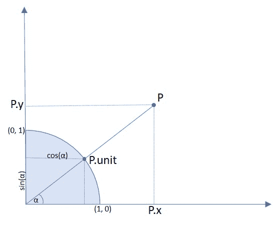

# 点

> 原文：[`pymupdf.readthedocs.io/en/latest/point.html`](https://pymupdf.readthedocs.io/en/latest/point.html)

*Point* 表示平面上的一个点，由其 x 和 y 坐标定义。

| **属性 / 方法** | **描述** |
| --- | --- |
| `Point.distance_to()` | 计算到点或矩形的距离 |
| `Point.norm()` | 欧几里得范数 |
| `Point.transform()` | 用矩阵变换点 |
| `Point.abs_unit` | 与单位相同，但坐标为正 |
| `Point.unit` | 点坐标除以 *abs(point)* |
| `Point.x` | X 坐标 |
| `Point.y` | Y 坐标 |

**类 API**

```py
class Point
```

```py
__init__(self)
```

```py
__init__(self, x, y)
```

```py
__init__(self, point)
```

```py
__init__(self, sequence)
```

> 重载的构造函数。
> 
> 没有参数时，将创建 *Point(0, 0)*。
> 
> 指定另一个点后，将创建一个**新副本**，“sequence”是一个包含 2 个数字的 Python 序列（详见 在 PyMuPDF 中使用 Python 序列作为参数）。

参数：

+   **x**（*浮点数*） – 点的 x 坐标

+   **y**（*浮点数*） – 点的 y 坐标

```py
distance_to(x[, unit])
```

> 计算到 *x* 的距离，其中 *x* 可能是 `point_like` 或 `rect_like`。距离以像素（默认）、英寸、厘米或毫米为单位给出。

参数：

+   **x**（*point_like**,**rect_like*） – 要计算距离的对象。

+   **单位**（*字符串*） – 要测量的单位。其中之一为“px”、“in”、“cm”、“mm”。

返回类型：

浮点数

返回：

到 *x* 的距离。如果这是 `rect_like`，则距离

+   是连接到矩形边之一的最短线段的长度

+   被计算为其**有限版本**

+   如果**包含**该点则为零

```py
norm()
```

+   1.16.0 版本中新增

返回点的欧几里得范数（长度）作为向量。等同于函数 *abs()* 的结果。

```py
transform(m)
```

> 将矩阵应用于点并用结果替换它。

参数：

**m**（*类似矩阵*） – 要应用的矩阵。

返回类型：

点

```py
unit
```

将每个坐标除以 *norm(point)* 的结果，点到(0,0)的距离。这是一个长度为 1 的指向与点相同方向的向量。它的 x 和 y 值等于该向量与 x 轴的夹角的余弦和正弦值。



类型：

点

```py
abs_unit
```

与上述 `unit` 相同，但用其绝对值替换坐标。

类型：

点

```py
x
```

x 坐标

类型：

浮点数

```py
y
```

y 坐标

类型：

浮点数

注意

+   此类遵循 Python 序列协议，因此也可以通过索引访问组件。还请参阅 在 PyMuPDF 中使用 Python 序列作为参数。

+   矩形可以使用算术运算符 – 见章节几何对象的运算代数。

对这个页面有任何反馈吗？

* * *

本软件按原样提供，不提供任何明示或暗示的保证。本软件根据许可证分发，未经许可不得复制、修改或分发。请参阅[artifex.com](https://www.artifex.com?utm_source=rtd-pymupdf&utm_medium=rtd&utm_content=footer-link)上的许可信息或联系美国旧金山 94129 号 39 Mesa Street, Suite 108A 的 Artifex Software Inc.获取更多信息。

此文档覆盖了所有版本直到 1.24.4。


