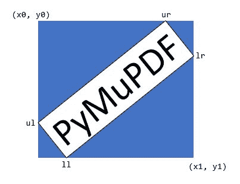

# 四边形

> 原文：[`pymupdf.readthedocs.io/en/latest/quad.html`](https://pymupdf.readthedocs.io/en/latest/quad.html)

表示平面中的四边形数学形状（也称为“四边形”或“四边形”），定义为四个 Point 对象 ul, ur, ll, lr 的序列（便于称为左上、右上、左下、右下）。

四边形可以作为文本搜索方法（`Page.search_for()`）的结果，它们用于定义文本标记注释（例如 `Page.add_squiggly_annot()` 等），以及多个绘制方法（如 `Page.draw_quad()` / `Shape.draw_quad()`， `Page.draw_oval()` / `Shape.draw_quad()`）。

注意

+   如果矩形的角点通过 **旋转**、**缩放** 或 **平移** Matrix 进行变换，则生成的四边形是 **矩形**（全等于矩形），即其所有角再次形成 90 度角。属性 `Quad.is_rectangular` 检查四边形是否可以被看作是这样一个操作的结果。

+   并非所有矩阵均满足此条件：例如，剪切矩阵生成平行四边形，而不可逆矩阵则生成“退化”四边形，如三角形或线段。

+   属性 `Quad.rect` 获取包围矩形。反之亦然，现在矩形具有属性 `Rect.quad` 和 `IRect.quad` 分别获得它们的四边形版本。

| **方法 / 属性** | **简要描述** |
| --- | --- |
| `Quad.transform()` | 使用矩阵进行变换 |
| `Quad.morph()` | 使用点和矩阵进行变形 |
| `Quad.ul` | 左上角点 |
| `Quad.ur` | 右上角点 |
| `Quad.ll` | 左下角点 |
| `Quad.lr` | 右下角点 |
| `Quad.is_convex` | 如果四边形是凸集则为 true |
| `Quad.is_empty` | 如果四边形是空集则为 true |
| `Quad.is_rectangular` | 如果四边形与矩形全等则为 true |
| `Quad.rect` | 最小包含的 Rect |
| `Quad.width` | 最长的宽度数值 |
| `Quad.height` | 最长的高度数值 |

**类 API**

```py
class Quad
```

```py
__init__(self)
```

```py
__init__(self, ul, ur, ll, lr)
```

```py
__init__(self, quad)
```

```py
__init__(self, sequence)
```

过载的构造函数：“ul”，“ur”，“ll”，“lr”表示`point_like`对象（四个角点），“sequence”是包含四个`point_like`对象的 Python 序列。

如果指定了“quad”，则构造函数会创建其的**新副本**。

没有参数时，创建包含 4 个*Point(0, 0)*的四边形。

```py
transform(matrix)
```

通过使用矩阵转换四边形的每个角来修改它。

参数：

**矩阵** (*matrix_like*) – 矩阵。

```py
morph(fixpoint, matrix)
```

*（从版本 1.17.0 开始）* 使用矩阵样式和点样式将四边形“变形”。

参数：

+   **fixpoint** (*point_like*) – 点。

+   **矩阵** (*matrix_like*) – 矩阵。

返回：

创建一个新的四边形（如果这是无限四边形，则不执行操作）。

```py
rect
```

包含四边形的最小矩形，由以下图片中的蓝色区域表示。



类型：

矩形

```py
ul
```

左上角点。

类型：

点

```py
ur
```

右上角点。

类型：

点

```py
ll
```

左下角点。

类型：

点

```py
lr
```

右下角点。

类型：

点

```py
is_convex
```

+   版本 1.16.1 中的新功能

检查四边形的任意两个点，其连接线上的所有点是否也属于四边形。

> 

类型：

布尔值

```py
is_empty
```

如果封闭区域为零，则为真，这意味着四个角中至少有三个点在同一条线上。如果为假，则四边形可能仍然退化或根本不像四边形（三角形，平行四边形，梯形，...）。

类型：

布尔值

```py
is_rectangular
```

如果所有角落的角度都为 90 度，则为真。这意味着四边形是**凸的且非空的**。

类型：

布尔值

```py
width
```

顶部和底部边的最大长度。

类型：

浮点数

```py
height
```

左右边的最大长度。

类型：

浮点数

## 备注

此类符合序列协议，因此组件也可以通过它们的索引处理。还参阅在 PyMuPDF 中使用 Python 序列作为参数。

## 代数和包含性检查

从 v1.19.6 开始，四边形可以像其他几何对象一样用于代数表达式 – 已取消了相应的限制。特别是现在可以进行所有以下包含检查的组合：

`{Point | IRect | Rect | Quad} 在 {IRect | Rect | Quad}`

请注意以下有趣的细节：

对于矩形，仅其左上角点属于矩形。自 v1.19.0 起，矩形被定义为“开放的”，因此其底部和右边缘不属于矩形 – 包括相应的角点。但对于四边形，不存在“开放性”的概念，因此我们有以下有些令人惊讶的推论：

```py
>>> rect.br in rect
False
>>> # but:
>>> rect.br in rect.quad
True 
```

对这页有任何反馈？

* * *

此软件按原样提供，不附带任何明示或暗示的保证。此软件受许可证约束，未经许可不得复制、修改或分发。请参阅[artifex.com](https://www.artifex.com?utm_source=rtd-pymupdf&utm_medium=rtd&utm_content=footer-link)获取许可信息，或联系美国旧金山 94129，Mesa 街 39 号 108A 套房的 Artifex Software Inc. 了解更多信息。

此文档涵盖了截止到 1.24.4 版本的所有内容。


## 备注

此类符合序列协议，因此组件也可以通过它们的索引处理。还请参阅在 PyMuPDF 中将 Python 序列用作参数。

## 代数和包含检查

从 v1.19.6 开始，四边形可以像其他几何对象一样用于代数表达式——相应的限制已经解除。特别地，所有以下组合的包含检查现在都是可能的：

`{点 | 矩形 | 矩形 | 四边形} 在 {矩形 | 矩形 | 四边形} 中`

请注意以下有趣的细节：

对于矩形，只有它的左上角点属于它。自 v1.19.0 起，矩形被定义为“开放的”，因此其底部和右边缘不属于它——包括相应的角落。但对于四边形来说，不存在“开放性”这样的概念，因此我们有以下有些令人惊讶的推论：

```py
>>> rect.br in rect
False
>>> # but:
>>> rect.br in rect.quad
True 
```

你对本页面有任何反馈吗？

* * *

此软件按原样提供，不附带任何明示或暗示的保证。此软件受许可证约束，未经许可不得复制、修改或分发。请参阅[artifex.com](https://www.artifex.com?utm_source=rtd-pymupdf&utm_medium=rtd&utm_content=footer-link)获取许可信息，或联系美国旧金山 94129，Mesa 街 39 号 108A 套房的 Artifex Software Inc. 了解更多信息。

此文档涵盖了截止到 1.24.4 版本的所有内容。


