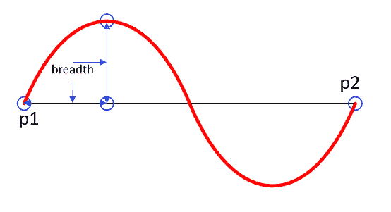
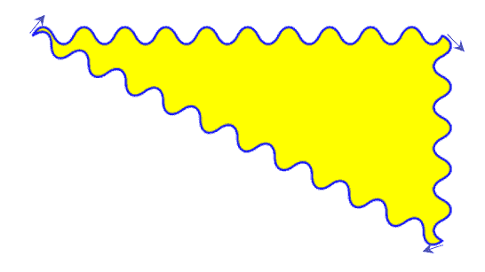
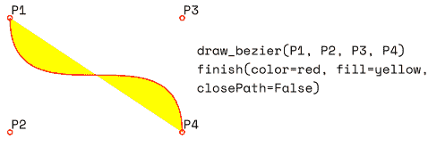
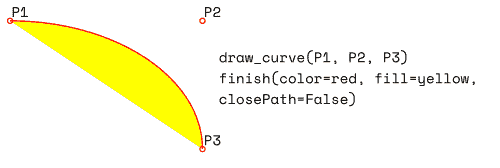
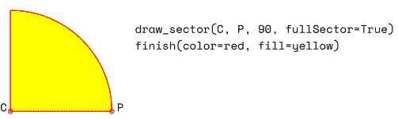
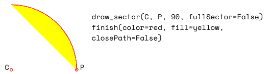
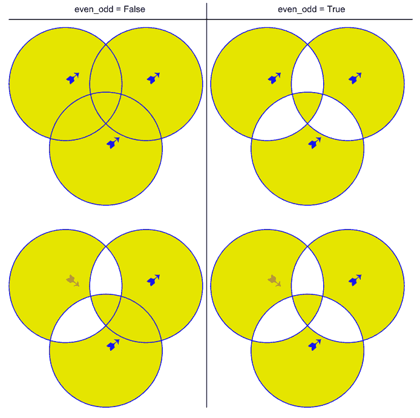
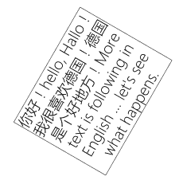
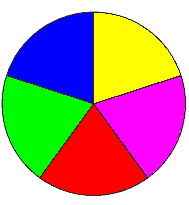
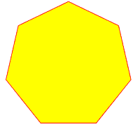

# 形状

> 原文：[`pymupdf.readthedocs.io/en/latest/shape.html`](https://pymupdf.readthedocs.io/en/latest/shape.html)

**此类仅适用于 PDF。**

此类允许在 PDF 页面上创建互连的图形元素。其方法的含义和名称与对应的 Page 方法相同。

实际上，每个 Page 绘制方法只是一个便利的包装器，包括（1）一个形状绘制方法，（2）`Shape.finish()`方法，和（3）`Shape.commit()`方法。对于页面文本插入，只调用了`Shape.commit()`方法。如果为页面执行了许多绘制和文本操作，则应始终考虑使用 Shape 对象。

可以连续执行几种绘制方法，每一种方法都将为一个绘制做出贡献。完成绘制后，必须调用`Shape.finish()`方法来应用颜色、虚线、宽度、变形和其他属性。

**此类的绘制方法（以及`Shape.insert_textbox()`）记录它们覆盖的区域在一个矩形内（`Shape.rect`）。例如，此属性可用于设置`Page.cropbox_position`。**

粗体（**Text insertions**）`Shape.insert_text()`和`Shape.insert_textbox()`隐式执行“完成”，因此只需要`Shape.commit()`生效。因此，两者都包括控制属性如颜色等的参数。

| **方法/属性** | **描述** |
| --- | --- |
| `Shape.commit()` | 更新页面内容 |
| `Shape.draw_bezier()` | 绘制三次贝塞尔曲线 |
| `Shape.draw_circle()` | 绘制围绕点的圆 |
| `Shape.draw_curve()` | 绘制使用一个辅助点的三次贝塞尔曲线 |
| `Shape.draw_line()` | 绘制直线 |
| `Shape.draw_oval()` | 绘制椭圆 |
| `Shape.draw_polyline()` | 连接一系列点 |
| `Shape.draw_quad()` | 绘制四边形 |
| `Shape.draw_rect()` | 绘制矩形 |
| `Shape.draw_sector()` | 绘制圆形扇区或饼图 |
| `Shape.draw_squiggle()` | 绘制波浪线 |
| `Shape.draw_zigzag()` | 绘制之字形线条 |
| `Shape.finish()` | 完成一组绘图命令 |
| `Shape.insert_text()` | 插入文本行 |
| `Shape.insert_textbox()` | 将文本适配到矩形中 |
| `Shape.doc` | 存储页面文档 |
| `Shape.draw_cont` | 上次`Shape.finish()`之后的绘图命令 |
| `Shape.height` | 存储页面高度 |
| `Shape.lastPoint` | 存储当前点 |
| `Shape.page` | 存储所属页面 |
| `Shape.rect` | 包围图形的矩形 |
| `Shape.text_cont` | 累积文本插入 |
| `Shape.totalcont` | 累积字符串，存储在`contents`中 |
| `Shape.width` | 存储页面宽度 |

**类 API**

```py
class Shape
```

```py
__init__(self, page)
```

创建一个新的图形。在导入 PyMuPDF 时，*pymupdf.Page*对象被赋予构造*Shape*对象的便利方法*new_shape()*。在实例化期间，将检查我们是否有 PDF 页面。否则会引发异常。

参数：

**page** (页面) – PDF 文档的现有页面。

```py
draw_line(p1, p2)
```

从`point_like`对象*p1*到*p2*绘制线条。

参数：

+   **p1** (*类似点*) – 起始点

+   **p2** (*类似点*) – 终点

返回类型：

点

返回：

终点，*p2*。

```py
draw_squiggle(p1, p2, breadth=2)
```

从`point_like`对象*p1*到*p2*绘制波浪线。始终会绘制整数个完整波浪周期，其中一个周期的长度为*4 * breadth*。根据需要调整*breath*参数以满足此条件。绘制的线条在离开*p1*时总是向“左”转向，并且总是从“右”连接到*p2*。

参数：

+   **p1** (*类似点*) – 起始点

+   **p2** (*类似点*) – 终点

+   **breadth** (*浮点数*) – 每个波浪的振幅。条件*2 * breadth < abs(p2 - p1)*必须为真，以适配至少一个波浪。参见以下图片，显示由一个完整周期连接的两个点。

返回类型：

点

返回：

终点，*p2*。



这是一个三条相连的线的示例，形成一个封闭的、填充的三角形。小箭头表示描边方向。

```py
>>> import pymupdf
>>> doc=pymupdf.open()
>>> page=doc.new_page()
>>> r = pymupdf.Rect(100, 100, 300, 200)
>>> shape=page.new_shape()
>>> shape.draw_squiggle(r.tl, r.tr)
>>> shape.draw_squiggle(r.tr, r.br)
>>> shape.draw_squiggle(r.br, r.tl)
>>> shape.finish(color=(0, 0, 1), fill=(1, 1, 0))
>>> shape.commit()
>>> doc.save("x.pdf") 
```



注意

绘制的波浪线**不是**三角函数（正弦/余弦）。如果需要，请查看[draw.py](https://github.com/pymupdf/PyMuPDF-Utilities/blob/master/examples/draw-sines/draw.py)。

```py
draw_zigzag(p1, p2, breadth=2)
```

从`point_like`对象*p1*到*p2*绘制一条锯齿线。否则，与`Shape.draw_squiggle()`完全相同。

参数：

+   **p1**（*point_like*） – 起点

+   **p2**（*point_like*） – 终点

+   **breadth**（*float*） – 运动的幅度。条件*2 * breadth < abs(p2 - p1)*必须为真，以至少适合一个周期。

返回类型：

点

返回：

终点，*p2*。

```py
draw_polyline(points)
```

在序列*points*中的点之间绘制多个连接线。通过将最后一个项目设置为第一个项目，可以用于创建任意多边形。

参数：

**points**（*sequence*） – 一系列`point_like`对象。其长度必须至少为 2（在这种情况下等效于*draw_line()*）。

返回类型：

点

返回：

*points[-1]* – 参数序列中的最后一个点。

```py
draw_bezier(p1, p2, p3, p4)
```

从*p1*到*p4*绘制标准的立方贝塞尔曲线，使用*p2*和*p3*作为控制点。

所有参数都是`point_like` s。

返回类型：

点

返回：

终点，*p4*。

注意

点不需要不同 – 尝试一些相等的情况！

示例：



```py
draw_oval(tetra)
```

在给定的四边形（四边形）内绘制一个“椭圆”。如果是正方形，则绘制正规圆，一般矩形将导致椭圆。如果使用四边形，则可以得到大量的形状。

绘图从底部左 -> 左上角线的中点开始并结束，以逆时针方向进行。

参数：

**tetra**（*rect_like**,**quad_like*） –

`rect_like`或`quad_like`。

*版本 1.14.5 中的更改：* 现在还支持四边形。

返回类型：

点

返回：

线段`rect.bl -> rect.tl`或`quad.ll -> quad.ul`的中间点。这里仅仅看几个例子，或者在 PyMuPDF-Utilities 仓库的*quad-show?.py*脚本中查看。


```py
draw_circle(center, radius)
```

给定其中心和半径，绘制一个圆。绘图从点`center - (radius, 0)`开始并结束，以**逆时针**方向进行。此点是包围正方形左侧边中点。

这是一个快捷方式，用于`draw_sector(center, start, 360, fullSector=False)`。要以**顺时针**方向绘制相同的圆，请使用`-360`作为角度。

参数：

+   **center**（*point_like*） – 圆的中心。

+   **radius**（*float*） – 圆的半径。必须为正。

返回类型：

点

返回：

`Point(center.x - radius, center.y)`。


```py
draw_curve(p1, p2, p3)
```

*draw_bezier()* 的特例：从 *p1* 到 *p3* 绘制三次贝塞尔曲线。在线段 `p1 -> p2` 和 `p3 -> p2` 上生成一个控制点。因此，两个控制点都位于线段 `p1 -> p3` 的同一侧。这保证了曲线的曲率不会改变其符号。如果到达 *p2* 的线段成 90 度角，则生成的曲线是一个四分之一椭圆（或同样长度的四分之一圆）。

所有参数都是`point_like`。

返回类型：

点

返回：

端点 *p3*。以下是一个填充的四分之一椭圆段。黄色区域的方向为**顺时针**：



```py
draw_sector(center, point, angle, fullSector=True)
```

绘制一个圆形扇区，可选地将弧连接到圆的中心（就像一个饼图片段）。

参数：

+   **center**（*point_like*） – 圆的中心。

+   **point**（*point_like*） – 饼图弧段的两个端点之一。另一个端点由 *angle* 计算得出。

+   **angle**（*float*） – 扇形的角度（以度为单位）。用于计算弧的另一个端点。根据其符号，弧可能逆时针绘制（正）或顺时针绘制。

+   **fullSector**（*bool*） – 是否从弧的两端绘制连接线到圆心。如果指定了填充颜色，则整个“饼图”会被着色，否则只有扇区被着色。

返回类型：

点

返回：

弧的另一个端点。可以用作创建逻辑连接的饼图的后续调用的起点。示例：



```py
draw_rect(rect, *, radius=None)
```

+   自 v1.22.0 更改：添加参数 *radius*。

绘制一个矩形。绘制从左上角开始并以逆时针方向结束的图形。

参数：

+   **rect**（*rect_like*） – 矩形在页面上的位置。

+   **radius**（*multiple*） – 绘制圆角矩形的圆角。如果不是 `None`，则指定圆角的曲率半径，作为矩形边长的百分比。必须是一个或两个浮点数 `0 < radius <= 0.5`，其中 0.5 对应于相应边长的 50%。如果是一个浮点数，则曲率的半径计算为 `radius * min(width, height)`，绘制角的周长作为四分之一圆。如果给出一个元组 `(rx, ry)`，则曲率是关于水平和垂直方向不对称的。`radius=(0.5, 0.5)` 绘制一个椭圆。

返回类型：

点

返回：

矩形的左上角。

```py
draw_quad(quad)
```

绘制一个四边形。绘制从左上角（`Quad.ul`）开始并以逆时针方向结束的图形。这是使用参数 `(ul, ll, lr, ur, ul)` 调用 `Shape.draw_polyline()` 的快捷方式。

参数：

**quad** (*quad_like*) – 在页面上放置四边形的位置。

返回类型：

Point

返回：

`Quad.ul`。

```py
finish(width=1, color=(0,), fill=None, lineCap=0, lineJoin=0, dashes=None, closePath=True, even_odd=False, morph=(fixpoint, matrix), stroke_opacity=1, fill_opacity=1, oc=0)
```

通过将 Common Parameters 应用于所有*draw*()*方法来完成一组绘制*draw*()*方法。

`Shape.insert_text()`和`Shape.insert_textbox()`对此没有影响。

该方法还支持使用 Point *fixpoint*和 Matrix *matrix*对复合图形进行**变形**。

参数：

+   **morph** (*sequence*) – 在某个任意的 Point *fixpoint*周围对文本或复合图形进行变形，方法是将 Matrix *matrix*应用于它。这意味着*fixpoint*是此操作的**固定点**：它不会改变其位置。默认值为无变形（*None*）。矩阵的前 4 个组件可以包含任何值，但*matrix.e == matrix.f == 0*必须为真。这意味着可以进行任意组合的缩放、倾斜、旋转、翻转等操作，但不能进行平移。

+   **stroke_opacity** (*float*) – *(new in v1.18.1)* 设置笔触颜色的透明度。值小于 0 或大于 1 将被忽略。默认值为 1（不透明）。

+   **fill_opacity** (*float*) – *(new in v1.18.1)* 设置填充颜色的透明度。默认值为 1（不透明）。

+   **even_odd** (*bool*) – 请求使用**“even-odd 规则”**进行填充操作。默认值为*False*，因此使用**“nonzero winding number 规则”**。这些规则是在区域重叠时应用填充颜色的备选方法。只有在相当复杂的形状中，才会使用这些规则产生不同的行为。有关详细解释，请参阅 Adobe PDF References，第 137 页及以后。以下是一个示例，演示了差异。

+   **oc** (*int*) – *(new in v1.18.4)* `xref`的数字，表示可以有条件地显示此绘图的`OCG`或`OCMD`。



注

对于形状中的每个像素，将发生以下情况：

1.  规则 **“even-odd”** 计算像素包含的区域数。如果此计数为**奇数**，则像素被视为**内部**形状；如果为**偶数**，则像素被视为**外部**形状。

1.  默认规则 **“nonzero winding”** 还会查看包含像素的每个区域的“*方向*”：如果区域逆时针绘制，则**加 1**；如果顺时针，则**减 1**。如果结果为零，则像素被视为**外部**，具有非零计数的像素被视为**内部**形状。

在上图的四个形状中，上两个形状分别显示了以标准方式绘制的三个圆（逆时针，查看箭头）。下面的两个形状包含一个（左上角）按顺时针方向绘制的圆。可以看出，面积方向对右侧列（奇偶规则）无关紧要。

```py
insert_text(point, text, fontsize=11, fontname='helv', fontfile=None, set_simple=False, encoding=TEXT_ENCODING_LATIN, color=None, lineheight=None, fill=None, render_mode=0, border_width=1, rotate=0, morph=None, stroke_opacity=1, fill_opacity=1, oc=0)
```

插入文本行从 *point* 处开始。

参数：

+   **point** (*point_like*) –

    *text* 的左下角第一个字符的像素位置。了解它如何与 *rotate* 参数结合使用很重要。请参考下图。小红点表示 *point* 在四种可能情况下的位置。

    

+   **text** (*str/sequence*) – 要插入的文本。可以指定为字符串类型或序列类型。对于包含换行符 *n* 的序列或字符串，将插入多行。不会处理行太宽的问题，但插入的行数将受页面上的“垂直”空间限制（根据 *rotate* 参数所建立的阅读方向）。任何文本的剩余部分将被丢弃 – 但是返回代码包含插入行的数量。

+   **lineheight** (*float*) – 一个因子，用于覆盖从字体属性计算的行高。如果不是 `None`，将使用 `fontsize * lineheight` 的行高。

+   **stroke_opacity** (*float*) – *(v1.18.1 新增)* 设置描边颜色（字符的**边框线**）的透明度。只有 `0 <= value <= 1` 的值会被考虑。默认为 1（不透明）。

+   **fill_opacity** (*float*) – *(v1.18.1 新增)* 设置填充颜色的透明度。默认为 1（不透明）。使用此值来控制文本颜色的透明度。描边透明度**仅**影响字符的边框线。

+   **rotate** (*int*) – 决定是否旋转文本。可接受的值为 90 度的倍数。默认为 0（无旋转），意味着从左到右的水平文本行。180 表示从**右到左**倒置显示文本。90 表示逆时针旋转，文本向**上**运行。270（或-90）表示顺时针旋转，文本向**下**运行。在任何情况下，*point* 指定第一个字符矩形的左下角坐标。如果存在多行，则始终按照此参数建立的阅读方向进行排列。因此，在 `rotate = 180` 的情况下，第二行位于第一行**上方**，依此类推。

+   **oc** (*int*) – *(v1.18.4 新增)* 表示一个 `Xref` 的编号，用于使此文本在特定条件下显示。

返回类型：

int

返回：

插入的行数。

其他参数的描述请参见 Common Parameters。

```py
insert_textbox(rect, buffer, fontsize=11, fontname='helv', fontfile=None, set_simple=False, encoding=TEXT_ENCODING_LATIN, color=None, fill=None, render_mode=0, border_width=1, expandtabs=8, align=TEXT_ALIGN_LEFT, rotate=0, lineheight=None, morph=None, stroke_opacity=1, fill_opacity=1, oc=0)
```

仅适用于 PDF：将文本插入指定的矩形区域。文本将被分割成行和单词，然后填充到可用空间中，从四个矩形角之一开始，这取决于 `rotate`。将尊重换行符和多个空格。

参数：

+   **rect** (*rect_like*) – 要使用的区域。必须是有限且非空的。

+   **buffer**（*str/sequence*）– 要插入的文本。必须指定为字符串或字符串序列。即使在序列条目中也会尊重换行。

+   **align**（*int*）– 对齐每一行文本。默认为 0（左对齐）。居中、右对齐和两端对齐是其他支持的选项，请参阅 文本对齐。请注意，参数值 *TEXT_ALIGN_JUSTIFY* 的效果仅可通过“简单”（单字节）字体（包括 PDF 基本 14 字体）实现。

+   **lineheight**（*float*）–

    一个因子，用于覆盖从字体属性计算出的行高。如果不是 `None`，则将使用行高 `fontsize * lineheight`。

    arg int expandtabs:

    使用 `string.expandtabs()` 方法**逐行**控制制表符 `\t` 的处理。

+   **stroke_opacity**（*float*）– （在 v1.18.1 中新增）设置描边颜色的透明度。负值和大于 1 的值将被忽略。默认为 1（不透明）。

+   **fill_opacity**（*float*）– （在 v1.18.1 中新增）设置填充颜色的透明度。默认为 1（不透明）。使用此值控制文本颜色的透明度。描边不透明度**仅**影响字符的边框线。

+   **rotate**（*int*）– 请求文本在矩形中旋转。该值必须是 90 度的倍数。默认为 0（不旋转）。实际上，处理四个值 `0`、`90`、`180` 和 `270`（= `-90`），每个值导致文本从不同的矩形角开始。左下角是 `90`，右下角是 `180`，`-90 / 270` 是右上角。请参阅示例，了解文本如何填充到矩形中。此参数优先于变形。请参阅第二个示例，其中文本首先向左旋转了 `90` 度，然后整个矩形围绕其左下角顺时针旋转。

+   **oc**（*int*）– （在 v1.18.4 中新增）`xref`编号，用于使此文本有条件地显示为 `OCG` 或 `OCMD`。

返回类型：

浮点

返回：

**如果为正数或零**：执行成功。返回的值是像素中未使用的矩形线空间。这可以安全地忽略 – 或用于优化矩形，定位后续项目等。

**如果为负数**：不执行。返回的值是存储文本行的空间不足。扩大矩形，减小 *fontsize*，减少文本数量等。

 

有关其他参数的描述，请参阅 常见参数。

```py
commit(overlay=True)
```

更新页面的 `contents`，其中包含累积的绘图，然后是任何文本插入。如果文本重叠绘图，则将在绘图的顶部写入。

警告

**不要忘记执行此方法：**

如果形状**未提交，它将被忽略，并且页面不会更改！**

方法将重置属性`Shape.rect`，`lastPoint`，`draw_cont`，`text_cont`和`totalcont`。之后，形状对象可以在**同一页**中重新使用。

参数：

**overlay**（*bool*）– 确定是否将内容放置在前景（默认）或背景中。仅当页面已经具有非空`contents`对象时才相关。

**———- 属性 ———-**

```py
doc
```

仅供参考：页面的文档。

类型：

文档

```py
page
```

仅供参考：拥有的页面。

类型：

页面

```py
height
```

页面的高度副本

类型：

浮点

```py
width
```

页面的宽度副本。

类型：

浮点数

```py
draw_cont
```

自上次完成以来的**draw 方法**累积的命令缓冲区。每个完成方法将其命令附加到`Shape.totalcont`。

类型：

str

```py
text_cont
```

累积的文本缓冲区。所有**文本插入**都在这里进行。此缓冲区将附加到`totalcont` `Shape.commit()`，因此文本永远不会被同一形状中的绘图覆盖。

类型：

str

```py
rect
```

围绕绘图的矩形。此属性可供您使用，并且可以随时更改。在创建或提交形状时，其值设置为*None*。每个*draw*方法以及`Shape.insert_textbox()`将更新此属性（即**根据需要扩展**矩形）。然而，*morphing*操作（`Shape.finish()`，`Shape.insert_textbox()`）将被忽略。

此属性的典型用法是在稍后或外部使用时将`Page.cropbox_position`设置为此值。如果您未手动操作属性，则应反映一个包含到目前为止所有绘图的矩形。

如果您使用了 morphing 并且需要包含 morphed 对象的矩形，请使用以下代码：

```py
>>> # assuming ...
>>> morph = (point, matrix)
>>> # ... recalculate the shape rectangle like so:
>>> shape.rect = (shape.rect - pymupdf.Rect(point, point)) * ~matrix + pymupdf.Rect(point, point) 
```

类型：

矩形

```py
totalcont
```

用于 draws 和 text insertions 的总累积命令缓冲区。这将被`Shape.commit()`使用。

类型：

str

```py
lastPoint
```

仅供参考：绘图路径的当前点。在*Shape*创建后以及每次*finish()*和*commit()*之后为*None*。

类型：

点

## 用法

通过*shape = page.new_shape()*构造绘图对象。之后，可以跟随所需数量的 draw、finish 和 text insertions 方法。在提交绘图之前必须完成每个绘制序列。整体编码模式如下：

```py
>>> shape = page.new_shape()
>>> shape.draw1(...)
>>> shape.draw2(...)
>>> ...
>>> shape.finish(width=..., color=..., fill=..., morph=...)
>>> shape.draw3(...)
>>> shape.draw4(...)
>>> ...
>>> shape.finish(width=..., color=..., fill=..., morph=...)
>>> ...
>>> shape.insert_text*
>>> ...
>>> shape.commit()
>>> .... 
```

注意

1.  每个 *finish()* 将前面的绘制组合成一个逻辑形状，使其具有共同的颜色、线宽、变形等。如果指定了 *closePath*，它还将连接最后一个绘制的结束点与第一个绘制的起始点。

1.  要成功创建复合图形，请让每个绘制方法使用前一个绘制的结束点作为其起始点。在上述伪代码中，*draw2* 因此应使用 *draw1* 的返回的 Point 作为其起始点。如果未能如此做，将自动开始一个新路径，并且 *finish()* 可能不会按预期工作（但它也不会报错）。

1.  文本插入可以出现在提交之前的任何位置（它们既不接触 `Shape.draw_cont` 也不接触 `Shape.lastPoint`）。它们将直接附加到 *Shape.totalcont*，而绘制则将由 *Shape.finish* 附加。

1.  每个 *commit* 将所有文本插入和形状放置在页面的前景或背景中，从而提供了一种控制图形层的方法。

1.  **只有** *commit* **将更新** 页面的内容，其他方法基本上是字符串操作。

## 示例

1.  创建不同颜色的饼图完整圆形：

    ```py
    shape = page.new_shape()  # start a new shape
    cols = (...)  # a sequence of RGB color triples
    pieces = len(cols)  # number of pieces to draw
    beta = 360. / pieces  # angle of each piece of pie
    center = pymupdf.Point(...)  # center of the pie
    p0 = pymupdf.Point(...)  # starting point
    for i in range(pieces):
        p0 = shape.draw_sector(center, p0, beta,
                              fullSector=True) # draw piece
        # now fill it but do not connect ends of the arc
        shape.finish(fill=cols[i], closePath=False)
    shape.commit()  # update the page 
    ```

下面是 5 种颜色的示例：



1.  创建常规的 n 边形（填充黄色，红色边框）。我们仅使用 *draw_sector()* 计算周长上的点，并在绘制多边形之前清空绘制命令缓冲区：

    ```py
    shape = page.new_shape() # start a new shape
    beta = -360.0 / n  # our angle, drawn clockwise
    center = pymupdf.Point(...)  # center of circle
    p0 = pymupdf.Point(...)  # start here (1st edge)
    points = [p0]  # store polygon edges
    for i in range(n):  # calculate the edges
        p0 = shape.draw_sector(center, p0, beta)
        points.append(p0)
    shape.draw_cont = ""  # do not draw the circle sectors
    shape.draw_polyline(points)  # draw the polygon
    shape.finish(color=(1,0,0), fill=(1,1,0), closePath=False)
    shape.commit() 
    ```

下面是 n = 7 的多边形：

 ## 常用参数

**fontname** (*str*)

> 通常有三种选项：
> 
> 1.  使用标准的 PDF 基本 14 字体 之一。在这种情况下，如果省略此参数，则必须不指定 *fontfile*，且将使用 *“Helvetica”*。
> 1.  
> 1.  选择页面已经在使用的字体。然后指定其带斜杠“/”的**引用**名称，如下例所示。
> 1.  
> 1.  指定系统中存在的字体文件。在这种情况下，选择一个任意的新名称用于此参数（不带“/”前缀）。
> 1.  
> 如果插入的文本应重用页面的某个字体，请使用其在 `Page.get_fonts()` 中出现的引用名称，如下所示：
> 
> 假设字体列表中有项目 *[1024, 0, ‘Type1’, ‘NimbusMonL-Bold’, ‘R366’]*，则指定 *fontname = “/R366”，fontfile = None* 使用字体 *NimbusMonL-Bold*。

* * *

**fontfile** (*str*)

> 您计算机上现有的字体文件路径。如果指定了 *fontfile*，请确保使用上述列表中不存在的 *fontname*。此新字体将在 *doc.save()* 时嵌入 PDF。类似于新图像，每个字体文件只会被嵌入一次。使用二进制字体内容的 MD5 码表来确保这一点。

* * *

**set_simple** (*bool*)

> 从文件安装的字体默认安装为**Type0**字体。如果要仅使用 1 字节字符，请将此设置为 true。此设置无法恢复。后续更改将被忽略。

* * *

**fontsize**（*浮点数*）

> 文本的字体大小，请参见：`fontsize`。

* * *

**dashes**（*字符串*）

> 导致线条绘制为虚线。一般格式为`"[n m] p"`，其中（最多）3 个浮点数表示像素长度。`n` 是虚线长度，`m`（可选）是随后的间隔长度，`p`（“相位” - **必须的**，即使为 0！）指定虚线开始之前应跳过多少像素。如果省略 `m`，则默认为 `n`。
> 
> 使用`"[] 0"`或*None*或`""`绘制连续线条（无虚线）。示例：
> 
> +   指定 `"[3 4] 0"` 意味着 3 像素虚线和 4 像素间隔交替出现。
> +   
> +   `"[3 3] 0"` 和 `"[3] 0"` 做同样的事情。
> +   
> 有关如何实现复杂虚线效果的详细信息，请参见 Adobe PDF 参考手册，第 217 页。

* * *

**color / fill**（*列表、元组*）

> 描边和填充颜色可以指定为浮点数列表或元组，范围从 0 到 1。这些序列必须具有长度为 1（GRAY）、3（RGB）或 4（CMYK）。对于 GRAY 颜色空间，可以接受单个浮点数，而不是笨重的*(float,)*或*[float]*。接受（默认）或使用`None`来不使用该参数。
> 
> 为了简化颜色规范，*pymupdf.utils* 中的 *getColor()* 方法可以通过名称获取预定义的 RGB 颜色三元组。它接受颜色名称的字符串，并返回相应的三元组。该方法知道超过 540 个颜色名称 - 请参阅颜色数据库部分。
> 
> 请注意，当与填充颜色一起使用时，术语*color*通常意味着“描边”颜色。
> 
> 如果将颜色参数默认为 `None`，则不会生成相应的颜色选择命令。如果*fill*和*color*都是 `None`，则绘图将不包含颜色规范。但仍将“描边”，这会导致 PDF 默认颜色“黑色”被 Adobe Acrobat 和所有其他查看器使用。

* * *

**width**（*浮点数*）

> 形状中元素的描边（“边框”）宽度（如果适用）。默认值为 1。width、color 和 fill 有以下关系/依赖：
> 
> +   如果 `fill=None`，则形状元素始终会带有边框，即使 `color=None`（此时取黑色）或 `width=0`（此时取 1）也是如此。
> +   
> +   形状没有边框只能在指定了填充颜色（当然可以是白色）的情况下实现。要实现这一点，请指定`width=0`。在这种情况下，`color` 参数将被忽略。

* * *

**stroke_opacity / fill_opacity**（*浮点数*）

> 两个值都是在范围[0, 1]内的浮点数。负值或大于 1 的值将被忽略（在大多数情况下）。两者设置透明度，使得值 0.5 对应于 50％的透明度，0 表示不可见，1 表示不透明。例如，对于矩形，边框透明度适用于其边框，而填充透明度适用于其内部。
> 
> 对于文本插入（`Shape.insert_text()`和`Shape.insert_textbox()`），使用*fill_opacity*控制文本的透明度。乍一看，这似乎令人惊讶，但是当你继续查看*render_mode*时，它就变得明显了：*fill_opacity*适用于黄色，*stroke_opacity*适用于蓝色。

* * *

**border_width**（*浮点数*）

> 设置文本插入的边框宽度。在 v1.14.9 中新增。仅在使用大于零的值的渲染模式参数时相关。

* * *

**render_mode**（*整数*）

> *1.14.9 版本中新增：* `range(8)` 中的整数，控制文本外观（`Shape.insert_text()`和`Shape.insert_textbox()`）。参见 Adobe PDF 参考手册第 246 页。在 v1.14.9 中新增。这些方法现在也区分填充和描边颜色。
> 
> +   对于默认值为 0，只使用文本填充颜色来绘制文本。为了向后兼容，也可以使用*color*参数。 
> +   
> +   对于渲染模式 1，只绘制每个字形（即文本字符）的边框，边框的厚度由*border_width*参数设置。选用*color*参数中的颜色，*fill*参数将被忽略。
> +   
> +   对于渲染模式 2，字形填充并描边，同时使用颜色参数和指定的边框宽度。您可以使用此值来模拟**粗体文本**，而无需使用另一种字体：选择相同值的*fill*和*color*以及适当的*border_width*值。
> +   
> +   对于渲染模式 3，字形既不描边也不填充：文本变得不可见。
> +   
> 以下示例使用 border_width=0.3，字体大小为 15。描边颜色为蓝色，填充颜色为一些黄色。
> 
> 

* * *

**overlay**（*布尔值*）

> 使项目出现在前景（默认）或背景中。

* * *

**morph**（*序列*）

> 导致“形态变化”形状或页面方法插入的文本（如 *insert_textbox()* / *insert_text()*）的“形态变化”。如果不是 *None*，必须是一个 *(fixpoint, matrix)* 对，其中 *fixpoint* 是一个 Point，*matrix* 是一个 Matrix。矩阵可以是除了平移以外的任何内容，即 *matrix.e == matrix.f == 0* 必须为真。点用作矩阵操作的固定点。例如，如果 *matrix* 是旋转或缩放，则 *fixpoint* 是其中心。类似地，如果 *matrix* 是左右或上下翻转，则镜像轴将是通过 *fixpoint* 的垂直或水平线等。
> 
> 注意
> 
> 若干方法包含检查即将插入项目是否实际适合页面的代码（如 `Shape.insert_text()` 或 `Shape.draw_rect()`）。但形态操作的结果则无此保证：这完全取决于程序员的责任。

* * *

**lineCap (已弃用：“roundCap”)** (*int*)

> 控制线段的外观。默认值 0 使每条线段正好以给定坐标处的尖角结束。值为 1 添加一个半圆到末端，其中心是端点，直径为线宽。值为 2 添加一个半正方形，边长为线宽，中心为线段的末端。
> 
> *自版本 1.14.15 更改*

* * *

**lineJoin** (*int*)

> *自版本 1.14.15 新增:* 控制线连接外观的方式。可以是尖角（0）、圆形连接（1）或截断边缘（2，“butt”）。

* * *

**closePath** (*bool*)

> 导致绘图的终点自动与起点连接（通过直线）。

对本页有任何反馈意见吗？

* * *

本软件按原样提供，不附带任何明示或暗示的担保。本软件根据许可分发，未经许可不得复制、修改或分发。有关详细信息，请参阅 [artifex.com](https://www.artifex.com?utm_source=rtd-pymupdf&utm_medium=rtd&utm_content=footer-link) 的许可信息或联系美国加利福尼亚州旧金山 Mesa 街 39 号 108A 单元的 Artifex Software Inc.。

此文档覆盖所有版本直至 1.24.4。


## 用法

绘图对象由 *shape = page.new_shape()* 构造。此后，可以按需使用许多绘制、完成和文本插入方法。每个绘制序列必须在提交绘图之前完成。整体编码模式如下：

```py
>>> shape = page.new_shape()
>>> shape.draw1(...)
>>> shape.draw2(...)
>>> ...
>>> shape.finish(width=..., color=..., fill=..., morph=...)
>>> shape.draw3(...)
>>> shape.draw4(...)
>>> ...
>>> shape.finish(width=..., color=..., fill=..., morph=...)
>>> ...
>>> shape.insert_text*
>>> ...
>>> shape.commit()
>>> .... 
```

注意

1.  每个 *finish()* 将前面的绘制组合成一个逻辑形状，赋予其共同的颜色、线宽、形态操作等。如果指定了 *closePath*，它还会连接最后一个绘制的终点与第一个绘制的起点。

1.  为了成功创建复合图形，让每个绘制方法使用前一个绘制方法的终点作为其起点。在上述伪代码中，*draw2*应该使用*draw1*返回的 Point 作为其起点。如果未这样做，将会自动启动一个新路径，并且*finish()*可能不会按预期工作（但它也不会抱怨）。

1.  文本插入可以出现在提交之前的任何地方（它们不会触及`Shape.draw_cont`或者`Shape.lastPoint`）。它们直接附加到*Shape.totalcont*，而绘制将通过*Shape.finish*附加。

1.  每次*commit*都会获取所有文本插入和形状，并将它们放置在页面的前景或背景上 - 因此提供了控制图形层的一种方式。

1.  **只有** *commit* **将更新** 页面的内容，其他方法基本上是字符串操作。

## 示例

1.  创建一个由不同颜色的扇形组成的完整圆：

    ```py
    shape = page.new_shape()  # start a new shape
    cols = (...)  # a sequence of RGB color triples
    pieces = len(cols)  # number of pieces to draw
    beta = 360. / pieces  # angle of each piece of pie
    center = pymupdf.Point(...)  # center of the pie
    p0 = pymupdf.Point(...)  # starting point
    for i in range(pieces):
        p0 = shape.draw_sector(center, p0, beta,
                              fullSector=True) # draw piece
        # now fill it but do not connect ends of the arc
        shape.finish(fill=cols[i], closePath=False)
    shape.commit()  # update the page 
    ```

这是一个 5 种颜色的示例：


1.  创建一个常规的 n 边形（填充黄色，红色边框）。我们只使用`draw_sector()`来计算周长上的点，并在绘制多边形之前清空绘图命令缓冲区：

    ```py
    shape = page.new_shape() # start a new shape
    beta = -360.0 / n  # our angle, drawn clockwise
    center = pymupdf.Point(...)  # center of circle
    p0 = pymupdf.Point(...)  # start here (1st edge)
    points = [p0]  # store polygon edges
    for i in range(n):  # calculate the edges
        p0 = shape.draw_sector(center, p0, beta)
        points.append(p0)
    shape.draw_cont = ""  # do not draw the circle sectors
    shape.draw_polyline(points)  # draw the polygon
    shape.finish(color=(1,0,0), fill=(1,1,0), closePath=False)
    shape.commit() 
    ```

这是 n = 7 的多边形示例：

 ## 常见参数

**fontname**（*str*）

> 通常有三种选项：
> 
> 1.  使用标准的 PDF Base 14 字体之一。在这种情况下，如果未指定此参数，*fontfile* **不能**被指定，并且使用*“Helvetica”*。
> 1.  
> 1.  选择页面中已经使用的字体。然后指定其以斜杠“/”为前缀的**参考**名称，如下例所示。
> 1.  
> 1.  指定系统上存在的字体文件。在这种情况下，选择一个任意的但是新的参数名（不带“/”前缀）。
> 1.  
> 如果插入的文本应该重复使用页面的某个字体，请使用出现在`Page.get_fonts()`中的其参考名称，如下所示：
> 
> 假设字体列表中有项*[1024, 0, ‘Type1’, ‘NimbusMonL-Bold’, ‘R366’]*，则指定*fontname = “/R366”， fontfile = None*来使用字体*NimbusMonL-Bold*。

* * *

**fontfile**（*str*）

> 您计算机上存在的字体文件路径。如果指定了`fontfile`，请确保使用上述列表中**不存在**的*fontname*。这个新字体将在*doc.save()*时嵌入 PDF 中。与新图像类似，字体文件只会被嵌入一次。使用二进制字体内容的 MD5 代码表来确保这一点。

* * *

**set_simple**（*bool*）

> 从文件安装的字体默认为**Type0**字体。如果只想使用 1 字节字符，请将此设置为 true。此设置无法恢复。后续更改将被忽略。

* * *

**fontsize**（*float*）

> 文本的字体大小，参见：`fontsize`。

* * *

**dashes**（*str*）

> 导致绘制的线条为虚线。一般格式为`"[n m] p"`，其中最多有 3 个浮点数表示像素长度。`n`是虚线的长度，`m`（可选）是随后的间隔长度，`p`（“相位” - **必需**，即使为 0！）指定在虚线开始之前应跳过多少像素。如果省略`m`，则默认为`n`。
> 
> 使用`"[] 0"`或*None*或`""`绘制连续线条（无虚线）。示例：
> 
> +   指定`"[3 4] 0"`意味着 3 个像素长的虚线和 4 个像素长的间隔交替出现。
> +   
> +   `"[] 0"`和`"[3] 0"`做同样的事情。
> +   
> 有关如何实现复杂的虚线效果的详细信息，请参阅 Adobe PDF 参考手册，第 217 页。

* * *

**color / fill** (*list, tuple*)

> 可以将描边和填充颜色指定为浮点数的元组或列表，范围从 0 到 1。这些序列必须具有长度为 1（灰度）、3（RGB）或 4（CMYK）。对于灰度色彩空间，也可以接受单个浮点数而不是笨重的*(float,)*或*[float]*。接受（默认）或使用`None`来不使用该参数。
> 
> 为了简化颜色的指定，可以使用*pymupdf.utils*中的*getColor()*方法通过名称获取预定义的 RGB 颜色三元组。它接受一个颜色名称的字符串，并返回相应的三元组。该方法知道超过 540 个颜色名称 - 见章节颜色数据库。
> 
> 请注意，术语*color*通常在与填充颜色一起使用时指“描边”颜色。
> 
> 如果将颜色参数设为`None`，则不会生成相应的颜色选择命令。如果*fill*和*color*都是`None`，则绘图不包含颜色规范。但仍会进行“描边”，这将导致 Adobe Acrobat 和所有其他查看器使用 PDF 的默认颜色“黑色”。

* * *

**width** (*float*)

> 元素形状中的描边（“边框”）宽度（如果适用）。默认值为 1。宽度、颜色和填充的关系/依赖如下：
> 
> +   如果`fill=None`，则形状元素始终将带有边框 - 即使`color=None`（此时将使用黑色）或`width=0`（此时将使用 1）。
> +   
> +   仅通过指定填充颜色（当然可以是白色）才能实现没有边框的形状。为此，请指定`width=0`。在这种情况下，将忽略`color`参数。

* * *

**stroke_opacity / fill_opacity** (*floats*)

> 两个值都是范围在[0, 1]的浮点数。负值或大于 1 的值将被忽略（在大多数情况下）。两者设置透明度，使得数值 0.5 对应 50%的透明度，0 表示不可见，1 表示不透明。例如，对于矩形，描边透明度适用于其边框，填充透明度适用于其内部。
> 
> 对于文本插入（`Shape.insert_text()`和`Shape.insert_textbox()`)，使用*fill_opacity*来设置文本的透明度。乍一看这似乎令人惊讶，但当您进一步查看*render_mode*时，这变得显而易见：*fill_opacity*适用于黄色，*stroke_opacity*适用于蓝色。

* * *

**border_width**（*浮点数*）

> 设置文本插入的边框宽度。在 v1.14.9 中新增。仅当使用渲染模式参数值大于零时相关。

* * *

**渲染模式**（*整数*）

> *版本 1.14.9 中的新功能：*`range(8)`中的整数控制文本外观（`Shape.insert_text()`和`Shape.insert_textbox()`）。参见 Adobe PDF References 第 246 页。在 v1.14.9 中新增功能。这些方法现在还区分填充和描边颜色。
> 
> +   对于默认的 0，只使用文本填充颜色来绘制文本。为了向后兼容，也可以使用*color*参数。
> +   
> +   对于渲染模式 1，只绘制每个字形（即文本字符）的边框，其厚度由*border_width*参数设置。选定的*color*参数的颜色用于此操作，*fill*参数被忽略。
> +   
> +   对于渲染模式 2，字形被填充并描边，使用颜色参数和指定的边框宽度。您可以使用此值模拟**粗体文本**而无需使用其他字体：选择相同的值作为*fill*和*color*，并为*border_width*选择适当的值。
> +   
> +   对于渲染模式 3，字形既不描边也不填充：文本变得不可见。
> +   
> 以下示例使用 border_width=0.3，以及字体大小为 15。描边颜色为蓝色，填充颜色为某种黄色。
> 
> 

* * *

**叠加**（*布尔值*）

> 导致项目出现在前景（默认）或背景中。

* * *

**变形**（*序列*）

> 导致了形状的“变形”，这些形状是由*draw*()*方法创建的，或者是由页面方法*insert_textbox()* / *insert_text()*插入的文本。如果不是*None*，它必须是一对*(fixpoint, matrix)*，其中*fixpoint*是点，*matrix*是矩阵。矩阵可以是除了平移以外的任何东西，即*matrix.e == matrix.f == 0*必须为真。该点被用作矩阵操作的固定点。例如，如果*matrix*是旋转或缩放，则*fixpoint*是其中心。同样地，如果*matrix*是左右或上下翻转，则镜像轴将分别通过*fixpoint*形成垂直或水平线等。
> 
> 注意
> 
> 几种方法包含检查，用于确定要插入的项目是否实际适合页面（例如 `Shape.insert_text()` 或 `Shape.draw_rect()`）。然而，对于变形操作的结果，没有这样的保证：这完全由程序员负责。

* * *

**lineCap（已弃用：“roundCap”）** (*整型*)

> 控制线端的外观。默认值 0 让每条线在给定坐标处具有尖锐的边缘。值为 1 会在端点添加一个半圆，其中心是端点，直径是线宽。值为 2 添加一个半方形，边长为线宽，中心是线端。
> 
> *版本 1.14.15 中更改*

* * *

**lineJoin** (*整型*)

> *版本 1.14.15 新特性：* 控制线连接的外观方式。可以是尖锐边缘（0）、圆角连接（1）或截断边缘（2，“butt”）。

* * *

**closePath** (*布尔型*)

> 导致绘图的端点自动与起始点连接（通过直线）。

对此页面有任何反馈意见吗？

* * *

此软件按原样提供，不附带任何明示或暗示的担保。此软件按许可分发，并且未经授权不得复制、修改或分发。请参阅[artifex.com](https://www.artifex.com?utm_source=rtd-pymupdf&utm_medium=rtd&utm_content=footer-link)获取许可信息，或联系美国旧金山 CA 94129 Mesa Street 39 号 Suite 108A 的 Artifex Software Inc. 以获取更多信息。

此文档涵盖了所有版本直至 1.24.4。


