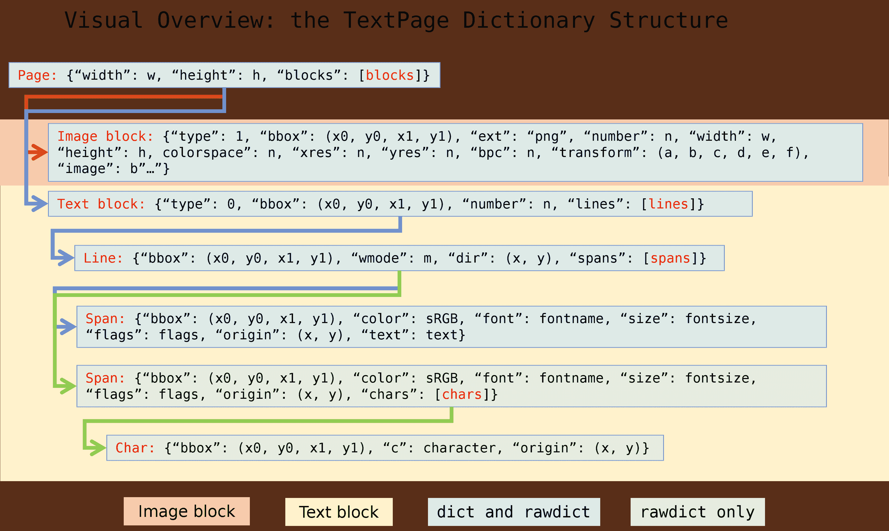

# 文本页

> 原文：[`pymupdf.readthedocs.io/en/latest/textpage.html`](https://pymupdf.readthedocs.io/en/latest/textpage.html)

此类代表文档页面上显示的文本和图像。支持所有的 MuPDF 文档类型。

创建文本页的常规方法是使用`DisplayList.get_textpage()`和`Page.get_textpage()`。因为此类中的方法集合有限，在 Page 中存在更方便使用的包装器。此表的最后一列显示了这些相应的 Page 方法。

对于此类的描述，请参阅附录 2。

| **方法** | **描述** | 页面 get_text 或 search 方法 |
| --- | --- | --- |
| `extractText()` | 提取纯文本 | “text” |
| `extractTEXT()` | 与上一个同义 | “text” |
| `extractBLOCKS()` | 分组在块中的纯文本 | “blocks” |
| `extractWORDS()` | 带有它们的 bbox 的所有单词 | “words” |
| `extractHTML()` | HTML 格式的页面内容 | “html” |
| `extractXHTML()` | XHTML 格式的页面内容 | “xhtml” |
| `extractXML()` | XML 格式的页面文本 | “xml” |
| `extractDICT()` | *dict* 格式的页面内容 | “dict” |
| `extractJSON()` | JSON 格式的页面内容 | “json” |
| `extractRAWDICT()` | *dict* 格式的页面内容 | “rawdict” |
| `extractRAWJSON()` | JSON 格式的页面内容 | “rawjson” |
| `search()` | 在页面中搜索字符串 | `Page.search_for()` |

**类 API**

```py
class TextPage
```

```py
extractText(sort=False)
```

```py
extractTEXT(sort=False)
```

返回页面的完整文本字符串。文本是 UTF-8 unicode 格式的，与文档创建时指定的顺序相同。

参数：

**sort** (*bool*) – (v1.19.1 新增) 根据垂直然后水平坐标对输出进行排序。在许多情况下，这应该足以生成“自然”的阅读顺序。

返回类型：

str

```py
extractBLOCKS()
```

以文本行分组的文本页内容列表。每个列表项如下所示：

```py
(x0, y0, x1, y1, "lines in the block", block_no, block_type) 
```

前四个条目是块的 bbox 坐标，*block_type*为图像块为 1，文本为 0。*block_no*是块的序号。多个文本行通过换行符连接。

对于图像块，其 bbox 和带有一些图像元信息的文本行包含在内 – **不包括图像内容**。

这是一种高速方法，提供了足够的信息以按所需阅读顺序输出纯文本。

返回类型：

列表

```py
extractWORDS(delimiters=None)
```

+   v1.23.5 中的变更：添加了 `delimiters` 参数

作为带有 bbox 信息的单词列表的文本页内容。此列表的项如下所示：

```py
(x0, y0, x1, y1, "word", block_no, line_no, word_no) 
```

参数：

**delimiters** (*str*) – （v1.23.5 中新增）将这些字符用作 *额外* 的单词分隔符。默认情况下，所有空格（包括非断行空格 `0xA0`）表示单词的起始和结束。现在您可以指定更多字符来引起这种情况。例如，默认情况下将 `"john.doe@outlook.com"` 返回为**一个**单词。如果指定 `delimiters="@."`，那么**四个**单词 `"john"`、`"doe"`、`"outlook"`、`"com"` 将被返回。其他可能的用途包括忽略标点字符 `delimiters=string.punctuation`。这些“单词”字符串将不包含任何分隔字符。

这是一种高速方法，例如允许从给定区域提取文本或恢复文本阅读顺序。

返回类型：

列表

```py
extractHTML()
```

以 HTML 格式的字符串表示的文本页内容。此版本包含完整的格式和位置信息。图像已包含（编码为 base64 字符串）。您需要一个 HTML 包来在 Python 中解释输出。您的互联网浏览器应能够充分显示此信息，但请参见 控制 HTML 输出的质量。

返回类型：

str

```py
extractDICT(sort=False)
```

作为 Python 字典的文本页内容。提供与 HTML 相同的详细信息。请参见下面的结构。

参数：

**sort** (*bool*) – （v1.19.1 中新增）按垂直然后水平坐标对输出进行排序。在许多情况下，这应该足以生成“自然”的阅读顺序。

返回类型：

dict

```py
extractJSON(sort=False)
```

以 `json.dumps(TextPage.extractDICT())` 创建的 JSON 字符串表示的文本页内容。这是为了向后兼容而包含的。您可能仅用于将结果输出到某个文件。此方法检测到二进制图像数据并将其转换为 base64 编码字符串。

参数：

**sort** (*bool*) – （v1.19.1 中新增）按垂直然后水平坐标对输出进行排序。在许多情况下，这应该足以生成“自然”的阅读顺序。

返回类型：

str

```py
extractXHTML()
```

以 XHTML 格式的字符串表示的文本页内容。文本信息的详细程度与 `extractTEXT()` 相当，但还包含图像（base64 编码）。此方法不试图重新创建原始的视觉外观。

返回类型：

str

```py
extractXML()
```

以 XML 格式的字符串表示的文本页内容。此格式包含有关页面上每个字符的完整格式信息：字体、大小、行、段落、位置、颜色等。不包含图像。您需要一个 XML 包来在 Python 中解释输出。

返回类型：

str

```py
extractRAWDICT(sort=False)
```

Textpage 内容作为一个 Python 字典 – 在技术上类似于 `extractDICT()`，它包含该信息的一个子集（包括任何图像）。它提供了每个字符的额外细节，这在许多情况下使得使用 XML 成为过时。见下文了解结构。

参数:

**sort**（*bool*） – （在 v1.19.1 中新添加）按垂直和水平坐标排序输出。在许多情况下，这应足以生成“自然”的阅读顺序。

返回类型:

dict

```py
extractRAWJSON(sort=False)
```

Textpage 内容作为 JSON 字符串。通过 `json.dumps(TextPage.extractRAWDICT())` 创建。你可能只会用这个方法将结果输出到某个文件中。该方法检测到二进制图像数据并将其转换为 base64 编码的字符串。

参数:

**sort**（*bool*） – （在 v1.19.1 中新添加）按垂直和水平坐标排序输出。在许多情况下，这应足以生成“自然”的阅读顺序。

返回类型:

str

```py
search(needle, quads=False)
```

+   在 v1.18.2 中已更改

搜索*字符串*并返回找到的位置列表。

参数:

+   **needle**（*str*） – 要搜索的字符串。如果 needle 只包含 ASCII 字母，则大小写都会匹配 – 对于 “Ä” 和 “ä” 等情况目前尚不适用。

+   **quads**（*bool*） – 返回四边形而不是矩形。

返回类型:

list

返回:

一个包围找到的*needle*出现的 Rect 或 Quad 对象列表。由于搜索字符串可能包含空格，其部分可能在不同行上找到。在这种情况下，将返回多个矩形（或四边形）。**(v1.18.2 中已更改)** 该方法现在支持去连字符化，因此即使在两行中连字符分为“meth-”和“od”两部分，“method”也会被找到。返回的两个矩形将包含“meth”（没有连字符）和“od”。

注意

**v1.18.2 变更概览:**

1.  `hit_max` 参数已移除：现在始终返回所有命中项。

1.  Rect 参数在 TextPage 中得到了尊重：只检查此区域内的文本。仅考虑完全包含 bbox 的字符。包装方法 `Page.search_for()` 相应地支持 *clip* 参数。

1.  **连字符词**现在可以找到了。

1.  同一行中的**重叠矩形**现在会自动合并。我们假设这样的分离是由包含同一搜索针部分的多个标记内容组件创建的副产品。

示例 Quad 与 Rect：当搜索 needle “pymupdf” 时，相应的条目将是蓝色矩形，或者如果指定了 *quads*，则为四边形 *Quad(ul, ur, ll, lr)*。


```py
rect
```

与文本页相关联的矩形。这可以等于创建页面的矩形或`Page.get_textpage()`及文本提取/搜索方法的`clip`参数。

注意

文本搜索和大多数文本提取的输出**受此矩形的限制**。然而，(X)HTML 和 XML 输出始终会提取整个页面。

## 字典输出结构

方法`TextPage.extractDICT()`，`TextPage.extractJSON()`，`TextPage.extractRAWDICT()`和`TextPage.extractRAWJSON()`返回包含页面文本和图像内容的字典。这四种方法的字典结构几乎相同。它们力求尽可能准确地映射文本页面的信息层次结构，包括块、行、跨度和字符，通过分别表示每个子字典来实现：

+   一页由一系列**块字典**组成。

+   一个（text）**块**由一系列**行字典**组成。

+   一行由一系列**跨度字典**组成。

+   一个**跨度**要么由文本本身组成，要么（对于 RAW 变体）由一系列**字符字典**组成。

+   RAW 变体：**字符**是其来源、bbox 和 unicode 的字典。

此处所有 PyMuPDF 几何对象（点、矩形、矩阵）均以其**“like”**格式表示：使用`rect_like` *tuple*代替 Rect，等等。这样做的原因是性能和内存考虑：

+   此代码用 C 语言编写，其中 Python 元组可以轻松生成。另一方面，几何对象仅在 Python 源代码中定义。将每个 Python 元组转换为其对应的几何对象将增加显著的（但基本上不必要的）执行时间。

+   一个 4 元组大约需要 168 字节，相应的 Rect 需要 472 字节 - 几乎是其三倍大小。对于文本密集型页面，一个“dict”字典包含 300 多个 bbox 对象 - 因此，需要约 50 KB 存储空间作为 4 元组，而作为 Rect 对象则需要约 140 KB。然而，对于这样的页面，一个“rawdict”输出将包含**4 至 5 千**个 bbox，因此在这种情况下，我们谈论的是 750 KB 与 2 MB 的区别。

还请注意，只有 **bbox**（= `rect_like` 的四元组）被返回，而实际上 TextPage 包含了 **完整的位置信息** – 以 Quad 格式展示。再次提及这一决定的原因是内存考量：一个 `quad_like` 需要 488 字节（是 `rect_like` 大小的 3 倍）。考虑到生成的 bbox 数量，返回 `quad_like` 信息将会产生显著影响。

在绝大多数情况下，我们处理的是**仅水平文本**，其中 bbox 提供了完全足够的信息。

此外，**完整的四边形信息并未丢失**：可以通过以下列表中的适当函数按需恢复行、跨度和字符的信息：

+   `recover_quad()` – 完整跨度的四边形

+   `recover_span_quad()` – 跨度字符子集的四边形

+   `recover_line_quad()` – 行的四边形

+   `recover_char_quad()` – 字符的四边形

如前所述，仅在文本 **非水平书写** – `line["dir"] != (1, 0)` – 且需要用于文本标记注释的四边形时，才有必要使用这些函数 (`Page.add_highlight_annot()` 和相关功能)。



### 页面字典

| **键** | **值** |
| --- | --- |
| width | `clip` 矩形的宽度 *(浮点数)* |
| height | `clip` 矩形的高度 *(浮点数)* |
| blocks | 图像块字典的 *列表* |

### 块字典

块字典以 **图像块** 和 **文本块** 两种不同格式出现。

+   *(在 v1.18.0 中更改)* – 新字典键 *number*，块编号。

+   *(在 v1.18.11 中更改)* – 新字典键 *transform*，图像块的图像变换矩阵。

+   *(在 v1.18.11 中更改)* – 新字典键 *size*，图像块的图像大小，以字节为单位。

**图像块:**

| **键** | **值** |
| --- | --- |
| type | 1 = 图像 *(整数)* |
| bbox | 页面上图像的 bbox (`rect_like`) |
| number | 块计数 *(整数)* |
| ext | 图像类型 *(字符串)*，作为文件扩展名，请参见下文 |
| width | 原始图像宽度 *(整数)* |
| height | 原始图像高度 *(整数)* |
| colorspace | 颜色空间组件计数 *(整数)* |
| xres | x 方向分辨率 *(整数)* |
| yres | y 方向分辨率 *(整数)* |
| bpc | 每组件位数 *(整数)* |
| transform | 将图像矩形转换为 bbox 的矩阵 (`matrix_like`) |
| size | 图像大小，以字节为单位 *(整数)* |
| image | 图像内容 *(字节)* |

“ext”键的可能值为“bmp”, “gif”, “jpeg”, “jpx” (JPEG 2000), “jxr” (JPEG XR), “png”, “pnm”和“tiff”。

注

1.  页面上的每一张图片都会生成一个图像块。因此，如果一个图片在不同位置显示，可能会有重复。

1.  TextPage 和相应的方法`Page.get_text()`适用于所有文档类型。仅对于 PDF 文档，方法`Document.get_page_images()` / `Page.get_images()`在图像列表方面提供部分重叠功能。但两个列表可能包含**相同的项，也可能不同**。任何差异很可能是由以下原因之一引起的：

    > +   PDF 页面的“内嵌”图像（见 Adobe PDF 参考手册第 214 页）包含在文本页中，但**不会**显示在`Page.get_images()`中。
    > +   
    > +   注释也可能包含图像 - 这些图像将**不会**显示在`Page.get_images()`中。
    > +   
    > +   文本页中的图像块会生成所有图像位置，无论是否存在重复。这与`Page.get_images()`不同，后者每个参考名称仅列出一次图像。
    > +   
    > +   页面上的`object`定义中提到的图像将始终出现在`Page.get_images()`中 [[1]](#f1)。但可能会发生以下情况，即页面的`contents`中没有“display”命令（错误地或有意省略）。在这种情况下，该图像将**不会**出现在文本页中。

1.  图像的“变换矩阵”定义为满足表达式`bbox / transform == pymupdf.Rect(0, 0, 1, 1)`的矩阵，详细信息请参阅：图像变换矩阵。

**文本块：**

| **Key** | **Value** |
| --- | --- |
| type | 0 = 文本 *(整数)* |
| bbox | 块矩形，`rect_like` |
| number | 块计数 *(整数)* |
| lines | *文本行字典列表* |

### 行字典

| **Key** | **Value** |
| --- | --- |
| bbox | 行矩形，`rect_like` |
| wmode | 编写模式 *(整数)*：0 = 水平，1 = 垂直 |
| dir | 编写方向，`point_like` |
| spans | *span 字典列表* |

键 *“dir”* 的值是相对于 x 轴的角度的**单位向量** `dir = (cosine, -sine)`，见下图：每个象限内的单词（顺时针从右上到右下）分别旋转 30°、120°、210°和 300°。


### Span 字典

Span 包含实际文本。如果一行包含具有不同字体属性的文本，则包含**多个 span**。

+   自版本 1.14.17 更改 Spans 现在也有一个 *bbox* 键（再次）。

+   自版本 1.17.6 更改 Spans 现在也有一个 *origin* 键。

| **Key** | **Value** |
| --- | --- |
| bbox | span 矩形，`rect_like` |
| origin | 第一个字符的来源，`point_like` |
| font | 字体名称 *(字符串)* |
| ascender | 字体的 ascender *(浮点数)* |
| descender | 字体的 descender *(浮点数)* |
| size | 字体大小 *(浮点数)* |
| flags | 字体特性 *(整数)* |
| color | sRGB 格式下的文本颜色 *(整数)* |
| text | (仅适用于 `extractDICT()`) 文本 *(字符串)* |
| chars | (仅适用于 `extractRAWDICT()`) 字符字典的*列表* |

*(新增于版本 1.16.0):* *“color”* 是以 sRGB 编码的文本颜色（整数），例如红色为 0xFF0000。有函数可以将此整数转换回格式 (r, g, b)（PDF 中的浮点值从 0 到 1）`sRGB_to_pdf()`，或者 (R, G, B)，`sRGB_to_rgb()`（整数值从 0 到 255）。

*(新增于 v1.18.5):* *“ascender”* 和 *“descender”* 是字体属性，相对于 `fontsize` 1。请注意，descender 是一个负值。以下图片展示了它们与其他值和属性的关系。


这些数字可以用来计算字符（或 span）的最小高度，与“bbox”值中提供的标准高度相对应（实际上代表**行高**）。以下代码重新计算 span 的 bbox，确保其高度与 **fontsize** 恰好适合文本内容：

```py
>>> a = span["ascender"]
>>> d = span["descender"]
>>> r = pymupdf.Rect(span["bbox"])
>>> o = pymupdf.Point(span["origin"])  # its y-value is the baseline
>>> r.y1 = o.y - span["size"] * d / (a - d)
>>> r.y0 = r.y1 - span["size"]
>>> # r now is a rectangle of height 'fontsize' 
```

警告

上述计算可能会得到一个**更大**的高度！例如在 OCR 文档中可能发生，那里各种文本伪影的风险较高。MuPDF 尝试提供一个合理的 bbox 高度，与 PDF 中找到的 `fontsize` 无关。因此，请确保 `span["bbox"]` 的高度**大于** `span["size"]`。

注意

您可以通过执行 `pymupdf.TOOLS.set_small_glyph_heights(True)` 要求 PyMuPDF 自动执行以上所有操作。这会设置一个全局参数，以便所有后续的文本搜索和文本提取都基于降低的字形高度，而这些高度是有意义的。

下图显示了原始 span 矩形为红色，重新计算高度后的矩形为蓝色。


*“标志”* 是一个整数，代表字体属性，但第一个位 0 除外。其解释如下：

+   第 0 位：上标 (2⁰) - 不是字体属性，MuPDF 代码检测到的。

+   第 1 位：斜体 (2¹)

+   位 2：衬线体 (2²)

+   位 3：等宽字体 (2³)

+   第 4 位：粗体 (2⁴)

测试这些特性的方式如下：

```py
>>> if flags & 2**1: print("italic")
>>> # etc. 
```

位 1 到 4 是字体属性，即在字体程序中编码。请注意，此信息未必正确或完整：字体往往在这里包含错误数据。

### `extractRAWDICT()` 的字符字典

| **键** | **值** |
| --- | --- |
| origin | 字符的左基线点，`point_like` |
| bbox | 字符矩形，`rect_like` |
| c | 字符（Unicode） |

此图显示了字符的边界框和其四边形之间的关系：

脚注

你对这一页有什么反馈吗？

* * *

此软件按原样提供，不带任何明示或暗示的保证。此软件根据许可分发，未经授权不得复制、修改或分发。有关详细信息，请参阅[artifex.com](https://www.artifex.com?utm_source=rtd-pymupdf&utm_medium=rtd&utm_content=footer-link)，或联系美国加利福尼亚州旧金山市 Mesa 街 39 号 108A 室的 Artifex Software Inc。。

此文档涵盖了所有 1.24.4 版本及以前的版本。

 ## 字典输出的结构

方法 `TextPage.extractDICT()`，`TextPage.extractJSON()`，`TextPage.extractRAWDICT()` 和 `TextPage.extractRAWJSON()` 返回包含页面文本和图像内容的字典。所有四种方法的字典结构几乎相同。它们力图通过表示每个子字典来尽可能精确地映射文本页面的信息层次结构：块、行、跨度和字符：

+   一个 **页面** 由一系列 **块字典** 组成。

+   一个（文本） **块** 由一系列 **行字典** 组成。

+   一条 **线** 由一系列 **跨度字典** 组成。

+   一个 **跨度** 可以是文本本身，也可以是原始变体的 **字符字典** 列表。

+   原始变体：一个 **字符** 是其原点、边界框和 Unicode 的字典。

这里所有的 PyMuPDF 几何对象（点、矩形、矩阵）都用其 **“like”** 格式表示：使用 `rect_like` *元组* 代替 Rect 等。这样做是出于性能和内存考虑：

+   此代码是用 C 语言编写的，其中 Python 元组可以轻松生成。另一方面，几何对象仅在 Python 源代码中定义。将每个 Python 元组转换为其相应的几何对象会增加显著的执行时间，这在大多数情况下是不必要的。

+   一个 4 元组大约需要 168 字节，相应的 Rect 则需要 472 字节，几乎是前者的三倍大小。一个文本密集型页面的 "dict" 字典包含 300 多个 bbox 对象，因此以 4 元组形式需要约 50 KB 存储空间，而以 Rect 对象形式需要约 140 KB。然而，对于这样的页面，“rawdict”输出将包含 **4 到 5 千个** bbox，这种情况下大约是 750 KB 对比 2 MB。

还请注意，仅返回 **bboxes** (= `rect_like` 4 元组)，而 TextPage 实际上具有完整的位置信息 – 以 Quad 格式表示。再次考虑内存使用的原因，做出这样的决定：`quad_like` 需要 488 字节（是 `rect_like` 的三倍大小）。考虑到生成的 bbox 数量，返回 `quad_like` 信息会有显著影响。

在绝大多数情况下，我们只处理 **水平文本**，在这种情况下，bbox 提供的信息已经完全足够。

另外，**完整的四边形信息没有丢失**：可以根据需要使用以下列表中的适当函数来恢复行、跨度和字符的四边形信息：

+   `recover_quad()` – 完整跨度的四边形

+   `recover_span_quad()` – 跨度子集的四边形

+   `recover_line_quad()` – 行的四边形

+   `recover_char_quad()` – 字符的四边形

正如前述的，只有在文本 **非水平写入** 的情况下才需要使用这些函数 – `line["dir"] != (1, 0)` – 并且需要用于文本标记注释的四边形 (`Page.add_highlight_annot()` 和其它相关函数)。


### 页面字典

| **键** | **值** |
| --- | --- |
| width | `clip` 矩形的宽度 *(浮点数)* |
| height | `clip` 矩形的高度 *(浮点数)* |
| blocks | 块字典的 *列表* |

### 块字典

块字典有两种不同的格式，分别用于 **图像块** 和 **文本块**。

+   *(更改于 v1.18.0)* – 新字典键 *number*，块编号。

+   *(更改于 v1.18.11)* – 新字典键 *transform*，图像块的图像变换矩阵。

+   *(更改于 v1.18.11)* – 新字典键 *size*，图像块中图像的大小（以字节为单位）。

**图像块：**

| **键** | **值** |
| --- | --- |
| type | 1 = 图像 *(整数)* |
| bbox | 页面上图像边界框（`rect_like`） |
| number | 块计数 *(整数)* |
| ext | 图像类型 *(字符串)*，作为文件扩展名，详见下文 |
| width | 原始图像宽度 *(整数)* |
| height | 原始图像高度 *(整数)* |
| colorspace | 色彩空间组件计数 *(整数)* |
| xres | x 方向的分辨率 *(整数)* |
| yres | y 方向的分辨率 *(整数)* |
| bpc | 每个组件的比特数 *(整数)* |
| transform | 将图像矩形转换为边界框的矩阵（`matrix_like`） |
| size | 图像大小，以字节为单位 *(整数)* |
| image | 图像内容 *(字节)* |

“ext” 键的可能取值包括 “bmp”, “gif”, “jpeg”, “jpx” (JPEG 2000), “jxr” (JPEG XR), “png”, “pnm” 和 “tiff”。

注意

1.  对页面上每个图像出现的位置生成图像块。因此，如果图像在不同位置显示，则可能存在重复。

1.  TextPage 和相应方法`Page.get_text()` 适用于所有文档类型。仅针对 PDF 文档，方法`Document.get_page_images()` / `Page.get_images()` 在图像列表方面提供了一些重叠功能。但两个列表**可能或可能不会**包含相同的项目。任何差异很可能是由以下原因之一引起的：

    > +   PDF 页面的“内联”图像（参见 Adobe PDF 参考手册第 214 页）包含在文本页中，但**不会出现**在`Page.get_images()`中。
    > +   
    > +   注释中也可能包含图像 – 这些图像将**不会出现**在`Page.get_images()`中。
    > +   
    > +   在文本页中，每个图像位置都会生成图像块 – 无论是否存在任何重复。这与`Page.get_images()`不同，后者只会列出每个图像一次（根据引用名称）。
    > +   
    > +   在页面的`object`定义中提到的图像将**始终**出现在`Page.get_images()`中[[1]](#f1)。但可能会出现这样的情况，即页面的`contents`中没有“display”命令（错误地或有意）。在这种情况下，该图像将**不会**出现在文本页中。

1.  图像的“变换矩阵”定义为矩阵，使得表达式 `bbox / transform == pymupdf.Rect(0, 0, 1, 1)` 成立，请参阅详细信息：图像变换矩阵。

**文本块：**

| **键** | **值** |
| --- | --- |
| type | 0 = 文本 *(整数)* |
| bbox | 块矩形，`rect_like` |
| number | 块计数 *(整数)* |
| lines | 文本行字典的*列表* |

### 行字典

| **键** | **值** |
| --- | --- |
| bbox | 行矩形，`rect_like` |
| wmode | 书写模式 *(int)*: 0 = 水平, 1 = 垂直 |
| dir | 书写方向，`point_like` |
| spans | 跨度字典的*列表* |

键*“dir”*的值是角度相对于 x 轴的**单位向量** `dir = (cosine, -sine)`，见图示：每个象限中的词（从右上方逆时针到右下方）分别旋转 30 度、120 度、210 度和 300 度。


### 跨度字典

跨度包含实际文本。如果一行包含具有不同字体属性的文本，则该行包含**多个跨度**。

+   从版本 1.14.17 更改，跨度现在也有一个*bbox*键（再次）。

+   从版本 1.17.6 更改，跨度现在也有一个*origin*键。

| **键** | **值** |
| --- | --- |
| bbox | 跨度矩形，`rect_like` |
| origin | 第一个字符的起源，`point_like` |
| font | 字体名称 *(str)* |
| ascender | 字体的上升部分 *(float)* |
| descender | 字体的下降部分 *(float)* |
| size | 字体大小 *(float)* |
| flags | 字体特性 *(int)* |
| color | sRGB 格式文本颜色 *(int)* |
| text | （仅适用于`extractDICT()`）文本 *(str)* |
| chars | （仅适用于`extractRAWDICT()`）字符字典的*列表* |

*(自版本 1.16.0 新增):* *“color”* 是以 sRGB（int）格式编码的文本颜色，例如红色为 0xFF0000。有函数可将此整数转换回格式（r, g, b）（PDF 中浮点值从 0 到 1）`sRGB_to_pdf()`，或（R, G, B），`sRGB_to_rgb()`（值从 0 到 255 的整数）。

*(新增于 v1.18.5):* *“ascender”* 和 *“descender”* 是与`fontsize` 1 相关的字体属性。注意 descender 是一个负值。以下图片显示了与其他值和属性的关系。


这些数字可用于计算字符（或跨度）的最小高度 - 与“bbox”值中提供的标准高度相反（实际上代表**行高**）。以下代码重新计算跨度的 bbox，确保其高度完全适合文本内的**fontsize**：

```py
>>> a = span["ascender"]
>>> d = span["descender"]
>>> r = pymupdf.Rect(span["bbox"])
>>> o = pymupdf.Point(span["origin"])  # its y-value is the baseline
>>> r.y1 = o.y - span["size"] * d / (a - d)
>>> r.y0 = r.y1 - span["size"]
>>> # r now is a rectangle of height 'fontsize' 
```

注意

上述计算可能会得到**更大**的高度！这可能发生在 OCRed 文档中，那里各种文本伪影的风险很高。MuPDF 试图独立于 PDF 中找到的`fontsize`，提供一个合理的 bbox 高度。因此，请确保`span["bbox"]`的高度**大于**`span["size"]`。

注意

您可以通过执行`pymupdf.TOOLS.set_small_glyph_heights(True)`来请求 PyMuPDF 自动执行上述所有操作。这会设置一个全局参数，以便所有后续的文本搜索和文本提取都基于降低的字形高度（在有意义时）。

这里显示了原始跨度矩形为红色，重新计算高度后的矩形为蓝色。


*“flags”* 是一个整数，代表除了第一个位 0 以外的字体属性。它们应该按照以下方式解释：

+   位 0: 上标（2⁰） – 不是字体属性，由 MuPDF 代码检测。

+   位 1: 斜体（2¹）

+   位 2: 衬线字体（2²）

+   位 3: 等宽字体（2³）

+   位 4: 粗体（2⁴）

如此测试这些特性：

```py
>>> if flags & 2**1: print("italic")
>>> # etc. 
```

位 1 到 4 是字体属性，即编码在字体程序中。请注意，此信息未必正确或完整：字体往往在此处包含错误数据。

### `extractRAWDICT()` 的字符字典

| **关键字** | **数值** |
| --- | --- |
| origin | 字符左基线点，`point_like` |
| bbox | 字符矩形，`rect_like` |
| c | 字符（unicode） |

这幅图展示了字符 bbox 与其 quad 之间的关系：

脚注

您对本页面有何反馈？

* * * 

此软件按原样提供，不带任何明示或暗示的担保。此软件在许可证下分发，并且未经授权不得复制、修改或分发。请参阅[artifex.com](https://www.artifex.com?utm_source=rtd-pymupdf&utm_medium=rtd&utm_content=footer-link)的许可信息或联系美国加利福尼亚州旧金山 Mesa 街 39 号 108A 套房的 Artifex Software Inc.了解更多信息。

本文档涵盖所有 1.24.4 版本及更早版本。


### 页面字典

| **关键字** | **数值** |
| --- | --- |
| width | `clip` 矩形的宽度 *(浮点数)* |
| height | `clip` 矩形的高度 *(浮点数)* |
| blocks | *块* 字典列表 |

### 块字典

块字典有两种不同的格式，适用于**图像块**和**文本块**。

+   *(在 v1.18.0 中更改)* – 新的字典键 *number*，块编号。

+   *(在 v1.18.11 中更改)* – 新字典键 *transform*，图像块的转换矩阵。

+   *(在 v1.18.11 中更改)* – 新字典键 *size*，图像块的字节大小。

**图像块：**

| **关键字** | **数值** |
| --- | --- |
| 类型 | 1 = 图像 *(int)* |
| bbox | 页面上的图像边界框 (`rect_like`) |
| 数量 | 块计数 *(int)* |
| 扩展名 | 图像类型 *(str)*，作为文件扩展名，见下文 |
| 宽度 | 原始图像宽度 *(int)* |
| 高度 | 原始图像高度 *(int)* |
| 颜色空间 | 颜色空间组件计数 *(int)* |
| xres | x 方向分辨率 *(int)* |
| yres | y 方向分辨率 *(int)* |
| bpc | 每分量的位数 *(int)* |
| 转换 | 将图像矩形转换为边界框的矩阵 (`matrix_like`) |
| 大小 | 图像大小（字节为单位） *(int)* |
| 图像 | 图像内容 *(bytes)* |

“ext” 键的可能值为 “bmp”, “gif”, “jpeg”, “jpx” (JPEG 2000), “jxr” (JPEG XR), “png”, “pnm”, 和 “tiff”。

注：

1.  文本页中为每个图像位置生成图像块 —— 因此如果图像在不同位置显示，则可能存在重复。

1.  `TextPage` 和对应的方法 `Page.get_text()` 适用于所有文档类型。对于 PDF 文档，方法 `Document.get_page_images()` / `Page.get_images()` 在图像列表方面提供了一些重叠功能。但是这两个列表可能会或者可能不会包含相同的项目。任何差异很可能是由以下原因之一造成的：

    > +   PDF 页的“内联”图像（见 Adobe PDF 参考手册第 214 页）包含在文本页中，但不会出现在 `Page.get_images()` 中。
    > +   
    > +   注释中也可能包含图像 —— 这些图像不会出现在 `Page.get_images()` 中。
    > +   
    > +   文本页中的图像块为每个图像位置生成 —— 无论是否存在任何重复。这与 `Page.get_images()` 的行为形成对比，后者将仅列出每个图像的一次（每个参考名称）。
    > +   
    > +   在页面的 `object` 定义中提到的图像将始终出现在 `Page.get_images()` 中 [[1]](#f1)。但可能会出现以下情况，在页面的 `contents` 中没有“display”命令（错误或故意省略）。在这种情况下，图像将不会出现在文本页中。

1.  图像的“转换矩阵”被定义为满足表达式 `bbox / transform == pymupdf.Rect(0, 0, 1, 1)` 的矩阵，详情请参见：图像转换矩阵。

**文本块：**

| **键** | **值** |
| --- | --- |
| 类型 | 0 = 文本 *(整数)* |
| bbox | 块矩形，`rect_like` |
| 数量 | 块计数 *(整数)* |
| lines | *文本行字典列表* |

### 行字典

| **键** | **值** |
| --- | --- |
| bbox | 行矩形，`rect_like` |
| wmode | 写作模式 *(整数)*：0 = 水平，1 = 垂直 |
| dir | 写作方向，`point_like` |
| spans | *跨度字典列表* |

键值 *“dir”* 的值是文本相对于 x 轴的角度的 **单位向量** `dir = (cosine, -sine)` [[2]](#f2)。请参见下图：每个象限的单词（从右上到右下逆时针）分别旋转了 30、120、210 和 300 度。


### 跨度字典

跨度包含实际的文本。只有当一行包含具有不同字体属性的文本时，它才包含 **多个跨度**。

+   更改于版本 1.14.17，跨度现在也有一个 *bbox* 键（再次）。

+   更改于版本 1.17.6，跨度现在也有一个 *origin* 键。

| **键** | **值** |
| --- | --- |
| bbox | 跨度矩形，`rect_like` |
| origin | 第一个字符的原点，`point_like` |
| font | 字体名称 *(字符串)* |
| ascender | 字体的升头 *(浮点数)* |
| 降头 | 字体的降头 *(浮点数)* |
| size | 字体大小 *(浮点数)* |
| flags | 字体特征 *(整数)* |
| color | 文本颜色，sRGB 格式 *(整数)* |
| text | （仅用于 `extractDICT()`）文本 *(字符串)* |
| chars | （仅用于 `extractRAWDICT()`）*字符字典列表* |

*(版本 1.16.0 新增)：* *“color”* 是以 sRGB (整数) 格式编码的文本颜色，例如红色的 0xFF0000。有函数可以将此整数转换回格式（r，g，b）（从 0 到 1 的浮点数）`sRGB_to_pdf()`，或（R，G，B），`sRGB_to_rgb()`（从 0 到 255 的整数值）。

*(版本 1.18.5 新增)：* *“ascender”* 和 *“descender”* 是字体属性，相对于 `fontsize` 1 提供。请注意，descender 是一个负值。下图显示了它们与其他值和属性的关系。


这些数字可用于计算字符（或跨度）的最小高度 - 与“bbox”值中提供的标准高度相对（实际上表示 **行高**）。以下代码重新计算跨度 bbox，使其高度正好为 **fontsize**，以适应其中的文本：

```py
>>> a = span["ascender"]
>>> d = span["descender"]
>>> r = pymupdf.Rect(span["bbox"])
>>> o = pymupdf.Point(span["origin"])  # its y-value is the baseline
>>> r.y1 = o.y - span["size"] * d / (a - d)
>>> r.y0 = r.y1 - span["size"]
>>> # r now is a rectangle of height 'fontsize' 
```

注意

上述计算可能会得到一个**更大**的高度！这种情况可能发生在 OCR 文档中，那里各种文本伪影的风险很高。MuPDF 试图提供一个合理的 bbox 高度，独立于 PDF 中找到的`fontsize`。因此，请确保`span["bbox"]`的高度**大于**`span["size"]`。

注意

您可以通过执行`pymupdf.TOOLS.set_small_glyph_heights(True)`来请求 PyMuPDF 自动完成上述所有操作。这将设置一个全局参数，以便所有后续的文本搜索和文本提取都基于降低的字形高度，以提供更有意义的结果。

下面显示了原始 span 矩形为红色，重新计算高度后的矩形为蓝色。


*“flags”*是一个整数，代表字体属性，除了第一个位 0。它们应该这样解释：

+   bit 0: 上标（2⁰） - 不是字体属性，由 MuPDF 代码检测到。

+   bit 1: 斜体（2¹）

+   bit 2: 衬线字体（2²）

+   bit 3: 等宽字体（2³）

+   bit 4: 粗体（2⁴）

测试这些特性如下：

```py
>>> if flags & 2**1: print("italic")
>>> # etc. 
```

位 1 到 4 是字体属性，即编码在字体程序中。请注意，这些信息不一定正确或完整：字体往往在这里包含错误的数据。

### 提取`extractRAWDICT()`的字符字典

| **关键词** | **数值** |
| --- | --- |
| origin | 字符的左基线点，`point_like` |
| bbox | 字符矩形，`rect_like` |
| c | 字符（Unicode） |

此图片展示了字符 bbox 与其 quad 之间的关系：

脚注

您对本页有任何反馈吗？

* * *

本软件按原样提供，不附带任何明示或暗示的保证。此软件在许可下分发，未经授权不得复制、修改或分发。请参阅[artifex.com](https://www.artifex.com?utm_source=rtd-pymupdf&utm_medium=rtd&utm_content=footer-link)的许可信息或联系美国旧金山 CA 94129 Mesa 街 39 号 108A 套房的 Artifex Software Inc.以获取更多信息。

此文档覆盖了所有版本直到 1.24.4。


