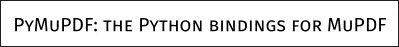
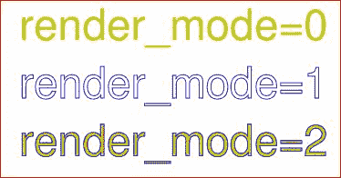

# 文本写入器

> 原文：[`pymupdf.readthedocs.io/en/latest/textwriter.html`](https://pymupdf.readthedocs.io/en/latest/textwriter.html)

**此类仅适用于 PDF。**

+   v1.16.18 中的新功能

此类表示 MuPDF 的*文本*对象。其基本思想是**将文本准备（1）和输出到 PDF 页面（2）分离**。

在**准备阶段**，文本写入器将任意数量的文本片段（“跨度”）及其位置和各自的字体信息存储起来。文本写入器准备的内容可以多次输出到任何具有兼容页面尺寸的 PDF 页面上。

文本写入器是`Page.insert_text()`等方法的一个优雅替代品：

+   **改进的文本定位：** 选择任何插入文本应该开始的点。存储文本后返回“光标位置”，即跨度的最后一个字符之后。

+   **自由字体选择：** 每个文本跨度都有自己的字体和`fontsize`。这使得在组成更大文本时可以轻松切换字体。

+   **自动回退字体：** 如果所选字体不支持某个字符，系统会自动搜索替代字体。这大大减少了输出中看到无法打印符号（看起来像小矩形的“TOFUs”）的风险。PyMuPDF 现在还提供**通用字体“Droid Sans Fallback Regular”**，支持**所有拉丁字母**（包括西里尔字母和希腊字母）以及**所有 CJK 字符**（中文、日文、韩文）。

+   **西里尔字母和希腊字母支持：** PDF 基本 14 字体集成了对西里尔字母和希腊字母的支持，**无需指定编码**。你的文本可以混合使用拉丁字母、希腊字母和西里尔字母。

+   **透明度支持：** 支持*opacity*参数。这提供了一种便捷的方式来创建水印式文本。

+   **文本对齐：** 支持任何字体 - 不仅仅是像`Page.insert_textbox()`中的简单字体。

+   **可重用性：** TextWriter 对象存在独立于 PDF 页面之外。它可以多次写入，无论是同一页面还是其他页面，同一 PDF 或不同 PDF，还可以选择不同的颜色或透明度。

使用此对象包括三个步骤：

1.  **创建时**，TextWriter 需要一个固定的**页面矩形**，以此为基础计算文本位置。文本写入器只能写入这种大小的页面。

1.  使用`TextWriter.append()`、`TextWriter.appendv()`和`TextWriter.fill_textbox()`方法将文本存储在 TextWriter 中，可以根据需要频繁调用。

1.  在一些 PDF 页面上输出 TextWriter 对象。

注意

+   从版本 1.17.0 开始，通过`TextWriter.write_text()`的*morph*参数，TextWriter 现在**支持**文本旋转。

+   还存在`Page.write_text()`，它将一个或多个 TextWriter 组合在一起，并将它们联合写入到给定的矩形和给定的旋转角度中，就像`Page.show_pdf_page()`一样。

| **方法 / 属性** | **简短描述** |
| --- | --- |
| `append()` | 水平写入模式添加文本 |
| `appendv()` | 垂直写入模式添加文本 |
| `fill_textbox()` | 填充矩形（水平写入模式） |
| `write_text()` | 将 TextWriter 输出到 PDF 页面 |
| `color` | 文本颜色（可更改） |
| `last_point` | 最后一个写入的字符在此结束 |
| `opacity` | 文本不透明度（可更改） |
| `rect` | 此 TextWriter 使用的页面矩形 |
| `text_rect` | 到目前为止所占据的区域 |

**类 API**

```py
class TextWriter
```

```py
__init__(self, rect, opacity=1, color=None)
```

参数：

+   **rect** (*rect-like*) – 用于文本定位计算的矩形。

+   **opacity** (*float*) – 设置文本存储的透明度。超出区间`0, 1)`的值将被忽略。例如 0.5 的值表示 50%的透明度。

+   **color** (*float**,**sequ*) – 文本的颜色。所有颜色都以浮点数表示，*0 <= color <= 1*。一个浮点数表示一些灰度级别，一个序列意味着颜色空间通过其长度。

```py
append(pos, text, font=None, fontsize=11, language=None, right_to_left=False, small_caps=0)
```

+   *v1.18.9 中更改*

+   *v1.18.15 中更改*

添加一些新的水平书写文本。

参数：

+   **pos** (*point_like*) – 文本的起始位置，第一个字符的左下角点。

+   **text** (*str*) – 任意长度的字符串。将从“pos”位置开始写入。

+   **font** – 一个[字体。如果省略，则将使用`pymupdf.Font("helv")`。

+   **fontsize** (*float*) – 字体大小，一个正数，默认为 11。

+   **language** (*str*) – 要使用的语言，例如英语的“en”。有意义的值应符合 ISO 639 标准 1、2、3 或 5。保留供将来使用：目前据我们所知没有任何影响。

+   **right_to_left** (*bool*) – *(v1.18.9 中新增)* 是否应该从右向左写入文本。适用于阿拉伯语或希伯来语等语言。默认为*False*。如果为*True*，则文本中的任何拉丁部分将自动转换。没有其他后果，即`TextWriter.last_point`仍将是最右边的字符，也不会进行任何对齐。因此，您可能希望改用`TextWriter.fill_textbox()`。

+   **small_caps** (*bool*) –

    *(v1.18.15 新增)* 寻找字体中字符的小型大写版本。如果存在，则取该值。否则将采用原始字符（当前字体或备用字体）。备用字体不会返回小型大写字母。例如，以下代码片段：

    ```py
    >>> doc = pymupdf.open()
    >>> page = doc.new_page()
    >>> text = "PyMuPDF: the Python bindings for MuPDF"
    >>> font = pymupdf.Font("figo")  # choose a font with small caps
    >>> tw = pymupdf.TextWriter(page.rect)
    >>> tw.append((50,100), text, font=font, small_caps=True)
    >>> tw.write_text(page)
    >>> doc.ez_save("x.pdf") 
    ```

    将生成此 PDF 文本：

    

返回：

`text_rect` 和 `last_point`。*(v1.18.0 更改：)* 对不支持的字体引发异常 – 通过`Font.is_writable`检查。

```py
appendv(pos, text, font=None, fontsize=11, language=None, small_caps=0)
```

*v1.18.15 更改*

在垂直方向上添加一些新文本，从顶部到底部的书写方式。

参数：

+   **位置** (*point_like*) – 文本的起始位置，即第一个字符的左下角点。

+   **文本** (*str*) – 字符串。将从“pos”位置开始写入。

+   **字体** – 字体。如果省略，则使用 `pymupdf.Font("helv")`。

+   **字体大小** (*float*) – 字体大小，正浮点数，默认为 11。

+   **语言** (*str*) – 要使用的语言，例如英语的“en”。有意义的值应符合 ISO 639 标准的 1、2、3 或 5。保留供将来使用：目前据我们所知没有任何影响。

+   **small_caps** (*bool*) – *(v1.18.15 新增)* 参见 `append()`。

返回：

`text_rect` 和 `last_point`。*(v1.18.0 更改：)* 对不支持的字体引发异常 – 通过`Font.is_writable`检查。

```py
fill_textbox(rect, text, *, pos=None, font=None, fontsize=11, align=0, right_to_left=False, warn=None, small_caps=0)
```

+   1.17.3 版本更改：新增参数 `pos`，指定在矩形内开始书写的位置。

+   v1.18.9 更改：返回不适合矩形的行的列表。支持从右到左书写（例如阿拉伯文、希伯来文）。

+   v1.18.15 更改：如支持字体，则优先使用小型大写字母。

用水平书写方式在给定的矩形中填充文本。这是一个方便的替代方法，可以用来替代`append()`。

参数：

+   **矩形** (*rect_like*) – 要填充的区域。文本的任何部分不会出现在此区域之外。

+   **文本** (*str**,**sequ*) – 文本。可以指定为（UTF-8）字符串或字符串列表/元组。字符串将首先使用 *splitlines()* 转换为列表。每个列表项将从新行开始（强制换行）。

+   **位置** (*point_like*) – *(v1.17.3 新增)* 开始存储的位置。默认是接近矩形左上角的点。

+   **字体** – 字体，默认为 `pymupdf.Font("helv")`。

+   **字体大小** (*float*) – 字体大小。

+   **对齐方式** (*int*) – 文本对齐方式。使用 TEXT_ALIGN_LEFT、TEXT_ALIGN_CENTER、TEXT_ALIGN_RIGHT 或 TEXT_ALIGN_JUSTIFY 中的一个。

+   **right_to_left** (*bool*) – *(v1.18.9 新增)* 决定文本是否从右向左书写。适用于阿拉伯语或希伯来语等语言。默认为 *False*。如果为 *True*，则任何拉丁部分会自动翻转。仍需设置对齐方式（如果需要右对齐），不会自动发生 – 其他对齐选项仍然可用。

+   **warn** (*bool*) –

    当文本溢出时，不执行任何操作、警告或引发异常。溢出文本永远不会被写入。**v1.18.9 中已更改：**

    +   默认为 *None*。

    +   返回溢出行的列表。

+   **small_caps** (*bool*) – *(v1.18.15 新增)* 参见 `append()`。

返回类型：

列表

返回：

*v1.18.9 新增* – 未适合矩形的行的列表。每个项目都是包含字符串及其在页面上长度的元组 `(text, length)`。

注意

可根据需要多次使用这些方法 – 没有技术上的限制（除了系统的内存限制）。还可以混合 `append()` 和文本框，并且可以拥有多个文本框。文本定位完全由插入点控制。因此，无需遵循任何顺序。*(v1.18.0 中已更改：)* 不支持的字体引发异常 – 通过 `Font.is_writable` 进行检查。

```py
write_text(page, opacity=None, color=None, morph=None, overlay=True, oc=0, render_mode=0)
```

将 TextWriter 文本写入页面，这是唯一必需的参数。其他参数可以用于临时覆盖创建 TextWriter 时使用的值。

参数：

+   **page** – 写入到此 Page。

+   **opacity** (*float*) – 覆盖此输出的 TextWriter 的值。

+   **color** (*sequ*) – 覆盖此输出的 TextWriter 的值。

+   **morph** (*sequ*) – 通过应用矩阵修改文本外观。如果提供，必须是一个包含像点一样的 *fixpoint* 和矩阵一样的 *matrix* 的序列。典型示例是围绕 *fixpoint* 旋转文本。

+   **overlay** (*bool*) – 放置在前景（默认）或背景。

+   **oc** (*int*) – *(v1.18.4 新增)* xref 的一个 `OCG` 或 `OCMD`。

+   **render_mode** (*int*) –

    PDF `Tr` 运算符的值。取值：0（默认）、1、2、3（不可见）。

    

```py
text_rect
```

当前占用的区域。

返回类型：

Rect

```py
last_point
```

“光标位置” – Point – 最后一个字符的底部右下角。

返回类型：

Point

```py
opacity
```

文本不透明度（可修改）。

返回类型：

float

```py
color
```

文本颜色（可修改）。

返回类型：

float, tuple

```py
rect
```

创建此 TextWriter 的页面矩形。必须不被修改。

返回类型：

Rect

注意

若要查看处理 TextWriter 的一些演示脚本，请访问 [此](https://github.com/pymupdf/PyMuPDF-Utilities/tree/master/textwriter) 仓库。

1.  不透明度和颜色适用于此对象中的**所有文本**。

1.  如果需要不同的颜色/透明度，必须创建单独的 TextWriter。每当确定颜色应该更改时，只需将文本附加到相应的 TextWriter，使用先前返回的`last_point`作为新文本范围的位置。

1.  附加项或文本框可以以任意顺序出现：只有位置参数控制文本显示的位置。

1.  字体和`fontsize`可以在同一个 TextWriter 内自由变化。这可以用来让具有不同属性的文本显示在同一行上：只需相应地指定*pos*，例如设置为上一个添加项的`last_point`。

1.  您可以使用`TextWriter.fill_textbox()`的*pos*参数设置第一个文本字符的位置。这允许使用不同 TextWriter 对象的内容填充相同的文本框，从而实现多种颜色、不透明度等效果。

1.  MuPDF 不支持所有具有此功能的字体，例如没有 Type3 字体。从 v1.18.0 开始，可以通过字体属性`Font.is_writable`检查此功能。在使用 TextWriter 方法时也会检查此属性。

对本页面有任何反馈吗？

* * *

此软件按原样提供，不附带任何明示或暗示的保证。此软件根据许可证分发，未经许可明确授权，不得复制、修改或分发。请参阅[artifex.com](https://www.artifex.com?utm_source=rtd-pymupdf&utm_medium=rtd&utm_content=footer-link)的许可信息或联系美国旧金山 CA 94129 Mesa Street 39 号 108A 套房的 Artifex Software Inc.以获取更多信息。

此文档涵盖所有版本直至 1.24.4。


