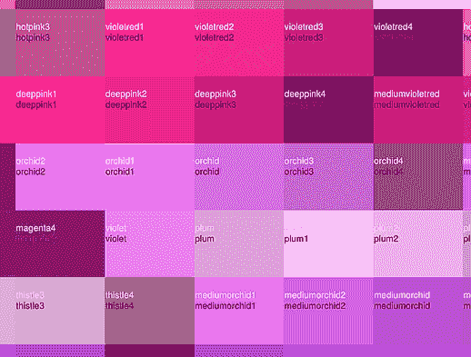

# 色彩数据库

> 原文：[`pymupdf.readthedocs.io/en/latest/colors.html`](https://pymupdf.readthedocs.io/en/latest/colors.html)

自引入涉及颜色的方法（如`Page.draw_circle()`）以来，可能需要访问预定义的颜色。

精美的 GUI 包[wxPython](https://wxpython.org/)具有超过 540 种预定义的 RGB 颜色数据库，这些颜色具有更多或更少可以记住的名称。其中不仅包括标准名称如“green”或“blue”，还有“turquoise”、“skyblue”以及 100（不仅仅是 50…）种“gray”等。

我们已经自由地复制了这个数据库（一个元组列表）修改为 PyMuPDF，并将其颜色作为 PDF 兼容的浮点三元组提供：对于 wxPython 的*(“WHITE”, 255, 255, 255)*，我们返回*(1, 1, 1)*，可以直接用于*color*和*fill*参数。我们还接受任何混合大小写的“wHiTe”以找到颜色。

## 函数*getColor()*

由于可能不经常需要颜色数据库，因此一个额外的导入语句似乎是可以接受的，以便访问它：

```py
>>> # "getColor" is the only method you really need
>>> from pymupdf.utils import getColor
>>> getColor("aliceblue")
(0.9411764705882353, 0.9725490196078431, 1.0)
>>> #
>>> # to get a list of all existing names
>>> from pymupdf.utils import getColorList
>>> cl = getColorList()
>>> cl
['ALICEBLUE', 'ANTIQUEWHITE', 'ANTIQUEWHITE1', 'ANTIQUEWHITE2', 'ANTIQUEWHITE3',
'ANTIQUEWHITE4', 'AQUAMARINE', 'AQUAMARINE1'] ...
>>> #
>>> # to see the full integer color coding
>>> from pymupdf.utils import getColorInfoList
>>> il = getColorInfoList()
>>> il
[('ALICEBLUE', 240, 248, 255), ('ANTIQUEWHITE', 250, 235, 215),
('ANTIQUEWHITE1', 255, 239, 219), ('ANTIQUEWHITE2', 238, 223, 204),
('ANTIQUEWHITE3', 205, 192, 176), ('ANTIQUEWHITE4', 139, 131, 120),
('AQUAMARINE', 127, 255, 212), ('AQUAMARINE1', 127, 255, 212)] ... 
```

## 打印颜色数据库

如果您真的想看看有多少可用的颜色，可以使用示例目录中的脚本[print by RGB](https://github.com/pymupdf/PyMuPDF-Utilities/blob/master/examples/print-rgb/print.py)或[print by HSV](https://github.com/pymupdf/PyMuPDF-Utilities/blob/master/examples/print-hsv/print.py)。它们在相同的目录中创建 PDF 文件（已经存在），其中包含所有这些颜色。它们唯一的区别是排序顺序：一个按 RGB 值排序，另一个按色相-饱和度值作为排序标准。这是这些文件的屏幕打印样式。

您对本页有什么反馈吗？

* * *

此软件按原样提供，不带任何明示或暗示的担保。此软件在许可下分发，除非根据该许可明确授权，否则不得复制、修改或分发。请参阅[artifex.com](https://www.artifex.com?utm_source=rtd-pymupdf&utm_medium=rtd&utm_content=footer-link)的许可信息，或联系美国加利福尼亚州旧金山 Mesa Street 39 号 108A 套房的 Artifex Software Inc.获取更多信息。

本文档覆盖所有版本直到 1.24.4。


## 函数*getColor()*

由于可能不经常需要颜色数据库，因此一个额外的导入语句似乎是可以接受的，以便访问它：

```py
>>> # "getColor" is the only method you really need
>>> from pymupdf.utils import getColor
>>> getColor("aliceblue")
(0.9411764705882353, 0.9725490196078431, 1.0)
>>> #
>>> # to get a list of all existing names
>>> from pymupdf.utils import getColorList
>>> cl = getColorList()
>>> cl
['ALICEBLUE', 'ANTIQUEWHITE', 'ANTIQUEWHITE1', 'ANTIQUEWHITE2', 'ANTIQUEWHITE3',
'ANTIQUEWHITE4', 'AQUAMARINE', 'AQUAMARINE1'] ...
>>> #
>>> # to see the full integer color coding
>>> from pymupdf.utils import getColorInfoList
>>> il = getColorInfoList()
>>> il
[('ALICEBLUE', 240, 248, 255), ('ANTIQUEWHITE', 250, 235, 215),
('ANTIQUEWHITE1', 255, 239, 219), ('ANTIQUEWHITE2', 238, 223, 204),
('ANTIQUEWHITE3', 205, 192, 176), ('ANTIQUEWHITE4', 139, 131, 120),
('AQUAMARINE', 127, 255, 212), ('AQUAMARINE1', 127, 255, 212)] ... 
```

## 打印颜色数据库

如果您想实际看看许多可用颜色的外观，可以使用脚本 [print by RGB](https://github.com/pymupdf/PyMuPDF-Utilities/blob/master/examples/print-rgb/print.py) 或者 [print by HSV](https://github.com/pymupdf/PyMuPDF-Utilities/blob/master/examples/print-hsv/print.py) 在示例目录中。它们会创建 PDF 文件（已存在于同一目录中），展示所有这些颜色。它们唯一的区别在于排序顺序：一个按照 RGB 值排序，另一个按照色调-饱和度-亮度值排序。这是这些文件外观的屏幕截图。

您对本页面有任何反馈吗？

* * *

此软件按原样提供，没有明示或暗示的任何保证。此软件根据许可证分发，未经授权的情况下不得复制、修改或分发此软件。有关详细信息，请参阅 [artifex.com](https://www.artifex.com?utm_source=rtd-pymupdf&utm_medium=rtd&utm_content=footer-link) 的许可信息或联系美国加利福尼亚州旧金山 Mesa Street 39 号 108A 套房的 Artifex Software Inc。

此文档涵盖了截至 1.24.4 版本的所有内容。


