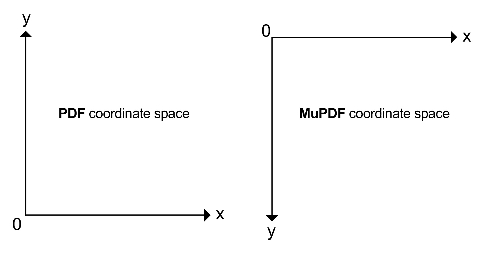

# 附录 3：各种技术信息

> 原文：[`pymupdf.readthedocs.io/en/latest/app3.html`](https://pymupdf.readthedocs.io/en/latest/app3.html)

本节涉及各种技术主题，它们并非必然相关。

* * *

## 图像变换矩阵

从版本 1.18.11 开始，一些文本和图像提取方法返回图像变换矩阵：`Page.get_text()` 和 `Page.get_image_bbox()`。

变换矩阵包含关于图像如何转换以适应某文档页面上的矩形（其“边界框”=“bbox”）的信息。通过检查页面上图像的 bbox 和此矩阵，可以确定例如图像是否以缩放或旋转的方式显示在页面上。

图像尺寸与页面上其 bbox 之间的关系如下：

1.  使用原始图像的宽度和高度，

    +   定义图像矩形 `imgrect = pymupdf.Rect(0, 0, width, height)`

    +   定义“缩小矩阵” `shrink = pymupdf.Matrix(1/width, 0, 0, 1/height, 0, 0)`。

1.  使用其缩小矩阵转换图像矩形将导致单位矩形：`imgrect * shrink = pymupdf.Rect(0, 0, 1, 1)`。

1.  使用图像**变换矩阵**“transform”，以下步骤将计算出 bbox：

    ```py
    imgrect = pymupdf.Rect(0, 0, width, height)
    shrink = pymupdf.Matrix(1/width, 0, 0, 1/height, 0, 0)
    bbox = imgrect * shrink * transform 
    ```

1.  检查矩阵乘积 `shrink * transform` 将显示有关使图像矩形适应页面 bbox 所发生的一切信息：旋转、边缘缩放和原点平移。让我们看一个例子：

    ```py
    >>> imginfo = page.get_images()[0]  # get an image item on a page
    >>> imginfo
    (5, 0, 439, 501, 8, 'DeviceRGB', '', 'fzImg0', 'DCTDecode')
    >>> #------------------------------------------------
    >>> # define image shrink matrix and rectangle
    >>> #------------------------------------------------
    >>> shrink = pymupdf.Matrix(1 / 439, 0, 0, 1 / 501, 0, 0)
    >>> imgrect = pymupdf.Rect(0, 0, 439, 501)
    >>> #------------------------------------------------
    >>> # determine image bbox and transformation matrix:
    >>> #------------------------------------------------
    >>> bbox, transform = page.get_image_bbox("fzImg0", transform=True)
    >>> #------------------------------------------------
    >>> # confirm equality - permitting rounding errors
    >>> #------------------------------------------------
    >>> bbox
    Rect(100.0, 112.37525939941406, 300.0, 287.624755859375)
    >>> imgrect * shrink * transform
    Rect(100.0, 112.375244140625, 300.0, 287.6247253417969)
    >>> #------------------------------------------------
    >>> shrink * transform
    Matrix(0.0, -0.39920157194137573, 0.3992016017436981, 0.0, 100.0, 287.6247253417969)
    >>> #------------------------------------------------
    >>> # the above shows:
    >>> # image sides are scaled by same factor ~0.4,
    >>> # and the image is rotated by 90 degrees clockwise
    >>> # compare this with pymupdf.Matrix(-90) * 0.4
    >>> #------------------------------------------------ 
    ```

* * *  ## PDF 基础 14 字体

所有 PDF 阅读器**必须支持**以下 14 种内置字体名称。它们作为一个字典提供，将它们的全名及其小写缩写映射到完整的字体基本名称。在 PyMuPDF 中需要提供**字体名称**时，可以使用字典中的任何**键或值**：

```py
In [2]: pymupdf.Base14_fontdict
Out[2]:
{'courier': 'Courier',
'courier-oblique': 'Courier-Oblique',
'courier-bold': 'Courier-Bold',
'courier-boldoblique': 'Courier-BoldOblique',
'helvetica': 'Helvetica',
'helvetica-oblique': 'Helvetica-Oblique',
'helvetica-bold': 'Helvetica-Bold',
'helvetica-boldoblique': 'Helvetica-BoldOblique',
'times-roman': 'Times-Roman',
'times-italic': 'Times-Italic',
'times-bold': 'Times-Bold',
'times-bolditalic': 'Times-BoldItalic',
'symbol': 'Symbol',
'zapfdingbats': 'ZapfDingbats',
'helv': 'Helvetica',
'heit': 'Helvetica-Oblique',
'hebo': 'Helvetica-Bold',
'hebi': 'Helvetica-BoldOblique',
'cour': 'Courier',
'coit': 'Courier-Oblique',
'cobo': 'Courier-Bold',
'cobi': 'Courier-BoldOblique',
'tiro': 'Times-Roman',
'tibo': 'Times-Bold',
'tiit': 'Times-Italic',
'tibi': 'Times-BoldItalic',
'symb': 'Symbol',
'zadb': 'ZapfDingbats'} 
```

与其义务相反，并非所有 PDF 阅读器都正确和完全支持这些字体——这对于 Symbol 和 ZapfDingbats 尤为明显。此外，字形（视觉）图像将针对每个阅读器具体展现。

要查看这些字体如何使用，包括**CJK 内置**字体，请参阅 `Page.insert_font()` 中的表格。

* * *  ## Adobe PDF 参考

Adobe 发布的这本 PDF 参考手册经常在本文档中引用。可以从[这里](https://opensource.adobe.com/dc-acrobat-sdk-docs/standards/pdfstandards/pdf/PDF32000_2008.pdf)查看和下载。

注意

长时间以来，一个较旧的版本也可以在 [这里](http://www.adobe.com/content/dam/Adobe/en/devnet/acrobat/pdfs/pdf_reference_1-7.pdf) 找到。似乎在 2021 年 10 月从网站上移除了该链接。早期（1.19.*之前）的 PyMuPDF 文档版本曾引用过这个文档。我们已经努力替换了上述当前规范的引用。

* * *  ## 在 PyMuPDF 中使用 Python 序列作为参数

当 PyMuPDF 对象和方法需要 Python **列表** 数值时，其他 Python **序列类型** 也是允许的。如果 Python 类具有 `__getitem__()` 方法，则称其实现了 **序列协议**。

这基本上意味着，在这些情况下，你可以互换使用 Python *list* 或 *tuple*，甚至 *array.array*、*numpy.array* 和 *bytearray* 类型。  

例如，在以下任何一种方式中指定序列 `"s"`

+   `s = [1, 2]` – 一个列表

+   `s = (1, 2)` – 一个元组

+   `s = array.array("i", (1, 2))` – 一个 array.array

+   `s = numpy.array((1, 2))` – 一个 numpy 数组

+   `s = bytearray((1, 2))` – 一个 bytearray

这将使其在以下示例表达式中可用：

+   `pymupdf.Point(s)`

+   `pymupdf.Point(x, y) + s`

+   `doc.select(s)`

与所有几何对象 Rect、IRect、Matrix 和 Point 类似。

因为所有 PyMuPDF 几何类本身都是序列的特殊情况（Quad 除外——见下文），它们可以自由地在可以使用数字序列的地方使用，例如作为 *list()*、*tuple()*、*array.array()* 或 *numpy.array()* 的参数传递给函数。查看以下代码片段，看看这样做的效果。

```py
>>> import pymupdf, array, numpy as np
>>> m = pymupdf.Matrix(1, 2, 3, 4, 5, 6)
>>>
>>> list(m)
[1.0, 2.0, 3.0, 4.0, 5.0, 6.0]
>>>
>>> tuple(m)
(1.0, 2.0, 3.0, 4.0, 5.0, 6.0)
>>>
>>> array.array("f", m)
array('f', [1.0, 2.0, 3.0, 4.0, 5.0, 6.0])
>>>
>>> np.array(m)
array([1., 2., 3., 4., 5., 6.]) 
```

注意

Quad 是一个 Python 序列对象，长度为 4。然而，它的项是`point_like`类型的——而不是数字。因此，上述说明不适用。

* * *  ## 确保 PyMuPDF 中重要对象的一致性

PyMuPDF 是 C 库 MuPDF 的 Python 绑定。尽管 MuPDF 的创建者已经投入了大量精力来近似一种面向对象的行为，但他们显然无法克服 C 语言在这方面的基本缺陷。

另一方面，Python 以非常清晰的方式实现了面向对象模型。PyMuPDF 与 MuPDF 之间的接口代码由两个基本文件组成：*pymupdf.py* 和 *fitz_wrap.c*。它们由优秀的 SWIG 工具为每个新版本创建。

当你使用 PyMuPDF 的对象或方法之一时，将导致执行一些代码在 *pymupdf.py* 中，进而调用一些用 *fitz_wrap.c* 编译的 C 代码。

因为**SWIG**会尽力保持 Python 和 C 级别同步，如果严格遵循一定的规则，一切都会正常工作。例如：**永远不要访问**在关闭（或删除或设置为 *None*）拥有的文档之后的页面对象。或者，不那么明显的是：在执行文档方法 *select()*、*delete_page()*、*insert_page()* … 等之后，永远不要访问页面或其任何子元素（链接或注释）。

但仅仅不再访问失效的对象是不够的：它们应该被完全主动删除，以释放 C 级别资源（即分配的内存）。

这些规则的原因在于文档与其页面之间以及页面与其链接/注释之间存在层次化的二级一对多关系。为了保持一致的状态，任何上述操作都必须导致完全重置 - 在**Python**和同步在 C 中。

**SWIG**无法知道这一点，因此也不执行它。

因此，所需的逻辑已经内置到 PyMuPDF 本身中，如下所示。

1.  如果页面“失去”其所属的文档或者正在被删除本身，那么其当前存在的所有注释和链接在 Python 中将变得不可用，并且它们的 C 级别对应物将被删除和释放。

1.  如果文档被关闭（或删除或设置为 *None*），或者其结构发生变化，那么所有当前存在的页面及其子页面将变得不可用，并且相应的 C 级别删除将发生。“结构变化”包括方法如 *select()*、*delete_page()*、*insert_page()*、*insert_pdf()* 等：所有这些操作都将导致对象删除的级联效应。

程序员通常不会意识到这些情况。但是，如果试图访问失效的对象，则会引发异常。

无效的对象不能像 Python 语句 *del page* 或 *page = None* 等直接删除。而是必须调用它们的 *__del__* 方法。

所有页面、链接和注释都有属性 *parent*，指向拥有的对象。这是可以在应用程序级别检查的属性：如果 *obj.parent == None*，则对象的父对象已经不存在，对其属性或方法的任何引用都将引发异常，指示其处于“孤立”状态。

一个示例会话：

```py
>>> page = doc[n]
>>> annot = page.first_annot
>>> annot.type                    # everything works fine
[5, 'Circle']
>>> page = None                   # this turns 'annot' into an orphan
>>> annot.type
<... omitted lines ...>
RuntimeError: orphaned object: parent is None
>>>
>>> # same happens, if you do this:
>>> annot = doc[n].first_annot     # deletes the page again immediately!
>>> annot.type                    # so, 'annot' is 'born' orphaned
<... omitted lines ...>
RuntimeError: orphaned object: parent is None 
```

这展示了级联效应：

```py
>>> doc = pymupdf.open("some.pdf")
>>> page = doc[n]
>>> annot = page.first_annot
>>> page.rect
pymupdf.Rect(0.0, 0.0, 595.0, 842.0)
>>> annot.type
[5, 'Circle']
>>> del doc                       # or doc = None or doc.close()
>>> page.rect
<... omitted lines ...>
RuntimeError: orphaned object: parent is None
>>> annot.type
<... omitted lines ...>
RuntimeError: orphaned object: parent is None 
```

注意

不包括在上述关系之外的对象。例如，如果通过 *toc = doc.get_toc()* 创建目录，然后关闭或更改文档，则变量 *toc* 不能也不会以任何方式改变。您有责任根据需要刷新这些变量。

* * *  ## 方法设计 `Page.show_pdf_page()`

### 目的和能力

该方法在当前页面的指定矩形内显示另一 PDF 文档的（“源”）页面的图像。

+   **与** `Page.insert_image()` **相反**，此显示为基于矢量的，因此在缩放级别上保持准确。

+   **就像** `Page.insert_image()` **一样**，显示的尺寸根据给定的矩形进行调整。

目前支持以下显示变体：

+   布尔参数`"保持比例"`控制是否保持宽高比（默认）。

    +   矩形参数`"剪辑"`限制了源页面矩形的可见部分。默认为整个页面。

+   浮点数`"旋转"`以任意角度（度数）旋转显示。如果角度不是 90 的整数倍，则如果`"保持比例"`也为真，则可能只有 4 个角中的 2 个位置在目标边界上。

+   布尔参数`"覆盖"`控制是否将图像放置在当前页面内容的顶部（前景，默认）或不（背景）。

使用案例包括（但不限于）以下内容：

1.  使用相同的图像“邮戳”公司 logo 或水印一系列当前文档页面。

1.  组合任意输入页面到一个输出页面以支持“小册子”或双面打印（称为“4-up”，“n-up”）。

1.  将（大型）输入页面分割成多个任意片段。这也称为“海报化”，因为例如可以水平和垂直分割 A4 页面，将 4 个片段放大到单独的 A4 页面，从而得到原始页面的 A2 版本。

### 技术实现

这是使用 PDF **“表单 XObject”** 完成的，参见 Adobe PDF References 第 8.10 节第 217 页。在执行`Page.show_pdf_page()`时，将执行以下操作：

> 1.  源文档中源页面的`资源`和`内容`对象被复制到目标文档，共同创建一个新的**表单 XObject**，具有以下属性。该对象的 PDF `xref`编号由该方法返回。
> 1.  
>     > 1.  `/BBox` 等于源页面的`/Mediabox`。
>     > 1.  
>     > 1.  `/Matrix` 等于单位矩阵。
>     > 1.  
>     > 1.  `/资源` 等同于源页面的内容。这包括对层级嵌套的其他对象（包括字体、图像等）进行“深复制”。此处涉及的复杂性由 MuPDF 的嫁接技术函数[[1]](#f1)覆盖。
>     > 1.  
>     > 1.  这是一种流对象类型，其流是源页面`内容`对象的组合数据的精确副本。
>     > 1.  
>     > 此表单 XObject 仅在显示源页面时执行一次。后续显示相同的源页面将跳过此步骤，并且仅为该对象创建“指针”形式的表单 XObject（在下一步中完成）。
>     > 
> 1.  然后创建第二个**表单 XObject**，目标页面使用它来调用显示。这个对象具有以下属性：
> 1.  
>     > 1.  `/BBox` 等于源页面的 `/CropBox`（或 `"clip"`）。
>     > 1.  
>     > 1.  `/Matrix` 表示 `/BBox` 到目标矩形的映射。
>     > 1.  
>     > 1.  `/XObject` 通过固定名称 `fullpage` 引用前面的 Form XObject。
>     > 1.  
>     > 1.  这个对象的流包含一个固定的语句：`/fullpage Do`。
>     > 1.  
>     > 1.  如果方法的 `"oc"` 参数被指定，其值将被赋予此 Form XObject 作为 `/OC`。
>     > 1.  
> 1.  现在修改目标页面的 `resources` 和 `contents` 对象如下。
> 1.  
>     > 1.  在 `/Resources` 的 `/XObject` 字典中增加一个条目，名称为 `fzFrm`（选择 n 使得此条目在页面上是唯一的）。
>     > 1.  
>     > 1.  根据 `"overlay"`，在页面的 `/Contents` 数组之前或之后添加一个新对象，包含语句 `q /fzFrm<n> Do Q`。

这种设计方法确保：

1.  （潜在的大型）源页面只复制一次到目标 PDF。每个目标页面只创建小的 “指针” Form XObjects 对象来显示源页面。

1.  每个引用的目标页面可以有自己的 `"oc"` 参数，用于单独控制源页面的可见性。  ## 重定向错误和警告消息

自 MuPDF 版本 1.16 起，错误和警告消息可以通过官方插件重定向。

PyMuPDF 会将错误消息放置在 `sys.stderr` 中，并以字符串 “mupdf:” 作为前缀。警告则会被内部存储，并可以通过 *pymupdf.TOOLS.mupdf_warnings()* 访问。还有一个函数可以清空这个存储。  ## 坐标

这是文档中最常用的术语之一。**坐标**通常指一对数字 `(x, y)`，用于表示某个位置，比如矩形的角落（Rect），一个 Point 等等。这两个值通常是浮点数，但有些对象，比如图像，只允许它们为整数。

要实际 *找到* 坐标的位置，我们还需要知道 `x` 和 `y` 的 *参考* 点 - 换句话说，我们必须知道 `(0, 0)` 的位置在哪里。一旦知道了 `(0, 0)`（“原点”），我们称之为 “坐标系统”。

文档处理中存在多个坐标系统。例如，PDF 页面和由其创建的图像的坐标系统是**不同**的。因此，我们需要方法来*转换*一个坐标系统到另一个（偶尔也需要反向转换）。这就是 Matrix 的任务。它是一个数学函数，类似于可以“乘”以点或矩形的因子，从而给出另一个坐标系统中相应的点/矩形。变换矩阵的逆矩阵可用于恢复变换。就像乘以某个因子，比如 3，可以通过将结果除以 3（或乘以 1/3）来恢复。

### 坐标和图像

图像具有整数坐标的坐标系。原点 `(0, 0)` 是左上角。`x` 值必须在 `range(width)` 范围内，`y` 值必须在 `range(height)` 范围内。因此，如果我们向下移动，`y` 值会*增加*。每个图像只有有限数量的坐标，即 `width * height`。图像中的位置也称为“像素”。

+   图像的**打印尺寸**（以厘米或英寸为单位）取决于附加信息：分辨率。分辨率以 **DPI**（每英寸点数或每英寸像素数）来衡量。因此，要找出某个图像的打印尺寸，我们必须将其宽度和高度分别除以相应的 DPI 值（宽度和高度可能有单独的 DPI 值），得到相应的英寸数。

### 原点、点大小和 Y 轴

在 **PDF** 中，页面的原点 `(0, 0)` 位于其 **左下角**。而在 **MuPDF** 中，页面的原点 `(0, 0)` 位于其 **左上角**。



坐标是浮点数，并以 **points** 为单位，其中：

+   **一点等于 1/72 英寸**。

典型的文档页面大小包括 **ISO A4** 和 **Letter**。**Letter** 页面的尺寸为 **8.5 x 11 英寸**，对应 **612 x 792 点**。在 **PDF** 坐标系统中，**Letter** 页面的左上角因此具有坐标 `(0, 792)`，因为**y 轴向上**。现在我们知道我们的文档大小，**MuPDF** 坐标系统的右下角坐标将是 `(612, 792)`（对于 **PDF**，此坐标将是 `(612, 0)`）。

+   理论上，**PDF** 页面上有**无限多**的坐标位置。然而，实际上，前 5 位小数足以保证合理的精度。

+   在 **MuPDF** 中，支持多种文档格式 - **PDF** 只是其中之一。图像也作为 **MuPDF** 中的文档进行支持（通常一页）。这也是为什么 **MuPDF** 使用坐标系，其原点 `(0, 0)` 是任何文档页面的 **左上角** 点。**y 轴向下**，与图像类似。在 **MuPDF** 中，坐标始终是浮点数，如 **PDF** 中一样。

+   例如，在 **MuPDF**（因此 **PyMuPDF**）中，矩形 `Rect(0, 0, 100, 100)` 是一个边长为 100 点的正方形（约为 1.39 英寸或 3.53 厘米）。其左上角是原点。为了在 **PDF** 和 **MuPDF** 之间切换坐标系，每个 Page 对象都有一个 `Page.transformation_matrix`。其逆矩阵可用于计算矩形的 PDF 坐标。通过这种方式，我们可以方便地确定在 **MuPDF** 中的 `Rect(0, 0, 100, 100)` 与 **PDF** 中的 `Rect(0, 692, 100, 792)` 是相同的。参见以下代码片段：

    ```py
    >>> page = doc.new_page(width=612, height=792)  # make new Letter page
    >>> ptm = page.transformation_matrix
    >>> # the inverse matrix of ptm is ~ptm
    >>> pymupdf.Rect(0, 0, 100, 100) * ~ptm
    Rect(0.0, 692.0, 100.0, 792.0) 
    ```

脚注

您对此页面有任何反馈意见吗？

* * *

本软件按原样提供，不附带任何明示或暗示的保证。本软件在许可下分发，并且未经授权不得复制、修改或分发。有关更多信息，请参阅许可信息 [artifex.com](https://www.artifex.com?utm_source=rtd-pymupdf&utm_medium=rtd&utm_content=footer-link) 或联系 Artifex Software Inc., 39 Mesa Street, Suite 108A, San Francisco CA 94129, United States。

本文档涵盖了所有版本直至 1.24.4。

 ## 图像变换矩阵

从版本 1.18.11 开始，某些文本和图像提取方法返回图像变换矩阵：`Page.get_text()` 和 `Page.get_image_bbox()`。

变换矩阵包含关于如何将图像变换以适应文档页面上的矩形（其“边界框” = “bbox”）的信息。通过检查页面上图像的 bbox 和此矩阵，可以确定例如图像是否以缩放或旋转的方式显示在页面上。

图像尺寸与其页面上的 bbox 之间的关系如下：

1.  使用原始图像的宽度和高度，

    +   定义图像矩形 `imgrect = pymupdf.Rect(0, 0, width, height)`

    +   定义“缩放矩阵” `shrink = pymupdf.Matrix(1/width, 0, 0, 1/height, 0, 0)`。

1.  使用其缩放矩阵转换图像矩形，将得到单位矩形： `imgrect * shrink = pymupdf.Rect(0, 0, 1, 1)`。

1.  使用图像的 **变换矩阵** “transform”，以下步骤将计算 bbox：

    ```py
    imgrect = pymupdf.Rect(0, 0, width, height)
    shrink = pymupdf.Matrix(1/width, 0, 0, 1/height, 0, 0)
    bbox = imgrect * shrink * transform 
    ```

1.  检查矩阵乘积 `shrink * transform` 将显示有关将图像矩形调整到页面上的 bbox 的所有信息：旋转、其边缘的缩放和原点的平移。让我们看一个例子：

    ```py
    >>> imginfo = page.get_images()[0]  # get an image item on a page
    >>> imginfo
    (5, 0, 439, 501, 8, 'DeviceRGB', '', 'fzImg0', 'DCTDecode')
    >>> #------------------------------------------------
    >>> # define image shrink matrix and rectangle
    >>> #------------------------------------------------
    >>> shrink = pymupdf.Matrix(1 / 439, 0, 0, 1 / 501, 0, 0)
    >>> imgrect = pymupdf.Rect(0, 0, 439, 501)
    >>> #------------------------------------------------
    >>> # determine image bbox and transformation matrix:
    >>> #------------------------------------------------
    >>> bbox, transform = page.get_image_bbox("fzImg0", transform=True)
    >>> #------------------------------------------------
    >>> # confirm equality - permitting rounding errors
    >>> #------------------------------------------------
    >>> bbox
    Rect(100.0, 112.37525939941406, 300.0, 287.624755859375)
    >>> imgrect * shrink * transform
    Rect(100.0, 112.375244140625, 300.0, 287.6247253417969)
    >>> #------------------------------------------------
    >>> shrink * transform
    Matrix(0.0, -0.39920157194137573, 0.3992016017436981, 0.0, 100.0, 287.6247253417969)
    >>> #------------------------------------------------
    >>> # the above shows:
    >>> # image sides are scaled by same factor ~0.4,
    >>> # and the image is rotated by 90 degrees clockwise
    >>> # compare this with pymupdf.Matrix(-90) * 0.4
    >>> #------------------------------------------------ 
    ```

* * *

## PDF 基本 14 字体

下列 14 个内置字体名称 **必须由每个 PDF 查看器** 应用程序支持。它们可用作字典，将它们的全名和其缩写（小写）映射到完整的字体基本名称。在 PyMuPDF 中需要提供 **字体名称** 时，可以使用字典中的任何 **键或值**：

```py
In [2]: pymupdf.Base14_fontdict
Out[2]:
{'courier': 'Courier',
'courier-oblique': 'Courier-Oblique',
'courier-bold': 'Courier-Bold',
'courier-boldoblique': 'Courier-BoldOblique',
'helvetica': 'Helvetica',
'helvetica-oblique': 'Helvetica-Oblique',
'helvetica-bold': 'Helvetica-Bold',
'helvetica-boldoblique': 'Helvetica-BoldOblique',
'times-roman': 'Times-Roman',
'times-italic': 'Times-Italic',
'times-bold': 'Times-Bold',
'times-bolditalic': 'Times-BoldItalic',
'symbol': 'Symbol',
'zapfdingbats': 'ZapfDingbats',
'helv': 'Helvetica',
'heit': 'Helvetica-Oblique',
'hebo': 'Helvetica-Bold',
'hebi': 'Helvetica-BoldOblique',
'cour': 'Courier',
'coit': 'Courier-Oblique',
'cobo': 'Courier-Bold',
'cobi': 'Courier-BoldOblique',
'tiro': 'Times-Roman',
'tibo': 'Times-Bold',
'tiit': 'Times-Italic',
'tibi': 'Times-BoldItalic',
'symb': 'Symbol',
'zadb': 'ZapfDingbats'} 
```

与他们的义务相反，不是所有的 PDF 查看器都正确和完全支持这些字体 – 这对于 Symbol 和 ZapfDingbats 尤其如此。此外，字形（视觉）图像将针对每个阅读器具体化。

要查看这些字体如何使用，包括 **内置 CJK** 字体，请查看 `Page.insert_font()` 中的表格。

* * *

## Adobe PDF 参考

Adobe 发布的此 PDF 参考手册经常在本文档中引用。可以从 [此处](https://opensource.adobe.com/dc-acrobat-sdk-docs/standards/pdfstandards/pdf/PDF32000_2008.pdf) 查看和下载。

注意

长期以来，旧版本还可以在 [此](http://www.adobe.com/content/dam/Adobe/en/devnet/acrobat/pdfs/pdf_reference_1-7.pdf) 链接下找到。看起来在 2021 年 10 月从网站上撤下了。早期（1.19.* 之前）版本的 PyMuPDF 文档曾参考过此文档。我们已经努力将对当前规范的引用替换为上面的规范。

* * *

## 在 PyMuPDF 中使用 Python 序列作为参数

当 PyMuPDF 对象和方法需要一个 Python **列表** 的数值时，其他 Python **序列类型** 也是允许的。如果 Python 类有一个 `__getitem__()` 方法，则称其实现了 **序列协议**。

这基本上意味着，你可以在这些情况下可以互换使用 Python *列表* 或 *元组*，甚至 *array.array*、*numpy.array* 和 *bytearray* 类型。

例如，在以下任何一种方式中指定序列 `"s"` 

+   `s = [1, 2]` – 一个列表

+   `s = (1, 2)` – 一个元组

+   `s = array.array("i", (1, 2))` – 一个 array.array

+   `s = numpy.array((1, 2))` – 一个 numpy 数组

+   `s = bytearray((1, 2))` – 一个 bytearray

将使其在以下示例表达式中可用：

+   `pymupdf.Point(s)`

+   `pymupdf.Point(x, y) + s`

+   `doc.select(s)`

同样地，所有几何对象 Rect、IRect、Matrix 和 Point 也是如此。

因为所有的 PyMuPDF 几何类本身都是序列的特殊情况，所以它们（除了 Quad – 见下文）可以自由地用在可以使用数值序列的地方，例如作为 *list()*、*tuple()*、*array.array()* 或 *numpy.array()* 的参数。查看以下代码片段以查看其工作原理。

```py
>>> import pymupdf, array, numpy as np
>>> m = pymupdf.Matrix(1, 2, 3, 4, 5, 6)
>>>
>>> list(m)
[1.0, 2.0, 3.0, 4.0, 5.0, 6.0]
>>>
>>> tuple(m)
(1.0, 2.0, 3.0, 4.0, 5.0, 6.0)
>>>
>>> array.array("f", m)
array('f', [1.0, 2.0, 3.0, 4.0, 5.0, 6.0])
>>>
>>> np.array(m)
array([1., 2., 3., 4., 5., 6.]) 
```

注意

四边形也是 Python 序列对象，长度为 4。然而，其项是`point_like`，而不是数字。因此，上述评论不适用。

* * *

## 确保 PyMuPDF 中重要对象的一致性

PyMuPDF 是 C 库 MuPDF 的 Python 绑定。尽管 MuPDF 的创建者已经付出了大量努力来模拟某种面向对象的行为，但他们确实无法克服 C 语言在这方面的基本缺陷。

另一方面，Python 非常清晰地实现了 OO 模型。PyMuPDF 与 MuPDF 之间的接口代码由两个基本文件组成：*pymupdf.py*和*fitz_wrap.c*。每个新版本都由优秀的 SWIG 工具创建。

当您使用 PyMuPDF 的对象或方法时，这将导致在*pymupdf.py*中执行一些代码，然后调用一些在*fitz_wrap.c*中编译的 C 代码。

因为 SWIG 在保持 Python 和 C 级别同步方面走了很长一段路，只要严格遵循一定的规则，一切都能正常工作。例如：**在关闭（或删除或设置为*None*）所属文档之后，永远不要访问**一个页面对象。或者，不那么明显的是：在执行文档方法*select()*、*delete_page()*、*insert_page()*等之后，永远不要访问页面或其任何子元素（链接或注释）。

但是仅仅停止访问无效对象是不够的：它们应该被完全删除，以释放 C 级资源（即分配的内存）。

这些规则的原因在于文档与其页面之间以及页面与其链接/注释之间存在层次化的二级一对多关系。为了保持一致的情况，上述任何操作都必须导致完全重置 - **在 Python 和 C 中同步进行**。

SWIG 无法知道这一点，因此也不会执行。

因此，所需的逻辑已经内置到 PyMuPDF 中，如下所示。

1.  如果页面“丢失”其所属文档或本身被删除，则 Python 中所有当前存在的注释和链接将变为不可用，并且它们的 C 级对应物将被删除和释放。

1.  如果文档已关闭（或删除或设置为*None*），或者其结构已更改，则当前存在的所有页面及其子页面将变为不可用，并且将进行相应的 C 级删除。 "结构更改"包括诸如*select()*、*delete_page()*、*insert_page()*、*insert_pdf()*等方法：所有这些方法都会导致级联的对象删除。

程序员通常不会意识到这一点。然而，如果他试图访问无效的对象，将会引发异常。

无效的对象不能像使用 Python 语句*del page*或*page = None*等那样直接删除。相反，必须调用它们的*__del__*方法。

所有页面、链接和注释都有属性*parent*，指向拥有的对象。这是可以在应用程序级别检查的属性：如果*obj.parent == None*，则对象的父项已丢失，并且对其属性或方法的任何引用都将引发异常，通知此“孤立”的状态。

一个示例会话：

```py
>>> page = doc[n]
>>> annot = page.first_annot
>>> annot.type                    # everything works fine
[5, 'Circle']
>>> page = None                   # this turns 'annot' into an orphan
>>> annot.type
<... omitted lines ...>
RuntimeError: orphaned object: parent is None
>>>
>>> # same happens, if you do this:
>>> annot = doc[n].first_annot     # deletes the page again immediately!
>>> annot.type                    # so, 'annot' is 'born' orphaned
<... omitted lines ...>
RuntimeError: orphaned object: parent is None 
```

这显示了级联效应：

```py
>>> doc = pymupdf.open("some.pdf")
>>> page = doc[n]
>>> annot = page.first_annot
>>> page.rect
pymupdf.Rect(0.0, 0.0, 595.0, 842.0)
>>> annot.type
[5, 'Circle']
>>> del doc                       # or doc = None or doc.close()
>>> page.rect
<... omitted lines ...>
RuntimeError: orphaned object: parent is None
>>> annot.type
<... omitted lines ...>
RuntimeError: orphaned object: parent is None 
```

注意

在上述关系之外的对象不包括在此机制中。例如，如果通过*toc = doc.get_toc()*创建了目录，然后关闭或更改文档，那么这不会也不能以任何方式更改变量*toc*。您有责任根据需要刷新此类变量。

* * *

## 方法设计`Page.show_pdf_page()`

### 目的和能力

该方法在当前（“包含”、“目标”）页面的指定矩形内显示另一个 PDF 文档的页面的图像。

+   **相比**`Page.insert_image()`，此显示是基于矢量的，因此在缩放级别上保持准确。

+   **就像**`Page.insert_image()`一样，显示的大小根据给定的矩形调整。

当前支持以下显示变体：

+   布尔参数`"keep_proportion"`控制是否保持纵横比（默认）。

    +   矩形参数`"clip"`限制了源页面矩形的可见部分。默认为整个页面。

+   浮点数`"rotation"`将显示旋转一个任意角度（度）。如果角度不是 90 的整数倍，则如果也`"keep_proportion"`为真，则可能只有 4 个角中的 2 个位于目标边界上。

+   布尔参数`"overlay"`控制是否将图像放在当前页面内容的顶部（前景，默认）或不放置在顶部（背景）。

用例包括（但不限于）以下内容：

1.  “盖章”一系列当前文档页面与相同的图像，如公司标志或水印。

1.  将任意输入页面组合成一个输出页面，以支持“手册”或双面打印（称为“4-up”、“n-up”）。

1.  将（大）输入页面分割成几个任意的片段。这也称为“海报化”，因为您可以将 A4 页面水平和垂直分割，并将 4 个片段放大到单独的 A4 页面上打印，最终得到您原始页面的 A2 版本。

### 技术实现

这是使用 PDF **“表单 XObject”**完成的，请参阅 Adobe PDF 参考手册第 217 页的 8.10 节。在执行`Page.show_pdf_page()`时，会发生以下事情：

> 1.  源文档中源页面的`resources`和`contents`对象与目标文档一起复制，共同创建一个新的**Form XObject**，具有以下属性。此对象的 PDF `xref`编号由该方法返回。
> 1.  
>     > 1.  `/BBox`等于源页面的`/Mediabox`
>     > 1.  
>     > 1.  `/Matrix`等于单位矩阵。
>     > 1.  
>     > 1.  `/资源` 等同于源页面。这涉及“深拷贝”层次嵌套的其他对象（包括字体、图像等）。这里涉及的复杂性由 MuPDF 的嫁接[[1]](#f1)技术函数来处理。
>     > 1.  
>     > 1.  这是一个流对象类型，其流是源页面`contents`对象的组合数据的精确副本。
>     > 1.  
>     > 这个 Form XObject 仅在显示的源页面中执行一次。后续显示相同的源页面将跳过此步骤，仅为此对象创建“指针”Form XObjects（在下一步中完成）。
>     > 
> 1.  然后创建第二个**Form XObject**，目标页面用于调用显示。此对象具有以下属性：
> 1.  
>     > 1.  `/BBox`等于源页面的`/CropBox`（或`"clip"`）。
>     > 1.  
>     > 1.  `/Matrix`表示将`/BBox`映射到目标矩形。
>     > 1.  
>     > 1.  `/XObject`通过固定名称`fullpage`引用前一个 Form XObject。
>     > 1.  
>     > 1.  此对象的流正好包含一个固定语句：`/fullpage Do`。
>     > 1.  
>     > 1.  如果方法的`"oc"`参数已给出，则将其值分配给此 Form XObject 作为`/OC`。
>     > 1.  
> 1.  现在修改了目标页面的`resources`和`contents`对象如下。
> 1.  
>     > 1.  在`/资源`的`/XObject`字典中添加一个条目，名称为`fzFrm`（n 选取得使该条目在页面上唯一）。
>     > 1.  
>     > 1.  根据`"overlay"`，在页面的`/Contents`数组之前或之后添加一个新对象，其中包含语句`q /fzFrm<n> Do Q`。

此设计方法确保：

1.  只将（可能很大的）源页面复制一次到目标 PDF 中。每个目标页面仅创建小的“指针”Form XObjects 对象来显示源页面。

1.  每个引用的目标页面可以有自己的`"oc"`参数来单独控制源页面的可见性。

### 目的和能力

该方法在当前页面的指定矩形内显示另一个 PDF 文档的（“源”）页面图像。

+   **与** `Page.insert_image()` **相比**，此显示是基于矢量的，因此在缩放级别上保持准确。

+   **与** `Page.insert_image()` **类似**，显示的大小调整为给定的矩形。

当前支持以下显示变体：

+   布尔参数`"keep_proportion"`控制是否保持纵横比（默认）。

    +   矩形参数`"clip"`限制源页面矩形的可见部分。默认为整个页面。

+   浮点数`"rotation"`按任意角度（度）旋转显示。如果角度不是 90 的整数倍，则如果也设置了`"keep_proportion"`为真，则只有目标边框上的 2 个角可能会定位。

+   布尔参数`"overlay"`控制是否将图像放在当前页面内容的顶部（前景，默认）或不放置在其上（背景）。

使用情况包括（但不限于）以下内容：

1.  “标记”当前文档的一系列页面与相同的图像，比如公司标志或水印。

1.  将任意输入页面合并为一个输出页面，支持“小册子”或双面打印（称为“4-up”，“n-up”）。

1.  将（大型）输入页面分割成多个任意的片段。这也称为“分幅”，例如可以水平和垂直地分割 A4 页面，将 4 个片段放大到单独的 A4 页面上打印，最终得到原始页面的 A2 版本。

### 技术实施

这是使用 PDF **“Form XObjects”**完成的，请参阅 Adobe PDF References 第 8.10 节第 217 页。在执行`Page.show_pdf_page()`时，会发生以下事情：

> 1.  源文档中源页面的`resources`和`contents`对象被复制到目标文档，共同创建一个新的**Form XObject**，具有以下属性。此对象的 PDF `xref`编号由该方法返回。
> 1.  
>     > 1.  `/BBox`等于源页面的`/Mediabox`。
>     > 1.  
>     > 1.  `/Matrix`等于单位矩阵。
>     > 1.  
>     > 1.  `/Resources`等于源页面的资源。这涉及到层次嵌套的其他对象（包括字体、图像等）的“深复制”。这里涉及的复杂性由 MuPDF 的嫁接技术函数[[1]](#f1)覆盖。
>     > 1.  
>     > 1.  这是一个流对象类型，其流是源页面`contents`对象的组合数据的精确副本。
>     > 1.  
>     > 这个 Form XObject 仅在每次显示源页面时执行一次。后续显示相同的源页面将跳过此步骤，并仅创建指向此对象的“指针”Form XObjects（在下一步完成）。
>     > 
> 1.  然后创建第二个**Form XObject**，目标页面使用它来调用显示。此对象具有以下属性：
> 1.  
>     > 1.  `/BBox`等于源页面的`/CropBox`（或`"clip"`）。
>     > 1.  
>     > 1.  `/Matrix`表示`/BBox`到目标矩形的映射。
>     > 1.  
>     > 1.  `/XObject`通过固定名称`fullpage`引用前面的 Form XObject。
>     > 1.  
>     > 1.  此对象的流包含一个固定语句：`/fullpage Do`。
>     > 1.  
>     > 1.  如果方法的`"oc"`参数给定，其值将分配给此 Form XObject 作为`/OC`。
>     > 1.  
> 1.  目标页面的 `resources` 和 `contents` 对象现在修改如下。
> 1.  
>     > 1.  在 `/Resources` 的 `/XObject` 字典中添加一个条目，名称为 `fzFrm`（选择 n 使得此条目在页面上唯一）。
>     > 1.  
>     > 1.  根据 `"overlay"`，在页面的 `/Contents` 数组前面或后面添加一个新对象，包含语句 `q /fzFrm<n> Do Q`。

这种设计方法确保了：

1.  （可能很大的）源页面仅被复制一次到目标 PDF 中。每个目标页面只创建小的“指针”Form XObjects 对象来显示源页面。

1.  每个引用的目标页面可以有自己的 `"oc"` 参数，单独控制源页面的可见性。

## 重定向错误和警告消息

自 MuPDF 版本 1.16 起，错误和警告消息可以通过官方插件进行重定向。

PyMuPDF 会将错误消息输出到 `sys.stderr`，前缀为字符串 “mupdf:”。警告会被内部存储，并可通过 *pymupdf.TOOLS.mupdf_warnings()* 访问。还存在一个函数可以清空此存储。

## 坐标

这是文档中最常用的术语之一。一个**坐标**通常指的是一对数字 `(x, y)`，表示某个位置，如矩形的角落（Rect）、Point 等。两个值通常是浮点数，但也有像图像这样的对象只允许它们是整数。

要实际*找到*坐标的位置，我们还需要知道 `x` 和 `y` 的*参考*点——换句话说，我们必须知道位置 `(0, 0)` 放置在哪里。一旦 `(0, 0)`（“原点”）确定，我们就谈论一个“坐标系统”。

在文档处理过程中存在几种坐标系统。例如，PDF 页面和从中创建的图像的坐标系统是**不同的**。因此，我们需要方法来*转换*坐标，从一个系统到另一个系统（并且有时也需要反向转换）。这是一个矩阵的任务。它是一个数学函数，类似于一个因子，可以与一个点或矩形“相乘”，以给我们在另一个坐标系统中的对应点/矩形。变换矩阵的逆可以用来恢复变换。就像乘以某个因子，比如 3，可以通过将结果除以 3（或与 1/3 相乘）来恢复一样。

### 坐标和图像

图像具有整数坐标的坐标系统。原点 `(0, 0)` 是左上角点。`x` 值必须在 `range(width)` 范围内，`y` 值在 `range(height)` 范围内。因此，`y` 值*增加*，如果我们向*下*移动。每个图像只有一个**有限数量**的坐标，即 `width * height`。图像中的一个位置也称为“像素”。

+   当图像被打印时，其大小（以厘米或英寸为单位）取决于附加信息：**分辨率**。这以**DPI**（每英寸点数，或每英寸像素数）来衡量。因此，为了找出某个图像的打印尺寸，我们必须将其宽度和高度分别除以相应的 DPI 值（宽度和高度可能有单独的值），从而得到相应的英寸数。

### 原点，点大小和 Y 轴

在**PDF**中，页面的原点`(0, 0)`位于其**左下角**。在**MuPDF**中，页面的原点`(0, 0)`位于其**左上角**。


坐标是浮点数，以**点（points）**为单位，其中：

+   **一个点等于 1/72 英寸**。

典型的文档页面大小为**ISO A4**和**Letter**。**Letter**页面的大小为**8.5 x 11 英寸**，对应**612 x 792 点**。在**PDF**坐标系统中，**Letter**页面的左上角点的坐标因此是`(0, 792)`，因为**Y 轴向上**指向。现在我们知道我们文档的大小，在**MuPDF**中，右下角的坐标将是`(612, 792)`（对于**PDF**，这个坐标将是`(612,0)`）。

+   从理论上讲，**PDF**页面上有**无限多个**坐标位置。然而，在实践中，至多前 5 位小数足以保证合理的精度。

+   在**MuPDF**中，支持多种文档格式 - **PDF**只是其中之一，总共有**十几种其他格式**。图像在**MuPDF**中也作为文档支持（因此通常只有一页）。这也是为什么**MuPDF**使用以坐标系，原点`(0, 0)`是任何文档页面的**左上角**点。**Y 轴向下**指向，如同图像一样。**MuPDF**中的坐标无论如何都是浮点数，就像在**PDF**中一样。

+   例如，在**MuPDF**中的矩形`Rect(0, 0, 100, 100)`（因此也适用于**PyMuPDF**），因此是一个边长为 100 点（= 1.39 英寸或 3.53 厘米）的正方形。它的左上角是原点。为了在**PDF**和**MuPDF**之间切换坐标系，每个 Page 对象都有一个`Page.transformation_matrix`。它的逆可以用来计算矩形的 PDF 坐标。通过这种方式，我们可以方便地发现在**MuPDF**中的`Rect(0, 0, 100, 100)`等同于**PDF**中的`Rect(0, 692, 100, 792)`。请参阅以下代码片段：

    ```py
    >>> page = doc.new_page(width=612, height=792)  # make new Letter page
    >>> ptm = page.transformation_matrix
    >>> # the inverse matrix of ptm is ~ptm
    >>> pymupdf.Rect(0, 0, 100, 100) * ~ptm
    Rect(0.0, 692.0, 100.0, 792.0) 
    ```

脚注

这页有没有任何反馈？

* * *

此软件按原样提供，不带任何明示或暗示的担保。此软件根据许可证分发，未经明确授权不得复制、修改或分发。有关详细信息，请参阅[artifex.com](https://www.artifex.com?utm_source=rtd-pymupdf&utm_medium=rtd&utm_content=footer-link)的许可信息或联系 Artifex Software Inc.，美国加利福尼亚州旧金山 Mesa 街 39 号 108A 套房。

本文档覆盖了所有版本直至 1.24.4。


### 坐标与图像

图像具有整数坐标系。原点`(0, 0)`位于左上角。`x`值必须在`宽度范围`内，而`y`值在`高度范围`内。因此，如果我们向*下移动*，`y`值将*增加*。对于每个图像，坐标仅有**有限数量**，即`宽度 * 高度`。图像中的位置也称为“像素”。

+   例如，打印时图像的**大小**（以厘米或英寸为单位）取决于附加信息：“分辨率”。这以**DPI**（每英寸点数或像素数）来衡量。因此，要找到某个图像的打印大小，我们必须将其宽度和高度分别除以相应的 DPI 值（宽度和高度可能有单独的 DPI 值），并得到相应的英寸数。

### 原点、点大小和 Y 轴

在**PDF**中，页面的原点`(0, 0)`位于其**左下角**。在**MuPDF**中，页面的原点`(0, 0)`位于其**左上角**。


坐标是浮点数，以**点**为单位，其中：

+   **一个点等于 1/72 英寸**。

典型的文档页面尺寸包括**ISO A4**和**Letter**。**Letter**页面的尺寸为**8.5 x 11 英寸**，对应**612 x 792 点**。在**PDF**坐标系统中，**Letter**页面的左上角点的坐标为`(0, 792)`，因为**y 轴向上**。现在我们知道我们的文档大小，**MuPDF**中右下角的坐标将是`(612, 792)`（对于**PDF**，此坐标将为`(612,0)`）。

+   理论上，**PDF**页面上有**无限多**的坐标位置。然而，在实践中，前 5 位小数通常足以达到合理的精度。

+   在**MuPDF**中，支持多种文档格式 - **PDF**只是其中之一。图像也作为**MuPDF**中的文档被支持（通常每页一张）。这也是为什么**MuPDF**使用坐标系的原点`(0, 0)`在任何文档页面上都是**左上角**的一个原因。**y 轴向下**，就像图像一样。在**MuPDF**中，坐标始终是浮点数，就像**PDF**中一样。

+   例如，**MuPDF**（因此也是**PyMuPDF**）中的一个矩形 `Rect(0, 0, 100, 100)` 实际上是一个边长为 100 点（= 1.39 英寸或 3.53 厘米）的正方形。其左上角是原点。要在 **PDF** 到 **MuPDF** 之间切换坐标系，每个 Page 对象都有一个 `Page.transformation_matrix`。其逆矩阵可用于计算矩形的 PDF 坐标。通过这种方式，我们可以方便地发现在 **MuPDF** 中 `Rect(0, 0, 100, 100)` 与 **PDF** 中的 `Rect(0, 692, 100, 792)` 是相同的。参见以下代码片段：

    ```py
    >>> page = doc.new_page(width=612, height=792)  # make new Letter page
    >>> ptm = page.transformation_matrix
    >>> # the inverse matrix of ptm is ~ptm
    >>> pymupdf.Rect(0, 0, 100, 100) * ~ptm
    Rect(0.0, 692.0, 100.0, 792.0) 
    ```

脚注

你对本页面有任何反馈吗？

* * *

本软件按原样提供，不附带任何明示或暗示的担保。本软件以许可方式分发，未经许可，不得复制、修改或分发。请参考 [artifex.com](https://www.artifex.com?utm_source=rtd-pymupdf&utm_medium=rtd&utm_content=footer-link) 获取许可信息，或联系美国加利福尼亚州旧金山市 Mesa 街 39 号 108A 套房，Artifex Software Inc. 获取更多信息。

本文档涵盖了所有版本，直至 1.24.4。


