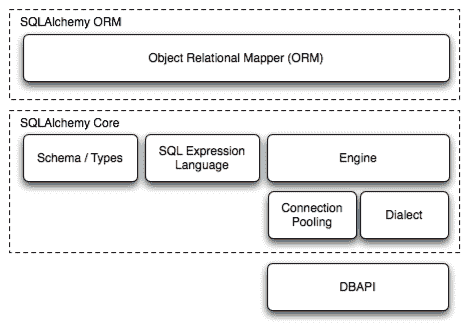

# 概述

> 原文：[`docs.sqlalchemy.org/en/20/intro.html`](https://docs.sqlalchemy.org/en/20/intro.html)

SQLAlchemy SQL 工具包和对象关系映射器是一套全面的用于处理数据库和 Python 的工具集。它有几个不同的功能区域，可以单独使用或组合在一起。其主要组件如下图所示，组件依赖关系组织成层次结构：



上面，SQLAlchemy 最重要的两个面向用户的部分是**对象关系映射器（ORM）**和**核心（Core）**。

核心部分包含了 SQLAlchemy 的 SQL 和数据库集成以及描述服务，其中最突出的部分是**SQL 表达式语言**。

SQL 表达式语言是一个独立于 ORM 包的工具包，它提供了一种构建 SQL 表达式的系统，这些表达式由可组合的对象表示，然后可以在特定事务范围内“执行”到目标数据库中，返回一个结果集。通过传递表示这些语句的 SQL 表达式对象以及表示要与每个语句一起使用的参数的字典，可以实现插入、更新和删除（即 DML）。

ORM 在 Core 的基础上构建了一种用于处理映射到数据库模式的域对象模型的手段。当使用 ORM 时，SQL 语句的构造方式与使用 Core 时基本相同，但 DML 任务（在这里指的是将业务对象持久化到数据库中）是使用一种称为工作单元的模式自动化的，该模式将可变对象的状态变化转换为 INSERT、UPDATE 和 DELETE 构造，并以这些对象的术语调用这些构造。SELECT 语句也通过 ORM 特定的自动化和对象中心的查询功能进行增强。

而使用 Core 和 SQL 表达式语言工作呈现了数据库的模式中心视图，以及以不可变性为导向的编程范式，ORM 在此基础上构建了一个更加明确面向对象的数据库领域视图，具有更多显式面向对象的编程范式，并依赖于可变性。由于关系型数据库本身是一个可变的服务，区别在于 Core/SQL 表达式语言是命令导向的，而 ORM 是状态导向的。

## 文档概览

文档分为四个部分：

+   SQLAlchemy 统一教程 - 这个全新的教程适用于 1.4/2.0 系列的 SQLAlchemy，全面介绍了整个库，从 Core 的描述开始，逐渐深入到 ORM 特定的概念。新用户以及从 SQLAlchemy 1.x 系列转来的用户应该从这里开始。

+   SQLAlchemy ORM - 在这一部分中，提供了 ORM 的参考文档。

+   SQLAlchemy 核心 - 这里提供了 Core 中的其他所有内容的参考文档。SQLAlchemy 引擎、连接和池服务也在这里描述。

+   方言 - 提供所有 方言 实现的参考文档，包括 DBAPI 具体内容。

## 代码示例

SQLAlchemy 分发包含可用于大多数 ORM 的工作代码示例。所有包含的示例应用程序的描述位于 ORM 示例。

在 wiki 上还有各种各样的示例，涉及到核心 SQLAlchemy 结构以及 ORM。请参阅 [Theatrum Chemicum](https://www.sqlalchemy.org/trac/wiki/UsageRecipes)。

## 安装指南

### 支持的平台

SQLAlchemy 支持以下平台：

+   cPython 3.7 及更高版本

+   兼容 Python-3 的 [PyPy](http://pypy.org/) 版本

从 2.0 版本开始更改：SQLAlchemy 现在的目标是 Python 3.7 及以上版本。

### 异步 IO 支持

SQLAlchemy 的 `asyncio` 支持依赖于 [greenlet](https://pypi.org/project/greenlet/) 项目。这个依赖关系将默认安装在常见的机器平台上，但不支持每个架构，并且在不常见的架构上也可能不会默认安装。请参阅 异步 IO 平台安装说明（包括 Apple M1） 部分，了解确保存在 asyncio 支持的额外详细信息。

### 支持的安装方法

SQLAlchemy 的安装是通过基于 [setuptools](https://pypi.org/project/setuptools/) 的标准 Python 方法进行的，可以直接引用 `setup.py` 或使用 [pip](https://pypi.org/project/pip/) 或其他兼容 setuptools 的方法。

### 通过 pip 安装

当 `pip` 可用时，可以从 PyPI 下载分发包，并在一步中进行安装：

```py
pip install SQLAlchemy
```

此命令将从 [Python Cheese Shop](https://pypi.org/project/SQLAlchemy) 下载最新的**发布**版本的 SQLAlchemy 并安装到您的系统上。对于大多数常见平台，将下载提供原生 Cython / C 扩展的 Python Wheel 文件。

要安装最新的**预发行**版本，例如`2.0.0b1`，pip 需要使用 `--pre` 标志：

```py
pip install --pre SQLAlchemy
```

在上述情况下，如果最新版本是预发行版本，则会安装该版本而不是最新发布的版本。

### 手动从源分发安装

当不使用 pip 安装时，可以使用 `setup.py` 脚本安装源分发：

```py
python setup.py install
```

源安装与平台无关，无论 Cython / C 构建工具是否安装，都将安装在任何平台上。 正如下一节 构建 Cython 扩展 所述，`setup.py` 将尝试在可能的情况下使用 Cython / C 进行构建，否则将回退到纯 Python 安装。

### 构建 Cython 扩展

SQLAlchemy 包含 [Cython](https://cython.org/) 扩展，为各个领域提供额外的速度提升，目前重点是 Core 结果集的速度。

从版本 2.0 开始更改：SQLAlchemy C 扩展已使用 Cython 重新编写。

如果检测到合适的平台，则 `setup.py` 将自动构建扩展，假设 Cython 包已安装。 完整的手动构建如下所示：

```py
# cd into SQLAlchemy source distribution
cd path/to/sqlalchemy

# install cython
pip install cython

# optionally build Cython extensions ahead of install
python setup.py build_ext

# run the install
python setup.py install
```

源构建也可以使用 [**PEP 517**](https://peps.python.org/pep-0517/) 技术执行，例如使用 [build](https://pypi.org/project/build/)：

```py
# cd into SQLAlchemy source distribution
cd path/to/sqlalchemy

# install build
pip install build

# build source / wheel dists
python -m build
```

如果由于未安装 Cython、缺少编译器或其他问题而导致 Cython 扩展的构建失败，则设置过程将输出警告消息，并在完成后重新运行不包含 Cython 扩展的构建，报告最终状态。

要在甚至不尝试编译 Cython 扩展的情况下运行构建/安装，可以指定 `DISABLE_SQLALCHEMY_CEXT` 环境变量。 这样做的用例要么是为了特殊的测试情况，要么是在通常的“重新构建”机制无法解决的兼容性/构建问题的情况下：

```py
export DISABLE_SQLALCHEMY_CEXT=1; python setup.py install
```

### 安装数据库 API

SQLAlchemy 设计用于与为特定数据库构建的 DBAPI 实现一起运行，并支持最流行的数据库。 方言 中的个别数据库部分列举了每个数据库的可用 DBAPI，包括外部链接。

### 检查已安装的 SQLAlchemy 版本

本文档涵盖了 SQLAlchemy 版本 2.0。 如果您正在使用已安装 SQLAlchemy 的系统，请像这样从您的 Python 提示符检查版本：

```py
>>> import sqlalchemy
>>> sqlalchemy.__version__  
2.0.0
```

### 下一步

安装了 SQLAlchemy 后，新用户和老用户都可以继续阅读 SQLAlchemy 教程。 ## 1.x 到 2.0 迁移

可在 SQLAlchemy 2.0 - 主要迁移指南 这里找到关于 SQLAlchemy 2.0 新 API 的说明。

文档分为四个部分：

+   SQLAlchemy 统一教程 - 这个全新的针对 1.4/2.0 系列 SQLAlchemy 的教程从 Core 的描述开始，逐渐深入 ORM 特定的概念。 新用户以及从 SQLAlchemy 1.x 系列转来的用户应该从这里开始。

+   SQLAlchemy ORM - 本节介绍了 ORM 的参考文档。

+   SQLAlchemy 核心 - 这里提供了核心内的其他所有内容的参考文档。SQLAlchemy 引擎、连接和池服务也在此处描述。

+   方言 - 提供了所有 方言 实现的参考文档，包括 DBAPI 具体细节。

## 代码示例

SQLAlchemy 分发包中包含了工作代码示例，主要涉及 ORM。所有包含的示例应用的描述请参阅 ORM 示例。

还有许多涉及核心 SQLAlchemy 构造和 ORM 的示例在维基上。请参阅 [炼金剧场](https://www.sqlalchemy.org/trac/wiki/UsageRecipes)。

## 安装指南

### 支持的平台

SQLAlchemy 支持以下平台：

+   cPython 3.7 及更高版本

+   [PyPy](http://pypy.org/) 的 Python-3 兼容版本

从版本 2.0 开始更改：SQLAlchemy 现在面向 Python 3.7 及以上版本。

### 异步 IO 支持

SQLAlchemy 的 `asyncio` 支持取决于 [greenlet](https://pypi.org/project/greenlet/) 项目。此依赖项默认情况下会安装在常见的机器平台上，但不支持每个体系结构，并且在不太常见的体系结构上也可能不会默认安装。有关确保存在 asyncio 支持的详细信息，请参阅 Asyncio 平台安装说明（包括 Apple M1） 部分。

### 支持的安装方法

SQLAlchemy 的安装是通过基于 [setuptools](https://pypi.org/project/setuptools/) 的标准 Python 方法进行的，可以直接参考 `setup.py` 或使用 [pip](https://pypi.org/project/pip/) 或其他与 setuptools 兼容的方法。

### 通过 pip 安装

当 `pip` 可用时，可以从 PyPI 下载分发包，并在一步中安装：

```py
pip install SQLAlchemy
```

此命令将从 [Python 奶酪商店](https://pypi.org/project/SQLAlchemy) 下载最新的**已发布**版本的 SQLAlchemy，并将其安装到您的系统上。对于大多数常见平台，将下载提供预构建的本机 Cython / C 扩展的 Python Wheel 文件。

为了安装最新的**预发布**版本，例如 `2.0.0b1`，pip 要求必须使用 `--pre` 标志：

```py
pip install --pre SQLAlchemy
```

在上述情况下，如果最新版本是预发布版本，则将安装该版本，而不是最新发布的版本。

### 手动从源代码分发包安装

当不从 pip 安装时，可以使用 `setup.py` 脚本安装源代码分发包：

```py
python setup.py install
```

源代码安装不受平台限制，可以在任何平台上安装，无论是否安装了 Cython / C 构建工具。正如下一节构建 Cython 扩展所述，`setup.py`将尝试使用 Cython / C 进行构建，但如果不行，将退而求其次安装纯 Python 版本。

### 构建 Cython 扩展

SQLAlchemy 包含 [Cython](https://cython.org/) 扩展，这些扩展在各个领域提供了额外的速度提升，目前重点是核心结果集的速度。

在 2.0 版本中的变更：SQLAlchemy 的 C 扩展已使用 Cython 重新编写。

如果检测到合适的平台，则`setup.py`将自动构建扩展，假设已安装了 Cython 包。 完整的手动构建如下所示：

```py
# cd into SQLAlchemy source distribution
cd path/to/sqlalchemy

# install cython
pip install cython

# optionally build Cython extensions ahead of install
python setup.py build_ext

# run the install
python setup.py install
```

还可以使用 [**PEP 517**](https://peps.python.org/pep-0517/) 技术执行源构建，例如使用 [build](https://pypi.org/project/build/)：

```py
# cd into SQLAlchemy source distribution
cd path/to/sqlalchemy

# install build
pip install build

# build source / wheel dists
python -m build
```

如果由于 Cython 未安装、缺少编译器或其他问题而导致 Cython 扩展的构建失败，则设置过程将输出警告消息，并在完成后重新运行构建而不包括 Cython 扩展，报告最终状态。

在即使不尝试编译 Cython 扩展的情况下运行构建/安装时，可以指定`DISABLE_SQLALCHEMY_CEXT`环境变量。 这种情况的用例要么是为了特殊的测试环境，要么是在通常的“重建”机制无法解决的兼容性/构建问题的情况下：

```py
export DISABLE_SQLALCHEMY_CEXT=1; python setup.py install
```

### 安装数据库 API

SQLAlchemy 被设计为与针对特定数据库构建的 DBAPI 实现一起运行，并支持最流行的数据库。 方言 中的各个数据库部分列举了每个数据库的可用 DBAPI，包括外部链接。

### 检查已安装的 SQLAlchemy 版本

本文档涵盖了 SQLAlchemy 版本 2.0。 如果您正在使用已安装 SQLAlchemy 的系统上工作，请像这样从您的 Python 提示符检查版本：

```py
>>> import sqlalchemy
>>> sqlalchemy.__version__  
2.0.0
```

### 下一步

安装了 SQLAlchemy 后，新用户和旧用户都可以 继续进行 SQLAlchemy 教程。

### 支持的平台

SQLAlchemy 支持以下平台：

+   cPython 3.7 及更高版本

+   [PyPy](http://pypy.org/) 的 Python-3 兼容版本

在 2.0 版本中的变更：SQLAlchemy 现在针对 Python 3.7 及以上版本。

### AsyncIO 支持

SQLAlchemy 的 `asyncio` 支持取决于 [greenlet](https://pypi.org/project/greenlet/) 项目。 这个依赖关系将默认安装在常见的机器平台上，但不是每个架构都支持，也可能不会默认安装在不太常见的架构上。 有关确保 asyncio 支持存在的详细信息，请参阅 Asyncio 平台安装说明（包括 Apple M1） 部分。

### 支持的安装方法

SQLAlchemy 的安装是通过基于 [setuptools](https://pypi.org/project/setuptools/) 的标准 Python 方法进行的，可以直接参考`setup.py`，也可以使用 [pip](https://pypi.org/project/pip/) 或其他与 setuptools 兼容的方法。

### 通过 pip 安装

当存在`pip`时，可以从 PyPI 下载分发并一步安装：

```py
pip install SQLAlchemy
```

此命令将从 [Python Cheese Shop](https://pypi.org/project/SQLAlchemy) 下载最新的 **发布** 版本的 SQLAlchemy，并将其安装到您的系统中。对于大多数常见平台，将下载提供本机 Cython / C 扩展预构建的 Python Wheel 文件。

为了安装最新的 **预发布** 版本，如 `2.0.0b1`，pip 要求使用 `--pre` 标志：

```py
pip install --pre SQLAlchemy
```

在上述情况下，如果最新版本是预发布版本，则将安装该版本而不是最新发布版本。

### 从源分发手动安装

当不使用 pip 安装时，可以使用 `setup.py` 脚本安装源分发：

```py
python setup.py install
```

源安装是平台无关的，将在任何平台上安装，无论是否安装了 Cython / C 构建工具。如下一节 构建 Cython 扩展 详细说明，`setup.py` 将尝试使用 Cython / C 进行构建，但否则将退回到纯 Python 安装。

### 构建 Cython 扩展

SQLAlchemy 包括提供额外速度提升的 [Cython](https://cython.org/) 扩展，在各个领域都有当前重点放在核心结果集的速度上。

从版本 2.0 开始更改：SQLAlchemy C 扩展已使用 Cython 重写。

如果检测到适当的平台，`setup.py` 将自动构建扩展，假设安装了 Cython 包。完整的手动构建如下：

```py
# cd into SQLAlchemy source distribution
cd path/to/sqlalchemy

# install cython
pip install cython

# optionally build Cython extensions ahead of install
python setup.py build_ext

# run the install
python setup.py install
```

源构建也可以使用 [**PEP 517**](https://peps.python.org/pep-0517/) 技术执行，例如使用 [build](https://pypi.org/project/build/)：

```py
# cd into SQLAlchemy source distribution
cd path/to/sqlalchemy

# install build
pip install build

# build source / wheel dists
python -m build
```

如果 Cython 扩展构建失败，原因可能是 Cython 未安装、缺少编译器或其他问题，设置过程将输出警告消息，并在完成后重新运行构建，报告最终状态而不包括 Cython 扩展。

若要在甚至不尝试编译 Cython 扩展的情况下运行构建/安装，可以指定 `DISABLE_SQLALCHEMY_CEXT` 环境变量。这样做的用例是特殊测试情况，或者在通常的“重新构建”机制无法克服的兼容性/构建问题的罕见情况下：

```py
export DISABLE_SQLALCHEMY_CEXT=1; python setup.py install
```

### 安装数据库 API

SQLAlchemy 设计用于与为特定数据库构建的 DBAPI 实现一起运行，并支持最流行的数据库。方言中的各个数据库部分列举了每个数据库的可用 DBAPI，包括外部链接。

### 检查已安装的 SQLAlchemy 版本

本文档涵盖了 SQLAlchemy 2.0 版本。如果你正在使用已安装了 SQLAlchemy 的系统，请在 Python 提示符中检查版本，如下所示：

```py
>>> import sqlalchemy
>>> sqlalchemy.__version__  
2.0.0
```

### 下一步

安装了 SQLAlchemy 后，新用户和老用户都可以继续进行 SQLAlchemy 教程。

## 1.x 到 2.0 迁移

新发布的 SQLAlchemy 2.0 版本的 API 注意事项可以在 SQLAlchemy 2.0 - 主要迁移指南这里找到。
